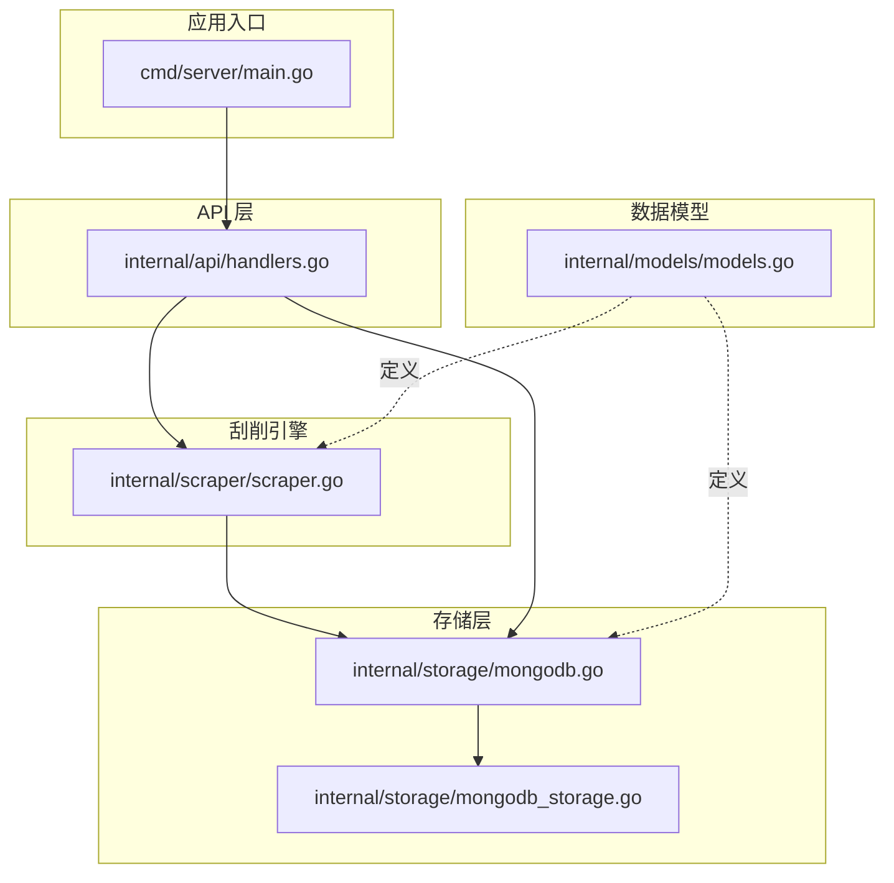
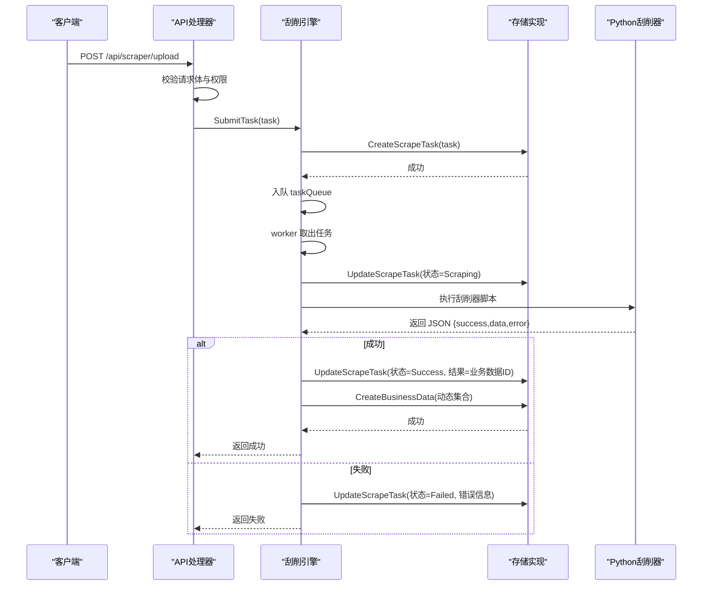
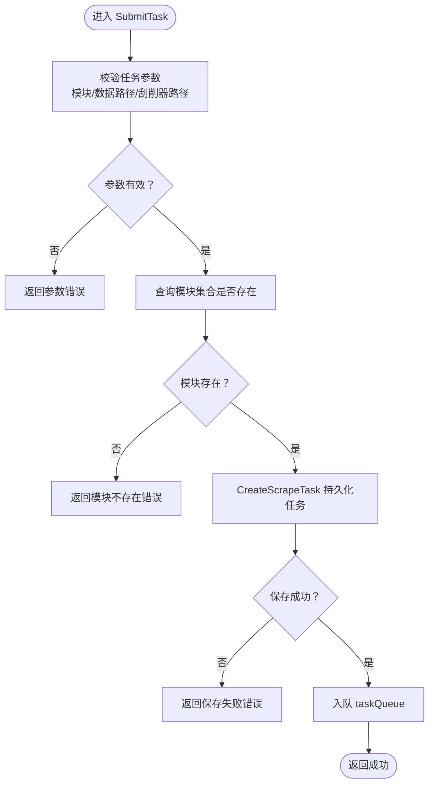
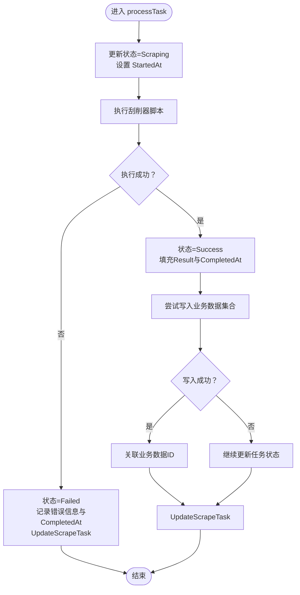
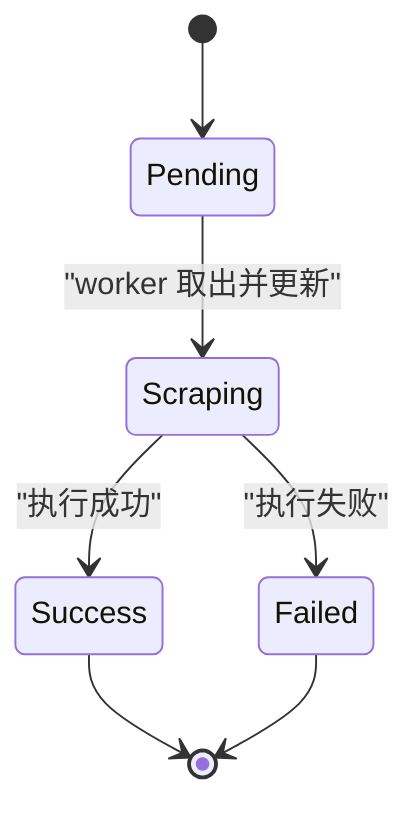
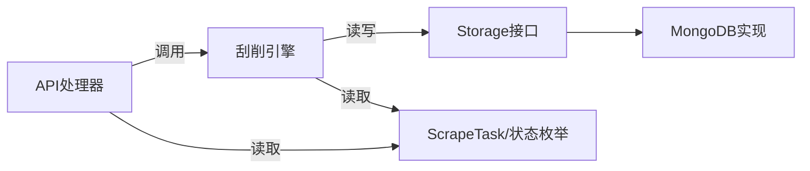

# 任务管理与生命周期

<cite>
**本文档引用的文件**
- [models.go](file://internal/models/models.go)
- [scraper.go](file://internal/scraper/scraper.go)
- [mongodb.go](file://internal/storage/mongodb.go)
- [mongodb_storage.go](file://internal/storage/mongodb_storage.go)
- [handlers.go](file://internal/api/handlers.go)
- [main.go](file://cmd/server/main.go)
- [config.yaml](file://configs/config.yaml)
</cite>

## 目录
1. [简介](#简介)
2. [项目结构](#项目结构)
3. [核心组件](#核心组件)
4. [架构总览](#架构总览)
5. [详细组件分析](#详细组件分析)
6. [依赖关系分析](#依赖关系分析)
7. [性能考虑](#性能考虑)
8. [故障排查指南](#故障排查指南)
9. [结论](#结论)
10. [附录](#附录)

## 简介
本文件面向“刮削任务管理”场景，系统性梳理任务从创建、参数校验、状态更新到结果存储的完整生命周期。重点覆盖以下内容：
- SubmitTask() 方法的实现逻辑：任务参数验证、模块存在性检查、数据库持久化与入队
- processTask() 方法的工作流程：状态转换、错误处理、结果反馈与业务数据落盘
- ScrapeTask 状态枚举与状态转换规则：Pending、Scraping、Success、Failed 的含义与触发条件
- 最佳实践与常见问题解决方案

## 项目结构
围绕任务管理的关键模块与文件如下：
- 数据模型层：定义任务结构、状态枚举与字段校验工具
- 存储层：抽象存储接口与 MongoDB 实现，负责任务与业务数据的 CRUD
- 刮削引擎：实现 SubmitTask()/processTask()，协调任务队列与执行
- API 层：提供任务提交、查询、重试、删除等 HTTP 接口
- 服务入口：启动 HTTP 服务、初始化存储与刮削系统

图表来源
- [main.go:24-150](file://cmd/server/main.go#L24-L150)
- [handlers.go:45-181](file://internal/api/handlers.go#L45-L181)
- [scraper.go:25-120](file://internal/scraper/scraper.go#L25-L120)
- [mongodb.go:14-90](file://internal/storage/mongodb.go#L14-L90)
- [mongodb_storage.go:27-51](file://internal/storage/mongodb_storage.go#L27-L51)
- [models.go:273-295](file://internal/models/models.go#L273-L295)

章节来源
- [main.go:24-150](file://cmd/server/main.go#L24-L150)
- [handlers.go:45-181](file://internal/api/handlers.go#L45-L181)
- [scraper.go:25-120](file://internal/scraper/scraper.go#L25-L120)
- [mongodb.go:14-90](file://internal/storage/mongodb.go#L14-L90)
- [mongodb_storage.go:27-51](file://internal/storage/mongodb_storage.go#L27-L51)
- [models.go:273-295](file://internal/models/models.go#L273-L295)

## 核心组件
- ScrapeTask 数据模型：包含模块、数据路径、刮削器路径、状态、结果、错误信息、时间戳与业务数据关联等字段
- ScrapeTaskStatus 枚举：pending/scraping/success/failed 四种状态
- Storage 接口：统一的任务与业务数据 CRUD 抽象
- MongoDB 实现：提供任务持久化、业务数据动态集合写入、索引管理等
- Scraper 接口与实现：SubmitTask() 提交任务；processTask() 执行任务；worker 协程池消费队列
- API Handlers：对外暴露任务相关的 HTTP 接口，调用 Scraper 与 Storage

章节来源
- [models.go:273-295](file://internal/models/models.go#L273-L295)
- [mongodb.go:14-90](file://internal/storage/mongodb.go#L14-L90)
- [mongodb_storage.go:571-600](file://internal/storage/mongodb_storage.go#L571-L600)
- [scraper.go:74-99](file://internal/scraper/scraper.go#L74-L99)
- [scraper.go:122-193](file://internal/scraper/scraper.go#L122-L193)
- [handlers.go:1200-1226](file://internal/api/handlers.go#L1200-L1226)

## 架构总览
下图展示从 API 请求到任务执行与结果存储的端到端流程。

图表来源
- [handlers.go:1200-1226](file://internal/api/handlers.go#L1200-L1226)
- [scraper.go:74-99](file://internal/scraper/scraper.go#L74-L99)
- [scraper.go:122-193](file://internal/scraper/scraper.go#L122-L193)
- [scraper.go:195-231](file://internal/scraper/scraper.go#L195-L231)
- [scraper.go:233-288](file://internal/scraper/scraper.go#L233-L288)
- [mongodb_storage.go:571-600](file://internal/storage/mongodb_storage.go#L571-L600)
- [mongodb_storage.go:338-347](file://internal/storage/mongodb_storage.go#L338-L347)

## 详细组件分析

### SubmitTask() 方法实现逻辑
- 参数验证：确保模块、数据路径、刮削器路径非空
- 模块存在性检查：通过存储层查询模块集合是否存在
- 数据库持久化：创建 ScrapeTask 文档，设置创建/更新时间为当前时间
- 入队：将任务放入任务队列，等待 worker 消费

图表来源
- [scraper.go:74-99](file://internal/scraper/scraper.go#L74-L99)
- [mongodb_storage.go:571-577](file://internal/storage/mongodb_storage.go#L571-L577)

章节来源
- [scraper.go:74-99](file://internal/scraper/scraper.go#L74-L99)
- [mongodb_storage.go:571-577](file://internal/storage/mongodb_storage.go#L571-L577)

### processTask() 方法工作流程
- 状态转换：将任务状态置为 Scraping，并记录 StartedAt
- 执行刮削器：调用 Python 脚本，传入数据路径
- 成功分支：状态置为 Success，填充 Result，记录 CompletedAt；尝试将结果写入业务数据集合
- 失败分支：状态置为 Failed，记录 ErrorMessage 与 CompletedAt
- 无论成功与否，均调用 UpdateScrapeTask 持久化状态

图表来源
- [scraper.go:122-193](file://internal/scraper/scraper.go#L122-L193)
- [scraper.go:195-231](file://internal/scraper/scraper.go#L195-L231)
- [scraper.go:233-288](file://internal/scraper/scraper.go#L233-L288)

章节来源
- [scraper.go:122-193](file://internal/scraper/scraper.go#L122-L193)
- [scraper.go:195-231](file://internal/scraper/scraper.go#L195-L231)
- [scraper.go:233-288](file://internal/scraper/scraper.go#L233-L288)

### ScrapeTask 状态枚举与转换规则
- Pending：初始状态，由 API 提交时设定
- Scraping：worker 取出任务后，更新为 Scraping 并开始执行
- Success：执行成功，写入业务数据并标记完成
- Failed：执行失败，记录错误信息并标记完成

图表来源
- [models.go:273-280](file://internal/models/models.go#L273-L280)
- [scraper.go:132-140](file://internal/scraper/scraper.go#L132-L140)
- [scraper.go:162-167](file://internal/scraper/scraper.go#L162-L167)
- [scraper.go:144-160](file://internal/scraper/scraper.go#L144-L160)

章节来源
- [models.go:273-280](file://internal/models/models.go#L273-L280)
- [scraper.go:132-140](file://internal/scraper/scraper.go#L132-L140)
- [scraper.go:162-167](file://internal/scraper/scraper.go#L162-L167)
- [scraper.go:144-160](file://internal/scraper/scraper.go#L144-L160)

### 任务管理最佳实践
- 参数校验前置：在 API 层与 SubmitTask() 中双重校验，避免非法任务进入队列
- 模块治理：确保模块集合存在后再提交任务，防止运行期异常
- 结果落盘：优先保证业务数据写入成功，再更新任务状态，避免状态与数据不一致
- 错误隔离：失败时记录详细错误信息，便于定位问题
- 幂等与重试：支持重试接口，清理状态后重新入队
- 监控与日志：充分利用 worker 日志与状态变更日志进行可观测性

章节来源
- [handlers.go:1266-1302](file://internal/api/handlers.go#L1266-L1302)
- [scraper.go:144-160](file://internal/scraper/scraper.go#L144-L160)
- [scraper.go:162-186](file://internal/scraper/scraper.go#L162-L186)

## 依赖关系分析
- API 层依赖 Scraper 与 Storage 接口，解耦具体实现
- Scraper 依赖 Storage 接口进行任务与业务数据的持久化
- Storage 接口由 MongoDB 实现，提供任务表与动态业务数据集合
- 模型层定义了任务状态与字段校验能力，贯穿整个流程

图表来源
- [handlers.go:1200-1226](file://internal/api/handlers.go#L1200-L1226)
- [scraper.go:74-99](file://internal/scraper/scraper.go#L74-L99)
- [mongodb.go:14-90](file://internal/storage/mongodb.go#L14-L90)
- [mongodb_storage.go:571-600](file://internal/storage/mongodb_storage.go#L571-L600)
- [models.go:273-295](file://internal/models/models.go#L273-L295)

章节来源
- [handlers.go:1200-1226](file://internal/api/handlers.go#L1200-L1226)
- [scraper.go:74-99](file://internal/scraper/scraper.go#L74-L99)
- [mongodb.go:14-90](file://internal/storage/mongodb.go#L14-L90)
- [mongodb_storage.go:571-600](file://internal/storage/mongodb_storage.go#L571-L600)
- [models.go:273-295](file://internal/models/models.go#L273-L295)

## 性能考虑
- 任务队列容量：默认队列大小为 1000，可根据负载调整
- worker 数量：默认 4 个 worker，可按 CPU/IO 调整
- 执行耗时：Python 刮削器执行时间直接影响吞吐，建议异步化与并发控制
- 存储写入：批量写入与索引优化可提升业务数据写入性能
- 日志级别：生产环境建议使用 info 或更高级别，减少 IO 开销

章节来源
- [scraper.go:34-45](file://internal/scraper/scraper.go#L34-L45)
- [scraper.go:40-42](file://internal/scraper/scraper.go#L40-L42)
- [config.yaml:20-26](file://configs/config.yaml#L20-L26)

## 故障排查指南
- 提交失败：检查模块是否存在、参数是否为空、存储连接是否正常
- 执行失败：查看刮削器返回的错误信息，确认脚本路径与数据路径正确
- 状态不一致：确认 UpdateScrapeTask 是否成功，必要时手动重试
- 业务数据缺失：确认动态集合创建与写入是否成功，检查字段校验规则
- 重试无效：确认重试接口是否正确清空错误信息与时间戳并重新入队

章节来源
- [scraper.go:74-99](file://internal/scraper/scraper.go#L74-L99)
- [scraper.go:144-160](file://internal/scraper/scraper.go#L144-L160)
- [scraper.go:162-186](file://internal/scraper/scraper.go#L162-L186)
- [scraper.go:233-288](file://internal/scraper/scraper.go#L233-L288)
- [handlers.go:1266-1302](file://internal/api/handlers.go#L1266-L1302)

## 结论
本文档系统梳理了刮削任务的生命周期与关键实现细节，明确了 SubmitTask() 与 processTask() 的职责边界与交互方式，给出了状态转换规则与最佳实践。通过合理的参数校验、模块治理、结果落盘与错误处理，可构建稳定可靠的刮削任务管理体系。

## 附录
- 状态枚举定义参考：[models.go:273-280](file://internal/models/models.go#L273-L280)
- 任务模型定义参考：[models.go:282-295](file://internal/models/models.go#L282-L295)
- 存储接口定义参考：[mongodb.go:14-90](file://internal/storage/mongodb.go#L14-L90)
- MongoDB 实现参考：[mongodb_storage.go:571-600](file://internal/storage/mongodb_storage.go#L571-L600)
- API 提交流程参考：[handlers.go:1200-1226](file://internal/api/handlers.go#L1200-L1226)
- 重试流程参考：[handlers.go:1266-1302](file://internal/api/handlers.go#L1266-L1302)