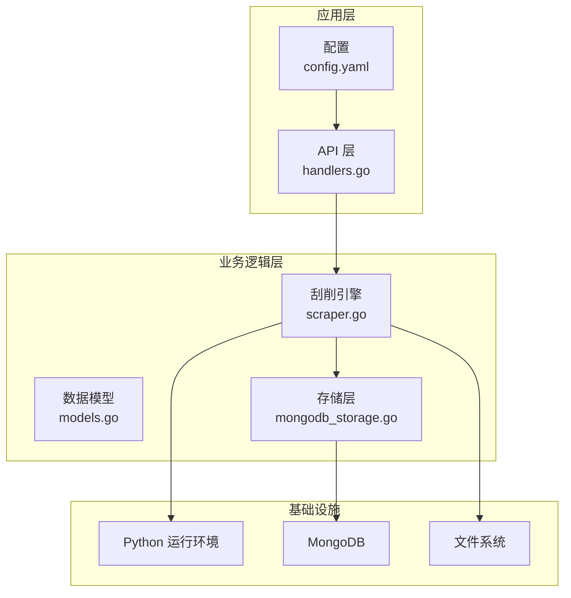
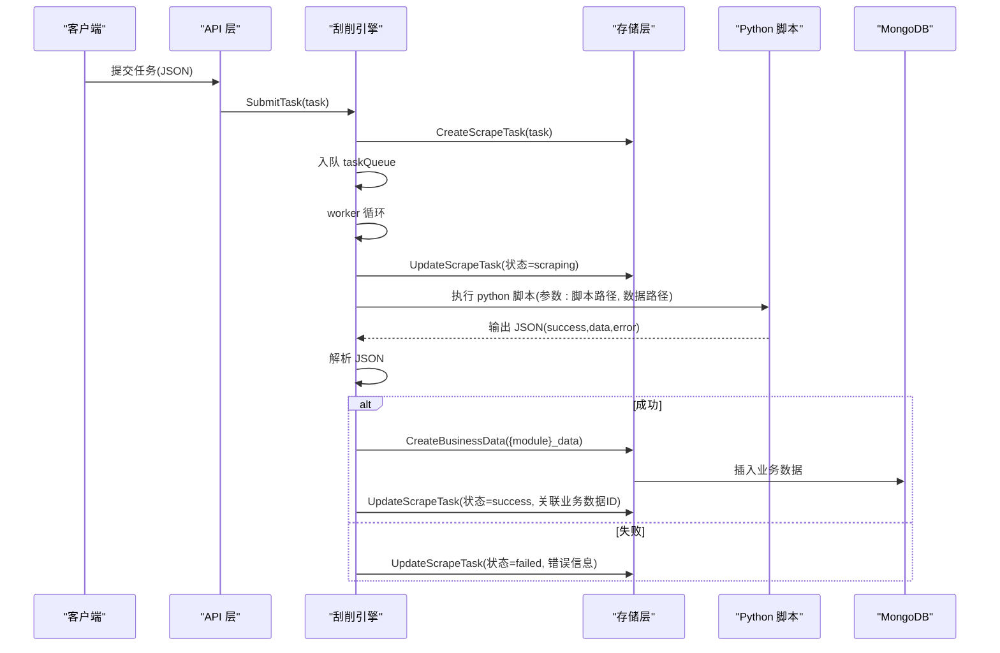
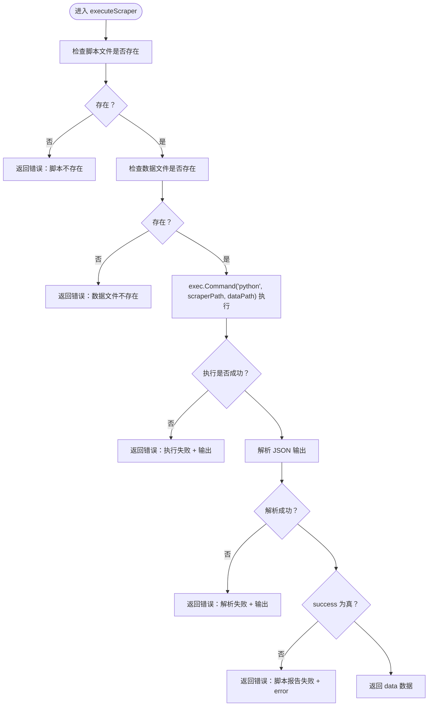
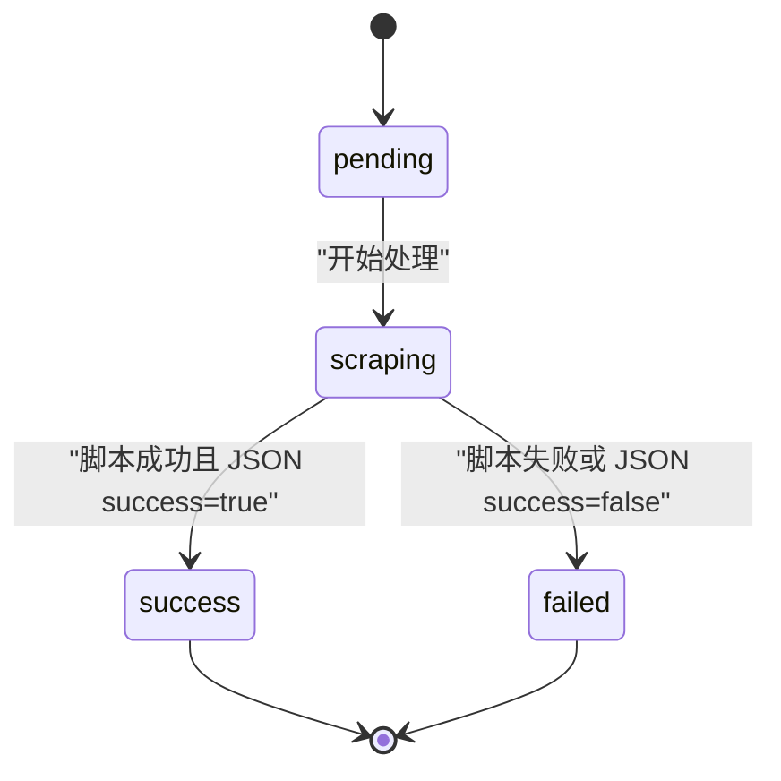
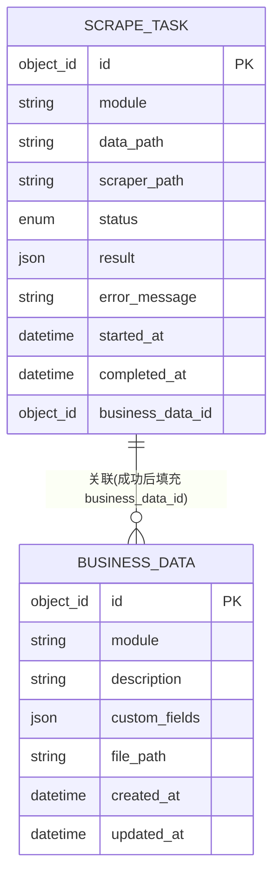
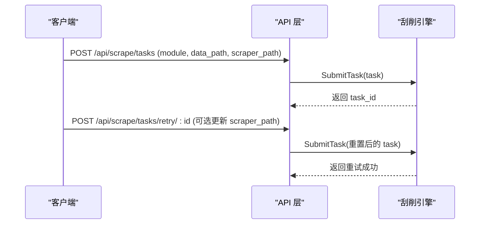
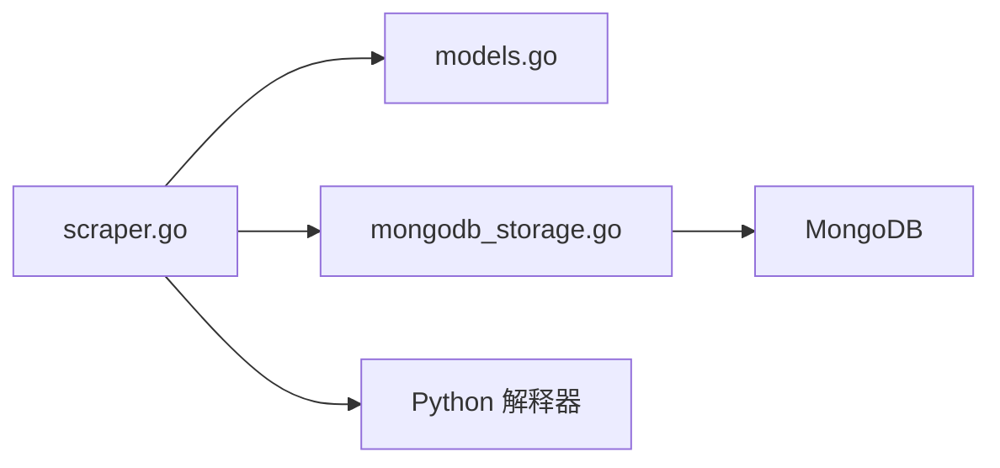

# 刮削器执行引擎

<cite>
**本文引用的文件**
- [scraper.go](file://internal/scraper/scraper.go)
- [implementation.md](file://docs/modules/scraper/implementation.md)
- [models.go](file://internal/models/models.go)
- [mongodb_storage.go](file://internal/storage/mongodb_storage.go)
- [handlers.go](file://internal/api/handlers.go)
- [main.go](file://cmd/server/main.go)
- [config.yaml](file://configs/config.yaml)
- [main.go](file://cmdenscrape/main.go)
</cite>

## 目录
1. [简介](#简介)
2. [项目结构](#项目结构)
3. [核心组件](#核心组件)
4. [架构总览](#架构总览)
5. [详细组件分析](#详细组件分析)
6. [依赖分析](#依赖分析)
7. [性能考虑](#性能考虑)
8. [故障排查指南](#故障排查指南)
9. [结论](#结论)
10. [附录](#附录)

## 简介
本文件为“刮削器执行引擎”的全面技术文档，聚焦于 executeScraper() 方法的实现机制与运行流程，涵盖：
- Python 脚本执行、命令行参数传递与输出解析
- 刮削器输入输出格式规范（数据文件路径、执行参数、JSON 输出）
- 错误处理机制（文件存在性检查、执行失败捕获、错误信息传递）
- 刮削结果数据结构（success 标志、data 数据、error 消息）与后续存储
- 开发指南（Python 脚本编写规范、数据格式要求、调试技巧）

## 项目结构
- 核心执行引擎位于 internal/scraper/scraper.go，包含 Scraper 接口、Worker Pool、任务提交与处理、Python 脚本执行与输出解析等逻辑
- 数据模型位于 internal/models/models.go，定义 ScrapeTask、BusinessData、字段校验等
- 存储层位于 internal/storage/mongodb_storage.go，提供刮削任务与业务数据的持久化能力
- API 层位于 internal/api/handlers.go，提供任务提交、重试、查询等接口
- 服务入口与配置位于 cmd/server/main.go 与 configs/config.yaml
- 测试数据生成工具位于 cmdenscrape/main.go

**图示来源**
- [scraper.go:1-289](file://internal/scraper/scraper.go#L1-L289)
- [models.go:1-365](file://internal/models/models.go#L1-L365)
- [mongodb_storage.go:1-200](file://internal/storage/mongodb_storage.go#L1-L200)
- [handlers.go:1212-1264](file://internal/api/handlers.go#L1212-L1264)
- [config.yaml:1-26](file://configs/config.yaml#L1-L26)

**章节来源**
- [scraper.go:1-289](file://internal/scraper/scraper.go#L1-L289)
- [models.go:1-365](file://internal/models/models.go#L1-L365)
- [mongodb_storage.go:1-200](file://internal/storage/mongodb_storage.go#L1-L200)
- [handlers.go:1212-1264](file://internal/api/handlers.go#L1212-L1264)
- [config.yaml:1-26](file://configs/config.yaml#L1-L26)

## 核心组件
- Scraper 接口与实现：负责任务提交、Worker Pool 启动、任务处理、Python 脚本执行与结果解析、业务数据落库
- ScrapeTask 模型：描述一次刮削任务的状态、时间戳、结果与错误信息
- Storage 接口：提供刮削任务与业务数据的 CRUD 能力
- API Handler：对外暴露任务提交、重试、查询等 HTTP 接口

**章节来源**
- [scraper.go:18-45](file://internal/scraper/scraper.go#L18-L45)
- [models.go:282-295](file://internal/models/models.go#L282-L295)
- [mongodb_storage.go:570-600](file://internal/storage/mongodb_storage.go#L570-L600)
- [handlers.go:1212-1264](file://internal/api/handlers.go#L1212-L1264)

## 架构总览
执行引擎采用 Worker Pool + Channel 的并发模型，任务通过 API 提交后进入队列，由多个 worker 并发消费。每个 worker 在处理任务时会：
1) 更新任务状态为“刮削中”
2) 调用 executeScraper() 执行 Python 脚本
3) 解析脚本输出的 JSON 结果
4) 将成功结果写入业务数据集合，并回填任务的业务数据 ID
5) 更新任务状态为“成功”或“失败”

**图示来源**
- [scraper.go:75-99](file://internal/scraper/scraper.go#L75-L99)
- [scraper.go:123-193](file://internal/scraper/scraper.go#L123-L193)
- [scraper.go:196-231](file://internal/scraper/scraper.go#L196-L231)
- [mongodb_storage.go:570-600](file://internal/storage/mongodb_storage.go#L570-L600)
- [mongodb_storage.go:338-347](file://internal/storage/mongodb_storage.go#L338-L347)

**章节来源**
- [scraper.go:48-72](file://internal/scraper/scraper.go#L48-L72)
- [scraper.go:102-120](file://internal/scraper/scraper.go#L102-L120)
- [implementation.md:21-46](file://docs/modules/scraper/implementation.md#L21-L46)

## 详细组件分析

### executeScraper() 方法详解
- 输入参数
  - scraperPath：Python 脚本绝对路径
  - dataPath：数据文件绝对路径
- 执行步骤
  1) 文件存在性检查：分别检查脚本与数据文件是否存在
  2) 调用外部进程：以“python 脚本路径 数据路径”的方式执行
  3) 输出解析：期望脚本向标准输出输出 JSON，格式包含 success、data、error 三字段
  4) 结果判定：当 success 为 true 时返回 data；否则抛出错误
- 错误处理
  - 文件不存在、脚本执行失败、JSON 解析失败、success=false 均视为失败

**图示来源**
- [scraper.go:196-231](file://internal/scraper/scraper.go#L196-L231)

**章节来源**
- [scraper.go:196-231](file://internal/scraper/scraper.go#L196-L231)
- [implementation.md:175-225](file://docs/modules/scraper/implementation.md#L175-L225)

### 刮削任务生命周期与状态流转
- 提交任务：参数校验、模块存在性检查、持久化、入队
- 处理任务：更新状态为“刮削中”，执行脚本，解析输出，成功则落库并回填业务数据 ID，失败则记录错误信息
- 状态枚举：pending、scraping、success、failed

**图示来源**
- [models.go:273-280](file://internal/models/models.go#L273-L280)
- [scraper.go:123-193](file://internal/scraper/scraper.go#L123-L193)

**章节来源**
- [scraper.go:75-99](file://internal/scraper/scraper.go#L75-L99)
- [scraper.go:123-193](file://internal/scraper/scraper.go#L123-L193)
- [models.go:273-280](file://internal/models/models.go#L273-L280)

### 刮削结果数据结构与存储
- 刮削器输出 JSON 规范
  - success: 布尔值，true 表示成功
  - data: 对象，包含具体刮削结果字段
  - error: 字符串，当 success=false 时提供错误信息
- 存储增强字段
  - 在保存业务数据前，引擎会自动注入 scrape_path、data_path、module、task_id、scraped_at 等元信息
- 字段验证策略
  - 读取模块字段定义并对结果进行验证，验证失败仅记录警告，不影响数据入库

**图示来源**
- [models.go:282-295](file://internal/models/models.go#L282-L295)
- [models.go:227-234](file://internal/models/models.go#L227-L234)
- [scraper.go:234-288](file://internal/scraper/scraper.go#L234-L288)

**章节来源**
- [scraper.go:234-288](file://internal/scraper/scraper.go#L234-L288)
- [implementation.md:227-276](file://docs/modules/scraper/implementation.md#L227-L276)

### API 交互与任务重试
- 提交任务：接收 module、data_path、scraper_path、description，创建 pending 任务并入队
- 重试任务：支持更新脚本路径并重置状态为 pending，重新入队

**图示来源**
- [handlers.go:1212-1264](file://internal/api/handlers.go#L1212-L1264)
- [implementation.md:282-347](file://docs/modules/scraper/implementation.md#L282-L347)

**章节来源**
- [handlers.go:1212-1264](file://internal/api/handlers.go#L1212-L1264)
- [implementation.md:282-347](file://docs/modules/scraper/implementation.md#L282-L347)

## 依赖分析
- 组件耦合
  - scraper.go 依赖 models 与 storage 接口，与 Python 脚本通过外部进程交互，与 MongoDB 通过 storage 接口交互
- 外部依赖
  - Python 解释器（用于执行脚本）
  - MongoDB（持久化任务与业务数据）
- 潜在风险
  - Python 脚本路径与数据路径必须为真实存在的绝对路径
  - JSON 输出必须严格遵循 success/data/error 三字段契约

**图示来源**
- [scraper.go:1-289](file://internal/scraper/scraper.go#L1-L289)
- [mongodb_storage.go:1-200](file://internal/storage/mongodb_storage.go#L1-L200)

**章节来源**
- [scraper.go:1-289](file://internal/scraper/scraper.go#L1-L289)
- [mongodb_storage.go:1-200](file://internal/storage/mongodb_storage.go#L1-L200)

## 性能考虑
- Worker 数量：默认 4 个，可通过环境变量调整，建议根据 CPU 与 I/O 负载平衡
- 队列容量：当前为 1000，可根据任务积压情况调优
- I/O 密集：Python 脚本执行与 MongoDB 写入为主要瓶颈，建议优化脚本与数据库索引
- 日志级别：生产环境建议提升日志级别以减少开销

[本节为通用指导，无需特定文件引用]

## 故障排查指南
- 常见错误与定位
  - “脚本不存在/数据文件不存在”：确认 scraperPath 与 dataPath 是否正确且可访问
  - “执行失败 + 输出”：查看脚本 stderr/stdout，定位异常原因
  - “解析失败 + 输出”：检查脚本是否严格输出 JSON 且符合 success/data/error 契约
  - “脚本报告失败 + error”：根据 error 字段修正脚本逻辑或输入数据
- 存储与状态
  - 若业务数据入库失败，任务状态仍会更新为“成功”，但不会回填 business_data_id
  - 任务状态与错误信息可在数据库中查询核对

**章节来源**
- [scraper.go:196-231](file://internal/scraper/scraper.go#L196-L231)
- [scraper.go:142-193](file://internal/scraper/scraper.go#L142-L193)
- [mongodb_storage.go:570-600](file://internal/storage/mongodb_storage.go#L570-L600)

## 结论
本执行引擎以简洁可靠的契约（Python 脚本 + JSON 输出）与清晰的状态机设计，实现了高可靠的任务调度与结果落库。通过严格的错误处理与非阻塞字段验证，保证了系统的韧性与可维护性。

[本节为总结，无需特定文件引用]

## 附录

### 刮削器输入输出格式规范
- 输入
  - 命令行参数：python 脚本路径 数据路径
  - 数据文件：由 dataPath 指定，脚本按需读取
- 输出（标准输出 JSON）
  - success: 布尔
  - data: 对象（任意键值对）
  - error: 字符串（当 success=false 时提供）

**章节来源**
- [scraper.go:196-231](file://internal/scraper/scraper.go#L196-L231)
- [implementation.md:175-225](file://docs/modules/scraper/implementation.md#L175-L225)

### 开发指南
- Python 脚本编写规范
  - 严格遵守输出契约，确保输出合法 JSON
  - 处理异常时设置 success=false 并提供 error 信息
  - 保持幂等性与可重复执行能力
- 数据格式要求
  - data 字段为任意对象，建议包含可追踪字段（如来源、版本等）
- 调试技巧
  - 在本地先独立运行脚本，验证输出 JSON 正确性
  - 使用最小化数据文件复现问题
  - 逐步缩小范围：先验证文件存在性，再验证 JSON 格式，最后验证业务逻辑

**章节来源**
- [implementation.md:140-150](file://docs/modules/scraper/implementation.md#L140-L150)

### 初始化与生命周期
- 启动：创建 Scraper 实例并 Start，随后在信号处理中优雅 Stop
- 配置：通过环境变量控制 worker 数量，数据库连接信息来自配置文件

**章节来源**
- [implementation.md:21-46](file://docs/modules/scraper/implementation.md#L21-L46)
- [config.yaml:1-26](file://configs/config.yaml#L1-L26)
- [main.go](file://cmd/server/main.go)

### 测试数据生成
- 提供 cmdenscrape/main.go 用于快速生成测试刮削任务，便于集成测试与演示

**章节来源**
- [main.go:14-110](file://cmdenscrape/main.go#L14-L110)