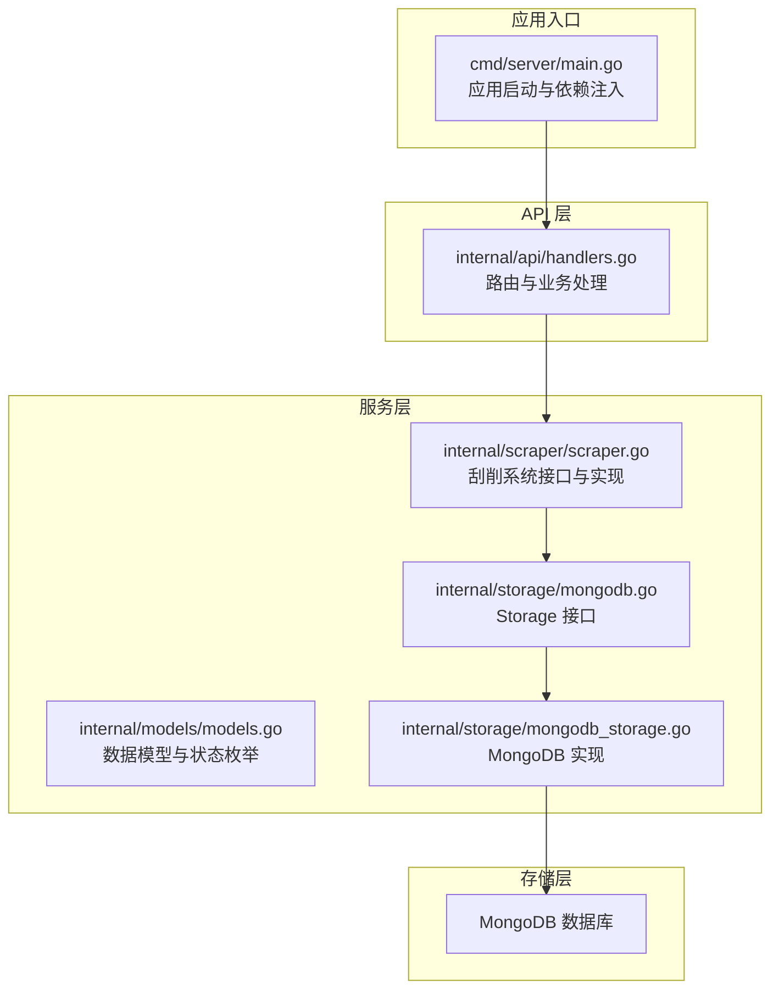
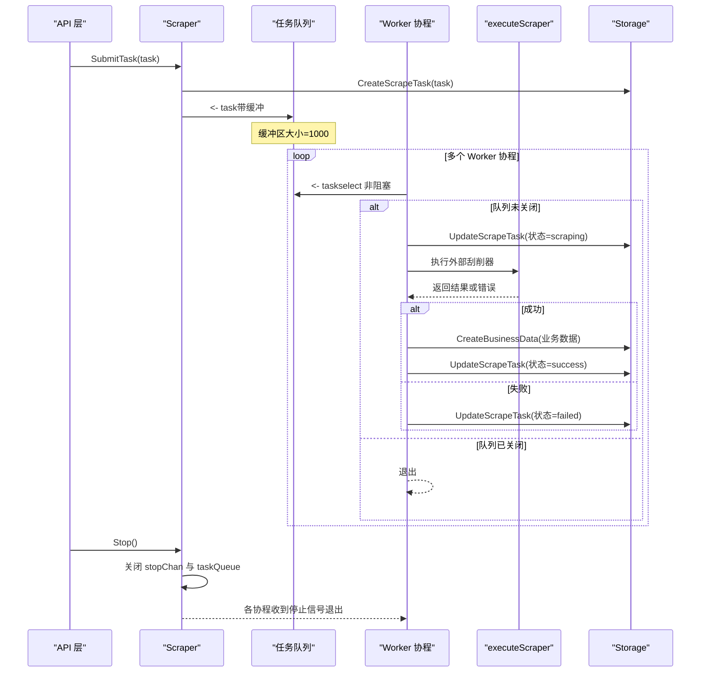
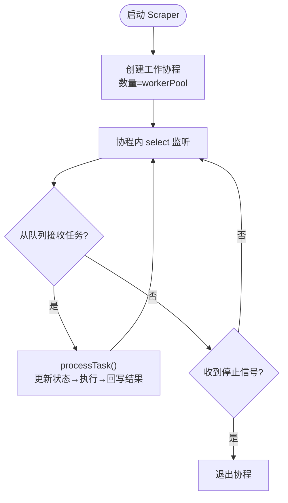
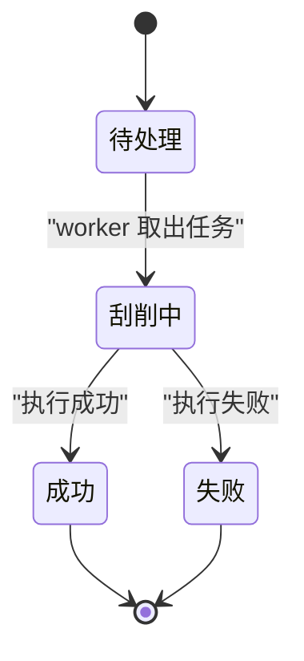
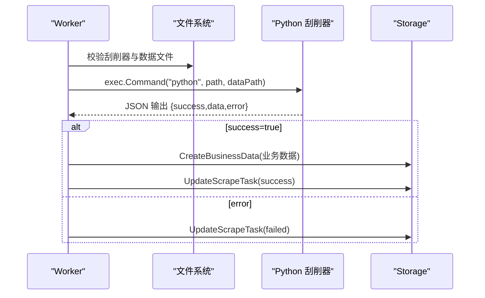
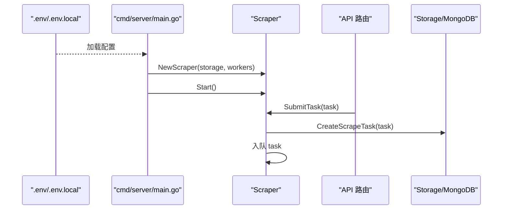
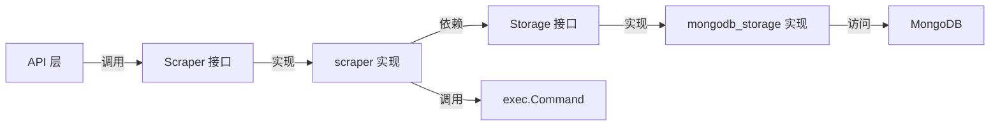

# 刮削系统架构设计

<cite>
**本文档引用的文件**
- [scraper.go](file://internal/scraper/scraper.go)
- [main.go](file://cmd/server/main.go)
- [models.go](file://internal/models/models.go)
- [mongodb_storage.go](file://internal/storage/mongodb_storage.go)
- [mongodb.go](file://internal/storage/mongodb.go)
- [handlers.go](file://internal/api/handlers.go)
- [architecture.md](file://docs/architecture.md)
- [config.yaml](file://configs/config.yaml)
- [main.go](file://cmdenscrape/main.go)
</cite>

## 目录
1. [简介](#简介)
2. [项目结构](#项目结构)
3. [核心组件](#核心组件)
4. [架构总览](#架构总览)
5. [详细组件分析](#详细组件分析)
6. [依赖关系分析](#依赖关系分析)
7. [性能考虑](#性能考虑)
8. [故障排查指南](#故障排查指南)
9. [结论](#结论)
10. [附录](#附录)

## 简介
本文件面向刮削系统架构设计，围绕异步任务处理模式、工作协程池设计与任务队列管理机制展开，深入解释 Scraper 接口的设计原则与实现细节，阐述系统如何通过 select 语句实现非阻塞的任务消费与优雅停机，以及任务队列容量、工作协程数量与并发控制策略。文档同时提供架构图与组件交互流程，帮助开发者快速理解系统运行原理与扩展点。

## 项目结构
后端采用分层架构：API 层负责路由与中间件，服务层包含认证、权限、业务与刮削系统，存储层对接 MongoDB。刮削系统位于 internal/scraper，通过 channel 与 goroutine 实现异步处理，并通过 Storage 接口与数据库交互。



**图表来源**
- [main.go:65-69](file://cmd/server/main.go#L65-L69)
- [handlers.go:142-151](file://internal/api/handlers.go#L142-L151)
- [scraper.go:18-45](file://internal/scraper/scraper.go#L18-L45)
- [mongodb.go:14-90](file://internal/storage/mongodb.go#L14-L90)
- [mongodb_storage.go:27-51](file://internal/storage/mongodb_storage.go#L27-L51)

**章节来源**
- [architecture.md:1-80](file://docs/architecture.md#L1-L80)
- [main.go:65-69](file://cmd/server/main.go#L65-L69)

## 核心组件
- Scraper 接口：定义 SubmitTask、Start、Stop 三个核心方法，统一异步任务提交、系统启动与优雅停机。
- scraper 实现：内部维护任务队列、工作协程数量、停止通道；通过 select 实现非阻塞消费与优雅退出。
- Storage 接口：抽象 MongoDB 访问，提供刮削任务与业务数据的持久化能力。
- ScrapeTask 模型：包含任务状态、时间戳、结果与错误信息，支持状态流转与持久化。

**章节来源**
- [scraper.go:18-45](file://internal/scraper/scraper.go#L18-L45)
- [scraper.go:74-99](file://internal/scraper/scraper.go#L74-L99)
- [scraper.go:48-72](file://internal/scraper/scraper.go#L48-L72)
- [mongodb.go:64-90](file://internal/storage/mongodb.go#L64-L90)
- [models.go:273-311](file://internal/models/models.go#L273-L311)

## 架构总览
刮削系统采用“生产者-消费者”模式：API 层提交任务到带缓冲的 channel，多个工作协程并发消费任务，执行外部 Python 刮削器并回写结果。系统通过 stopChan 与队列关闭实现优雅停机。



**图表来源**
- [scraper.go:74-99](file://internal/scraper/scraper.go#L74-L99)
- [scraper.go:101-120](file://internal/scraper/scraper.go#L101-L120)
- [scraper.go:122-193](file://internal/scraper/scraper.go#L122-L193)
- [scraper.go:195-231](file://internal/scraper/scraper.go#L195-L231)
- [mongodb_storage.go:571-600](file://internal/storage/mongodb_storage.go#L571-L600)

## 详细组件分析

### Scraper 接口与实现
- 设计原则
  - 通过接口解耦：API 层只依赖 Scraper 接口，便于替换实现与测试。
  - 异步处理：任务提交立即返回，实际执行在后台协程池中完成。
  - 优雅停机：stopChan 与队列关闭确保在无丢失任务的前提下退出。
- 核心方法
  - Start：根据配置创建工作协程数量，启动后记录日志。
  - Stop：关闭停止通道与任务队列，随后返回。
  - SubmitTask：参数校验、模块存在性检查、持久化任务、入队并记录日志。

```mermaid
classDiagram
class Scraper {
<<interface>>
+SubmitTask(task) error
+Start() error
+Stop() error
}
class scraper {
-storage Storage
-taskQueue chan*ScrapeTask
-workerPool int
-stopChan chan struct
+Start() error
+Stop() error
+SubmitTask(task) error
-worker(id) void
-processTask(task, workerID) void
-executeScraper(path, data) map[string]interface{}
-saveScrapedData(task, data) ObjectID
}
Scraper <|.. scraper : "实现"
```

**图表来源**
- [scraper.go:18-45](file://internal/scraper/scraper.go#L18-L45)
- [scraper.go:48-120](file://internal/scraper/scraper.go#L48-L120)
- [scraper.go:122-288](file://internal/scraper/scraper.go#L122-L288)

**章节来源**
- [scraper.go:18-45](file://internal/scraper/scraper.go#L18-L45)
- [scraper.go:48-72](file://internal/scraper/scraper.go#L48-L72)
- [scraper.go:74-99](file://internal/scraper/scraper.go#L74-L99)

### 任务队列与工作协程池
- 队列设计
  - 使用带缓冲的 channel，缓冲区大小为 1000，避免瞬时高峰导致阻塞。
  - 队列关闭后，所有协程会感知并退出，保证优雅停机。
- 协程池
  - 默认工作协程数量为 4，可通过环境变量配置。
  - 每个协程通过 select 同时监听任务队列与停止信号，实现非阻塞消费与快速响应。
- 并发控制
  - 通过固定数量的工作协程限制并发度，避免资源争用。
  - 任务处理过程包含状态更新、外部进程调用与数据库写入，均在单协程内串行执行，简化并发复杂度。



**图表来源**
- [scraper.go:52-54](file://internal/scraper/scraper.go#L52-L54)
- [scraper.go:105-120](file://internal/scraper/scraper.go#L105-L120)

**章节来源**
- [scraper.go:34-45](file://internal/scraper/scraper.go#L34-L45)
- [scraper.go:101-120](file://internal/scraper/scraper.go#L101-L120)

### 任务状态与持久化
- 状态枚举：pending、scraping、success、failed，贯穿任务生命周期。
- 状态流转：提交后进入 pending，被 worker 取出后更新为 scraping，执行成功/失败后分别更新为 success/failed，并记录完成时间与结果。
- 持久化：通过 Storage 接口实现任务与业务数据的创建、更新与查询。



**图表来源**
- [models.go:273-280](file://internal/models/models.go#L273-L280)
- [scraper.go:122-193](file://internal/scraper/scraper.go#L122-L193)
- [mongodb_storage.go:571-600](file://internal/storage/mongodb_storage.go#L571-L600)

**章节来源**
- [models.go:273-311](file://internal/models/models.go#L273-L311)
- [scraper.go:122-193](file://internal/scraper/scraper.go#L122-L193)
- [mongodb_storage.go:571-600](file://internal/storage/mongodb_storage.go#L571-L600)

### 外部刮削器执行与结果回写
- 执行流程：校验文件存在性→调用外部 Python 刮削器→解析 JSON 输出→根据结果更新任务状态与业务数据。
- 结果回写：将刮削结果合并到业务数据，执行字段验证（非阻塞告警），写入 {module}_data 集合，并更新任务关联的业务数据 ID。



**图表来源**
- [scraper.go:195-231](file://internal/scraper/scraper.go#L195-L231)
- [scraper.go:233-288](file://internal/scraper/scraper.go#L233-L288)
- [mongodb_storage.go:338-347](file://internal/storage/mongodb_storage.go#L338-L347)

**章节来源**
- [scraper.go:195-231](file://internal/scraper/scraper.go#L195-L231)
- [scraper.go:233-288](file://internal/scraper/scraper.go#L233-L288)

### API 集成与启动流程
- 启动流程：加载环境变量→初始化日志→初始化存储→启动刮削系统→初始化其他服务→注册路由→启动 HTTP 服务器。
- API 集成：/api/scraper/upload 路由调用 Scraper.SubmitTask，完成任务提交与入队。



**图表来源**
- [main.go:24-69](file://cmd/server/main.go#L24-L69)
- [handlers.go:142-151](file://internal/api/handlers.go#L142-L151)
- [mongodb_storage.go:571-577](file://internal/storage/mongodb_storage.go#L571-L577)

**章节来源**
- [main.go:24-69](file://cmd/server/main.go#L24-L69)
- [handlers.go:142-151](file://internal/api/handlers.go#L142-L151)

## 依赖关系分析
- 组件耦合
  - API 层依赖 Scraper 接口，通过构造函数注入，降低耦合度。
  - Scraper 依赖 Storage 接口，实现与数据库解耦。
- 外部依赖
  - 外部 Python 刮削器通过 exec.Command 调用，需确保文件存在且可执行。
  - MongoDB 驱动用于持久化任务与业务数据。



**图表来源**
- [handlers.go:142-151](file://internal/api/handlers.go#L142-L151)
- [scraper.go:18-45](file://internal/scraper/scraper.go#L18-L45)
- [mongodb.go:14-90](file://internal/storage/mongodb.go#L14-L90)
- [mongodb_storage.go:27-51](file://internal/storage/mongodb_storage.go#L27-L51)

**章节来源**
- [handlers.go:33-43](file://internal/api/handlers.go#L33-L43)
- [scraper.go:18-45](file://internal/scraper/scraper.go#L18-L45)
- [mongodb.go:14-90](file://internal/storage/mongodb.go#L14-L90)

## 性能考虑
- 队列缓冲：1000 的缓冲区可平滑瞬时高峰，建议结合任务吞吐与 CPU 资源评估是否需要调整。
- 协程数量：默认 4，适合 I/O 密集型场景；若外部刮削器 CPU 密集，可适当减少以避免上下文切换开销。
- 外部进程：每次任务都会启动 Python 进程，建议优化刮削器性能或引入进程池复用。
- 并发控制：单任务在协程内串行处理，避免锁竞争；多任务通过协程池并发执行。
- 存储压力：任务与业务数据写入 MongoDB，建议对 {module}_data 与 scrape_tasks 集合建立索引以提升查询性能。

## 故障排查指南
- 任务无法入队
  - 检查模块是否存在：SubmitTask 会校验模块对应的集合是否存在。
  - 检查队列是否已关闭：Stop 后队列关闭，新任务将无法入队。
- 协程未退出
  - 确认 Stop 是否正确关闭 stopChan 与 taskQueue。
  - 检查是否有阻塞在 I/O 的协程（例如外部进程长时间无响应）。
- 外部刮削器失败
  - 检查刮削器与数据文件路径是否正确。
  - 查看返回的 JSON 输出，确认 success 字段与 error 字段。
- 状态异常
  - 确认 UpdateScrapeTask 是否成功，检查 scraping/failed/success 的状态流转。
  - 检查业务数据是否成功写入 {module}_data 集合。

**章节来源**
- [scraper.go:74-99](file://internal/scraper/scraper.go#L74-L99)
- [scraper.go:101-120](file://internal/scraper/scraper.go#L101-L120)
- [scraper.go:195-231](file://internal/scraper/scraper.go#L195-L231)
- [mongodb_storage.go:592-600](file://internal/storage/mongodb_storage.go#L592-L600)

## 结论
刮削系统通过“接口 + 协程池 + 带缓冲 channel”的架构实现了高可用、可扩展的异步任务处理。select 语句确保非阻塞消费与优雅停机，Storage 接口提供与数据库解耦的能力。通过合理的队列容量与协程数量配置，系统可在保证吞吐的同时控制资源占用。建议在生产环境中结合监控指标持续优化队列与协程参数，并对外部进程与数据库索引进行针对性调优。

## 附录

### 配置参数与默认值
- 工作协程数量：默认 4，可通过环境变量配置。
- 任务队列缓冲：默认 1000。
- 服务器监听：默认 0.0.0.0:8080。

**章节来源**
- [config.yaml:20-26](file://configs/config.yaml#L20-L26)
- [main.go:159-166](file://cmd/server/main.go#L159-L166)
- [scraper.go:34-45](file://internal/scraper/scraper.go#L34-L45)

### 测试数据生成
- 提供独立的命令行工具生成测试刮削任务，便于本地调试与压测。

**章节来源**
- [main.go:14-44](file://cmdenscrape/main.go#L14-L44)