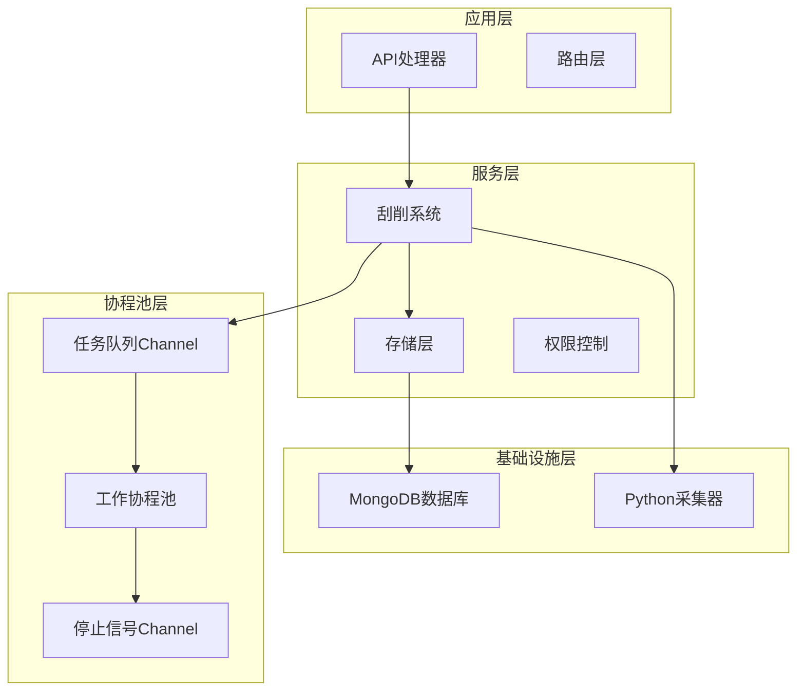
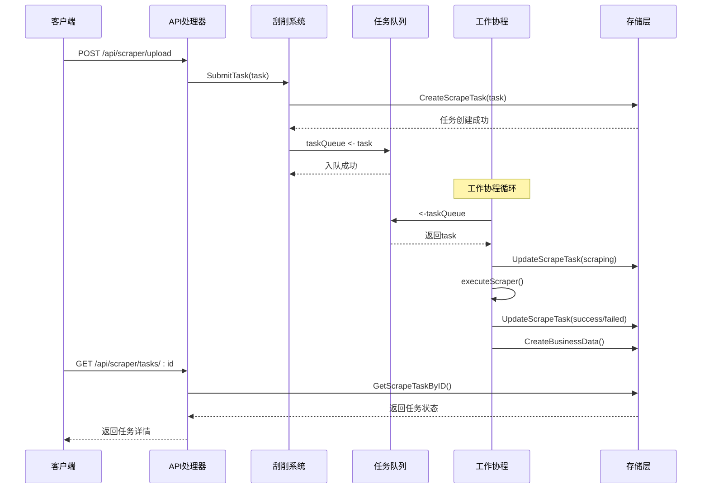
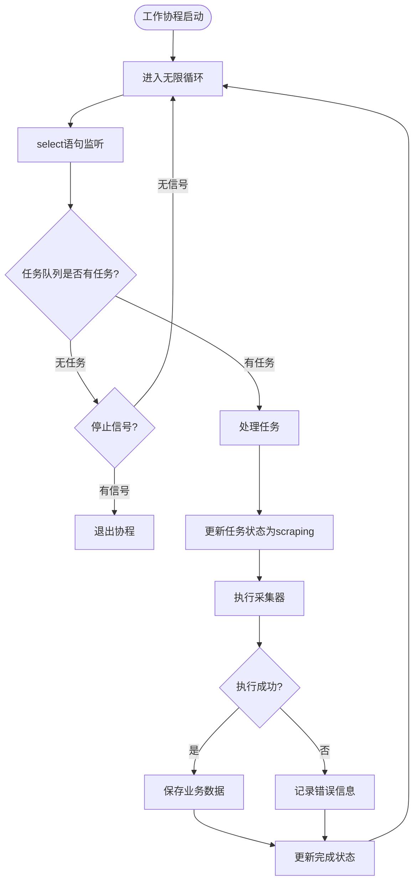
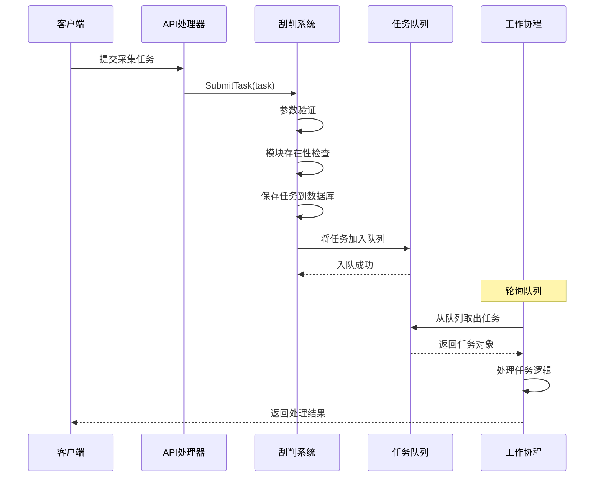
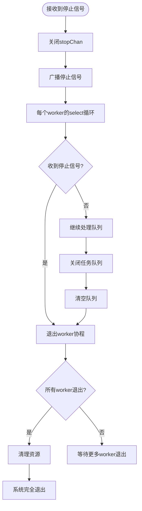
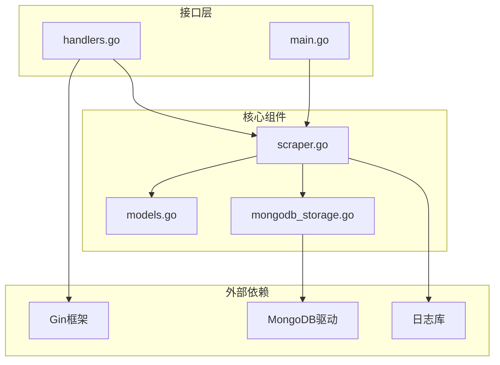
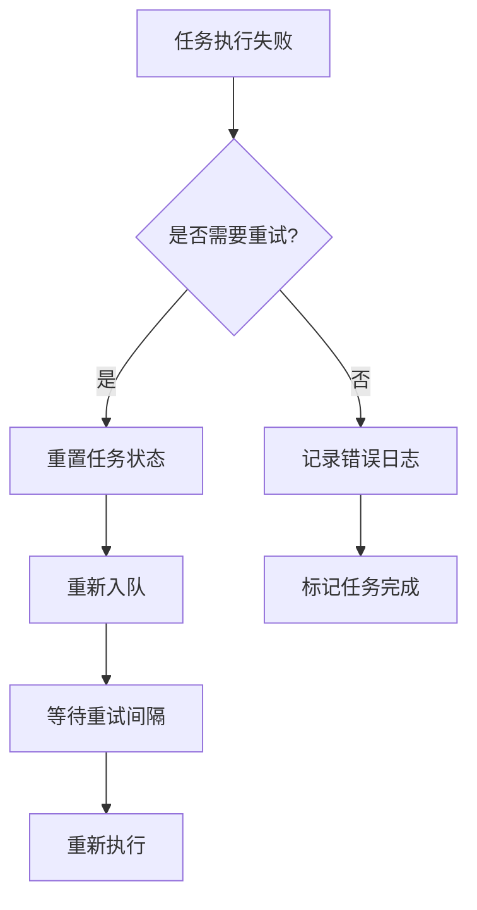

# 工作协程池管理

<cite>
**本文档引用的文件**
- [scraper.go](file://internal/scraper/scraper.go)
- [models.go](file://internal/models/models.go)
- [mongodb_storage.go](file://internal/storage/mongodb_storage.go)
- [handlers.go](file://internal/api/handlers.go)
- [main.go](file://cmd/server/main.go)
- [requirements.md](file://docs/modules/scraper/requirements.md)
- [tech.md](file://docs/modules/scraper/tech.md)
- [implementation.md](file://docs/modules/scraper/implementation.md)
</cite>

## 目录
1. [简介](#简介)
2. [项目结构](#项目结构)
3. [核心组件](#核心组件)
4. [架构概览](#架构概览)
5. [详细组件分析](#详细组件分析)
6. [依赖关系分析](#依赖关系分析)
7. [性能考虑](#性能考虑)
8. [故障排除指南](#故障排除指南)
9. [结论](#结论)

## 简介

本文档详细介绍了数据采集系统中的工作协程池管理机制。该系统采用Go语言实现，基于goroutine worker pool + channel队列的架构模式，用于异步执行外部数据采集器脚本，并将采集结果自动存入业务数据库。

系统的核心特性包括：
- 异步任务处理，不阻塞HTTP请求
- 可配置的并发级别控制
- 优雅的停机机制
- 任务状态跟踪和持久化
- 错误隔离和故障恢复

## 项目结构

数据采集系统的整体架构采用分层设计，主要包含以下层次：



**图表来源**
- [scraper.go:26-44](file://internal/scraper/scraper.go#L26-L44)
- [main.go:65-69](file://cmd/server/main.go#L65-L69)

**章节来源**
- [main.go:24-150](file://cmd/server/main.go#L24-L150)
- [requirements.md:72-98](file://docs/modules/scraper/requirements.md#L72-L98)

## 核心组件

### 1. 刮削系统接口定义

刮削系统实现了统一的接口抽象，定义了任务提交、系统启动和停止的标准方法：

```mermaid
classDiagram
class Scraper {
<<interface>>
+SubmitTask(task) error
+Start() error
+Stop() error
}
class scraper {
-storage Storage
-taskQueue chan~*ScrapeTask~
-workerPool int
-stopChan chan struct{}
+NewScraper(storage, workerPool) Scraper
+Start() error
+Stop() error
+SubmitTask(task) error
+worker(id) void
+processTask(task, workerID) void
+executeScraper(path, dataPath) map[string]interface{}
+saveScrapedData(task, data) ObjectID
}
Scraper <|-- scraper : 实现
```

**图表来源**
- [scraper.go:18-44](file://internal/scraper/scraper.go#L18-L44)

### 2. 任务数据模型

系统使用强类型的数据模型来表示采集任务的状态和生命周期：

| 字段名 | 类型 | 描述 | 状态流转 |
|--------|------|------|----------|
| ID | ObjectID | 任务唯一标识符 | 创建时生成 |
| Module | string | 目标模块 | 提交时设置 |
| DataPath | string | 源数据文件路径 | 提交时设置 |
| ScraperPath | string | 采集器脚本路径 | 提交时设置 |
| Status | ScrapeTaskStatus | 任务状态 | pending → scraping → success/failed |
| Result | interface{} | 采集结果数据 | 成功时填充 |
| ErrorMessage | string | 错误信息 | 失败时填充 |
| StartedAt | *time.Time | 开始执行时间 | scraping时设置 |
| CompletedAt | *time.Time | 完成时间 | success/failed时设置 |
| BusinessDataID | ObjectID | 业务数据关联ID | 成功时设置 |

**章节来源**
- [models.go:273-295](file://internal/models/models.go#L273-L295)

## 架构概览

系统采用经典的生产者-消费者模式，结合goroutine池实现高并发的任务处理：



**图表来源**
- [scraper.go:74-99](file://internal/scraper/scraper.go#L74-L99)
- [scraper.go:101-120](file://internal/scraper/scraper.go#L101-L120)
- [scraper.go:122-193](file://internal/scraper/scraper.go#L122-L193)

## 详细组件分析

### 1. 工作协程池实现

#### worker()函数工作机制

工作协程采用for-select模式实现高效的并发控制：



**图表来源**
- [scraper.go:101-120](file://internal/scraper/scraper.go#L101-L120)
- [scraper.go:122-193](file://internal/scraper/scraper.go#L122-L193)

#### 协程创建和管理策略

系统在启动时创建固定数量的工作协程：

| 参数 | 默认值 | 说明 | 配置方式 |
|------|--------|------|----------|
| workerPool | 4 | 工作协程数量 | 环境变量SCRAPER_WORKERS |
| taskQueue容量 | 1000 | 任务队列缓冲区大小 | 硬编码配置 |
| stopChan | struct{} | 停止信号通道 | 系统内部创建 |

**章节来源**
- [scraper.go:34-44](file://internal/scraper/scraper.go#L34-L44)
- [main.go:65](file://cmd/server/main.go#L65)

### 2. 并发控制机制

#### 默认工作协程数量

系统采用环境变量配置工作协程数量，默认值为4：

```go
// NewScraper构造函数中的并发配置
if workerPool <= 0 {
    workerPool = 4 // 默认4个工作协程
}
```

#### 可配置的并发级别

通过环境变量SCRAPER_WORKERS实现动态配置：

```go
// 主程序中的配置读取
scraperSystem := scraper.NewScraper(businessStorage, getEnvAsInt("SCRAPER_WORKERS", 4))
```

#### 资源限制策略

系统通过以下机制实现资源限制：

1. **队列容量限制**: 任务队列缓冲区大小为1000，防止内存无限增长
2. **协程数量限制**: 固定数量的工作协程，避免过度并发
3. **优雅停机**: 通过stopChan实现有序的资源清理

**章节来源**
- [requirements.md:91-96](file://docs/modules/scraper/requirements.md#L91-L96)
- [tech.md:32-41](file://docs/modules/scraper/tech.md#L32-L41)

### 3. 任务队列处理机制

#### 任务消费流程

任务从提交到执行的完整流程：



**图表来源**
- [scraper.go:74-99](file://internal/scraper/scraper.go#L74-L99)
- [handlers.go:1189-1226](file://internal/api/handlers.go#L1189-L1226)

#### 状态更新和结果反馈

系统确保任务状态的原子性和一致性：

| 状态转换 | 触发条件 | 持久化时机 | 错误处理 |
|----------|----------|------------|----------|
| pending → scraping | worker取出任务 | 更新任务状态 | 失败时记录错误 |
| scraping → success | 采集器执行成功 | 更新完成时间和结果 | 成功时保存业务数据 |
| scraping → failed | 采集器执行失败 | 更新完成时间和错误信息 | 记录详细错误日志 |
| success → business_data | 业务数据保存成功 | 关联业务数据ID | 失败时仍更新任务状态 |

**章节来源**
- [requirements.md:25-40](file://docs/modules/scraper/requirements.md#L25-L40)
- [scraper.go:122-193](file://internal/scraper/scraper.go#L122-L193)

### 4. stopChan通道机制

#### 优雅停机流程

stopChan通道实现了一致的优雅停机机制：



**图表来源**
- [scraper.go:60-72](file://internal/scraper/scraper.go#L60-L72)
- [implementation.md:43](file://docs/modules/scraper/implementation.md#L43)

#### 协程退出和资源清理

stopChan机制确保了资源的有序清理：

1. **stopChan关闭**: 触发所有worker的select语句
2. **taskQueue关闭**: 阻止新任务进入，允许现有任务处理完毕
3. **资源清理**: 数据库连接、文件句柄等资源的释放

**章节来源**
- [tech.md:195-203](file://docs/modules/scraper/tech.md#L195-L203)
- [implementation.md:65-97](file://docs/modules/scraper/implementation.md#L65-L97)

## 依赖关系分析

### 1. 组件耦合度分析



**图表来源**
- [scraper.go:1-16](file://internal/scraper/scraper.go#L1-L16)
- [mongodb_storage.go:1-14](file://internal/storage/mongodb_storage.go#L1-L14)

### 2. 关键依赖链

系统的关键依赖关系如下：

1. **API层** → **刮削系统**: 通过接口抽象实现松耦合
2. **刮削系统** → **存储层**: 通过Storage接口实现数据持久化
3. **存储层** → **MongoDB**: 通过具体实现访问数据库
4. **刮削系统** → **日志库**: 通过zerolog进行日志记录

**章节来源**
- [handlers.go:23-43](file://internal/api/handlers.go#L23-L43)
- [mongodb_storage.go:27-51](file://internal/storage/mongodb_storage.go#L27-L51)

## 性能考虑

### 1. 并发度配置指南

#### 工作协程数量优化

根据不同的负载场景推荐以下配置：

| 场景类型 | 推荐协程数 | 理由 |
|----------|------------|------|
| 开发测试环境 | 2-4 | 资源占用较少，便于调试 |
| 生产低负载 | 4-8 | 平衡吞吐量和资源消耗 |
| 生产中等负载 | 8-16 | 提高并发处理能力 |
| 生产高负载 | 16+ | 最大化利用硬件资源 |

#### 队列缓冲区调优

任务队列缓冲区大小对系统性能的影响：

- **过小缓冲区** (100-500): 减少内存占用，但可能导致任务积压
- **适中缓冲区** (500-2000): 平衡内存和吞吐量
- **大缓冲区** (>2000): 提高吞吐量，但增加内存压力

### 2. 内存使用优化

#### 对象生命周期管理

1. **任务对象复用**: 避免频繁分配和垃圾回收
2. **结果数据优化**: 对于大型数据集考虑流式处理
3. **日志级别控制**: 生产环境使用info级别，减少日志开销

#### 内存监控指标

建议监控以下关键指标：
- Goroutine数量：监控并发级别
- Channel队列长度：评估背压情况
- 内存使用量：监控内存泄漏
- GC暂停时间：评估垃圾回收影响

### 3. 故障恢复策略

#### 错误隔离机制

系统通过以下机制实现错误隔离：

1. **单任务失败不影响全局**: 任务失败只影响当前worker
2. **队列容错**: 失败任务会重新入队处理
3. **状态持久化**: 任务状态变化实时写入数据库

#### 重试机制设计



**章节来源**
- [requirements.md:48-56](file://docs/modules/scraper/requirements.md#L48-L56)
- [tech.md:182-192](file://docs/modules/scraper/tech.md#L182-L192)

## 故障排除指南

### 1. 常见问题诊断

#### 协程池无响应

**症状**: 任务提交后长时间无响应
**排查步骤**:
1. 检查工作协程数量是否正确启动
2. 监控任务队列长度是否异常增长
3. 查看日志中是否有panic或错误信息

#### 内存泄漏问题

**症状**: 系统运行时间越长内存占用越大
**排查步骤**:
1. 检查是否有未关闭的数据库连接
2. 确认stopChan是否正确关闭
3. 监控goroutine数量是否持续增长

#### 任务丢失问题

**症状**: 任务状态与预期不符
**排查步骤**:
1. 检查数据库连接状态
2. 验证任务状态更新的原子性
3. 确认队列关闭时机的正确性

### 2. 性能瓶颈识别

#### CPU密集型任务优化

对于CPU密集型的采集任务，建议：
1. 调整工作协程数量以匹配CPU核心数
2. 考虑使用更高效的采集器实现
3. 监控CPU使用率和上下文切换次数

#### I/O密集型任务优化

对于I/O密集型任务，建议：
1. 增加工作协程数量提高并发度
2. 优化数据库连接池配置
3. 考虑使用异步I/O操作

### 3. 监控和告警

建议建立以下监控指标：

| 指标类型 | 监控内容 | 告警阈值 |
|----------|----------|----------|
| 性能指标 | 任务处理延迟 | >5秒 |
| 资源指标 | 内存使用率 | >80% |
| 质量指标 | 任务失败率 | >5% |
| 可用性指标 | 系统可用性 | <99.9% |

**章节来源**
- [implementation.md:65-97](file://docs/modules/scraper/implementation.md#L65-L97)

## 结论

数据采集系统的协程池管理实现了高效、可靠的异步任务处理机制。通过精心设计的架构，系统具备了以下优势：

1. **高并发处理能力**: 基于goroutine池的并发模型，能够有效处理大量并发任务
2. **优雅的停机机制**: 通过stopChan实现有序的资源清理和协程退出
3. **任务状态跟踪**: 完整的任务生命周期管理和状态持久化
4. **错误隔离**: 单个任务失败不会影响整个系统的稳定性
5. **可配置性**: 支持动态调整并发级别和资源限制

系统的设计充分考虑了生产环境的需求，在保证性能的同时确保了稳定性和可维护性。通过合理的配置和监控，可以进一步优化系统性能，满足不同规模的应用需求。