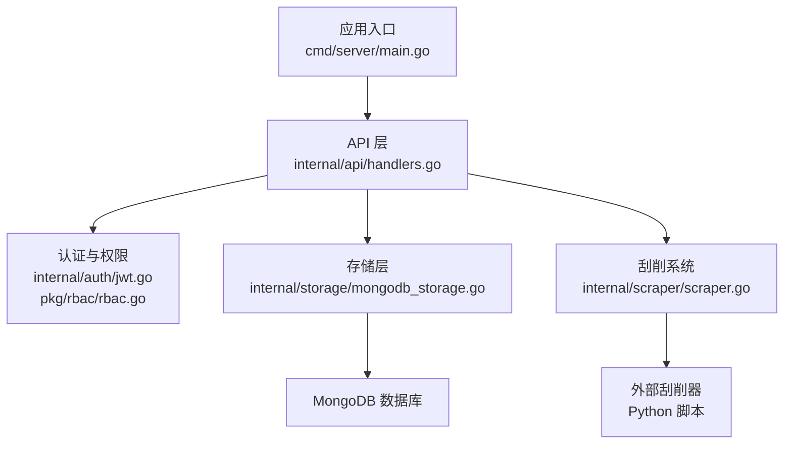
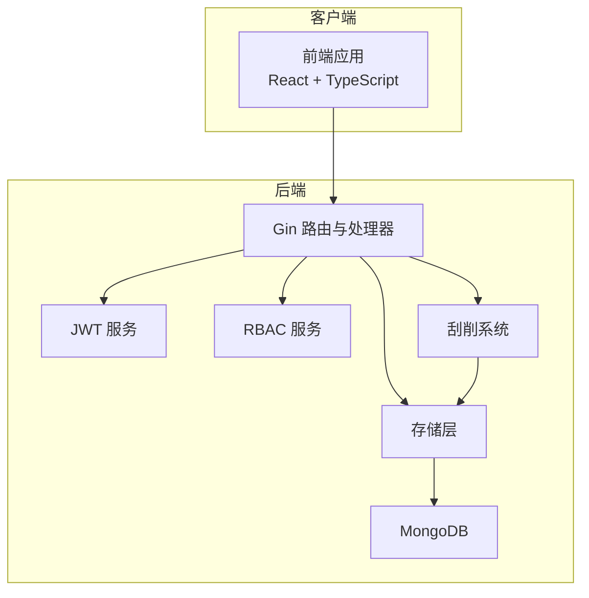
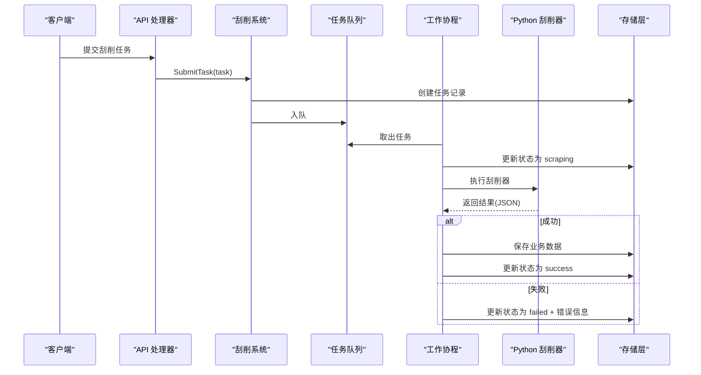
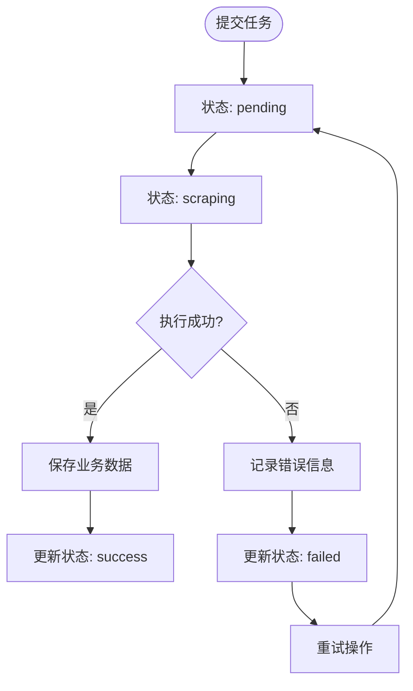
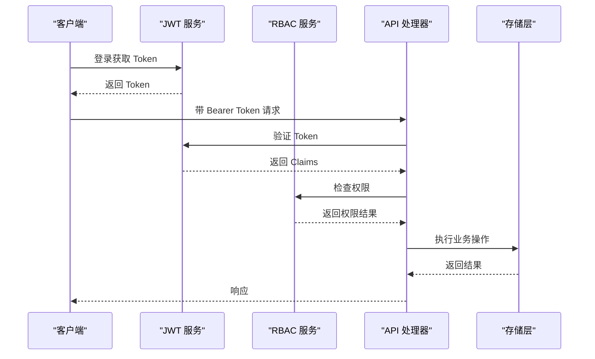
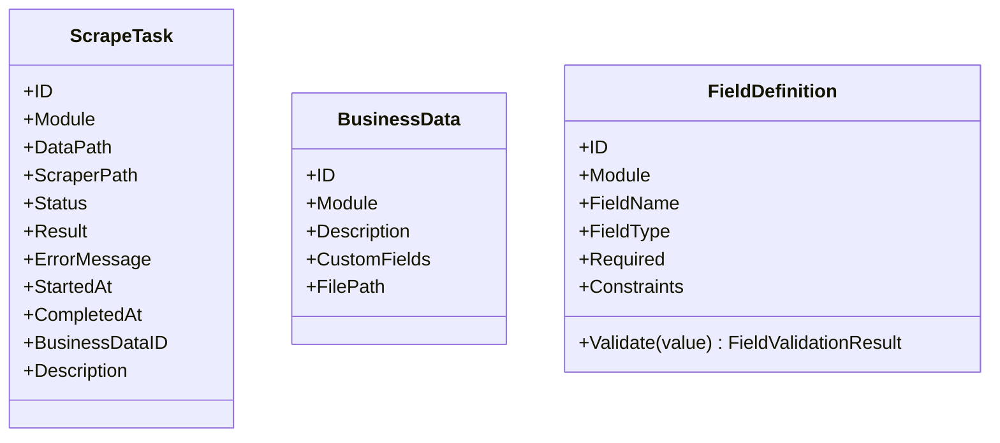
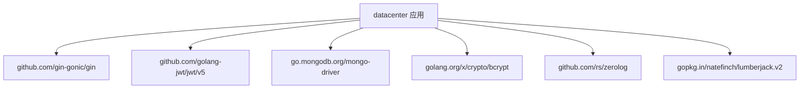

# 数据刮削系统

<cite>
**本文引用的文件**
- [cmd/server/main.go](file://cmd/server/main.go)
- [internal/scraper/scraper.go](file://internal/scraper/scraper.go)
- [internal/models/models.go](file://internal/models/models.go)
- [internal/api/handlers.go](file://internal/api/handlers.go)
- [internal/storage/mongodb_storage.go](file://internal/storage/mongodb_storage.go)
- [docs/architecture.md](file://docs/architecture.md)
- [docs/api.md](file://docs/api.md)
- [cmdenscrape/main.go](file://cmdenscrape/main.go)
- [internal/api/collection_permission_middleware.go](file://internal/api/collection_permission_middleware.go)
- [internal/auth/jwt.go](file://internal/auth/jwt.go)
- [pkg/rbac/rbac.go](file://pkg/rbac/rbac.go)
- [pkg/jql/parser.go](file://pkg/jql/parser.go)
- [go.mod](file://go.mod)
- [docs/modules/scraper/implementation.md](file://docs/modules/scraper/implementation.md)
- [docs/modules/scraper/tech.md](file://docs/modules/scraper/tech.md)
</cite>

## 更新摘要
**变更内容**
- 新增刮削系统模块的详细技术规格文档
- 更新并发任务处理架构的实现细节
- 完善工作协程池的配置与管理机制
- 增强刮削器插件开发指南的技术规范
- 补充完整的API接口文档与状态管理

## 目录
1. [简介](#简介)
2. [项目结构](#项目结构)
3. [核心组件](#核心组件)
4. [架构总览](#架构总览)
5. [详细组件分析](#详细组件分析)
6. [依赖分析](#依赖分析)
7. [性能考虑](#性能考虑)
8. [故障排查指南](#故障排查指南)
9. [结论](#结论)
10. [附录](#附录)

## 简介
本项目是一个基于 Go 语言的企业级数据刮削系统，采用异步任务处理架构，结合协程池、Channel 队列、状态跟踪与持久化存储，实现对 Python 刮削器的统一调度与结果管理。系统提供 RESTful API、JWT 认证、双层 RBAC 权限控制、JQL 查询语言以及完善的审计与日志能力。

**更新** 新增了完整的刮削系统模块技术文档，详细描述了并发任务处理架构、工作协程池实现和完整的技术规格。

## 项目结构
- 后端入口：cmd/server/main.go 负责环境变量加载、日志初始化、存储连接、刮削系统启动、API 路由注册与 HTTP 服务器启动。
- 刮削引擎：internal/scraper/scraper.go 实现协程池 + Channel 队列的任务调度与执行。
- 数据模型：internal/models/models.go 定义业务数据、刮削任务、字段定义等核心模型与字段验证。
- API 层：internal/api/handlers.go 注册所有 RESTful 路由，并实现认证、权限中间件与业务逻辑。
- 存储层：internal/storage/mongodb_storage.go 提供 MongoDB 访问，支持动态集合、索引与软删除。
- 文档：docs/architecture.md 与 docs/api.md 提供架构与 API 规范。
- 测试与演示：cmdenscrape/main.go 用于生成测试刮削任务数据；pkg/jql/parser.go 提供查询语言解析。



**图表来源**
- [cmd/server/main.go:24-150](file://cmd/server/main.go#L24-L150)
- [internal/api/handlers.go:45-181](file://internal/api/handlers.go#L45-L181)
- [internal/scraper/scraper.go:34-99](file://internal/scraper/scraper.go#L34-L99)
- [internal/storage/mongodb_storage.go:27-51](file://internal/storage/mongodb_storage.go#L27-L51)

**章节来源**
- [cmd/server/main.go:24-150](file://cmd/server/main.go#L24-L150)
- [docs/architecture.md:146-166](file://docs/architecture.md#L146-L166)

## 核心组件
- 刮削系统接口与实现：定义 SubmitTask、Start、Stop 等方法，内部维护任务队列与工作协程池。
- 数据模型：包含 ScrapeTask、BusinessData、FieldDefinition 等，支持字段类型与约束验证。
- API 处理器：注册路由、实现认证与权限中间件、提供业务数据与刮削任务管理接口。
- 存储层：提供集合 CRUD、动态集合创建、索引管理、软删除与回收、刮削任务的持久化。
- 认证与权限：JWT 服务与 RBAC 服务，支持系统级与集合级权限控制。
- 查询语言：JQL 解析器，将查询字符串转换为 MongoDB 过滤器。

**章节来源**
- [internal/scraper/scraper.go:18-45](file://internal/scraper/scraper.go#L18-L45)
- [internal/models/models.go:273-295](file://internal/models/models.go#L273-L295)
- [internal/api/handlers.go:23-43](file://internal/api/handlers.go#L23-L43)
- [internal/storage/mongodb_storage.go:16-51](file://internal/storage/mongodb_storage.go#L16-L51)
- [internal/auth/jwt.go:20-41](file://internal/auth/jwt.go#L20-L41)
- [pkg/rbac/rbac.go:55-99](file://pkg/rbac/rbac.go#L55-L99)
- [pkg/jql/parser.go:46-65](file://pkg/jql/parser.go#L46-L65)

## 架构总览
系统采用前后端分离的分层架构，后端基于 Gin 框架与 MongoDB，前端基于 React。核心特性包括：
- 异步刮削：协程池 + Channel 队列，支持并发控制与任务状态跟踪。
- 权限控制：系统级 RBAC 与集合级 RBAC 双层权限模型。
- 查询能力：JQL 语言解析，支持复杂过滤与聚合。
- 数据治理：软删除、审计日志、字段验证与动态集合。



**图表来源**
- [docs/architecture.md:10-51](file://docs/architecture.md#L10-L51)
- [cmd/server/main.go:94-127](file://cmd/server/main.go#L94-L127)

**章节来源**
- [docs/architecture.md:39-51](file://docs/architecture.md#L39-L51)
- [docs/architecture.md:481-520](file://docs/architecture.md#L481-L520)

## 详细组件分析

### 刮削系统组件分析
- 设计理念：以 Channel 作为任务队列，N 个工作协程并发消费任务，实现高吞吐与低延迟。
- 并发控制：通过 workerPool 控制工作协程数量，默认 4；队列缓冲区大小为 1000。
- 任务状态：支持 pending、scraping、success、failed 四种状态，持久化到 scrape_tasks 集合。
- 执行流程：提交任务 -> 入队 -> worker 取出 -> 更新状态为 scraping -> 执行 Python 刮削器 -> 成功/失败 -> 更新最终状态与结果。
- 结果存储：将刮削结果合并元数据后写入 {module}_data 动态集合。

**更新** 基于新增的技术文档，详细描述了刮削系统的完整实现架构和工作流程。

```mermaid
classDiagram
class Scraper接口 {
+SubmitTask(task) error
+Start() error
+Stop() error
}
class scraper实现 {
-storage
-taskQueue
-workerPool
-stopChan
+Start() error
+Stop() error
+SubmitTask(task) error
-worker(id)
-processTask(task, workerID)
-executeScraper(scraperPath, dataPath) map[string]interface{}
-saveScrapedData(task, result) primitive.ObjectID
}
Scraper接口 <|.. scraper实现
```

**图表来源**
- [internal/scraper/scraper.go:18-45](file://internal/scraper/scraper.go#L18-L45)
- [internal/scraper/scraper.go:101-193](file://internal/scraper/scraper.go#L101-L193)



**图表来源**
- [internal/scraper/scraper.go:74-193](file://internal/scraper/scraper.go#L74-L193)
- [internal/storage/mongodb_storage.go:571-600](file://internal/storage/mongodb_storage.go#L571-L600)

**章节来源**
- [internal/scraper/scraper.go:34-99](file://internal/scraper/scraper.go#L34-L99)
- [internal/scraper/scraper.go:101-193](file://internal/scraper/scraper.go#L101-L193)
- [docs/architecture.md:481-570](file://docs/architecture.md#L481-L570)

### 任务生命周期与状态流转
- 生命周期：提交 -> 入队 -> 执行 -> 结果落库 -> 状态更新。
- 状态机：pending -> scraping -> success 或 failed；支持重试与软删除。
- 重试机制：通过 API 提供重试接口，将任务重新置为 pending 并入队。

**更新** 基于技术文档中的状态管理规范，详细描述了任务状态的完整生命周期。



**图表来源**
- [docs/architecture.md:522-552](file://docs/architecture.md#L522-L552)
- [internal/scraper/scraper.go:122-193](file://internal/scraper/scraper.go#L122-L193)

**章节来源**
- [docs/architecture.md:522-552](file://docs/architecture.md#L522-L552)

### API 与权限控制
- 认证：JWT Bearer Token，支持签发、验证与刷新。
- 权限：系统级 RBAC 与集合级 RBAC 双层权限，支持通配符匹配与超级管理员。
- 刮削任务 API：提交、查询、重试、删除、批量删除、软删除恢复等。

**更新** 基于技术文档中的API规范，详细描述了刮削任务的所有RESTful接口。



**图表来源**
- [internal/auth/jwt.go:44-83](file://internal/auth/jwt.go#L44-L83)
- [pkg/rbac/rbac.go:63-99](file://pkg/rbac/rbac.go#L63-L99)
- [internal/api/handlers.go:260-293](file://internal/api/handlers.go#L260-L293)

**章节来源**
- [docs/api.md:601-683](file://docs/api.md#L601-L683)
- [internal/api/handlers.go:142-151](file://internal/api/handlers.go#L142-L151)
- [internal/api/collection_permission_middleware.go:16-48](file://internal/api/collection_permission_middleware.go#L16-L48)

### 数据模型与字段验证
- ScrapeTask：包含模块、数据路径、刮削器路径、状态、结果、错误信息、时间戳与业务数据 ID。
- BusinessData：模块、描述、自定义字段、文件路径与审计字段。
- FieldDefinition：字段类型、约束与验证逻辑，支持 string/number/boolean/date/array/object 与多种约束。

**更新** 基于技术文档中的数据模型定义，详细描述了刮削任务的状态枚举和字段结构。



**图表来源**
- [internal/models/models.go:282-295](file://internal/models/models.go#L282-L295)
- [internal/models/models.go:227-234](file://internal/models/models.go#L227-L234)
- [internal/models/models.go:51-71](file://internal/models/models.go#L51-L71)

**章节来源**
- [internal/models/models.go:273-295](file://internal/models/models.go#L273-L295)
- [internal/models/models.go:51-221](file://internal/models/models.go#L51-L221)

### 存储层与动态集合
- 动态集合：根据模块名动态创建与访问 {module}_data 集合。
- 索引管理：支持创建、查询与删除索引。
- 软删除：提供 deleted_data 与 deleted_scrape_tasks 集合，支持恢复。

**章节来源**
- [internal/storage/mongodb_storage.go:53-78](file://internal/storage/mongodb_storage.go#L53-L78)
- [internal/storage/mongodb_storage.go:338-395](file://internal/storage/mongodb_storage.go#L338-L395)
- [internal/storage/mongodb_storage.go:571-634](file://internal/storage/mongodb_storage.go#L571-L634)

### JQL 查询语言
- 词法与语法：支持字段、运算符、值、函数、括号、逻辑运算与内置时间函数。
- 转换：将 JQL 表达式转换为 MongoDB bson.M 过滤器。
- 使用：在业务数据查询中自动为非系统字段添加 custom_fields 前缀。

**章节来源**
- [pkg/jql/parser.go:46-653](file://pkg/jql/parser.go#L46-L653)
- [docs/architecture.md:579-663](file://docs/architecture.md#L579-L663)

## 依赖分析
- 外部依赖：Gin、JWT、MongoDB Driver、bcrypt、zerolog、lumberjack 等。
- 内部模块：api、auth、logger、models、scraper、storage、rbac、jql、collection_rbac。



**图表来源**
- [go.mod:5-14](file://go.mod#L5-L14)

**章节来源**
- [go.mod:1-50](file://go.mod#L1-L50)

## 性能考虑
- 并发与队列：合理设置 workerPool 与队列缓冲区大小，避免内存压力与饥饿。
- I/O 优化：Python 刮削器执行与 MongoDB 写入为 I/O 密集，建议使用 SSD 与合理的连接池配置。
- 查询优化：为高频查询字段建立索引，使用 JQL 时尽量减少全表扫描。
- 日志与监控：使用 zerolog 与 lumberjack，结合业务埋点与指标上报，定位瓶颈。
- 资源限制：为 Python 进程设置超时与资源限制，防止异常任务拖垮系统。

**更新** 基于技术文档中的性能优化建议，补充了刮削系统的性能调优最佳实践。

## 故障排查指南
- 任务未执行：检查 workerPool 是否正确启动、队列是否正常入队、模块是否存在。
- 刮削器失败：确认刮削器路径与数据路径存在、Python 环境可用、输出符合 JSON 格式。
- 权限拒绝：核对用户角色与集合权限，检查中间件是否正确提取 module 参数。
- 存储异常：检查 MongoDB 连接、动态集合创建与索引状态。
- 重试无效：确认重试接口传入正确的 scraper_path 并处于 failed 状态。

**章节来源**
- [internal/scraper/scraper.go:195-231](file://internal/scraper/scraper.go#L195-L231)
- [internal/api/collection_permission_middleware.go:16-48](file://internal/api/collection_permission_middleware.go#L16-L48)
- [internal/storage/mongodb_storage.go:571-600](file://internal/storage/mongodb_storage.go#L571-L600)

## 结论
本系统通过协程池与 Channel 队列实现了高效的异步刮削任务处理，结合完善的权限控制、查询语言与数据治理能力，为企业级数据采集与管理提供了可靠基础。建议在生产环境中根据负载调整 workerPool 与队列大小，并配合监控与日志体系持续优化性能与稳定性。

**更新** 基于新增的技术文档，系统架构得到了进一步完善，提供了更详细的并发处理机制和性能优化指导。

## 附录

### 刮削任务 API 规范
- 提交刮削任务：POST /api/scraper/upload
- 获取任务列表：GET /api/scraper/tasks
- 获取任务详情：GET /api/scraper/tasks/:id
- 重试任务：POST /api/scraper/tasks/:id/retry
- 删除任务：DELETE /api/scraper/tasks/:id
- 批量删除：POST /api/scraper/tasks/batch-delete

**更新** 基于技术文档中的API规范，详细描述了刮削任务的所有RESTful接口及其权限要求。

**章节来源**
- [docs/api.md:601-683](file://docs/api.md#L601-L683)
- [docs/modules/scraper/tech.md:166-179](file://docs/modules/scraper/tech.md#L166-L179)

### 刮削器插件开发指南
- 输入参数：命令行参数包含刮削器路径与数据路径。
- 输出格式：标准输出返回 JSON，包含 success、data、error 字段。
- 错误处理：当 success=false 时，系统将记录 error 并标记任务为 failed。
- 集成步骤：确保 Python 环境可用、输出符合约定格式、路径可访问。

**更新** 基于技术文档中的刮削器执行规范，详细描述了刮削器插件的开发要求和输出契约。

**章节来源**
- [internal/scraper/scraper.go:195-231](file://internal/scraper/scraper.go#L195-L231)
- [docs/modules/scraper/tech.md:140-149](file://docs/modules/scraper/tech.md#L140-L149)

### 工作协程池配置
- 默认工作协程数：4个
- 任务队列缓冲区：1000个任务
- 停止机制：优雅关闭，支持信号处理
- 并发控制：基于select模式的多路复用

**更新** 基于技术文档中的实现细节，详细描述了工作协程池的配置参数和运行机制。

**章节来源**
- [docs/modules/scraper/tech.md:20-47](file://docs/modules/scraper/tech.md#L20-L47)
- [docs/modules/scraper/implementation.md:49-95](file://docs/modules/scraper/implementation.md#L49-L95)

### 测试数据生成
- 使用 cmdenscrape/main.go 可快速生成不同状态的刮削任务，便于测试与演示。

**章节来源**
- [cmdenscrape/main.go:14-110](file://cmdenscrape/main.go#L14-L110)

### 系统初始化与生命周期管理
- 启动流程：创建刮削系统实例 -> 初始化存储 -> 启动系统 -> 注册信号处理
- 优雅关闭：接收系统信号 -> 关闭停止通道 -> 关闭任务队列 -> 退出工作协程
- 环境配置：支持通过环境变量配置工作协程数

**更新** 基于技术文档中的系统初始化规范，详细描述了刮削系统的启动和关闭流程。

**章节来源**
- [docs/modules/scraper/implementation.md:21-46](file://docs/modules/scraper/implementation.md#L21-L46)
- [docs/modules/scraper/tech.md:195-203](file://docs/modules/scraper/tech.md#L195-L203)