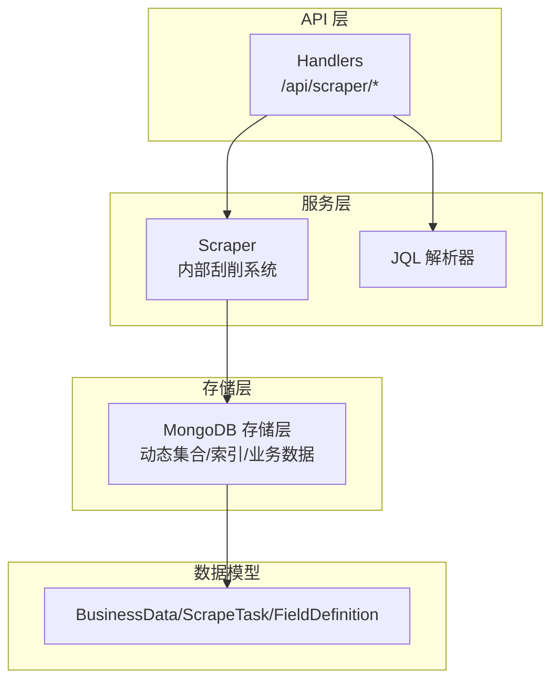
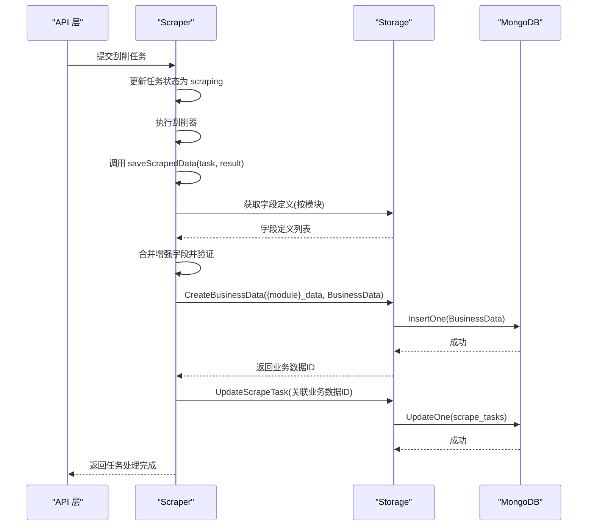
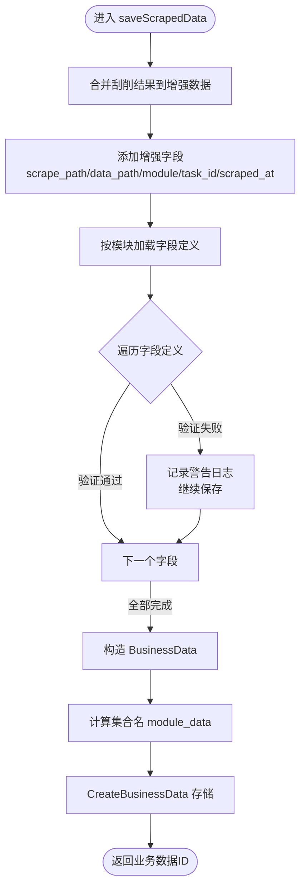
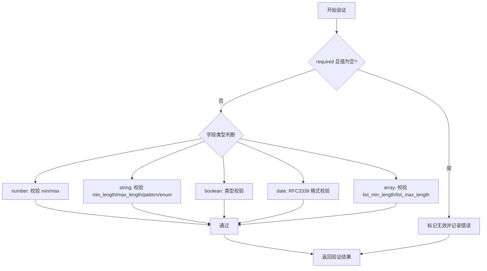
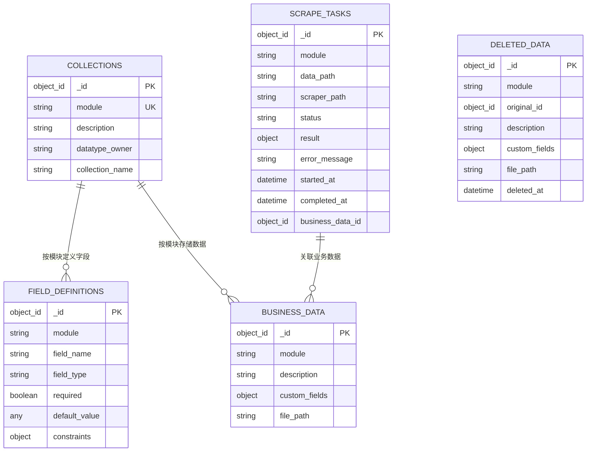
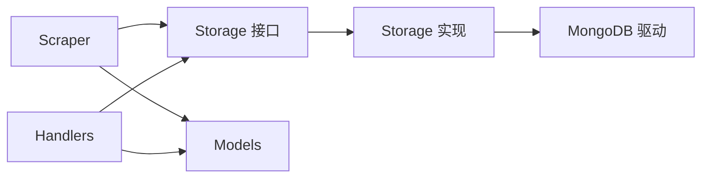

# 结果存储与数据增强

<cite>
**本文引用的文件**
- [scraper.go](file://internal/scraper/scraper.go)
- [mongodb_storage.go](file://internal/storage/mongodb_storage.go)
- [mongodb.go](file://internal/storage/mongodb.go)
- [models.go](file://internal/models/models.go)
- [business-data.md](file://docs/business-data.md)
- [architecture.md](file://docs/architecture.md)
- [config.yaml](file://configs/config.yaml)
- [handlers.go](file://internal/api/handlers.go)
</cite>

## 目录
1. [简介](#简介)
2. [项目结构](#项目结构)
3. [核心组件](#核心组件)
4. [架构总览](#架构总览)
5. [详细组件分析](#详细组件分析)
6. [依赖关系分析](#依赖关系分析)
7. [性能考量](#性能考量)
8. [故障排查指南](#故障排查指南)
9. [结论](#结论)
10. [附录](#附录)

## 简介
本文围绕“刮削结果存储”主题，系统梳理并深入解析 saveScrapedData() 方法的实现逻辑，涵盖数据增强、字段验证、业务数据存储流程；阐明刮削结果如何与业务数据模型结合（scrape_path、data_path、module、task_id 等增强字段的添加）；解释字段验证机制（基于模块定义的字段验证、验证结果处理与异常数据的容错策略）；并给出业务数据的存储结构（集合命名规则、索引设计与查询优化）、最佳实践（性能优化、数据一致性保证与备份策略）。

## 项目结构
- 后端采用分层架构：客户端层（React）、API 层（Gin）、服务层（JWT/RBAC/JQL/Scraper）、存储层（MongoDB）。
- 刮削系统位于 internal/scraper，负责接收任务、并发执行、调用 saveScrapedData() 存储结果。
- 存储层位于 internal/storage，提供 MongoDB 访问能力，包括动态集合创建、索引管理、业务数据 CRUD 等。
- 数据模型位于 internal/models，定义 BusinessData、ScrapeTask、FieldDefinition 等核心结构及字段验证逻辑。

图表来源
- [architecture.md:1-834](file://docs/architecture.md#L1-L834)
- [scraper.go:1-289](file://internal/scraper/scraper.go#L1-L289)
- [mongodb_storage.go:1-829](file://internal/storage/mongodb_storage.go#L1-L829)
- [models.go:1-365](file://internal/models/models.go#L1-L365)

章节来源
- [architecture.md:1-834](file://docs/architecture.md#L1-L834)
- [business-data.md:1-519](file://docs/business-data.md#L1-L519)

## 核心组件
- 刮削系统（Scraper）：负责提交任务、并发执行、调用 saveScrapedData() 存储结果，并更新任务状态。
- 存储层（Storage）：提供动态集合创建、索引管理、业务数据 CRUD、刮削任务 CRUD、软删除与恢复等能力。
- 数据模型（Models）：定义 BusinessData、ScrapeTask、FieldDefinition 及字段验证逻辑。

章节来源
- [scraper.go:1-289](file://internal/scraper/scraper.go#L1-L289)
- [mongodb.go:1-91](file://internal/storage/mongodb.go#L1-L91)
- [mongodb_storage.go:1-829](file://internal/storage/mongodb_storage.go#L1-L829)
- [models.go:1-365](file://internal/models/models.go#L1-L365)

## 架构总览
- 刮削任务提交后进入异步队列，工作协程取出任务并执行刮削器，成功后调用 saveScrapedData()。
- saveScrapedData() 将刮削结果与任务元数据合并，进行字段验证（非阻塞），构造 BusinessData 并存入 {module}_data 动态集合。
- 存储层提供动态集合与索引管理，支持按模块查询、统计与软删除恢复。

图表来源
- [scraper.go:122-193](file://internal/scraper/scraper.go#L122-L193)
- [scraper.go:233-288](file://internal/scraper/scraper.go#L233-L288)
- [mongodb_storage.go:338-347](file://internal/storage/mongodb_storage.go#L338-L347)
- [mongodb_storage.go:571-600](file://internal/storage/mongodb_storage.go#L571-L600)

章节来源
- [business-data.md:1-519](file://docs/business-data.md#L1-L519)
- [architecture.md:481-570](file://docs/architecture.md#L481-L570)

## 详细组件分析

### saveScrapedData() 方法实现详解
- 数据增强
  - 将原始刮削结果 data 的键值对复制到 enhancedData。
  - 添加增强字段：scrape_path、data_path、module、task_id、scraped_at。
- 字段验证（非阻塞）
  - 通过存储层按模块获取字段定义列表。
  - 对每个字段定义调用 Validate(value)，若验证失败，记录警告日志但不中断保存流程。
- 业务数据构造与存储
  - 构造 BusinessData：设置 module、description、custom_fields（增强后的数据）、file_path、审计字段。
  - 依据 module + "_data" 作为集合名，调用 CreateBusinessData() 存储。
- 返回值与日志
  - 返回业务数据 ID，记录成功日志。

图表来源
- [scraper.go:233-288](file://internal/scraper/scraper.go#L233-L288)

章节来源
- [scraper.go:233-288](file://internal/scraper/scraper.go#L233-L288)

### 字段验证机制
- 字段定义来源：按模块从 field_definitions 集合加载。
- 验证规则：
  - 必填：若字段定义 required=true 且值为空，则标记为无效。
  - 类型与范围：根据字段类型（string/number/boolean/date/array/object）进行类型校验与范围约束（min/max、min_length/max_length、pattern、enum_values、list_min_length/list_max_length）。
  - 日期格式：string 类型且为 date 时，要求 RFC3339 格式。
- 结果处理：
  - 验证失败时记录字段名与错误信息，但不会阻止数据入库。
  - 业务侧可在查询阶段通过 JQL 对 custom_fields 进行过滤与校验。

图表来源
- [models.go:73-221](file://internal/models/models.go#L73-L221)

章节来源
- [models.go:39-221](file://internal/models/models.go#L39-L221)
- [business-data.md:336-349](file://docs/business-data.md#L336-L349)

### 业务数据存储结构
- 集合命名规则
  - 动态集合：{module}_data（如 movie_data、book_data）。
  - 元数据集合：collections、field_definitions、scrape_tasks、deleted_scrape_tasks、deleted_data。
- 索引设计
  - collections.module 唯一索引。
  - field_definitions.module + field_name 复合唯一索引。
  - scrape_tasks.module + status 复合索引；scrape_tasks.created_at 降序索引。
  - 支持按模块动态创建索引（API：/api/collections/:module/indexes）。
- 查询优化
  - 按模块与状态查询任务：利用复合索引提升性能。
  - 业务数据查询：JQL 解析器将查询映射为 MongoDB 过滤器，非系统字段自动加 custom_fields. 前缀。

图表来源
- [mongodb_storage.go:42-47](file://internal/storage/mongodb_storage.go#L42-L47)
- [mongodb_storage.go:755-767](file://internal/storage/mongodb_storage.go#L755-L767)
- [business-data.md:305-398](file://docs/business-data.md#L305-L398)

章节来源
- [business-data.md:399-425](file://docs/business-data.md#L399-L425)
- [handlers.go:1613-1657](file://internal/api/handlers.go#L1613-L1657)

### 与业务数据模型的结合
- 增强字段
  - scrape_path：刮削器路径。
  - data_path：数据文件路径。
  - module：模块名。
  - task_id：刮削任务 ID（十六进制字符串）。
  - scraped_at：刮削完成时间。
- BusinessData 字段
  - module、description、custom_fields（包含上述增强字段）、file_path、审计字段（created_by/updated_by/created_at/updated_at）。
- 存储流程
  - 依据 module + "_data" 动态集合名插入 BusinessData。
  - 若集合不存在，存储层会自动创建动态集合。

章节来源
- [scraper.go:233-288](file://internal/scraper/scraper.go#L233-L288)
- [mongodb_storage.go:338-347](file://internal/storage/mongodb_storage.go#L338-L347)
- [models.go:227-245](file://internal/models/models.go#L227-L245)

## 依赖关系分析
- 组件耦合
  - Scraper 依赖 Storage 接口，通过接口解耦，便于替换存储实现。
  - Storage 实现依赖 MongoDB 驱动，提供动态集合、索引、业务数据 CRUD。
  - Models 定义字段验证逻辑，被 Scraper 与 API 层共同使用。
- 外部依赖
  - MongoDB：提供动态集合、索引、查询能力。
  - JQL：提供高级查询能力，自动处理 custom_fields 前缀。
- 潜在循环依赖
  - 未发现直接循环依赖；Storage 与 Scraper 通过接口交互，避免循环。

图表来源
- [mongodb.go:14-90](file://internal/storage/mongodb.go#L14-L90)
- [scraper.go:18-45](file://internal/scraper/scraper.go#L18-L45)
- [models.go:12-17](file://internal/models/models.go#L12-L17)

章节来源
- [mongodb.go:1-91](file://internal/storage/mongodb.go#L1-L91)
- [scraper.go:1-45](file://internal/scraper/scraper.go#L1-L45)
- [models.go:1-17](file://internal/models/models.go#L1-L17)

## 性能考量
- 并发与队列
  - 刮削系统使用协程池与带缓冲的通道队列，支持配置工作协程数量与队列大小，默认 4 个工作协程、1000 缓冲。
- 动态集合与索引
  - 按模块动态创建集合，避免跨集合 JOIN；通过索引（如 scrape_tasks.module+status、created_at）优化查询。
- 查询优化
  - JQL 解析器将查询映射为 MongoDB 过滤器，支持复杂条件与函数；业务数据查询自动为非系统字段添加 custom_fields. 前缀。
- 写入性能
  - 业务数据以 JSON 形式存储在 custom_fields，无需预定义字段结构，适合不同刮削器输出；建议为高频查询字段创建索引。

章节来源
- [business-data.md:513-519](file://docs/business-data.md#L513-L519)
- [business-data.md:412-425](file://docs/business-data.md#L412-L425)
- [handlers.go:1613-1657](file://internal/api/handlers.go#L1613-L1657)

## 故障排查指南
- 字段验证失败
  - 现象：saveScrapedData() 中记录字段验证失败警告，但仍会保存。
  - 排查：检查 field_definitions 中对应字段的 constraints 配置是否合理；确认刮削器输出字段类型与约束一致。
- 集合不存在
  - 现象：提交任务时报模块不存在或无法创建集合。
  - 排查：确认已通过集合管理 API 创建模块集合；检查 collections 集合中是否存在对应模块记录。
- 存储失败
  - 现象：CreateBusinessData 返回错误。
  - 排查：检查 MongoDB 连接配置（URI、数据库名）；确认集合权限与索引创建成功。
- 任务状态异常
  - 现象：任务状态未正确更新为 success 或 failed。
  - 排查：检查工作协程日志；确认 UpdateScrapeTask 调用是否成功；核对业务数据 ID 关联是否正确。

章节来源
- [scraper.go:122-193](file://internal/scraper/scraper.go#L122-L193)
- [scraper.go:233-288](file://internal/scraper/scraper.go#L233-L288)
- [config.yaml:1-26](file://configs/config.yaml#L1-L26)

## 结论
saveScrapedData() 通过“数据增强 + 非阻塞字段验证 + 动态集合存储”的方式，实现了对刮削结果的灵活、可扩展存储。结合模块化的集合命名、完善的索引策略与 JQL 查询能力，系统在保证数据一致性的同时，兼顾了性能与可维护性。建议在生产环境中配合合理的索引设计、监控与备份策略，确保长期稳定运行。

## 附录
- 配置参考
  - MongoDB 连接：URI 与数据库名。
  - 服务器端口与超时配置。
- API 参考
  - 刮削任务相关：提交、查询、重试、软删除与恢复。
  - 集合索引管理：创建、查询、删除。
- 文档参考
  - 业务数据管理与索引策略。
  - 系统架构与数据模型。

章节来源
- [config.yaml:1-26](file://configs/config.yaml#L1-L26)
- [business-data.md:233-282](file://docs/business-data.md#L233-L282)
- [handlers.go:1613-1657](file://internal/api/handlers.go#L1613-L1657)
- [architecture.md:1-834](file://docs/architecture.md#L1-L834)