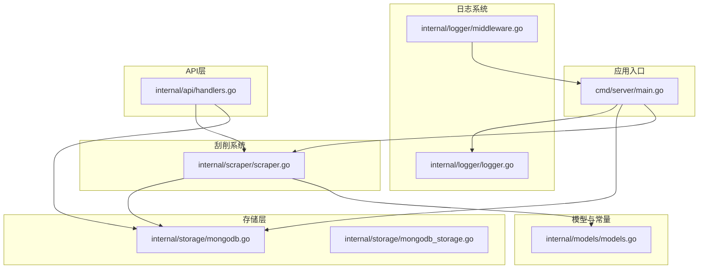
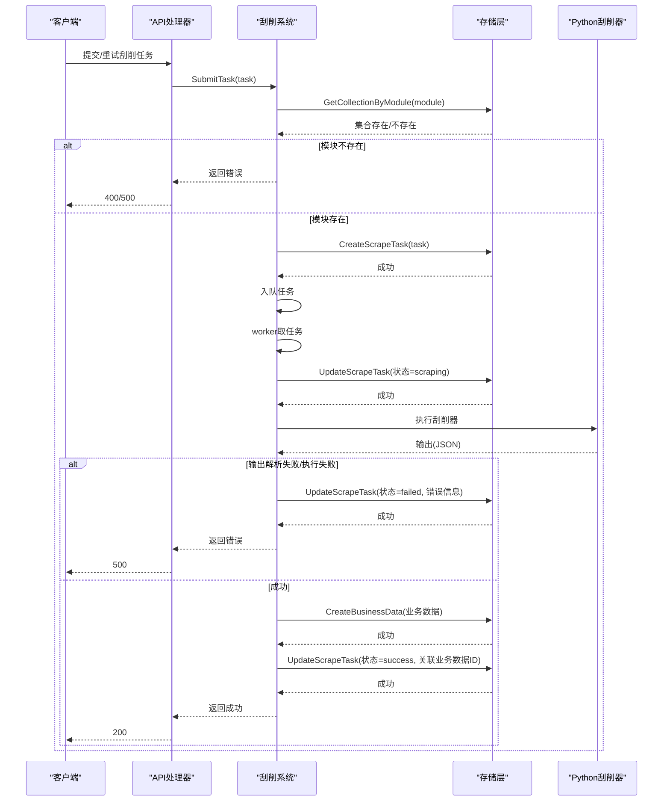
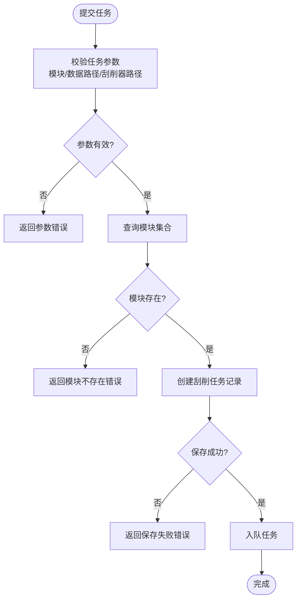
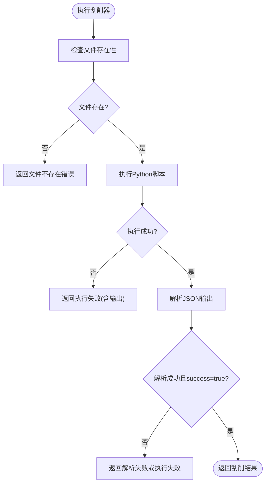
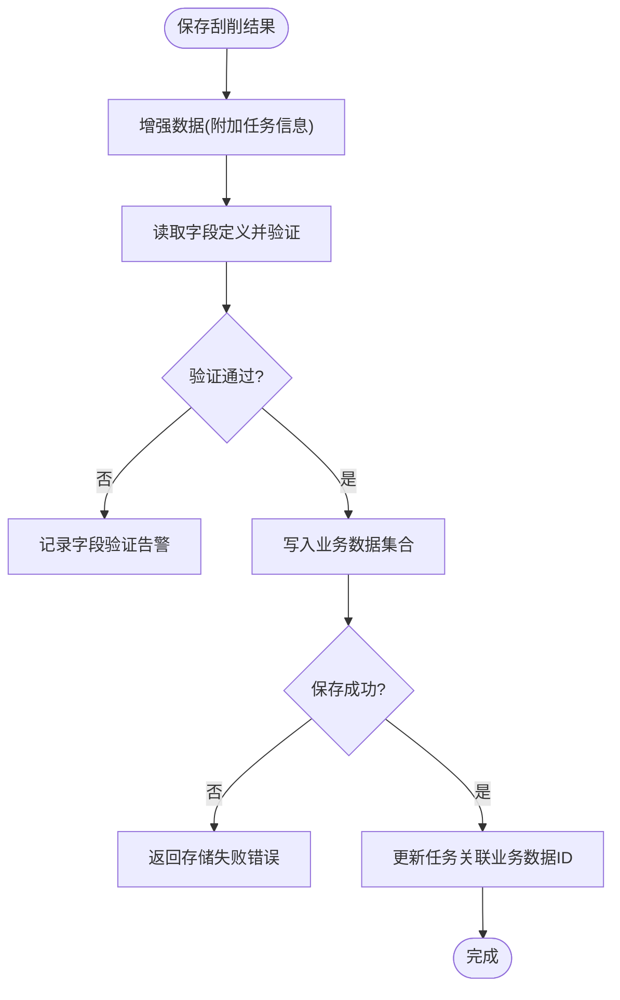
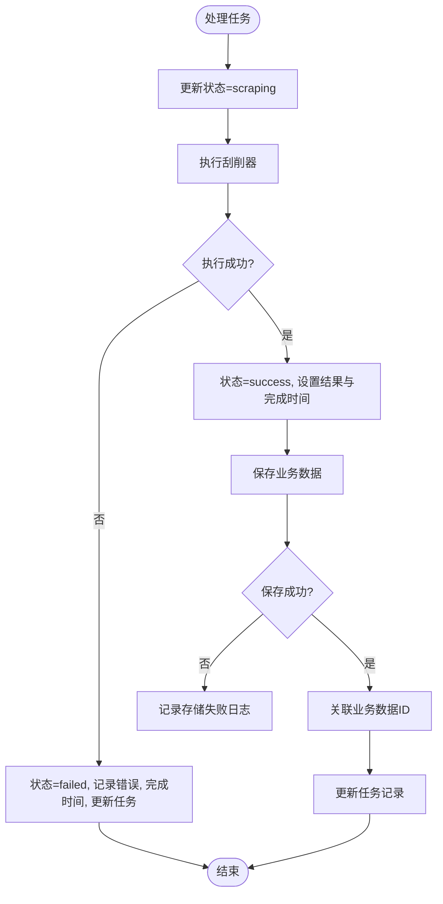
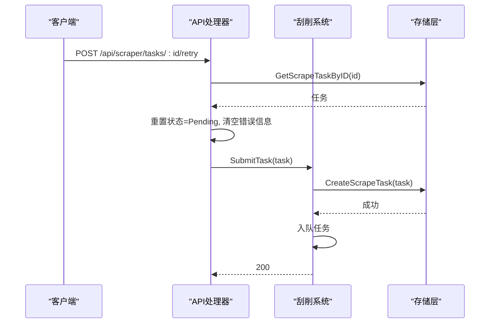
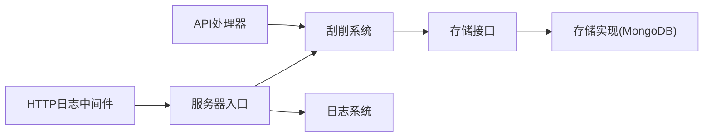

# 错误处理与重试机制

<cite>
**本文引用的文件**
- [scraper.go](file://internal/scraper/scraper.go)
- [mongodb.go](file://internal/storage/mongodb.go)
- [mongodb_storage.go](file://internal/storage/mongodb_storage.go)
- [models.go](file://internal/models/models.go)
- [logger.go](file://internal/logger/logger.go)
- [middleware.go](file://internal/logger/middleware.go)
- [handlers.go](file://internal/api/handlers.go)
- [main.go](file://cmd/server/main.go)
- [config.yaml](file://configs/config.yaml)
</cite>

## 目录
1. [简介](#简介)
2. [项目结构](#项目结构)
3. [核心组件](#核心组件)
4. [架构总览](#架构总览)
5. [详细组件分析](#详细组件分析)
6. [依赖关系分析](#依赖关系分析)
7. [性能考量](#性能考量)
8. [故障排除指南](#故障排除指南)
9. [结论](#结论)

## 简介
本文档围绕刮削系统的错误处理与重试机制展开，系统性梳理了任务参数校验、模块存在性检查、刮削器执行失败、数据存储异常等错误类型及其处理策略；深入解析 processTask() 方法的状态更新、错误记录与任务终止流程；说明 executeScraper() 的错误捕获与处理（Python 脚本执行错误、输出解析失败、异常数据处理）；给出错误日志记录规范（级别分类、格式标准化、调试信息收集）；并提供常见错误场景、解决方案与预防措施。

## 项目结构
- 刮削系统核心位于 internal/scraper，包含任务提交、工作协程、任务处理与执行逻辑。
- 存储层接口与实现位于 internal/storage，提供 MongoDB 访问能力与业务数据持久化。
- 日志系统位于 internal/logger，提供应用日志与 HTTP 请求日志的统一输出。
- API 层位于 internal/api，负责任务重试等外部入口。
- 服务器入口位于 cmd/server，负责初始化日志、存储、刮削系统与 HTTP 服务。

**图表来源**
- [main.go:24-150](file://cmd/server/main.go#L24-L150)
- [logger.go:14-56](file://internal/logger/logger.go#L14-L56)
- [scraper.go:34-45](file://internal/scraper/scraper.go#L34-L45)
- [mongodb.go:14-90](file://internal/storage/mongodb.go#L14-L90)
- [mongodb_storage.go:27-51](file://internal/storage/mongodb_storage.go#L27-L51)
- [models.go:273-295](file://internal/models/models.go#L273-L295)
- [handlers.go:1266-1302](file://internal/api/handlers.go#L1266-L1302)

**章节来源**
- [main.go:24-150](file://cmd/server/main.go#L24-L150)
- [logger.go:14-56](file://internal/logger/logger.go#L14-L56)
- [scraper.go:34-45](file://internal/scraper/scraper.go#L34-L45)
- [mongodb.go:14-90](file://internal/storage/mongodb.go#L14-L90)
- [mongodb_storage.go:27-51](file://internal/storage/mongodb_storage.go#L27-L51)
- [models.go:273-295](file://internal/models/models.go#L273-L295)
- [handlers.go:1266-1302](file://internal/api/handlers.go#L1266-L1302)

## 核心组件
- 刮削系统接口与实现：负责任务提交、工作协程调度、任务处理与执行。
- 存储接口与实现：提供任务与业务数据的增删改查、索引与动态集合管理。
- 日志系统：统一应用日志与 HTTP 请求日志，支持多级写入与结构化字段。
- API 层：提供任务重试等管理接口，封装错误码与响应。
- 服务器入口：初始化日志、存储、刮削系统与 HTTP 服务，处理优雅停机。

**章节来源**
- [scraper.go:18-45](file://internal/scraper/scraper.go#L18-L45)
- [mongodb.go:14-90](file://internal/storage/mongodb.go#L14-L90)
- [logger.go:14-56](file://internal/logger/logger.go#L14-L56)
- [handlers.go:1266-1302](file://internal/api/handlers.go#L1266-L1302)
- [main.go:24-150](file://cmd/server/main.go#L24-L150)

## 架构总览
系统采用“请求-任务-执行-存储”的流水线模式：
- API 接收任务提交与重试请求；
- 刮削系统进行参数校验与模块存在性检查；
- 执行 Python 刮削器并解析输出；
- 将结果增强后写入业务数据集合；
- 所有关键节点均记录结构化日志，失败时更新任务状态并终止流程。

**图表来源**
- [handlers.go:1266-1302](file://internal/api/handlers.go#L1266-L1302)
- [scraper.go:74-99](file://internal/scraper/scraper.go#L74-L99)
- [scraper.go:122-193](file://internal/scraper/scraper.go#L122-L193)
- [scraper.go:195-231](file://internal/scraper/scraper.go#L195-L231)
- [mongodb_storage.go:571-600](file://internal/storage/mongodb_storage.go#L571-L600)
- [mongodb_storage.go:338-347](file://internal/storage/mongodb_storage.go#L338-L347)

## 详细组件分析

### 任务参数错误处理
- 参数校验：任务必须包含模块名、数据路径与刮削器路径，否则直接返回错误。
- 模块存在性检查：通过存储层查询模块对应的集合，不存在则返回明确错误提示。
- 任务持久化：通过存储层创建任务记录，失败时返回错误。

**图表来源**
- [scraper.go:74-99](file://internal/scraper/scraper.go#L74-L99)
- [mongodb_storage.go:571-577](file://internal/storage/mongodb_storage.go#L571-L577)

**章节来源**
- [scraper.go:74-99](file://internal/scraper/scraper.go#L74-L99)
- [mongodb_storage.go:571-577](file://internal/storage/mongodb_storage.go#L571-L577)

### 模块不存在错误处理
- 存储层提供按模块查询集合的方法，若查询失败则视为模块不存在。
- 刮削系统在提交任务阶段即拦截该错误，避免后续无效执行。

**章节来源**
- [scraper.go:81-86](file://internal/scraper/scraper.go#L81-L86)
- [mongodb_storage.go:769-776](file://internal/storage/mongodb_storage.go#L769-L776)

### 刮削器执行失败处理（executeScraper）
- 文件存在性检查：确认刮削器与数据文件存在，否则返回错误。
- Python 执行：调用系统命令执行刮削器，捕获错误与输出。
- 输出解析：期望输出为 JSON，包含 success、data、error 字段；解析失败或 success=false 时返回错误。
- 异常数据处理：当刮削器返回非成功状态时，错误被上抛至任务处理流程。

**图表来源**
- [scraper.go:195-231](file://internal/scraper/scraper.go#L195-L231)

**章节来源**
- [scraper.go:195-231](file://internal/scraper/scraper.go#L195-L231)

### 数据存储异常处理（saveScrapedData）
- 数据增强：将任务元信息注入业务数据，便于后续审计与追踪。
- 字段验证：读取模块字段定义并对数据进行验证，验证失败仅记录告警并继续存储。
- 业务数据写入：将增强后的数据写入动态集合（模块名 + “_data”），失败时返回错误。
- 关联任务：成功后更新任务记录，关联业务数据ID。

**图表来源**
- [scraper.go:233-288](file://internal/scraper/scraper.go#L233-L288)
- [mongodb_storage.go:338-347](file://internal/storage/mongodb_storage.go#L338-L347)

**章节来源**
- [scraper.go:233-288](file://internal/scraper/scraper.go#L233-L288)
- [mongodb_storage.go:338-347](file://internal/storage/mongodb_storage.go#L338-L347)

### processTask() 错误处理流程
- 状态更新：开始处理前将任务状态更新为“刮削中”，并记录开始时间。
- 执行刮削器：调用 executeScraper()，失败则进入错误分支。
- 失败处理：设置状态为“失败”，记录错误信息与完成时间，更新任务。
- 成功处理：设置状态为“成功”，写入结果与完成时间；随后进行数据存储与任务更新。
- 终止机制：任一环节失败均会记录错误并终止当前任务处理流程。

**图表来源**
- [scraper.go:122-193](file://internal/scraper/scraper.go#L122-L193)

**章节来源**
- [scraper.go:122-193](file://internal/scraper/scraper.go#L122-L193)

### 重试机制与任务终止
- 重试入口：API 提供重试接口，可更新刮削器路径并重置任务状态为“待处理”。
- 终止条件：工作协程监听停止通道与任务队列关闭信号，优雅退出。
- 任务终止：任务处理过程中一旦发生错误，立即更新状态并记录日志，不再继续后续步骤。

**图表来源**
- [handlers.go:1266-1302](file://internal/api/handlers.go#L1266-L1302)
- [scraper.go:74-99](file://internal/scraper/scraper.go#L74-L99)
- [mongodb_storage.go:571-577](file://internal/storage/mongodb_storage.go#L571-L577)

**章节来源**
- [handlers.go:1266-1302](file://internal/api/handlers.go#L1266-L1302)
- [scraper.go:101-120](file://internal/scraper/scraper.go#L101-L120)

## 依赖关系分析
- 刮削系统依赖存储接口以完成任务与业务数据的持久化。
- API 层依赖刮削系统与存储接口，提供任务重试与删除等管理能力。
- 日志系统同时服务于应用与 HTTP 中间件，统一输出格式与级别。

**图表来源**
- [handlers.go:33-43](file://internal/api/handlers.go#L33-L43)
- [scraper.go:26-31](file://internal/scraper/scraper.go#L26-L31)
- [mongodb.go:14-90](file://internal/storage/mongodb.go#L14-L90)
- [mongodb_storage.go:16-51](file://internal/storage/mongodb_storage.go#L16-L51)
- [main.go:65-69](file://cmd/server/main.go#L65-L69)
- [logger.go:14-56](file://internal/logger/logger.go#L14-L56)
- [middleware.go:25-68](file://internal/logger/middleware.go#L25-L68)

**章节来源**
- [handlers.go:33-43](file://internal/api/handlers.go#L33-L43)
- [scraper.go:26-31](file://internal/scraper/scraper.go#L26-L31)
- [mongodb.go:14-90](file://internal/storage/mongodb.go#L14-L90)
- [mongodb_storage.go:16-51](file://internal/storage/mongodb_storage.go#L16-L51)
- [main.go:65-69](file://cmd/server/main.go#L65-L69)
- [logger.go:14-56](file://internal/logger/logger.go#L14-L56)
- [middleware.go:25-68](file://internal/logger/middleware.go#L25-L68)

## 性能考量
- 工作协程池：默认工作协程数可配置，建议根据 CPU 与 I/O 负载调整。
- 任务队列：队列容量固定，高并发下需监控积压情况，必要时扩容。
- 日志落盘：采用滚动日志，注意磁盘 IO 对性能的影响，合理设置日志级别。
- MongoDB 写入：业务数据写入为单文档插入，建议评估集合索引与分片策略以提升吞吐。

[本节为通用指导，无需列出具体文件来源]

## 故障排除指南

### 常见错误场景与定位
- 任务参数错误
  - 现象：提交任务即返回错误。
  - 排查：确认模块名、数据路径、刮削器路径是否填写完整。
  - 参考：[scraper.go:74-79](file://internal/scraper/scraper.go#L74-L79)
- 模块不存在
  - 现象：提示模块不存在或集合未创建。
  - 排查：确认模块已在系统中创建并存在对应集合。
  - 参考：[scraper.go:81-86](file://internal/scraper/scraper.go#L81-L86), [mongodb_storage.go:769-776](file://internal/storage/mongodb_storage.go#L769-L776)
- 刮削器执行失败
  - 现象：Python 执行报错或输出解析失败。
  - 排查：检查刮削器与数据文件是否存在；查看执行输出；确保输出符合 JSON 格式且 success=true。
  - 参考：[scraper.go:195-231](file://internal/scraper/scraper.go#L195-L231)
- 数据存储异常
  - 现象：业务数据写入失败或字段验证告警。
  - 排查：检查集合权限与索引；关注字段验证告警，必要时放宽约束或修正数据。
  - 参考：[scraper.go:233-288](file://internal/scraper/scraper.go#L233-L288), [mongodb_storage.go:338-347](file://internal/storage/mongodb_storage.go#L338-L347)

### 解决方案与预防措施
- 参数校验前置：在 API 层增加更严格的输入校验，减少无效任务进入队列。
- 模块预检：在提交任务前进行模块与集合的预检，提前发现配置问题。
- 执行隔离：为不同模块的刮削器配置独立工作协程或队列，降低相互影响。
- 日志分级：生产环境建议使用 info/warn/error 分级，保留 debug 仅在开发/测试环境启用。
- 重试策略：通过重试接口快速恢复失败任务，避免手动干预；必要时引入指数退避与最大重试次数限制。
- 监控告警：对任务失败率、执行耗时、存储写入延迟等指标建立监控与告警。

**章节来源**
- [scraper.go:74-99](file://internal/scraper/scraper.go#L74-L99)
- [scraper.go:195-231](file://internal/scraper/scraper.go#L195-L231)
- [scraper.go:233-288](file://internal/scraper/scraper.go#L233-L288)
- [handlers.go:1266-1302](file://internal/api/handlers.go#L1266-L1302)
- [logger.go:44-56](file://internal/logger/logger.go#L44-L56)

## 结论
本系统通过“参数校验 + 模块预检 + 执行隔离 + 结构化日志 + 明确的失败回滚与重试”构建了健壮的错误处理与重试机制。processTask() 与 executeScraper() 的错误路径清晰，状态更新与日志记录覆盖全面；配合 API 层的重试与删除能力，能够有效提升系统的可用性与可观测性。建议在生产环境中结合监控与告警体系，持续优化工作协程与存储性能，进一步降低任务失败率与恢复时间。