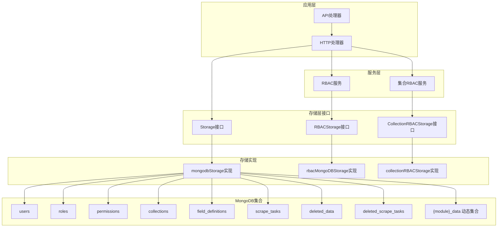
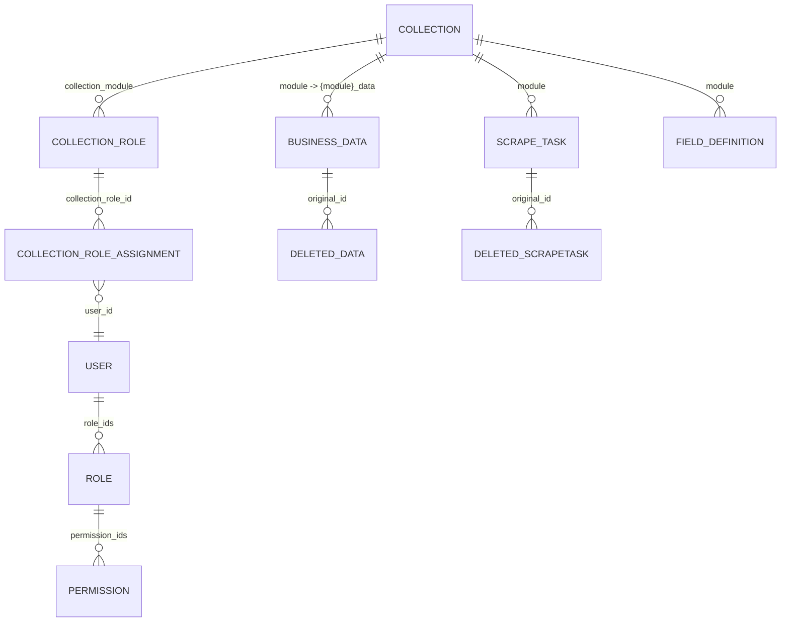
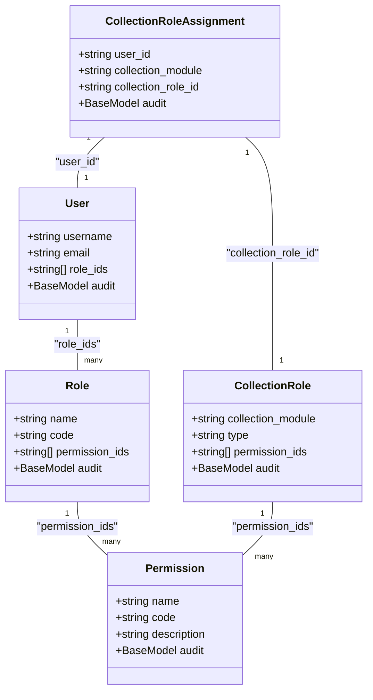

# MongoDB数据模型

<cite>
**本文档引用的文件**
- [models.go](file://internal/models/models.go)
- [mongodb.go](file://internal/storage/mongodb.go)
- [mongodb_storage.go](file://internal/storage/mongodb_storage.go)
- [rbac.go](file://pkg/rbac/rbac.go)
- [collection_rbac.go](file://pkg/rbac/collection_rbac.go)
- [rbac_storage.go](file://internal/storage/rbac_storage.go)
- [collection_rbac_storage.go](file://internal/storage/collection_rbac_storage.go)
- [business-data.md](file://docs/business-data.md)
- [rbac.md](file://docs/rbac.md)
- [config.yaml](file://configs/config.yaml)
</cite>

## 目录
1. [简介](#简介)
2. [项目结构](#项目结构)
3. [核心组件](#核心组件)
4. [架构总览](#架构总览)
5. [详细组件分析](#详细组件分析)
6. [依赖关系分析](#依赖关系分析)
7. [性能考量](#性能考量)
8. [故障排查指南](#故障排查指南)
9. [结论](#结论)
10. [附录](#附录)

## 简介
本文件系统性梳理数据中心项目在MongoDB中的数据模型设计，覆盖用户、角色、权限、业务数据、刮削任务、字段定义等核心模型，解释字段定义、数据类型、约束条件与业务含义；阐述模型间关系建模（嵌入与引用）、软删除机制、动态集合设计理念与使用场景；提供BSON文档示例与常见问题排查建议，帮助开发者与运维人员高效理解与维护数据模型。

## 项目结构
项目采用分层架构，数据模型集中在内部包中，存储层通过接口抽象与具体实现分离，RBAC服务与集合级RBAC服务分别处理系统级与模块级权限控制。

图表来源
- [mongodb.go:14-90](file://internal/storage/mongodb.go#L14-L90)
- [mongodb_storage.go:16-51](file://internal/storage/mongodb_storage.go#L16-L51)
- [rbac.go:55-61](file://pkg/rbac/rbac.go#L55-L61)
- [collection_rbac.go:27-37](file://pkg/rbac/collection_rbac.go#L27-L37)

章节来源
- [mongodb.go:14-90](file://internal/storage/mongodb.go#L14-L90)
- [mongodb_storage.go:16-51](file://internal/storage/mongodb_storage.go#L16-L51)
- [rbac.go:55-61](file://pkg/rbac/rbac.go#L55-L61)
- [collection_rbac.go:27-37](file://pkg/rbac/collection_rbac.go#L27-L37)

## 核心组件
本节概述所有核心数据模型，包括字段定义、数据类型、约束与业务含义。

- BaseModel：通用审计字段，统一记录创建者、创建时间、更新者、更新时间。
- FieldDefinition：字段定义模型，支持字符串、数值、布尔、日期、数组、对象等类型，以及长度、范围、枚举、正则等约束。
- BusinessData：业务数据模型，支持任意JSON结构的自定义字段，按模块动态存储于独立集合。
- DeletedData：软删除业务数据记录，保留原始ID与删除时间，便于恢复。
- User：用户模型，包含用户名、邮箱、加密密码与角色ID数组。
- Permission：权限模型，包含权限名称、代码与描述。
- Role：角色模型，包含角色名称、代码、描述与权限ID数组。
- ScrapeTask：刮削任务模型，记录任务状态、结果、错误信息与关联的业务数据ID。
- DeletedScrapeTask：软删除刮削任务记录。
- Collection：集合元数据模型，记录模块名、描述、数据类型所有者与MongoDB集合名。
- CollectionRole：集合角色模型，包含角色类型（拥有者、操作员、访客）与权限代码数组。
- CollectionRoleAssignment：集合角色分配记录，记录用户在模块下的集合角色。
- AuditLog：审计日志模型，记录用户行为、资源与详情。
- BaseModel：通用审计字段，统一记录创建者、创建时间、更新者、更新时间。

章节来源
- [models.go:12-365](file://internal/models/models.go#L12-L365)

## 架构总览
下图展示数据模型与MongoDB集合的映射关系，以及软删除与动态集合的关键流程。

图表来源
- [models.go:247-365](file://internal/models/models.go#L247-L365)
- [rbac.go:55-61](file://pkg/rbac/rbac.go#L55-L61)
- [collection_rbac.go:27-37](file://pkg/rbac/collection_rbac.go#L27-L37)

## 详细组件分析

### 用户(User)模型
- 字段定义
  - _id: ObjectID，主键
  - username: String，唯一，必填
  - password: String，加密存储，必填
  - email: String，唯一，必填
  - role_ids: Array<String>，角色ID数组，嵌入式引用
  - BaseModel: 审计字段
- 约束与业务含义
  - 用户名与邮箱唯一，密码使用bcrypt加密
  - role_ids通过数组操作实现多对多关系
- 示例BSON
  - {"_id": ObjectId, "username": "admin", "email": "admin@datacenter.local", "role_ids": ["<role_id>"], "created_by": "...", "created_at": "...", "updated_by": "...", "updated_at": "..."}

章节来源
- [models.go:247-254](file://internal/models/models.go#L247-L254)
- [rbac_storage.go:166-216](file://internal/storage/rbac_storage.go#L166-L216)

### 角色(Role)模型
- 字段定义
  - _id: ObjectID，主键
  - name: String，必填
  - code: String，唯一，必填
  - description: String，可选
  - permission_ids: Array<String>，权限ID数组，嵌入式引用
  - BaseModel: 审计字段
- 约束与业务含义
  - 角色代码唯一，权限ID数组用于继承权限
- 示例BSON
  - {"_id": ObjectId, "name": "超级管理员", "code": "root", "permission_ids": ["<perm_id>"], "created_by": "...", "created_at": "...", "updated_by": "...", "updated_at": "..."}

章节来源
- [models.go:264-271](file://internal/models/models.go#L264-L271)
- [rbac_storage.go:307-377](file://internal/storage/rbac_storage.go#L307-L377)

### 权限(Permission)模型
- 字段定义
  - _id: ObjectID，主键
  - name: String，必填
  - code: String，唯一，必填
  - description: String，可选
  - BaseModel: 审计字段
- 约束与业务含义
  - 权限代码唯一，系统预置“system:admin”超级权限
- 示例BSON
  - {"_id": ObjectId, "name": "System Admin", "code": "system:admin", "description": "...", "created_by": "...", "created_at": "...", "updated_by": "...", "updated_at": "..."}

章节来源
- [models.go:256-262](file://internal/models/models.go#L256-L262)
- [rbac_storage.go:238-305](file://internal/storage/rbac_storage.go#L238-L305)

### 字段定义(FieldDefinition)模型
- 字段定义
  - _id: ObjectID，主键
  - BaseModel: 审计字段
  - module: String，必填
  - field_name: String，必填
  - field_type: Enum，必填，支持 string/number/boolean/date/array/object
  - description: String，可选
  - required: Boolean，默认 false
  - default_value: Any，可选
  - constraints: Object，包含 type/min/max/min_length/max_length/pattern/enum_values/list_min_length/list_max_length
- 约束与业务含义
  - 支持字符串长度、数值范围、正则、枚举、数组长度等约束
  - 用于校验业务数据custom_fields
- 示例BSON
  - {"_id": ObjectId, "module": "movie", "field_name": "title", "field_type": "string", "required": true, "constraints": {"type": "string", "min_length": 1, "max_length": 255}, "created_by": "...", "created_at": "...", "updated_by": "...", "updated_at": "..."}

章节来源
- [models.go:51-61](file://internal/models/models.go#L51-L61)
- [models.go:39-49](file://internal/models/models.go#L39-L49)

### 业务数据(BusinessData)模型
- 字段定义
  - _id: ObjectID，主键
  - BaseModel: 审计字段
  - module: String，必填
  - description: String，可选
  - custom_fields: Object，任意JSON结构，自定义字段
  - file_path: String，可选
- 约束与业务含义
  - 按模块动态存储于 {module}_data 集合
  - custom_fields支持嵌套结构与数组
- 示例BSON
  - {"_id": ObjectId, "module": "movie", "custom_fields": {"title": "肖申克的救赎", "year": 1994}, "file_path": "/data/movies.json", "created_by": "...", "created_at": "...", "updated_by": "...", "updated_at": "..."}

章节来源
- [models.go:227-234](file://internal/models/models.go#L227-L234)
- [business-data.md:350-363](file://docs/business-data.md#L350-L363)

### 已删除业务数据(DeletedData)模型
- 字段定义
  - _id: ObjectID，主键
  - BaseModel: 审计字段
  - module: String，必填
  - original_id: ObjectID，原始数据ID
  - description: String，可选
  - custom_fields: Object，原始自定义字段
  - file_path: String，可选
  - deleted_at: DateTime，删除时间
- 约束与业务含义
  - 软删除记录，保留原始数据以便恢复
- 示例BSON
  - {"_id": ObjectId, "module": "movie", "original_id": ObjectId, "custom_fields": {...}, "deleted_at": "...", "created_by": "...", "created_at": "...", "updated_by": "...", "updated_at": "..."}

章节来源
- [models.go:236-245](file://internal/models/models.go#L236-L245)

### 刮削任务(ScrapeTask)模型
- 字段定义
  - _id: ObjectID，主键
  - BaseModel: 审计字段
  - module: String，必填
  - data_path: String，必填
  - scraper_path: String，必填
  - status: Enum，pending/scraping/success/failed
  - result: Any，刮削结果
  - error_message: String，失败时记录
  - started_at/ completed_at: DateTime，可选
  - business_data_id: ObjectID，关联业务数据
  - description: String，可选
- 约束与业务含义
  - 状态机管理任务生命周期
  - 支持软删除与恢复
- 示例BSON
  - {"_id": ObjectId, "module": "movie", "data_path": "/data/movies.json", "scraper_path": "/scrapers/movie_scraper.py", "status": "success", "result": {...}, "business_data_id": ObjectId, "created_by": "...", "created_at": "...", "updated_by": "...", "updated_at": "..."}

章节来源
- [models.go:282-295](file://internal/models/models.go#L282-L295)
- [business-data.md:285-304](file://docs/business-data.md#L285-L304)

### 已删除刮削任务(DeletedScrapeTask)模型
- 字段定义
  - _id: ObjectID，主键
  - BaseModel: 审计字段
  - module: String，必填
  - original_id: ObjectID，原始任务ID
  - data_path/scraper_path/status/result/error_message/started_at/completed_at/business_data_id: 同ScrapeTask
  - deleted_at: DateTime，删除时间
- 约束与业务含义
  - 软删除记录，保留原始任务以便恢复
- 示例BSON
  - {"_id": ObjectId, "module": "movie", "original_id": ObjectId, "status": "failed", "error_message": "...", "deleted_at": "...", "created_by": "...", "created_at": "...", "updated_by": "...", "updated_at": "..."}

章节来源
- [models.go:297-311](file://internal/models/models.go#L297-L311)

### 集合(Collection)模型
- 字段定义
  - _id: ObjectID，主键
  - BaseModel: 审计字段
  - module: String，唯一，必填
  - description: String，可选
  - datatype_owner: String，数据类型所有者ID
  - collection_name: String，MongoDB集合名，必填
- 约束与业务含义
  - 记录模块与MongoDB集合的映射关系
- 示例BSON
  - {"_id": ObjectId, "module": "movie", "collection_name": "movie_data", "datatype_owner": "<user_id>", "created_by": "...", "created_at": "...", "updated_by": "...", "updated_at": "..."}

章节来源
- [models.go:313-320](file://internal/models/models.go#L313-L320)

### 集合角色(CollectionRole)模型
- 字段定义
  - _id: ObjectID，主键
  - BaseModel: 审计字段
  - collection_module: String，所属模块
  - name/code/description: String，角色标识与描述
  - type: String，角色类型(owner/operator/tourist)
  - permission_ids: Array<String>，权限代码数组
- 约束与业务含义
  - 为模块创建三种角色模板，支持字段管理权限
- 示例BSON
  - {"_id": ObjectId, "collection_module": "movie", "type": "owner", "permission_ids": ["movie:read", "movie:write", "movie:delete", "movie:admin", "movie:field:admin"], "created_by": "...", "created_at": "...", "updated_by": "...", "updated_at": "..."}

章节来源
- [models.go:328-340](file://internal/models/models.go#L328-L340)

### 集合角色分配(CollectionRoleAssignment)模型
- 字段定义
  - _id: ObjectID，主键
  - BaseModel: 审计字段
  - user_id: String，用户ID
  - collection_module: String，模块名
  - collection_role_id: String，集合角色ID
- 约束与业务含义
  - 记录用户在模块下的集合角色
- 示例BSON
  - {"_id": ObjectId, "user_id": "<user_id>", "collection_module": "movie", "collection_role_id": "<role_id>", "created_by": "...", "created_at": "...", "updated_by": "...", "updated_at": "..."}

章节来源
- [models.go:342-351](file://internal/models/models.go#L342-L351)

### 审计日志(AuditLog)模型
- 字段定义
  - _id: ObjectID，主键
  - timestamp: DateTime，事件时间
  - user_id/username: String，用户标识
  - action/resource/resource_id: String，操作与资源
  - details: String，详情
  - ip_address/user_agent: String，客户端信息
- 约束与业务含义
  - 记录用户行为，支持按用户、资源过滤
- 示例BSON
  - {"_id": ObjectId, "timestamp": "...", "user_id": "<user_id>", "username": "admin", "action": "create", "resource": "business_data", "resource_id": "<data_id>", "details": "...", "ip_address": "...", "user_agent": "..."}

章节来源
- [models.go:353-364](file://internal/models/models.go#L353-L364)

## 依赖关系分析
- 用户-角色-权限：通过嵌入式数组实现多对多关系，权限继承为所有角色权限的并集
- 集合级RBAC：集合角色与系统角色同步，分配集合角色时同步分配系统角色
- 存储接口：Storage接口抽象业务数据、字段定义、刮削任务、集合等操作；RBACStorage与CollectionRBACStorage分别处理系统级与集合级RBAC

图表来源
- [models.go:247-365](file://internal/models/models.go#L247-L365)
- [rbac.go:55-61](file://pkg/rbac/rbac.go#L55-L61)
- [collection_rbac.go:27-37](file://pkg/rbac/collection_rbac.go#L27-L37)

章节来源
- [rbac.go:55-61](file://pkg/rbac/rbac.go#L55-L61)
- [collection_rbac.go:27-37](file://pkg/rbac/collection_rbac.go#L27-L37)
- [rbac_storage.go:16-50](file://internal/storage/rbac_storage.go#L16-L50)
- [collection_rbac_storage.go:15-33](file://internal/storage/collection_rbac_storage.go#L15-L33)

## 性能考量
- 索引策略
  - collections.module：唯一索引，快速查找模块
  - field_definitions.module+field_name：复合唯一索引，按模块与字段名查询
  - scrape_tasks.module+status：复合索引，按模块与状态查询任务
  - scrape_tasks.created_at：降序索引，按时间排序查询
- 动态集合
  - 按模块动态创建集合，避免跨模块查询的全局锁竞争
  - 集合创建时自动配置索引，提升查询性能
- 查询优化
  - 使用投影与分页减少网络传输
  - 对高频查询字段建立索引，避免全表扫描

章节来源
- [business-data.md:400-425](file://docs/business-data.md#L400-L425)
- [mongodb_storage.go:71-78](file://internal/storage/mongodb_storage.go#L71-L78)

## 故障排查指南
- 软删除与恢复
  - 业务数据删除后进入deleted_data集合，可通过恢复接口恢复
  - 刮削任务删除后进入deleted_scrape_tasks集合，可通过恢复接口恢复
- 权限问题
  - 检查用户是否拥有“system:admin”超级权限
  - 检查角色权限数组是否包含目标权限代码
  - 检查集合角色分配是否正确
- 动态集合问题
  - 确认集合名称格式为“{module}_data”
  - 确认集合已创建且索引已配置
- 字段校验失败
  - 检查字段定义constraints是否与数据匹配
  - 检查必填字段是否缺失
  - 检查类型与范围约束

章节来源
- [mongodb_storage.go:411-493](file://internal/storage/mongodb_storage.go#L411-L493)
- [mongodb_storage.go:527-562](file://internal/storage/mongodb_storage.go#L527-L562)
- [rbac.go:63-99](file://pkg/rbac/rbac.go#L63-L99)
- [collection_rbac.go:39-90](file://pkg/rbac/collection_rbac.go#L39-L90)

## 结论
本数据模型以MongoDB动态模式为核心，结合嵌入式数组与软删除机制，实现了灵活的权限控制与高效的业务数据存储。通过模块化集合与索引策略，系统在保证扩展性的同时兼顾性能。建议在生产环境中持续监控索引使用情况与查询性能，定期清理过期软删除数据，确保系统长期稳定运行。

## 附录

### 数据模型与集合映射
- users：用户集合
- roles：角色集合
- permissions：权限集合
- collections：集合元数据集合
- field_definitions：字段定义集合
- scrape_tasks：刮削任务集合
- deleted_data：已删除业务数据集合
- deleted_scrape_tasks：已删除刮削任务集合
- {module}_data：业务数据动态集合

章节来源
- [mongodb_storage.go:42-48](file://internal/storage/mongodb_storage.go#L42-L48)
- [business-data.md:305-305](file://docs/business-data.md#L305-L305)

### 软删除机制
- 业务数据删除：复制原始数据到deleted_data，保留original_id与deleted_at，从原集合删除
- 刮削任务删除：复制原始任务到deleted_scrape_tasks，保留original_id与deleted_at，从原集合删除
- 恢复流程：从deleted集合恢复到原集合，删除deleted记录

章节来源
- [mongodb_storage.go:411-493](file://internal/storage/mongodb_storage.go#L411-L493)
- [mongodb_storage.go:527-562](file://internal/storage/mongodb_storage.go#L527-L562)

### 动态集合设计
- 设计理念：按模块动态创建集合，避免跨模块写入的锁竞争
- 使用场景：业务数据按模块隔离存储，支持独立索引与查询优化
- 索引管理：集合创建时自动配置常用索引，支持手动索引管理

章节来源
- [mongodb_storage.go:53-69](file://internal/storage/mongodb_storage.go#L53-L69)
- [business-data.md:93-133](file://docs/business-data.md#L93-L133)