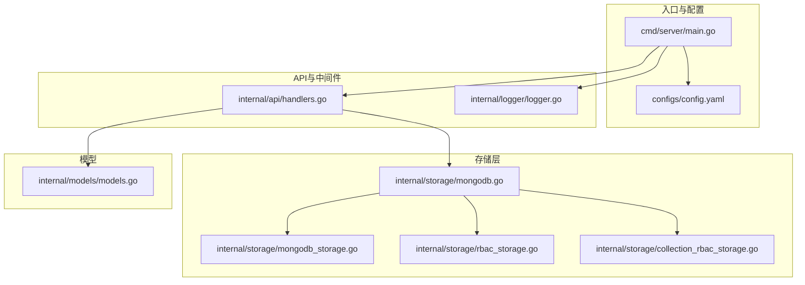
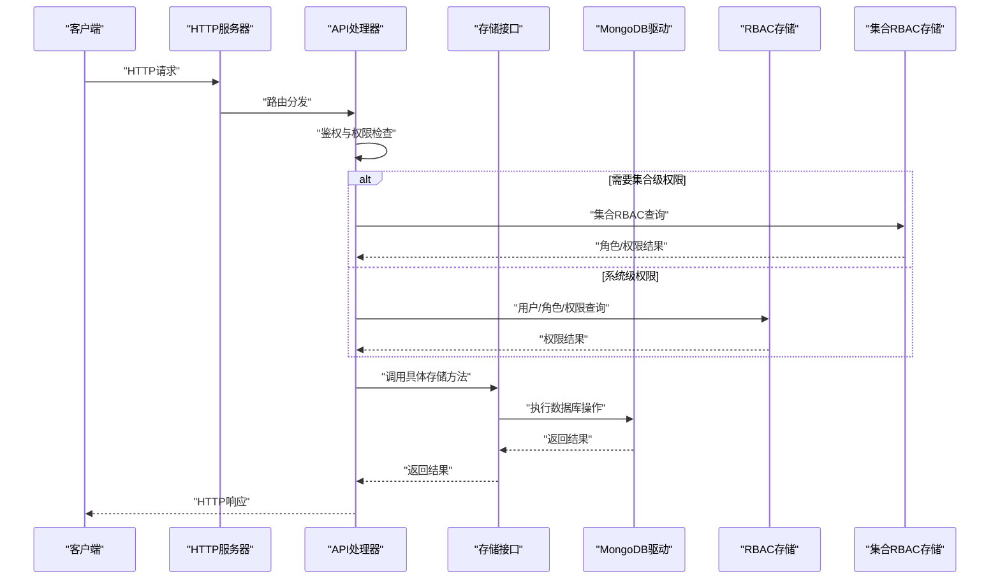
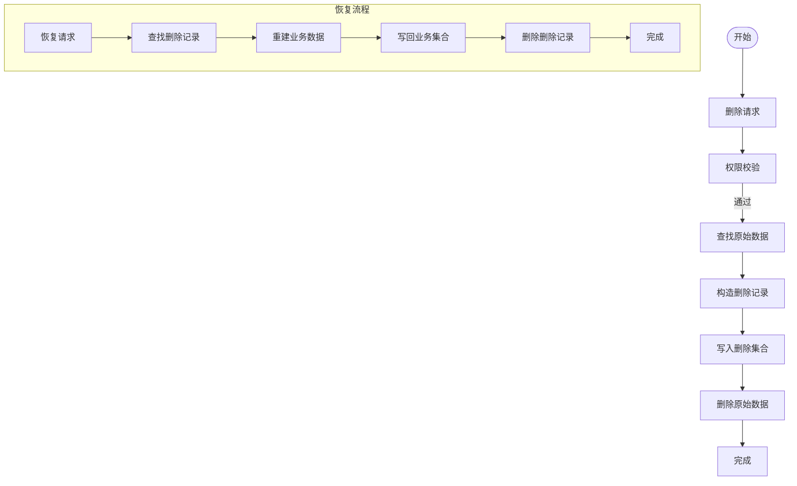
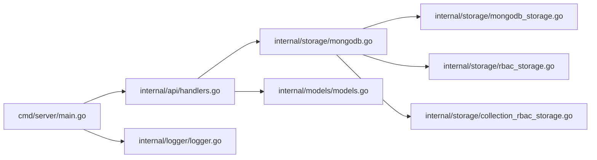

# 数据一致性保证

<cite>
**本文档引用的文件**
- [cmd/server/main.go](file://cmd/server/main.go)
- [configs/config.yaml](file://configs/config.yaml)
- [internal/storage/mongodb.go](file://internal/storage/mongodb.go)
- [internal/storage/mongodb_storage.go](file://internal/storage/mongodb_storage.go)
- [internal/storage/rbac_storage.go](file://internal/storage/rbac_storage.go)
- [internal/storage/collection_rbac_storage.go](file://internal/storage/collection_rbac_storage.go)
- [internal/models/models.go](file://internal/models/models.go)
- [internal/api/handlers.go](file://internal/api/handlers.go)
- [internal/logger/logger.go](file://internal/logger/logger.go)
- [go.mod](file://go.mod)
- [docs/architecture.md](file://docs/architecture.md)
- [docs/architecture_diagrams.md](file://docs/architecture_diagrams.md)
- [docs/business-data.md](file://docs/business-data.md)
- [test/e2e.go](file://test/e2e.go)
</cite>

## 目录
1. [简介](#简介)
2. [项目结构](#项目结构)
3. [核心组件](#核心组件)
4. [架构总览](#架构总览)
5. [详细组件分析](#详细组件分析)
6. [依赖分析](#依赖分析)
7. [性能考虑](#性能考虑)
8. [故障排查指南](#故障排查指南)
9. [结论](#结论)
10. [附录](#附录)

## 简介
本文件聚焦数据中心项目在数据一致性方面的保障机制，结合当前代码库实现，系统阐述：
- MongoDB 读写一致性模型与 CAP 理论的应用
- 副本集配置与故障转移（主从切换、数据同步策略）
- 读偏好设置与多文档事务的使用场景
- 数据备份与恢复（全量与增量）、迁移与升级的一致性策略
- 数据校验与修复机制
- 分布式锁与并发控制
- 数据一致性监控与告警

## 项目结构
项目采用分层架构：入口程序负责环境初始化、服务装配；API 层负责路由与鉴权；存储层封装 MongoDB 访问；模型层定义数据结构；日志模块提供统一日志能力。

**图表来源**
- [cmd/server/main.go:24-150](file://cmd/server/main.go#L24-L150)
- [configs/config.yaml:1-26](file://configs/config.yaml#L1-L26)
- [internal/api/handlers.go:45-181](file://internal/api/handlers.go#L45-L181)
- [internal/storage/mongodb.go:14-90](file://internal/storage/mongodb.go#L14-L90)
- [internal/storage/mongodb_storage.go:27-51](file://internal/storage/mongodb_storage.go#L27-L51)
- [internal/storage/rbac_storage.go:60-79](file://internal/storage/rbac_storage.go#L60-L79)
- [internal/storage/collection_rbac_storage.go:43-62](file://internal/storage/collection_rbac_storage.go#L43-L62)
- [internal/models/models.go:12-365](file://internal/models/models.go#L12-L365)
- [internal/logger/logger.go:14-56](file://internal/logger/logger.go#L14-L56)

**章节来源**
- [cmd/server/main.go:24-150](file://cmd/server/main.go#L24-L150)
- [configs/config.yaml:1-26](file://configs/config.yaml#L1-L26)
- [internal/api/handlers.go:45-181](file://internal/api/handlers.go#L45-L181)
- [internal/storage/mongodb.go:14-90](file://internal/storage/mongodb.go#L14-L90)
- [internal/storage/mongodb_storage.go:27-51](file://internal/storage/mongodb_storage.go#L27-L51)
- [internal/storage/rbac_storage.go:60-79](file://internal/storage/rbac_storage.go#L60-L79)
- [internal/storage/collection_rbac_storage.go:43-62](file://internal/storage/collection_rbac_storage.go#L43-L62)
- [internal/models/models.go:12-365](file://internal/models/models.go#L12-L365)
- [internal/logger/logger.go:14-56](file://internal/logger/logger.go#L14-L56)

## 核心组件
- 存储接口与实现
  - 接口定义了用户、字段定义、业务数据、删除数据、权限、角色、刮削任务、集合管理、动态集合与索引等操作契约
  - 实现层基于官方驱动连接数据库，提供动态集合、索引管理与 CRUD 能力
- RBAC 与集合级 RBAC
  - 系统级 RBAC 存储与集合级 RBAC 存储分离，分别管理用户/角色/权限与集合角色/分配/审计日志
- 模型与审计字段
  - 统一的 BaseModel 包含创建/更新的审计字段，贯穿各实体
- 日志与监控
  - 基于 zerolog 的结构化日志，支持滚动与级别控制

**章节来源**
- [internal/storage/mongodb.go:14-90](file://internal/storage/mongodb.go#L14-L90)
- [internal/storage/mongodb_storage.go:27-51](file://internal/storage/mongodb_storage.go#L27-L51)
- [internal/storage/rbac_storage.go:16-50](file://internal/storage/rbac_storage.go#L16-L50)
- [internal/storage/collection_rbac_storage.go:15-33](file://internal/storage/collection_rbac_storage.go#L15-L33)
- [internal/models/models.go:12-17](file://internal/models/models.go#L12-L17)
- [internal/logger/logger.go:14-56](file://internal/logger/logger.go#L14-L56)

## 架构总览
下图展示从入口到存储的关键交互路径，以及权限控制与日志模块的集成。

**图表来源**
- [cmd/server/main.go:121-135](file://cmd/server/main.go#L121-L135)
- [internal/api/handlers.go:45-181](file://internal/api/handlers.go#L45-L181)
- [internal/storage/mongodb.go:14-90](file://internal/storage/mongodb.go#L14-L90)
- [internal/storage/rbac_storage.go:60-79](file://internal/storage/rbac_storage.go#L60-L79)
- [internal/storage/collection_rbac_storage.go:43-62](file://internal/storage/collection_rbac_storage.go#L43-L62)

## 详细组件分析

### MongoDB 读写一致性模型与 CAP 应用
- 当前实现未显式配置读偏好或事务，所有读写均通过单实例或副本集连接进行
- 一致性策略
  - 写入：使用单文档写入，确保原子性
  - 读取：默认本地可见性，未启用强一致读
- CAP 理论应用
  - 在可扩展性与分区容忍性之间，当前实现偏向 AP（可用性与分区容忍），弱化强一致读
  - 对于强一致读需求，可在连接选项中引入读偏好与读写超时配置

**章节来源**
- [internal/storage/mongodb_storage.go:27-51](file://internal/storage/mongodb_storage.go#L27-L51)
- [configs/config.yaml:2-4](file://configs/config.yaml#L2-L4)

### 副本集配置与故障转移机制
- 连接 URI 支持副本集部署，但当前未配置读偏好与写关注
- 故障转移建议
  - 主节点故障时，驱动自动选择可写主节点
  - 建议在生产环境配置写关注与读偏好，确保在主从切换期间的稳定性

**章节来源**
- [configs/config.yaml:2-4](file://configs/config.yaml#L2-L4)
- [go.mod:11](file://go.mod#L11)

### 读偏好设置与多文档事务
- 读偏好
  - 可通过连接选项设置“首选”、“次要读”等策略，满足跨数据中心读取与延迟优化
- 多文档事务
  - 适用于跨集合/跨文档的强一致写入（如创建集合与角色）
  - 当前集合创建流程包含动态集合与角色创建，建议在事务中执行以保证一致性

**章节来源**
- [internal/storage/mongodb_storage.go:760-766](file://internal/storage/mongodb_storage.go#L760-L766)
- [docs/modules/collection/implementation.md:74-77](file://docs/modules/collection/implementation.md#L74-L77)

### 数据备份与恢复策略
- 全量备份
  - 使用 MongoDB 工具进行逻辑/物理备份，建议在维护窗口执行
- 增量备份
  - 基于 oplog 的增量备份方案，定期抓取 oplog 并应用
- 恢复流程
  - 业务数据软删除与恢复：删除时写入删除集合，恢复时重建业务数据并清理删除记录
  - 刮削任务软删除与恢复：同上

**图表来源**
- [internal/storage/mongodb_storage.go:411-493](file://internal/storage/mongodb_storage.go#L411-L493)
- [internal/storage/mongodb_storage.go:527-562](file://internal/storage/mongodb_storage.go#L527-L562)
- [docs/architecture_diagrams.md:203-228](file://docs/architecture_diagrams.md#L203-L228)

**章节来源**
- [internal/storage/mongodb_storage.go:411-493](file://internal/storage/mongodb_storage.go#L411-L493)
- [internal/storage/mongodb_storage.go:527-562](file://internal/storage/mongodb_storage.go#L527-L562)
- [docs/architecture_diagrams.md:203-228](file://docs/architecture_diagrams.md#L203-L228)

### 数据迁移与升级过程中的数据一致性
- 集合级迁移
  - 通过动态集合创建与索引管理，支持按模块迁移
- 升级策略
  - 建议在事务中执行模式变更与索引重建，避免部分写入导致不一致
  - 升级前进行备份，升级后进行一致性校验

**章节来源**
- [internal/storage/mongodb_storage.go:62-78](file://internal/storage/mongodb_storage.go#L62-L78)
- [internal/storage/mongodb_storage.go:760-766](file://internal/storage/mongodb_storage.go#L760-L766)

### 数据校验与修复机制
- 字段级校验
  - 字段定义包含类型、范围、枚举、正则等约束，业务数据写入前进行校验
- 修复建议
  - 对异常数据进行隔离与修正，必要时重建索引或迁移集合

**章节来源**
- [internal/models/models.go:39-49](file://internal/models/models.go#L39-L49)
- [internal/models/models.go:73-221](file://internal/models/models.go#L73-L221)

### 分布式锁与并发控制
- 并发控制
  - 刮削任务采用工作队列与并发协程，避免资源争用
- 分布式锁
  - 当前未实现分布式锁；建议在需要跨实例互斥的场景引入基于 Redis/MongoDB 的分布式锁

**章节来源**
- [docs/business-data.md:513-518](file://docs/business-data.md#L513-L518)
- [test/e2e.go:152-182](file://test/e2e.go#L152-L182)

### 数据一致性监控与告警
- 日志监控
  - 使用结构化日志记录关键事件，便于检索与告警
- 建议指标
  - 连接池状态、慢查询、错误率、删除/恢复成功率、备份完成度

**章节来源**
- [internal/logger/logger.go:14-56](file://internal/logger/logger.go#L14-L56)
- [docs/architecture.md:269-343](file://docs/architecture.md#L269-L343)

## 依赖分析
- 外部依赖
  - Gin、MongoDB Driver、JWT、Zerolog、Lumberjack 等
- 内部耦合
  - API 层依赖存储接口，存储层依赖 MongoDB 驱动
  - RBAC 与集合级 RBAC 存储相互独立，通过服务层组合

**图表来源**
- [cmd/server/main.go:42-94](file://cmd/server/main.go#L42-L94)
- [internal/api/handlers.go:33-43](file://internal/api/handlers.go#L33-L43)
- [internal/storage/mongodb.go:14-90](file://internal/storage/mongodb.go#L14-L90)
- [internal/storage/mongodb_storage.go:27-51](file://internal/storage/mongodb_storage.go#L27-L51)
- [internal/storage/rbac_storage.go:60-79](file://internal/storage/rbac_storage.go#L60-L79)
- [internal/storage/collection_rbac_storage.go:43-62](file://internal/storage/collection_rbac_storage.go#L43-L62)
- [internal/models/models.go:12-365](file://internal/models/models.go#L12-L365)
- [internal/logger/logger.go:14-56](file://internal/logger/logger.go#L14-L56)

**章节来源**
- [go.mod:5-14](file://go.mod#L5-L14)
- [cmd/server/main.go:42-94](file://cmd/server/main.go#L42-L94)
- [internal/api/handlers.go:33-43](file://internal/api/handlers.go#L33-L43)

## 性能考虑
- 连接池与超时
  - 合理设置连接池大小与读写超时，避免阻塞
- 索引策略
  - 为高频查询字段建立复合索引，减少扫描
- 事务与批量操作
  - 对批量写入使用事务，减少往返开销

[本节为通用指导，无需特定文件引用]

## 故障排查指南
- 连接失败
  - 检查 MongoDB URI 与网络连通性
- 权限不足
  - 核对用户角色与集合级角色分配
- 删除/恢复异常
  - 检查删除集合是否存在对应记录，确认模块与集合命名规则

**章节来源**
- [configs/config.yaml:2-4](file://configs/config.yaml#L2-L4)
- [internal/storage/mongodb_storage.go:411-493](file://internal/storage/mongodb_storage.go#L411-L493)
- [internal/storage/mongodb_storage.go:527-562](file://internal/storage/mongodb_storage.go#L527-L562)

## 结论
当前实现以 AP 为主的数据一致性策略，满足高可用与可扩展性需求。针对强一致读与跨文档事务，建议引入读偏好与事务支持；同时完善备份/恢复、校验/修复、分布式锁与监控告警体系，以进一步提升系统可靠性与运维效率。

[本节为总结，无需特定文件引用]

## 附录
- 关键流程参考
  - 权限控制流程图
  - JQL 查询处理流程图
  - 数据删除与恢复流程图

**章节来源**
- [docs/architecture_diagrams.md:174-229](file://docs/architecture_diagrams.md#L174-L229)