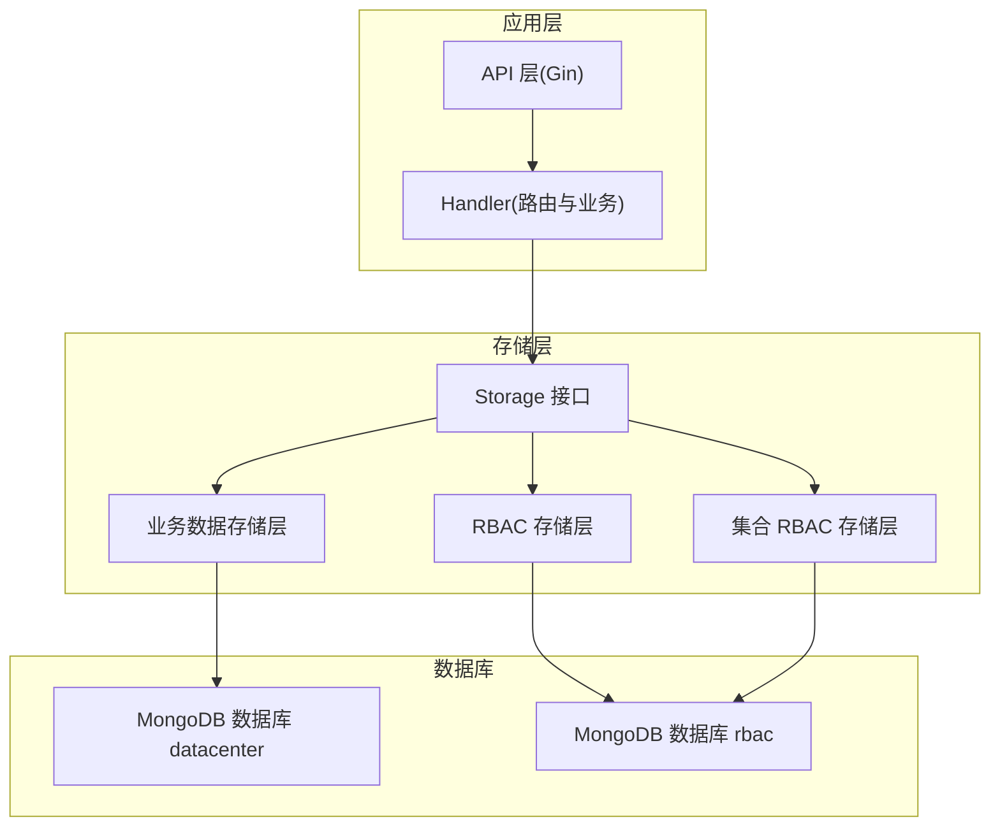
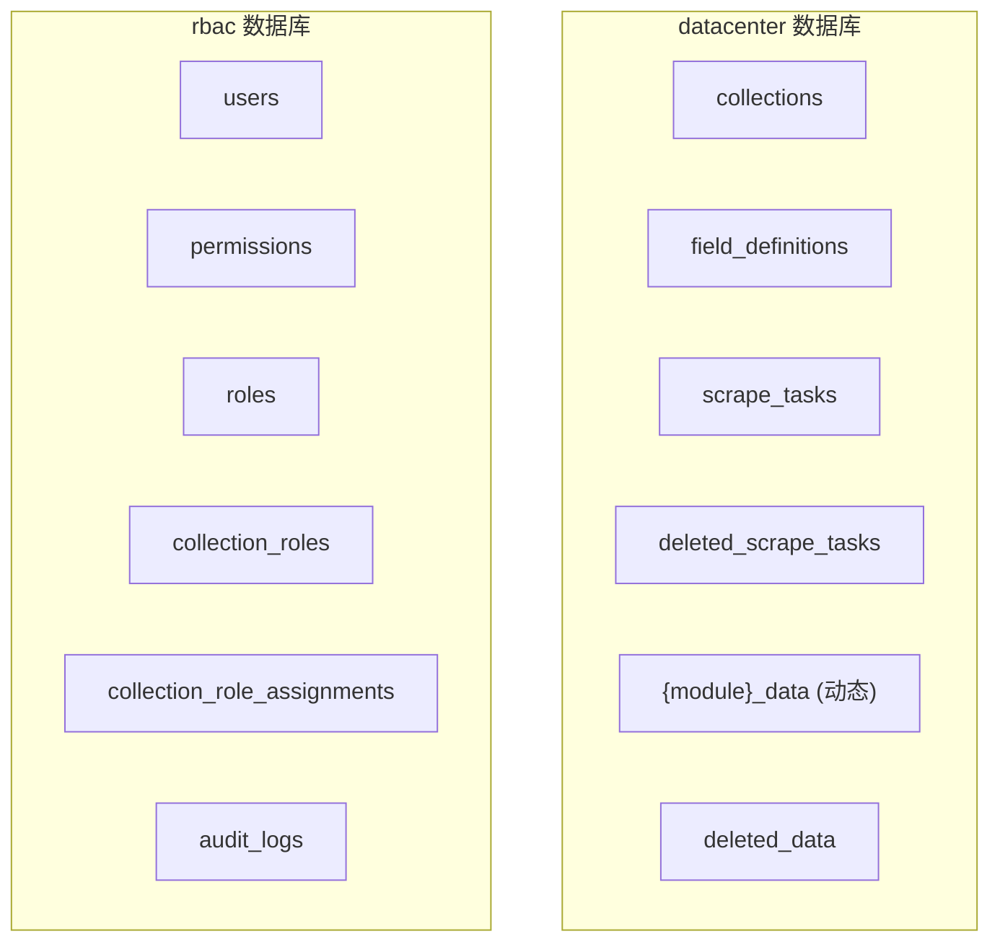
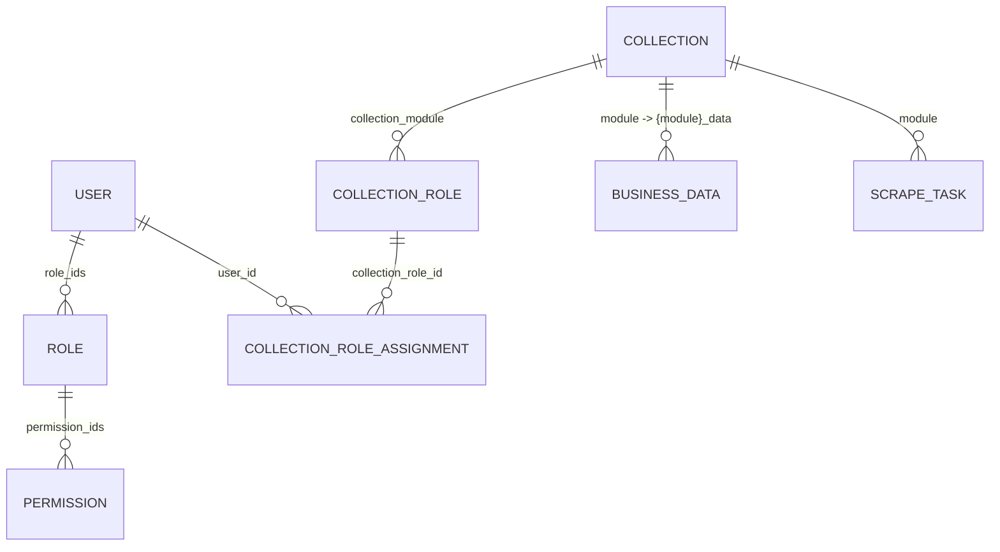
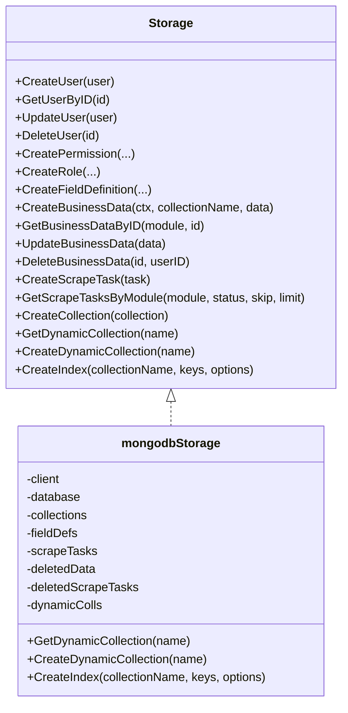
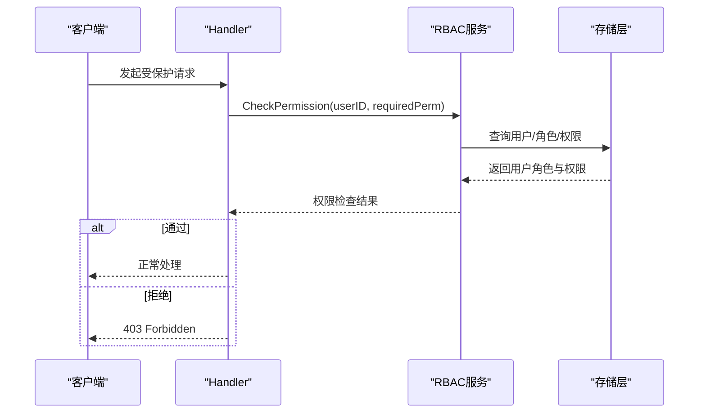
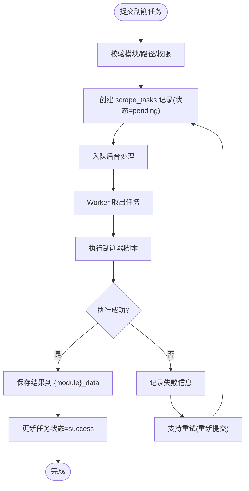
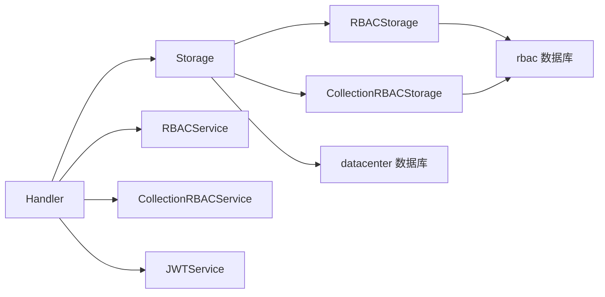

# 数据库设计

<cite>
**本文引用的文件**
- [mongodb.go](file://internal/storage/mongodb.go)
- [mongodb_storage.go](file://internal/storage/mongodb_storage.go)
- [models.go](file://internal/models/models.go)
- [rbac_storage.go](file://internal/storage/rbac_storage.go)
- [collection_rbac_storage.go](file://internal/storage/collection_rbac_storage.go)
- [rbac.go](file://pkg/rbac/rbac.go)
- [collection_rbac.go](file://pkg/rbac/collection_rbac.go)
- [architecture.md](file://docs/architecture.md)
- [business-data.md](file://docs/business-data.md)
- [rbac.md](file://docs/rbac.md)
- [main.go](file://cmd/server/main.go)
- [handlers.go](file://internal/api/handlers.go)
- [config.yaml](file://configs/config.yaml)
</cite>

## 目录
1. [简介](#简介)
2. [项目结构](#项目结构)
3. [核心组件](#核心组件)
4. [架构总览](#架构总览)
5. [详细组件分析](#详细组件分析)
6. [依赖分析](#依赖分析)
7. [性能考虑](#性能考虑)
8. [故障排查指南](#故障排查指南)
9. [结论](#结论)
10. [附录](#附录)

## 简介
本文件面向数据中心项目，系统化阐述基于 MongoDB 的数据库设计与实现，涵盖集合划分原则、文档结构、关系建模策略、索引设计、数据访问层实现、一致性保障、迁移与版本管理、性能监控与调优等内容。文档以代码为依据，结合架构文档与实现文档，帮助读者从整体到细节全面理解数据库设计。

## 项目结构
- 后端采用 Go + Gin + MongoDB，前端采用 React + TypeScript + Ant Design。
- 数据库采用双库设计：业务数据库 datacenter 与权限数据库 rbac 物理隔离。
- 存储层通过接口抽象，分别实现业务数据、RBAC、集合级 RBAC 的访问能力。

图表来源
- [architecture.md:167-186](file://docs/architecture.md#L167-L186)
- [main.go:42-58](file://cmd/server/main.go#L42-L58)

章节来源
- [architecture.md:1-834](file://docs/architecture.md#L1-L834)
- [main.go:1-167](file://cmd/server/main.go#L1-L167)

## 核心组件
- 存储接口与实现
  - Storage 接口：统一抽象业务数据、权限、角色、集合、刮削任务、软删除等 CRUD 与索引管理。
  - mongodbStorage：实现 Storage 接口，负责 datacenter 数据库的集合访问与动态集合管理。
  - rbacMongoDBStorage：实现 RBAC 存储接口，负责 rbac 数据库的用户、权限、角色管理。
  - collectionRBACStorage：实现集合级 RBAC 存储接口，负责集合角色、分配、审计日志。
- 数据模型
  - models 包定义了 BaseModel、User、Role、Permission、FieldDefinition、BusinessData、ScrapeTask、Collection、CollectionRole、CollectionRoleAssignment、AuditLog 等核心模型。
- 权限服务
  - pkg/rbac/rbac.go：系统级 RBAC 权限检查、通配符匹配、API 权限映射。
  - pkg/rbac/collection_rbac.go：集合级 RBAC 权限检查、角色创建与分配、审计日志。

章节来源
- [mongodb.go:14-90](file://internal/storage/mongodb.go#L14-L90)
- [mongodb_storage.go:16-51](file://internal/storage/mongodb_storage.go#L16-L51)
- [rbac_storage.go:16-79](file://internal/storage/rbac_storage.go#L16-L79)
- [collection_rbac_storage.go:15-62](file://internal/storage/collection_rbac_storage.go#L15-L62)
- [models.go:12-365](file://internal/models/models.go#L12-L365)
- [rbac.go:55-114](file://pkg/rbac/rbac.go#L55-L114)
- [collection_rbac.go:27-90](file://pkg/rbac/collection_rbac.go#L27-L90)

## 架构总览
- 双数据库设计
  - datacenter：collections、field_definitions、scrape_tasks、deleted_scrape_tasks、{module}_data、deleted_data。
  - rbac：users、permissions、roles、collection_roles、collection_role_assignments、audit_logs。
- 集合命名与动态集合
  - 动态集合命名规则：{module}_data；支持运行时创建与缓存。
- 索引策略
  - collections.module 唯一索引；field_definitions.module+field_name 复合唯一索引；scrape_tasks.module+status、created_at 等复合/单列索引。
- 权限模型
  - 系统级 RBAC（用户-角色-权限）+ 集合级 RBAC（Owner/Operator/Tourist）。

图表来源
- [architecture.md:169-209](file://docs/architecture.md#L169-L209)

章节来源
- [architecture.md:167-209](file://docs/architecture.md#L167-L209)
- [business-data.md:399-425](file://docs/business-data.md#L399-L425)

## 详细组件分析

### 数据模型与文档结构
- BaseModel：统一审计字段 created_by、created_at、updated_by、updated_at。
- 用户(User)：username、email、role_ids、密码字段（接口返回时清空）。
- 角色(Role)：name、code、permission_ids。
- 权限(Permission)：name、code。
- 字段定义(FieldDefinition)：module、field_name、field_type、required、default_value、constraints。
- 业务数据(BusinessData)：module、description、custom_fields、file_path。
- 刮削任务(ScrapeTask)：module、data_path、scraper_path、status、result、error_message、started_at、completed_at、business_data_id、description。
- 集合(Collection)：module、description、datatype_owner、collection_name。
- 集合角色(CollectionRole)：collection_module、name、code、type(owner/operator/tourist)、permission_ids。
- 角色分配(CollectionRoleAssignment)：user_id、collection_module、collection_role_id。
- 审计日志(AuditLog)：timestamp、user_id、username、action、resource、resource_id、details、ip_address、user_agent。

图表来源
- [models.go:247-365](file://internal/models/models.go#L247-L365)
- [architecture.md:209-241](file://docs/architecture.md#L209-L241)

章节来源
- [models.go:12-365](file://internal/models/models.go#L12-L365)
- [architecture.md:209-241](file://docs/architecture.md#L209-L241)

### 集合划分与关系建模
- 集合划分原则
  - 业务数据按模块拆分，集合名为 {module}_data，天然隔离不同业务域。
  - 字段定义与集合元数据集中管理，便于统一治理。
- 关系建模策略
  - 用户-角色-权限：通过数组嵌入实现多对多，配合数组原子操作符 $addToSet/$pull 管理关系。
  - 集合级角色：通过 collection_roles 与 collection_role_assignments 建立模块级权限矩阵。
  - 软删除：deleted_data、deleted_scrape_tasks 保留原始数据快照，支持恢复。

章节来源
- [business-data.md:93-133](file://docs/business-data.md#L93-L133)
- [rbac.md:38-91](file://docs/rbac.md#L38-L91)
- [collection_rbac.go:129-194](file://pkg/rbac/collection_rbac.go#L129-L194)

### 索引设计策略
- 集合级索引
  - collections.module：唯一索引，加速模块查询。
  - field_definitions.module+field_name：复合唯一索引，避免重复字段定义。
  - scrape_tasks.module+status：复合索引，支持按模块与状态过滤。
  - scrape_tasks.created_at：降序索引，支持按时间排序。
- 动态索引
  - 通过接口为 {module}_data 等动态集合创建索引，支持复合索引与手动管理。
- 全文索引
  - 项目未见显式全文索引定义；如需全文检索，可在业务字段上创建文本索引并配合查询。

章节来源
- [business-data.md:400-425](file://docs/business-data.md#L400-L425)
- [mongodb_storage.go:71-78](file://internal/storage/mongodb_storage.go#L71-L78)

### 数据访问层实现细节
- Storage 接口与实现
  - 统一抽象 CRUD、分页、统计、软删除、索引管理等能力。
  - mongodbStorage.GetDynamicCollection 缓存动态集合句柄，减少重复获取。
  - CreateDynamicCollection 在运行时创建集合，并加入缓存。
  - CreateIndex 通过 mongo.IndexModel 创建索引。
- RBAC 存储
  - rbacMongoDBStorage：用户、角色、权限的 CRUD 与数组关系维护。
  - collectionRBACStorage：集合角色、分配、审计日志的 CRUD。
- 事务处理
  - MongoDB 驱动不支持跨文档事务；项目通过应用层“先写元数据，再写业务数据”的顺序与幂等设计规避一致性问题；集合级角色创建失败时进行回滚。

图表来源
- [mongodb.go:14-90](file://internal/storage/mongodb.go#L14-L90)
- [mongodb_storage.go:16-60](file://internal/storage/mongodb_storage.go#L16-L60)

章节来源
- [mongodb.go:14-90](file://internal/storage/mongodb.go#L14-L90)
- [mongodb_storage.go:16-89](file://internal/storage/mongodb_storage.go#L16-L89)

### 权限检查流程与中间件
- 系统级 RBAC
  - CheckPermission：遍历用户角色，合并权限集合，支持通配符匹配。
  - API 权限映射：根据 HTTP 方法与路径推导所需权限。
- 集合级 RBAC
  - CheckCollectionPermission：优先检查系统级权限，其次检查集合角色分配与权限代码。
  - 中间件：CollectionPermissionMiddleware 从 URL 参数或请求体提取 module，进行权限校验。
- 审计日志
  - 集合角色分配/移除时记录审计日志，包含操作人、目标用户、资源、IP 等。

图表来源
- [rbac.go:63-99](file://pkg/rbac/rbac.go#L63-L99)
- [handlers.go:139-160](file://internal/api/handlers.go#L139-L160)

章节来源
- [rbac.go:55-171](file://pkg/rbac/rbac.go#L55-L171)
- [collection_rbac.go:39-90](file://pkg/rbac/collection_rbac.go#L39-L90)
- [handlers.go:49-181](file://internal/api/handlers.go#L49-L181)

### 刮削任务与业务数据流程
- 刮削任务状态机：pending → scraping → success/fail；失败可重试。
- 业务数据存储：动态集合 {module}_data，custom_fields 存放自定义字段。
- 软删除与恢复：deleted_data、deleted_scrape_tasks 支持恢复。

图表来源
- [business-data.md:14-92](file://docs/business-data.md#L14-L92)
- [mongodb_storage.go:571-686](file://internal/storage/mongodb_storage.go#L571-L686)

章节来源
- [business-data.md:65-92](file://docs/business-data.md#L65-L92)
- [mongodb_storage.go:571-686](file://internal/storage/mongodb_storage.go#L571-L686)

## 依赖分析
- 组件耦合
  - Handler 依赖 Storage、RBACStorage、CollectionRBACStorage、JWTService、Scrape 系统。
  - Storage 接口解耦业务数据与权限数据，分别对接 datacenter 与 rbac 数据库。
- 外部依赖
  - MongoDB 驱动：bson、mongo、options。
  - Gin：路由与中间件。
  - bcrypt：密码哈希。
- 循环依赖
  - 未发现循环依赖；接口抽象清晰。

图表来源
- [handlers.go:23-43](file://internal/api/handlers.go#L23-L43)
- [main.go:94-95](file://cmd/server/main.go#L94-L95)

章节来源
- [handlers.go:23-43](file://internal/api/handlers.go#L23-L43)
- [main.go:94-95](file://cmd/server/main.go#L94-L95)

## 性能考虑
- 查询优化
  - 为高频过滤字段建立复合索引（如 scrape_tasks.module+status）。
  - 使用投影与分页参数（skip/limit/page/pageSize）控制返回规模。
  - 对嵌套字段 custom_fields 的查询，遵循 JQL 前缀转换规则，避免全表扫描。
- 索引管理
  - 提供动态索引创建/删除接口，支持按需扩展。
  - 定期评估索引选择性与写入开销，平衡读写性能。
- 存储优化
  - 软删除保留历史，定期清理 deleted_data/ deleted_scrape_tasks。
  - 控制 custom_fields 字段复杂度，避免超大文档。
- 并发与队列
  - 刮削系统使用 goroutine + channel 队列，合理配置 workers 与队列缓冲区。
- 监控与诊断
  - 使用慢查询日志与聚合管道分析热点查询。
  - 结合应用日志定位性能瓶颈。

[本节为通用指导，无需特定文件引用]

## 故障排查指南
- 权限相关
  - 403：检查用户角色与权限集合，确认通配符匹配是否生效。
  - 无权限：确认中间件是否正确注入，URL 参数 module 是否传递。
- 数据访问
  - ObjectID 解析失败：确认传入 ID 格式。
  - 集合不存在：确认动态集合是否已创建或缓存是否命中。
- 刮削任务
  - 任务状态异常：检查 scrape_tasks 状态流转与执行日志。
  - 结果未入库：检查 custom_fields 结构与字段验证。
- 索引问题
  - 查询慢：检查是否命中预期索引，必要时重建或调整复合索引。

章节来源
- [rbac.md:467-482](file://docs/rbac.md#L467-L482)
- [business-data.md:466-485](file://docs/business-data.md#L466-L485)

## 结论
本数据库设计以双库分离、集合按模块拆分、动态集合与强约束字段验证为核心，结合系统级与集合级 RBAC，形成清晰的权限边界与数据治理路径。通过接口抽象与中间件链路，实现了可扩展、可维护、可监控的数据库访问层。建议在生产环境中持续关注索引策略、软删除清理与性能监控，确保系统长期稳定高效运行。

[本节为总结，无需特定文件引用]

## 附录

### 数据库配置
- 连接配置
  - datacenter 数据库：MONGODB_URI + MONGODB_DATABASE
  - rbac 数据库：MONGODB_RBAC_URI + MONGODB_RBAC_DATABASE
- JWT 配置：JWT_SECRET、JWT_EXPIRATION、JWT_REFRESH_EXPIRATION
- 日志配置：日志级别、文件路径、轮转参数

章节来源
- [config.yaml:1-26](file://configs/config.yaml#L1-L26)
- [main.go:42-58](file://cmd/server/main.go#L42-L58)

### 关键 API 与权限映射
- 用户管理：user:read / user:write
- 角色管理：role:read / role:write
- 权限管理：permission:read / permission:write
- 集合管理：collection:read / collection:write
- 字段管理：field:read / field:write
- 数据管理：data:read / data:write
- 刮削管理：scrape:read / scrape:write

章节来源
- [architecture.md:400-413](file://docs/architecture.md#L400-L413)
- [rbac.go:173-249](file://pkg/rbac/rbac.go#L173-L249)