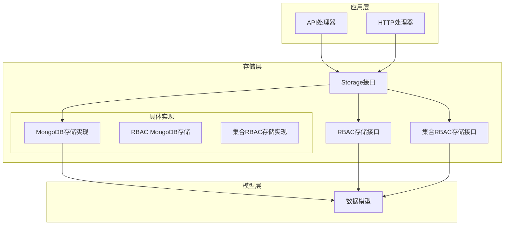
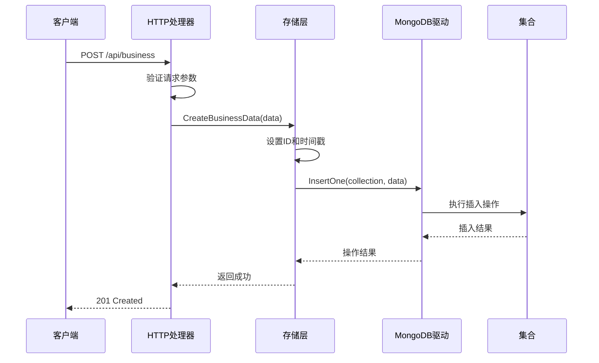
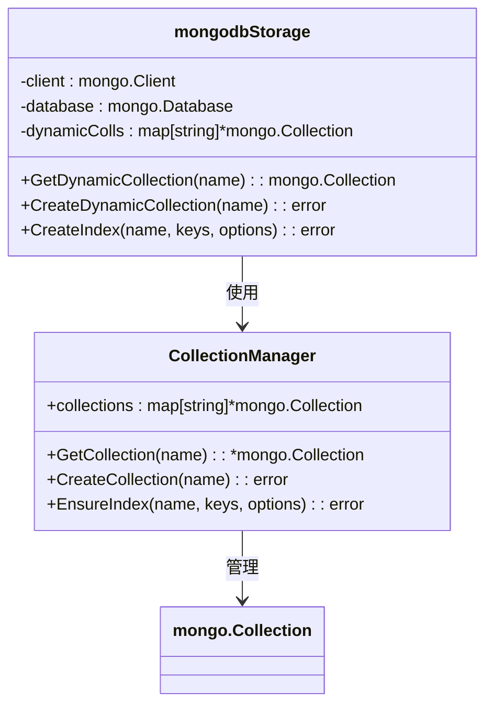
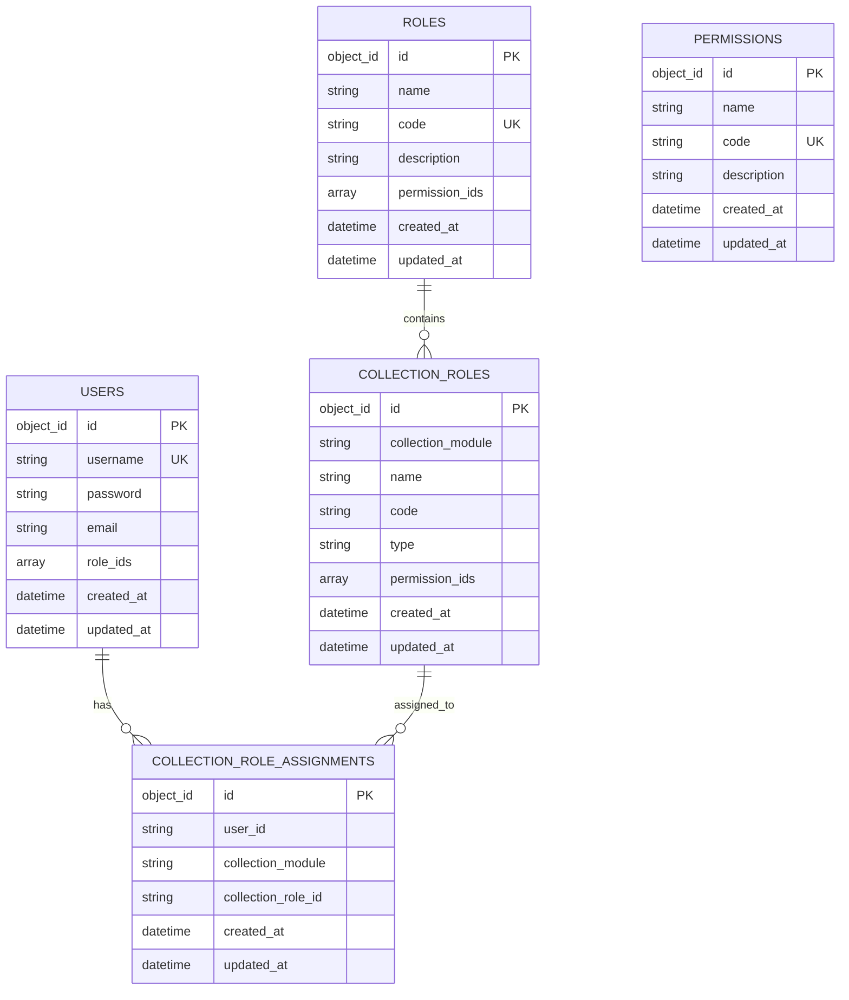
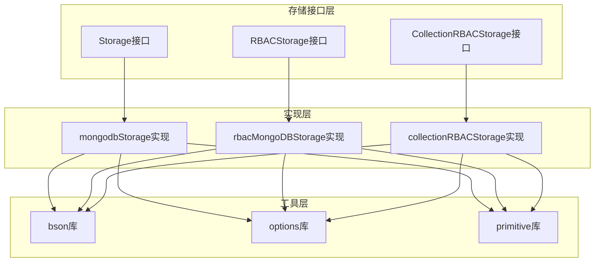

# 数据访问层实现

<cite>
**本文档引用的文件**
- [mongodb.go](file://internal/storage/mongodb.go)
- [mongodb_storage.go](file://internal/storage/mongodb_storage.go)
- [rbac_storage.go](file://internal/storage/rbac_storage.go)
- [collection_rbac_storage.go](file://internal/storage/collection_rbac_storage.go)
- [models.go](file://internal/models/models.go)
- [main.go](file://cmd/server/main.go)
- [handlers.go](file://internal/api/handlers.go)
- [logger.go](file://internal/logger/logger.go)
- [config.yaml](file://configs/config.yaml)
</cite>

## 目录
1. [简介](#简介)
2. [项目结构](#项目结构)
3. [核心组件](#核心组件)
4. [架构概览](#架构概览)
5. [详细组件分析](#详细组件分析)
6. [依赖分析](#依赖分析)
7. [性能考虑](#性能考虑)
8. [故障排除指南](#故障排除指南)
9. [结论](#结论)
10. [附录](#附录)

## 简介
本文档深入分析数据中心项目的数据访问层实现，重点涵盖Storage接口的设计理念、CRUD操作的MongoDB驱动调用、查询优化技术、事务处理与并发控制、错误处理与异常恢复机制、批量操作优化策略，以及缓存策略和性能监控方法。通过对核心存储实现文件的详细解读，帮助开发者全面理解数据访问层的架构设计与最佳实践。

## 项目结构
数据中心项目采用分层架构设计，数据访问层位于internal/storage目录下，包含多个专门的存储实现模块：



**图表来源**
- [mongodb.go:14-90](file://internal/storage/mongodb.go#L14-L90)
- [mongodb_storage.go:16-25](file://internal/storage/mongodb_storage.go#L16-L25)
- [rbac_storage.go:16-50](file://internal/storage/rbac_storage.go#L16-L50)

**章节来源**
- [mongodb.go:1-91](file://internal/storage/mongodb.go#L1-L91)
- [mongodb_storage.go:1-829](file://internal/storage/mongodb_storage.go#L1-L829)
- [rbac_storage.go:1-476](file://internal/storage/rbac_storage.go#L1-L476)
- [collection_rbac_storage.go:1-244](file://internal/storage/collection_rbac_storage.go#L1-L244)

## 核心组件
数据访问层的核心是Storage接口，它定义了统一的数据访问抽象，涵盖了用户管理、权限控制、业务数据、刮削任务等多个领域的CRUD操作。

### Storage接口设计理念
Storage接口采用统一抽象设计，将不同类型的业务数据访问操作进行了合理的分类和封装：

- **用户相关操作**：CreateUser、GetUserByID、UpdateUser、DeleteUser等
- **字段定义管理**：CreateFieldDefinition、GetFieldDefinitionsByModule等
- **业务数据管理**：CreateBusinessData、GetBusinessDataByModule、UpdateBusinessData等
- **删除数据管理**：GetDeletedDataByModule、RecoverDeletedData、CleanupDeletedData等
- **权限角色管理**：CreatePermission、GetPermissions、UpdateRole等
- **刮削任务管理**：CreateScrapeTask、GetScrapeTasksByModule、DeleteScrapeTask等
- **集合管理**：CreateCollection、GetCollections、UpdateCollection等
- **动态集合支持**：GetDynamicCollection、CreateDynamicCollection、CreateIndex等

每个方法都遵循一致的命名规范和参数约定，确保了接口的一致性和易用性。

**章节来源**
- [mongodb.go:14-90](file://internal/storage/mongodb.go#L14-L90)

## 架构概览
数据访问层采用多数据库分离的设计模式，将业务数据和RBAC数据分别存储在不同的数据库实例中：

```mermaid
graph TB
subgraph "MongoDB集群"
subgraph "业务数据库(datacenter)"
Users[users集合]
Permissions[permissions集合]
Roles[roles集合]
Collections[collections集合]
FieldDefs[field_definitions集合]
ScrapeTasks[scrape_tasks集合]
DeletedData[deleted_data集合]
DeletedScrapeTasks[deleted_scrape_tasks集合]
subgraph "动态业务数据"
DynamicData[模块+\"_data\"集合]
end
end
subgraph "RBAC数据库(rbac)"
RBACUsers[users集合]
RBACPermissions[permissions集合]
RBACRoles[roles集合]
CollectionRoles[collection_roles集合]
CollectionAssignments[collection_role_assignments集合]
AuditLogs[audit_logs集合]
end
end
subgraph "应用层"
StorageLayer[存储层]
BusinessStorage[业务存储]
RBACStorage[RBAC存储]
CollectionRBACStorage[集合RBAC存储]
end
StorageLayer --> BusinessStorage
StorageLayer --> RBACStorage
StorageLayer --> CollectionRBACStorage
BusinessStorage --> Users
BusinessStorage --> DynamicData
RBACStorage --> RBACUsers
CollectionRBACStorage --> CollectionRoles
```

**图表来源**
- [mongodb_storage.go:39-48](file://internal/storage/mongodb_storage.go#L39-L48)
- [rbac_storage.go:72-78](file://internal/storage/rbac_storage.go#L72-L78)
- [collection_rbac_storage.go:55-61](file://internal/storage/collection_rbac_storage.go#L55-L61)

## 详细组件分析

### MongoDB存储实现分析

#### CRUD操作实现
MongoDB存储实现提供了完整的CRUD操作，每种操作都遵循一致的实现模式：

**创建操作**：
- 自动生成ObjectID作为主键
- 设置创建时间和更新时间戳
- 使用InsertOne进行单条数据插入

**查询操作**：
- 使用FindOne进行单条查询
- 使用Find配合options进行批量查询
- 支持投影、排序、分页等高级查询功能

**更新操作**：
- 更新时间戳自动维护
- 使用UpdateOne进行精确更新
- 支持部分字段更新($set操作符)

**删除操作**：
- 支持软删除和硬删除两种模式
- 删除时生成审计日志
- 提供数据恢复功能



**图表来源**
- [mongodb_storage.go:338-347](file://internal/storage/mongodb_storage.go#L338-L347)
- [handlers.go:107-109](file://internal/api/handlers.go#L107-L109)

**章节来源**
- [mongodb_storage.go:84-131](file://internal/storage/mongodb_storage.go#L84-L131)
- [mongodb_storage.go:133-146](file://internal/storage/mongodb_storage.go#L133-L146)
- [mongodb_storage.go:114-122](file://internal/storage/mongodb_storage.go#L114-L122)

#### 动态集合管理
系统实现了动态集合管理机制，支持按模块动态创建和访问集合：



**图表来源**
- [mongodb_storage.go:53-78](file://internal/storage/mongodb_storage.go#L53-L78)

**章节来源**
- [mongodb_storage.go:53-78](file://internal/storage/mongodb_storage.go#L53-L78)

### RBAC存储实现分析

#### 用户权限管理
RBAC存储实现了完整的用户权限管理体系，包括用户、角色、权限的三层关系：



**图表来源**
- [models.go:247-364](file://internal/models/models.go#L247-L364)
- [rbac_storage.go:52-58](file://internal/storage/rbac_storage.go#L52-L58)

**章节来源**
- [rbac_storage.go:166-216](file://internal/storage/rbac_storage.go#L166-L216)
- [rbac_storage.go:307-377](file://internal/storage/rbac_storage.go#L307-L377)

#### 默认数据初始化
系统提供了默认数据初始化功能，自动创建必要的权限和角色：

**章节来源**
- [rbac_storage.go:81-164](file://internal/storage/rbac_storage.go#L81-L164)

### 集合RBAC存储实现分析

#### 集合级别的权限控制
集合RBAC存储实现了更细粒度的权限控制，支持按集合模块进行权限管理：

**章节来源**
- [collection_rbac_storage.go:15-33](file://internal/storage/collection_rbac_storage.go#L15-L33)
- [collection_rbac_storage.go:131-156](file://internal/storage/collection_rbac_storage.go#L131-L156)

## 依赖分析

### 组件耦合关系
数据访问层的组件之间具有清晰的职责划分和较低的耦合度：



**图表来源**
- [mongodb.go:3-12](file://internal/storage/mongodb.go#L3-L12)
- [mongodb_storage.go:3-14](file://internal/storage/mongodb_storage.go#L3-L14)

### 外部依赖关系
系统对外部依赖主要集中在MongoDB驱动和相关工具库：

**章节来源**
- [mongodb_storage.go:3-14](file://internal/storage/mongodb_storage.go#L3-L14)
- [rbac_storage.go:3-14](file://internal/storage/rbac_storage.go#L3-L14)
- [collection_rbac_storage.go:3-14](file://internal/storage/collection_rbac_storage.go#L3-L14)

## 性能考虑

### 查询优化技术

#### 分页和排序优化
系统实现了高效的分页查询机制，支持多种排序策略：

**章节来源**
- [mongodb_storage.go:133-146](file://internal/storage/mongodb_storage.go#L133-L146)
- [mongodb_storage.go:182-195](file://internal/storage/mongodb_storage.go#L182-L195)

#### 索引管理
系统提供了动态索引创建和管理功能：

**章节来源**
- [mongodb_storage.go:71-78](file://internal/storage/mongodb_storage.go#L71-L78)
- [handlers.go:1613-1654](file://internal/api/handlers.go#L1613-L1654)

### 批量操作优化

#### 批量插入策略
系统支持动态集合的批量插入优化：

**章节来源**
- [mongodb_storage.go:338-347](file://internal/storage/mongodb_storage.go#L338-L347)

#### 批量删除操作
系统提供了批量删除功能，支持条件筛选：

**章节来源**
- [mongodb_storage.go:648-686](file://internal/storage/mongodb_storage.go#L648-L686)

### 缓存策略
当前实现中未发现显式的缓存机制，但可以考虑以下优化方案：

1. **读缓存策略**：对频繁查询的静态数据建立缓存
2. **写缓存策略**：对热点数据进行写缓存
3. **缓存失效机制**：基于时间或事件触发的缓存更新

## 故障排除指南

### 错误处理机制
系统采用了多层次的错误处理策略：

#### 连接错误处理
- 数据库连接失败时返回详细的错误信息
- 支持重连机制和超时设置

#### 查询错误处理
- 查询异常时提供具体的错误上下文
- 支持查询超时和取消操作

#### 数据一致性保证
- 使用原子操作确保数据完整性
- 提供事务支持以保证复杂操作的原子性

**章节来源**
- [mongodb_storage.go:27-51](file://internal/storage/mongodb_storage.go#L27-L51)
- [main.go:42-58](file://cmd/server/main.go#L42-L58)

### 异常恢复机制
系统具备完善的异常恢复能力：

#### 自动恢复
- 数据库连接断开后自动重连
- 查询超时后的重试机制

#### 数据恢复
- 删除数据的恢复功能
- 刮削任务的恢复机制

**章节来源**
- [mongodb_storage.go:527-562](file://internal/storage/mongodb_storage.go#L527-L562)
- [mongodb_storage.go:721-753](file://internal/storage/mongodb_storage.go#L721-L753)

### 性能监控
系统集成了日志监控功能，支持性能指标收集：

**章节来源**
- [logger.go:14-56](file://internal/logger/logger.go#L14-L56)

## 结论
数据中心项目的数据访问层实现了高度模块化和可扩展的设计。通过Storage接口的统一抽象，系统能够灵活地支持多种数据访问场景。MongoDB驱动的深度集成提供了强大的查询能力和性能优化空间。RBAC存储实现了完整的权限管理体系，支持细粒度的权限控制。整体架构设计合理，代码结构清晰，为后续的功能扩展和性能优化奠定了良好的基础。

## 附录

### 配置文件说明
系统使用YAML格式的配置文件进行配置管理：

**章节来源**
- [config.yaml:1-26](file://configs/config.yaml#L1-L26)

### 启动流程
系统启动时的初始化顺序：

**章节来源**
- [main.go:24-95](file://cmd/server/main.go#L24-L95)

### 数据模型概览
系统的核心数据模型包括用户、权限、角色、业务数据等实体：

**章节来源**
- [models.go:12-365](file://internal/models/models.go#L12-L365)