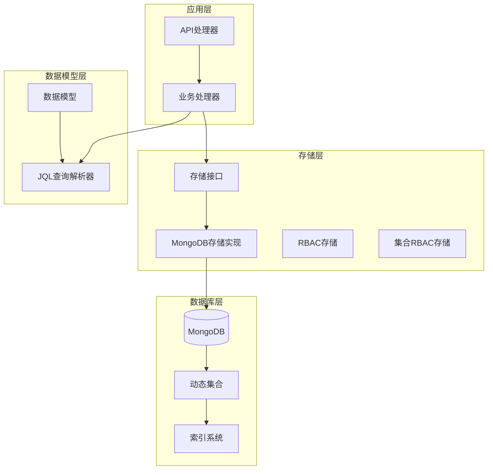
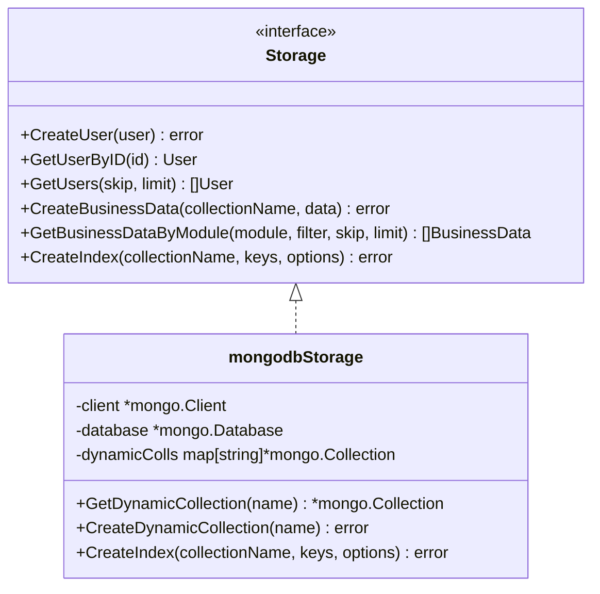
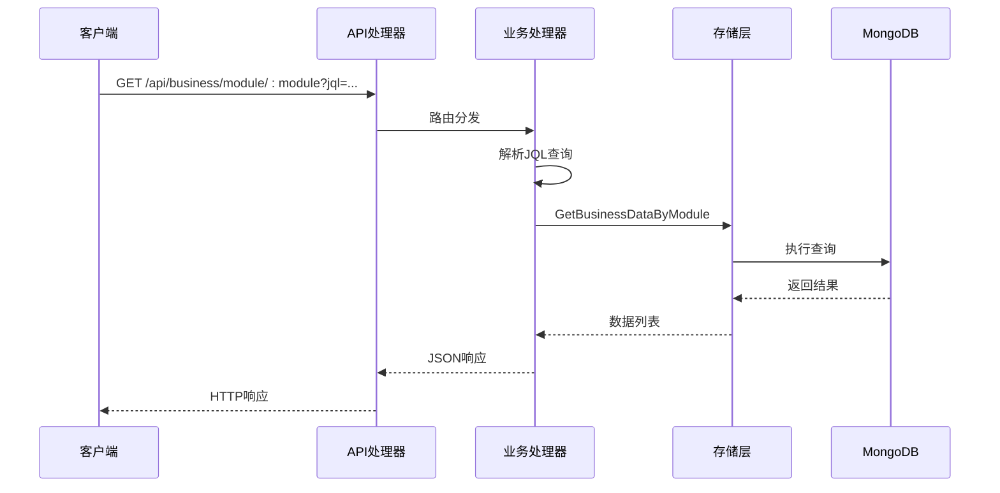
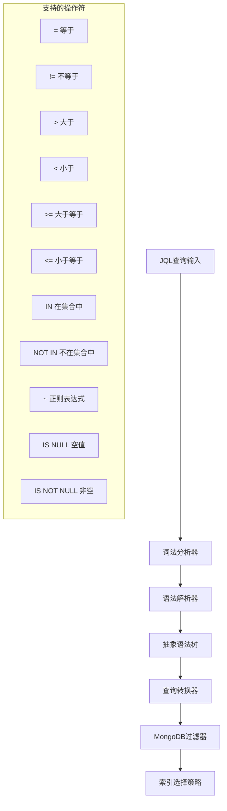
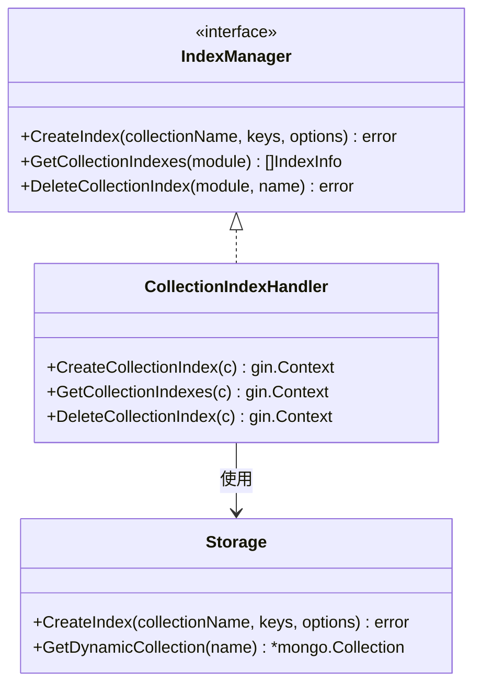
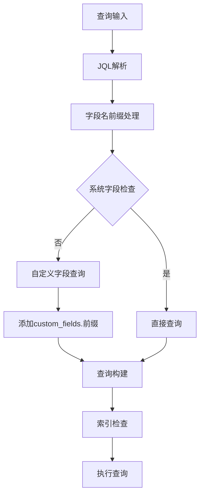
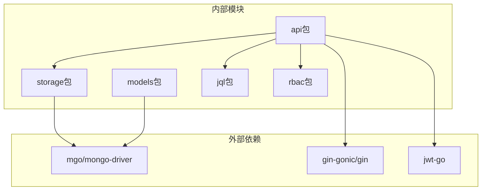
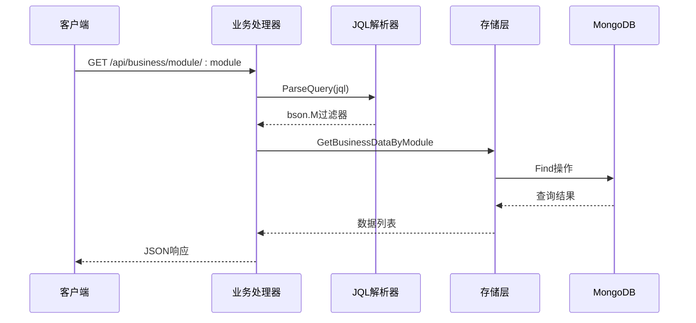

# 索引设计策略

<cite>
**本文档引用的文件**
- [main.go](file://cmd/server/main.go)
- [mongodb.go](file://internal/storage/mongodb.go)
- [mongodb_storage.go](file://internal/storage/mongodb_storage.go)
- [models.go](file://internal/models/models.go)
- [parser.go](file://pkg/jql/parser.go)
- [handlers.go](file://internal/api/handlers.go)
- [rbac_storage.go](file://internal/storage/rbac_storage.go)
- [collection_rbac_storage.go](file://internal/storage/collection_rbac_storage.go)
- [query.md](file://docs/query.md)
- [business-data.md](file://docs/modules/business-data.md)
</cite>

## 目录
1. [简介](#简介)
2. [项目结构](#项目结构)
3. [核心组件](#核心组件)
4. [架构概览](#架构概览)
5. [详细组件分析](#详细组件分析)
6. [依赖关系分析](#依赖关系分析)
7. [性能考量](#性能考量)
8. [故障排除指南](#故障排除指南)
9. [结论](#结论)

## 简介

本文件为数据中心项目的索引设计策略文档，基于项目现有的MongoDB存储层和JQL查询系统，提供全面的索引设计指导。项目采用Go语言开发，使用MongoDB作为主要数据存储，支持动态集合管理和JQL查询语言。本文档涵盖各种索引类型的使用场景、设计原则、性能影响分析以及最佳实践建议。

## 项目结构

数据中心项目采用分层架构设计，核心组件包括：

**图表来源**
- [main.go:24-150](file://cmd/server/main.go#L24-L150)
- [mongodb.go:14-90](file://internal/storage/mongodb.go#L14-L90)

**章节来源**
- [main.go:24-150](file://cmd/server/main.go#L24-L150)
- [mongodb.go:14-90](file://internal/storage/mongodb.go#L14-L90)

## 核心组件

### 存储接口设计

项目实现了统一的存储接口，支持多种数据类型的CRUD操作：

**图表来源**
- [mongodb.go:14-90](file://internal/storage/mongodb.go#L14-L90)
- [mongodb_storage.go:16-25](file://internal/storage/mongodb_storage.go#L16-L25)

### 数据模型结构

项目使用统一的BaseModel作为所有实体的基础：

| 字段名 | 类型 | 描述 | 索引建议 |
|--------|------|------|----------|
| `_id` | ObjectId | 主键标识符 | 主键索引 |
| `created_by` | string | 创建者ID | 可选索引 |
| `created_at` | datetime | 创建时间 | 可选索引 |
| `updated_by` | string | 更新者ID | 可选索引 |
| `updated_at` | datetime | 更新时间 | 可选索引 |

**章节来源**
- [models.go:12-17](file://internal/models/models.go#L12-L17)
- [mongodb_storage.go:338-409](file://internal/storage/mongodb_storage.go#L338-L409)

## 架构概览

项目采用RESTful API架构，支持动态集合管理和JQL查询语言：

**图表来源**
- [handlers.go:1013-1049](file://internal/api/handlers.go#L1013-L1049)
- [mongodb_storage.go:366-395](file://internal/storage/mongodb_storage.go#L366-L395)

## 详细组件分析

### JQL查询系统

JQL查询语言支持复杂的查询表达式，需要相应的索引策略：

**图表来源**
- [parser.go:46-65](file://pkg/jql/parser.go#L46-L65)
- [parser.go:538-574](file://pkg/jql/parser.go#L538-L574)

#### JQL操作符映射

| JQL操作符 | MongoDB操作符 | 索引适用性 |
|-----------|---------------|------------|
| `=` | `$eq` | ✅ 完全适用 |
| `!=` | `$ne` | ✅ 适用 |
| `>` | `$gt` | ✅ 部分适用 |
| `<` | `$lt` | ✅ 部分适用 |
| `>=` | `$gte` | ✅ 部分适用 |
| `<=` | `$lte` | ✅ 部分适用 |
| `IN` | `$in` | ✅ 完全适用 |
| `NOT IN` | `$nin` | ✅ 适用 |
| `~` | `$regex` | ❌ 不推荐 |
| `IS NULL` | `$exists: false` | ✅ 适用 |
| `IS NOT NULL` | `$exists: true` | ✅ 适用 |

**章节来源**
- [parser.go:538-574](file://pkg/jql/parser.go#L538-L574)
- [query.md:86-101](file://docs/query.md#L86-L101)

### 索引创建接口

项目提供了完整的索引管理接口：

**图表来源**
- [handlers.go:1578-1654](file://internal/api/handlers.go#L1578-L1654)
- [mongodb.go:89](file://internal/storage/mongodb.go#L89)

#### 索引选项配置

| 选项名称 | 类型 | 描述 | 默认值 |
|----------|------|------|--------|
| `name` | string | 索引名称 | 自动生成 |
| `unique` | bool | 是否唯一索引 | false |
| `background` | bool | 是否后台创建 | false |
| `sparse` | bool | 是否稀疏索引 | false |
| `expireAfterSeconds` | int | 过期时间(秒) | 无过期 |

**章节来源**
- [handlers.go:1600-1610](file://internal/api/handlers.go#L1600-L1610)
- [mongodb_storage.go:71-78](file://internal/storage/mongodb_storage.go#L71-L78)

### 业务数据查询优化

业务数据查询支持自定义字段和系统字段的组合查询：

**图表来源**
- [handlers.go:1019-1029](file://internal/api/handlers.go#L1019-L1029)
- [handlers.go:1782-1833](file://internal/api/handlers.go#L1782-L1833)

**章节来源**
- [handlers.go:1019-1029](file://internal/api/handlers.go#L1019-L1029)
- [handlers.go:1775-1833](file://internal/api/handlers.go#L1775-L1833)

## 依赖关系分析

### 组件耦合关系

**图表来源**
- [main.go:3-22](file://cmd/server/main.go#L3-L22)
- [mongodb_storage.go:3-14](file://internal/storage/mongodb_storage.go#L3-L14)

### 查询依赖链

**图表来源**
- [handlers.go:1013-1049](file://internal/api/handlers.go#L1013-L1049)
- [parser.go:46-65](file://pkg/jql/parser.go#L46-L65)

**章节来源**
- [main.go:3-22](file://cmd/server/main.go#L3-L22)
- [mongodb_storage.go:3-14](file://internal/storage/mongodb_storage.go#L3-L14)

## 性能考量

### 索引性能特征

| 索引类型 | 读取性能 | 写入性能 | 存储开销 | 适用场景 |
|----------|----------|----------|----------|----------|
| 单字段索引 | ⭐⭐⭐⭐ | ⭐⭐ | ⭐⭐ | 等值查询、范围查询 |
| 复合索引 | ⭐⭐⭐⭐⭐ | ⭐ | ⭐⭐⭐ | 多条件查询、排序优化 |
| 文本索引 | ⭐⭐ | ⭐⭐⭐⭐ | ⭐⭐⭐⭐ | 全文搜索、模糊匹配 |
| 地理空间索引 | ⭐⭐⭐ | ⭐⭐⭐ | ⭐⭐⭐ | 位置查询、距离计算 |
| 唯一索引 | ⭐⭐⭐⭐ | ⭐ | ⭐⭐⭐ | 唯一性约束、去重 |

### 查询优化策略

1. **选择性高的字段优先建立索引**
   - 用户名、邮箱等高选择性的字段
   - 模块标识符、状态字段
   - 时间戳字段用于排序优化

2. **复合索引设计原则**
   - 将选择性最高的字段放在前面
   - 考虑查询模式的常见组合
   - 避免过多的复合索引

3. **索引维护策略**
   - 定期分析查询性能
   - 监控索引使用率
   - 清理不使用的索引

**章节来源**
- [query.md:142-157](file://docs/query.md#L142-L157)
- [mongodb_storage.go:366-395](file://internal/storage/mongodb_storage.go#L366-L395)

## 故障排除指南

### 常见索引问题

1. **索引创建失败**
   - 检查集合名称是否正确
   - 验证索引键的有效性
   - 确认权限足够

2. **查询性能不佳**
   - 分析查询计划
   - 检查索引使用情况
   - 优化查询条件

3. **索引维护问题**
   - 监控索引大小
   - 定期重建碎片化的索引
   - 清理冗余索引

### 性能监控指标

| 指标名称 | 目标值 | 监控频率 |
|----------|--------|----------|
| 查询响应时间 | < 100ms | 实时监控 |
| 索引命中率 | > 95% | 每小时 |
| 索引大小增长 | < 10%/月 | 每月 |
| 写入延迟 | < 50ms | 实时监控 |

**章节来源**
- [handlers.go:1620-1639](file://internal/api/handlers.go#L1620-L1639)
- [mongodb_storage.go:71-78](file://internal/storage/mongodb_storage.go#L71-L78)

## 结论

数据中心项目的索引设计策略应该基于实际的查询模式和业务需求。通过合理使用单字段索引、复合索引、文本索引和地理空间索引，可以显著提升查询性能。同时，需要平衡索引带来的写入性能影响，定期监控和优化索引策略。

关键要点：
- 优先为高频查询字段创建索引
- 合理设计复合索引的字段顺序
- 使用JQL查询时注意索引的适用性
- 建立完善的索引监控和维护机制
- 平衡查询性能和写入性能

通过遵循这些策略，可以确保数据中心项目在大规模数据场景下保持良好的性能表现。