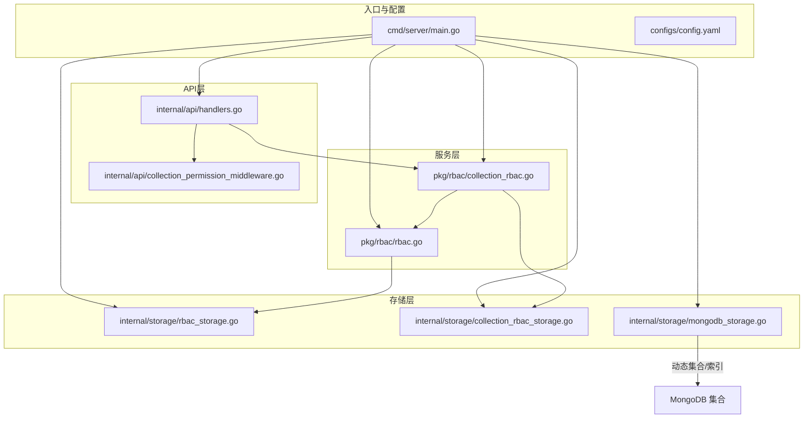
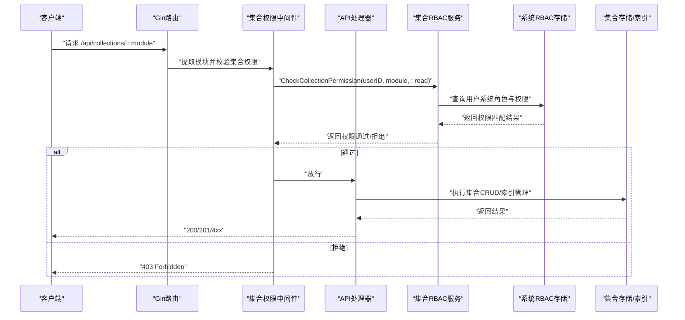
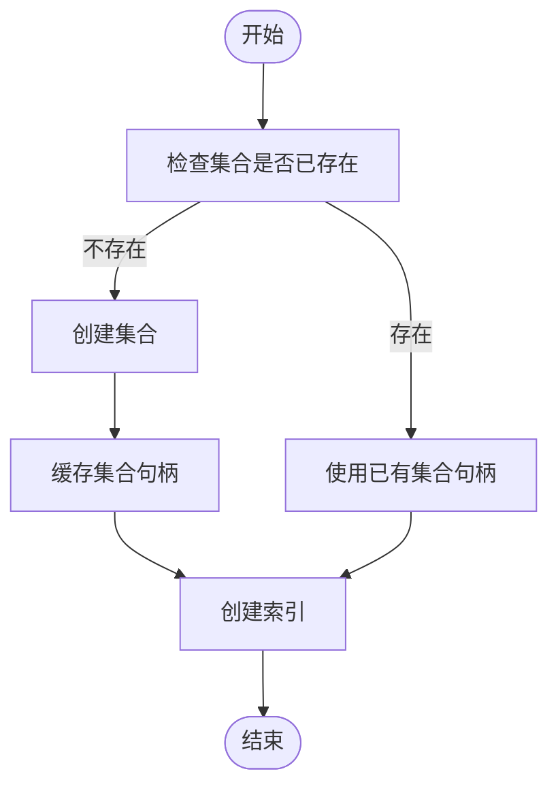
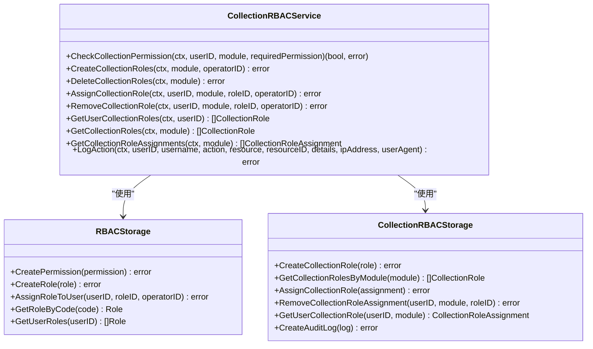
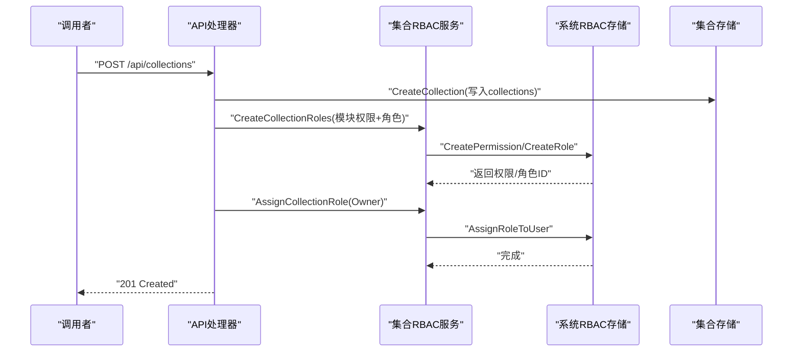
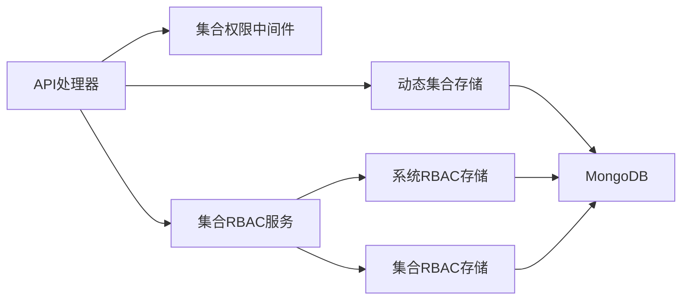

# 集合设计策略

<cite>
**本文引用的文件**
- [main.go](file://cmd/server/main.go)
- [config.yaml](file://configs/config.yaml)
- [models.go](file://internal/models/models.go)
- [mongodb_storage.go](file://internal/storage/mongodb_storage.go)
- [rbac_storage.go](file://internal/storage/rbac_storage.go)
- [collection_rbac_storage.go](file://internal/storage/collection_rbac_storage.go)
- [rbac.go](file://pkg/rbac/rbac.go)
- [collection_rbac.go](file://pkg/rbac/collection_rbac.go)
- [collection_permission_middleware.go](file://internal/api/collection_permission_middleware.go)
- [handlers.go](file://internal/api/handlers.go)
- [tech.md](file://docs/modules/collection/tech.md)
- [implementation.md](file://docs/modules/collection/implementation.md)
- [business-data.md](file://docs/business-data.md)
- [collection_roles_test.go](file://test/collection_roles_test.go)
</cite>

## 目录
1. [简介](#简介)
2. [项目结构](#项目结构)
3. [核心组件](#核心组件)
4. [架构总览](#架构总览)
5. [详细组件分析](#详细组件分析)
6. [依赖分析](#依赖分析)
7. [性能考量](#性能考量)
8. [故障排查指南](#故障排查指南)
9. [结论](#结论)
10. [附录](#附录)

## 简介
本文件面向数据中心项目的集合设计策略，系统阐述集合划分原则、动态集合创建机制、命名规范与模块化组织、集合级RBAC权限设计、集合生命周期管理（创建/删除/重建）、集合大小与分片策略、索引策略与性能优化方案。文档结合代码与技术文档，提供可操作的设计与实施建议。

## 项目结构
数据中心采用分层架构：入口程序负责服务初始化与路由注册；API层负责HTTP路由与权限中间件；服务层封装业务逻辑（集合RBAC与系统RBAC）；存储层对接MongoDB，分别维护系统权限数据与集合级权限数据，并提供动态集合与索引能力。

图表来源
- [main.go:24-120](file://cmd/server/main.go#L24-L120)
- [handlers.go:45-181](file://internal/api/handlers.go#L45-L181)
- [rbac.go:55-61](file://pkg/rbac/rbac.go#L55-L61)
- [collection_rbac.go:27-37](file://pkg/rbac/collection_rbac.go#L27-L37)
- [rbac_storage.go:16-79](file://internal/storage/rbac_storage.go#L16-L79)
- [collection_rbac_storage.go:15-62](file://internal/storage/collection_rbac_storage.go#L15-L62)
- [mongodb_storage.go:16-51](file://internal/storage/mongodb_storage.go#L16-L51)

章节来源
- [main.go:24-120](file://cmd/server/main.go#L24-L120)
- [config.yaml:1-26](file://configs/config.yaml#L1-L26)

## 核心组件
- 集合模型与命名
  - 集合元数据模型包含模块名、描述、数据类型所有者、集合名称等字段。
  - 集合命名规范为“模块名_data”，如movie_data。
- 动态集合与索引
  - 通过动态集合创建与索引管理接口，支持运行时创建集合与索引。
- 集合级RBAC
  - 每个集合创建时自动生成5种模块级权限与3类角色模板，支持Owner/Operator/Tourist三权分立。
- 权限中间件
  - 提供从URL参数或请求体提取模块名的中间件，保障集合级权限校验前置。
- 生命周期管理
  - 提供集合创建、更新（含Owner转移）、删除（级联删除）与重建策略。

章节来源
- [models.go:313-320](file://internal/models/models.go#L313-L320)
- [tech.md:41](file://docs/modules/collection/tech.md#L41)
- [mongodb_storage.go:62-78](file://internal/storage/mongodb_storage.go#L62-L78)
- [collection_rbac.go:92-194](file://pkg/rbac/collection_rbac.go#L92-L194)
- [collection_permission_middleware.go:16-48](file://internal/api/collection_permission_middleware.go#L16-L48)
- [implementation.md:26-72](file://docs/modules/collection/implementation.md#L26-L72)

## 架构总览
集合设计贯穿“入口初始化—路由注册—权限中间件—服务层—存储层”的链路，确保权限与数据操作解耦且可扩展。

图表来源
- [handlers.go:161-179](file://internal/api/handlers.go#L161-L179)
- [collection_permission_middleware.go:16-48](file://internal/api/collection_permission_middleware.go#L16-L48)
- [collection_rbac.go:39-90](file://pkg/rbac/collection_rbac.go#L39-L90)
- [rbac_storage.go:16-79](file://internal/storage/rbac_storage.go#L16-L79)

## 详细组件分析

### 集合划分原则与系统管理集合/业务数据集合
- 划分原则
  - 系统管理集合：用于存放系统级元数据与权限数据，如collections、field_definitions、scrape_tasks、deleted_*等，统一由系统RBAC保护。
  - 业务数据集合：按模块命名的动态集合，如{module}_data，承载具体业务数据，受集合级RBAC保护。
- 模块化组织
  - 每个模块独立命名与权限边界，便于横向扩展与权限隔离。
  - datatype_owner作为集合管理者，承担字段定义、索引与Owner角色分配职责。

章节来源
- [business-data.md:93-133](file://docs/business-data.md#L93-L133)
- [models.go:313-320](file://internal/models/models.go#L313-L320)

### 动态集合创建机制（CreateDynamicCollection）
- 实现原理
  - 通过存储层的动态集合创建接口，在数据库中创建新集合，并缓存集合句柄以避免重复连接。
  - 集合创建后可立即配置索引，提升查询性能。
- 关键流程
  - 调用CreateDynamicCollection创建集合。
  - 调用CreateIndex为集合添加索引。
  - 在集合元数据中登记集合名称，以便后续权限与审计追踪。

图表来源
- [mongodb_storage.go:62-78](file://internal/storage/mongodb_storage.go#L62-L78)
- [mongodb_storage.go:53-60](file://internal/storage/mongodb_storage.go#L53-L60)

章节来源
- [mongodb_storage.go:62-78](file://internal/storage/mongodb_storage.go#L62-L78)
- [mongodb_storage.go:53-60](file://internal/storage/mongodb_storage.go#L53-L60)

### 集合命名规范与模块化组织策略
- 命名规范
  - 集合名称 = 模块名 + "_data"，如movie_data、book_data。
  - 集合元数据collections中记录module与collection_name。
- 模块化策略
  - 每个模块独立的集合与权限空间，支持独立的字段定义、索引与角色分配。
  - datatype_owner负责模块内管理职责，支持Owner转移。

章节来源
- [tech.md:41](file://docs/modules/collection/tech.md#L41)
- [models.go:313-320](file://internal/models/models.go#L313-L320)

### 集合级RBAC设计（集合级RBAC）
- 权限代码与角色矩阵
  - 自动生成5种模块级权限：:read、:write、:delete、:admin、:field:admin。
  - 三类角色：Owner（全权）、Operator（读写删）、Tourist（只读）。
- 权限检查流程
  - 优先检查系统级system:admin。
  - 检查系统角色是否包含模块权限代码（如movie:read）。
  - 查询集合角色分配，匹配集合角色的权限列表。
- 中间件与API
  - 提供从URL参数与请求体提取模块名的中间件。
  - 提供集合角色分配/移除与审计日志记录。

图表来源
- [collection_rbac.go:27-37](file://pkg/rbac/collection_rbac.go#L27-L37)
- [rbac.go:55-61](file://pkg/rbac/rbac.go#L55-L61)
- [rbac_storage.go:16-79](file://internal/storage/rbac_storage.go#L16-L79)
- [collection_rbac_storage.go:15-62](file://internal/storage/collection_rbac_storage.go#L15-L62)

章节来源
- [collection_rbac.go:39-90](file://pkg/rbac/collection_rbac.go#L39-L90)
- [collection_rbac.go:92-194](file://pkg/rbac/collection_rbac.go#L92-L194)
- [collection_rbac_storage.go:15-62](file://internal/storage/collection_rbac_storage.go#L15-L62)
- [rbac_storage.go:16-79](file://internal/storage/rbac_storage.go#L16-L79)

### 集合生命周期管理（创建/删除/重建）
- 创建集合
  - 写入集合元数据collections。
  - 自动创建5种模块权限与3类系统角色与集合角色。
  - 自动将Owner角色分配给datatype_owner。
- 删除集合（级联）
  - 删除集合角色与分配。
  - 删除模块权限。
  - 级联删除字段定义、业务数据、刮削任务与集合元数据。
- 重建策略
  - 删除后可重新创建同名集合，权限与角色模板会再次生成。
  - Owner转移通过更新datatype_owner并同步角色分配实现。

图表来源
- [implementation.md:26-72](file://docs/modules/collection/implementation.md#L26-L72)
- [collection_rbac.go:92-194](file://pkg/rbac/collection_rbac.go#L92-L194)
- [rbac_storage.go:307-316](file://internal/storage/rbac_storage.go#L307-L316)

章节来源
- [implementation.md:123-155](file://docs/modules/collection/implementation.md#L123-L155)
- [implementation.md:159-195](file://docs/modules/collection/implementation.md#L159-L195)
- [tech.md:241-320](file://docs/modules/collection/tech.md#L241-L320)

### 集合大小管理与分片策略
- 集合大小管理
  - 业务数据集合采用MongoDB动态模式，支持任意JSON结构，无需预定义字段，适合不同模块的多样化数据形态。
  - 通过索引与查询优化降低单集合膨胀风险。
- 分片策略
  - MongoDB支持集合级分片，可在集合层面启用分片并选择分片键（如module或时间字段），以实现水平扩展与负载均衡。
  - 建议结合查询模式选择合适的分片键，避免热点与数据倾斜。

章节来源
- [business-data.md:506-512](file://docs/business-data.md#L506-L512)
- [business-data.md:412-425](file://docs/business-data.md#L412-L425)

### 集合索引策略与性能优化
- 索引策略
  - 系统内置常用索引：collections.module、field_definitions(module, field_name)、scrape_tasks(module, status)、scrape_tasks.created_at等。
  - 支持动态索引创建，按模块与查询模式灵活添加复合索引。
- 性能优化
  - 通过集合级权限中间件减少不必要的数据库访问。
  - 使用缓存集合句柄（dynamicColls）避免重复连接。
  - 合理设置查询分页与排序索引，降低内存压力。

章节来源
- [business-data.md:400-425](file://docs/business-data.md#L400-L425)
- [mongodb_storage.go:53-60](file://internal/storage/mongodb_storage.go#L53-L60)

## 依赖分析
- 组件耦合
  - API层依赖集合权限中间件与集合RBAC服务。
  - 集合RBAC服务同时依赖系统RBAC存储与集合RBAC存储。
  - 存储层分为系统权限存储与集合级存储，职责清晰。
- 外部依赖
  - MongoDB驱动用于集合创建、索引管理与数据读写。
  - Gin框架用于HTTP路由与中间件。

图表来源
- [handlers.go:45-181](file://internal/api/handlers.go#L45-L181)
- [collection_rbac.go:27-37](file://pkg/rbac/collection_rbac.go#L27-L37)
- [rbac_storage.go:16-79](file://internal/storage/rbac_storage.go#L16-L79)
- [collection_rbac_storage.go:15-62](file://internal/storage/collection_rbac_storage.go#L15-L62)
- [mongodb_storage.go:16-51](file://internal/storage/mongodb_storage.go#L16-L51)

章节来源
- [handlers.go:45-181](file://internal/api/handlers.go#L45-L181)
- [collection_rbac.go:27-37](file://pkg/rbac/collection_rbac.go#L27-L37)
- [rbac_storage.go:16-79](file://internal/storage/rbac_storage.go#L16-L79)
- [collection_rbac_storage.go:15-62](file://internal/storage/collection_rbac_storage.go#L15-L62)
- [mongodb_storage.go:16-51](file://internal/storage/mongodb_storage.go#L16-L51)

## 性能考量
- 查询性能
  - 为高频查询字段建立索引，如module、status、created_at等。
  - 使用复合索引覆盖常见过滤与排序组合。
- 写入性能
  - 批量写入与异步处理（如刮削任务）降低写入峰值。
  - 控制集合字段数量与嵌套深度，避免超大文档。
- 缓存与连接
  - 缓存动态集合句柄，减少连接开销。
  - 合理设置MongoDB连接池与超时参数。

## 故障排查指南
- 权限问题
  - 确认用户是否具备system:admin或模块级权限代码。
  - 检查集合角色分配是否正确，以及角色权限列表是否包含所需权限。
- 集合创建失败
  - 检查模块名是否重复，集合是否已存在。
  - 确认集合RBAC角色创建与系统权限创建是否成功，必要时回滚集合元数据。
- Owner转移异常
  - 确认datatype_owner变更后是否正确移除旧Owner并赋予新Owner。
- 索引问题
  - 检查索引创建是否成功，确认索引键与查询模式匹配。

章节来源
- [collection_rbac.go:39-90](file://pkg/rbac/collection_rbac.go#L39-L90)
- [implementation.md:26-72](file://docs/modules/collection/implementation.md#L26-L72)
- [implementation.md:159-195](file://docs/modules/collection/implementation.md#L159-L195)

## 结论
本设计以模块化为核心，通过集合命名规范、动态集合与索引管理、集合级RBAC与系统RBAC协同，实现了权限与数据的清晰分离与可扩展治理。配合生命周期管理与性能优化策略，能够支撑多模块业务数据的高效管理与安全隔离。

## 附录
- 测试参考
  - 集合角色创建测试验证了Owner/Operator/Tourist三种角色与权限矩阵的正确性。

章节来源
- [collection_roles_test.go:33-105](file://test/collection_roles_test.go#L33-L105)