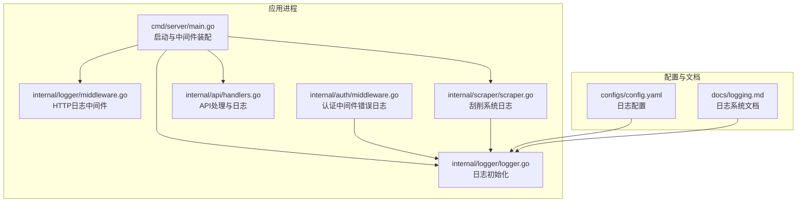
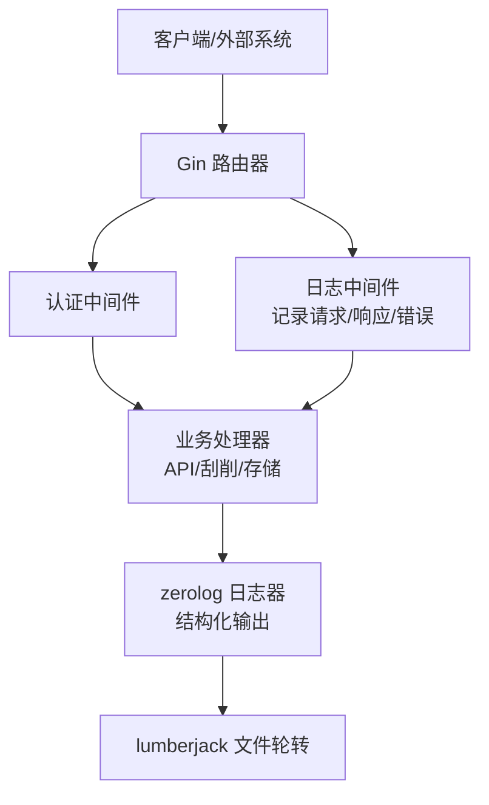
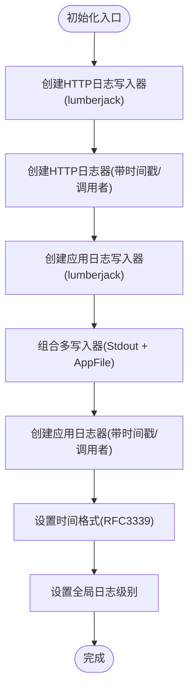
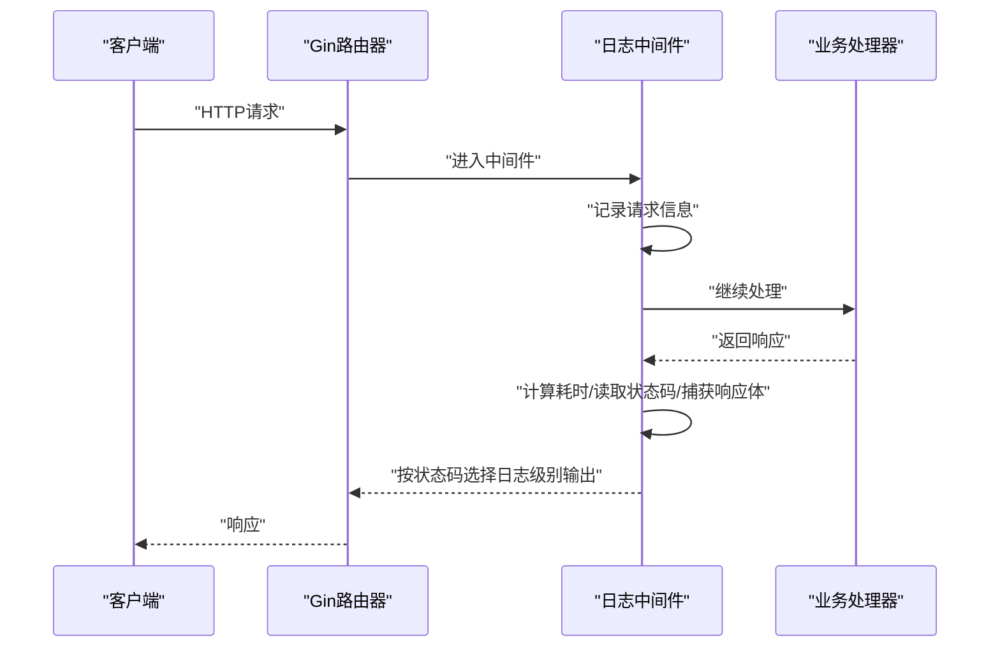
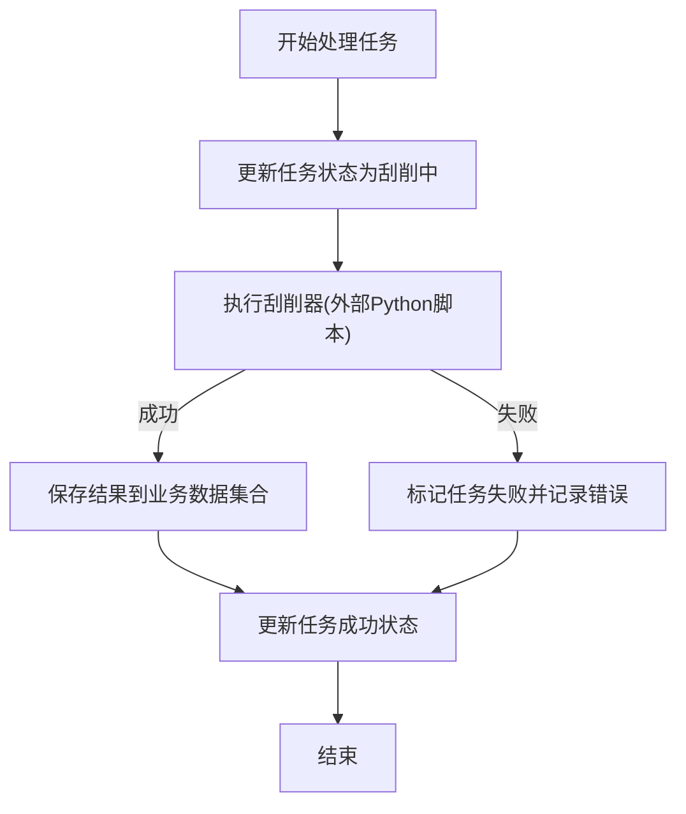
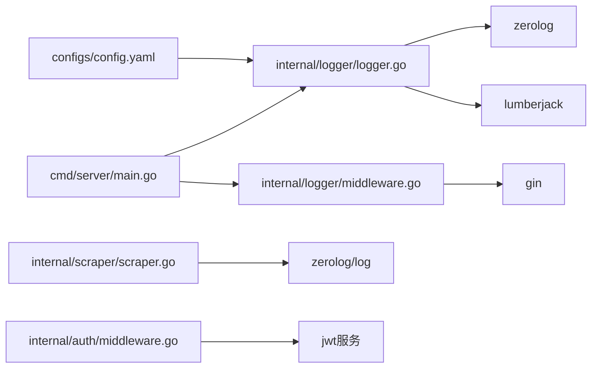

# 日志与监控

<cite>
**本文引用的文件**
- [internal/logger/logger.go](file://internal/logger/logger.go)
- [internal/logger/middleware.go](file://internal/logger/middleware.go)
- [cmd/server/main.go](file://cmd/server/main.go)
- [configs/config.yaml](file://configs/config.yaml)
- [docs/logging.md](file://docs/logging.md)
- [internal/scraper/scraper.go](file://internal/scraper/scraper.go)
- [internal/api/handlers.go](file://internal/api/handlers.go)
- [internal/auth/middleware.go](file://internal/auth/middleware.go)
- [internal/models/models.go](file://internal/models/models.go)
- [internal/storage/mongodb.go](file://internal/storage/mongodb.go)
</cite>

## 目录
1. [简介](#简介)
2. [项目结构](#项目结构)
3. [核心组件](#核心组件)
4. [架构总览](#架构总览)
5. [详细组件分析](#详细组件分析)
6. [依赖分析](#依赖分析)
7. [性能考虑](#性能考虑)
8. [故障排查指南](#故障排查指南)
9. [结论](#结论)
10. [附录](#附录)

## 简介
本文件面向数据中心项目的日志与监控体系，围绕基于 zerolog 的结构化日志系统展开，覆盖日志级别与格式、HTTP 请求日志中间件、日志轮转与归档策略、监控指标设计、日志分析与告警建议、可视化方案以及运维最佳实践。文档同时结合现有代码实现，给出可落地的配置与扩展建议。

## 项目结构
日志与监控相关的关键位置如下：
- 日志初始化与通用日志记录：internal/logger/logger.go
- HTTP 请求日志中间件：internal/logger/middleware.go
- 服务启动与中间件装配：cmd/server/main.go
- 配置文件（含日志配置）：configs/config.yaml
- 日志系统文档：docs/logging.md
- 刮削系统日志记录点：internal/scraper/scraper.go
- API 路由与业务日志记录点：internal/api/handlers.go
- 认证中间件中的错误日志：internal/auth/middleware.go
- 数据模型（含刮削任务状态等）：internal/models/models.go
- 存储接口（与业务数据/刮削任务相关）：internal/storage/mongodb.go

图表来源
- [cmd/server/main.go:115-116](file://cmd/server/main.go#L115-L116)
- [internal/logger/logger.go:14-56](file://internal/logger/logger.go#L14-L56)
- [internal/logger/middleware.go:25-68](file://internal/logger/middleware.go#L25-L68)
- [configs/config.yaml:12-18](file://configs/config.yaml#L12-L18)
- [docs/logging.md:90-112](file://docs/logging.md#L90-L112)

章节来源
- [cmd/server/main.go:115-116](file://cmd/server/main.go#L115-L116)
- [internal/logger/logger.go:14-56](file://internal/logger/logger.go#L14-L56)
- [configs/config.yaml:12-18](file://configs/config.yaml#L12-L18)
- [docs/logging.md:90-112](file://docs/logging.md#L90-L112)

## 核心组件
- 结构化日志初始化与全局级别设置：通过 lumberjack 实现文件轮转，zerolog 提供结构化 JSON 输出，支持多写入器（标准输出 + 文件）。
- HTTP 请求日志中间件：捕获请求方法、路径、状态码、耗时、客户端 IP、UA、响应体等，按状态码映射到不同日志级别。
- 刮削系统日志：在启动、停止、任务提交、处理、成功/失败等关键节点记录结构化日志。
- 认证中间件错误日志：在 JWT 校验失败时记录错误日志。
- 配置驱动：通过环境变量或 YAML 驱动日志初始化参数（级别、文件路径、轮转阈值等）。

章节来源
- [internal/logger/logger.go:14-56](file://internal/logger/logger.go#L14-L56)
- [internal/logger/middleware.go:25-68](file://internal/logger/middleware.go#L25-L68)
- [internal/scraper/scraper.go:48-72](file://internal/scraper/scraper.go#L48-L72)
- [internal/scraper/scraper.go:75-99](file://internal/scraper/scraper.go#L75-L99)
- [internal/scraper/scraper.go:123-193](file://internal/scraper/scraper.go#L123-L193)
- [internal/auth/middleware.go:35](file://internal/auth/middleware.go#L35)
- [configs/config.yaml:12-18](file://configs/config.yaml#L12-L18)

## 架构总览
下图展示日志子系统在应用中的位置与交互：

图表来源
- [cmd/server/main.go:115-116](file://cmd/server/main.go#L115-L116)
- [internal/logger/middleware.go:25-68](file://internal/logger/middleware.go#L25-L68)
- [internal/logger/logger.go:14-56](file://internal/logger/logger.go#L14-L56)

## 详细组件分析

### 组件A：日志初始化与结构化输出
- 初始化逻辑
  - HTTP 日志写入器：独立文件，启用压缩。
  - 应用日志写入器：多写入器（标准输出 + 文件），便于本地开发与生产落盘。
  - 全局时间格式：RFC3339。
  - 全局日志级别：根据配置切换 debug/info/warn/error。
- 结构化输出
  - 应用日志包含时间戳与调用者信息。
  - 提供 Debug/Info/Warn/Error 与 InfoJSON 等便捷方法，便于结构化字段输出。

图表来源
- [internal/logger/logger.go:14-56](file://internal/logger/logger.go#L14-L56)

章节来源
- [internal/logger/logger.go:14-56](file://internal/logger/logger.go#L14-L56)
- [docs/logging.md:63-88](file://docs/logging.md#L63-L88)

### 组件B：HTTP 请求日志中间件
- 功能要点
  - 捕获请求与响应：方法、路径、查询参数、状态码、耗时、客户端 IP、UA、响应体。
  - 状态码分级：>=500 错误级别；>=400 警告级别；否则信息级别。
  - 用户标识：从上下文提取 user_id，未提供时标记为 anonymous。
- 性能注意
  - 捕获响应体会复制缓冲区，建议在高并发场景下谨慎使用，或仅对错误响应体记录。

图表来源
- [internal/logger/middleware.go:25-68](file://internal/logger/middleware.go#L25-L68)

章节来源
- [internal/logger/middleware.go:25-68](file://internal/logger/middleware.go#L25-L68)
- [docs/logging.md:30-41](file://docs/logging.md#L30-L41)

### 组件C：刮削系统日志记录点
- 关键节点
  - 启动/停止：记录系统生命周期事件与工作协程数量。
  - 任务提交：记录任务ID、模块等。
  - 任务处理：记录工作协程ID、任务ID、模块、数据路径、刮削器路径。
  - 成功/失败：更新任务状态并记录结果或错误详情。
  - 结果存储：记录业务数据ID与集合名称。
- 字段建议
  - 为每个关键事件补充统一的结构化字段（如 worker_id、task_id、module、latency 等），便于后续检索与聚合。

图表来源
- [internal/scraper/scraper.go:123-193](file://internal/scraper/scraper.go#L123-L193)

章节来源
- [internal/scraper/scraper.go:48-72](file://internal/scraper/scraper.go#L48-L72)
- [internal/scraper/scraper.go:75-99](file://internal/scraper/scraper.go#L75-L99)
- [internal/scraper/scraper.go:123-193](file://internal/scraper/scraper.go#L123-L193)
- [docs/logging.md:133-141](file://docs/logging.md#L133-L141)

### 组件D：认证中间件错误日志
- 在 JWT 校验失败时记录错误日志，便于追踪认证异常。
- 建议在日志中包含 token 片段（脱敏）与错误原因，便于定位问题。

章节来源
- [internal/auth/middleware.go:35](file://internal/auth/middleware.go#L35)

### 组件E：配置驱动的日志初始化
- 环境变量驱动
  - LOG_LEVEL：日志级别。
  - LOG_HTTP_FILE：HTTP 日志文件路径。
  - LOG_MAX_SIZE：单文件最大大小（MB）。
  - LOG_MAX_BACKUPS：保留备份数。
  - LOG_MAX_AGE：保留天数。
- YAML 配置
  - logger.level、logger.max_size、logger.max_backups、logger.max_age 等。

章节来源
- [cmd/server/main.go:32-38](file://cmd/server/main.go#L32-L38)
- [configs/config.yaml:12-18](file://configs/config.yaml#L12-L18)
- [docs/logging.md:90-112](file://docs/logging.md#L90-L112)

## 依赖分析
- 日志初始化依赖 lumberjack 与 zerolog。
- HTTP 中间件依赖 Gin ResponseWriter 包装以捕获响应体。
- 刮削系统直接使用 zerolog/log 记录内部事件。
- 认证中间件依赖 JWT 服务并在失败时记录错误。
- 配置通过环境变量与 YAML 文件驱动初始化。

图表来源
- [internal/logger/logger.go:3-8](file://internal/logger/logger.go#L3-L8)
- [internal/logger/middleware.go:3-8](file://internal/logger/middleware.go#L3-L8)
- [internal/scraper/scraper.go:14](file://internal/scraper/scraper.go#L14)
- [cmd/server/main.go:15-18](file://cmd/server/main.go#L15-L18)
- [configs/config.yaml:12-18](file://configs/config.yaml#L12-L18)

章节来源
- [internal/logger/logger.go:3-8](file://internal/logger/logger.go#L3-L8)
- [internal/logger/middleware.go:3-8](file://internal/logger/middleware.go#L3-L8)
- [internal/scraper/scraper.go:14](file://internal/scraper/scraper.go#L14)
- [cmd/server/main.go:15-18](file://cmd/server/main.go#L15-L18)
- [configs/config.yaml:12-18](file://configs/config.yaml#L12-L18)

## 性能考虑
- 日志级别
  - 生产环境建议 info 或更高，避免 debug 产生的大量开销。
- 文件轮转
  - 合理设置 MaxSize、MaxBackups、MaxAge，平衡磁盘占用与历史保留。
  - Compress=true 可降低磁盘占用，但会增加 CPU 开销。
- 中间件性能
  - 捕获响应体可能带来内存与拷贝成本，建议仅在错误路径或低频场景使用。
- 结构化字段
  - 控制字段数量与层级，避免过深嵌套导致解析与存储成本上升。
- 并发与 I/O
  - 多写入器（stdout + file）在容器化部署中需确保 stdout 正常采集，文件写入稳定。

[本节为通用指导，不直接分析具体文件]

## 故障排查指南
- 启动阶段
  - 确认环境变量是否正确加载，日志初始化是否成功。
  - 查看 logs/app.log 与 logs/http.log 是否生成。
- HTTP 请求异常
  - 检查 HTTP 日志中间件输出，关注状态码分布与耗时异常。
  - 对于 5xx 错误，结合响应体与错误日志定位上游问题。
- 刮削任务失败
  - 查看刮削系统日志，确认任务状态更新与错误消息。
  - 检查外部刮削器脚本与数据文件路径。
- 认证失败
  - 查看认证中间件错误日志，核对 token 格式与签名密钥。
- 日志轮转异常
  - 检查 lumberjack 配置与磁盘权限，确认压缩与清理策略生效。

章节来源
- [cmd/server/main.go:130-149](file://cmd/server/main.go#L130-L149)
- [internal/logger/middleware.go:59-66](file://internal/logger/middleware.go#L59-L66)
- [internal/scraper/scraper.go:138-160](file://internal/scraper/scraper.go#L138-L160)
- [internal/auth/middleware.go:35](file://internal/auth/middleware.go#L35)

## 结论
本项目基于 zerolog 与 lumberjack 构建了结构化、可轮转的日志体系，配合 Gin 中间件实现了完整的 HTTP 请求观测。通过明确的日志级别、统一的结构化字段与合理的轮转策略，能够满足生产环境的可观测性需求。建议在高并发场景下进一步优化响应体捕获策略，并结合外部 ELK/可观测性平台实现更丰富的分析与告警。

[本节为总结，不直接分析具体文件]

## 附录

### A. 日志级别与格式
- 级别：debug、info、warn、error。
- 应用日志格式：包含 level、time、caller、message 等。
- HTTP 日志格式：包含 method、path、status、latency、client_ip、user_agent 等。

章节来源
- [docs/logging.md:3-14](file://docs/logging.md#L3-L14)
- [docs/logging.md:65-88](file://docs/logging.md#L65-L88)

### B. 日志轮转与归档策略
- 参数：MaxSize（MB）、MaxBackups、MaxAge（天）、Compress（压缩）。
- 目录结构：logs/app.log、logs/http.log。

章节来源
- [docs/logging.md:42-62](file://docs/logging.md#L42-L62)
- [configs/config.yaml:12-18](file://configs/config.yaml#L12-L18)

### C. 监控指标设计（建议）
- 系统性能指标
  - QPS、P95/P99 延迟、错误率、资源使用（CPU/内存/IO）。
- 业务指标
  - 刮削任务成功率、平均处理时长、模块维度任务量。
- 错误率统计
  - 按状态码分组的错误率、按模块/接口的错误分布。
- 建议采集点
  - HTTP 中间件：状态码、耗时、响应体大小。
  - 刮削系统：任务状态变更、处理耗时、结果大小。

[本节为概念性建议，不直接分析具体文件]

### D. 日志分析与告警机制（建议）
- 异常检测：基于滑动窗口的错误率突增、延迟异常。
- 趋势分析：按小时/天的任务量与成功率趋势。
- 通知策略：邮件/IM 通知，区分严重/警告级别。

[本节为概念性建议，不直接分析具体文件]

### E. 日志可视化方案（建议）
- ELK Stack：Logstash/Fluentd 收集 -> Elasticsearch -> Kibana 可视化。
- 自定义仪表板：基于指标与日志聚合结果，展示关键业务与系统健康度。

[本节为概念性建议，不直接分析具体文件]