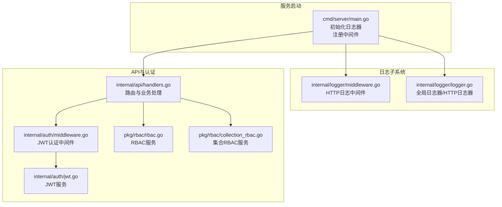
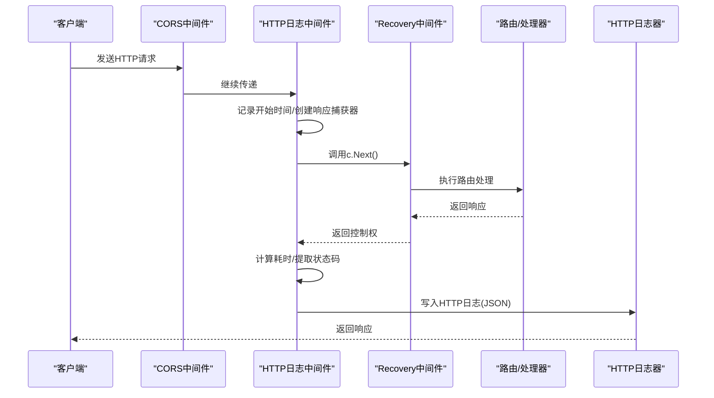
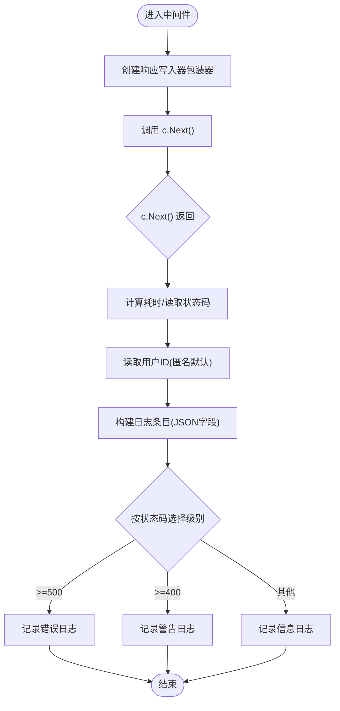
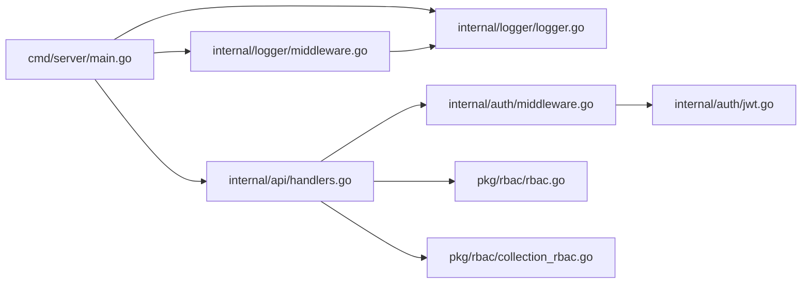

# 日志中间件

<cite>
**本文引用的文件**
- [internal/logger/middleware.go](file://internal/logger/middleware.go)
- [internal/logger/logger.go](file://internal/logger/logger.go)
- [cmd/server/main.go](file://cmd/server/main.go)
- [docs/logging.md](file://docs/logging.md)
- [internal/api/handlers.go](file://internal/api/handlers.go)
- [internal/auth/middleware.go](file://internal/auth/middleware.go)
- [internal/auth/jwt.go](file://internal/auth/jwt.go)
- [pkg/rbac/rbac.go](file://pkg/rbac/rbac.go)
- [pkg/rbac/collection_rbac.go](file://pkg/rbac/collection_rbac.go)
- [configs/config.yaml](file://configs/config.yaml)
</cite>

## 目录
1. [简介](#简介)
2. [项目结构](#项目结构)
3. [核心组件](#核心组件)
4. [架构总览](#架构总览)
5. [详细组件分析](#详细组件分析)
6. [依赖分析](#依赖分析)
7. [性能考虑](#性能考虑)
8. [故障排查指南](#故障排查指南)
9. [结论](#结论)
10. [附录](#附录)

## 简介
本文件面向数据中心项目的日志中间件，聚焦HTTP请求日志中间件的实现机制与使用实践。内容涵盖：
- 请求拦截、响应记录与错误捕获的完整流程
- 中间件在Gin框架中间件链中的位置与生命周期
- 请求日志记录的关键字段（URL、方法、客户端IP、请求头、响应状态码、处理时间等）
- 成功与错误响应的日志策略差异
- 中间件配置选项与可扩展点
- 性能影响分析与优化建议

## 项目结构
日志中间件位于 internal/logger 包中，并在服务启动时被注册到Gin路由引擎中；同时配合全局日志器与HTTP专用日志器进行输出管理。

图表来源
- [cmd/server/main.go:115-116](file://cmd/server/main.go#L115-L116)
- [internal/logger/middleware.go:25-68](file://internal/logger/middleware.go#L25-L68)
- [internal/logger/logger.go:14-56](file://internal/logger/logger.go#L14-L56)
- [internal/api/handlers.go:45-181](file://internal/api/handlers.go#L45-L181)
- [internal/auth/middleware.go:12-48](file://internal/auth/middleware.go#L12-L48)
- [internal/auth/jwt.go:44-83](file://internal/auth/jwt.go#L44-L83)
- [pkg/rbac/rbac.go:63-99](file://pkg/rbac/rbac.go#L63-L99)
- [pkg/rbac/collection_rbac.go:39-90](file://pkg/rbac/collection_rbac.go#L39-L90)

章节来源
- [cmd/server/main.go:115-116](file://cmd/server/main.go#L115-L116)
- [internal/logger/middleware.go:25-68](file://internal/logger/middleware.go#L25-L68)
- [internal/logger/logger.go:14-56](file://internal/logger/logger.go#L14-L56)

## 核心组件
- HTTP日志中间件：负责在请求进入与返回之间拦截、统计耗时、收集上下文信息并写入HTTP日志器。
- 全局日志器与HTTP日志器：分别负责应用日志与HTTP请求日志的输出与轮转。
- Gin中间件链：在CORS之后、Gin Recovery之前注册HTTP日志中间件，确保异常也能被记录。

章节来源
- [internal/logger/middleware.go:25-68](file://internal/logger/middleware.go#L25-L68)
- [internal/logger/logger.go:14-56](file://internal/logger/logger.go#L14-L56)
- [cmd/server/main.go:115-116](file://cmd/server/main.go#L115-L116)

## 架构总览
下图展示HTTP请求在Gin中间件链中的流转，以及日志中间件如何在每个阶段采集信息并输出日志。

图表来源
- [cmd/server/main.go:100-116](file://cmd/server/main.go#L100-L116)
- [internal/logger/middleware.go:25-68](file://internal/logger/middleware.go#L25-L68)

## 详细组件分析

### HTTP日志中间件实现机制
- 请求拦截与响应捕获
  - 在进入下游处理前，创建自定义响应写入器包装原始响应写入器，以便在返回时读取响应体。
  - 通过 gin.Context 的 Next 方法进入后续中间件与路由处理。
- 响应记录与错误捕获
  - 在 c.Next() 返回后，计算处理耗时，读取响应状态码与响应体，构造日志条目。
  - 根据状态码范围选择不同日志级别：5xx错误、4xx警告、其他信息级别。
- 上下文信息采集
  - 从上下文中读取用户ID（若未设置则标记为匿名），并记录请求方法、路径、查询字符串、客户端IP、User-Agent等。

图表来源
- [internal/logger/middleware.go:25-68](file://internal/logger/middleware.go#L25-L68)

章节来源
- [internal/logger/middleware.go:10-23](file://internal/logger/middleware.go#L10-L23)
- [internal/logger/middleware.go:25-68](file://internal/logger/middleware.go#L25-L68)

### 中间件在Gin中间件链中的位置与生命周期
- 注册顺序
  - CORS中间件先于HTTP日志中间件注册，确保跨域预检与OPTIONS请求被正确处理。
  - HTTP日志中间件在 Recovery 中间件之前注册，保证异常场景也能记录日志。
- 生命周期
  - 进入：记录开始时间、替换响应写入器、调用 c.Next()。
  - 返回：计算耗时、读取状态码、记录日志、继续向下游传播。

章节来源
- [cmd/server/main.go:100-116](file://cmd/server/main.go#L100-L116)

### 请求日志记录内容
- 必填字段
  - 时间戳、用户ID（匿名）、请求方法、请求路径、查询字符串、响应状态码、处理耗时、客户端IP、User-Agent。
- 可选字段
  - 响应体（作为字符串记录），便于审计与排障。
- 日志级别映射
  - 5xx：错误级别
  - 4xx：警告级别
  - 其他：信息级别

章节来源
- [internal/logger/middleware.go:46-66](file://internal/logger/middleware.go#L46-L66)
- [docs/logging.md:34-41](file://docs/logging.md#L34-L41)

### 响应日志策略
- 成功响应
  - 以信息级别记录，包含请求方法、路径、状态码、耗时、客户端IP等。
- 错误响应
  - 4xx：警告级别，便于快速发现客户端错误或鉴权失败。
  - 5xx：错误级别，便于定位服务端异常。
- 异常捕获
  - 由于中间件在 Recovery 之前注册，异常最终会由 Recovery 处理并返回相应状态码，中间件仍会根据最终状态码记录对应级别的日志。

章节来源
- [internal/logger/middleware.go:59-66](file://internal/logger/middleware.go#L59-L66)
- [cmd/server/main.go:115-116](file://cmd/server/main.go#L115-L116)

### 中间件配置选项与自定义扩展
- 初始化参数
  - 日志级别、HTTP日志文件路径、单文件最大大小、保留备份数、保留天数。
- 环境变量
  - LOG_LEVEL、LOG_HTTP_FILE、LOG_MAX_SIZE、LOG_MAX_BACKUPS、LOG_MAX_AGE。
- 自定义扩展建议
  - 可在中间件中增加请求头过滤、敏感字段脱敏、采样率控制、异步写入等能力。
  - 可将响应体限制在一定长度内，避免过大响应导致日志膨胀。
  - 可增加白名单/黑名单路径，减少对静态资源或健康检查的记录。

章节来源
- [internal/logger/logger.go:14-56](file://internal/logger/logger.go#L14-L56)
- [docs/logging.md:92-112](file://docs/logging.md#L92-L112)

### 与认证与权限中间件的协作
- 认证中间件会在请求到达业务处理前校验JWT并注入用户上下文，HTTP日志中间件随后读取用户ID并记录。
- 权限中间件在受保护路由上进一步校验用户权限，HTTP日志中间件同样会记录该请求的最终状态码与耗时。

章节来源
- [internal/auth/middleware.go:12-48](file://internal/auth/middleware.go#L12-L48)
- [internal/api/handlers.go:259-314](file://internal/api/handlers.go#L259-L314)
- [internal/logger/middleware.go:39-42](file://internal/logger/middleware.go#L39-L42)

## 依赖分析
- 组件耦合
  - HTTP日志中间件依赖 Gin 上下文与响应写入器，依赖全局HTTP日志器进行输出。
  - 服务启动入口负责初始化日志器并注册中间件。
- 外部依赖
  - zerolog：结构化日志记录。
  - lumberjack：日志文件轮转。
  - Gin：中间件链与上下文。
- 潜在循环依赖
  - 日志中间件不依赖业务处理，避免引入循环依赖风险。

图表来源
- [cmd/server/main.go:115-116](file://cmd/server/main.go#L115-L116)
- [internal/logger/middleware.go:25-68](file://internal/logger/middleware.go#L25-L68)
- [internal/logger/logger.go:14-56](file://internal/logger/logger.go#L14-L56)
- [internal/api/handlers.go:45-181](file://internal/api/handlers.go#L45-L181)
- [internal/auth/middleware.go:12-48](file://internal/auth/middleware.go#L12-L48)
- [internal/auth/jwt.go:44-83](file://internal/auth/jwt.go#L44-L83)
- [pkg/rbac/rbac.go:63-99](file://pkg/rbac/rbac.go#L63-L99)
- [pkg/rbac/collection_rbac.go:39-90](file://pkg/rbac/collection_rbac.go#L39-L90)

## 性能考虑
- 响应体捕获与写入
  - 中间件通过包装响应写入器捕获响应体，可能带来额外内存占用与拷贝开销。建议：
    - 对大响应体进行截断或采样。
    - 在高并发场景下评估是否需要记录响应体。
- 日志写入
  - 使用 lumberjack 进行轮转，避免单文件过大；合理设置最大文件大小与保留天数。
- 中间件顺序
  - 将HTTP日志中间件置于 Recovery 之前，确保异常也能被记录，但不会阻塞异常处理流程。
- 日志级别
  - 生产环境建议使用 info 或更高级别，避免 debug 级别带来的性能损耗。

章节来源
- [internal/logger/middleware.go:10-23](file://internal/logger/middleware.go#L10-L23)
- [internal/logger/logger.go:14-56](file://internal/logger/logger.go#L14-L56)
- [cmd/server/main.go:115-116](file://cmd/server/main.go#L115-L116)

## 故障排查指南
- 无法看到HTTP日志
  - 检查日志初始化是否成功（服务启动日志）。
  - 确认 HTTP 日志文件路径与权限。
- 日志级别不生效
  - 检查环境变量 LOG_LEVEL 设置。
- 响应体为空
  - 确认中间件是否在 Recovery 之前注册。
  - 检查业务处理是否提前终止或异常。
- 用户ID显示为 anonymous
  - 确认认证中间件已正确注入 user_id。
  - 检查 JWT 有效性与签名密钥。

章节来源
- [cmd/server/main.go:32-40](file://cmd/server/main.go#L32-L40)
- [internal/logger/middleware.go:39-42](file://internal/logger/middleware.go#L39-L42)
- [internal/auth/middleware.go:42-44](file://internal/auth/middleware.go#L42-L44)

## 结论
HTTP日志中间件在Gin中间件链中承担“请求拦截—响应记录—错误捕获”的职责，通过结构化日志与轮转机制，为系统可观测性提供基础保障。结合认证与权限中间件，可实现从请求入口到业务处理的全链路日志覆盖。建议在生产环境中根据流量规模与合规要求，合理配置日志级别、采样策略与响应体记录范围，以平衡可观测性与性能。

## 附录
- 环境变量与配置项
  - LOG_LEVEL、LOG_HTTP_FILE、LOG_MAX_SIZE、LOG_MAX_BACKUPS、LOG_MAX_AGE
- 日志输出目标
  - HTTP日志：独立文件，便于审计与问题复盘
  - 应用日志：标准输出与文件，便于运维监控

章节来源
- [docs/logging.md:92-112](file://docs/logging.md#L92-L112)
- [configs/config.yaml:12-18](file://configs/config.yaml#L12-L18)