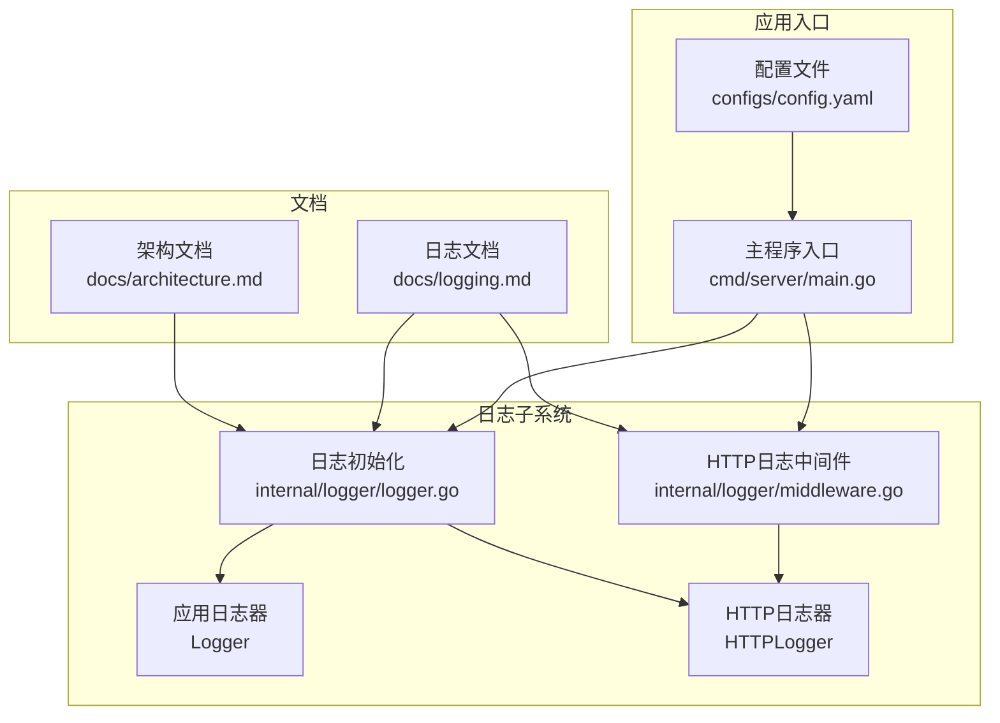
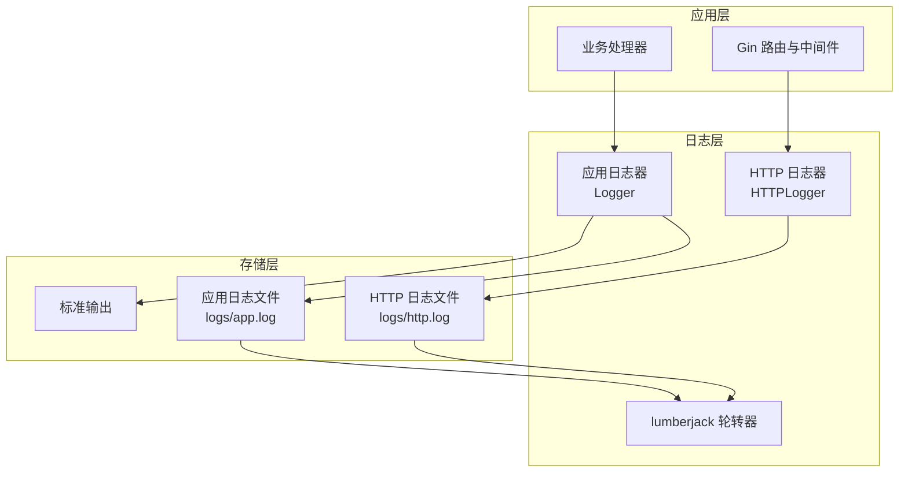
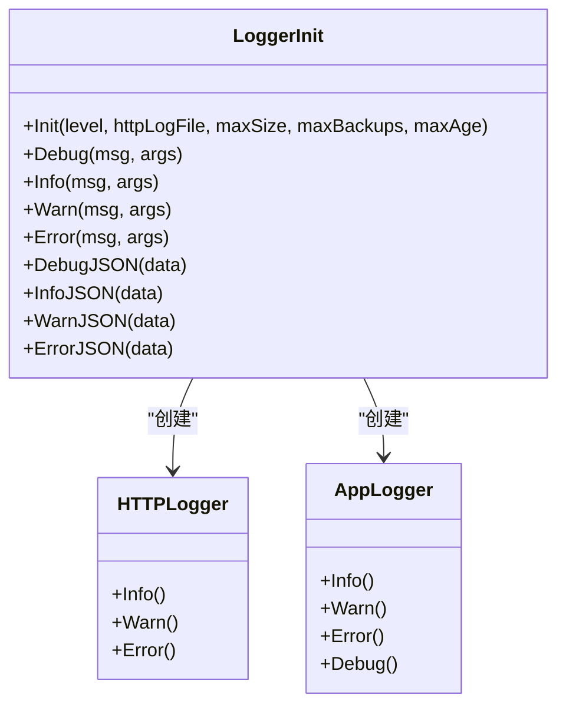
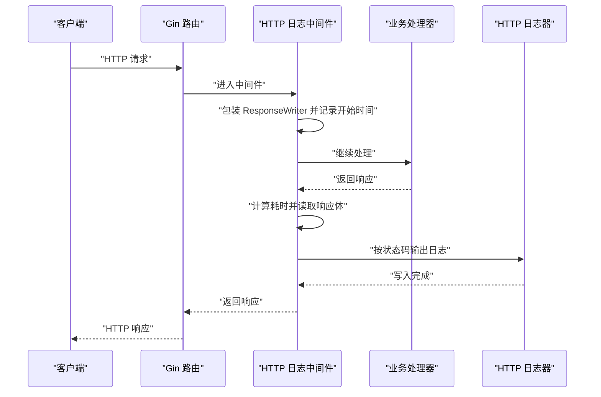
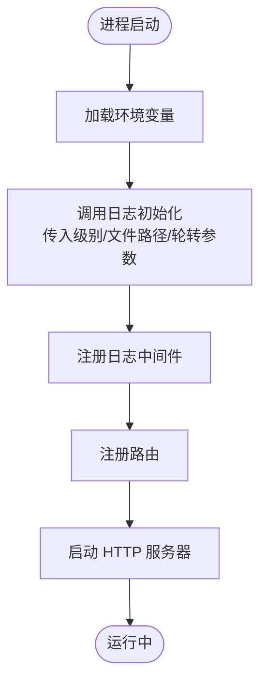
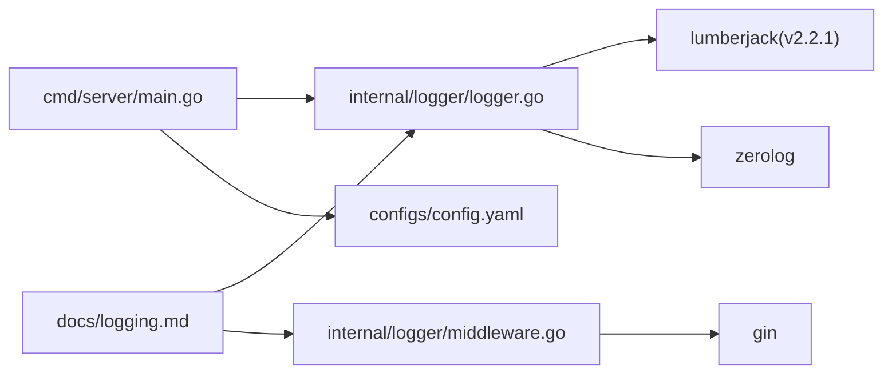

# 日志管理

<cite>
**本文引用的文件**
- [internal/logger/logger.go](file://internal/logger/logger.go)
- [internal/logger/middleware.go](file://internal/logger/middleware.go)
- [cmd/server/main.go](file://cmd/server/main.go)
- [configs/config.yaml](file://configs/config.yaml)
- [docs/logging.md](file://docs/logging.md)
- [docs/architecture.md](file://docs/architecture.md)
- [internal/api/collection_permission_middleware.go](file://internal/api/collection_permission_middleware.go)
- [internal/auth/middleware.go](file://internal/auth/middleware.go)
</cite>

## 目录
1. [简介](#简介)
2. [项目结构](#项目结构)
3. [核心组件](#核心组件)
4. [架构总览](#架构总览)
5. [详细组件分析](#详细组件分析)
6. [依赖分析](#依赖分析)
7. [性能考量](#性能考量)
8. [故障排查指南](#故障排查指南)
9. [结论](#结论)
10. [附录](#附录)

## 简介
本文件面向数据中心项目的日志管理，围绕基于 lumberjack 的日志文件轮转机制进行深入说明，涵盖文件大小限制、备份数量控制、保留时间管理与压缩策略；明确应用日志与 HTTP 日志的分类存储与组织结构；阐述日志清理与归档策略、权限与安全考虑；提供监控与告警建议（磁盘空间与异常增长）、备份与恢复流程及跨平台兼容性要点。文档同时结合源码与官方文档，确保技术细节可追溯。

## 项目结构
日志系统由以下模块构成：
- 日志初始化与全局日志器：负责创建应用日志与 HTTP 日志，配置 lumberjack 轮转参数与全局日志级别。
- Gin HTTP 日志中间件：拦截请求，记录方法、路径、状态码、耗时、客户端 IP、UA 等信息。
- 主程序入口：加载环境变量并调用日志初始化，注册中间件与路由。
- 配置文件：提供默认日志级别、文件路径、轮转参数等配置项。
- 文档：提供日志等级、类型、格式、配置与使用示例等说明。

图表来源
- [internal/logger/logger.go:14-56](file://internal/logger/logger.go#L14-L56)
- [internal/logger/middleware.go:25-68](file://internal/logger/middleware.go#L25-L68)
- [cmd/server/main.go:32-38](file://cmd/server/main.go#L32-L38)
- [configs/config.yaml:12-18](file://configs/config.yaml#L12-L18)
- [docs/logging.md:1-176](file://docs/logging.md#L1-L176)
- [docs/architecture.md:664-678](file://docs/architecture.md#L664-L678)

章节来源
- [internal/logger/logger.go:1-89](file://internal/logger/logger.go#L1-L89)
- [internal/logger/middleware.go:1-69](file://internal/logger/middleware.go#L1-L69)
- [cmd/server/main.go:1-167](file://cmd/server/main.go#L1-L167)
- [configs/config.yaml:1-26](file://configs/config.yaml#L1-L26)
- [docs/logging.md:1-176](file://docs/logging.md#L1-L176)
- [docs/architecture.md:664-678](file://docs/architecture.md#L664-L678)

## 核心组件
- 日志初始化函数：创建 HTTP 日志器与应用日志器，分别写入不同文件；应用日志同时输出到标准输出与文件；配置全局日志级别与时间格式。
- HTTP 日志中间件：在请求完成后记录请求方法、路径、状态码、耗时、客户端 IP、UA、响应体等信息，并按状态码映射到不同日志级别。
- 环境变量与配置：通过环境变量覆盖默认配置，支持日志级别、HTTP 日志文件路径、轮转参数等。
- 文档与规范：提供日志等级、类型、格式、配置项与使用示例，明确轮转参数与目录结构。

章节来源
- [internal/logger/logger.go:14-56](file://internal/logger/logger.go#L14-L56)
- [internal/logger/middleware.go:25-68](file://internal/logger/middleware.go#L25-L68)
- [cmd/server/main.go:32-38](file://cmd/server/main.go#L32-L38)
- [configs/config.yaml:12-18](file://configs/config.yaml#L12-L18)
- [docs/logging.md:1-176](file://docs/logging.md#L1-L176)

## 架构总览
日志系统采用结构化日志引擎与文件轮转相结合的方式：
- 应用日志器：同时输出到标准输出与应用日志文件，便于开发调试与生产归档。
- HTTP 日志器：专门记录 HTTP 请求与响应信息，独立于应用日志，便于审计与问题定位。
- 轮转策略：基于 lumberjack 的文件大小限制、备份数量、保留天数与压缩开关，自动触发轮转与清理。

图表来源
- [internal/logger/logger.go:14-40](file://internal/logger/logger.go#L14-L40)
- [internal/logger/middleware.go:46-66](file://internal/logger/middleware.go#L46-L66)
- [docs/architecture.md:664-678](file://docs/architecture.md#L664-L678)

## 详细组件分析

### 组件一：日志初始化与全局日志器
- 功能职责
  - 创建 HTTP 日志器：绑定 HTTP 日志文件路径，启用时间戳与调用者信息，按状态码映射错误级别。
  - 创建应用日志器：同时输出到标准输出与应用日志文件，启用时间戳与调用者信息。
  - 设置全局日志级别：根据环境变量选择 debug/info/warn/error。
  - 时间格式：统一使用 RFC3339。
- 关键参数
  - 文件大小限制（MB）
  - 备份数量
  - 保留天数
  - 压缩开关（开启）
- 数据流
  - 应用日志器通过多写入器将消息同时写入标准输出与应用日志文件。
  - HTTP 日志器直接写入 HTTP 日志文件。
- 性能与可靠性
  - lumberjack 在达到阈值时自动轮转，避免单文件过大影响 IO。
  - 压缩旧文件降低磁盘占用。
  - 全局级别控制日志量，避免生产环境冗余日志。

图表来源
- [internal/logger/logger.go:11-56](file://internal/logger/logger.go#L11-L56)

章节来源
- [internal/logger/logger.go:1-89](file://internal/logger/logger.go#L1-L89)
- [docs/logging.md:42-61](file://docs/logging.md#L42-L61)

### 组件二：HTTP 日志中间件
- 功能职责
  - 捕获响应体，记录请求方法、路径、查询参数、状态码、耗时、客户端 IP、UA、响应体。
  - 根据状态码映射到不同日志级别：5xx 错误、4xx 警告、其他信息。
  - 支持从上下文提取用户标识，匿名用户以占位符表示。
- 数据流
  - 中间件在请求进入后包装 ResponseWriter，拦截写入。
  - 请求结束后计算耗时，构造日志条目并输出。
- 错误处理
  - 对异常状态码输出错误级别日志，便于快速定位问题。

图表来源
- [internal/logger/middleware.go:25-68](file://internal/logger/middleware.go#L25-L68)

章节来源
- [internal/logger/middleware.go:1-69](file://internal/logger/middleware.go#L1-L69)
- [docs/logging.md:30-41](file://docs/logging.md#L30-L41)

### 组件三：主程序入口与配置加载
- 功能职责
  - 加载环境变量（通过 dotenv 或系统环境），提供默认值。
  - 调用日志初始化函数，传入日志级别、HTTP 日志文件路径、轮转参数。
  - 注册日志中间件与路由，启动 HTTP 服务器。
- 配置来源
  - 环境变量优先于配置文件；配置文件提供默认值与结构参考。
- 关键流程
  - 系统启动阶段按顺序打印关键节点日志，便于排障。

图表来源
- [cmd/server/main.go:24-167](file://cmd/server/main.go#L24-L167)
- [configs/config.yaml:12-18](file://configs/config.yaml#L12-L18)

章节来源
- [cmd/server/main.go:1-167](file://cmd/server/main.go#L1-L167)
- [configs/config.yaml:1-26](file://configs/config.yaml#L1-L26)

### 组件四：日志使用示例与规范
- 日志等级与用途：debug（开发调试）、info（一般运行信息）、warn（警告）、error（错误）。
- 应用日志与 HTTP 日志的字段与格式：应用日志包含时间、调用者与消息；HTTP 日志包含方法、路径、状态码、耗时、客户端 IP 等。
- 结构化日志：支持 JSON 字段输出，便于检索与分析。
- 使用示例：在系统启动、刮削相关、API 请求等关键节点记录日志。

章节来源
- [docs/logging.md:3-14](file://docs/logging.md#L3-L14)
- [docs/logging.md:63-88](file://docs/logging.md#L63-L88)
- [docs/logging.md:148-167](file://docs/logging.md#L148-L167)

## 依赖分析
- 内部依赖
  - 日志初始化依赖 lumberjack 用于文件轮转，依赖 zerolog 用于结构化日志。
  - HTTP 日志中间件依赖 gin 的 ResponseWriter 包装与上下文。
- 外部依赖
  - lumberjack 版本：v2.2.1。
  - YAML 解析：用于配置文件解析。
- 耦合与内聚
  - 日志初始化与中间件相对独立，通过全局日志器实例交互，耦合度低，内聚度高。
  - 主程序通过环境变量驱动配置，便于测试与部署。

图表来源
- [internal/logger/logger.go:3-9](file://internal/logger/logger.go#L3-L9)
- [internal/logger/middleware.go:3-8](file://internal/logger/middleware.go#L3-L8)
- [cmd/server/main.go:13-22](file://cmd/server/main.go#L13-L22)
- [configs/config.yaml:1-26](file://configs/config.yaml#L1-L26)
- [docs/logging.md:1-176](file://docs/logging.md#L1-L176)

章节来源
- [internal/logger/logger.go:1-89](file://internal/logger/logger.go#L1-L89)
- [internal/logger/middleware.go:1-69](file://internal/logger/middleware.go#L1-L69)
- [cmd/server/main.go:1-167](file://cmd/server/main.go#L1-L167)
- [configs/config.yaml:1-26](file://configs/config.yaml#L1-L26)
- [docs/logging.md:1-176](file://docs/logging.md#L1-L176)

## 性能考量
- 轮转参数对性能的影响
  - 文件大小限制过小会导致频繁轮转，增加 IO 压力；过大则占用更多磁盘空间。
  - 备份数量过多会增加磁盘占用与压缩成本；数量过少可能无法满足回溯需求。
  - 保留天数过短可能导致历史数据丢失；过长会增加磁盘压力。
  - 压缩会带来 CPU 开销，但显著降低磁盘占用。
- 日志级别控制
  - 生产环境建议使用 info 或更高级别，减少冗余日志。
- 输出目标
  - 应用日志同时输出到标准输出与文件，便于容器日志采集与本地归档。

章节来源
- [internal/logger/logger.go:14-56](file://internal/logger/logger.go#L14-L56)
- [docs/logging.md:42-53](file://docs/logging.md#L42-L53)

## 故障排查指南
- 常见问题
  - 日志文件未生成或路径不正确：检查 HTTP 日志文件路径与应用日志文件路径是否可写。
  - 日志轮转未生效：确认轮转参数（大小、备份数、保留天数）设置合理，且文件权限允许写入与重命名。
  - 日志级别无效：确认环境变量覆盖顺序与默认值。
  - HTTP 日志缺失：检查是否正确注册日志中间件。
- 定位手段
  - 查看系统启动阶段的关键日志节点，确认初始化顺序与成功状态。
  - 在鉴权与权限中间件中观察错误日志，定位认证失败与权限不足问题。
- 建议
  - 在生产环境开启压缩，平衡磁盘与 CPU 成本。
  - 对异常状态码（5xx）与权限错误（4xx）建立告警。

章节来源
- [cmd/server/main.go:129-149](file://cmd/server/main.go#L129-L149)
- [internal/api/collection_permission_middleware.go:30-39](file://internal/api/collection_permission_middleware.go#L30-L39)
- [internal/auth/middleware.go:34-39](file://internal/auth/middleware.go#L34-L39)

## 结论
本项目采用结构化日志与 lumberjack 轮转相结合的日志体系，实现了应用日志与 HTTP 日志的清晰分离、可控的轮转策略与统一的时间格式。通过环境变量与配置文件的组合，提供了灵活的部署与运维能力。建议在生产环境中结合磁盘空间监控与异常增长检测，完善自动化告警与备份恢复流程，确保日志系统的稳定性与可维护性。

## 附录

### 日志文件轮转机制详解
- 文件大小限制：当单个日志文件达到指定大小（MB）时触发轮转。
- 备份数量控制：保留指定数量的历史日志文件，超出部分被丢弃。
- 保留时间管理：结合保留天数，定期清理过期日志文件。
- 压缩处理策略：旧日志文件自动压缩，降低磁盘占用。

章节来源
- [internal/logger/logger.go:14-21](file://internal/logger/logger.go#L14-L21)
- [docs/logging.md:42-53](file://docs/logging.md#L42-L53)

### 日志文件组织结构
- 应用日志：logs/app.log
- HTTP 日志：logs/http.log（可通过环境变量覆盖）

章节来源
- [internal/logger/logger.go:28-34](file://internal/logger/logger.go#L28-L34)
- [docs/logging.md:55-61](file://docs/logging.md#L55-L61)

### 日志清理与归档策略
- 自动清理规则：基于备份数量与保留天数，lumberjack 自动执行轮转与删除。
- 手动管理操作：可在系统外层脚本中定期扫描并归档历史日志，注意保持压缩状态与文件权限一致。

章节来源
- [internal/logger/logger.go:14-21](file://internal/logger/logger.go#L14-L21)
- [docs/logging.md:42-53](file://docs/logging.md#L42-L53)

### 日志文件权限设置与安全考虑
- 权限设置：确保日志目录与文件具备写入权限；避免将敏感信息写入日志。
- 安全考虑：HTTP 日志包含响应体，需谨慎处理敏感字段；必要时在中间件中脱敏或过滤。

章节来源
- [internal/logger/middleware.go:46-66](file://internal/logger/middleware.go#L46-L66)
- [docs/logging.md:76-88](file://docs/logging.md#L76-L88)

### 日志监控与告警配置
- 磁盘空间监控：定期检查日志目录磁盘使用率，设置阈值告警。
- 日志增长异常检测：对比日志文件大小变化趋势，识别异常增长。
- 告警维度：状态码分布（5xx/4xx）、请求耗时、用户行为等。

章节来源
- [docs/logging.md:142-146](file://docs/logging.md#L142-L146)

### 日志备份与恢复流程
- 备份：在轮转前或定时任务中复制当前日志文件与历史压缩包至备份介质。
- 恢复：从备份介质恢复对应时间的日志文件，确保路径与权限一致。
- 注意事项：验证压缩包完整性与解压可用性，避免恢复过程中覆盖现有日志。

章节来源
- [internal/logger/logger.go:14-21](file://internal/logger/logger.go#L14-L21)

### 跨平台兼容性考虑
- 文件系统差异：Windows 与类 Unix 系统在路径分隔符、权限模型上存在差异，需统一使用相对路径与最小权限原则。
- 字符编码：确保日志文件编码为 UTF-8，避免跨平台显示异常。
- 压缩工具：跨平台使用 gzip 压缩，保证压缩与解压工具一致性。

章节来源
- [internal/logger/logger.go:14-21](file://internal/logger/logger.go#L14-L21)