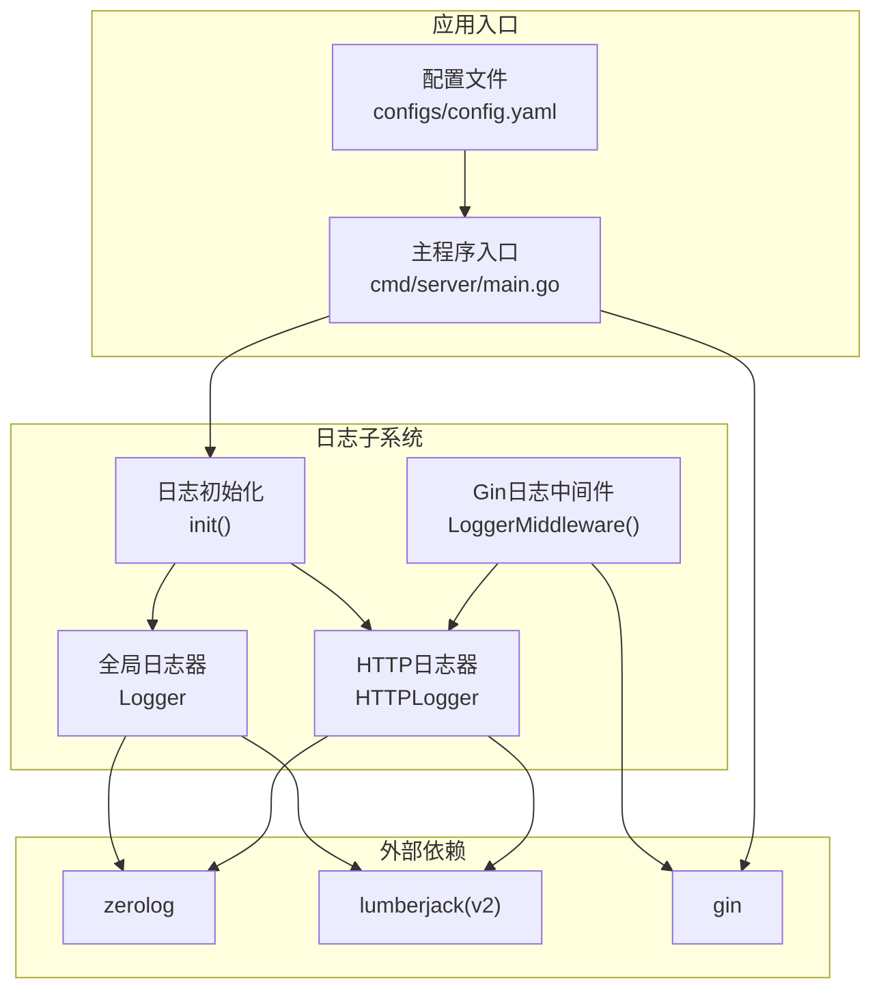
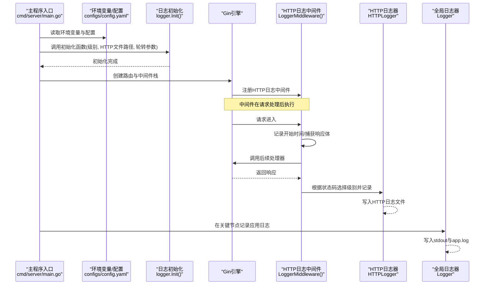
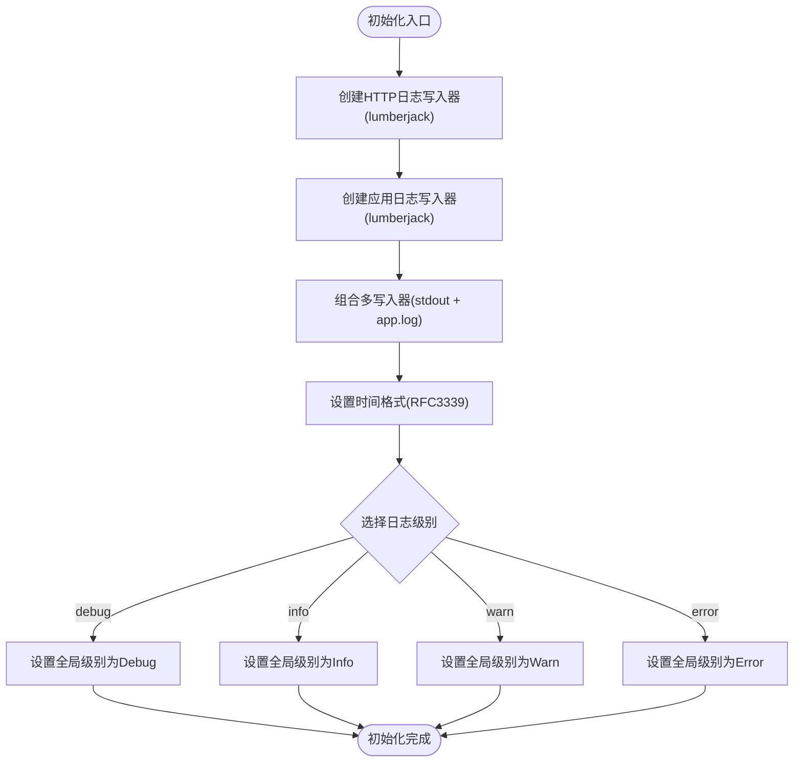
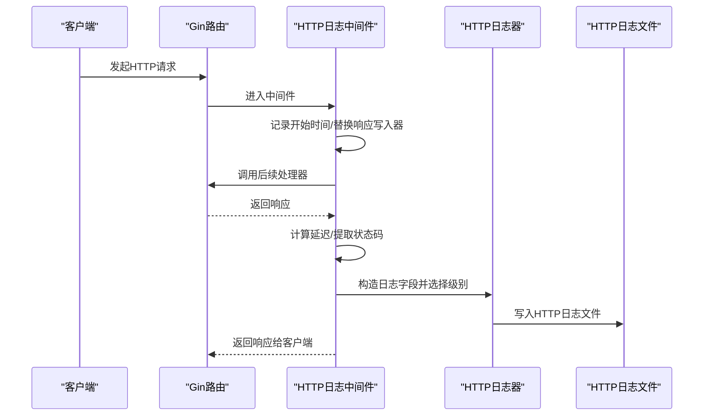
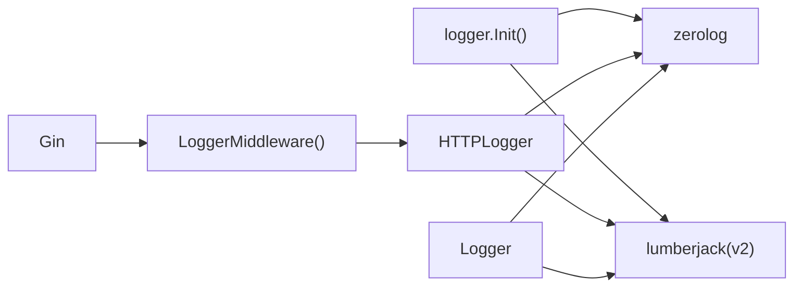

# 日志系统设计

<cite>
**本文引用的文件**
- [internal/logger/logger.go](file://internal/logger/logger.go)
- [internal/logger/middleware.go](file://internal/logger/middleware.go)
- [cmd/server/main.go](file://cmd/server/main.go)
- [configs/config.yaml](file://configs/config.yaml)
- [docs/logging.md](file://docs/logging.md)
- [internal/api/collection_permission_middleware.go](file://internal/api/collection_permission_middleware.go)
- [internal/auth/middleware.go](file://internal/auth/middleware.go)
- [internal/scraper/scraper.go](file://internal/scraper/scraper.go)
</cite>

## 目录
1. [简介](#简介)
2. [项目结构](#项目结构)
3. [核心组件](#核心组件)
4. [架构总览](#架构总览)
5. [详细组件分析](#详细组件分析)
6. [依赖分析](#依赖分析)
7. [性能考虑](#性能考虑)
8. [故障排查指南](#故障排查指南)
9. [结论](#结论)
10. [附录](#附录)

## 简介
本文件面向数据中心项目的日志系统设计，围绕基于 zerolog 的结构化日志体系进行深入解析。重点涵盖：
- 全局日志器与 HTTP 专用日志器的设计理念与职责边界
- 日志级别配置机制（debug、info、warn、error）及其切换逻辑
- 结构化日志格式设计（时间戳、调用者信息、消息内容等）
- 多写入器配置（标准输出与文件输出的组合策略）
- 日志初始化参数详解（日志级别、HTTP 日志文件路径、文件轮转参数等）
- 日志性能优化技巧与最佳实践

## 项目结构
日志系统主要由以下部分组成：
- 日志初始化与全局日志器：负责应用日志与 HTTP 日志的初始化、级别设置与多写入器配置
- Gin HTTP 日志中间件：拦截请求与响应，生成结构化 HTTP 日志
- 主程序入口：加载环境变量并调用日志初始化函数
- 文档与配置：提供日志级别、格式、轮转参数与使用示例的说明

图表来源
- [internal/logger/logger.go:14-56](file://internal/logger/logger.go#L14-L56)
- [internal/logger/middleware.go:25-68](file://internal/logger/middleware.go#L25-L68)
- [cmd/server/main.go:32-38](file://cmd/server/main.go#L32-L38)
- [configs/config.yaml:12-18](file://configs/config.yaml#L12-L18)

章节来源
- [internal/logger/logger.go:1-89](file://internal/logger/logger.go#L1-L89)
- [internal/logger/middleware.go:1-69](file://internal/logger/middleware.go#L1-L69)
- [cmd/server/main.go:1-167](file://cmd/server/main.go#L1-L167)
- [configs/config.yaml:1-26](file://configs/config.yaml#L1-L26)

## 核心组件
- 全局日志器（Logger）：同时输出到标准输出与应用日志文件，包含调用者信息与时间戳，用于应用运行期的通用日志记录
- HTTP 日志器（HTTPLogger）：仅输出到 HTTP 日志文件，包含请求方法、路径、状态码、延迟、客户端 IP、用户代理等字段，用于统一记录 HTTP 请求链路
- 日志初始化函数（Init）：负责创建 HTTP 与应用日志写入器、配置全局日志级别、设置时间格式
- Gin 日志中间件（LoggerMiddleware）：在请求处理完成后，按状态码映射到不同日志级别，并记录请求与响应相关信息

章节来源
- [internal/logger/logger.go:11-56](file://internal/logger/logger.go#L11-L56)
- [internal/logger/middleware.go:25-68](file://internal/logger/middleware.go#L25-L68)

## 架构总览
下图展示了日志系统在应用生命周期中的关键交互流程，从主程序初始化到 HTTP 请求处理再到日志落盘。

图表来源
- [cmd/server/main.go:32-38](file://cmd/server/main.go#L32-L38)
- [internal/logger/logger.go:14-56](file://internal/logger/logger.go#L14-L56)
- [internal/logger/middleware.go:25-68](file://internal/logger/middleware.go#L25-L68)

## 详细组件分析

### 组件一：日志初始化与全局日志器
- 设计理念
  - 全局日志器（Logger）采用多写入器模式，将日志同时输出到标准输出与应用日志文件，便于开发调试与生产运维
  - HTTP 日志器（HTTPLogger）独立配置，仅输出到 HTTP 日志文件，避免污染应用日志
  - 两者均启用时间戳与调用者信息，提升可追溯性
- 初始化流程
  - 创建 HTTP 日志写入器（lumberjack），指定文件路径与轮转参数
  - 创建应用日志写入器（lumberjack），默认文件路径为 logs/app.log
  - 使用 MultiLevelWriter 将 os.Stdout 与应用日志写入器合并
  - 设置全局日志级别（debug/info/warn/error），默认 info
  - 设置时间格式为 RFC3339
- 关键实现位置
  - 初始化函数与写入器配置：[internal/logger/logger.go:14-56](file://internal/logger/logger.go#L14-L56)
  - 全局日志器与 HTTP 日志器声明：[internal/logger/logger.go:11-12](file://internal/logger/logger.go#L11-L12)
  - 日志级别切换逻辑：[internal/logger/logger.go:44-55](file://internal/logger/logger.go#L44-L55)

图表来源
- [internal/logger/logger.go:14-56](file://internal/logger/logger.go#L14-L56)

章节来源
- [internal/logger/logger.go:11-56](file://internal/logger/logger.go#L11-L56)

### 组件二：Gin HTTP 日志中间件
- 设计理念
  - 在请求处理完成后，计算耗时并根据状态码映射到不同日志级别
  - 记录请求方法、路径、查询参数、状态码、延迟、客户端 IP、User-Agent、响应体等关键字段
  - 使用 HTTP 日志器输出，确保 HTTP 请求链路的完整可审计
- 关键实现位置
  - 中间件主体与状态码映射：[internal/logger/middleware.go:25-68](file://internal/logger/middleware.go#L25-L68)
  - 响应体捕获与写入器包装：[internal/logger/middleware.go:10-23](file://internal/logger/middleware.go#L10-L23)

图表来源
- [internal/logger/middleware.go:25-68](file://internal/logger/middleware.go#L25-L68)

章节来源
- [internal/logger/middleware.go:10-68](file://internal/logger/middleware.go#L10-L68)

### 组件三：日志级别配置机制
- 支持级别
  - debug：开发调试信息
  - info：一般运行信息
  - warn：警告信息
  - error：错误信息
- 切换逻辑
  - 通过 switch 语句将字符串级别映射到 zerolog 的全局级别
  - 默认级别为 info
- 配置来源
  - 环境变量 LOG_LEVEL 控制级别
  - 主程序入口读取环境变量并传入初始化函数：[cmd/server/main.go:32-38](file://cmd/server/main.go#L32-L38)
  - 初始化函数内的级别切换逻辑：[internal/logger/logger.go:44-55](file://internal/logger/logger.go#L44-L55)

章节来源
- [internal/logger/logger.go:44-55](file://internal/logger/logger.go#L44-L55)
- [cmd/server/main.go:32-38](file://cmd/server/main.go#L32-L38)

### 组件四：结构化日志格式设计
- 全局日志器字段
  - level：日志级别
  - time：时间戳（RFC3339）
  - caller：调用者信息（文件名:行号）
  - message：消息内容
- HTTP 日志器字段
  - level：日志级别
  - time：时间戳（RFC3339）
  - method：请求方法
  - path：请求路径
  - query：查询参数
  - status：响应状态码
  - latency：请求耗时
  - client_ip：客户端IP
  - user_agent：User-Agent
  - response：响应体
- 时间格式
  - 统一使用 RFC3339 格式
- 关键实现位置
  - 全局日志器与 HTTP 日志器的时间戳与调用者字段：[internal/logger/logger.go:23-40](file://internal/logger/logger.go#L23-L40)
  - HTTP 日志器字段构造与级别选择：[internal/logger/middleware.go:46-66](file://internal/logger/middleware.go#L46-L66)
  - 时间格式设置：[internal/logger/logger.go:42](file://internal/logger/logger.go#L42)

章节来源
- [internal/logger/logger.go:23-42](file://internal/logger/logger.go#L23-L42)
- [internal/logger/middleware.go:46-66](file://internal/logger/middleware.go#L46-L66)

### 组件五：多写入器配置与文件轮转
- 多写入器策略
  - 全局日志器：os.Stdout + logs/app.log
  - HTTP 日志器：仅 logs/http.log
- 文件轮转参数
  - MaxSize：单个日志文件最大大小（MB）
  - MaxBackups：保留日志文件数
  - MaxAge：日志保留天数
  - Compress：是否压缩旧日志
- 关键实现位置
  - HTTP 日志写入器配置：[internal/logger/logger.go:15-21](file://internal/logger/logger.go#L15-L21)
  - 应用日志写入器配置：[internal/logger/logger.go:28-34](file://internal/logger/logger.go#L28-L34)
  - 多写入器组合：[internal/logger/logger.go:36](file://internal/logger/logger.go#L36)

章节来源
- [internal/logger/logger.go:15-36](file://internal/logger/logger.go#L15-L36)

### 组件六：日志初始化参数详解
- 参数列表
  - 日志级别（level）：来自环境变量 LOG_LEVEL 或默认值
  - HTTP 日志文件路径（httpLogFile）：来自环境变量 LOG_HTTP_FILE 或默认值
  - 文件轮转参数：MaxSize、MaxBackups、MaxAge（来自环境变量 LOG_MAX_SIZE、LOG_MAX_BACKUPS、LOG_MAX_AGE）
- 初始化调用位置
  - 主程序入口：[cmd/server/main.go:32-38](file://cmd/server/main.go#L32-L38)
  - 初始化函数签名与实现：[internal/logger/logger.go:14-56](file://internal/logger/logger.go#L14-L56)
- 配置文件参考
  - YAML 配置示例（非运行时读取，供参考）：[configs/config.yaml:12-18](file://configs/config.yaml#L12-L18)
- 文档说明
  - 环境变量与初始化参数说明：[docs/logging.md:92-112](file://docs/logging.md#L92-L112)

章节来源
- [cmd/server/main.go:32-38](file://cmd/server/main.go#L32-L38)
- [internal/logger/logger.go:14-56](file://internal/logger/logger.go#L14-L56)
- [configs/config.yaml:12-18](file://configs/config.yaml#L12-L18)
- [docs/logging.md:92-112](file://docs/logging.md#L92-L112)

### 组件七：日志使用示例与关键记录点
- 基本日志记录
  - Info/Debug/Warn/Error 方法封装：[internal/logger/logger.go:58-88](file://internal/logger/logger.go#L58-L88)
- 结构化日志
  - InfoJSON/DebugJSON/WarnJSON/ErrorJSON 方法封装：[internal/logger/logger.go:74-88](file://internal/logger/logger.go#L74-L88)
- 关键记录点（系统启动、刮削、API 请求等）
  - 主程序关键节点记录：[cmd/server/main.go:129-149](file://cmd/server/main.go#L129-L149)
  - RBAC 中间件错误记录：[internal/api/collection_permission_middleware.go:30-39](file://internal/api/collection_permission_middleware.go#L30-L39)
  - 认证中间件错误记录：[internal/auth/middleware.go:34-39](file://internal/auth/middleware.go#L34-L39)
  - 刮削系统日志记录：[internal/scraper/scraper.go:48-72](file://internal/scraper/scraper.go#L48-L72)

章节来源
- [internal/logger/logger.go:58-88](file://internal/logger/logger.go#L58-L88)
- [cmd/server/main.go:129-149](file://cmd/server/main.go#L129-L149)
- [internal/api/collection_permission_middleware.go:30-39](file://internal/api/collection_permission_middleware.go#L30-L39)
- [internal/auth/middleware.go:34-39](file://internal/auth/middleware.go#L34-L39)
- [internal/scraper/scraper.go:48-72](file://internal/scraper/scraper.go#L48-L72)

## 依赖分析
- 组件耦合
  - 日志初始化函数与 lumberjack 写入器紧密耦合，负责文件落盘策略
  - Gin 中间件依赖 HTTP 日志器，形成清晰的职责边界
  - 全局日志器与 HTTP 日志器共享 zerolog 的全局级别配置
- 外部依赖
  - zerolog：结构化日志核心库
  - lumberjack(v2)：日志文件轮转
  - gin：HTTP 框架，提供中间件与上下文

图表来源
- [internal/logger/logger.go:14-56](file://internal/logger/logger.go#L14-L56)
- [internal/logger/middleware.go:25-68](file://internal/logger/middleware.go#L25-L68)

章节来源
- [internal/logger/logger.go:14-56](file://internal/logger/logger.go#L14-L56)
- [internal/logger/middleware.go:25-68](file://internal/logger/middleware.go#L25-L68)

## 性能考虑
- 写入器选择
  - 全局日志器使用 MultiLevelWriter，同时输出到 stdout 与文件，适合开发与生产双通道需求
  - HTTP 日志器仅写文件，避免 stdout 干扰，降低 I/O 压力
- 文件轮转参数
  - 合理设置 MaxSize、MaxBackups、MaxAge，平衡磁盘占用与日志保留周期
- 日志级别
  - 生产环境建议使用 info 或 warn，减少 debug 信息对性能的影响
- 中间件开销
  - HTTP 中间件会捕获响应体，注意在高并发场景下的内存占用与序列化成本
- 最佳实践
  - 对高频日志使用结构化字段而非复杂字符串拼接
  - 避免在热路径中频繁创建临时对象
  - 使用合适的日志级别与条件判断，减少不必要的日志写入

## 故障排查指南
- 日志未输出或输出异常
  - 检查日志级别是否过低导致被过滤
  - 确认初始化函数是否正确调用且参数有效
  - 核对日志文件路径与权限
- HTTP 日志缺失
  - 确认 Gin 路由已注册日志中间件
  - 检查状态码映射是否符合预期
- 性能问题
  - 评估 MaxSize 与 MaxBackups 设置是否过大
  - 观察中间件对响应体的捕获是否影响性能
- 常见错误定位
  - 认证中间件错误：[internal/auth/middleware.go:34-39](file://internal/auth/middleware.go#L34-L39)
  - RBAC 权限检查错误：[internal/api/collection_permission_middleware.go:30-39](file://internal/api/collection_permission_middleware.go#L30-L39)
  - 刮削系统错误：[internal/scraper/scraper.go:138-159](file://internal/scraper/scraper.go#L138-L159)

章节来源
- [internal/auth/middleware.go:34-39](file://internal/auth/middleware.go#L34-L39)
- [internal/api/collection_permission_middleware.go:30-39](file://internal/api/collection_permission_middleware.go#L30-L39)
- [internal/scraper/scraper.go:138-159](file://internal/scraper/scraper.go#L138-L159)

## 结论
该日志系统以 zerolog 为核心，结合 lumberjack 实现了结构化、可配置、可扩展的日志能力。通过全局日志器与 HTTP 日志器的职责分离，既满足应用运行期的通用日志需求，又保证了 HTTP 请求链路的完整审计。配合合理的文件轮转参数与日志级别策略，能够在开发调试与生产运维之间取得良好平衡。

## 附录
- 环境变量与配置项
  - LOG_LEVEL：日志级别（debug/info/warn/error）
  - LOG_HTTP_FILE：HTTP 日志文件路径
  - LOG_MAX_SIZE：单个日志文件最大大小（MB）
  - LOG_MAX_BACKUPS：保留日志文件数
  - LOG_MAX_AGE：日志保留天数
- 初始化参数调用示例
  - 参考：[docs/logging.md:102-112](file://docs/logging.md#L102-L112)