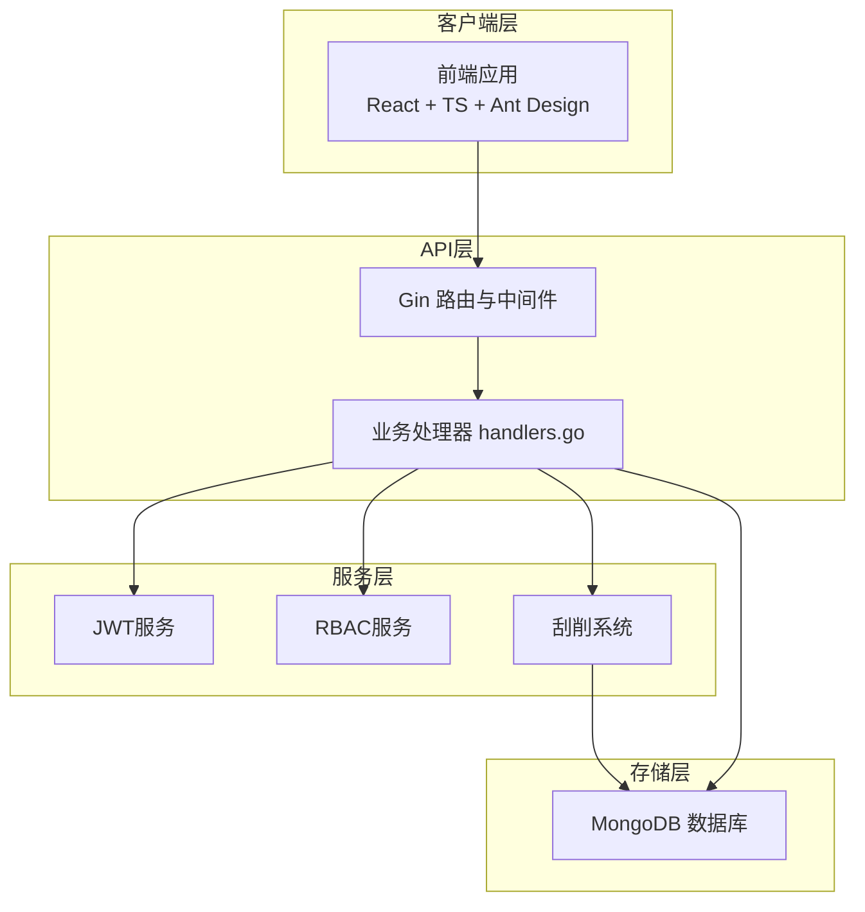
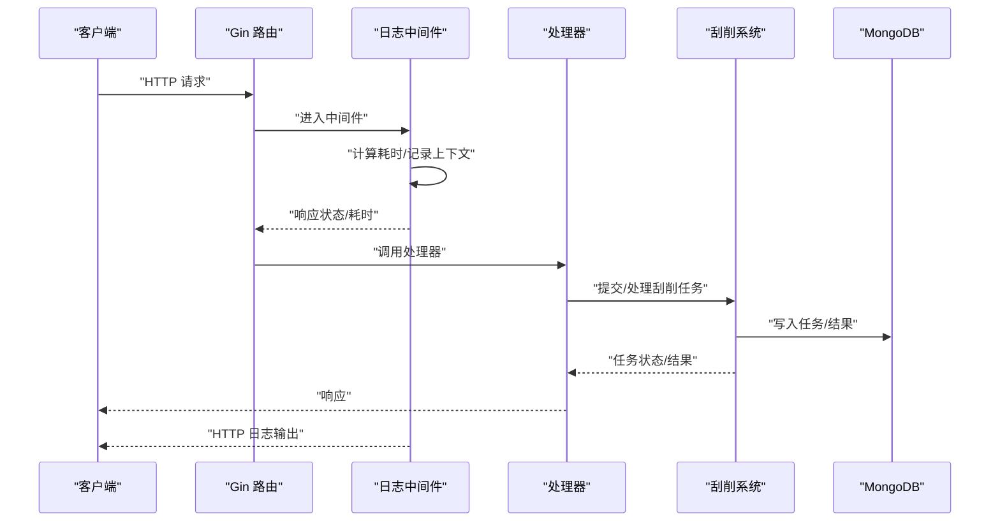
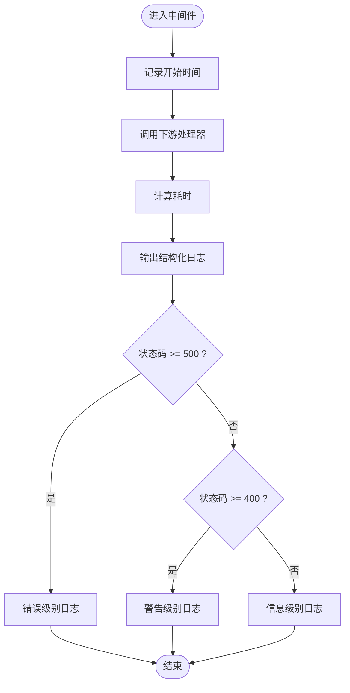
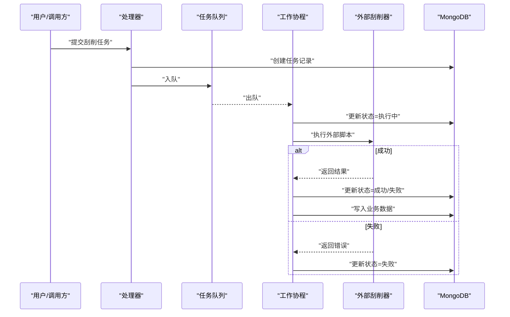
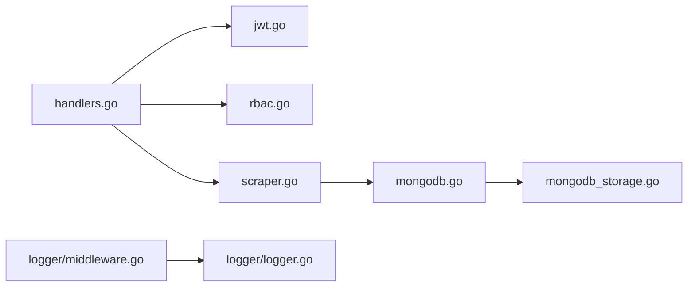

# 监控指标

<cite>
**本文引用的文件**
- [cmd/server/main.go](file://cmd/server/main.go)
- [cmdenscrape/main.go](file://cmdenscrape/main.go)
- [configs/config.yaml](file://configs/config.yaml)
- [internal/logger/logger.go](file://internal/logger/logger.go)
- [internal/logger/middleware.go](file://internal/logger/middleware.go)
- [internal/api/handlers.go](file://internal/api/handlers.go)
- [internal/models/models.go](file://internal/models/models.go)
- [internal/storage/mongodb.go](file://internal/storage/mongodb.go)
- [internal/storage/mongodb_storage.go](file://internal/storage/mongodb_storage.go)
- [internal/scraper/scraper.go](file://internal/scraper/scraper.go)
- [internal/auth/jwt.go](file://internal/auth/jwt.go)
- [pkg/rbac/rbac.go](file://pkg/rbac/rbac.go)
- [docs/architecture.md](file://docs/architecture.md)
- [docs/api.md](file://docs/api.md)
- [test/e2e.go](file://test/e2e.go)
</cite>

## 目录
1. [简介](#简介)
2. [项目结构](#项目结构)
3. [核心组件](#核心组件)
4. [架构总览](#架构总览)
5. [详细组件分析](#详细组件分析)
6. [依赖分析](#依赖分析)
7. [性能考虑](#性能考虑)
8. [故障排查指南](#故障排查指南)
9. [结论](#结论)
10. [附录](#附录)

## 简介
本文件面向数据中心项目的监控指标体系，围绕基础设施与业务两类指标，结合现有代码中的日志与刮削流程，系统化梳理监控指标设计、采集机制、存储策略、仪表板与告警建议。由于仓库中未直接实现独立的监控采集器或时序数据库写入逻辑，本文在“监控数据存储策略”和“实时监控数据收集机制”部分提供可落地的工程化建议与对接方案，帮助团队在现有架构上快速扩展监控能力。

## 项目结构
数据中心系统采用前后端分离的分层架构，后端基于 Go + Gin + MongoDB，前端基于 React + TypeScript。系统通过中间件、日志与刮削子系统形成天然的可观测性基础。

**图示来源**
- [docs/architecture.md](file://docs/architecture.md)
- [cmd/server/main.go](file://cmd/server/main.go)
- [internal/api/handlers.go](file://internal/api/handlers.go)
- [internal/scraper/scraper.go](file://internal/scraper/scraper.go)
- [internal/storage/mongodb_storage.go](file://internal/storage/mongodb_storage.go)

**章节来源**
- [docs/architecture.md](file://docs/architecture.md)
- [cmd/server/main.go](file://cmd/server/main.go)

## 核心组件
- HTTP 服务器与路由：负责接收请求、注册路由、应用中间件（CORS、日志、恢复）。
- 日志系统：统一日志初始化、按级别输出、HTTP 请求日志中间件。
- 刮削系统：异步任务队列、工作协程、任务状态流转与结果持久化。
- 存储层：MongoDB 接口与实现，涵盖用户、权限、业务数据、刮削任务等集合。
- 认证与鉴权：JWT 服务与 RBAC 权限服务，提供登录、权限校验与集合级权限控制。

**章节来源**
- [cmd/server/main.go](file://cmd/server/main.go)
- [internal/logger/logger.go](file://internal/logger/logger.go)
- [internal/logger/middleware.go](file://internal/logger/middleware.go)
- [internal/scraper/scraper.go](file://internal/scraper/scraper.go)
- [internal/storage/mongodb.go](file://internal/storage/mongodb.go)
- [internal/storage/mongodb_storage.go](file://internal/storage/mongodb_storage.go)
- [internal/auth/jwt.go](file://internal/auth/jwt.go)
- [pkg/rbac/rbac.go](file://pkg/rbac/rbac.go)

## 架构总览
下图展示监控相关的关键交互点：HTTP 请求经中间件采集延迟与状态；日志系统输出结构化日志；刮削系统在任务执行过程中产生状态变更与结果，这些均可作为监控指标的数据来源。

**图示来源**
- [internal/logger/middleware.go](file://internal/logger/middleware.go)
- [internal/api/handlers.go](file://internal/api/handlers.go)
- [internal/scraper/scraper.go](file://internal/scraper/scraper.go)
- [internal/storage/mongodb_storage.go](file://internal/storage/mongodb_storage.go)

## 详细组件分析

### HTTP 请求与延迟监控
- 指标定义
  - 请求延迟（毫秒级）：从进入中间件到返回响应的时间差。
  - 请求状态码分布：统计 2xx/4xx/5xx 的占比。
  - 请求路径与方法：区分不同接口的负载。
  - 客户端 IP 与 UA：辅助定位来源与异常行为。
- 采集方式
  - 在日志中间件中计算耗时并以结构化字段输出，便于后续采集与分析。
- 存储与可视化
  - 建议将中间件输出的日志接入日志管道（如 ELK/Fluentd/Loki），通过 Promtail 或日志采集器将指标化为直方图/计数器，再导入时序数据库或 BI 平台。

**图示来源**
- [internal/logger/middleware.go](file://internal/logger/middleware.go)

**章节来源**
- [internal/logger/middleware.go](file://internal/logger/middleware.go)
- [internal/logger/logger.go](file://internal/logger/logger.go)

### 刮削任务生命周期监控
- 指标定义
  - 任务提交速率（QPS）
  - 任务执行时延（从开始到完成）
  - 成功率（成功/失败）
  - 并发执行数（工作协程池）
  - 结果条目数、错误消息
- 采集方式
  - 刮削系统在状态变更（提交、执行中、成功、失败）时输出结构化日志。
  - 可扩展：在任务处理前后埋点，记录开始/结束时间与结果字段。
- 存储与可视化
  - 与 HTTP 监控一致，通过日志采集器将日志转换为指标，绘制趋势与异常。

**图示来源**
- [internal/scraper/scraper.go](file://internal/scraper/scraper.go)
- [internal/storage/mongodb_storage.go](file://internal/storage/mongodb_storage.go)
- [internal/models/models.go](file://internal/models/models.go)

**章节来源**
- [internal/scraper/scraper.go](file://internal/scraper/scraper.go)
- [internal/storage/mongodb_storage.go](file://internal/storage/mongodb_storage.go)
- [internal/models/models.go](file://internal/models/models.go)

### 认证与鉴权监控
- 指标定义
  - 登录请求量与成功率
  - Token 生成与刷新次数
  - 权限拒绝次数
- 采集方式
  - 登录与权限中间件输出结构化日志，便于统计。
- 存储与可视化
  - 与 HTTP 监控一致，通过日志采集器指标化。

**章节来源**
- [internal/api/handlers.go](file://internal/api/handlers.go)
- [internal/auth/jwt.go](file://internal/auth/jwt.go)
- [pkg/rbac/rbac.go](file://pkg/rbac/rbac.go)

### 数据模型与监控映射
- 业务数据与刮削任务均以结构化文档形式存储，便于在日志中输出关键字段（如模块、任务ID、状态、耗时、错误信息）。
- 建议在日志中保留这些字段，以便后续指标化与检索。

**章节来源**
- [internal/models/models.go](file://internal/models/models.go)
- [internal/storage/mongodb_storage.go](file://internal/storage/mongodb_storage.go)

## 依赖分析
- 组件耦合
  - API 层依赖认证、鉴权、刮削与存储服务。
  - 刮削系统依赖存储接口，存储接口依赖 MongoDB 实现。
  - 日志中间件与全局日志初始化相互独立，但共同服务于可观测性。
- 外部依赖
  - Gin 路由框架、MongoDB Go 驱动、JWT 库、日志库。

**图示来源**
- [internal/api/handlers.go](file://internal/api/handlers.go)
- [internal/auth/jwt.go](file://internal/auth/jwt.go)
- [pkg/rbac/rbac.go](file://pkg/rbac/rbac.go)
- [internal/scraper/scraper.go](file://internal/scraper/scraper.go)
- [internal/storage/mongodb.go](file://internal/storage/mongodb.go)
- [internal/storage/mongodb_storage.go](file://internal/storage/mongodb_storage.go)
- [internal/logger/middleware.go](file://internal/logger/middleware.go)
- [internal/logger/logger.go](file://internal/logger/logger.go)

**章节来源**
- [internal/api/handlers.go](file://internal/api/handlers.go)
- [internal/scraper/scraper.go](file://internal/scraper/scraper.go)
- [internal/storage/mongodb.go](file://internal/storage/mongodb.go)
- [internal/storage/mongodb_storage.go](file://internal/storage/mongodb_storage.go)
- [internal/logger/middleware.go](file://internal/logger/middleware.go)
- [internal/logger/logger.go](file://internal/logger/logger.go)
- [internal/auth/jwt.go](file://internal/auth/jwt.go)
- [pkg/rbac/rbac.go](file://pkg/rbac/rbac.go)

## 性能考虑
- HTTP 延迟与吞吐
  - 通过日志中间件统计延迟分布，识别慢接口与异常峰值。
  - 控制日志级别与输出频率，避免高并发场景下的 I/O 抖动。
- 刮削系统并发
  - 工作协程池大小与任务队列容量需根据 CPU 与 I/O 能力调优。
  - 外部脚本执行时间长的任务应拆分或异步化，避免阻塞队列。
- 存储性能
  - 业务数据集合按模块动态创建，建议为高频查询字段建立索引。
  - 对删除与回收操作增加清理策略，避免集合膨胀影响查询性能。

[本节为通用指导，不直接分析具体文件]

## 故障排查指南
- HTTP 请求异常
  - 检查日志中间件输出的状态码与耗时，定位慢请求与错误接口。
  - 关注 5xx 错误日志，结合堆栈与响应体进行问题复现。
- 刮削任务失败
  - 查看任务状态与错误消息，确认外部脚本是否存在权限、路径或依赖问题。
  - 检查 MongoDB 中任务与结果集合，核对状态更新与业务数据写入是否成功。
- 认证与鉴权
  - 登录失败通常由凭据错误或权限不足导致，查看登录与权限中间件日志。
  - 权限拒绝可通过 RBAC 服务的权限匹配逻辑进行回溯。

**章节来源**
- [internal/logger/middleware.go](file://internal/logger/middleware.go)
- [internal/scraper/scraper.go](file://internal/scraper/scraper.go)
- [internal/storage/mongodb_storage.go](file://internal/storage/mongodb_storage.go)
- [internal/api/handlers.go](file://internal/api/handlers.go)
- [pkg/rbac/rbac.go](file://pkg/rbac/rbac.go)

## 结论
- 现有代码已具备良好的可观测性基础：HTTP 中间件与日志系统、刮削系统的状态变更日志，均可作为监控指标的直接来源。
- 建议引入标准的监控采集与存储方案（日志采集器 + 时序数据库），将结构化日志转换为指标，构建仪表板与告警。
- 通过持续优化并发与索引策略，提升系统整体稳定性与可观测性。

[本节为总结性内容，不直接分析具体文件]

## 附录

### 监控指标设计建议（基于现有代码）
- 基础设施指标（建议）
  - CPU 使用率：通过系统监控工具采集（如 Prometheus Node Exporter）。
  - 内存占用：同上。
  - 网络 I/O：按接口维度统计输入/输出字节数。
  - 磁盘 I/O：按集合与索引维度统计读写次数与延迟。
- 业务指标（建议）
  - API 响应时间（P50/P95/P99）、请求成功率、并发请求数、错误率。
  - 刮削任务成功率、平均执行时延、每任务处理条目数、失败原因分布。
  - 登录请求量与成功率、权限拒绝次数。

[本节为概念性建议，不直接分析具体文件]

### 实时监控数据收集机制（工程化建议）
- 定时采样：通过系统监控工具定期采集 CPU/内存/IO 指标。
- 事件触发：在日志中间件与刮削系统中输出结构化日志，由采集器实时转换为指标。
- 批量上报：将日志采集器与指标导出器（如 Prometheus Exporter）集成，统一上报至监控平台。

[本节为概念性建议，不直接分析具体文件]

### 监控数据存储策略（工程化建议）
- 时序数据库选择：Prometheus（适合短期高分辨率）、InfluxDB（适合高写入与聚合）、OpenTSDB（适合海量时序）。
- 数据聚合：按分钟/小时粒度聚合，保留天级/周级归档数据。
- 历史数据管理：设置 TTL 与分层存储策略，清理过期数据，降低长期成本。

[本节为概念性建议，不直接分析具体文件]

### 监控仪表板设计方案（工程化建议）
- 关键指标展示：CPU/内存/IO、API 延迟与错误率、刮削任务成功率与时延。
- 趋势图表：近 1 小时/1 天/1 周的趋势对比。
- 异常检测界面：基于阈值与规则的告警面板，支持快速定位与处置。

[本节为概念性建议，不直接分析具体文件]

### 告警阈值与通知机制（工程化建议）
- 阈值设置：API 延迟 P95 超过 2 秒、错误率超过 1%、刮削失败率超过 5%、系统 CPU 使用率超过 80%。
- 通知机制：邮件/短信/IM（如钉钉/飞书）分级通知，支持静默窗口与抑制策略。

[本节为概念性建议，不直接分析具体文件]