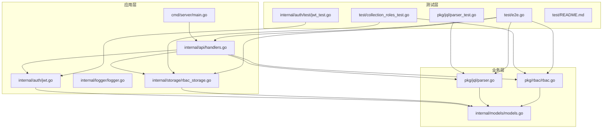
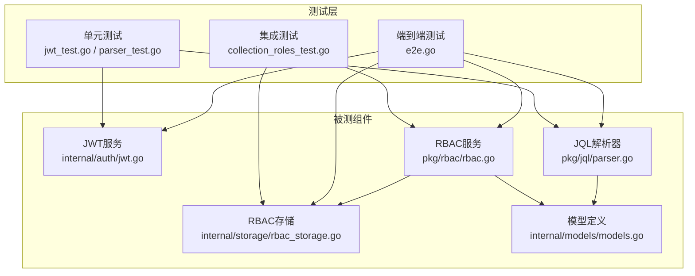
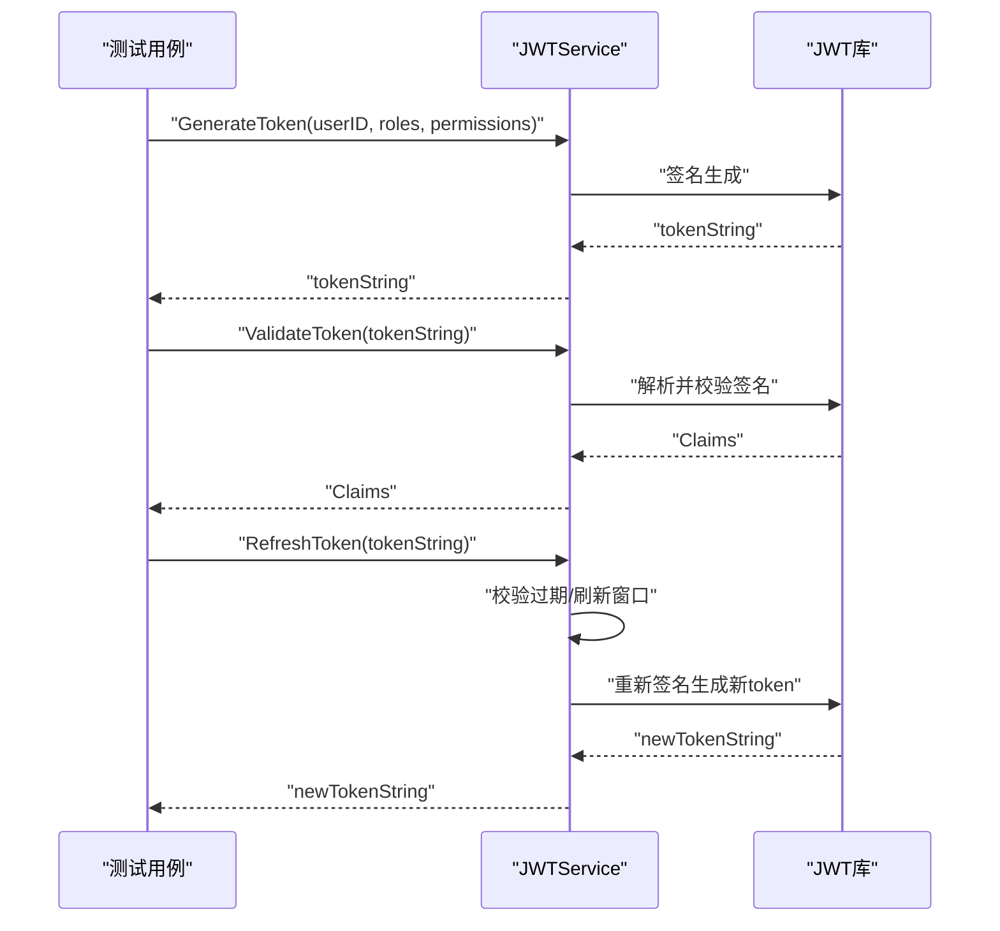
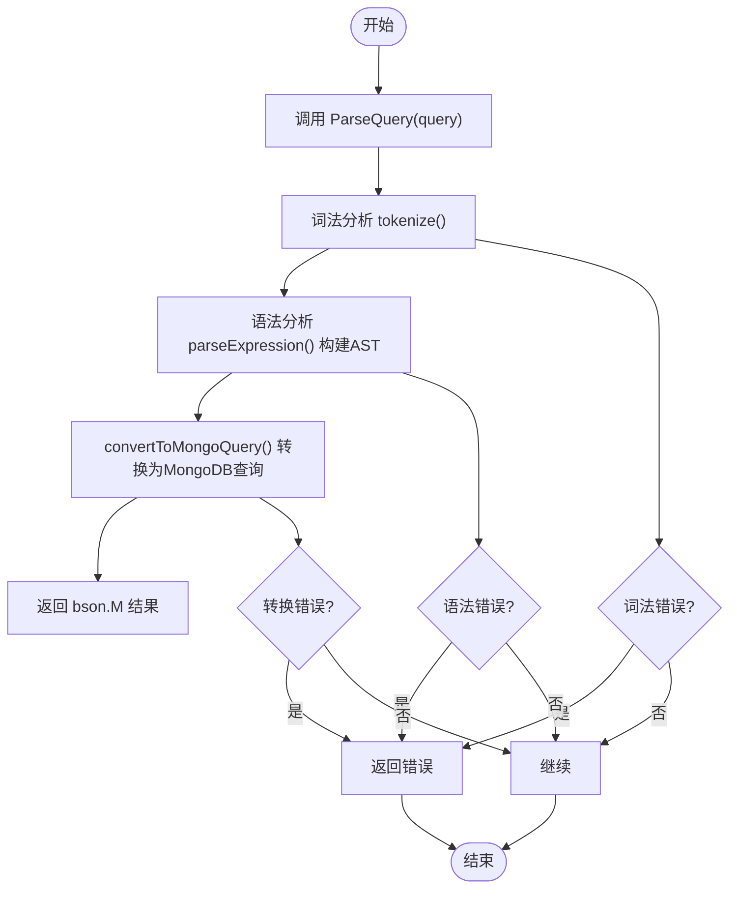
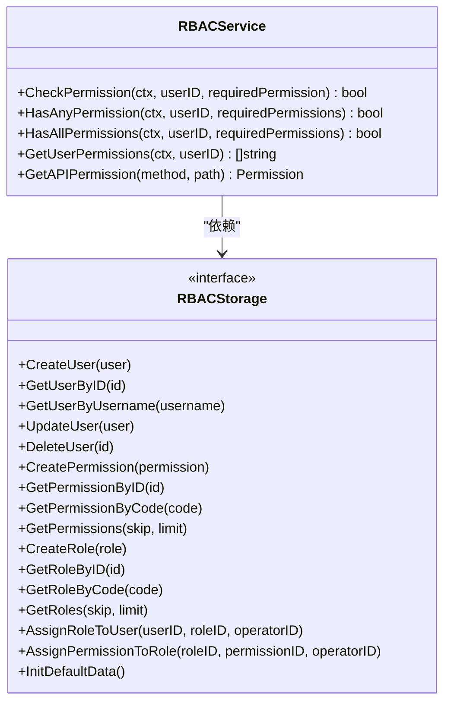
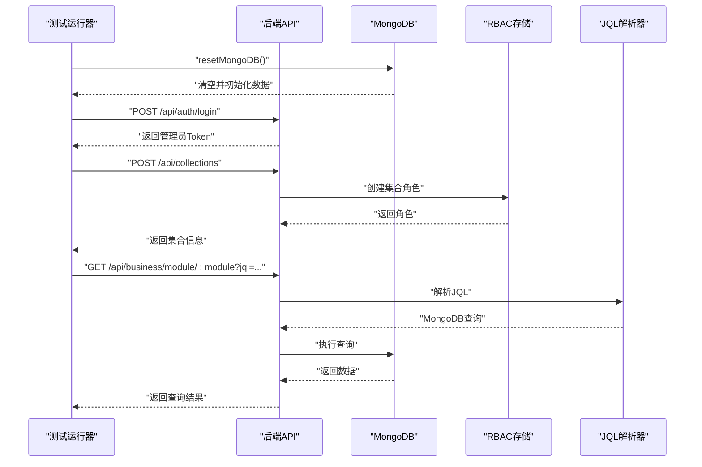
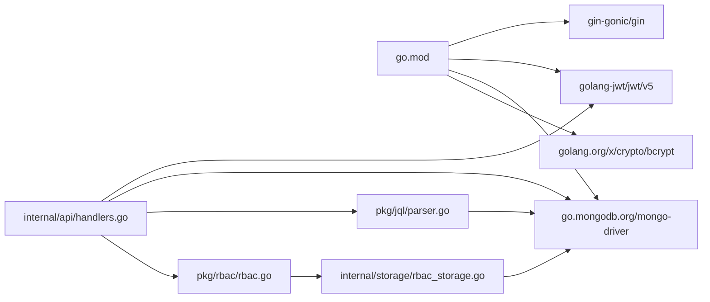

# 单元测试

<cite>
**本文引用的文件**
- [internal/auth/test/jwt_test.go](file://internal/auth/test/jwt_test.go)
- [internal/auth/jwt.go](file://internal/auth/jwt.go)
- [pkg/jql/parser_test.go](file://pkg/jql/parser_test.go)
- [pkg/jql/parser.go](file://pkg/jql/parser.go)
- [pkg/rbac/rbac.go](file://pkg/rbac/rbac.go)
- [internal/storage/rbac_storage.go](file://internal/storage/rbac_storage.go)
- [internal/models/models.go](file://internal/models/models.go)
- [test/collection_roles_test.go](file://test/collection_roles_test.go)
- [test/e2e.go](file://test/e2e.go)
- [test/README.md](file://test/README.md)
- [go.mod](file://go.mod)
</cite>

## 目录
1. [引言](#引言)
2. [项目结构](#项目结构)
3. [核心组件](#核心组件)
4. [架构总览](#架构总览)
5. [详细组件分析](#详细组件分析)
6. [依赖分析](#依赖分析)
7. [性能考虑](#性能考虑)
8. [故障排查指南](#故障排查指南)
9. [结论](#结论)
10. [附录](#附录)

## 引言
本指南面向Go语言开发者，系统讲解如何在本项目中开展高质量的单元测试与集成测试。内容覆盖：
- 测试文件命名规范与组织结构
- _test.go 编写模式与测试函数命名约定
- Mock 对象的创建与使用策略（接口Mock、数据库Mock、外部服务Mock）
- 断言库选择与最佳实践（testing包与第三方断言库）
- 具体测试用例示例：JWT认证、JQL解析器、RBAC权限
- 测试覆盖率计算与提升方法（行覆盖率、分支覆盖率、函数覆盖率）
- 测试数据准备与清理策略，确保测试独立性与可重复性

## 项目结构
本项目采用按领域分层的组织方式，测试主要集中在以下位置：
- 内部模块测试：internal/auth/test/jwt_test.go
- 解析器测试：pkg/jql/parser_test.go
- 集成/端到端测试：test/collection_roles_test.go、test/e2e.go
- 测试数据生成工具：test/README.md

图表来源
- [go.mod](file://go.mod)
- [internal/auth/jwt.go](file://internal/auth/jwt.go)
- [pkg/jql/parser.go](file://pkg/jql/parser.go)
- [pkg/rbac/rbac.go](file://pkg/rbac/rbac.go)
- [internal/storage/rbac_storage.go](file://internal/storage/rbac_storage.go)
- [internal/models/models.go](file://internal/models/models.go)
- [internal/auth/test/jwt_test.go](file://internal/auth/test/jwt_test.go)
- [pkg/jql/parser_test.go](file://pkg/jql/parser_test.go)
- [test/collection_roles_test.go](file://test/collection_roles_test.go)
- [test/e2e.go](file://test/e2e.go)
- [test/README.md](file://test/README.md)

章节来源
- [go.mod](file://go.mod)
- [internal/auth/test/jwt_test.go](file://internal/auth/test/jwt_test.go)
- [pkg/jql/parser_test.go](file://pkg/jql/parser_test.go)
- [test/collection_roles_test.go](file://test/collection_roles_test.go)
- [test/e2e.go](file://test/e2e.go)
- [test/README.md](file://test/README.md)

## 核心组件
- JWT认证服务：提供令牌生成、校验、刷新与密码加解密能力
- JQL解析器：将JQL查询转换为MongoDB查询条件
- RBAC服务：基于角色与权限的访问控制
- RBAC存储：MongoDB持久化实现
- 端到端测试：覆盖从注册、角色分配到数据查询与刮削任务的完整流程

章节来源
- [internal/auth/jwt.go](file://internal/auth/jwt.go)
- [pkg/jql/parser.go](file://pkg/jql/parser.go)
- [pkg/rbac/rbac.go](file://pkg/rbac/rbac.go)
- [internal/storage/rbac_storage.go](file://internal/storage/rbac_storage.go)
- [internal/models/models.go](file://internal/models/models.go)

## 架构总览
下图展示测试与被测组件之间的交互关系，以及测试层次（单元/集成/端到端）。

图表来源
- [internal/auth/jwt.go](file://internal/auth/jwt.go)
- [pkg/jql/parser.go](file://pkg/jql/parser.go)
- [pkg/rbac/rbac.go](file://pkg/rbac/rbac.go)
- [internal/storage/rbac_storage.go](file://internal/storage/rbac_storage.go)
- [internal/models/models.go](file://internal/models/models.go)
- [internal/auth/test/jwt_test.go](file://internal/auth/test/jwt_test.go)
- [pkg/jql/parser_test.go](file://pkg/jql/parser_test.go)
- [test/collection_roles_test.go](file://test/collection_roles_test.go)
- [test/e2e.go](file://test/e2e.go)

## 详细组件分析

### JWT认证测试
- 测试目标
  - 生成Token、校验Token、刷新Token的正确性
  - 密码加密与校验
- 关键点
  - 使用testing包进行断言
  - 通过NewJWTService构造受测对象
  - 验证Claims字段完整性与有效性
- 示例路径
  - [internal/auth/test/jwt_test.go](file://internal/auth/test/jwt_test.go)
  - [internal/auth/jwt.go](file://internal/auth/jwt.go)

图表来源
- [internal/auth/jwt.go](file://internal/auth/jwt.go)
- [internal/auth/test/jwt_test.go](file://internal/auth/test/jwt_test.go)

章节来源
- [internal/auth/test/jwt_test.go](file://internal/auth/test/jwt_test.go)
- [internal/auth/jwt.go](file://internal/auth/jwt.go)

### JQL解析器测试
- 测试目标
  - 各类操作符（=、!=、>、<、>=、<=、~、IN、NOT IN、IS NULL、IS NOT NULL）
  - 布尔逻辑（AND、OR、NOT）
  - 函数支持（CurrentUser、Now、StartOfDay、EndOfDay、StartOfWeek、EndOfWeek、StartOfMonth、EndOfMonth）
  - 嵌套字段（profile.name、address.city等）
  - 特殊字符与边界情况（空查询、空白、转义、多空格、中文、emoji、特殊字符）
  - 错误场景（未闭合引号、括号不匹配、缺失操作符或值等）
- 关键点
  - 使用表驱动测试（table-driven tests）组织大量用例
  - 使用t.Run子测试隔离不同场景
  - 使用bson.M断言结果结构
- 示例路径
  - [pkg/jql/parser_test.go](file://pkg/jql/parser_test.go)
  - [pkg/jql/parser.go](file://pkg/jql/parser.go)

图表来源
- [pkg/jql/parser.go](file://pkg/jql/parser.go)
- [pkg/jql/parser_test.go](file://pkg/jql/parser_test.go)

章节来源
- [pkg/jql/parser_test.go](file://pkg/jql/parser_test.go)
- [pkg/jql/parser.go](file://pkg/jql/parser.go)

### RBAC权限测试
- 测试目标
  - 用户权限检查（单个、任一、全部）
  - API权限映射（根据HTTP方法与路径推导所需权限）
  - 收集用户权限集合
- 关键点
  - 通过RBACStorage接口抽象存储层，便于在测试中注入Mock
  - 使用表驱动测试覆盖多种权限组合
- 示例路径
  - [pkg/rbac/rbac.go](file://pkg/rbac/rbac.go)
  - [internal/storage/rbac_storage.go](file://internal/storage/rbac_storage.go)
  - [internal/models/models.go](file://internal/models/models.go)
  - [test/collection_roles_test.go](file://test/collection_roles_test.go)

图表来源
- [pkg/rbac/rbac.go](file://pkg/rbac/rbac.go)
- [internal/storage/rbac_storage.go](file://internal/storage/rbac_storage.go)

章节来源
- [pkg/rbac/rbac.go](file://pkg/rbac/rbac.go)
- [internal/storage/rbac_storage.go](file://internal/storage/rbac_storage.go)
- [internal/models/models.go](file://internal/models/models.go)
- [test/collection_roles_test.go](file://test/collection_roles_test.go)

### 端到端测试
- 测试目标
  - 管理员登录、用户注册、角色分配、权限验证
  - 刮削任务上传、重试、删除与恢复
  - 基础数据查询与JQL高级查询
- 关键点
  - 通过HTTP客户端直接调用后端API
  - 使用MongoDB初始化与清理数据
  - 将步骤拆分为多个测试函数，便于定位问题
- 示例路径
  - [test/e2e.go](file://test/e2e.go)
  - [test/README.md](file://test/README.md)

图表来源
- [test/e2e.go](file://test/e2e.go)
- [pkg/jql/parser.go](file://pkg/jql/parser.go)
- [internal/storage/rbac_storage.go](file://internal/storage/rbac_storage.go)

章节来源
- [test/e2e.go](file://test/e2e.go)
- [test/README.md](file://test/README.md)

## 依赖分析
- 外部依赖
  - Gin（Web框架）、JWT（令牌）、MongoDB Driver（数据库）、bcrypt（密码）
- 内部依赖
  - API层依赖auth、storage、jql、rbac
  - RBAC服务依赖RBAC存储与模型
  - JQL解析器依赖MongoDB BSON

图表来源
- [go.mod](file://go.mod)
- [internal/auth/jwt.go](file://internal/auth/jwt.go)
- [pkg/jql/parser.go](file://pkg/jql/parser.go)
- [pkg/rbac/rbac.go](file://pkg/rbac/rbac.go)
- [internal/storage/rbac_storage.go](file://internal/storage/rbac_storage.go)

章节来源
- [go.mod](file://go.mod)

## 性能考虑
- 测试并发
  - 使用t.Parallel()提升并行度（适用于无共享状态的测试）
- 数据库连接
  - 在测试前统一建立连接池，避免重复连接开销
- 用例粒度
  - 将大用例拆分为小用例，减少单次测试耗时
- 覆盖率收集
  - 使用go test -coverprofile=coverage.out -covermode=atomic生成覆盖率报告

[本节为通用指导，无需特定文件引用]

## 故障排查指南
- 常见问题
  - MongoDB未启动：端到端测试会失败；先启动本地MongoDB
  - 权限不足：确保管理员账户存在且具备system:admin权限
  - 时间相关函数：Now/StartOfDay等依赖当前时间，建议固定时间或容忍范围
- 排查步骤
  - 逐段执行端到端测试，定位失败步骤
  - 检查MongoDB集合数据是否被正确初始化与清理
  - 使用日志中间件输出请求与响应详情
- 参考路径
  - [test/e2e.go](file://test/e2e.go)
  - [test/README.md](file://test/README.md)

章节来源
- [test/e2e.go](file://test/e2e.go)
- [test/README.md](file://test/README.md)

## 结论
本项目已具备完善的测试体系：单元测试覆盖核心算法与服务逻辑，集成测试验证模块间协作，端到端测试保障整体流程可用。建议持续完善Mock策略、提升覆盖率，并引入更丰富的断言库以增强可读性与维护性。

[本节为总结，无需特定文件引用]

## 附录

### 测试文件命名规范与组织结构
- 命名规范
  - 文件名以 _test.go 结尾，如 jwt_test.go、parser_test.go
  - 测试函数以 TestXxx 开头，如 TestJWTService、TestParseQuery
- 组织结构
  - 内部模块测试置于 internal/<module>/test/
  - 集成/端到端测试置于 test/
  - 每个包内尽量保持测试文件与被测文件一一对应

章节来源
- [internal/auth/test/jwt_test.go](file://internal/auth/test/jwt_test.go)
- [pkg/jql/parser_test.go](file://pkg/jql/parser_test.go)
- [test/collection_roles_test.go](file://test/collection_roles_test.go)
- [test/e2e.go](file://test/e2e.go)

### Mock对象的创建与使用
- 接口Mock
  - 为RBACStorage等接口定义测试替身，注入到服务中
  - 使用表驱动测试验证不同返回值的行为
- 数据库Mock
  - 使用内存数据库或容器化MongoDB，配合初始化与清理脚本
  - 在测试前后确保数据隔离
- 外部服务Mock
  - 使用HTTP客户端替换或拦截，模拟API响应
  - 通过环境变量或配置切换真实/Mock行为

章节来源
- [pkg/rbac/rbac.go](file://pkg/rbac/rbac.go)
- [internal/storage/rbac_storage.go](file://internal/storage/rbac_storage.go)
- [test/collection_roles_test.go](file://test/collection_roles_test.go)
- [test/e2e.go](file://test/e2e.go)

### 断言库选择与使用
- testing包
  - 使用t.Error/t.Errorf/t.Fatalf进行断言与失败报告
  - 使用t.Run组织子测试
- 第三方断言库
  - 可选 testify/assert 提升断言可读性
  - 注意与testing包的结合使用，避免过度封装

章节来源
- [internal/auth/test/jwt_test.go](file://internal/auth/test/jwt_test.go)
- [pkg/jql/parser_test.go](file://pkg/jql/parser_test.go)
- [test/collection_roles_test.go](file://test/collection_roles_test.go)
- [test/e2e.go](file://test/e2e.go)

### 具体测试用例示例
- JWT认证
  - 生成/校验/刷新Token，密码加解密
  - 路径参考：[internal/auth/test/jwt_test.go](file://internal/auth/test/jwt_test.go)
- JQL解析器
  - 各类操作符、布尔逻辑、函数、嵌套字段与错误场景
  - 路径参考：[pkg/jql/parser_test.go](file://pkg/jql/parser_test.go)
- RBAC权限
  - 权限检查、API权限映射、用户权限集合
  - 路径参考：[pkg/rbac/rbac.go](file://pkg/rbac/rbac.go)

章节来源
- [internal/auth/test/jwt_test.go](file://internal/auth/test/jwt_test.go)
- [pkg/jql/parser_test.go](file://pkg/jql/parser_test.go)
- [pkg/rbac/rbac.go](file://pkg/rbac/rbac.go)

### 测试覆盖率计算与提升
- 计算
  - go test -coverpkg=./... -coverprofile=coverage.out ./...
  - go tool cover -html=coverage.out -o coverage.html
- 指标
  - 行覆盖率、分支覆盖率、函数覆盖率
- 提升策略
  - 为每个分支添加测试用例
  - 对错误路径进行显式断言
  - 使用表驱动测试覆盖边界条件

章节来源
- [internal/auth/test/jwt_test.go](file://internal/auth/test/jwt_test.go)
- [pkg/jql/parser_test.go](file://pkg/jql/parser_test.go)
- [pkg/rbac/rbac.go](file://pkg/rbac/rbac.go)

### 测试数据准备与清理
- 准备
  - 使用初始化脚本创建默认权限、角色与用户
  - 端到端测试中通过resetMongoDB清理并填充测试数据
- 清理
  - 每个测试结束后删除临时数据
  - 使用defer语句确保资源释放
- 参考路径
  - [test/README.md](file://test/README.md)
  - [test/e2e.go](file://test/e2e.go)

章节来源
- [test/README.md](file://test/README.md)
- [test/e2e.go](file://test/e2e.go)