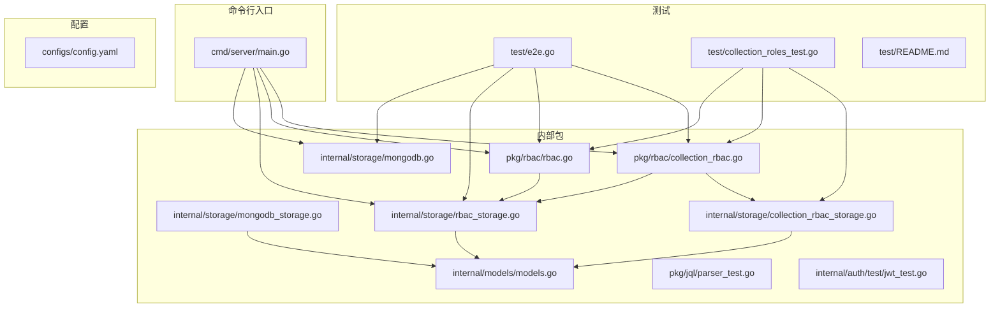
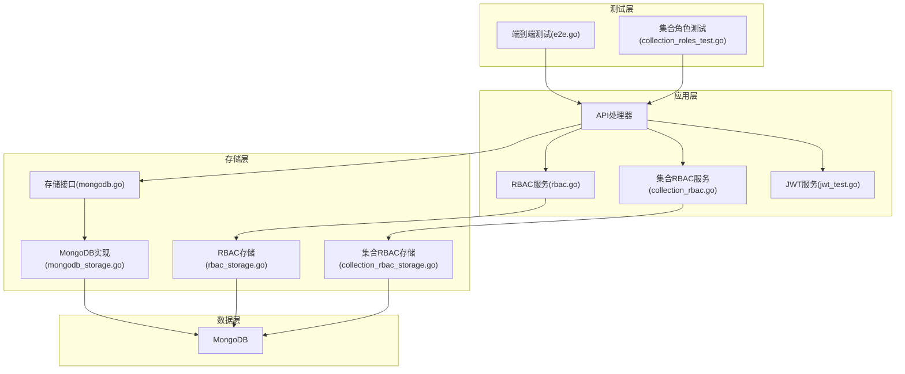
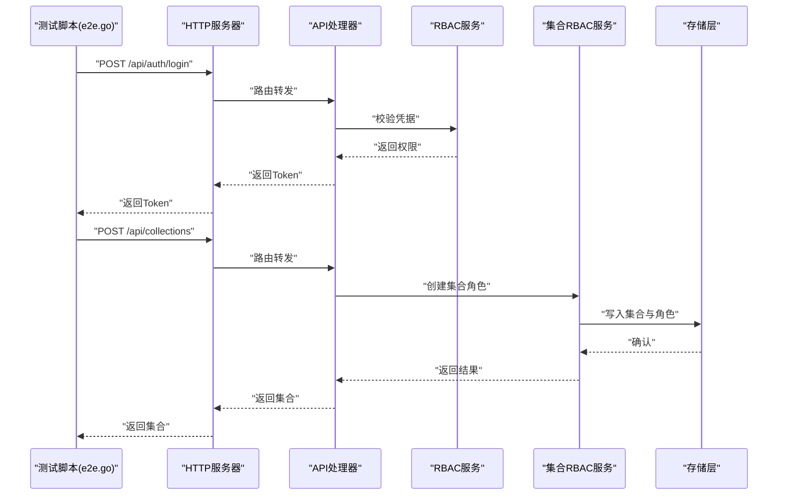
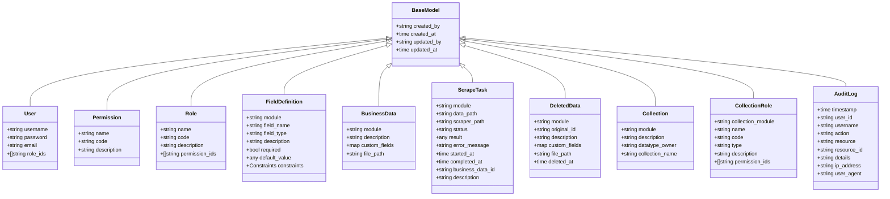
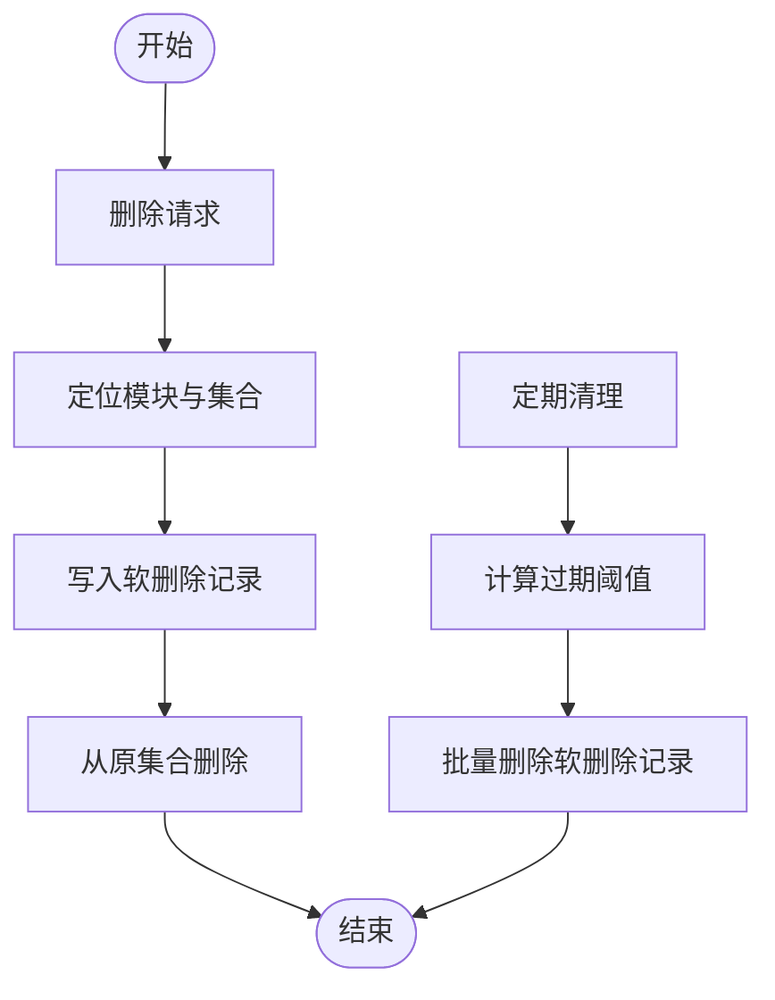
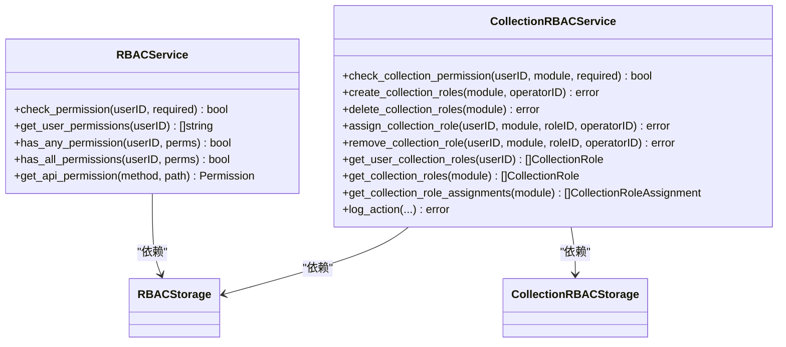
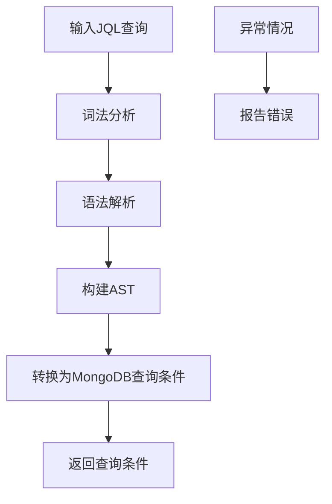
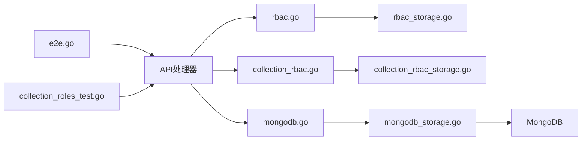

# 测试数据管理

<cite>
**本文档引用的文件**
- [test/README.md](file://test/README.md)
- [test/e2e.go](file://test/e2e.go)
- [test/collection_roles_test.go](file://test/collection_roles_test.go)
- [internal/models/models.go](file://internal/models/models.go)
- [internal/storage/mongodb.go](file://internal/storage/mongodb.go)
- [internal/storage/mongodb_storage.go](file://internal/storage/mongodb_storage.go)
- [internal/storage/rbac_storage.go](file://internal/storage/rbac_storage.go)
- [internal/storage/collection_rbac_storage.go](file://internal/storage/collection_rbac_storage.go)
- [pkg/rbac/rbac.go](file://pkg/rbac/rbac.go)
- [pkg/rbac/collection_rbac.go](file://pkg/rbac/collection_rbac.go)
- [pkg/jql/parser_test.go](file://pkg/jql/parser_test.go)
- [internal/auth/test/jwt_test.go](file://internal/auth/test/jwt_test.go)
- [cmd/server/main.go](file://cmd/server/main.go)
- [configs/config.yaml](file://configs/config.yaml)
</cite>

## 目录
1. [引言](#引言)
2. [项目结构](#项目结构)
3. [核心组件](#核心组件)
4. [架构总览](#架构总览)
5. [详细组件分析](#详细组件分析)
6. [依赖关系分析](#依赖关系分析)
7. [性能考量](#性能考量)
8. [故障排除指南](#故障排除指南)
9. [结论](#结论)
10. [附录](#附录)

## 引言
本文件面向测试数据管理的完整解决方案，围绕测试数据生成脚本、生命周期管理、安全性与合规、版本与变更控制、共享与复用、质量保证以及自动化工具等方面进行系统化阐述。结合仓库中的测试脚本、模型定义、存储层、RBAC 权限体系与 JQL 查询解析器，构建一套可执行、可验证、可追溯、可扩展的测试数据管理体系。

## 项目结构
该项目采用分层架构与模块化组织方式：
- 命令行入口负责环境变量加载、日志初始化、存储与服务初始化、HTTP 服务器启动与优雅关闭
- 测试目录包含端到端测试脚本、集合角色测试与测试数据生成说明
- 内部包包含领域模型、存储抽象与实现、RBAC 服务与集合 RBAC 服务
- 配置文件提供数据库连接、JWT 密钥与服务器参数

**图表来源**
- [cmd/server/main.go:24-150](file://cmd/server/main.go#L24-L150)
- [test/e2e.go:33-150](file://test/e2e.go#L33-L150)
- [test/collection_roles_test.go:13-106](file://test/collection_roles_test.go#L13-L106)
- [internal/storage/mongodb.go:14-90](file://internal/storage/mongodb.go#L14-L90)
- [internal/storage/mongodb_storage.go:16-51](file://internal/storage/mongodb_storage.go#L16-L51)
- [internal/storage/rbac_storage.go:16-50](file://internal/storage/rbac_storage.go#L16-L50)
- [internal/storage/collection_rbac_storage.go:15-33](file://internal/storage/collection_rbac_storage.go#L15-L33)
- [pkg/rbac/rbac.go:55-61](file://pkg/rbac/rbac.go#L55-L61)
- [pkg/rbac/collection_rbac.go:27-37](file://pkg/rbac/collection_rbac.go#L27-L37)
- [pkg/jql/parser_test.go:10-202](file://pkg/jql/parser_test.go#L10-L202)
- [internal/auth/test/jwt_test.go:10-108](file://internal/auth/test/jwt_test.go#L10-L108)
- [configs/config.yaml:1-26](file://configs/config.yaml#L1-L26)

**章节来源**
- [cmd/server/main.go:24-150](file://cmd/server/main.go#L24-L150)
- [configs/config.yaml:1-26](file://configs/config.yaml#L1-L26)

## 核心组件
- 测试数据生成与验证
  - 端到端测试脚本覆盖用户、角色、权限、集合、字段、刮削任务与业务数据的全链路流程
  - 集合角色测试验证集合级权限与角色的创建、分配与校验
  - 测试数据生成说明文档提供脚本功能、执行方法与脚本结构
- 数据模型与约束
  - 统一的业务模型定义（用户、权限、角色、集合、字段、业务数据、刮削任务、审计日志）
  - 字段验证器支持多种数据类型与约束（必填、范围、枚举、正则、数组长度等）
- 存储抽象与实现
  - 存储接口定义了用户、权限、角色、集合、字段、业务数据、刮削任务、软删除数据等 CRUD 与查询能力
  - MongoDB 实现提供动态集合、索引、软删除与回收站等能力
- RBAC 与集合 RBAC
  - 系统级 RBAC 提供权限检查、角色分配、权限聚合
  - 集合级 RBAC 提供模块化权限模板、角色分配与审计日志
- 查询语言与安全
  - JQL 解析器支持复杂查询语法与函数，配合权限控制保障查询安全
- 认证与授权
  - JWT 测试验证 Token 生成、刷新与校验流程

**章节来源**
- [test/e2e.go:33-150](file://test/e2e.go#L33-L150)
- [test/collection_roles_test.go:13-106](file://test/collection_roles_test.go#L13-L106)
- [test/README.md:1-56](file://test/README.md#L1-L56)
- [internal/models/models.go:12-365](file://internal/models/models.go#L12-L365)
- [internal/storage/mongodb.go:14-90](file://internal/storage/mongodb.go#L14-L90)
- [internal/storage/mongodb_storage.go:16-51](file://internal/storage/mongodb_storage.go#L16-L51)
- [pkg/rbac/rbac.go:55-61](file://pkg/rbac/rbac.go#L55-L61)
- [pkg/rbac/collection_rbac.go:27-37](file://pkg/rbac/collection_rbac.go#L27-L37)
- [pkg/jql/parser_test.go:10-202](file://pkg/jql/parser_test.go#L10-L202)
- [internal/auth/test/jwt_test.go:10-108](file://internal/auth/test/jwt_test.go#L10-L108)

## 架构总览
下图展示测试数据管理在系统中的位置与交互关系：测试脚本通过 HTTP 接口与后端服务交互，后端服务依赖存储层与 RBAC 层，最终写入 MongoDB；同时，JQL 解析器与认证模块为查询与鉴权提供支撑。

**图表来源**
- [test/e2e.go:33-150](file://test/e2e.go#L33-L150)
- [test/collection_roles_test.go:13-106](file://test/collection_roles_test.go#L13-L106)
- [pkg/rbac/rbac.go:55-61](file://pkg/rbac/rbac.go#L55-L61)
- [pkg/rbac/collection_rbac.go:27-37](file://pkg/rbac/collection_rbac.go#L27-L37)
- [internal/storage/mongodb.go:14-90](file://internal/storage/mongodb.go#L14-L90)
- [internal/storage/mongodb_storage.go:16-51](file://internal/storage/mongodb_storage.go#L16-L51)
- [internal/storage/rbac_storage.go:16-50](file://internal/storage/rbac_storage.go#L16-L50)
- [internal/storage/collection_rbac_storage.go:15-33](file://internal/storage/collection_rbac_storage.go#L15-L33)

## 详细组件分析

### 测试数据生成与验证流程
- 端到端测试脚本
  - 步骤化验证：重置数据库、管理员登录、集合创建、字段定义、用户注册、角色分配、权限验证、刮削上传与执行、基础数据查询、JQL 高级查询、软删除与恢复
  - 使用统一的 HTTP 请求封装与断言，确保各阶段返回码与响应内容符合预期
- 集合角色测试
  - 验证集合角色创建、权限模板与角色分配的正确性
  - 清理测试数据，避免跨测试污染
- 测试数据生成说明
  - 明确生成内容：用户、权限、角色、集合、刮削任务与业务数据
  - 提供执行步骤与验证方法，便于快速部署与回归

**图表来源**
- [test/e2e.go:256-272](file://test/e2e.go#L256-L272)
- [test/e2e.go:282-322](file://test/e2e.go#L282-L322)
- [pkg/rbac/rbac.go:63-99](file://pkg/rbac/rbac.go#L63-L99)
- [pkg/rbac/collection_rbac.go:92-194](file://pkg/rbac/collection_rbac.go#L92-L194)
- [internal/storage/mongodb_storage.go:755-767](file://internal/storage/mongodb_storage.go#L755-L767)

**章节来源**
- [test/e2e.go:33-150](file://test/e2e.go#L33-L150)
- [test/collection_roles_test.go:13-106](file://test/collection_roles_test.go#L13-L106)
- [test/README.md:1-56](file://test/README.md#L1-L56)

### 数据模型与字段验证
- 数据模型
  - 用户、权限、角色、集合、字段定义、业务数据、刮削任务、软删除数据、审计日志等统一建模
  - 基础模型包含创建者、创建时间、更新者、更新时间字段，便于审计与追踪
- 字段验证器
  - 支持字符串、数值、布尔、日期、数组、对象等类型
  - 支持必填、最小/最大值、最小/最大长度、正则表达式、枚举、数组长度等约束
  - 返回结构化的验证结果，包含错误详情

**图表来源**
- [internal/models/models.go:12-365](file://internal/models/models.go#L12-L365)

**章节来源**
- [internal/models/models.go:12-365](file://internal/models/models.go#L12-L365)

### 存储层与数据生命周期
- 存储接口
  - 定义用户、权限、角色、集合、字段、业务数据、刮削任务、软删除数据等的 CRUD 与查询方法
  - 提供动态集合创建与索引管理能力
- MongoDB 实现
  - 用户、权限、角色、集合、字段、业务数据、刮削任务、软删除数据的持久化
  - 软删除与回收站：业务数据与刮削任务删除时写入软删除集合，并保留原始数据信息
  - 清理策略：按时间阈值清理软删除数据，释放存储空间
  - 动态集合：根据模块名动态创建集合，支持按模块隔离数据

**图表来源**
- [internal/storage/mongodb_storage.go:411-493](file://internal/storage/mongodb_storage.go#L411-L493)
- [internal/storage/mongodb_storage.go:648-686](file://internal/storage/mongodb_storage.go#L648-L686)
- [internal/storage/mongodb_storage.go:564-569](file://internal/storage/mongodb_storage.go#L564-L569)

**章节来源**
- [internal/storage/mongodb.go:14-90](file://internal/storage/mongodb.go#L14-L90)
- [internal/storage/mongodb_storage.go:16-51](file://internal/storage/mongodb_storage.go#L16-L51)
- [internal/storage/mongodb_storage.go:411-493](file://internal/storage/mongodb_storage.go#L411-L493)
- [internal/storage/mongodb_storage.go:648-686](file://internal/storage/mongodb_storage.go#L648-L686)
- [internal/storage/mongodb_storage.go:564-569](file://internal/storage/mongodb_storage.go#L564-L569)

### RBAC 权限与集合 RBAC
- 系统级 RBAC
  - 权限常量与 API 权限映射，支持通配符匹配
  - 用户权限聚合、角色分配、权限检查
- 集合级 RBAC
  - 模块化权限模板：读、写、删、管理、字段管理
  - 角色创建与分配同步至系统角色，支持审计日志
  - 用户集合角色查询与分配管理

**图表来源**
- [pkg/rbac/rbac.go:55-61](file://pkg/rbac/rbac.go#L55-L61)
- [pkg/rbac/rbac.go:63-99](file://pkg/rbac/rbac.go#L63-L99)
- [pkg/rbac/collection_rbac.go:27-37](file://pkg/rbac/collection_rbac.go#L27-L37)
- [pkg/rbac/collection_rbac.go:39-90](file://pkg/rbac/collection_rbac.go#L39-L90)

**章节来源**
- [pkg/rbac/rbac.go:55-61](file://pkg/rbac/rbac.go#L55-L61)
- [pkg/rbac/rbac.go:63-99](file://pkg/rbac/rbac.go#L63-L99)
- [pkg/rbac/collection_rbac.go:27-37](file://pkg/rbac/collection_rbac.go#L27-L37)
- [pkg/rbac/collection_rbac.go:92-194](file://pkg/rbac/collection_rbac.go#L92-L194)

### 查询语言与边界条件测试
- JQL 解析器
  - 支持相等、比较、逻辑运算、空值判断、IN/NOT IN、正则、函数（当前用户、时间区间等）
  - 边界条件覆盖：大小写不敏感关键字、嵌套字段、多层级路径、特殊字符、空查询、括号匹配等
- 测试覆盖
  - 大量单元测试用例验证解析结果与错误处理
  - 复杂查询组合与函数调用场景

**图表来源**
- [pkg/jql/parser_test.go:10-202](file://pkg/jql/parser_test.go#L10-L202)
- [pkg/jql/parser_test.go:204-265](file://pkg/jql/parser_test.go#L204-L265)
- [pkg/jql/parser_test.go:541-563](file://pkg/jql/parser_test.go#L541-L563)

**章节来源**
- [pkg/jql/parser_test.go:10-202](file://pkg/jql/parser_test.go#L10-L202)
- [pkg/jql/parser_test.go:204-265](file://pkg/jql/parser_test.go#L204-L265)
- [pkg/jql/parser_test.go:541-563](file://pkg/jql/parser_test.go#L541-L563)

### 安全性与合规
- 敏感数据保护
  - 用户密码采用哈希存储，测试中使用固定口令便于验证，生产需使用强口令与盐值
  - JWT 密钥与过期时间通过环境变量配置，避免硬编码
- 访问控制
  - 系统级 RBAC 与集合级 RBAC 双层权限控制，API 权限映射自动识别资源与动作
  - 审计日志记录关键操作，便于追踪与合规审计
- 数据泄露防护
  - 软删除与回收站机制，防止误删导致的数据丢失
  - 清理策略按时间阈值清理软删除数据，降低长期风险

**章节来源**
- [internal/auth/test/jwt_test.go:10-108](file://internal/auth/test/jwt_test.go#L10-L108)
- [configs/config.yaml:6-10](file://configs/config.yaml#L6-L10)
- [internal/storage/mongodb_storage.go:411-493](file://internal/storage/mongodb_storage.go#L411-L493)
- [internal/storage/mongodb_storage.go:564-569](file://internal/storage/mongodb_storage.go#L564-L569)
- [pkg/rbac/collection_rbac.go:280-293](file://pkg/rbac/collection_rbac.go#L280-L293)

### 版本管理与变更控制
- 配置驱动
  - 通过配置文件集中管理数据库连接、JWT 密钥、日志级别与服务器参数
  - 环境变量优先于默认值，便于不同环境差异化配置
- 迁移与初始化
  - 启动时初始化默认数据（系统权限、超级管理员角色与用户），确保测试环境一致性
- 变更追踪
  - 审计日志记录用户行为，便于回溯与审计

**章节来源**
- [configs/config.yaml:1-26](file://configs/config.yaml#L1-L26)
- [cmd/server/main.go:152-166](file://cmd/server/main.go#L152-L166)
- [internal/storage/rbac_storage.go:81-164](file://internal/storage/rbac_storage.go#L81-L164)
- [pkg/rbac/collection_rbac.go:280-293](file://pkg/rbac/collection_rbac.go#L280-L293)

### 共享与复用策略
- 模块化集合
  - 每个模块独立集合，支持字段定义与业务数据分离，便于跨模块复用字段模板
- 角色与权限模板
  - 集合级角色模板标准化权限集合，减少重复配置
- 测试脚本复用
  - 端到端测试脚本作为通用测试套件，可在不同环境快速复用

**章节来源**
- [internal/storage/mongodb_storage.go:338-347](file://internal/storage/mongodb_storage.go#L338-L347)
- [pkg/rbac/collection_rbac.go:92-194](file://pkg/rbac/collection_rbac.go#L92-L194)
- [test/e2e.go:33-150](file://test/e2e.go#L33-L150)

### 质量保证措施
- 数据完整性
  - 字段验证器覆盖多种数据类型与约束，确保写入数据符合定义
  - 软删除保留原始数据，便于恢复与审计
- 业务规则验证
  - 集合级角色权限模板明确读写删与字段管理边界
  - API 权限映射与 RBAC 检查确保资源访问合规
- 边界条件测试
  - JQL 解析器覆盖大小写、嵌套字段、函数、空值、IN/NOT IN 等边界场景
  - 端到端测试覆盖成功与失败场景（如无效 ID、重复注册）

**章节来源**
- [internal/models/models.go:73-221](file://internal/models/models.go#L73-L221)
- [pkg/rbac/collection_rbac.go:92-194](file://pkg/rbac/collection_rbac.go#L92-L194)
- [pkg/jql/parser_test.go:10-202](file://pkg/jql/parser_test.go#L10-L202)
- [test/e2e.go:542-571](file://test/e2e.go#L542-L571)

### 自动化管理工具与脚本
- 端到端测试脚本
  - 自动化执行测试步骤，断言返回码与响应内容，输出测试结果
- 集合角色测试
  - 单元测试验证集合角色创建与权限分配
- 启动与初始化
  - 服务器启动时自动初始化 RBAC 默认数据，确保测试环境可用

**章节来源**
- [test/e2e.go:33-150](file://test/e2e.go#L33-L150)
- [test/collection_roles_test.go:13-106](file://test/collection_roles_test.go#L13-L106)
- [cmd/server/main.go:60-63](file://cmd/server/main.go#L60-L63)

## 依赖关系分析
- 组件耦合
  - API 处理器依赖 RBAC 服务与集合 RBAC 服务，二者均依赖存储层
  - 存储层实现依赖 MongoDB 驱动，提供统一接口
- 外部依赖
  - MongoDB 驱动、Gin Web 框架、bcrypt 密码哈希库
- 循环依赖
  - 当前结构清晰，未发现循环依赖

**图表来源**
- [test/e2e.go:33-150](file://test/e2e.go#L33-L150)
- [test/collection_roles_test.go:13-106](file://test/collection_roles_test.go#L13-L106)
- [pkg/rbac/rbac.go:55-61](file://pkg/rbac/rbac.go#L55-L61)
- [pkg/rbac/collection_rbac.go:27-37](file://pkg/rbac/collection_rbac.go#L27-L37)
- [internal/storage/mongodb.go:14-90](file://internal/storage/mongodb.go#L14-L90)
- [internal/storage/mongodb_storage.go:16-51](file://internal/storage/mongodb_storage.go#L16-L51)
- [internal/storage/rbac_storage.go:16-50](file://internal/storage/rbac_storage.go#L16-L50)
- [internal/storage/collection_rbac_storage.go:15-33](file://internal/storage/collection_rbac_storage.go#L15-L33)

**章节来源**
- [test/e2e.go:33-150](file://test/e2e.go#L33-L150)
- [test/collection_roles_test.go:13-106](file://test/collection_roles_test.go#L13-L106)
- [pkg/rbac/rbac.go:55-61](file://pkg/rbac/rbac.go#L55-L61)
- [pkg/rbac/collection_rbac.go:27-37](file://pkg/rbac/collection_rbac.go#L27-L37)
- [internal/storage/mongodb.go:14-90](file://internal/storage/mongodb.go#L14-L90)
- [internal/storage/mongodb_storage.go:16-51](file://internal/storage/mongodb_storage.go#L16-L51)
- [internal/storage/rbac_storage.go:16-50](file://internal/storage/rbac_storage.go#L16-L50)
- [internal/storage/collection_rbac_storage.go:15-33](file://internal/storage/collection_rbac_storage.go#L15-L33)

## 性能考量
- 存储层
  - 动态集合与索引管理支持按模块隔离与查询优化
  - 软删除与回收站避免大表扫描，提升查询性能
- 查询层
  - JQL 解析器将自然语言查询转换为高效的 MongoDB 条件，减少应用层逻辑开销
- 并发与稳定性
  - Gin 框架与超时配置保障高并发下的稳定性
  - 优雅关闭机制避免请求中断

[本节为通用指导，无需特定文件分析]

## 故障排除指南
- 端到端测试失败
  - 检查 MongoDB 连接与数据库初始化状态
  - 核对返回码与响应内容，定位具体步骤失败原因
- 权限不足
  - 确认用户角色与权限分配，检查 API 权限映射
  - 验证集合级角色是否正确分配
- 查询异常
  - 使用 JQL 解析器的错误用例进行对比，确认语法问题
- 数据缺失或重复
  - 检查软删除与回收站数据，确认是否被清理
  - 验证字段验证器约束，排查数据类型与长度问题

**章节来源**
- [test/e2e.go:274-279](file://test/e2e.go#L274-L279)
- [pkg/rbac/rbac.go:63-99](file://pkg/rbac/rbac.go#L63-L99)
- [pkg/jql/parser_test.go:204-265](file://pkg/jql/parser_test.go#L204-L265)
- [internal/storage/mongodb_storage.go:564-569](file://internal/storage/mongodb_storage.go#L564-L569)

## 结论
本测试数据管理方案以测试脚本为核心，结合完善的模型定义、存储实现、RBAC 权限体系与 JQL 查询解析器，构建了从数据生成、验证、生命周期管理到安全与合规的完整闭环。通过模块化集合、角色模板与审计日志，实现了测试数据的可复用、可追溯与可维护，为持续集成与回归测试提供了坚实基础。

[本节为总结性内容，无需特定文件分析]

## 附录
- 测试数据生成说明
  - 覆盖用户、权限、角色、集合、刮削任务与业务数据的生成与验证流程
- 关键配置
  - 数据库连接、JWT 密钥、日志级别与服务器参数
- 启动流程
  - 环境变量加载、日志初始化、存储与服务初始化、HTTP 服务器启动与优雅关闭

**章节来源**
- [test/README.md:1-56](file://test/README.md#L1-L56)
- [configs/config.yaml:1-26](file://configs/config.yaml#L1-L26)
- [cmd/server/main.go:24-150](file://cmd/server/main.go#L24-L150)