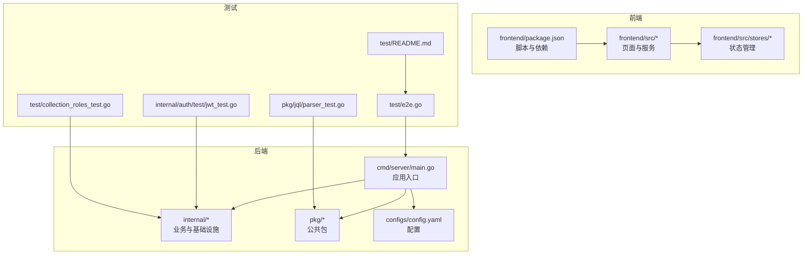
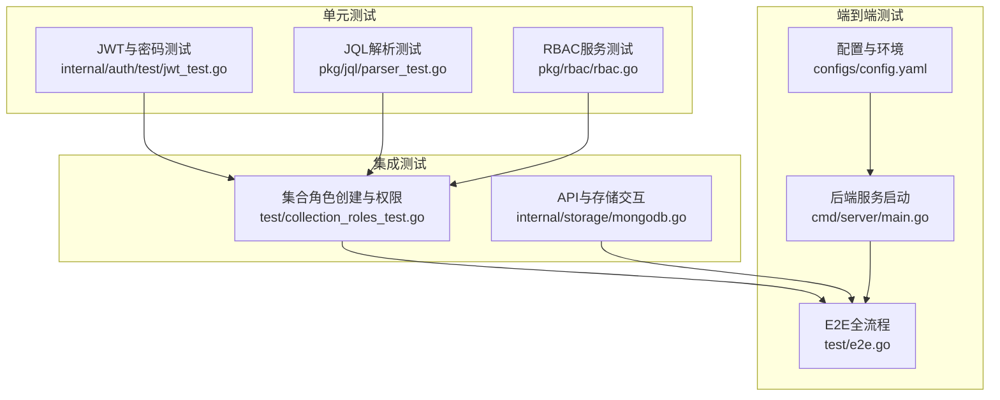
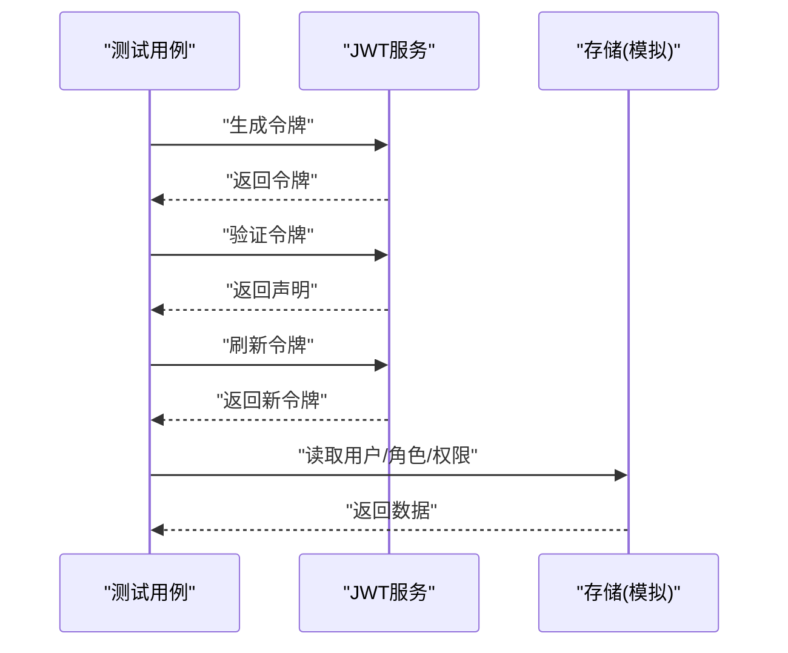
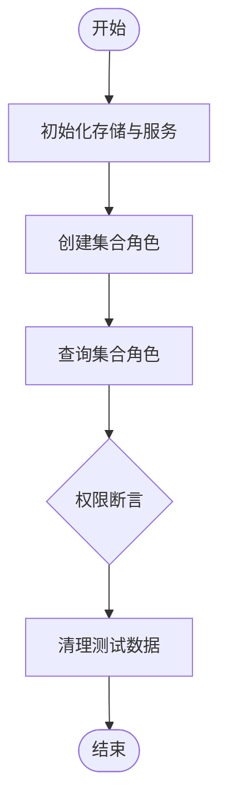
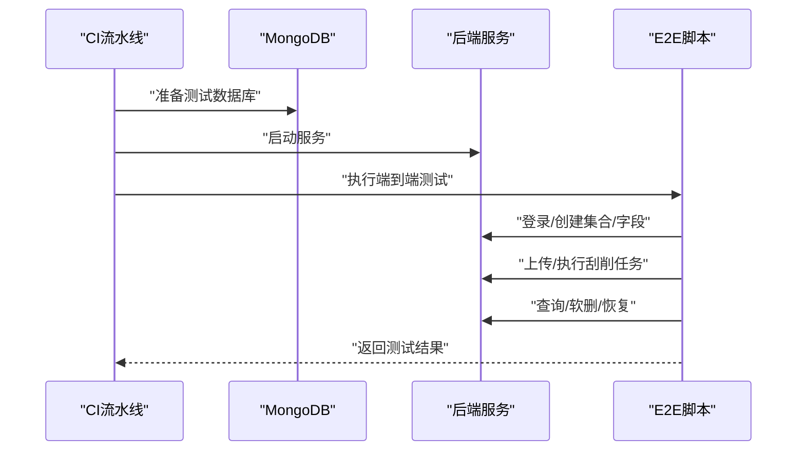
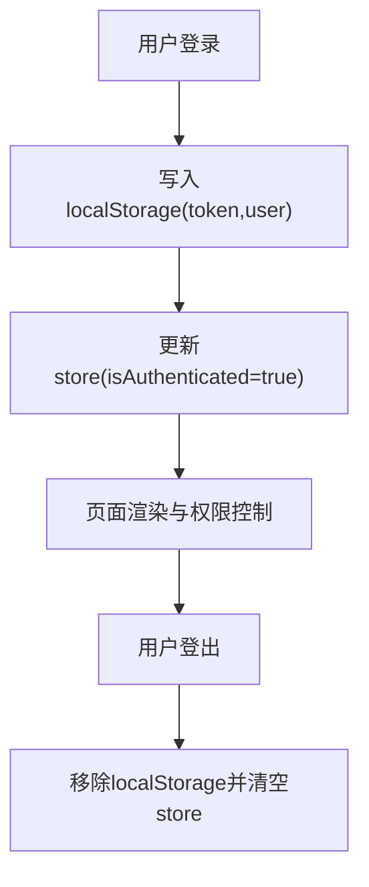
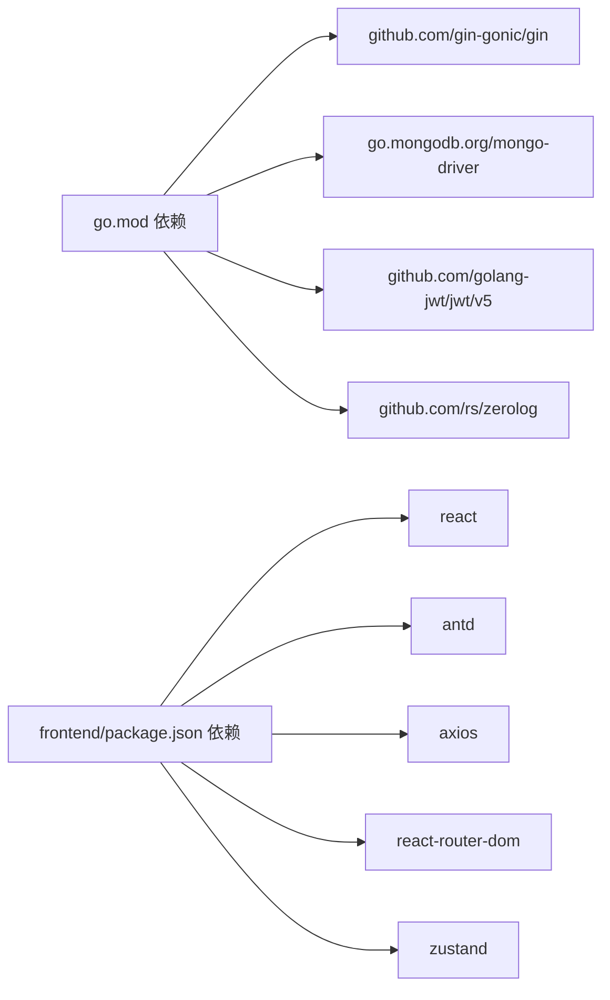

# 测试策略

<cite>
**本文引用的文件**
- [README.md](file://README.md)
- [go.mod](file://go.mod)
- [cmd/server/main.go](file://cmd/server/main.go)
- [configs/config.yaml](file://configs/config.yaml)
- [internal/auth/test/jwt_test.go](file://internal/auth/test/jwt_test.go)
- [pkg/jql/parser_test.go](file://pkg/jql/parser_test.go)
- [pkg/rbac/rbac.go](file://pkg/rbac/rbac.go)
- [internal/storage/mongodb.go](file://internal/storage/mongodb.go)
- [test/collection_roles_test.go](file://test/collection_roles_test.go)
- [test/e2e.go](file://test/e2e.go)
- [test/README.md](file://test/README.md)
- [frontend/src/stores/authStore.ts](file://frontend/src/stores/authStore.ts)
- [frontend/src/services/index.ts](file://frontend/src/services/index.ts)
- [frontend/package.json](file://frontend/package.json)
</cite>

## 目录
1. [引言](#引言)
2. [项目结构](#项目结构)
3. [核心组件](#核心组件)
4. [架构总览](#架构总览)
5. [详细组件分析](#详细组件分析)
6. [依赖分析](#依赖分析)
7. [性能考虑](#性能考虑)
8. [故障排查指南](#故障排查指南)
9. [结论](#结论)
10. [附录](#附录)

## 引言
本测试策略文档面向数据中心项目，围绕测试金字塔（单元测试、集成测试、端到端测试）制定系统化测试方案，覆盖后端Go语言与前端React生态，明确测试数据管理、持续集成与自动化测试配置，以及测试覆盖率与质量门禁建议。目标是提升代码质量、保障功能正确性与可维护性，并为CI流水线提供可执行的规范。

## 项目结构
项目采用前后端分离架构：
- 后端：Go + Gin + MongoDB，模块化组织于 internal、pkg、cmd/server 等目录
- 前端：React 18 + TypeScript + Vite + Zustand + Ant Design
- 测试：后端使用标准库 testing；集成测试与端到端测试位于 test/ 目录；前端测试通过 package.json 中的脚本触发

图表来源
- [cmd/server/main.go:1-167](file://cmd/server/main.go#L1-L167)
- [configs/config.yaml:1-26](file://configs/config.yaml#L1-L26)
- [internal/auth/test/jwt_test.go:1-108](file://internal/auth/test/jwt_test.go#L1-L108)
- [pkg/jql/parser_test.go:1-800](file://pkg/jql/parser_test.go#L1-L800)
- [test/collection_roles_test.go:1-129](file://test/collection_roles_test.go#L1-L129)
- [test/e2e.go:1-745](file://test/e2e.go#L1-L745)
- [test/README.md:1-56](file://test/README.md#L1-L56)
- [frontend/src/stores/authStore.ts:1-61](file://frontend/src/stores/authStore.ts#L1-L61)
- [frontend/src/services/index.ts:1-6](file://frontend/src/services/index.ts#L1-L6)
- [frontend/package.json:1-29](file://frontend/package.json#L1-L29)

章节来源
- [README.md:22-188](file://README.md#L22-L188)
- [go.mod:1-50](file://go.mod#L1-L50)
- [cmd/server/main.go:1-167](file://cmd/server/main.go#L1-L167)
- [configs/config.yaml:1-26](file://configs/config.yaml#L1-L26)
- [frontend/package.json:1-29](file://frontend/package.json#L1-L29)

## 核心组件
- 认证与授权（JWT、RBAC）
  - JWT服务与密码哈希校验的单元测试覆盖
  - RBAC服务的权限检查、权限集合计算与API权限映射
- 查询语言（JQL）
  - 解析器的正向与边界用例、错误用例、函数支持与嵌套字段解析
- 存储层（MongoDB）
  - 统一存储接口定义，涵盖用户、字段、业务数据、权限、角色、刮削任务等
- 集成测试（集合角色）
  - 集合级RBAC角色创建与权限校验
- 端到端测试（E2E）
  - 从数据库重置、管理员登录、集合与字段创建、用户与角色、刮削上传与执行、查询与软删恢复全流程

章节来源
- [internal/auth/test/jwt_test.go:1-108](file://internal/auth/test/jwt_test.go#L1-L108)
- [pkg/rbac/rbac.go:1-250](file://pkg/rbac/rbac.go#L1-L250)
- [pkg/jql/parser_test.go:1-800](file://pkg/jql/parser_test.go#L1-L800)
- [internal/storage/mongodb.go:1-91](file://internal/storage/mongodb.go#L1-L91)
- [test/collection_roles_test.go:1-129](file://test/collection_roles_test.go#L1-L129)
- [test/e2e.go:1-745](file://test/e2e.go#L1-L745)

## 架构总览
下图展示测试金字塔在本项目中的落地方式：单元测试聚焦核心算法与服务；集成测试验证模块间协作与外部依赖；端到端测试覆盖真实用户路径。

图表来源
- [internal/auth/test/jwt_test.go:1-108](file://internal/auth/test/jwt_test.go#L1-L108)
- [pkg/jql/parser_test.go:1-800](file://pkg/jql/parser_test.go#L1-L800)
- [pkg/rbac/rbac.go:1-250](file://pkg/rbac/rbac.go#L1-L250)
- [test/collection_roles_test.go:1-129](file://test/collection_roles_test.go#L1-L129)
- [internal/storage/mongodb.go:1-91](file://internal/storage/mongodb.go#L1-L91)
- [test/e2e.go:1-745](file://test/e2e.go#L1-L745)
- [cmd/server/main.go:1-167](file://cmd/server/main.go#L1-L167)
- [configs/config.yaml:1-26](file://configs/config.yaml#L1-L26)

## 详细组件分析

### 单元测试：Go语言实现
- 测试文件组织
  - 后端测试按功能模块存放，如认证测试位于 internal/auth/test/
  - JQL解析器与RBAC服务分别提供独立测试文件
- Mock与断言策略
  - 使用标准库 testing 的错误报告与断言
  - 对JWT服务进行生成、验证、刷新的完整链路测试
  - 对JQL解析器进行正向、边界、错误、函数与嵌套字段的全面覆盖
  - 对RBAC服务进行权限匹配、通配符匹配与API权限映射测试
- 复杂度与性能
  - 单元测试以快速反馈为主，避免外部依赖，复杂度主要体现在解析器的状态机与RBAC的权限树遍历

图表来源
- [internal/auth/test/jwt_test.go:10-79](file://internal/auth/test/jwt_test.go#L10-L79)

章节来源
- [internal/auth/test/jwt_test.go:1-108](file://internal/auth/test/jwt_test.go#L1-L108)
- [pkg/jql/parser_test.go:1-800](file://pkg/jql/parser_test.go#L1-L800)
- [pkg/rbac/rbac.go:63-171](file://pkg/rbac/rbac.go#L63-L171)

### 集成测试：API、数据库与外部服务
- 设计思路
  - 通过 test/collection_roles_test.go 验证集合级RBAC角色创建与权限继承
  - 使用MongoDB连接与存储接口，确保服务层与存储层协作正确
- 关键流程
  - 初始化RBAC与集合RBAC存储
  - 创建集合角色并断言权限集合
  - 清理测试数据，保证环境隔离

图表来源
- [test/collection_roles_test.go:13-106](file://test/collection_roles_test.go#L13-L106)

章节来源
- [test/collection_roles_test.go:1-129](file://test/collection_roles_test.go#L1-L129)
- [internal/storage/mongodb.go:14-91](file://internal/storage/mongodb.go#L14-L91)

### 端到端测试：用户场景与自动化
- 实施方案
  - test/e2e.go 提供完整用户旅程：数据库重置、管理员登录、集合与字段创建、用户与角色、刮削上传与执行、查询与软删恢复
  - 通过HTTP客户端直接调用后端API，断言状态码与响应内容
- 自动化流程
  - CI中先启动后端服务与MongoDB，再执行E2E脚本
  - 使用独立测试数据库与环境变量隔离

图表来源
- [test/e2e.go:33-150](file://test/e2e.go#L33-L150)
- [cmd/server/main.go:24-150](file://cmd/server/main.go#L24-L150)

章节来源
- [test/e2e.go:1-745](file://test/e2e.go#L1-L745)
- [test/README.md:1-56](file://test/README.md#L1-L56)
- [configs/config.yaml:1-26](file://configs/config.yaml#L1-L26)

### 前端测试：组件、状态与交互
- 状态管理测试
  - 使用Zustand的useAuthStore管理登录状态、用户信息与本地持久化
  - 可通过模拟API调用与断言状态变化进行单元测试
- 服务层测试
  - services/index.ts导出各业务服务，可在测试中注入mock实现
- 交互测试
  - 建议结合Vitest或React Testing Library进行组件渲染、事件触发与状态断言
- 覆盖范围
  - 登录/登出流程、用户信息更新、密码修改（模拟）、路由守卫与权限控制

图表来源
- [frontend/src/stores/authStore.ts:15-46](file://frontend/src/stores/authStore.ts#L15-L46)

章节来源
- [frontend/src/stores/authStore.ts:1-61](file://frontend/src/stores/authStore.ts#L1-L61)
- [frontend/src/services/index.ts:1-6](file://frontend/src/services/index.ts#L1-L6)
- [frontend/package.json:1-29](file://frontend/package.json#L1-L29)

## 依赖分析
- 后端依赖
  - Gin、MongoDB驱动、JWT、日志与dotenv等
- 前端依赖
  - React、Ant Design、Axios、React Router、Zustand、Vite
- 测试依赖
  - Go标准库testing；E2E依赖HTTP客户端与MongoDB驱动

图表来源
- [go.mod:5-14](file://go.mod#L5-L14)
- [frontend/package.json:12-27](file://frontend/package.json#L12-L27)

章节来源
- [go.mod:1-50](file://go.mod#L1-L50)
- [frontend/package.json:1-29](file://frontend/package.json#L1-L29)

## 性能考虑
- 单元测试
  - 避免网络与磁盘IO，优先使用内存数据结构与模拟对象
- 集成测试
  - 使用独立测试数据库实例，批量插入后一次性清理，减少重复初始化成本
- 端到端测试
  - 并发执行独立场景，缩短整体耗时；对慢API增加超时与重试策略
- 前端测试
  - 使用轻量渲染与虚拟DOM，避免真实网络请求；必要时使用拦截器mock

## 故障排查指南
- 后端测试失败
  - 检查环境变量与配置文件是否正确加载
  - 确认MongoDB服务可用与连接参数正确
- 集成测试失败
  - 核查存储初始化顺序与默认数据是否成功写入
  - 断言前先查询数据库确认数据存在
- 端到端测试失败
  - 查看E2E脚本的HTTP状态码与响应体
  - 确保服务端口与基地址一致，且CORS配置允许测试客户端
- 前端测试失败
  - 检查Zustand store初始化与本地存储状态
  - 确认服务层mock实现与期望行为一致

章节来源
- [configs/config.yaml:1-26](file://configs/config.yaml#L1-L26)
- [cmd/server/main.go:24-150](file://cmd/server/main.go#L24-L150)
- [test/e2e.go:233-279](file://test/e2e.go#L233-L279)
- [frontend/src/stores/authStore.ts:15-46](file://frontend/src/stores/authStore.ts#L15-L46)

## 结论
本测试策略以测试金字塔为核心，结合项目实际技术栈与模块职责，形成“单元—集成—端到端—前端”的分层测试体系。通过明确的测试数据管理、环境隔离与自动化流程，可显著提升交付质量与回归效率。建议在CI中强制执行覆盖率阈值与质量门禁，持续优化测试矩阵。

## 附录

### 测试数据管理策略
- 隔离与一致性
  - 使用独立测试数据库与专用测试用户
  - 在测试开始前重置数据，在结束后清理
- 自动生成
  - 参考 test/README.md 的脚本思路，按模块生成最小可用数据集
- 端到端数据
  - E2E脚本内置数据库重置与管理员种子数据，确保可重复执行

章节来源
- [test/README.md:1-56](file://test/README.md#L1-L56)
- [test/e2e.go:152-231](file://test/e2e.go#L152-L231)

### 持续集成与自动化测试配置建议
- 后端
  - 使用 go test ./... 执行单元与集成测试
  - 在CI中先启动MongoDB容器，再启动后端服务，最后执行E2E
- 前端
  - 使用 npm test 或相应测试脚本
  - 建议在CI中设置覆盖率阈值（见下一节）

### 测试覆盖率与质量门禁
- 覆盖率要求（建议）
  - 单元测试：关键路径与分支覆盖率不低于80%
  - 集成测试：核心模块接口覆盖率不低于70%
  - 端到端测试：关键用户路径覆盖率不低于60%
- 质量门禁
  - 未达阈值的PR禁止合并
  - E2E失败需阻断发布