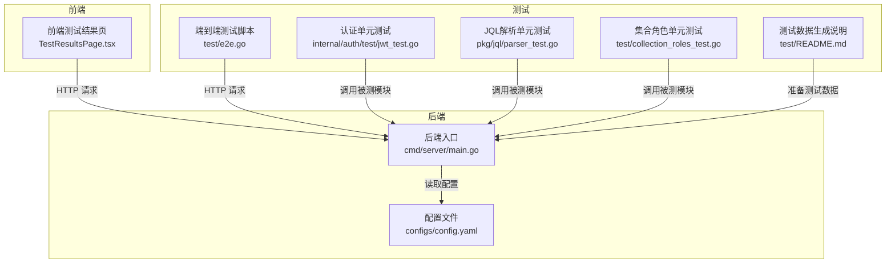
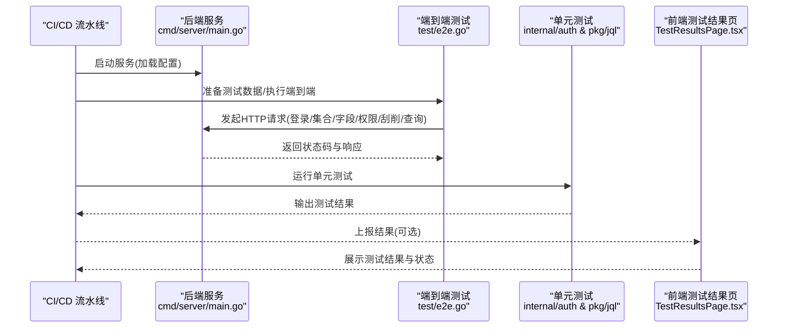
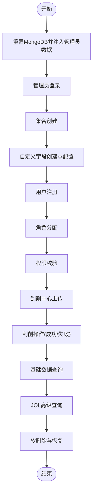
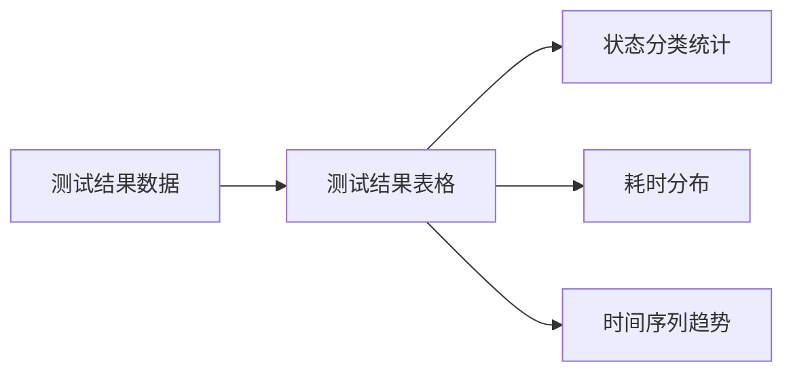
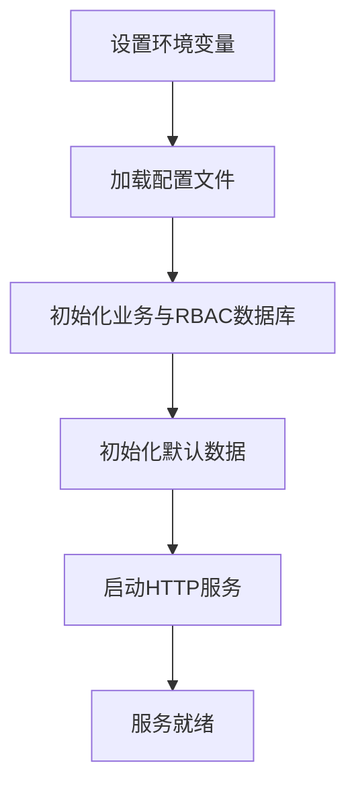
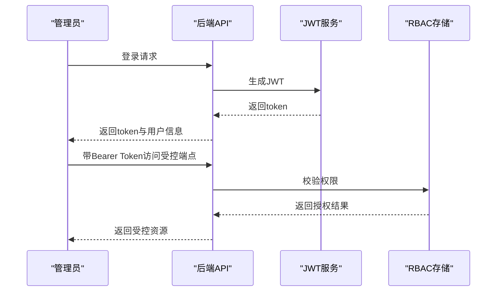
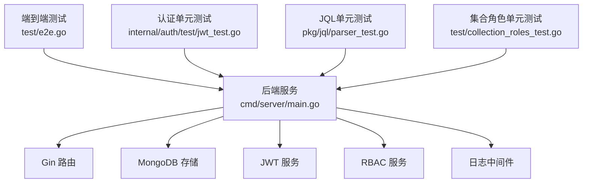

# 测试自动化

<cite>
**本文引用的文件**
- [test/README.md](file://test/README.md)
- [test/e2e.go](file://test/e2e.go)
- [test/collection_roles_test.go](file://test/collection_roles_test.go)
- [internal/auth/test/jwt_test.go](file://internal/auth/test/jwt_test.go)
- [pkg/jql/parser_test.go](file://pkg/jql/parser_test.go)
- [cmd/server/main.go](file://cmd/server/main.go)
- [configs/config.yaml](file://configs/config.yaml)
- [go.mod](file://go.mod)
- [frontend/src/pages/Admin/TestResultsPage.tsx](file://frontend/src/pages/Admin/TestResultsPage.tsx)
</cite>

## 目录
1. [引言](#引言)
2. [项目结构](#项目结构)
3. [核心组件](#核心组件)
4. [架构总览](#架构总览)
5. [详细组件分析](#详细组件分析)
6. [依赖分析](#依赖分析)
7. [性能考虑](#性能考虑)
8. [故障排查指南](#故障排查指南)
9. [结论](#结论)
10. [附录](#附录)

## 引言
本指南面向在持续集成环境下实施测试自动化的工程团队，结合仓库现有测试脚本与单元测试，系统性地给出测试自动化配置、执行策略、失败处理、脚本编写与维护、报告与分析、环境部署、工具链集成以及性能优化的最佳实践。文档同时提供可视化图示，帮助非技术读者理解整体流程与关键路径。

## 项目结构
该项目采用后端 Go + 前端 React 的分层架构，测试覆盖包括：
- 单元测试：认证模块、JQL 解析器等
- 集成/端到端测试：基于 HTTP API 的完整业务流程
- 测试数据准备：一键生成测试数据以支撑端到端测试
- 前端测试结果展示：可视化呈现测试结果与状态

**图表来源**
- [cmd/server/main.go:24-150](file://cmd/server/main.go#L24-L150)
- [configs/config.yaml:1-26](file://configs/config.yaml#L1-L26)
- [test/e2e.go:33-150](file://test/e2e.go#L33-L150)
- [internal/auth/test/jwt_test.go:10-107](file://internal/auth/test/jwt_test.go#L10-L107)
- [pkg/jql/parser_test.go:10-202](file://pkg/jql/parser_test.go#L10-L202)
- [test/collection_roles_test.go:13-106](file://test/collection_roles_test.go#L13-L106)
- [test/README.md:1-56](file://test/README.md#L1-L56)

**章节来源**
- [cmd/server/main.go:24-150](file://cmd/server/main.go#L24-L150)
- [configs/config.yaml:1-26](file://configs/config.yaml#L1-L26)
- [test/README.md:1-56](file://test/README.md#L1-L56)

## 核心组件
- 端到端测试脚本：通过 HTTP 客户端驱动后端 API，覆盖集合管理、字段定义、用户与角色、权限校验、刮削任务上传与操作、基础与高级查询、软删除与恢复等关键路径。
- 单元测试：认证模块 JWT 服务与密码哈希；JQL 查询解析器；集合 RBAC 角色创建。
- 测试数据生成：一键创建用户、角色、权限、集合、刮削任务及业务数据，便于端到端测试复现。
- 前端测试结果页：展示测试结果、状态、耗时与时间戳，并支持触发运行与刷新。

**章节来源**
- [test/e2e.go:33-150](file://test/e2e.go#L33-L150)
- [internal/auth/test/jwt_test.go:10-107](file://internal/auth/test/jwt_test.go#L10-L107)
- [pkg/jql/parser_test.go:10-202](file://pkg/jql/parser_test.go#L10-L202)
- [test/collection_roles_test.go:13-106](file://test/collection_roles_test.go#L13-L106)
- [test/README.md:1-56](file://test/README.md#L1-L56)
- [frontend/src/pages/Admin/TestResultsPage.tsx:131-273](file://frontend/src/pages/Admin/TestResultsPage.tsx#L131-L273)

## 架构总览
下图展示了测试自动化在 CI/CD 中的典型执行路径：本地或流水线中启动后端服务，准备测试数据，执行端到端与单元测试，收集结果并通过前端页面或日志输出。

**图表来源**
- [cmd/server/main.go:24-150](file://cmd/server/main.go#L24-L150)
- [test/e2e.go:233-272](file://test/e2e.go#L233-L272)
- [internal/auth/test/jwt_test.go:10-107](file://internal/auth/test/jwt_test.go#L10-L107)
- [pkg/jql/parser_test.go:10-202](file://pkg/jql/parser_test.go#L10-L202)
- [frontend/src/pages/Admin/TestResultsPage.tsx:186-273](file://frontend/src/pages/Admin/TestResultsPage.tsx#L186-L273)

## 详细组件分析

### 端到端测试执行策略与失败处理
- 分步执行：重置数据库并注入管理员数据 → 管理员登录 → 集合创建 → 字段创建 → 用户注册 → 角色分配 → 权限校验 → 刮削上传与操作 → 基础与 JQL 查询 → 软删除与恢复。
- 失败即停：任一步骤返回错误则立即终止后续步骤，打印失败原因，保证问题快速暴露。
- 状态断言：统一的状态码断言函数确保 API 行为符合预期。
- 数据清理：每轮测试前清空集合，确保测试隔离。

**图表来源**
- [test/e2e.go:43-150](file://test/e2e.go#L43-L150)
- [test/e2e.go:274-279](file://test/e2e.go#L274-L279)

**章节来源**
- [test/e2e.go:43-150](file://test/e2e.go#L43-L150)
- [test/e2e.go:274-279](file://test/e2e.go#L274-L279)

### 自动化测试脚本编写与维护
- 参数化与数据驱动：端到端脚本通过结构化载荷构造请求体，便于扩展不同场景；JQL 单元测试使用多组测试用例覆盖各种语法与边界。
- BDD 方法：通过“测试步骤”和“期望结果”的方式组织测试逻辑，便于评审与回归。
- 维护建议：
  - 将公共请求封装为可复用函数，减少重复代码。
  - 使用环境变量控制服务地址、超时与凭据，提升跨环境一致性。
  - 对关键 API 响应进行结构化断言，避免仅依赖状态码。

**章节来源**
- [test/e2e.go:233-272](file://test/e2e.go#L233-L272)
- [pkg/jql/parser_test.go:10-202](file://pkg/jql/parser_test.go#L10-L202)

### 测试报告生成与分析
- 前端展示：测试结果页以表格形式展示测试名称、状态、消息、耗时与时间戳，并按状态着色。
- 结果统计：可统计通过/失败/等待数量，辅助趋势分析。
- 质量度量：结合覆盖率与失败率，评估回归风险。

**图表来源**
- [frontend/src/pages/Admin/TestResultsPage.tsx:131-235](file://frontend/src/pages/Admin/TestResultsPage.tsx#L131-L235)

**章节来源**
- [frontend/src/pages/Admin/TestResultsPage.tsx:131-273](file://frontend/src/pages/Admin/TestResultsPage.tsx#L131-L273)

### 测试环境自动化部署与配置
- 服务启动：后端入口从环境变量读取日志、数据库、JWT、服务器等配置，支持本地与容器化部署。
- 配置文件：YAML 提供默认值，便于在不同环境切换。
- 测试数据准备：脚本说明提供启动 MongoDB、运行脚本与验证数据的步骤，确保测试前置条件一致。

**图表来源**
- [cmd/server/main.go:24-95](file://cmd/server/main.go#L24-L95)
- [configs/config.yaml:1-26](file://configs/config.yaml#L1-L26)

**章节来源**
- [cmd/server/main.go:24-95](file://cmd/server/main.go#L24-L95)
- [configs/config.yaml:1-26](file://configs/config.yaml#L1-L26)
- [test/README.md:26-46](file://test/README.md#L26-L46)

### 测试工具链集成与优化
- 测试框架：Go 内置 testing 包，配合 HTTP 客户端与 MongoDB 驱动。
- 报告与监控：前端页面承担结果展示；建议在 CI 中集成测试报告归档与通知。
- 依赖管理：go.mod 明确第三方库，确保构建一致性。

**章节来源**
- [go.mod:1-50](file://go.mod#L1-L50)
- [frontend/src/pages/Admin/TestResultsPage.tsx:186-273](file://frontend/src/pages/Admin/TestResultsPage.tsx#L186-L273)

### 认证与权限相关测试
- JWT 服务：验证令牌生成、刷新与校验，确保权限控制链路正确。
- 权限校验：端到端测试中验证未认证访问被拒绝、管理员可访问特权端点。
- 集合角色：单元测试验证集合级角色创建与权限分配。

**图表来源**
- [internal/auth/test/jwt_test.go:10-79](file://internal/auth/test/jwt_test.go#L10-L79)
- [test/e2e.go:256-272](file://test/e2e.go#L256-L272)
- [test/collection_roles_test.go:33-105](file://test/collection_roles_test.go#L33-L105)

**章节来源**
- [internal/auth/test/jwt_test.go:10-107](file://internal/auth/test/jwt_test.go#L10-L107)
- [test/e2e.go:476-502](file://test/e2e.go#L476-L502)
- [test/collection_roles_test.go:13-106](file://test/collection_roles_test.go#L13-L106)

### JQL 查询解析测试
- 覆盖范围：相等、比较、正则、IN/NOT IN、NULL/NOT NULL、布尔、函数(CurrentUser/Now/StartOfDay/... )、嵌套字段、括号优先级、大小写不敏感关键字等。
- 边界与错误：字符串未闭合、括号不匹配、缺失操作符/值、空字段名、IN 缺失括号等。
- 状态隔离：解析器实例多次解析互不影响。

**章节来源**
- [pkg/jql/parser_test.go:10-202](file://pkg/jql/parser_test.go#L10-L202)
- [pkg/jql/parser_test.go:204-265](file://pkg/jql/parser_test.go#L204-L265)
- [pkg/jql/parser_test.go:267-336](file://pkg/jql/parser_test.go#L267-L336)
- [pkg/jql/parser_test.go:338-539](file://pkg/jql/parser_test.go#L338-L539)
- [pkg/jql/parser_test.go:541-563](file://pkg/jql/parser_test.go#L541-L563)

## 依赖分析
- 后端服务依赖 Gin 路由、MongoDB 存储、JWT 服务、RBAC 服务与日志中间件。
- 测试依赖后端提供的 HTTP 接口与数据库状态。
- 前端依赖后端返回的测试结果数据，负责可视化展示。

**图表来源**
- [cmd/server/main.go:13-95](file://cmd/server/main.go#L13-L95)
- [test/e2e.go:3-18](file://test/e2e.go#L3-L18)
- [internal/auth/test/jwt_test.go:3-8](file://internal/auth/test/jwt_test.go#L3-L8)
- [pkg/jql/parser_test.go:3-8](file://pkg/jql/parser_test.go#L3-L8)
- [test/collection_roles_test.go:3-11](file://test/collection_roles_test.go#L3-L11)

**章节来源**
- [cmd/server/main.go:13-95](file://cmd/server/main.go#L13-L95)
- [go.mod:5-14](file://go.mod#L5-L14)

## 性能考虑
- 并行测试执行：在无共享状态的前提下，将独立测试用例并行化，缩短流水线时长。
- 资源调度优化：为数据库与后端服务预留充足资源，避免并发测试导致的超时。
- 超时与重试：合理设置 HTTP 客户端超时与重试策略，平衡稳定性与速度。
- 前端渲染优化：对大量测试结果进行分页或虚拟滚动，降低渲染压力。

[本节为通用指导，无需特定文件来源]

## 故障排查指南
- 端到端失败定位：检查每一步的 HTTP 状态码与响应内容，确认登录、权限与数据准备是否成功。
- 数据库连接：确保 MongoDB 正常运行且端口可达；必要时检查连接 URI 与数据库名。
- 环境变量：核对后端启动所需的环境变量，如日志级别、数据库 URI、JWT 密钥与过期时间。
- 前端结果异常：确认后端返回的数据格式与前端解析逻辑一致，检查网络请求与 CORS 设置。

**章节来源**
- [test/e2e.go:274-279](file://test/e2e.go#L274-L279)
- [cmd/server/main.go:24-95](file://cmd/server/main.go#L24-L95)
- [frontend/src/pages/Admin/TestResultsPage.tsx:186-273](file://frontend/src/pages/Admin/TestResultsPage.tsx#L186-L273)

## 结论
通过将端到端测试、单元测试与前端结果展示有机结合，并配合清晰的失败处理与环境配置，可在 CI/CD 中实现稳定高效的测试自动化。建议持续完善测试用例覆盖面、引入并行执行与资源调度优化，并建立完善的报告与趋势分析体系，以保障系统质量与交付效率。

[本节为总结性内容，无需特定文件来源]

## 附录
- 测试数据生成：参考测试脚本说明，确保测试前置数据完整可用。
- 配置项参考：后端入口与配置文件中的关键键位，便于在不同环境调整。

**章节来源**
- [test/README.md:1-56](file://test/README.md#L1-L56)
- [configs/config.yaml:1-26](file://configs/config.yaml#L1-L26)