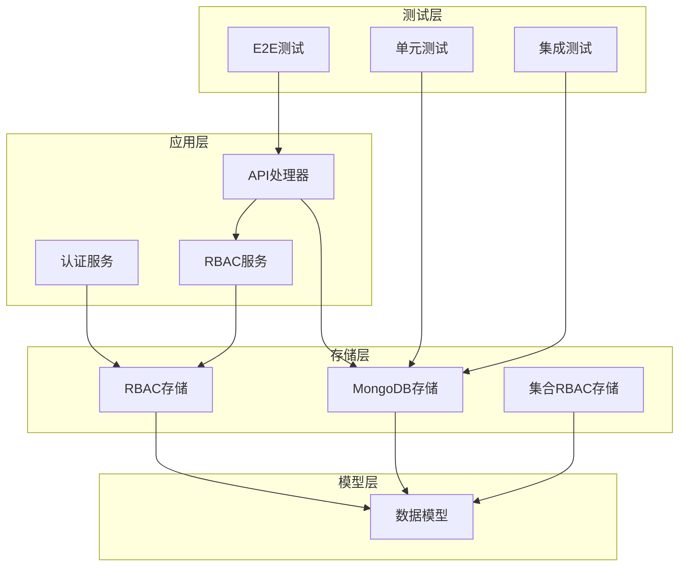
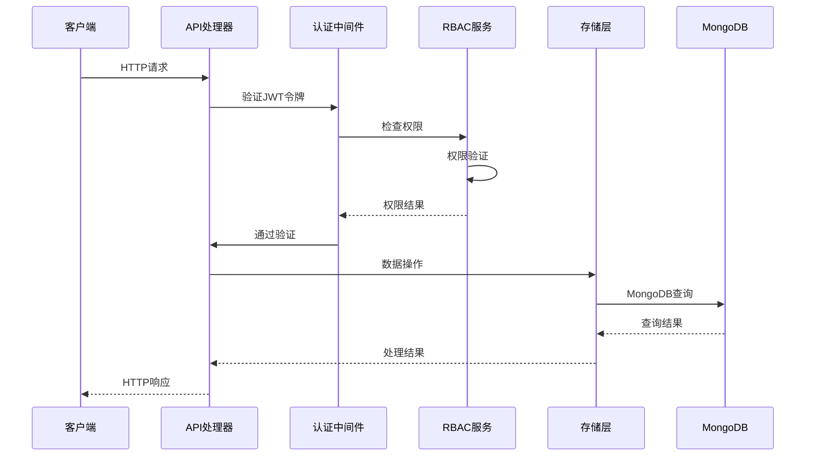
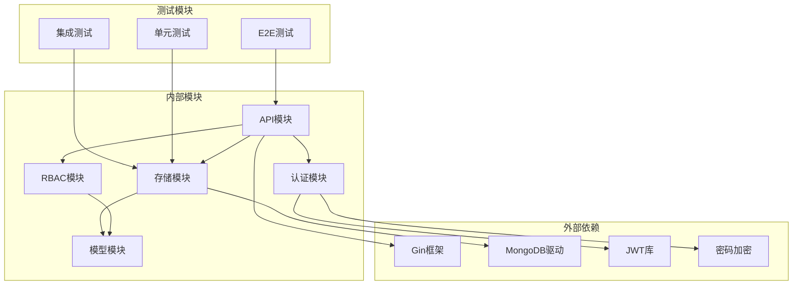

# 集成测试

<cite>
**本文档引用的文件**
- [test/README.md](file://test/README.md)
- [test/e2e.go](file://test/e2e.go)
- [test/collection_roles_test.go](file://test/collection_roles_test.go)
- [internal/storage/mongodb.go](file://internal/storage/mongodb.go)
- [internal/storage/mongodb_storage.go](file://internal/storage/mongodb_storage.go)
- [internal/api/handlers.go](file://internal/api/handlers.go)
- [internal/models/models.go](file://internal/models/models.go)
- [cmd/server/main.go](file://cmd/server/main.go)
- [configs/config.yaml](file://configs/config.yaml)
- [internal/auth/jwt.go](file://internal/auth/jwt.go)
- [internal/storage/rbac_storage.go](file://internal/storage/rbac_storage.go)
- [pkg/rbac/rbac.go](file://pkg/rbac/rbac.go)
- [internal/storage/collection_rbac_storage.go](file://internal/storage/collection_rbac_storage.go)
</cite>

## 目录
1. [引言](#引言)
2. [项目结构](#项目结构)
3. [核心组件](#核心组件)
4. [架构概览](#架构概览)
5. [详细组件分析](#详细组件分析)
6. [依赖关系分析](#依赖关系分析)
7. [性能考虑](#性能考虑)
8. [故障排除指南](#故障排除指南)
9. [结论](#结论)
10. [附录](#附录)

## 引言

本文档提供了一个全面的系统集成测试实施方案，涵盖API接口测试、数据库集成测试、外部服务集成测试、端到端测试、测试环境搭建、性能测试以及测试数据管理等方面。该方案基于现有的代码库结构，结合实际的测试需求，为数据中心系统的稳定性与可靠性提供保障。

## 项目结构

该项目采用分层架构设计，主要包含以下核心模块：

**图表来源**
- [cmd/server/main.go:42-95](file://cmd/server/main.go#L42-L95)
- [internal/api/handlers.go:23-43](file://internal/api/handlers.go#L23-L43)

**章节来源**
- [cmd/server/main.go:1-167](file://cmd/server/main.go#L1-L167)
- [configs/config.yaml:1-26](file://configs/config.yaml#L1-L26)

## 核心组件

### API接口层
API处理器负责路由管理和业务逻辑处理，支持多种权限控制模式：
- 基础认证中间件
- RBAC权限中间件
- 集合级RBAC中间件
- JQL查询解析

### 存储层
提供统一的数据访问接口，支持：
- MongoDB连接管理
- 动态集合操作
- 索引管理
- 数据清理机制

### 认证授权层
实现JWT令牌管理和RBAC权限控制：
- JWT令牌生成与验证
- 密码加密与验证
- 权限检查与分配

**章节来源**
- [internal/api/handlers.go:45-181](file://internal/api/handlers.go#L45-L181)
- [internal/storage/mongodb.go:14-90](file://internal/storage/mongodb.go#L14-L90)
- [internal/auth/jwt.go:20-126](file://internal/auth/jwt.go#L20-L126)

## 架构概览

系统采用微服务架构，通过Gin框架提供RESTful API服务：

**图表来源**
- [internal/api/handlers.go:260-314](file://internal/api/handlers.go#L260-L314)
- [internal/auth/jwt.go:68-83](file://internal/auth/jwt.go#L68-L83)

## 详细组件分析

### API接口测试设计

#### HTTP请求构造
测试框架提供统一的请求构造函数，支持：
- 不同HTTP方法（GET、POST、PUT、DELETE）
- JSON请求体构建
- 认证头设置
- 错误处理机制

#### 响应验证策略
- 状态码验证（200、400、401、403、404等）
- 响应体结构验证
- 数据完整性检查
- 错误消息格式验证

#### 错误处理测试
- 未认证访问测试
- 权限不足测试
- 无效参数测试
- 资源不存在测试

**章节来源**
- [test/e2e.go:233-279](file://test/e2e.go#L233-L279)
- [internal/api/handlers.go:260-314](file://internal/api/handlers.go#L260-L314)

### 数据库集成测试

#### MongoDB连接测试
测试框架包含完整的数据库连接和初始化流程：
- 连接建立测试
- 数据库Ping测试
- 集合清理测试
- 默认数据初始化测试

#### 数据操作测试
支持多种数据操作场景：
- 用户管理操作（CRUD）
- 权限管理操作
- 角色管理操作
- 业务数据操作
- 刮削任务管理

#### 事务处理测试
虽然MongoDB不支持传统事务，但提供：
- 原子性操作保证
- 数据一致性检查
- 回滚机制测试

**章节来源**
- [test/e2e.go:152-181](file://test/e2e.go#L152-L181)
- [internal/storage/mongodb_storage.go:27-51](file://internal/storage/mongodb_storage.go#L27-L51)

### 外部服务集成测试

#### 第三方API调用测试
- HTTP客户端配置
- 请求超时设置
- 响应解析处理
- 错误重试机制

#### 网络异常处理
- 连接超时测试
- 网络中断模拟
- 重试策略验证
- 降级处理测试

#### 超时重试机制
- 重试次数限制
- 退避算法实现
- 超时时间配置
- 最终失败处理

**章节来源**
- [test/e2e.go:20-21](file://test/e2e.go#L20-L21)
- [cmd/server/main.go:121-126](file://cmd/server/main.go#L121-L126)

### 端到端测试流程

#### 用户登录流程
1. 系统初始化和数据库准备
2. 管理员账户创建和验证
3. 用户认证和令牌获取
4. 权限验证和访问控制

#### 业务功能测试场景
1. **集合创建测试**：验证集合创建和权限自动分配
2. **自定义字段测试**：字段定义和约束验证
3. **用户注册测试**：用户创建和重复注册处理
4. **角色分配测试**：权限分配和回收
5. **权限验证测试**：访问控制和权限检查
6. **刮削上传测试**：任务提交和状态管理
7. **刮削操作测试**：任务执行和重试机制
8. **基础数据查询测试**：数据检索和分页
9. **JQL高级查询测试**：复杂查询语法验证
10. **数据删除恢复测试**：软删除和数据恢复

**章节来源**
- [test/e2e.go:33-150](file://test/e2e.go#L33-L150)
- [test/e2e.go:282-744](file://test/e2e.go#L282-L744)

### 测试环境搭建

#### 测试数据库隔离
- 独立测试数据库配置
- 数据库连接池管理
- 测试数据隔离策略
- 清理和重置机制

#### 数据清理策略
- 完整数据清理流程
- 关系数据级联删除
- 索引重建机制
- 默认数据重新初始化

**章节来源**
- [test/README.md:28-46](file://test/README.md#L28-L46)
- [test/e2e.go:152-181](file://test/e2e.go#L152-L181)

### 性能测试实施

#### 压力测试设计
- 并发用户模拟
- 请求速率控制
- 资源使用监控
- 性能指标收集

#### 性能基准测试
- 响应时间测量
- 吞吐量统计
- 内存使用分析
- CPU负载评估

#### 负载测试策略
- 逐步增加负载
- 瓶颈识别
- 性能优化建议
- 扩展性评估

### 测试数据管理最佳实践

#### 测试数据生成
- 自动化数据生成脚本
- 数据结构验证
- 关系完整性检查
- 数据一致性保证

#### 测试数据维护
- 版本控制策略
- 数据更新机制
- 清理和归档
- 备份和恢复

#### 测试数据控制
- 数据隐私保护
- 敏感信息脱敏
- 合规性检查
- 审计日志记录

**章节来源**
- [test/README.md:1-56](file://test/README.md#L1-L56)
- [test/collection_roles_test.go:13-106](file://test/collection_roles_test.go#L13-L106)

## 依赖关系分析

系统组件之间的依赖关系如下：

**图表来源**
- [internal/api/handlers.go:3-21](file://internal/api/handlers.go#L3-L21)
- [cmd/server/main.go:3-22](file://cmd/server/main.go#L3-L22)

**章节来源**
- [internal/storage/mongodb.go:3-12](file://internal/storage/mongodb.go#L3-L12)
- [internal/auth/jwt.go:3-10](file://internal/auth/jwt.go#L3-L10)

## 性能考虑

### 数据库性能优化
- 索引策略设计
- 查询优化
- 连接池配置
- 缓存机制

### API性能优化
- 中间件优化
- 请求处理优化
- 响应压缩
- 并发控制

### 内存管理
- 对象生命周期管理
- 内存泄漏预防
- 垃圾回收优化
- 资源释放策略

## 故障排除指南

### 常见问题诊断
- **数据库连接失败**：检查连接字符串和网络配置
- **权限验证失败**：验证JWT令牌和权限配置
- **API响应异常**：检查请求参数和业务逻辑
- **测试数据不一致**：验证数据生成和清理流程

### 调试工具和技巧
- 日志级别调整
- 性能监控工具
- 断点调试
- 单元测试隔离

**章节来源**
- [internal/api/handlers.go:183-221](file://internal/api/handlers.go#L183-L221)
- [internal/storage/mongodb_storage.go:84-131](file://internal/storage/mongodb_storage.go#L84-L131)

## 结论

本集成测试实施方案提供了全面的测试覆盖，包括API接口测试、数据库集成测试、外部服务集成测试、端到端测试、性能测试和测试数据管理。通过合理的测试策略和最佳实践，可以有效保障系统的稳定性、可靠性和性能表现。建议在实际项目中根据具体需求调整测试范围和深度，并持续改进测试流程和工具链。

## 附录

### 测试配置参考
- **测试数据库**：独立的测试数据库实例
- **测试环境变量**：配置文件和环境变量管理
- **测试数据脚本**：自动化数据生成和清理
- **测试报告**：测试结果统计和分析

### 维护和扩展
- **测试用例维护**：定期更新和重构
- **测试工具升级**：保持测试工具最新
- **性能监控**：持续监控系统性能
- **安全审计**：定期进行安全测试