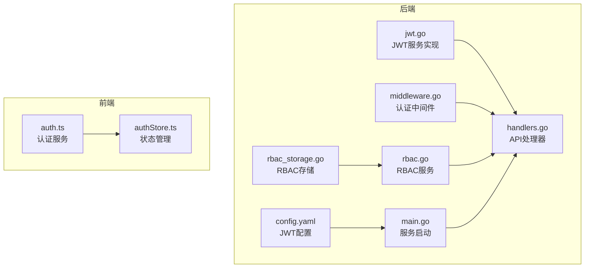
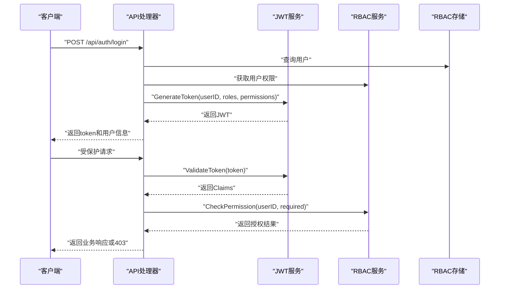
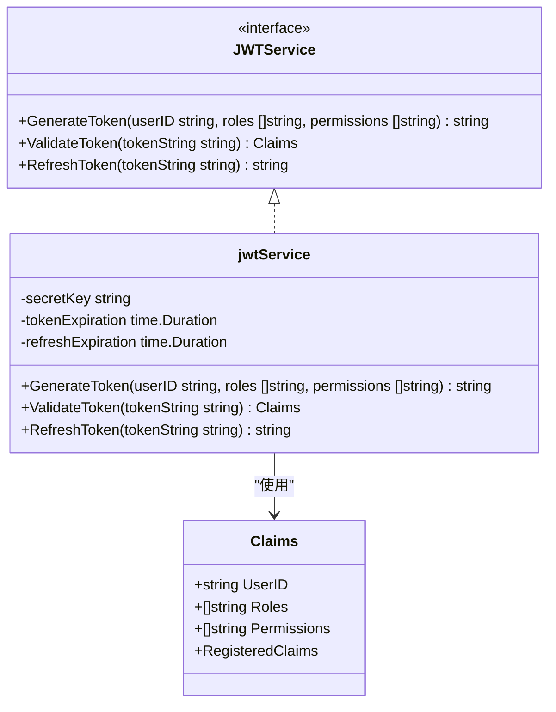
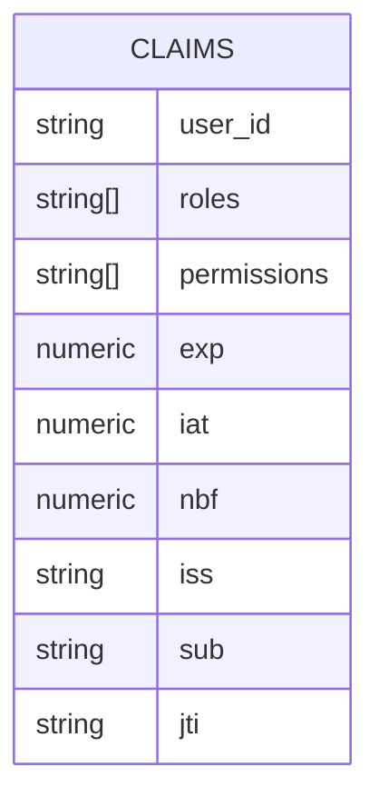
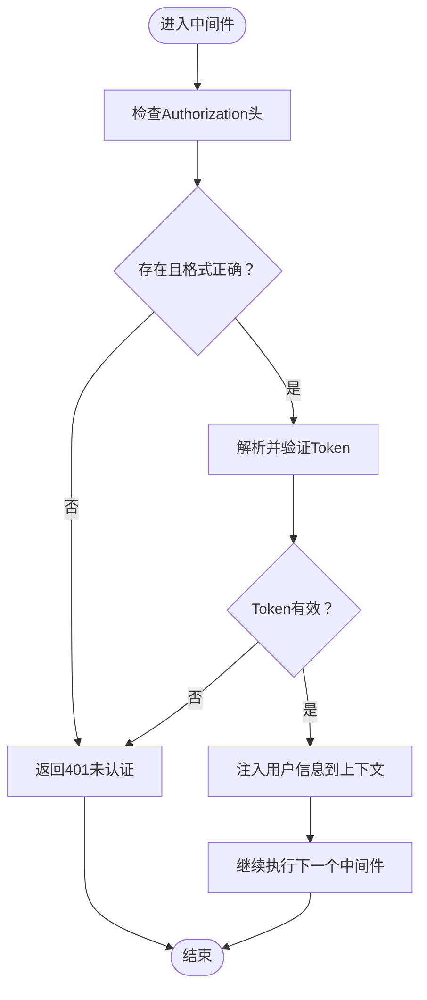
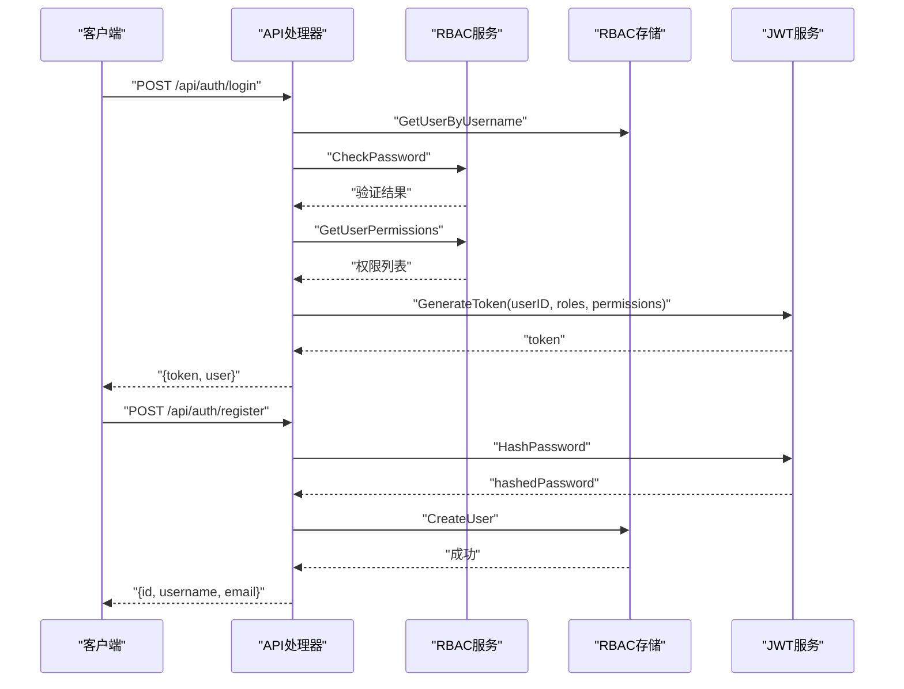
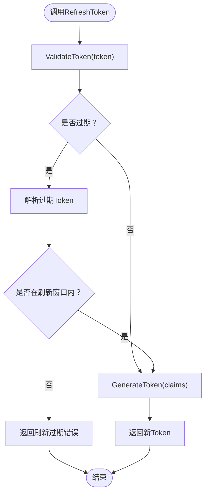
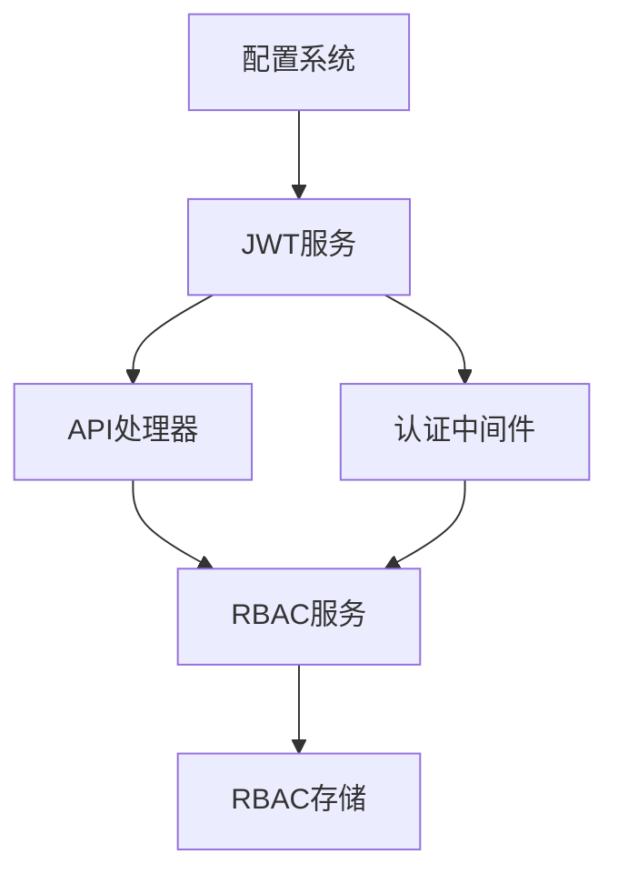

# JWT认证机制

<cite>
**本文档引用的文件**
- [jwt.go](file://internal/auth/jwt.go)
- [middleware.go](file://internal/auth/middleware.go)
- [jwt_test.go](file://internal/auth/test/jwt_test.go)
- [authentication.md](file://docs/authentication.md)
- [config.yaml](file://configs/config.yaml)
- [main.go](file://cmd/server/main.go)
- [handlers.go](file://internal/api/handlers.go)
- [auth.ts](file://frontend/src/services/auth.ts)
- [authStore.ts](file://frontend/src/stores/authStore.ts)
- [rbac.go](file://pkg/rbac/rbac.go)
- [rbac_storage.go](file://internal/storage/rbac_storage.go)
</cite>

## 目录
1. [简介](#简介)
2. [项目结构](#项目结构)
3. [核心组件](#核心组件)
4. [架构概览](#架构概览)
5. [详细组件分析](#详细组件分析)
6. [依赖关系分析](#依赖关系分析)
7. [性能考量](#性能考量)
8. [故障排除指南](#故障排除指南)
9. [结论](#结论)
10. [附录](#附录)

## 简介
本文件详细阐述了数据中心项目的JWT认证机制实现，包括JWT结构设计、Claims字段含义、服务接口实现、签名算法选择、过期时间管理与刷新机制，以及HTTP请求传递方式和安全存储方案。通过后端Go实现与前端TypeScript集成，形成完整的认证与授权体系。

## 项目结构
JWT认证相关代码主要分布在以下模块：
- 后端认证服务：JWT服务接口与实现、认证中间件
- API处理器：登录、注册、权限中间件与路由保护
- 配置：JWT密钥、过期时间等配置项
- 文档：认证规范与接口定义
- 前端：认证服务与状态管理，本地存储令牌

**图表来源**
- [jwt.go:1-126](file://internal/auth/jwt.go#L1-L126)
- [middleware.go:1-49](file://internal/auth/middleware.go#L1-L49)
- [handlers.go:1-293](file://internal/api/handlers.go#L1-L293)
- [rbac.go:1-250](file://pkg/rbac/rbac.go#L1-L250)
- [rbac_storage.go:1-476](file://internal/storage/rbac_storage.go#L1-L476)
- [config.yaml:1-26](file://configs/config.yaml#L1-L26)
- [main.go:1-167](file://cmd/server/main.go#L1-L167)
- [auth.ts:1-26](file://frontend/src/services/auth.ts#L1-L26)
- [authStore.ts:1-61](file://frontend/src/stores/authStore.ts#L1-L61)

**章节来源**
- [jwt.go:1-126](file://internal/auth/jwt.go#L1-L126)
- [middleware.go:1-49](file://internal/auth/middleware.go#L1-L49)
- [handlers.go:1-293](file://internal/api/handlers.go#L1-L293)
- [config.yaml:1-26](file://configs/config.yaml#L1-L26)
- [main.go:1-167](file://cmd/server/main.go#L1-L167)
- [auth.ts:1-26](file://frontend/src/services/auth.ts#L1-L26)
- [authStore.ts:1-61](file://frontend/src/stores/authStore.ts#L1-L61)

## 核心组件
- JWT服务接口：定义GenerateToken、ValidateToken、RefreshToken三个核心方法
- Claims结构：包含用户标识、角色列表、权限列表及标准注册声明
- 认证中间件：从Authorization头提取Bearer Token并验证
- API处理器：登录接口生成Token，权限中间件结合RBAC进行授权
- 配置系统：从环境变量读取JWT密钥与过期时间
- 前端集成：认证服务与状态管理，本地存储令牌

**章节来源**
- [jwt.go:20-41](file://internal/auth/jwt.go#L20-L41)
- [jwt.go:12-18](file://internal/auth/jwt.go#L12-L18)
- [middleware.go:11-48](file://internal/auth/middleware.go#L11-L48)
- [handlers.go:183-221](file://internal/api/handlers.go#L183-L221)
- [config.yaml:6-10](file://configs/config.yaml#L6-L10)
- [authStore.ts:15-46](file://frontend/src/stores/authStore.ts#L15-L46)

## 架构概览
JWT认证的整体流程如下：
- 用户登录：后端验证凭据，生成包含用户ID、角色、权限的JWT
- 请求拦截：中间件从Authorization头提取Token并验证
- 授权检查：结合RBAC服务检查用户对目标资源的权限
- 刷新机制：过期Token可使用Refresh Token换取新Token

**图表来源**
- [handlers.go:183-221](file://internal/api/handlers.go#L183-L221)
- [jwt.go:43-83](file://internal/auth/jwt.go#L43-L83)
- [rbac.go:63-99](file://pkg/rbac/rbac.go#L63-L99)
- [rbac_storage.go:192-200](file://internal/storage/rbac_storage.go#L192-L200)

## 详细组件分析

### JWT服务接口与实现
JWT服务提供三个核心方法：
- GenerateToken：构建Claims并使用HS256签名生成JWT
- ValidateToken：解析并验证JWT签名与有效期
- RefreshToken：支持过期Token刷新，校验刷新窗口

**图表来源**
- [jwt.go:20-41](file://internal/auth/jwt.go#L20-L41)
- [jwt.go:27-41](file://internal/auth/jwt.go#L27-L41)
- [jwt.go:12-18](file://internal/auth/jwt.go#L12-L18)

**章节来源**
- [jwt.go:20-126](file://internal/auth/jwt.go#L20-L126)

### Claims结构设计
Claims包含以下字段：
- UserID：用户唯一标识
- Roles：用户角色ID列表
- Permissions：用户权限码列表
- RegisteredClaims：标准JWT声明（过期时间、签发时间、生效时间、发行者、主题、ID）

**图表来源**
- [jwt.go:12-18](file://internal/auth/jwt.go#L12-L18)
- [jwt.go:44-56](file://internal/auth/jwt.go#L44-L56)

**章节来源**
- [jwt.go:12-56](file://internal/auth/jwt.go#L12-L56)

### 认证中间件工作原理
- 从Authorization头提取Bearer Token
- 调用JWT服务验证Token有效性
- 将用户ID、角色、权限注入上下文供后续中间件使用

**图表来源**
- [middleware.go:12-48](file://internal/auth/middleware.go#L12-L48)
- [handlers.go:260-293](file://internal/api/handlers.go#L260-L293)

**章节来源**
- [middleware.go:12-48](file://internal/auth/middleware.go#L12-L48)
- [handlers.go:260-293](file://internal/api/handlers.go#L260-L293)

### 登录与注册流程
- 登录：校验用户名密码，获取用户权限，生成JWT并返回
- 注册：密码加密存储，返回用户基本信息

**图表来源**
- [handlers.go:183-258](file://internal/api/handlers.go#L183-L258)
- [rbac.go:116-145](file://pkg/rbac/rbac.go#L116-L145)
- [rbac_storage.go:192-200](file://internal/storage/rbac_storage.go#L192-L200)
- [jwt.go:43-66](file://internal/auth/jwt.go#L43-L66)

**章节来源**
- [handlers.go:183-258](file://internal/api/handlers.go#L183-L258)

### 刷新Token机制
- 支持过期Token刷新，需要在刷新窗口内
- 刷新成功后生成新的JWT，保持用户ID、角色、权限不变

**图表来源**
- [jwt.go:85-111](file://internal/auth/jwt.go#L85-L111)

**章节来源**
- [jwt.go:85-111](file://internal/auth/jwt.go#L85-L111)

### 令牌签名算法（HS256）
- 选择HS256的原因：对称密钥签名，性能高、实现简单
- 安全性考虑：密钥必须保密，建议使用强随机密钥，定期轮换
- 配置位置：从环境变量读取，避免硬编码

**章节来源**
- [jwt.go:59](file://internal/auth/jwt.go#L59)
- [config.yaml:8](file://configs/config.yaml#L8)
- [main.go:72-76](file://cmd/server/main.go#L72-L76)

### 令牌过期时间管理
- Access Token：默认24小时
- Refresh Token：默认720小时（30天）
- 配置方式：环境变量或配置文件，运行时动态加载

**章节来源**
- [config.yaml:9-10](file://configs/config.yaml#L9-L10)
- [main.go:74-75](file://cmd/server/main.go#L74-L75)

### HTTP请求传递与安全存储
- 传递方式：Authorization头，格式为"Bearer <token>"
- 前端存储：localStorage保存token与用户信息
- 安全建议：HTTPS传输、HttpOnly Cookie（如需）、最小权限原则

**章节来源**
- [middleware.go:14-30](file://internal/auth/middleware.go#L14-L30)
- [authStore.ts:19-27](file://frontend/src/stores/authStore.ts#L19-L27)
- [auth.ts:15-18](file://frontend/src/services/auth.ts#L15-L18)

## 依赖关系分析
JWT认证机制的关键依赖关系：
- JWT服务依赖于配置系统提供的密钥与过期时间
- API处理器依赖JWT服务生成Token，依赖RBAC服务进行权限检查
- 认证中间件依赖JWT服务验证Token
- RBAC服务依赖存储层获取用户与权限信息

**图表来源**
- [config.yaml:6-10](file://configs/config.yaml#L6-L10)
- [jwt.go:27-41](file://internal/auth/jwt.go#L27-L41)
- [handlers.go:23-42](file://internal/api/handlers.go#L23-L42)
- [middleware.go:12](file://internal/auth/middleware.go#L12)

**章节来源**
- [config.yaml:6-10](file://configs/config.yaml#L6-L10)
- [jwt.go:27-41](file://internal/auth/jwt.go#L27-L41)
- [handlers.go:23-42](file://internal/api/handlers.go#L23-L42)
- [middleware.go:12](file://internal/auth/middleware.go#L12)

## 性能考量
- HS256签名算法性能优异，适合高并发场景
- Token中预存权限可减少每次请求的权限查询开销
- 建议使用Redis缓存短期Token，降低数据库压力
- 合理设置过期时间，平衡用户体验与安全

## 故障排除指南
常见问题与解决方案：
- 401未认证：检查Authorization头格式与Bearer前缀
- 401 Token过期：使用Refresh Token获取新Token
- 403无权限：确认用户角色与权限分配
- 密钥不匹配：核对JWT密钥配置与环境变量

**章节来源**
- [authentication.md:70-79](file://docs/authentication.md#L70-L79)
- [middleware.go:16-39](file://internal/auth/middleware.go#L16-L39)

## 结论
该JWT认证机制通过清晰的接口设计、完善的Claims结构、严格的中间件验证与灵活的刷新策略，实现了高效、安全的认证与授权。配合RBAC权限模型与前端本地存储方案，形成了完整的用户身份管理体系。建议在生产环境中加强密钥管理、启用HTTPS、定期审计日志，并根据业务需求调整过期时间与权限粒度。

## 附录

### 完整代码示例路径
- 生成Token：[jwt.go:43-66](file://internal/auth/jwt.go#L43-L66)
- 验证Token：[jwt.go:68-83](file://internal/auth/jwt.go#L68-L83)
- 刷新Token：[jwt.go:85-111](file://internal/auth/jwt.go#L85-L111)
- 登录接口：[handlers.go:183-221](file://internal/api/handlers.go#L183-L221)
- 认证中间件：[middleware.go:12-48](file://internal/auth/middleware.go#L12-L48)
- 前端认证服务：[auth.ts:15-18](file://frontend/src/services/auth.ts#L15-L18)
- 前端状态管理：[authStore.ts:19-27](file://frontend/src/stores/authStore.ts#L19-L27)

### 配置参考
- JWT密钥：从环境变量JWT_SECRET读取
- Access Token过期：JWT_EXPIRATION（小时）
- Refresh Token过期：JWT_REFRESH_EXPIRATION（小时）

**章节来源**
- [config.yaml:7-10](file://configs/config.yaml#L7-L10)
- [main.go:72-76](file://cmd/server/main.go#L72-L76)