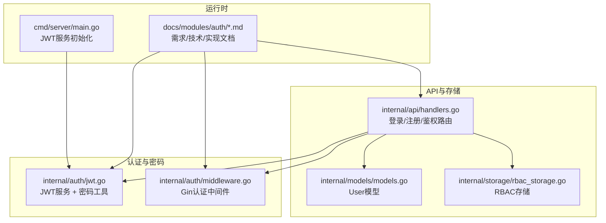
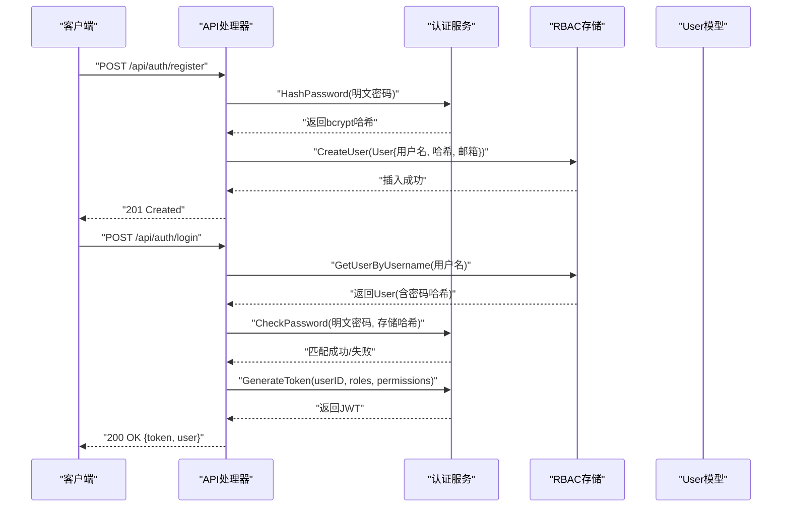
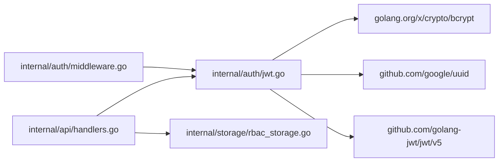

# 密码安全与加密

<cite>
**本文档引用的文件**
- [jwt.go](file://internal/auth/jwt.go)
- [middleware.go](file://internal/auth/middleware.go)
- [handlers.go](file://internal/api/handlers.go)
- [rbac_storage.go](file://internal/storage/rbac_storage.go)
- [models.go](file://internal/models/models.go)
- [main.go](file://cmd/server/main.go)
- [requirements.md](file://docs/modules/auth/requirements.md)
- [tech.md](file://docs/modules/auth/tech.md)
- [implementation.md](file://docs/modules/auth/implementation.md)
</cite>

## 目录
1. [简介](#简介)
2. [项目结构](#项目结构)
3. [核心组件](#核心组件)
4. [架构总览](#架构总览)
5. [详细组件分析](#详细组件分析)
6. [依赖关系分析](#依赖关系分析)
7. [性能考量](#性能考量)
8. [故障排查指南](#故障排查指南)
9. [结论](#结论)
10. [附录](#附录)

## 简介
本文件围绕密码安全与加密展开，重点解释 bcrypt 密码哈希算法的工作原理与安全性优势，详解 HashPassword 与 CheckPassword 函数的实现细节与性能权衡，并说明为何选择 bcrypt 而非 MD5、SHA 系列等传统散列算法。同时给出密码强度验证的最佳实践、盐值生成与存储保护建议，以及完整的代码示例路径，帮助读者在实际工程中正确实现密码的加密存储与验证流程。

## 项目结构
认证与密码安全相关的核心代码集中在以下模块：
- 认证服务与密码工具：internal/auth/jwt.go
- 认证中间件：internal/auth/middleware.go
- 登录/注册/鉴权路由：internal/api/handlers.go
- 用户模型与存储：internal/models/models.go、internal/storage/rbac_storage.go
- 服务启动与环境变量注入：cmd/server/main.go
- 文档化的需求、技术与实现：docs/modules/auth/*.md

图表来源
- [jwt.go:1-126](file://internal/auth/jwt.go#L1-L126)
- [middleware.go:1-49](file://internal/auth/middleware.go#L1-L49)
- [handlers.go:1-200](file://internal/api/handlers.go#L1-L200)
- [rbac_storage.go:1-476](file://internal/storage/rbac_storage.go#L1-L476)
- [models.go:247-254](file://internal/models/models.go#L247-L254)
- [main.go:72-76](file://cmd/server/main.go#L72-L76)

章节来源
- [jwt.go:1-126](file://internal/auth/jwt.go#L1-L126)
- [middleware.go:1-49](file://internal/auth/middleware.go#L1-L49)
- [handlers.go:1-200](file://internal/api/handlers.go#L1-L200)
- [rbac_storage.go:1-476](file://internal/storage/rbac_storage.go#L1-L476)
- [models.go:247-254](file://internal/models/models.go#L247-L254)
- [main.go:72-76](file://cmd/server/main.go#L72-L76)

## 核心组件
- 密码工具
  - HashPassword：使用 bcrypt 对明文密码进行哈希，成本参数为 bcrypt.DefaultCost（10）。
  - CheckPassword：使用 bcrypt.CompareHashAndPassword 对明文密码与存储的哈希进行常量时间比较。
- JWT服务
  - GenerateToken：构造Claims并使用HS256签名，设置过期时间与JTI。
  - ValidateToken：解析并验证签名、有效期。
  - RefreshToken：支持过期Token在刷新窗口内的刷新。
- 认证中间件
  - 从Authorization头提取Bearer Token，调用ValidateToken，成功后注入用户上下文。
- 用户模型与存储
  - User模型包含用户名、密码哈希、邮箱与角色ID；RBAC存储负责用户增删改查与默认数据初始化。

章节来源
- [jwt.go:113-125](file://internal/auth/jwt.go#L113-L125)
- [jwt.go:44-83](file://internal/auth/jwt.go#L44-L83)
- [jwt.go:86-111](file://internal/auth/jwt.go#L86-L111)
- [middleware.go:12-48](file://internal/auth/middleware.go#L12-L48)
- [models.go:247-254](file://internal/models/models.go#L247-L254)
- [rbac_storage.go:145-161](file://internal/storage/rbac_storage.go#L145-L161)

## 架构总览
下图展示了密码从注册到登录验证的关键流程，以及JWT认证在API中的应用。

图表来源
- [handlers.go:183-221](file://internal/api/handlers.go#L183-L221)
- [jwt.go:113-125](file://internal/auth/jwt.go#L113-L125)
- [jwt.go:44-66](file://internal/auth/jwt.go#L44-L66)
- [rbac_storage.go:166-175](file://internal/storage/rbac_storage.go#L166-L175)
- [models.go:247-254](file://internal/models/models.go#L247-L254)

## 详细组件分析

### bcrypt密码哈希与验证
- 工作原理
  - bcrypt是一种专为密码设计的自适应散列函数，内置成本参数cost，用于控制计算复杂度。默认cost为10，意味着每次哈希需要约1秒（取决于硬件）。
  - bcrypt内部包含随机盐值，即使相同明文密码也会产生不同哈希结果，有效抵御彩虹表攻击。
- 安全优势
  - 成本参数可调，便于随硬件升级提升安全性。
  - 常量时间比较（CompareHashAndPassword）避免了时序侧信道攻击。
  - 与PBKDF2相比，bcrypt在设计上更偏向密码场景，且广泛被业界采纳。
- 性能考虑
  - cost越高，CPU占用越大，验证延迟越长。默认cost=10在安全与性能之间取得平衡。
  - 若系统负载较高，可考虑在部署时根据基准测试调整cost，但需权衡安全与吞吐。

章节来源
- [jwt.go:113-125](file://internal/auth/jwt.go#L113-L125)
- [requirements.md:72-72](file://docs/modules/auth/requirements.md#L72-L72)
- [tech.md:126-141](file://docs/modules/auth/tech.md#L126-L141)

### HashPassword函数实现
- 输入输出
  - 输入：明文密码字符串
  - 输出：bcrypt哈希字符串（包含成本、盐值与散列值）
- 关键点
  - 使用 bcrypt.GenerateFromPassword([]byte(password), bcrypt.DefaultCost)
  - 返回string(hash)以便持久化存储
- 错误处理
  - 当哈希生成失败时返回error，调用方需妥善处理

章节来源
- [jwt.go:113-120](file://internal/auth/jwt.go#L113-L120)
- [implementation.md:226-235](file://docs/modules/auth/implementation.md#L226-L235)

### CheckPassword函数验证机制
- 输入输出
  - 输入：明文密码、存储的bcrypt哈希
  - 输出：匹配成功返回nil，否则返回错误
- 关键点
  - 使用 bcrypt.CompareHashAndPassword([]byte(hash), []byte(password)) 进行常量时间比较
  - 该函数内部会解析哈希中的成本与盐值，再进行验证
- 安全性保证
  - 时间复杂度与哈希成本一致，不会因输入差异而改变执行时间
  - 无法从哈希反推出原始密码

章节来源
- [jwt.go:122-125](file://internal/auth/jwt.go#L122-L125)
- [implementation.md:232-234](file://docs/modules/auth/implementation.md#L232-L234)

### 为什么选择bcrypt而非MD5/SHA系列
- MD5/SHA系列散列算法
  - 计算速度快，适合一般数据完整性校验
  - 不具备抗暴力破解特性，易受GPU/ASIC加速攻击
  - 无内置盐值，易被彩虹表批量破解
- bcrypt的优势
  - 专为密码设计，内置成本与盐值
  - 可调成本，适配硬件演进
  - 常量时间比较，抗时序侧信道
- 在本项目中的体现
  - 注册与默认数据初始化均使用bcrypt对密码进行哈希存储
  - 登录时通过bcrypt对比验证

章节来源
- [requirements.md:146-150](file://docs/modules/auth/requirements.md#L146-L150)
- [rbac_storage.go:145-161](file://internal/storage/rbac_storage.go#L145-L161)

### 密码强度验证最佳实践
- 最小长度与字符类型
  - 非功能性需求中规定密码最小长度≥8位
  - 建议结合大小写字母、数字与特殊字符，提升熵值
- 其他建议
  - 避免使用常见弱口令与字典词汇
  - 定期提示用户更换密码
  - 在前端进行基础格式校验，后端进行更强约束
- 当前实现状态
  - 密码强度检查在后续迭代中添加，当前仅使用bcrypt哈希存储

章节来源
- [requirements.md:76-76](file://docs/modules/auth/requirements.md#L76-L76)
- [requirements.md:150-150](file://docs/modules/auth/requirements.md#L150-L150)

### 密码存储的安全性考虑
- 盐值生成与存储
  - bcrypt内部自动生成随机盐值，无需额外处理
  - 存储bcrypt哈希即可，无需单独保存盐值
- 存储保护
  - 用户模型中仅保存哈希，不保存明文密码
  - 所有API响应中清除password字段，防止泄露
- 默认数据初始化
  - 初始化默认管理员用户时，使用bcrypt对固定密码进行哈希后再存入数据库

章节来源
- [models.go:247-254](file://internal/models/models.go#L247-L254)
- [implementation.md:216-241](file://docs/modules/auth/implementation.md#L216-L241)
- [rbac_storage.go:145-161](file://internal/storage/rbac_storage.go#L145-L161)

### 完整代码示例路径（加密存储与验证）
- 注册流程（密码哈希存储）
  - [handlers.go:166-175](file://internal/api/handlers.go#L166-L175)
  - [jwt.go:113-120](file://internal/auth/jwt.go#L113-L120)
- 登录流程（密码验证）
  - [handlers.go:194-200](file://internal/api/handlers.go#L194-L200)
  - [jwt.go:122-125](file://internal/auth/jwt.go#L122-L125)
- JWT服务初始化（环境变量注入）
  - [main.go:72-76](file://cmd/server/main.go#L72-L76)

章节来源
- [handlers.go:166-200](file://internal/api/handlers.go#L166-L200)
- [jwt.go:113-125](file://internal/auth/jwt.go#L113-L125)
- [main.go:72-76](file://cmd/server/main.go#L72-L76)

### 安全编码规范与常见漏洞防范
- 安全编码规范
  - 使用bcrypt对密码进行单向哈希存储
  - 传输层使用HTTPS，避免明文密码在网络中暴露
  - 所有API响应中清除password字段
  - JWT密钥通过环境变量注入，不在代码或配置文件中硬编码
- 常见漏洞与防范
  - 时序攻击：使用bcrypt常量时间比较
  - 彩虹表攻击：bcrypt内置盐值，且成本参数可调
  - 明文泄露：严格禁止在日志与响应中输出密码
  - 弱口令：在后续迭代中增加密码强度校验

章节来源
- [tech.md:180-191](file://docs/modules/auth/tech.md#L180-L191)
- [requirements.md:152-157](file://docs/modules/auth/requirements.md#L152-L157)

## 依赖关系分析
- 组件耦合
  - API处理器依赖JWT服务与RBAC存储，用于登录/注册与权限查询
  - JWT服务依赖bcrypt进行密码哈希与验证
  - 中间件依赖JWT服务进行Token验证
- 外部依赖
  - golang-jwt/jwt/v5：JWT生成与验证
  - google/uuid：生成JTI
  - golang.org/x/crypto/bcrypt：密码哈希与比较

图表来源
- [handlers.go:1-21](file://internal/api/handlers.go#L1-L21)
- [jwt.go:3-10](file://internal/auth/jwt.go#L3-L10)
- [middleware.go:3-9](file://internal/auth/middleware.go#L3-L9)

章节来源
- [handlers.go:1-21](file://internal/api/handlers.go#L1-L21)
- [jwt.go:3-10](file://internal/auth/jwt.go#L3-L10)
- [middleware.go:3-9](file://internal/auth/middleware.go#L3-L9)

## 性能考量
- bcrypt成本参数
  - 默认cost=10，平衡安全与性能；可根据硬件能力调整
  - 验证时间与cost成正比，建议在生产环境进行基准测试
- JWT签名
  - HS256签名开销极低，主要瓶颈在bcrypt哈希
- 建议
  - 在高并发场景下，优先优化bcrypt成本与数据库索引
  - 对于频繁登录场景，可结合缓存与限流策略

[本节为通用性能讨论，不直接分析具体文件]

## 故障排查指南
- 登录失败（401）
  - 用户名不存在或密码不匹配：检查用户名拼写与bcrypt哈希一致性
  - 参考：[handlers.go:194-200](file://internal/api/handlers.go#L194-L200)
- Token无效或过期
  - 检查Authorization头格式与Bearer前缀
  - 参考：[middleware.go:12-48](file://internal/auth/middleware.go#L12-L48)
- 密钥问题
  - JWT_SECRET未正确注入或长度不足：确认环境变量与密钥长度（≥256bit）
  - 参考：[main.go:72-76](file://cmd/server/main.go#L72-L76)
- 密码泄露风险
  - 确认所有响应中password字段已被清除
  - 参考：[implementation.md:216-241](file://docs/modules/auth/implementation.md#L216-L241)

章节来源
- [handlers.go:194-200](file://internal/api/handlers.go#L194-L200)
- [middleware.go:12-48](file://internal/auth/middleware.go#L12-L48)
- [main.go:72-76](file://cmd/server/main.go#L72-L76)
- [implementation.md:216-241](file://docs/modules/auth/implementation.md#L216-L241)

## 结论
本项目采用bcrypt作为密码存储与验证的核心算法，配合JWT无状态认证与严格的响应清理策略，构建了安全可靠的认证体系。通过合理的成本参数与环境变量配置，既满足安全需求又兼顾性能表现。建议在后续迭代中补充密码强度校验与更细粒度的审计日志，持续提升整体安全性。

[本节为总结性内容，不直接分析具体文件]

## 附录
- 相关文档
  - [需求设计文档:1-204](file://docs/modules/auth/requirements.md#L1-L204)
  - [技术文档:1-191](file://docs/modules/auth/tech.md#L1-L191)
  - [实现文档:1-266](file://docs/modules/auth/implementation.md#L1-L266)

[本节为补充材料，不直接分析具体文件]