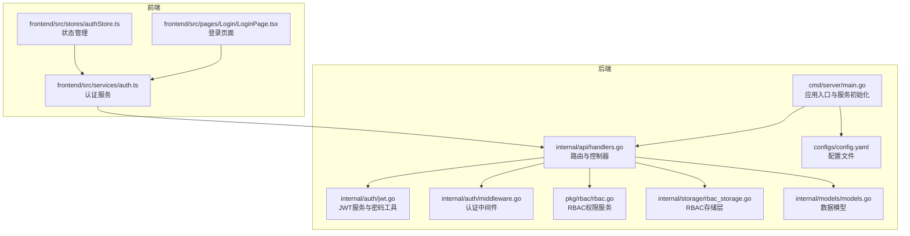
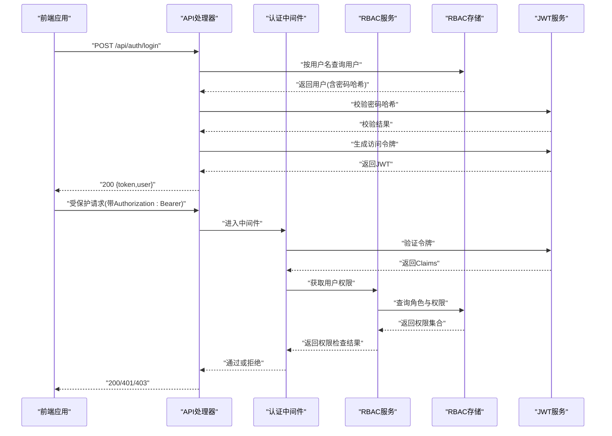
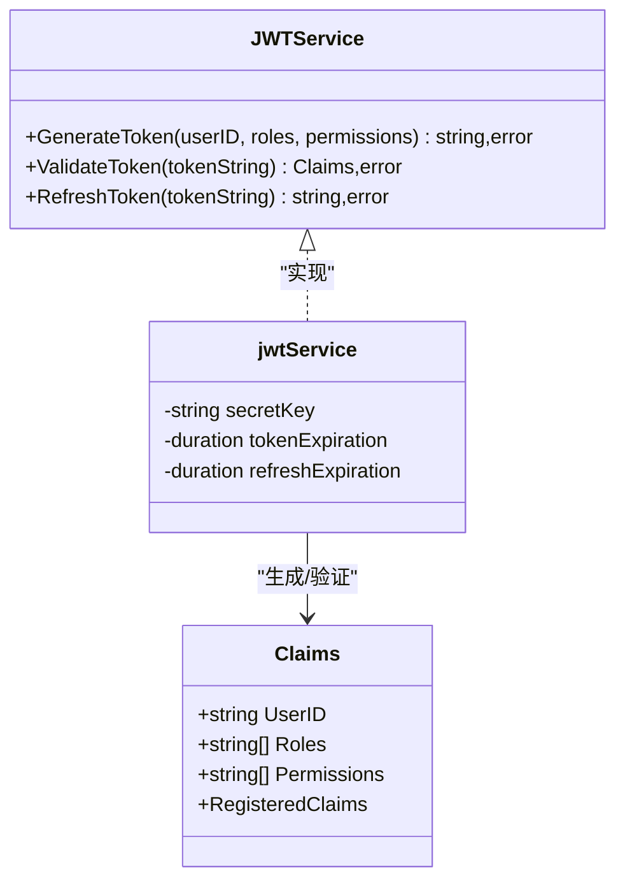
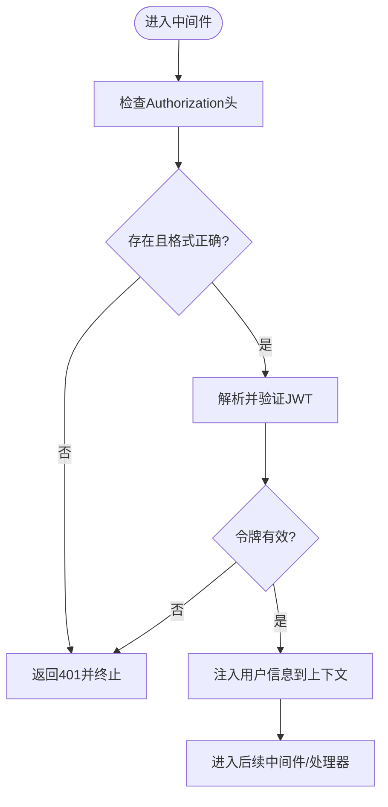
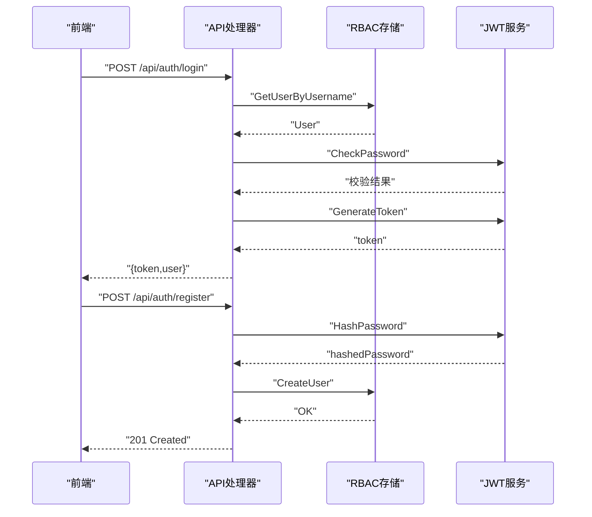
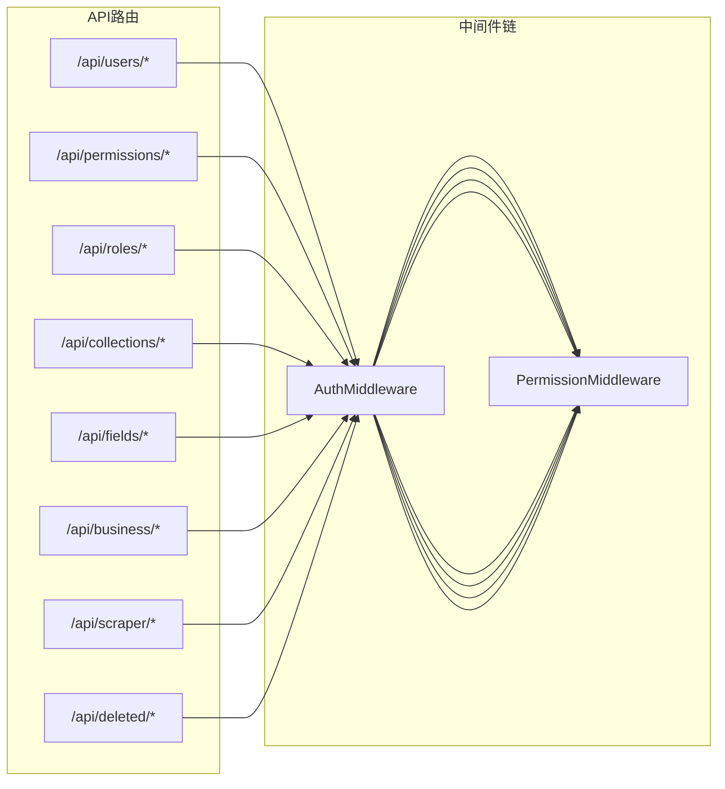
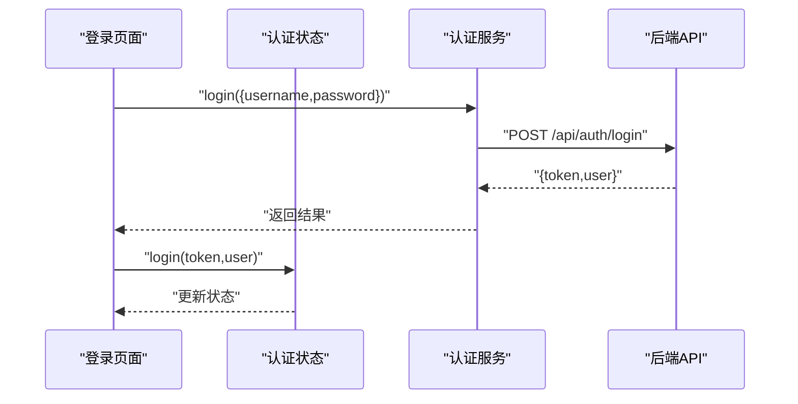
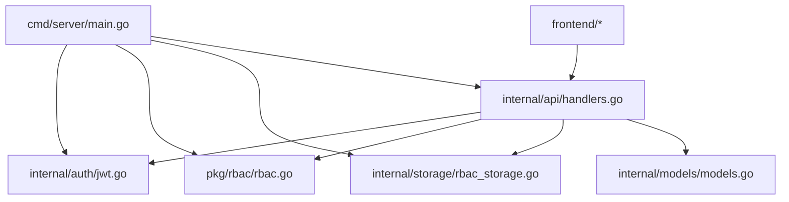

# 用户认证系统

<cite>
**本文引用的文件**
- [jwt.go](file://internal/auth/jwt.go)
- [middleware.go](file://internal/auth/middleware.go)
- [handlers.go](file://internal/api/handlers.go)
- [config.yaml](file://configs/config.yaml)
- [main.go](file://cmd/server/main.go)
- [models.go](file://internal/models/models.go)
- [rbac.go](file://pkg/rbac/rbac.go)
- [rbac_storage.go](file://internal/storage/rbac_storage.go)
- [authentication.md](file://docs/authentication.md)
- [api.md](file://docs/api.md)
- [auth.ts](file://frontend/src/services/auth.ts)
- [authStore.ts](file://frontend/src/stores/authStore.ts)
- [LoginPage.tsx](file://frontend/src/pages/Login/LoginPage.tsx)
- [jwt_test.go](file://internal/auth/test/jwt_test.go)
</cite>

## 目录
1. [简介](#简介)
2. [项目结构](#项目结构)
3. [核心组件](#核心组件)
4. [架构总览](#架构总览)
5. [详细组件分析](#详细组件分析)
6. [依赖关系分析](#依赖关系分析)
7. [性能考量](#性能考量)
8. [故障排查指南](#故障排查指南)
9. [结论](#结论)
10. [附录](#附录)

## 简介
本文件面向开发者与运维人员，系统性梳理该数据中心项目的用户认证与授权体系，重点覆盖：
- JWT（JSON Web Token）认证机制：令牌生成、签名验证、过期时间管理与刷新策略
- 登录/注册流程：密码加密存储、用户信息校验与令牌发放
- 认证中间件：请求拦截、令牌解析、用户身份验证与权限检查
- 完整API接口文档：认证端点的请求格式、响应结构与错误处理
- 安全最佳实践：密码哈希算法选择、令牌存储安全与防重放攻击
- 实际使用场景与代码示例路径

## 项目结构
后端采用Go语言与Gin框架，认证与授权模块位于internal/auth与pkg/rbac，API路由在internal/api，配置在configs，入口在cmd/server。前端使用React+Zustand管理认证状态，通过REST API与后端交互。

图表来源
- [main.go:1-167](file://cmd/server/main.go#L1-L167)
- [handlers.go:1-180](file://internal/api/handlers.go#L1-L180)
- [jwt.go:1-126](file://internal/auth/jwt.go#L1-L126)
- [middleware.go:1-49](file://internal/auth/middleware.go#L1-L49)
- [rbac.go:1-250](file://pkg/rbac/rbac.go#L1-L250)
- [rbac_storage.go:1-476](file://internal/storage/rbac_storage.go#L1-L476)
- [models.go:1-365](file://internal/models/models.go#L1-L365)
- [config.yaml:1-26](file://configs/config.yaml#L1-L26)
- [auth.ts:1-26](file://frontend/src/services/auth.ts#L1-L26)
- [authStore.ts:1-61](file://frontend/src/stores/authStore.ts#L1-L61)
- [LoginPage.tsx:1-75](file://frontend/src/pages/Login/LoginPage.tsx#L1-L75)

章节来源
- [main.go:24-167](file://cmd/server/main.go#L24-L167)
- [handlers.go:45-181](file://internal/api/handlers.go#L45-L181)
- [config.yaml:1-26](file://configs/config.yaml#L1-L26)

## 核心组件
- JWT服务：负责生成、验证与刷新令牌，以及密码哈希与校验
- 认证中间件：统一拦截受保护路由，解析Authorization头，校验令牌并注入用户上下文
- RBAC服务：根据用户角色与权限集合判断资源访问权限
- API处理器：注册路由、实现登录/注册等端点，并组合认证与权限中间件
- 存储层：提供用户、角色、权限的CRUD与默认数据初始化
- 前端认证：通过服务层发起登录请求，本地持久化令牌与用户信息

章节来源
- [jwt.go:20-126](file://internal/auth/jwt.go#L20-L126)
- [middleware.go:11-49](file://internal/auth/middleware.go#L11-L49)
- [rbac.go:55-171](file://pkg/rbac/rbac.go#L55-L171)
- [handlers.go:23-43](file://internal/api/handlers.go#L23-L43)
- [rbac_storage.go:16-79](file://internal/storage/rbac_storage.go#L16-L79)
- [auth.ts:14-24](file://frontend/src/services/auth.ts#L14-L24)
- [authStore.ts:15-61](file://frontend/src/stores/authStore.ts#L15-L61)

## 架构总览
下图展示从客户端到后端的认证与授权流程，包括JWT签发、中间件拦截、RBAC权限检查与错误处理。

图表来源
- [handlers.go:183-221](file://internal/api/handlers.go#L183-L221)
- [handlers.go:260-293](file://internal/api/handlers.go#L260-L293)
- [middleware.go:12-48](file://internal/auth/middleware.go#L12-L48)
- [rbac.go:63-99](file://pkg/rbac/rbac.go#L63-L99)
- [rbac_storage.go:192-200](file://internal/storage/rbac_storage.go#L192-L200)
- [jwt.go:44-83](file://internal/auth/jwt.go#L44-L83)

## 详细组件分析

### JWT服务与令牌生命周期
- Claims结构：包含用户ID、角色、权限及标准声明（过期、签发、主题等）
- 令牌生成：设置过期时间、签发时间、主题、唯一ID等，使用HS256签名
- 令牌验证：解析并校验签名与有效期；支持过期令牌的刷新
- 密码处理：bcrypt哈希与校验，确保密码安全存储

图表来源
- [jwt.go:12-41](file://internal/auth/jwt.go#L12-L41)
- [jwt.go:44-111](file://internal/auth/jwt.go#L44-L111)

章节来源
- [jwt.go:12-126](file://internal/auth/jwt.go#L12-L126)
- [jwt_test.go:10-79](file://internal/auth/test/jwt_test.go#L10-L79)

### 认证中间件与权限中间件
- 认证中间件：从Authorization头提取Bearer令牌，验证后将用户信息注入上下文
- 权限中间件：基于RBAC服务检查用户对目标资源的权限，支持通配符匹配与超级管理员

图表来源
- [middleware.go:12-48](file://internal/auth/middleware.go#L12-L48)
- [handlers.go:295-314](file://internal/api/handlers.go#L295-L314)

章节来源
- [middleware.go:11-49](file://internal/auth/middleware.go#L11-L49)
- [handlers.go:295-314](file://internal/api/handlers.go#L295-L314)

### 登录/注册流程
- 登录：接收用户名与密码，查询用户并校验密码哈希，生成JWT返回给客户端
- 注册：接收用户名、密码、邮箱，对密码进行哈希后创建用户

图表来源
- [handlers.go:183-221](file://internal/api/handlers.go#L183-L221)
- [handlers.go:223-258](file://internal/api/handlers.go#L223-L258)
- [rbac_storage.go:192-200](file://internal/storage/rbac_storage.go#L192-L200)
- [rbac_storage.go:166-175](file://internal/storage/rbac_storage.go#L166-L175)
- [jwt.go:114-125](file://internal/auth/jwt.go#L114-L125)

章节来源
- [handlers.go:183-258](file://internal/api/handlers.go#L183-L258)
- [rbac_storage.go:166-200](file://internal/storage/rbac_storage.go#L166-L200)
- [jwt.go:114-125](file://internal/auth/jwt.go#L114-L125)

### RBAC权限模型与API路由
- 权限常量：涵盖用户、角色、权限、集合、字段、数据、刮削等模块的读写管理权限
- API路由：受保护路由组绑定认证中间件；具体端点再绑定权限中间件
- 权限匹配：支持精确匹配与前缀通配符匹配；超级管理员可访问全部资源

图表来源
- [handlers.go:49-181](file://internal/api/handlers.go#L49-L181)
- [rbac.go:12-53](file://pkg/rbac/rbac.go#L12-L53)
- [rbac.go:101-114](file://pkg/rbac/rbac.go#L101-L114)

章节来源
- [handlers.go:49-181](file://internal/api/handlers.go#L49-L181)
- [rbac.go:12-114](file://pkg/rbac/rbac.go#L12-L114)

### 前端认证集成
- 登录页面：表单校验后调用认证服务发起登录请求
- 认证服务：封装登录与获取当前用户信息的API调用
- 状态管理：使用Zustand持久化令牌与用户信息，提供登录/登出与状态检查

图表来源
- [LoginPage.tsx:13-31](file://frontend/src/pages/Login/LoginPage.tsx#L13-L31)
- [auth.ts:14-24](file://frontend/src/services/auth.ts#L14-L24)
- [authStore.ts:19-28](file://frontend/src/stores/authStore.ts#L19-L28)

章节来源
- [LoginPage.tsx:1-75](file://frontend/src/pages/Login/LoginPage.tsx#L1-L75)
- [auth.ts:1-26](file://frontend/src/services/auth.ts#L1-L26)
- [authStore.ts:1-61](file://frontend/src/stores/authStore.ts#L1-L61)

## 依赖关系分析
- 应用入口负责加载环境变量、初始化日志、数据库与RBAC默认数据、创建JWT服务与RBAC服务，并注册路由
- API处理器依赖JWT服务进行令牌生成与验证，依赖RBAC服务进行权限检查
- RBAC服务依赖存储层进行用户、角色、权限的读写
- 前端通过服务层与后端交互，状态持久化于本地存储

图表来源
- [main.go:72-94](file://cmd/server/main.go#L72-L94)
- [handlers.go:23-43](file://internal/api/handlers.go#L23-L43)
- [rbac_storage.go:16-79](file://internal/storage/rbac_storage.go#L16-L79)

章节来源
- [main.go:24-167](file://cmd/server/main.go#L24-L167)
- [handlers.go:23-43](file://internal/api/handlers.go#L23-L43)

## 性能考量
- 令牌生成与验证：HS256签名开销较小，建议合理设置过期时间以平衡安全性与用户体验
- 密码哈希：bcrypt成本因子默认值已足够安全，避免过度提升导致CPU压力
- RBAC查询：权限检查涉及多层级查询，建议在存储层建立索引优化用户与角色关联查询
- 中间件链路：认证与权限中间件应尽量保持轻量，避免阻塞请求处理

## 故障排查指南
- 401 未认证/令牌无效：检查Authorization头格式是否为Bearer，令牌是否过期或被篡改
- 403 无权限：确认用户角色与权限集合，检查权限匹配规则与通配符使用
- 登录失败：核对用户名是否存在、密码哈希是否正确
- 令牌刷新失败：确认刷新令牌是否过期，刷新窗口是否超限

章节来源
- [authentication.md:70-79](file://docs/authentication.md#L70-L79)
- [handlers.go:260-293](file://internal/api/handlers.go#L260-L293)
- [middleware.go:12-48](file://internal/auth/middleware.go#L12-L48)

## 结论
该认证系统以JWT为核心，结合RBAC实现细粒度的权限控制，具备清晰的中间件链路与完善的API接口。通过bcrypt保障密码安全，通过合理的令牌过期与刷新策略提升可用性。建议在生产环境中进一步强化令牌存储安全与防重放措施，并持续优化RBAC查询性能。

## 附录

### API接口文档（认证相关）
- 登录
  - 方法与路径：POST /api/auth/login
  - 请求体：{"username": "...", "password": "..."}
  - 响应：{"token": "...", "user": {"id": "...", "username": "...", "email": "...", "roles": [...]}}
- 注册
  - 方法与路径：POST /api/auth/register
  - 请求体：{"username": "...", "password": "...", "email": "..."}
  - 响应：201 Created，返回{"id": "...", "username": "...", "email": "..."}

章节来源
- [api.md:15-68](file://docs/api.md#L15-L68)
- [handlers.go:183-258](file://internal/api/handlers.go#L183-L258)

### 配置说明
- JWT配置：密钥、访问令牌过期时间、刷新令牌过期时间
- 服务器配置：主机、端口、读写超时
- 日志配置：级别、文件路径、轮转参数

章节来源
- [config.yaml:6-26](file://configs/config.yaml#L6-L26)

### 安全最佳实践
- 密码哈希：使用bcrypt，默认成本因子已足够安全
- 令牌存储：前端仅保存在本地存储，建议配合HttpOnly Cookie与安全同源策略
- 防重放：建议引入随机nonce与时间戳校验，或采用短令牌+刷新令牌模式
- 传输安全：生产环境启用HTTPS，限制CORS范围

章节来源
- [jwt.go:114-125](file://internal/auth/jwt.go#L114-L125)
- [authentication.md:26-31](file://docs/authentication.md#L26-L31)