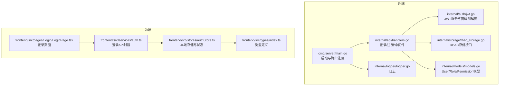
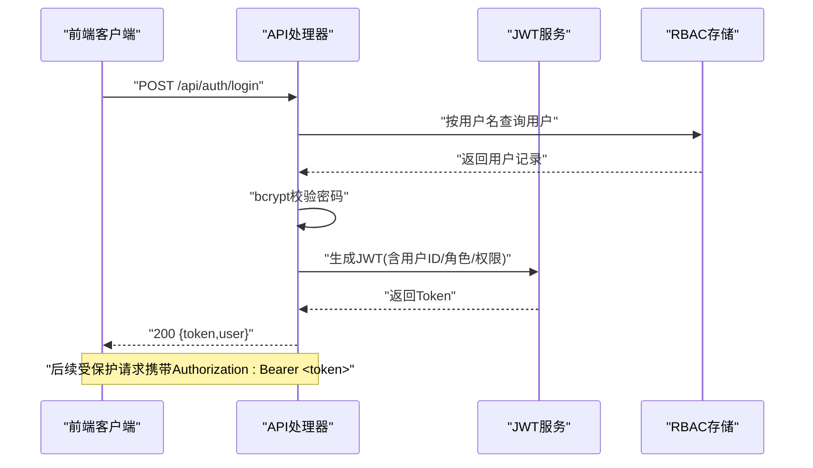
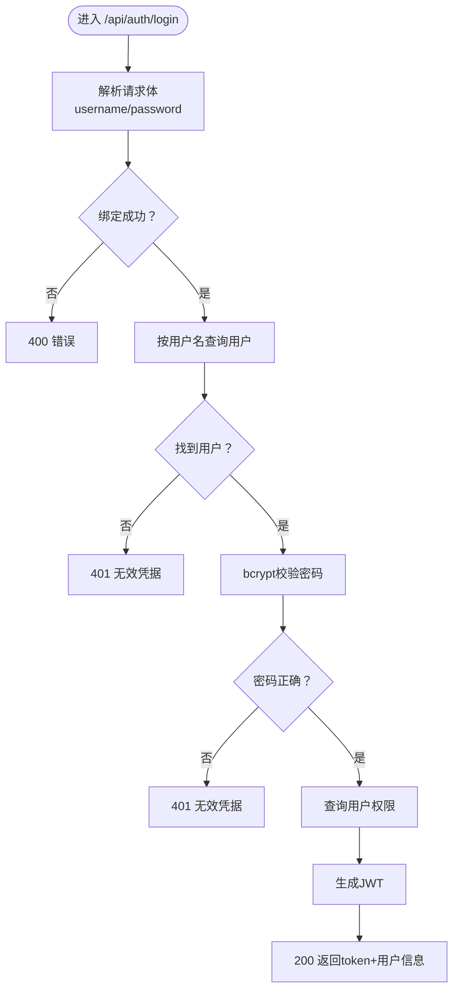
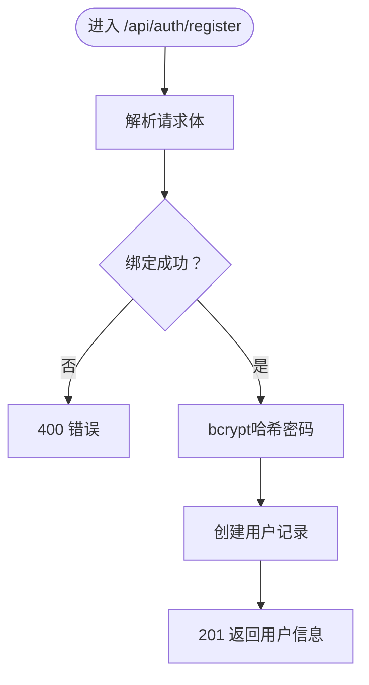
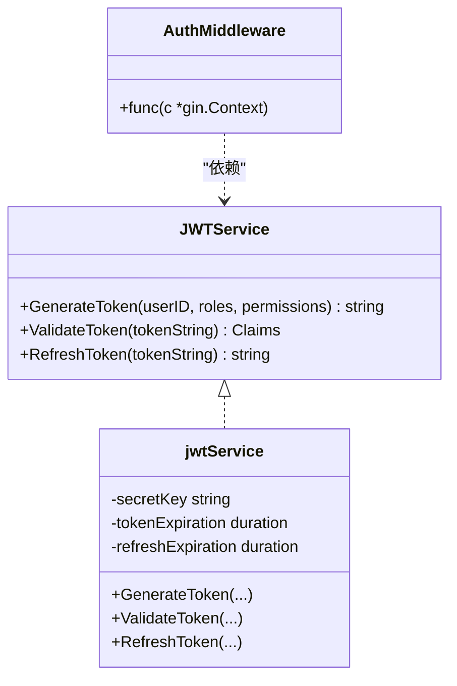
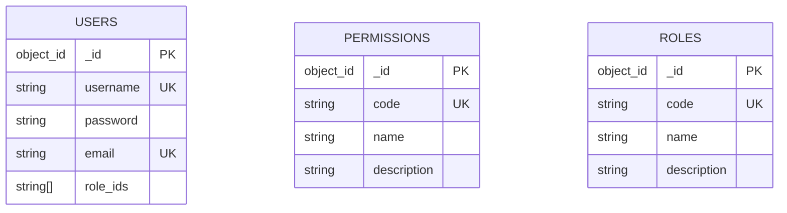
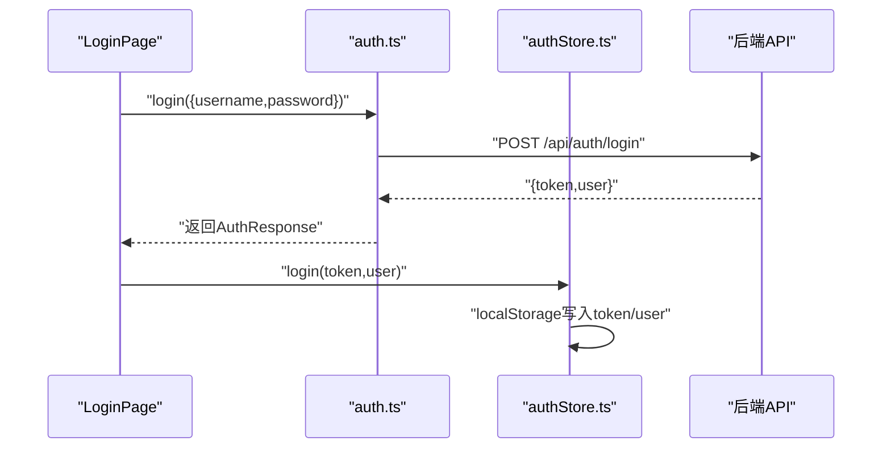
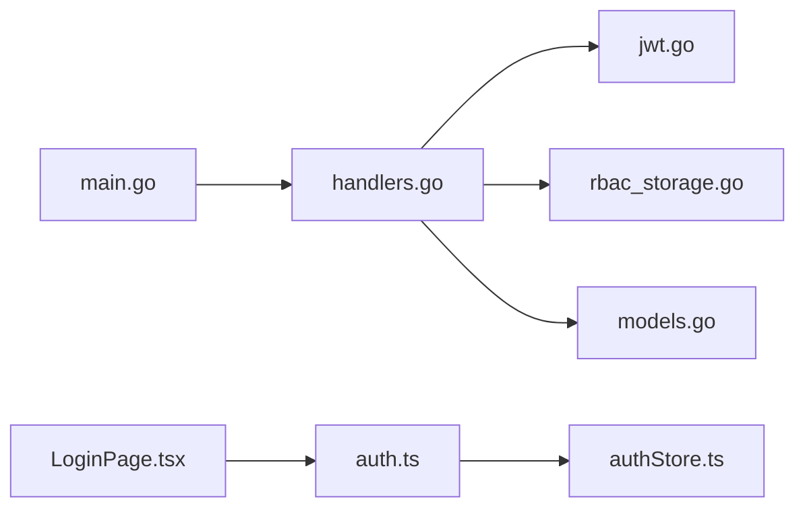

# 登录注册流程

<cite>
**本文引用的文件**
- [main.go](file://cmd/server/main.go)
- [handlers.go](file://internal/api/handlers.go)
- [jwt.go](file://internal/auth/jwt.go)
- [middleware.go](file://internal/auth/middleware.go)
- [rbac_storage.go](file://internal/storage/rbac_storage.go)
- [models.go](file://internal/models/models.go)
- [auth.ts](file://frontend/src/services/auth.ts)
- [authStore.ts](file://frontend/src/stores/authStore.ts)
- [LoginPage.tsx](file://frontend/src/pages/Login/LoginPage.tsx)
- [index.ts](file://frontend/src/types/index.ts)
- [config.yaml](file://configs/config.yaml)
- [api.md](file://docs/api.md)
- [authentication.md](file://docs/authentication.md)
- [implementation.md](file://docs/modules/auth/implementation.md)
- [logger.go](file://internal/logger/logger.go)
</cite>

## 目录
1. [简介](#简介)
2. [项目结构](#项目结构)
3. [核心组件](#核心组件)
4. [架构总览](#架构总览)
5. [详细组件分析](#详细组件分析)
6. [依赖分析](#依赖分析)
7. [性能考虑](#性能考虑)
8. [故障排查指南](#故障排查指南)
9. [结论](#结论)
10. [附录](#附录)

## 简介
本文件面向登录与注册流程的技术文档，覆盖用户信息收集、密码加密、账户创建、登录凭据验证、身份确认与令牌生成、API端点设计、错误处理机制、会话管理策略、前端集成指南以及安全最佳实践。读者可据此快速理解系统如何通过JWT实现认证，并在React前端中完成登录与会话保持。

## 项目结构
后端采用Go语言与Gin框架，认证相关逻辑集中在API处理器、JWT服务与RBAC存储层；前端使用React + Zustand进行状态管理与认证交互。

**图表来源**
- [main.go:24-150](file://cmd/server/main.go#L24-L150)
- [handlers.go:45-181](file://internal/api/handlers.go#L45-L181)
- [jwt.go:12-126](file://internal/auth/jwt.go#L12-L126)
- [rbac_storage.go:16-42](file://internal/storage/rbac_storage.go#L16-L42)
- [models.go:247-271](file://internal/models/models.go#L247-L271)
- [auth.ts:14-24](file://frontend/src/services/auth.ts#L14-L24)
- [authStore.ts:15-46](file://frontend/src/stores/authStore.ts#L15-L46)
- [LoginPage.tsx:8-31](file://frontend/src/pages/Login/LoginPage.tsx#L8-L31)
- [index.ts:39-47](file://frontend/src/types/index.ts#L39-L47)

**章节来源**
- [main.go:24-150](file://cmd/server/main.go#L24-L150)
- [handlers.go:45-181](file://internal/api/handlers.go#L45-L181)

## 核心组件
- 登录/注册处理器：负责接收请求、校验输入、查询用户、验证密码、生成JWT并返回结果。
- JWT服务：负责签发、验证与刷新Token，以及密码哈希与校验。
- RBAC存储：提供用户、角色、权限的CRUD与唯一索引约束。
- 前端服务与状态：封装登录API、持久化Token与用户信息、提供登录页面与状态读取。

**章节来源**
- [handlers.go:183-258](file://internal/api/handlers.go#L183-L258)
- [jwt.go:20-126](file://internal/auth/jwt.go#L20-L126)
- [rbac_storage.go:16-42](file://internal/storage/rbac_storage.go#L16-L42)
- [auth.ts:14-24](file://frontend/src/services/auth.ts#L14-L24)
- [authStore.ts:15-46](file://frontend/src/stores/authStore.ts#L15-L46)

## 架构总览
后端通过Gin注册公开路由（登录/注册），受保护路由统一走JWT中间件。登录成功后返回包含用户信息与JWT的响应；前端将Token保存至本地存储并在后续请求中携带。

**图表来源**
- [handlers.go:183-221](file://internal/api/handlers.go#L183-L221)
- [jwt.go:43-66](file://internal/auth/jwt.go#L43-L66)
- [rbac_storage.go:19-20](file://internal/storage/rbac_storage.go#L19-L20)

**章节来源**
- [handlers.go:45-181](file://internal/api/handlers.go#L45-L181)
- [jwt.go:43-126](file://internal/auth/jwt.go#L43-L126)
- [rbac_storage.go:16-42](file://internal/storage/rbac_storage.go#L16-L42)

## 详细组件分析

### 登录流程（POST /api/auth/login）
- 请求体解析：用户名与密码必填。
- 用户查询：按用户名查询用户，不存在则返回未授权。
- 密码验证：使用bcrypt比较哈希，不匹配返回未授权。
- 权限获取：查询用户的所有权限（用于生成Token）。
- Token生成：签发JWT，包含用户ID、角色与权限。
- 响应：返回token与用户基本信息。

**图表来源**
- [handlers.go:183-221](file://internal/api/handlers.go#L183-L221)
- [jwt.go:113-125](file://internal/auth/jwt.go#L113-L125)

**章节来源**
- [handlers.go:183-221](file://internal/api/handlers.go#L183-L221)
- [implementation.md:50-102](file://docs/modules/auth/implementation.md#L50-L102)

### 注册流程（POST /api/auth/register）
- 请求体解析：用户名、密码、邮箱必填。
- 密码哈希：使用bcrypt生成哈希。
- 用户创建：写入用户记录（RoleIDs为空）。
- 响应：返回新建用户的ID、用户名与邮箱（状态201）。

**图表来源**
- [handlers.go:223-258](file://internal/api/handlers.go#L223-L258)
- [jwt.go:113-120](file://internal/auth/jwt.go#L113-L120)

**章节来源**
- [handlers.go:223-258](file://internal/api/handlers.go#L223-L258)

### JWT服务与中间件
- JWT服务：生成、验证与刷新Token；支持过期Token的刷新窗口校验。
- 密码处理：哈希与校验均使用bcrypt。
- 认证中间件：从Authorization头提取Bearer Token并验证，注入用户上下文。

**图表来源**
- [jwt.go:20-126](file://internal/auth/jwt.go#L20-L126)
- [middleware.go:11-49](file://internal/auth/middleware.go#L11-L49)

**章节来源**
- [jwt.go:20-126](file://internal/auth/jwt.go#L20-L126)
- [middleware.go:11-49](file://internal/auth/middleware.go#L11-L49)

### RBAC存储与模型
- 用户模型包含ID、用户名、密码哈希、邮箱与角色ID列表。
- RBAC存储接口定义了用户、角色、权限的CRUD方法与唯一索引（用户名、邮箱、权限code、角色code）。

**图表来源**
- [models.go:247-271](file://internal/models/models.go#L247-L271)
- [rbac_storage.go:16-42](file://internal/storage/rbac_storage.go#L16-L42)

**章节来源**
- [models.go:247-271](file://internal/models/models.go#L247-L271)
- [rbac_storage.go:16-42](file://internal/storage/rbac_storage.go#L16-L42)

### 前端集成（React）
- 登录页面：表单收集用户名与密码，提交至登录服务。
- 登录服务：调用POST /api/auth/login，接收token与用户信息。
- 状态管理：使用Zustand将token与用户信息存入localStorage并维护登录态。
- 类型定义：统一的User、LoginRequest等类型便于前后端契约一致。

**图表来源**
- [LoginPage.tsx:13-31](file://frontend/src/pages/Login/LoginPage.tsx#L13-L31)
- [auth.ts:14-24](file://frontend/src/services/auth.ts#L14-L24)
- [authStore.ts:19-28](file://frontend/src/stores/authStore.ts#L19-L28)

**章节来源**
- [LoginPage.tsx:8-31](file://frontend/src/pages/Login/LoginPage.tsx#L8-L31)
- [auth.ts:14-24](file://frontend/src/services/auth.ts#L14-L24)
- [authStore.ts:15-46](file://frontend/src/stores/authStore.ts#L15-L46)
- [index.ts:39-47](file://frontend/src/types/index.ts#L39-L47)

## 依赖分析
- 后端依赖链：main.go -> handlers.go -> jwt.go/rbac_storage.go/models.go。
- 前端依赖链：LoginPage.tsx -> auth.ts -> authStore.ts -> localStorage。
- 关键耦合点：handlers.go依赖JWT服务与RBAC存储；前端依赖后端API契约。

**图表来源**
- [main.go:24-150](file://cmd/server/main.go#L24-L150)
- [handlers.go:33-43](file://internal/api/handlers.go#L33-L43)
- [jwt.go:12-18](file://internal/auth/jwt.go#L12-L18)
- [rbac_storage.go:16-42](file://internal/storage/rbac_storage.go#L16-L42)
- [models.go:247-254](file://internal/models/models.go#L247-L254)
- [LoginPage.tsx:4-6](file://frontend/src/pages/Login/LoginPage.tsx#L4-L6)
- [auth.ts:1-2](file://frontend/src/services/auth.ts#L1-L2)
- [authStore.ts:1-2](file://frontend/src/stores/authStore.ts#L1-L2)

**章节来源**
- [main.go:24-150](file://cmd/server/main.go#L24-L150)
- [handlers.go:33-43](file://internal/api/handlers.go#L33-L43)

## 性能考虑
- Token内嵌权限：登录时一次性计算并写入Token，减少后续中间件查询成本。
- 中间件二次查询：仍会重新查询权限以保证实时性，避免缓存不一致。
- 密码哈希成本：bcrypt默认成本适中，建议结合业务压力评估调整。
- 日志与超时：服务器设置读写超时，日志轮转，有助于线上问题定位。

**章节来源**
- [handlers.go:78-86](file://internal/api/handlers.go#L78-L86)
- [handlers.go:286-289](file://internal/api/handlers.go#L286-L289)
- [main.go:121-126](file://cmd/server/main.go#L121-L126)
- [logger.go:14-56](file://internal/logger/logger.go#L14-L56)

## 故障排查指南
- 常见错误与处理
  - 请求体解析失败：400，检查请求格式。
  - 用户名不存在/密码不匹配：401，检查凭据。
  - Token生成失败：500，检查JWT密钥与过期配置。
  - 缺少或格式错误的Authorization头：401。
  - Token无效/过期：401，引导刷新或重新登录。
  - 刷新超出窗口：401，提示重新登录。

- 配置核对
  - JWT密钥与过期时间：参考配置文件。
  - MongoDB连接与索引：确保唯一索引生效。

**章节来源**
- [implementation.md:254-266](file://docs/modules/auth/implementation.md#L254-L266)
- [authentication.md:70-79](file://docs/authentication.md#L70-L79)
- [config.yaml:6-10](file://configs/config.yaml#L6-L10)

## 结论
该系统通过简洁的登录/注册流程与JWT认证机制，实现了前后端分离的认证方案。后端提供明确的API契约与错误码，前端通过Zustand实现轻量级状态管理与本地持久化。配合RBAC存储与权限中间件，整体具备良好的扩展性与安全性基础。

## 附录

### API端点设计与示例
- 登录
  - 方法与路径：POST /api/auth/login
  - 请求体：用户名与密码
  - 成功响应：token与用户信息
  - 参考文档：[api.md:15-42](file://docs/api.md#L15-L42)

- 注册
  - 方法与路径：POST /api/auth/register
  - 请求体：用户名、密码、邮箱
  - 成功响应：201，返回新建用户信息
  - 参考文档：[api.md:44-68](file://docs/api.md#L44-L68)

- 示例（请求与响应）
  - 登录请求示例：[api.md:23-28](file://docs/api.md#L23-L28)
  - 登录响应示例：[api.md:32-42](file://docs/api.md#L32-L42)
  - 注册请求示例：[api.md:50-58](file://docs/api.md#L50-L58)
  - 注册响应示例：[api.md:62-68](file://docs/api.md#L62-L68)

**章节来源**
- [api.md:15-68](file://docs/api.md#L15-L68)

### 会话管理策略
- 令牌存储：前端使用localStorage保存token与用户信息。
- 自动登录：应用启动时从localStorage恢复登录态。
- 多设备登录：当前实现未显式区分设备，建议在生产环境引入设备指纹与并发会话控制。

**章节来源**
- [authStore.ts:19-46](file://frontend/src/stores/authStore.ts#L19-L46)

### 安全最佳实践
- 防暴力破解：建议在登录接口增加速率限制与账户锁定策略（当前未实现，建议补充）。
- CSRF防护：后端未内置CSRF中间件，前端跨站请求需谨慎；建议在需要时引入CSRF Token。
- XSS防护：前端使用受控组件与类型约束，避免直接innerHTML；后端响应严格JSON格式。
- 传输安全：建议启用HTTPS；JWT密钥需妥善保管，避免硬编码。

**章节来源**
- [authentication.md:32-50](file://docs/authentication.md#L32-L50)
- [config.yaml:8](file://configs/config.yaml#L8)