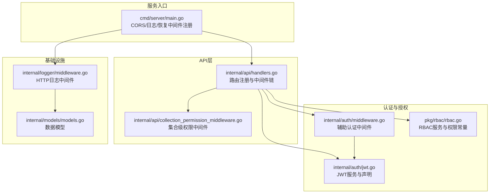
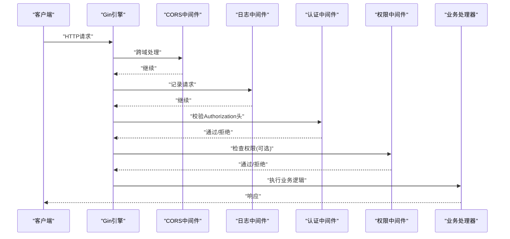
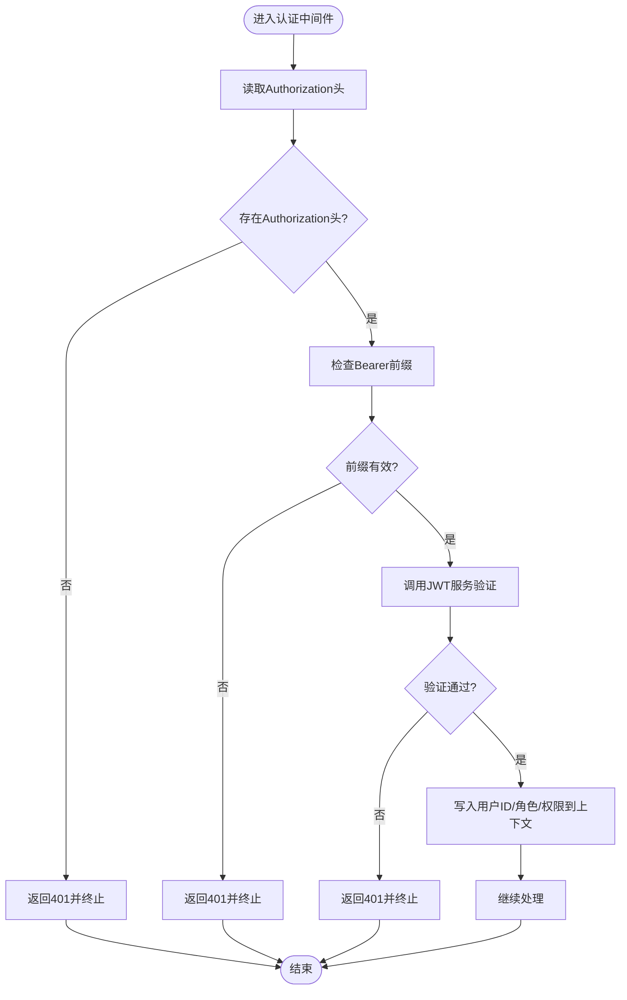
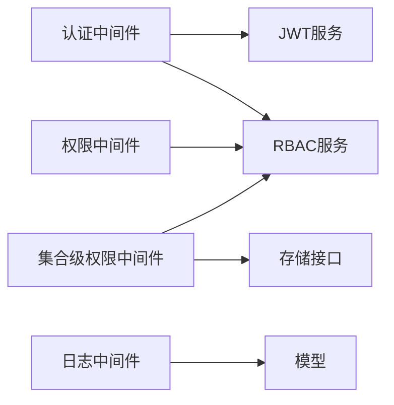

# 认证中间件

<cite>
**本文引用的文件**
- [cmd/server/main.go](file://cmd/server/main.go)
- [internal/api/handlers.go](file://internal/api/handlers.go)
- [internal/auth/jwt.go](file://internal/auth/jwt.go)
- [internal/auth/middleware.go](file://internal/auth/middleware.go)
- [internal/logger/middleware.go](file://internal/logger/middleware.go)
- [internal/api/collection_permission_middleware.go](file://internal/api/collection_permission_middleware.go)
- [pkg/rbac/rbac.go](file://pkg/rbac/rbac.go)
- [internal/models/models.go](file://internal/models/models.go)
- [internal/auth/test/jwt_test.go](file://internal/auth/test/jwt_test.go)
</cite>

## 目录
1. [简介](#简介)
2. [项目结构](#项目结构)
3. [核心组件](#核心组件)
4. [架构总览](#架构总览)
5. [详细组件分析](#详细组件分析)
6. [依赖分析](#依赖分析)
7. [性能考虑](#性能考虑)
8. [故障排查指南](#故障排查指南)
9. [结论](#结论)
10. [附录](#附录)

## 简介
本文件面向“认证中间件”的完整技术文档，聚焦于其在请求处理流水线中的职责、执行顺序、令牌提取与解析、用户身份验证、权限预处理、错误处理、注册与使用方法以及性能优化与缓存策略。文档基于仓库现有实现进行分析，并提供可追溯的源码路径引用，帮助开发者快速理解与正确使用认证中间件。

## 项目结构
认证相关代码主要分布在以下模块：
- 服务入口与中间件注册：cmd/server/main.go
- 认证与权限处理：internal/api/handlers.go
- JWT服务与声明模型：internal/auth/jwt.go
- 辅助认证中间件：internal/auth/middleware.go
- 日志中间件：internal/logger/middleware.go
- 集合级权限中间件：internal/api/collection_permission_middleware.go
- RBAC服务与权限常量：pkg/rbac/rbac.go
- 数据模型：internal/models/models.go
- 认证单元测试：internal/auth/test/jwt_test.go

图表来源
- [cmd/server/main.go:100-118](file://cmd/server/main.go#L100-L118)
- [internal/api/handlers.go:45-181](file://internal/api/handlers.go#L45-L181)
- [internal/auth/middleware.go:11-48](file://internal/auth/middleware.go#L11-L48)
- [internal/auth/jwt.go:20-83](file://internal/auth/jwt.go#L20-L83)
- [internal/logger/middleware.go:25-68](file://internal/logger/middleware.go#L25-L68)
- [internal/api/collection_permission_middleware.go:16-48](file://internal/api/collection_permission_middleware.go#L16-L48)
- [pkg/rbac/rbac.go:55-99](file://pkg/rbac/rbac.go#L55-L99)
- [internal/models/models.go:247-271](file://internal/models/models.go#L247-L271)

章节来源
- [cmd/server/main.go:100-118](file://cmd/server/main.go#L100-L118)
- [internal/api/handlers.go:45-181](file://internal/api/handlers.go#L45-L181)

## 核心组件
- JWT服务与声明
  - JWT服务接口与实现，负责令牌生成、验证与刷新；声明结构包含用户ID、角色列表、权限列表及标准声明。
- 认证中间件
  - 从请求头提取令牌，校验Bearer前缀，调用JWT服务验证，成功后将用户信息写入上下文。
- 权限中间件
  - 基于RBAC服务检查用户是否具备所需权限，支持通配符匹配与超级管理员豁免。
- 集合级权限中间件
  - 针对集合模块的细粒度权限控制，支持从URL参数或请求体读取模块标识。
- 日志中间件
  - 捕获响应体，记录请求耗时、状态码、用户ID等信息，便于审计与排障。

章节来源
- [internal/auth/jwt.go:12-83](file://internal/auth/jwt.go#L12-L83)
- [internal/auth/middleware.go:11-48](file://internal/auth/middleware.go#L11-L48)
- [pkg/rbac/rbac.go:10-42](file://pkg/rbac/rbac.go#L10-L42)
- [internal/api/collection_permission_middleware.go:16-48](file://internal/api/collection_permission_middleware.go#L16-L48)
- [internal/logger/middleware.go:25-68](file://internal/logger/middleware.go#L25-L68)

## 架构总览
认证中间件在请求处理流水线中的位置与顺序如下：
- CORS中间件：处理跨域请求与预检。
- 日志中间件：记录请求与响应信息。
- 认证中间件：校验Authorization头中的Bearer Token。
- 权限中间件：按需检查用户权限。
- 业务处理器：执行具体业务逻辑。

图表来源
- [cmd/server/main.go:100-118](file://cmd/server/main.go#L100-L118)
- [internal/api/handlers.go:260-293](file://internal/api/handlers.go#L260-L293)
- [pkg/rbac/rbac.go:63-99](file://pkg/rbac/rbac.go#L63-L99)

## 详细组件分析

### 认证中间件执行流程
- 令牌提取
  - 从Authorization头读取，要求“Bearer”前缀；若缺失或格式不正确，直接返回401并终止后续处理。
- 令牌解析与验证
  - 调用JWT服务进行签名验证与过期检查；失败时返回401并终止。
- 用户身份注入
  - 成功后将用户ID、角色列表写入上下文；同时从RBAC服务获取最新权限并写入上下文。
- 继续处理
  - 通过c.Next()进入后续中间件或业务处理器。

图表来源
- [internal/auth/middleware.go:11-48](file://internal/auth/middleware.go#L11-L48)
- [internal/api/handlers.go:260-293](file://internal/api/handlers.go#L260-L293)
- [internal/auth/jwt.go:68-83](file://internal/auth/jwt.go#L68-L83)

章节来源
- [internal/auth/middleware.go:11-48](file://internal/auth/middleware.go#L11-L48)
- [internal/api/handlers.go:260-293](file://internal/api/handlers.go#L260-L293)

### 令牌提取机制
- Authorization头
  - 必须为“Bearer <token>”格式；中间件会先拆分空格再判断前缀。
- Cookie与URL参数
  - 当前实现仅从Authorization头提取令牌。若需支持Cookie或URL参数，可在认证中间件中扩展解析逻辑（例如先尝试从Cookie读取，再尝试从URL参数读取，最后回退到Authorization头）。

章节来源
- [internal/auth/middleware.go:14-30](file://internal/auth/middleware.go#L14-L30)
- [internal/api/handlers.go:262-274](file://internal/api/handlers.go#L262-L274)

### 令牌解析过程
- Bearer前缀验证
  - 严格要求“Bearer”前缀，避免非Bearer令牌被接受。
- JWT格式检查
  - 使用标准库解析JWT字符串，确保格式合法。
- 签名验证
  - 使用对称密钥（HMAC-SHA256）验证签名；失败返回错误。
- 过期与有效性
  - 自动检查过期时间；过期令牌可通过刷新接口在刷新窗口内恢复。

章节来源
- [internal/auth/jwt.go:68-83](file://internal/auth/jwt.go#L68-L83)
- [internal/auth/jwt.go:85-111](file://internal/auth/jwt.go#L85-L111)

### 用户身份验证与权限预处理
- 用户信息查找
  - 从JWT声明中获取用户ID；随后通过RBAC服务查询用户角色与权限。
- 角色加载
  - 通过用户ID查询角色列表，用于后续权限判断。
- 权限预处理
  - 从RBAC服务获取用户权限集合，写入上下文供权限中间件使用；同时保留声明中的权限列表作为初始值。

章节来源
- [internal/api/handlers.go:283-289](file://internal/api/handlers.go#L283-L289)
- [pkg/rbac/rbac.go:116-145](file://pkg/rbac/rbac.go#L116-L145)

### 权限中间件与集合级权限中间件
- 权限中间件
  - 从上下文读取用户ID，调用RBAC服务检查是否具备所需权限；支持通配符匹配与超级管理员豁免。
- 集合级权限中间件
  - 从URL参数或请求体读取模块标识，检查集合级权限；支持多种场景（GET/POST/PUT/DELETE）。

章节来源
- [pkg/rbac/rbac.go:63-99](file://pkg/rbac/rbac.go#L63-L99)
- [internal/api/collection_permission_middleware.go:16-48](file://internal/api/collection_permission_middleware.go#L16-L48)
- [internal/api/collection_permission_middleware.go:50-93](file://internal/api/collection_permission_middleware.go#L50-L93)
- [internal/api/collection_permission_middleware.go:95-137](file://internal/api/collection_permission_middleware.go#L95-L137)

### 中间件错误处理机制
- 无效令牌/过期令牌
  - 返回401并终止；日志中间件会记录该请求的错误信息。
- 用户不存在/权限不足
  - 返回403并终止；权限中间件明确提示缺少的权限。
- 缺少Authorization头/非Bearer令牌
  - 返回401并终止；认证中间件给出清晰错误信息。

章节来源
- [internal/auth/middleware.go:16-39](file://internal/auth/middleware.go#L16-L39)
- [internal/api/handlers.go:263-281](file://internal/api/handlers.go#L263-L281)
- [pkg/rbac/rbac.go:63-99](file://pkg/rbac/rbac.go#L63-L99)

### 中间件注册与使用方法
- 服务启动时注册全局中间件
  - CORS中间件：设置跨域头部与预检处理。
  - 日志中间件：记录请求与响应详情。
  - 恢复中间件：防止panic导致进程退出。
- 路由注册
  - 对受保护的API组启用认证中间件；对需要细粒度权限的路由启用权限中间件或集合级权限中间件。

章节来源
- [cmd/server/main.go:100-118](file://cmd/server/main.go#L100-L118)
- [internal/api/handlers.go:49-181](file://internal/api/handlers.go#L49-L181)

### 代码示例（路径引用）
- 认证中间件函数定义与调用
  - [internal/auth/middleware.go:11-48](file://internal/auth/middleware.go#L11-L48)
  - [internal/api/handlers.go:260-293](file://internal/api/handlers.go#L260-L293)
- JWT服务接口与实现
  - [internal/auth/jwt.go:20-83](file://internal/auth/jwt.go#L20-L83)
  - [internal/auth/jwt.go:85-111](file://internal/auth/jwt.go#L85-L111)
- 权限中间件
  - [pkg/rbac/rbac.go:63-99](file://pkg/rbac/rbac.go#L63-L99)
  - [internal/api/handlers.go:295-314](file://internal/api/handlers.go#L295-L314)
- 集合级权限中间件
  - [internal/api/collection_permission_middleware.go:16-48](file://internal/api/collection_permission_middleware.go#L16-L48)
  - [internal/api/collection_permission_middleware.go:50-93](file://internal/api/collection_permission_middleware.go#L50-L93)
  - [internal/api/collection_permission_middleware.go:95-137](file://internal/api/collection_permission_middleware.go#L95-L137)
- 服务启动与中间件注册
  - [cmd/server/main.go:100-118](file://cmd/server/main.go#L100-L118)
- 登录流程与权限注入
  - [internal/api/handlers.go:183-221](file://internal/api/handlers.go#L183-L221)

## 依赖分析
- 认证中间件依赖
  - JWT服务接口：用于令牌验证。
  - RBAC服务：用于权限查询与匹配。
- 权限中间件依赖
  - RBAC服务：用于权限检查与通配符匹配。
- 集合级权限中间件依赖
  - RBAC服务：用于集合级权限检查。
  - 存储接口：用于读取字段定义（在特定中间件中）。
- 日志中间件依赖
  - 上下文中的用户ID：用于记录用户信息。

图表来源
- [internal/api/handlers.go:260-293](file://internal/api/handlers.go#L260-L293)
- [pkg/rbac/rbac.go:63-99](file://pkg/rbac/rbac.go#L63-L99)
- [internal/api/collection_permission_middleware.go:16-48](file://internal/api/collection_permission_middleware.go#L16-L48)
- [internal/logger/middleware.go:25-68](file://internal/logger/middleware.go#L25-L68)

章节来源
- [internal/api/handlers.go:260-293](file://internal/api/handlers.go#L260-L293)
- [pkg/rbac/rbac.go:63-99](file://pkg/rbac/rbac.go#L63-L99)
- [internal/api/collection_permission_middleware.go:16-48](file://internal/api/collection_permission_middleware.go#L16-L48)
- [internal/logger/middleware.go:25-68](file://internal/logger/middleware.go#L25-L68)

## 性能考虑
- 令牌验证成本
  - JWT验证为CPU密集型操作，建议合理设置过期时间，避免频繁刷新。
- 权限查询优化
  - 当前实现每次认证都会查询用户权限；可引入本地缓存（如内存缓存）降低RBAC查询频率，注意缓存失效策略与一致性。
- 日志开销
  - 日志中间件会捕获响应体，对大响应体有额外内存与序列化开销；可根据场景调整日志级别或采样。
- 并发与锁
  - JWT服务与RBAC服务应保证并发安全；如引入缓存，需考虑读写锁或原子更新。

[本节为通用性能建议，不直接分析具体文件]

## 故障排查指南
- 常见错误与定位
  - 401 未授权：检查Authorization头格式、Bearer前缀、令牌有效性与过期时间。
  - 403 权限不足：确认用户角色与权限映射、通配符匹配规则、是否为超级管理员。
  - 500 服务器错误：关注JWT生成失败、RBAC查询异常、存储连接问题。
- 日志与审计
  - 日志中间件会记录请求路径、状态码、耗时与用户ID；结合错误码快速定位问题。
- 单元测试参考
  - 通过JWT服务的单元测试了解生成、验证与刷新的预期行为。

章节来源
- [internal/logger/middleware.go:25-68](file://internal/logger/middleware.go#L25-L68)
- [internal/auth/test/jwt_test.go:10-79](file://internal/auth/test/jwt_test.go#L10-L79)

## 结论
认证中间件在请求处理流水线中承担“令牌校验与用户身份注入”的关键职责，配合权限中间件与集合级权限中间件形成完整的鉴权体系。当前实现简洁可靠，建议在生产环境中结合缓存与更丰富的令牌来源（如Cookie/URL参数）进一步增强可用性与安全性。

[本节为总结性内容，不直接分析具体文件]

## 附录
- 关键数据模型
  - 用户、角色、权限与集合角色等模型定义，支撑RBAC与集合级权限控制。
- 环境变量与初始化
  - JWT密钥、过期时间与刷新窗口通过环境变量注入；服务启动时完成初始化。

章节来源
- [internal/models/models.go:247-271](file://internal/models/models.go#L247-L271)
- [cmd/server/main.go:72-76](file://cmd/server/main.go#L72-L76)