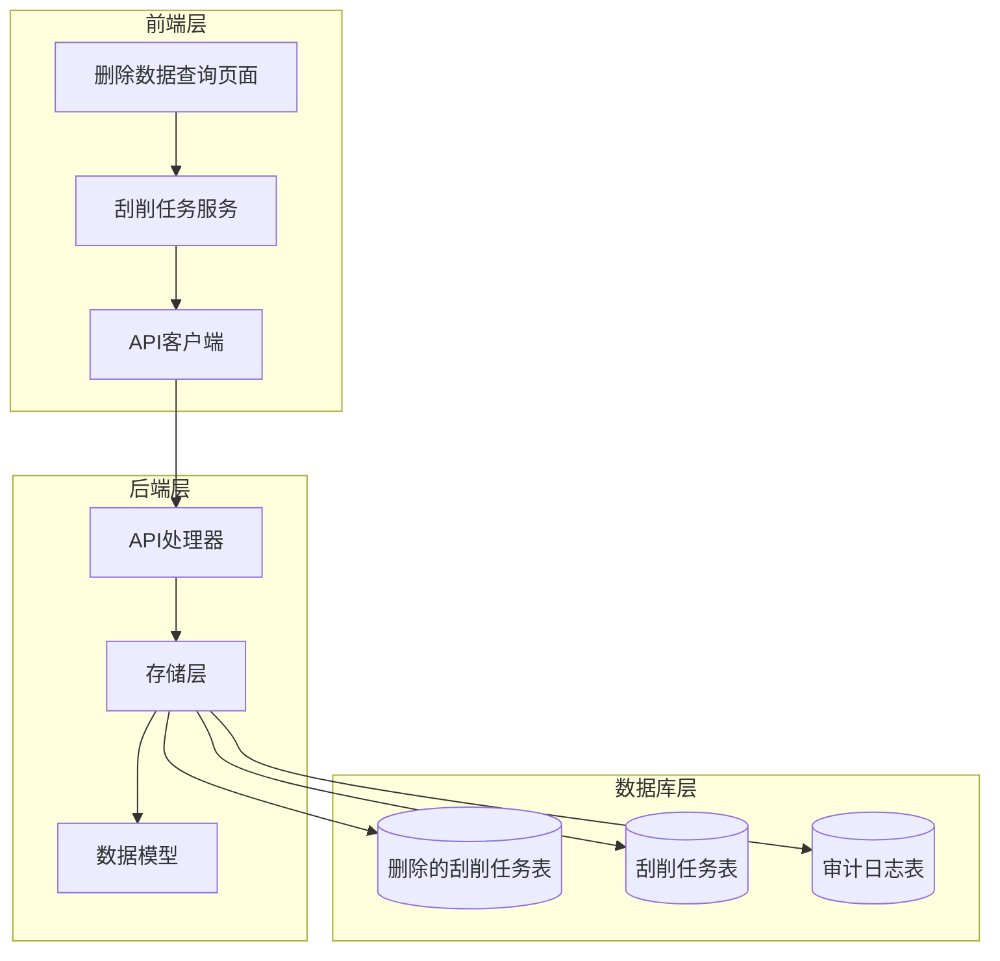
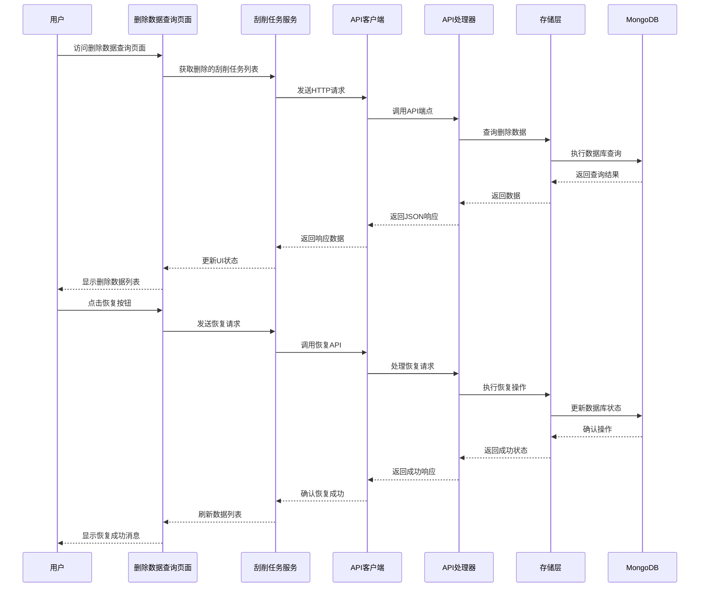
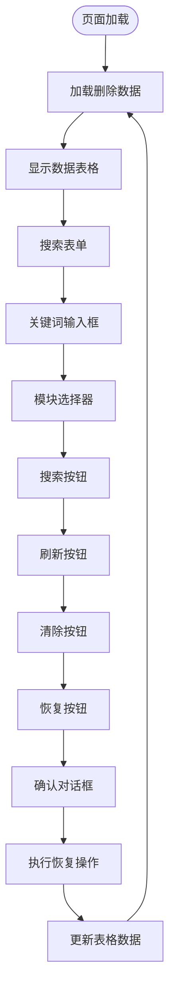
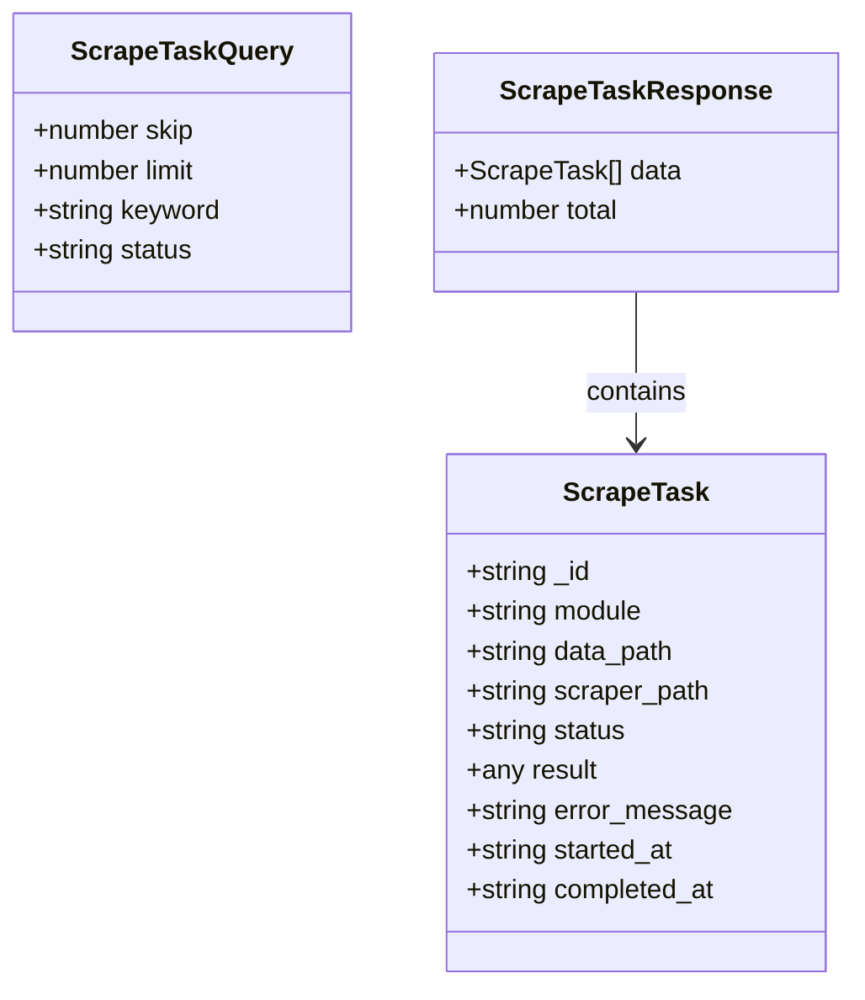
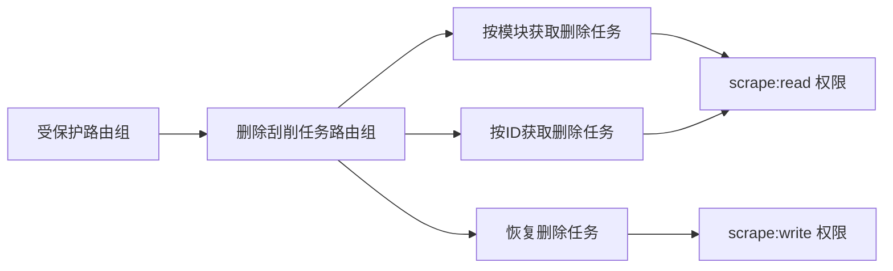
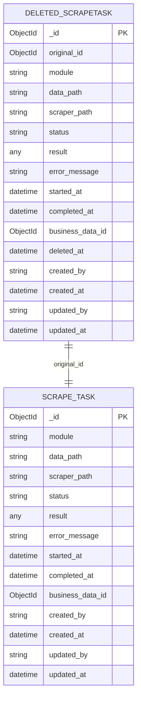
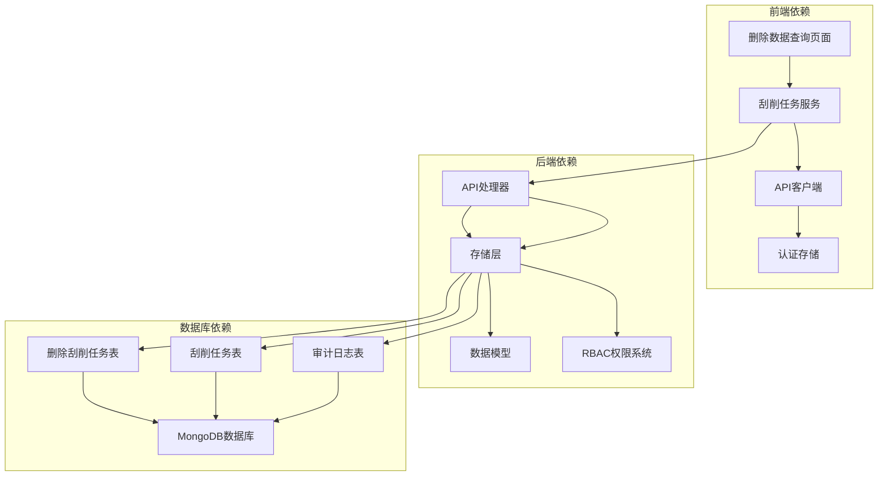

# 删除数据查询页面

<cite>
**本文档引用的文件**
- [DeletedScraperPage.tsx](file://frontend/src/pages/Admin/DeletedScraperPage.tsx)
- [scraper.ts](file://frontend/src/services/scraper.ts)
- [api.ts](file://frontend/src/services/api.ts)
- [handlers.go](file://internal/api/handlers.go)
- [mongodb_storage.go](file://internal/storage/mongodb_storage.go)
- [models.go](file://internal/models/models.go)
- [rbac.go](file://pkg/rbac/rbac.go)
- [e2e.go](file://test/e2e.go)
</cite>

## 目录
1. [简介](#简介)
2. [项目结构](#项目结构)
3. [核心组件](#核心组件)
4. [架构概览](#架构概览)
5. [详细组件分析](#详细组件分析)
6. [依赖关系分析](#依赖关系分析)
7. [性能考虑](#性能考虑)
8. [故障排除指南](#故障排除指南)
9. [结论](#结论)

## 简介

删除数据查询页面是一个专门用于管理和恢复已删除数据的功能模块。该页面提供了完整的软删除数据展示、数据恢复操作和删除历史追踪功能。系统采用软删除机制，通过独立的删除数据集合来保存被删除的数据记录，确保数据安全性和可恢复性。

该功能支持多种查询方式，包括按模块筛选、关键词搜索等，并提供直观的数据预览功能。用户可以通过简单的点击操作完成数据恢复，同时系统会自动记录相关的操作日志和审计信息。

## 项目结构

删除数据查询功能涉及前后端多个层次的协作，形成了清晰的分层架构：

**图表来源**
- [DeletedScraperPage.tsx:1-153](file://frontend/src/pages/Admin/DeletedScraperPage.tsx#L1-L153)
- [handlers.go:146-159](file://internal/api/handlers.go#L146-L159)
- [mongodb_storage.go:16-25](file://internal/storage/mongodb_storage.go#L16-L25)

**章节来源**
- [DeletedScraperPage.tsx:1-153](file://frontend/src/pages/Admin/DeletedScraperPage.tsx#L1-L153)
- [handlers.go:146-159](file://internal/api/handlers.go#L146-L159)

## 核心组件

删除数据查询功能由多个核心组件构成，每个组件都有明确的职责和功能：

### 前端组件

1. **删除数据查询页面** - 主要UI组件，提供数据展示和交互功能
2. **刮削任务服务** - 封装API调用，处理数据请求和响应
3. **API客户端** - 管理HTTP请求，处理认证和错误

### 后端组件

1. **API处理器** - 处理HTTP请求，协调业务逻辑
2. **存储层** - 管理数据持久化，提供CRUD操作
3. **数据模型** - 定义数据结构和业务规则

### 数据库组件

1. **删除刮削任务集合** - 存储已删除的刮削任务
2. **审计日志集合** - 记录所有重要操作的历史

**章节来源**
- [DeletedScraperPage.tsx:6-153](file://frontend/src/pages/Admin/DeletedScraperPage.tsx#L6-L153)
- [scraper.ts:35-105](file://frontend/src/services/scraper.ts#L35-L105)
- [mongodb_storage.go:16-25](file://internal/storage/mongodb_storage.go#L16-L25)

## 架构概览

删除数据查询功能采用分层架构设计，确保了良好的可维护性和扩展性：

**图表来源**
- [DeletedScraperPage.tsx:13-62](file://frontend/src/pages/Admin/DeletedScraperPage.tsx#L13-L62)
- [scraper.ts:56-85](file://frontend/src/services/scraper.ts#L56-L85)
- [handlers.go:1334-1385](file://internal/api/handlers.go#L1334-L1385)

## 详细组件分析

### 删除数据查询页面组件

删除数据查询页面是用户交互的核心组件，提供了完整的数据管理和恢复功能：

#### 页面布局和功能

**图表来源**
- [DeletedScraperPage.tsx:68-108](file://frontend/src/pages/Admin/DeletedScraperPage.tsx#L68-L108)
- [DeletedScraperPage.tsx:13-62](file://frontend/src/pages/Admin/DeletedScraperPage.tsx#L13-L62)

#### 数据表格配置

页面使用Ant Design的Table组件，配置了完整的列定义和操作功能：

| 列名称 | 数据字段 | 显示内容 | 功能 |
|--------|----------|----------|------|
| 模块 | module | 模块名称 | 显示数据所属模块 |
| 刮削器路径 | scraper_path | 刮削器路径 | 显示刮削器文件路径 |
| 数据路径 | data_path | 数据路径 | 显示数据文件路径 |
| 创建时间 | created_at | 创建时间 | 显示数据创建时间 |
| 状态 | status | 状态 | 显示红色状态标识 |
| 操作 | action | 恢复按钮 | 提供数据恢复功能 |

#### 搜索和过滤功能

页面支持多种搜索方式：

1. **关键词搜索** - 支持按模块名称进行模糊匹配
2. **模块筛选** - 支持按特定模块筛选数据
3. **分页功能** - 支持大数据量的分页浏览
4. **实时刷新** - 支持手动刷新数据列表

**章节来源**
- [DeletedScraperPage.tsx:68-148](file://frontend/src/pages/Admin/DeletedScraperPage.tsx#L68-L148)

### 刮削任务服务组件

刮削任务服务封装了所有与删除数据相关的API调用，提供了简洁的接口给前端页面使用：

#### API端点定义

服务组件定义了三个主要的API端点：

1. **获取删除的刮削任务** - `/api/deleted-scraper/module/:module`
2. **恢复刮削任务** - `/api/deleted-scraper/:id/recover`
3. **获取删除任务详情** - `/api/deleted-scraper/:id`

#### 请求参数和响应格式

**图表来源**
- [scraper.ts:23-33](file://frontend/src/services/scraper.ts#L23-L33)
- [scraper.ts:4-21](file://frontend/src/services/scraper.ts#L4-L21)

#### 错误处理机制

服务组件实现了完善的错误处理机制：

1. **网络错误处理** - 捕获并处理网络请求异常
2. **服务器错误处理** - 处理HTTP状态码错误
3. **用户友好提示** - 提供清晰的错误信息反馈
4. **状态管理** - 管理加载状态和错误状态

**章节来源**
- [scraper.ts:56-85](file://frontend/src/services/scraper.ts#L56-L85)

### API处理器组件

API处理器负责处理来自前端的所有HTTP请求，协调业务逻辑和数据访问：

#### 路由配置

处理器定义了专门的路由组来管理删除数据相关的操作：

**图表来源**
- [handlers.go:153-159](file://internal/api/handlers.go#L153-L159)

#### 权限控制

所有删除数据操作都受到严格的权限控制：

1. **读取权限** - 需要 `scrape:read` 权限
2. **写入权限** - 需要 `scrape:write` 权限
3. **中间件验证** - 自动验证用户身份和权限
4. **操作日志** - 记录所有权限相关的操作

**章节来源**
- [handlers.go:153-159](file://internal/api/handlers.go#L153-L159)

### 存储层组件

存储层提供了完整的数据持久化能力，支持软删除和数据恢复操作：

#### 数据模型设计

**图表来源**
- [models.go:297-311](file://internal/models/models.go#L297-L311)
- [models.go:282-295](file://internal/models/models.go#L282-L295)

#### 软删除实现流程

软删除操作遵循严格的流程：

1. **数据查找** - 从活动任务表中查找目标数据
2. **数据复制** - 将数据复制到删除任务表
3. **状态标记** - 设置删除时间戳
4. **原数据删除** - 从活动任务表中删除原始数据
5. **事务保证** - 确保操作的原子性

#### 数据恢复实现流程

数据恢复操作同样遵循严格的流程：

1. **删除记录查找** - 从删除任务表中查找目标记录
2. **数据重建** - 根据删除记录重建原始数据结构
3. **集合定位** - 根据模块信息定位正确的数据集合
4. **数据插入** - 将数据重新插入到活动数据表
5. **记录清理** - 从删除任务表中删除对应记录

**章节来源**
- [mongodb_storage.go:648-686](file://internal/storage/mongodb_storage.go#L648-L686)
- [mongodb_storage.go:721-744](file://internal/storage/mongodb_storage.go#L721-L744)

## 依赖关系分析

删除数据查询功能涉及多个组件之间的复杂依赖关系：

**图表来源**
- [DeletedScraperPage.tsx:1-5](file://frontend/src/pages/Admin/DeletedScraperPage.tsx#L1-L5)
- [handlers.go:146-159](file://internal/api/handlers.go#L146-L159)
- [mongodb_storage.go:16-25](file://internal/storage/mongodb_storage.go#L16-L25)

### 组件耦合度分析

系统采用了松耦合的设计原则：

1. **前端与后端解耦** - 通过RESTful API进行通信
2. **服务层抽象** - 刮削任务服务提供统一的接口
3. **存储层抽象** - 存储层隐藏具体的数据库操作细节
4. **权限系统独立** - RBAC权限系统独立于业务逻辑

### 循环依赖检测

经过分析，系统没有发现循环依赖问题：

1. **前端到后端** - 单向数据流
2. **服务到处理器** - 单向依赖关系
3. **存储到模型** - 单向依赖关系
4. **权限到处理器** - 单向权限检查

**章节来源**
- [rbac.go:10-42](file://pkg/rbac/rbac.go#L10-L42)

## 性能考虑

删除数据查询功能在设计时充分考虑了性能优化：

### 数据库性能优化

1. **索引策略**
   - 删除任务表按模块建立索引
   - 删除时间建立时间索引
   - 原始ID建立唯一索引

2. **查询优化**
   - 使用投影减少数据传输
   - 实现分页查询避免全表扫描
   - 缓存常用查询结果

3. **存储优化**
   - 删除任务表独立存储
   - 避免重复数据冗余
   - 定期清理过期数据

### 前端性能优化

1. **渲染优化**
   - 表格虚拟滚动支持大数据集
   - 懒加载减少初始渲染时间
   - 状态缓存避免重复计算

2. **网络优化**
   - 请求去重避免重复请求
   - 批量操作减少请求次数
   - 错误重试机制

### 缓存策略

系统实现了多层次的缓存策略：

1. **浏览器缓存** - API响应缓存
2. **应用缓存** - 前端状态缓存
3. **数据库缓存** - 查询结果缓存

## 故障排除指南

### 常见问题及解决方案

#### 数据无法显示

**问题描述** - 删除数据查询页面无法显示任何数据

**可能原因**
1. 数据库连接失败
2. 权限不足
3. 网络请求超时

**解决步骤**
1. 检查数据库连接状态
2. 验证用户权限
3. 查看网络连接情况
4. 检查API端点可用性

#### 恢复操作失败

**问题描述** - 点击恢复按钮后操作失败

**可能原因**
1. 删除记录不存在
2. 权限不足
3. 数据库操作异常

**解决步骤**
1. 确认删除记录状态
2. 验证恢复权限
3. 检查数据库状态
4. 查看错误日志

#### 搜索功能异常

**问题描述** - 关键词搜索无法正常工作

**可能原因**
1. 搜索参数格式错误
2. 数据库查询异常
3. 前端状态管理问题

**解决步骤**
1. 验证搜索参数格式
2. 检查数据库查询语句
3. 重置搜索状态
4. 刷新页面

### 调试工具和方法

#### 前端调试

1. **浏览器开发者工具** - 检查网络请求和响应
2. **React DevTools** - 分析组件状态变化
3. **Redux DevTools** - 调试状态管理

#### 后端调试

1. **日志分析** - 查看API调用日志
2. **数据库监控** - 监控查询性能
3. **错误追踪** - 分析异常堆栈

**章节来源**
- [e2e.go:646-744](file://test/e2e.go#L646-L744)

## 结论

删除数据查询页面是一个功能完整、设计合理的数据管理功能模块。它成功地实现了软删除数据的展示、数据恢复操作和删除历史追踪等核心功能。

### 主要优势

1. **用户体验优秀** - 提供直观的界面和流畅的操作体验
2. **安全性强** - 实现了完善的权限控制和审计日志
3. **可扩展性好** - 采用分层架构设计，便于功能扩展
4. **性能优化** - 实现了多层性能优化策略

### 技术亮点

1. **软删除机制** - 通过独立集合保存删除数据，确保数据安全
2. **权限控制** - 实现了细粒度的RBAC权限管理
3. **审计日志** - 完整记录所有重要操作的历史
4. **错误处理** - 提供完善的错误处理和用户反馈机制

### 改进建议

1. **批量操作** - 可以增加批量恢复和批量删除功能
2. **高级搜索** - 可以增加更复杂的搜索条件和过滤选项
3. **数据预览** - 可以增加数据预览功能，让用户更好地了解数据内容
4. **导出功能** - 可以增加数据导出功能，方便用户备份和迁移

该功能模块为整个系统的数据管理提供了坚实的基础，为用户提供了安全、可靠、易用的数据恢复能力。