# 刮削中心页面

<cite>
**本文档引用的文件**
- [ScraperCenter.tsx](file://frontend/src/pages/Admin/ScraperCenter.tsx)
- [scraper.ts](file://frontend/src/services/scraper.ts)
- [api.ts](file://frontend/src/services/api.ts)
- [scraper.go](file://internal/scraper/scraper.go)
- [handlers.go](file://internal/api/handlers.go)
- [models.go](file://internal/models/models.go)
- [mongodb_storage.go](file://internal/storage/mongodb_storage.go)
- [main.go](file://cmd/server/main.go)
- [config.yaml](file://configs/config.yaml)
- [logging.md](file://docs/logging.md)
- [architecture.md](file://docs/architecture.md)
- [e2e.go](file://test/e2e.go)
</cite>

## 目录
1. [简介](#简介)
2. [项目结构](#项目结构)
3. [核心组件](#核心组件)
4. [架构概览](#架构概览)
5. [详细组件分析](#详细组件分析)
6. [依赖关系分析](#依赖关系分析)
7. [性能考虑](#性能考虑)
8. [故障排除指南](#故障排除指南)
9. [结论](#结论)

## 简介

刮削中心页面是数据管理中心的核心功能模块，负责管理刮削任务的全生命周期。该系统提供了完整的刮削任务管理能力，包括任务创建、执行监控、状态跟踪、日志查看和配置管理等功能。

系统采用前后端分离架构，前端使用React + Ant Design构建用户界面，后端基于Go语言开发，使用Gin框架提供RESTful API服务。整个系统通过MongoDB进行数据持久化，支持多工作线程并发处理刮削任务。

## 项目结构

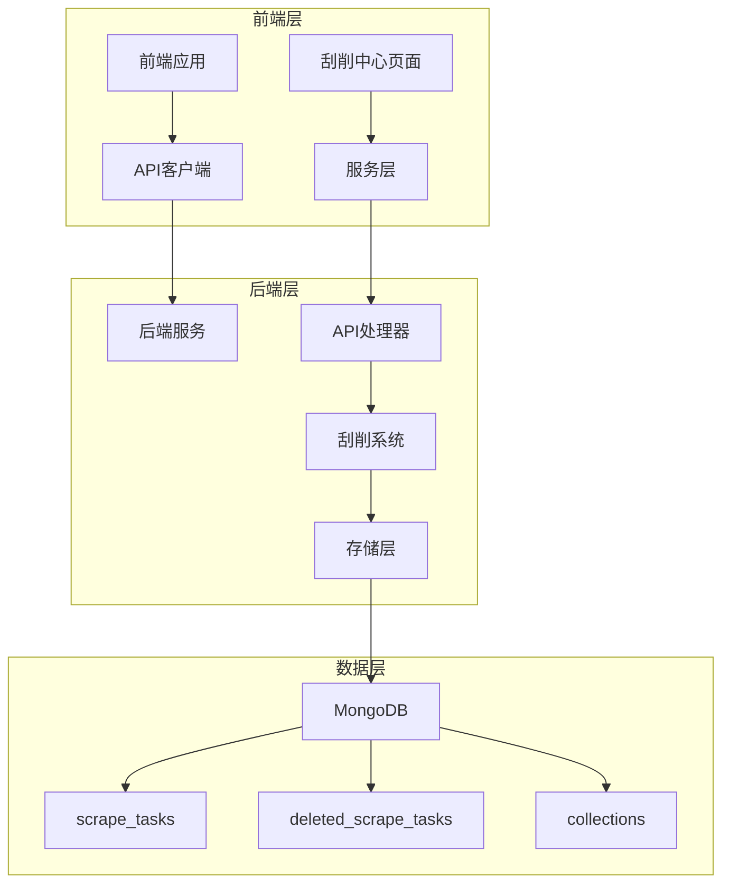

**图表来源**
- [main.go:120-127](file://cmd/server/main.go#L120-L127)
- [ScraperCenter.tsx:1-500](file://frontend/src/pages/Admin/ScraperCenter.tsx#L1-L500)

**章节来源**
- [main.go:1-167](file://cmd/server/main.go#L1-L167)
- [config.yaml:1-26](file://configs/config.yaml#L1-L26)

## 核心组件

### 前端组件架构

刮削中心页面采用React函数组件设计，集成了完整的任务管理功能：

- **任务列表管理**：支持分页显示、搜索过滤、批量操作
- **任务创建界面**：提供表单验证和实时反馈
- **任务状态监控**：可视化展示任务执行状态
- **重试和恢复功能**：支持失败任务的重新执行和删除任务的恢复

### 后端服务架构

后端服务采用分层架构设计：

- **API层**：处理HTTP请求和响应
- **业务逻辑层**：实现刮削系统的业务规则
- **存储层**：提供数据持久化服务
- **刮削引擎**：负责实际的刮削任务执行

**章节来源**
- [ScraperCenter.tsx:7-498](file://frontend/src/pages/Admin/ScraperCenter.tsx#L7-L498)
- [scraper.go:18-289](file://internal/scraper/scraper.go#L18-L289)

## 架构概览

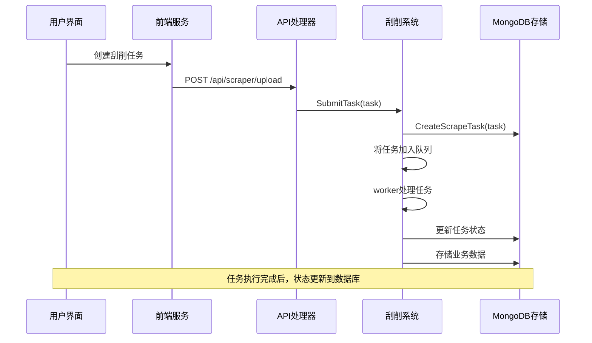

**图表来源**
- [handlers.go:1189-1226](file://internal/api/handlers.go#L1189-L1226)
- [scraper.go:74-193](file://internal/scraper/scraper.go#L74-L193)

系统采用事件驱动架构，通过任务队列实现异步处理。每个工作协程从队列中取出任务并执行，确保系统的高并发处理能力。

**章节来源**
- [architecture.md:522-552](file://docs/architecture.md#L522-L552)
- [scraper.go:47-72](file://internal/scraper/scraper.go#L47-L72)

## 详细组件分析

### 刮削任务管理组件

#### 任务创建界面

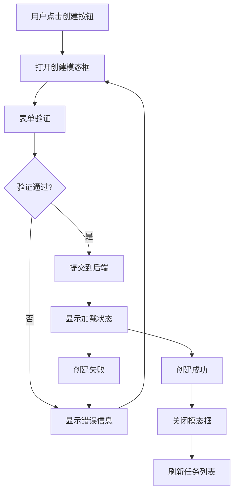

**图表来源**
- [ScraperCenter.tsx:373-495](file://frontend/src/pages/Admin/ScraperCenter.tsx#L373-L495)
- [scraper.ts:87-96](file://frontend/src/services/scraper.ts#L87-L96)

任务创建界面包含以下关键字段：
- **模块选择**：从可用模块中选择目标模块
- **数据路径**：指定数据文件的存储路径
- **刮削器路径**：指定Python刮削器脚本的路径
- **描述信息**：可选的任务描述

#### 任务状态监控

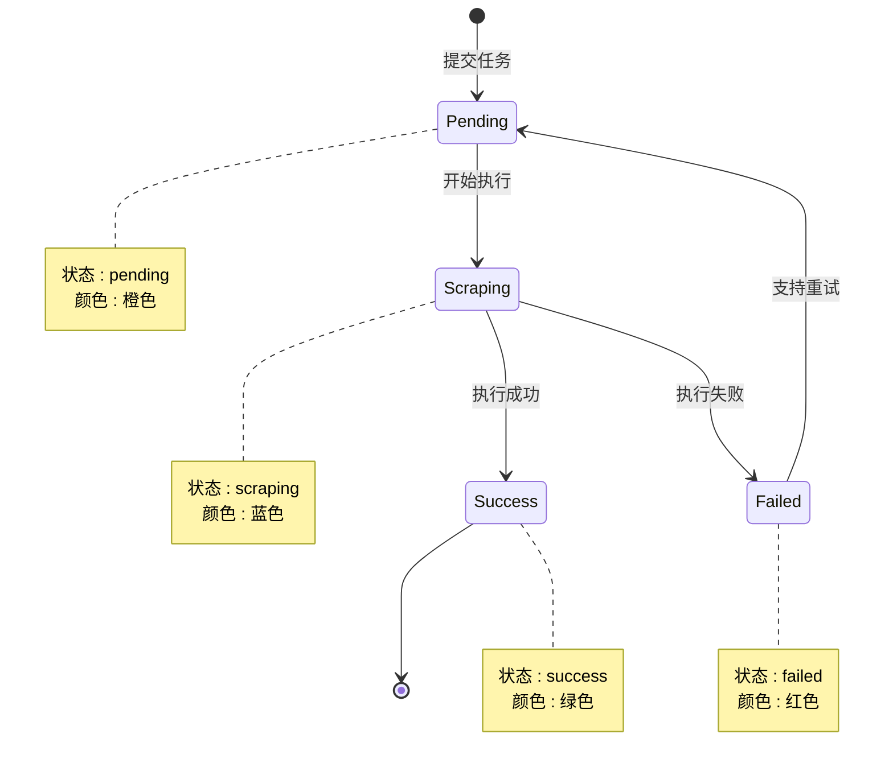

**图表来源**
- [models.go:273-280](file://internal/models/models.go#L273-L280)
- [ScraperCenter.tsx:229-251](file://frontend/src/pages/Admin/ScraperCenter.tsx#L229-L251)

系统支持四种任务状态：
- **待处理 (pending)**：任务已提交但尚未开始执行
- **执行中 (scraping)**：任务正在被工作协程处理
- **成功 (success)**：任务执行完成且结果有效
- **失败 (failed)**：任务执行过程中发生错误

#### 任务日志查看

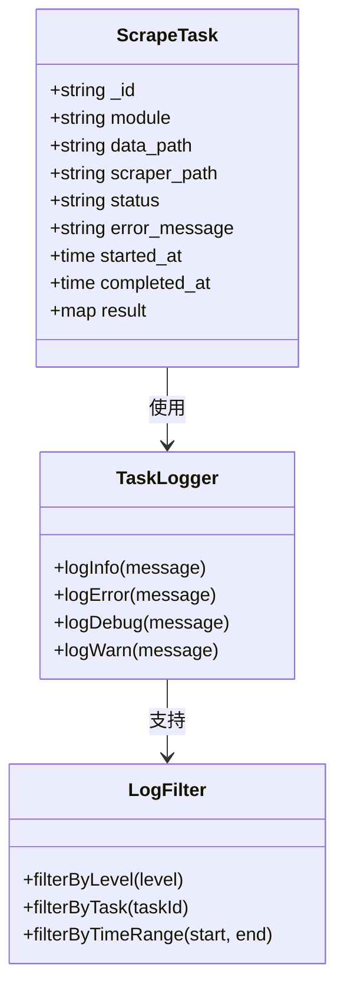

**图表来源**
- [models.go:282-295](file://internal/models/models.go#L282-L295)
- [scraper.go:123-193](file://internal/scraper/scraper.go#L123-L193)

日志系统提供以下功能：
- **状态变更日志**：记录任务状态的每次变化
- **错误追踪**：详细记录执行过程中的错误信息
- **性能监控**：记录任务执行时间和资源使用情况
- **审计跟踪**：完整记录所有用户操作

**章节来源**
- [ScraperCenter.tsx:203-306](file://frontend/src/pages/Admin/ScraperCenter.tsx#L203-L306)
- [scraper.go:123-193](file://internal/scraper/scraper.go#L123-L193)

### 刮削器管理组件

#### 刮削器上传和版本管理

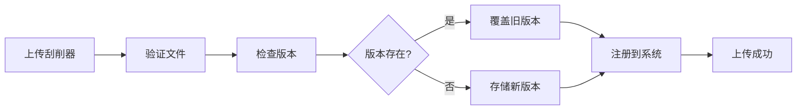

**图表来源**
- [scraper.go:195-231](file://internal/scraper/scraper.go#L195-L231)
- [mongodb_storage.go:755-776](file://internal/storage/mongodb_storage.go#L755-L776)

刮削器管理系统支持：
- **文件验证**：检查Python脚本的有效性和完整性
- **版本控制**：管理不同版本的刮削器
- **权限控制**：限制刮削器的访问和执行权限
- **性能监控**：跟踪刮削器的执行效率

#### 性能监控

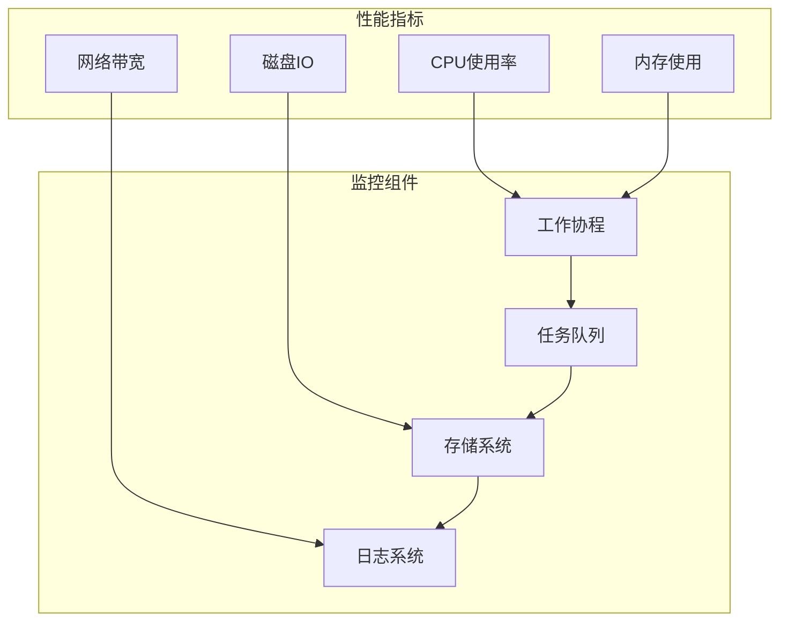

**图表来源**
- [scraper.go:101-120](file://internal/scraper/scraper.go#L101-L120)
- [scraper.go:233-288](file://internal/scraper/scraper.go#L233-L288)

### 任务调度和资源管理

#### 调度机制

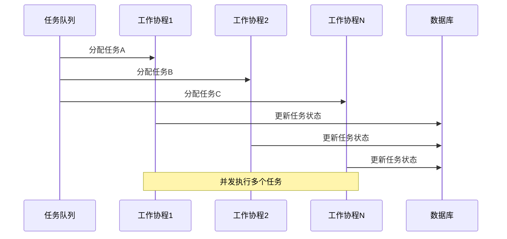

**图表来源**
- [scraper.go:101-120](file://internal/scraper/scraper.go#L101-L120)
- [scraper.go:47-58](file://internal/scraper/scraper.go#L47-L58)

系统采用以下调度策略：
- **公平调度**：所有工作协程平均分配任务负载
- **优先级处理**：支持任务优先级排序
- **资源限制**：防止系统过载
- **故障恢复**：自动重启失败的工作协程

**章节来源**
- [scraper.go:26-45](file://internal/scraper/scraper.go#L26-L45)
- [main.go:65-69](file://cmd/server/main.go#L65-L69)

## 依赖关系分析

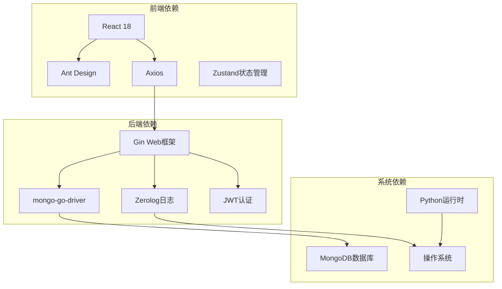

**图表来源**
- [main.go:3-22](file://cmd/server/main.go#L3-L22)
- [api.ts:1-37](file://frontend/src/services/api.ts#L1-L37)

**章节来源**
- [main.go:152-167](file://cmd/server/main.go#L152-L167)
- [scraper.ts:1-105](file://frontend/src/services/scraper.ts#L1-L105)

## 性能考虑

### 并发处理优化

系统通过多工作协程实现高并发处理：

- **工作协程池**：默认4个工作协程，可根据需要调整
- **任务队列缓冲**：1000个任务的队列容量
- **内存管理**：及时清理已完成任务的内存占用
- **连接池**：数据库连接的高效复用

### 存储性能优化

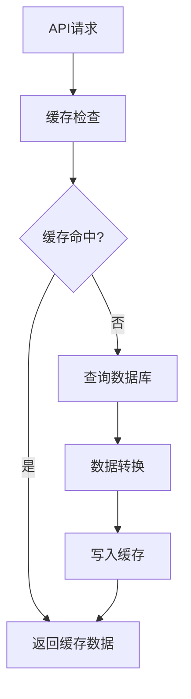

**图表来源**
- [mongodb_storage.go:603-623](file://internal/storage/mongodb_storage.go#L603-L623)
- [scraper.go:123-193](file://internal/scraper/scraper.go#L123-L193)

### 监控和告警

系统提供全面的性能监控：

- **实时指标**：CPU、内存、磁盘、网络使用率
- **任务统计**：任务执行成功率、平均耗时
- **错误监控**：异常错误的实时告警
- **性能分析**：历史趋势分析和瓶颈识别

## 故障排除指南

### 常见问题诊断

#### 任务无法创建

**可能原因**：
1. 模块未正确配置
2. 数据路径不存在
3. 刮削器文件权限不足
4. 网络连接问题

**解决步骤**：
1. 检查模块配置是否正确
2. 验证数据文件路径和权限
3. 确认刮削器文件可执行
4. 查看系统日志获取详细错误信息

#### 任务执行失败

**可能原因**：
1. 刮削器脚本错误
2. 数据格式不匹配
3. 网络超时
4. 资源不足

**解决步骤**：
1. 检查刮削器脚本的语法和逻辑
2. 验证数据格式符合预期
3. 检查网络连接稳定性
4. 监控系统资源使用情况

#### 性能问题

**症状**：
- 任务处理延迟增加
- 系统响应缓慢
- 内存使用过高

**解决方案**：
1. 增加工作协程数量
2. 优化刮削器脚本性能
3. 调整数据库索引
4. 升级硬件资源配置

**章节来源**
- [logging.md:114-146](file://docs/logging.md#L114-L146)
- [scraper.go:142-160](file://internal/scraper/scraper.go#L142-L160)

### 调试工具

#### 日志分析

系统提供详细的日志记录：

- **请求日志**：记录所有API请求的详细信息
- **任务日志**：跟踪每个任务的完整生命周期
- **错误日志**：捕获和记录所有异常情况
- **性能日志**：监控系统性能指标

#### 性能分析

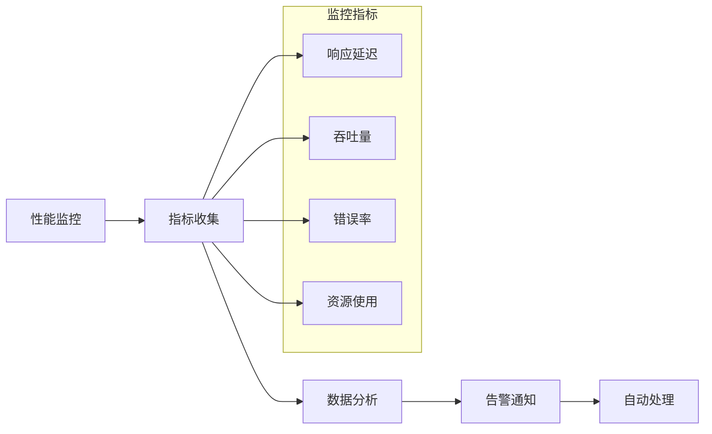

**图表来源**
- [logging.md:76-146](file://docs/logging.md#L76-L146)
- [scraper.go:123-193](file://internal/scraper/scraper.go#L123-L193)

**章节来源**
- [e2e.go:517-560](file://test/e2e.go#L517-L560)
- [scraper.go:123-193](file://internal/scraper/scraper.go#L123-L193)

## 结论

刮削中心页面是一个功能完整、架构清晰的刮削任务管理系统。系统通过前后端分离的设计实现了良好的用户体验，通过事件驱动的架构确保了高效的并发处理能力。

主要优势包括：
- **完整的功能覆盖**：从任务创建到结果管理的全流程支持
- **强大的扩展性**：模块化的架构便于功能扩展和维护
- **可靠的性能表现**：多工作协程和优化的存储方案保证了系统性能
- **完善的监控体系**：全面的日志记录和性能监控确保系统稳定运行

未来可以考虑的功能改进：
- 增加任务优先级管理功能
- 实现更细粒度的权限控制
- 添加任务模板和批量操作
- 优化前端用户体验和交互设计