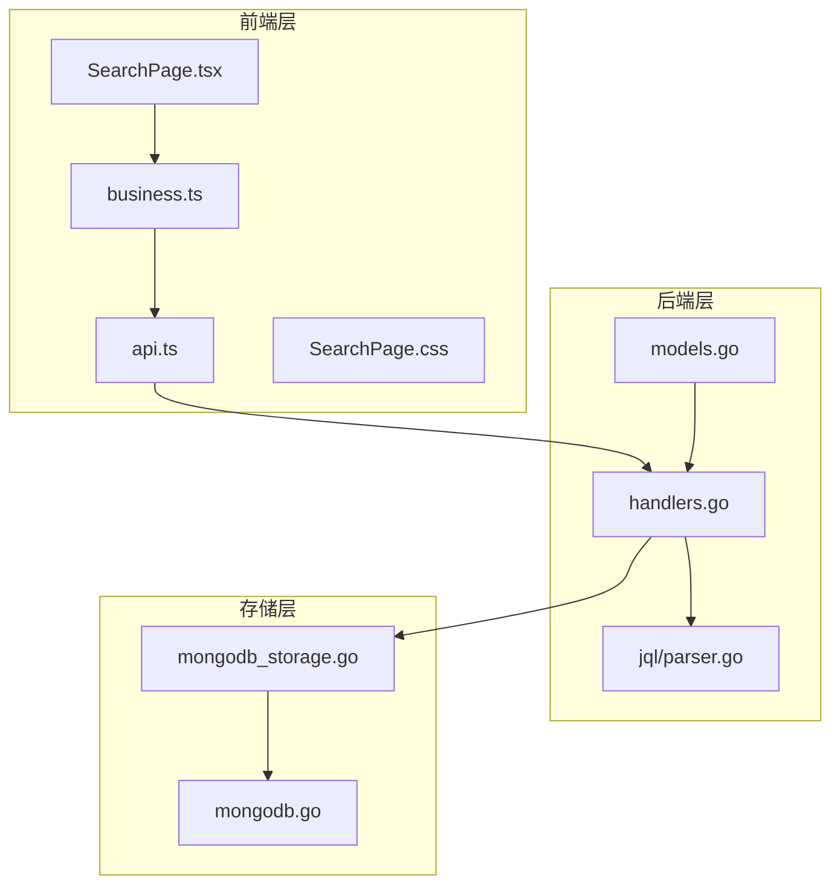
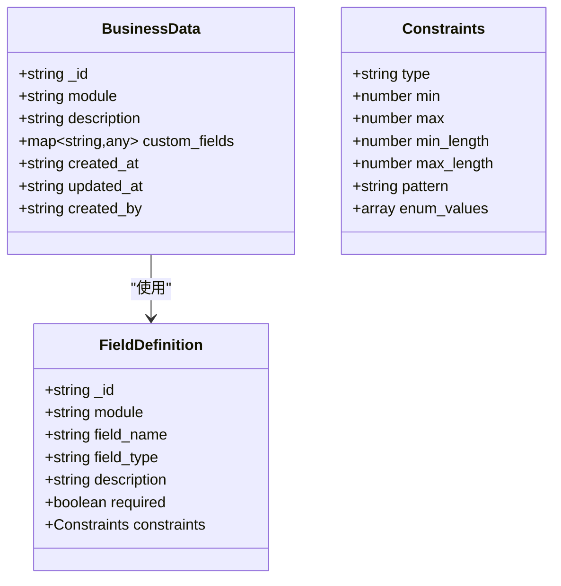
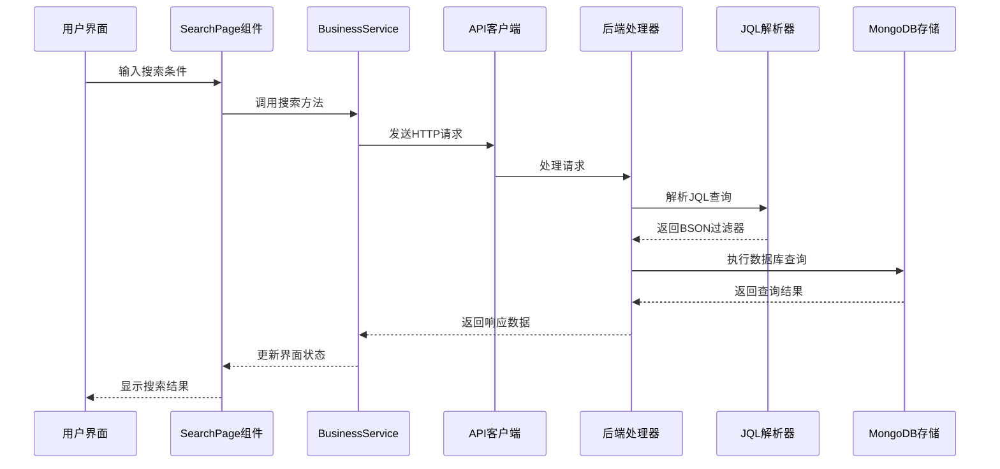
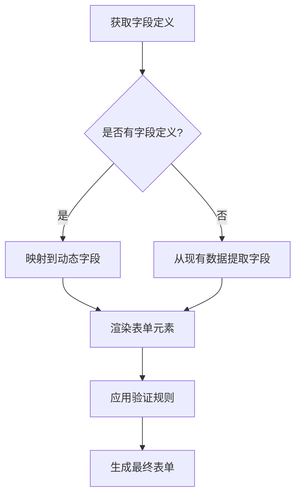
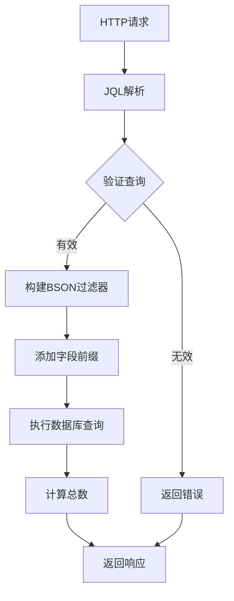
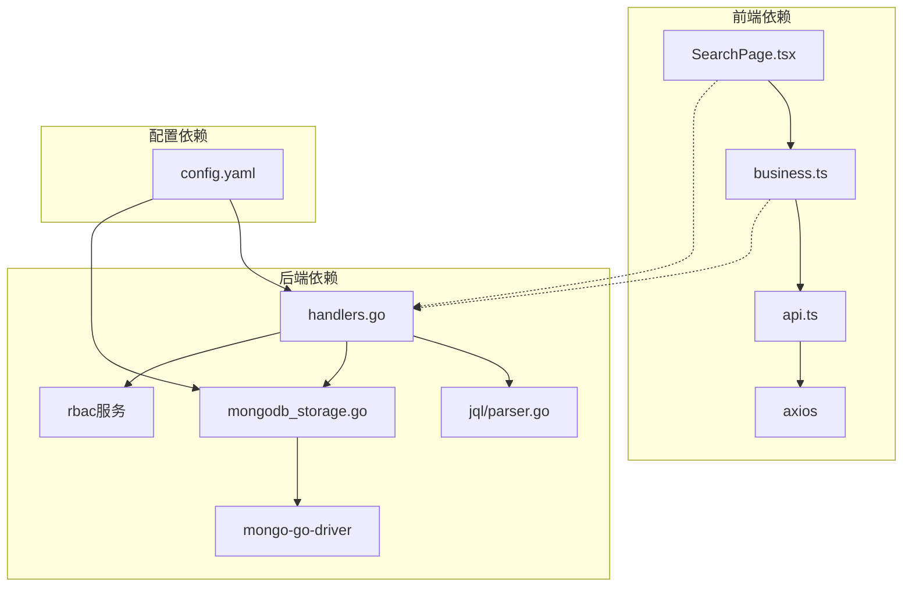

# 数据搜索页面

<cite>
**本文档引用的文件**
- [SearchPage.tsx](file://frontend/src/pages/Admin/SearchPage.tsx)
- [SearchPage.css](file://frontend/src/pages/Admin/SearchPage.css)
- [business.ts](file://frontend/src/services/business.ts)
- [api.ts](file://frontend/src/services/api.ts)
- [models.go](file://internal/models/models.go)
- [parser.go](file://pkg/jql/parser.go)
- [handlers.go](file://internal/api/handlers.go)
- [mongodb.go](file://internal/storage/mongodb.go)
- [mongodb_storage.go](file://internal/storage/mongodb_storage.go)
- [config.yaml](file://configs/config.yaml)
</cite>

## 目录
1. [简介](#简介)
2. [项目结构](#项目结构)
3. [核心组件](#核心组件)
4. [架构概览](#架构概览)
5. [详细组件分析](#详细组件分析)
6. [依赖关系分析](#依赖关系分析)
7. [性能考虑](#性能考虑)
8. [故障排除指南](#故障排除指南)
9. [结论](#结论)

## 简介

数据搜索页面是企业数据管理平台的核心功能模块，提供强大的数据检索能力。该系统支持多字段搜索、高级筛选、搜索模板等功能，能够处理复杂的业务数据查询需求。

主要功能特性包括：
- 多字段动态搜索：基于JQL查询语言的灵活查询
- 高级筛选：支持复杂条件组合和逻辑运算
- 动态表单：根据字段定义自动生成搜索表单
- 分页显示：大数据量的高效分页浏览
- 实时刷新：支持搜索条件的实时更新
- 权限控制：基于RBAC的访问控制

## 项目结构

数据搜索页面采用前后端分离架构，前端使用React + Ant Design，后端使用Go + Gin框架。

**图表来源**
- [SearchPage.tsx:1-583](file://frontend/src/pages/Admin/SearchPage.tsx#L1-L583)
- [handlers.go:1-800](file://internal/api/handlers.go#L1-L800)
- [mongodb_storage.go:1-829](file://internal/storage/mongodb_storage.go#L1-L829)

**章节来源**
- [SearchPage.tsx:1-583](file://frontend/src/pages/Admin/SearchPage.tsx#L1-L583)
- [business.ts:1-57](file://frontend/src/services/business.ts#L1-L57)
- [api.ts:1-37](file://frontend/src/services/api.ts#L1-L37)

## 核心组件

### 前端组件架构

数据搜索页面由多个核心组件构成：

1. **SearchPage组件**：主界面组件，负责搜索功能的完整实现
2. **BusinessService**：业务数据服务层，封装API调用
3. **动态表单系统**：根据字段定义动态生成搜索表单
4. **JQL解析器**：处理复杂的查询语言

### 数据模型

系统使用统一的数据模型来表示业务数据：

**图表来源**
- [models.go:227-245](file://internal/models/models.go#L227-L245)
- [models.go:51-61](file://internal/models/models.go#L51-L61)
- [models.go:39-49](file://internal/models/models.go#L39-L49)

**章节来源**
- [models.go:1-365](file://internal/models/models.go#L1-L365)

## 架构概览

数据搜索页面采用分层架构设计，确保各层职责清晰分离：

**图表来源**
- [SearchPage.tsx:103-128](file://frontend/src/pages/Admin/SearchPage.tsx#L103-L128)
- [business.ts:21-30](file://frontend/src/services/business.ts#L21-L30)
- [handlers.go:1013-1049](file://internal/api/handlers.go#L1013-L1049)
- [parser.go:46-65](file://pkg/jql/parser.go#L46-L65)

## 详细组件分析

### 搜索界面组件

SearchPage组件是整个搜索功能的核心，实现了完整的用户交互流程：

#### 组件状态管理

组件维护了多个关键状态：
- `data`: 搜索结果显示数据
- `loading`: 加载状态指示
- `module`: 当前选中的数据模块
- `modules`: 可用的模块列表
- `jqlQuery`: JQL查询语句
- `pagination`: 分页配置

#### 动态字段生成

系统根据字段定义动态生成搜索表单：

**图表来源**
- [SearchPage.tsx:88-101](file://frontend/src/pages/Admin/SearchPage.tsx#L88-L101)
- [SearchPage.tsx:146-177](file://frontend/src/pages/Admin/SearchPage.tsx#L146-L177)

#### 表单验证系统

系统支持多种字段类型的验证：
- 必填字段验证
- 数值范围验证
- 字符串长度验证
- 正则表达式验证
- 枚举值验证

**章节来源**
- [SearchPage.tsx:292-374](file://frontend/src/pages/Admin/SearchPage.tsx#L292-L374)

### JQL查询语言

系统实现了完整的JQL（Java Query Language）解析器，支持复杂的查询语法：

#### 支持的操作符

| 操作符 | 描述 | 示例 |
|--------|------|------|
| `=` | 等于 | `status = "active"` |
| `!=` | 不等于 | `name != "admin"` |
| `>` | 大于 | `age > 18` |
| `<` | 小于 | `score < 100` |
| `>=` | 大于等于 | `price >= 10.5` |
| `<=` | 小于等于 | `count <= 1000` |
| `~` | 正则匹配 | `title ~ ".*测试.*"` |
| `IN` | 在集合中 | `status IN ("active","pending")` |
| `NOT IN` | 不在集合中 | `category NOT IN ("deleted")` |
| `IS NULL` | 为空 | `description IS NULL` |
| `IS NOT NULL` | 不为空 | `email IS NOT NULL` |

#### 逻辑运算符

- `AND`：逻辑与运算
- `OR`：逻辑或运算  
- `NOT`：逻辑非运算
- `()`：分组运算

**章节来源**
- [parser.go:14-30](file://pkg/jql/parser.go#L14-L30)
- [parser.go:630-647](file://pkg/jql/parser.go#L630-L647)

### 后端处理流程

后端处理器负责接收前端请求并执行相应的业务逻辑：

**图表来源**
- [handlers.go:1013-1049](file://internal/api/handlers.go#L1013-L1049)
- [parser.go:538-574](file://pkg/jql/parser.go#L538-L574)

**章节来源**
- [handlers.go:1013-1049](file://internal/api/handlers.go#L1013-L1049)

### 数据存储层

系统使用MongoDB作为数据存储，支持动态集合管理和索引创建：

#### 集合管理

每个模块对应一个独立的MongoDB集合，命名规则为 `{module}_data`。系统支持：
- 动态创建集合
- 集合索引管理
- 数据分页查询
- 总数统计

#### 索引策略

系统支持多种索引类型：
- 单字段索引
- 复合索引
- 文本索引
- 地理空间索引

**章节来源**
- [mongodb_storage.go:366-395](file://internal/storage/mongodb_storage.go#L366-L395)
- [mongodb_storage.go:71-78](file://internal/storage/mongodb_storage.go#L71-L78)

## 依赖关系分析

系统各组件之间的依赖关系如下：

**图表来源**
- [SearchPage.tsx:1-5](file://frontend/src/pages/Admin/SearchPage.tsx#L1-L5)
- [business.ts:1](file://frontend/src/services/business.ts#L1)
- [api.ts:1](file://frontend/src/services/api.ts#L1)
- [handlers.go:14-16](file://internal/api/handlers.go#L14-L16)

**章节来源**
- [config.yaml:1-26](file://configs/config.yaml#L1-L26)

## 性能考虑

### 查询优化策略

1. **索引优化**：为常用的查询字段建立合适的索引
2. **分页查询**：使用skip和limit限制查询结果集大小
3. **投影优化**：只返回需要的字段，减少网络传输
4. **查询缓存**：对频繁查询的结果进行缓存

### 前端性能优化

1. **虚拟滚动**：大数据量时使用虚拟滚动技术
2. **防抖处理**：对搜索输入进行防抖处理
3. **懒加载**：按需加载数据和资源
4. **状态优化**：合理使用React.memo和useMemo

### 后端性能优化

1. **连接池管理**：合理配置数据库连接池
2. **并发控制**：限制同时处理的请求数量
3. **内存管理**：及时释放不需要的内存
4. **日志优化**：避免过多的日志输出影响性能

## 故障排除指南

### 常见问题及解决方案

#### 搜索结果为空

可能原因：
- 查询条件过于严格
- 数据库中没有符合条件的数据
- 权限不足无法查看数据

解决方法：
- 检查查询语法是否正确
- 简化查询条件进行测试
- 验证用户权限设置

#### 性能问题

症状：
- 搜索响应时间过长
- 页面加载缓慢

诊断步骤：
- 检查数据库索引是否合理
- 分析查询执行计划
- 监控系统资源使用情况

#### 权限问题

现象：
- 无法访问某些数据
- 搜索结果显示不完整

排查方法：
- 验证用户的集合权限
- 检查RBAC配置
- 确认数据的所有权设置

**章节来源**
- [handlers.go:295-314](file://internal/api/handlers.go#L295-L314)

## 结论

数据搜索页面是一个功能完整、架构清晰的企业级搜索系统。它通过以下特点实现了优秀的用户体验：

1. **灵活性**：支持复杂的JQL查询语法，满足各种搜索需求
2. **可扩展性**：基于模块化的架构设计，易于功能扩展
3. **性能优化**：通过索引、缓存等技术保证查询性能
4. **安全性**：完善的权限控制系统，确保数据安全
5. **易用性**：直观的用户界面和智能的表单生成

该系统为企业提供了强大的数据检索能力，能够有效提升数据管理和分析效率。通过持续的优化和改进，可以进一步提升系统的性能和用户体验。