# 权限管理页面

<cite>
**本文档引用的文件**
- [PermissionManagement.tsx](file://frontend/src/pages/Admin/PermissionManagement.tsx)
- [rbac.ts](file://frontend/src/services/rbac.ts)
- [index.ts](file://frontend/src/types/index.ts)
- [rbac.go](file://pkg/rbac/rbac.go)
- [collection_rbac.go](file://pkg/rbac/collection_rbac.go)
- [rbac_storage.go](file://internal/storage/rbac_storage.go)
- [collection_rbac_storage.go](file://internal/storage/collection_rbac_storage.go)
- [handlers.go](file://internal/api/handlers.go)
- [middleware.go](file://internal/auth/middleware.go)
- [rbac.md](file://docs/rbac.md)
- [architecture.md](file://docs/architecture.md)
</cite>

## 目录
1. [简介](#简介)
2. [项目结构](#项目结构)
3. [核心组件](#核心组件)
4. [架构概览](#架构概览)
5. [详细组件分析](#详细组件分析)
6. [依赖关系分析](#依赖关系分析)
7. [性能考虑](#性能考虑)
8. [故障排除指南](#故障排除指南)
9. [结论](#结论)

## 简介

权限管理页面是数据管理中心的核心功能模块，负责管理系统中的权限资源、角色分配和权限检查机制。该页面实现了完整的RBAC（基于角色的访问控制）权限管理体系，支持系统权限和集合权限的双重管理，提供直观的权限分配界面和强大的权限搜索功能。

本系统采用前后端分离架构，前端使用React + Ant Design构建用户界面，后端采用Go语言开发RESTful API服务，数据库使用MongoDB存储权限、角色和用户数据。系统支持权限的动态分配、批量操作和实时生效机制。

## 项目结构

权限管理页面位于前端项目的Admin目录下，采用模块化设计，主要包含以下关键文件：

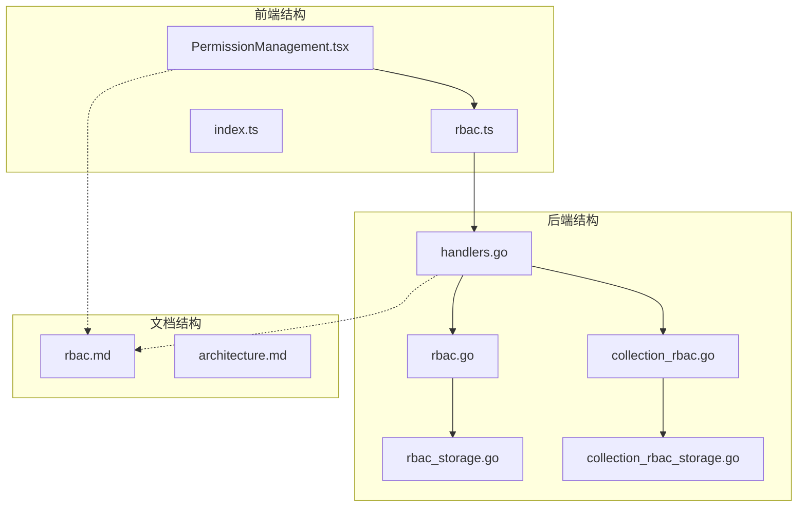

**图表来源**
- [PermissionManagement.tsx:1-261](file://frontend/src/pages/Admin/PermissionManagement.tsx#L1-L261)
- [rbac.ts:1-196](file://frontend/src/services/rbac.ts#L1-L196)
- [handlers.go:45-181](file://internal/api/handlers.go#L45-L181)

**章节来源**
- [PermissionManagement.tsx:1-261](file://frontend/src/pages/Admin/PermissionManagement.tsx#L1-L261)
- [rbac.ts:1-196](file://frontend/src/services/rbac.ts#L1-L196)
- [handlers.go:45-181](file://internal/api/handlers.go#L45-L181)

## 核心组件

权限管理页面由多个核心组件构成，每个组件都有明确的职责和功能：

### 前端组件架构

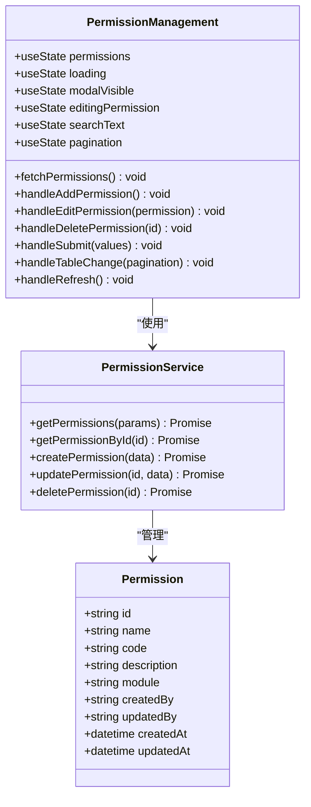

**图表来源**
- [PermissionManagement.tsx:14-261](file://frontend/src/pages/Admin/PermissionManagement.tsx#L14-L261)
- [rbac.ts:137-196](file://frontend/src/services/rbac.ts#L137-L196)
- [index.ts:27-37](file://frontend/src/types/index.ts#L27-L37)

### 后端服务架构

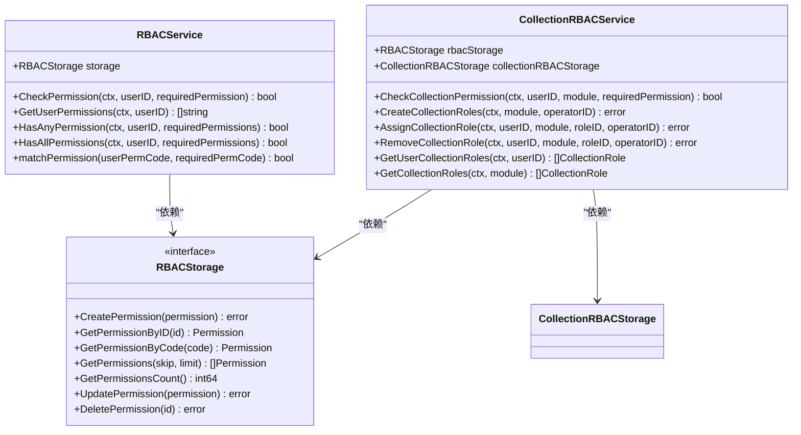

**图表来源**
- [rbac.go:55-250](file://pkg/rbac/rbac.go#L55-L250)
- [collection_rbac.go:27-294](file://pkg/rbac/collection_rbac.go#L27-L294)
- [rbac_storage.go:16-50](file://internal/storage/rbac_storage.go#L16-L50)

**章节来源**
- [rbac.go:55-250](file://pkg/rbac/rbac.go#L55-L250)
- [collection_rbac.go:27-294](file://pkg/rbac/collection_rbac.go#L27-L294)
- [rbac_storage.go:16-50](file://internal/storage/rbac_storage.go#L16-L50)

## 架构概览

权限管理系统的整体架构采用分层设计，确保了系统的可扩展性和可维护性：

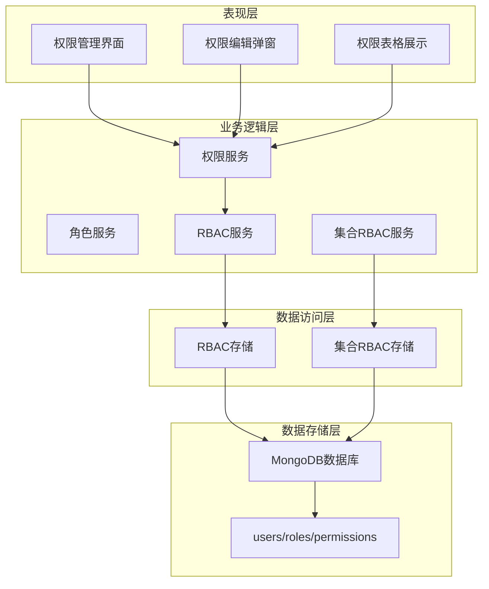

**图表来源**
- [PermissionManagement.tsx:14-261](file://frontend/src/pages/Admin/PermissionManagement.tsx#L14-L261)
- [rbac.ts:137-196](file://frontend/src/services/rbac.ts#L137-L196)
- [handlers.go:23-43](file://internal/api/handlers.go#L23-L43)

系统采用JWT认证机制，所有API请求都需要携带有效的认证令牌。权限检查分为两个层次：

1. **系统权限检查**：基于用户角色的系统级权限
2. **集合权限检查**：基于用户在特定集合中的角色权限

**章节来源**
- [handlers.go:260-314](file://internal/api/handlers.go#L260-L314)
- [middleware.go:11-49](file://internal/auth/middleware.go#L11-L49)

## 详细组件分析

### 权限列表展示组件

权限列表展示组件是权限管理页面的核心，提供了完整的权限查看、搜索和管理功能：

#### 数据结构设计

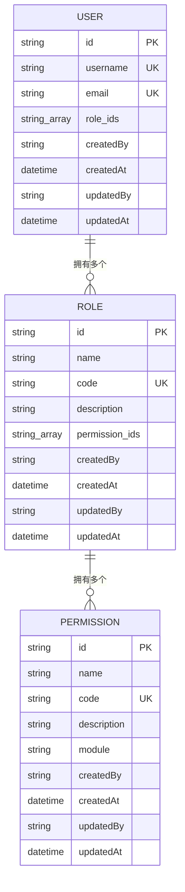

**图表来源**
- [index.ts:27-37](file://frontend/src/types/index.ts#L27-L37)
- [models.go:256-271](file://internal/models/models.go#L256-L271)

#### 权限搜索机制

权限搜索功能支持多种搜索条件，包括权限名称、代码和描述的模糊匹配：

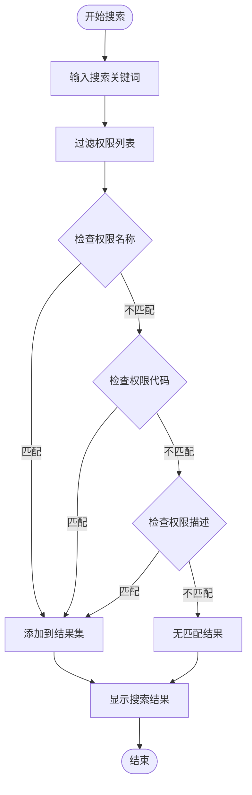

**图表来源**
- [PermissionManagement.tsx:97-99](file://frontend/src/pages/Admin/PermissionManagement.tsx#L97-L99)

#### 权限分类展示

系统支持权限的模块化分类展示，通过模块标签区分不同功能领域的权限：

| 模块类型 | 权限范围 | 示例 |
|---------|---------|------|
| 用户管理 | 用户相关的CRUD操作 | user:read, user:write, user:manage |
| 角色管理 | 角色管理相关权限 | role:read, role:write, role:manage |
| 权限管理 | 权限管理相关权限 | permission:read, permission:write, permission:manage |
| 数据管理 | 业务数据管理权限 | data:read, data:write, data:manage |

**章节来源**
- [PermissionManagement.tsx:7-12](file://frontend/src/pages/Admin/PermissionManagement.tsx#L7-L12)
- [PermissionManagement.tsx:101-162](file://frontend/src/pages/Admin/PermissionManagement.tsx#L101-L162)

### 权限分配界面设计

权限分配界面提供了直观的权限选择器和批量分配功能：

#### 权限编辑表单

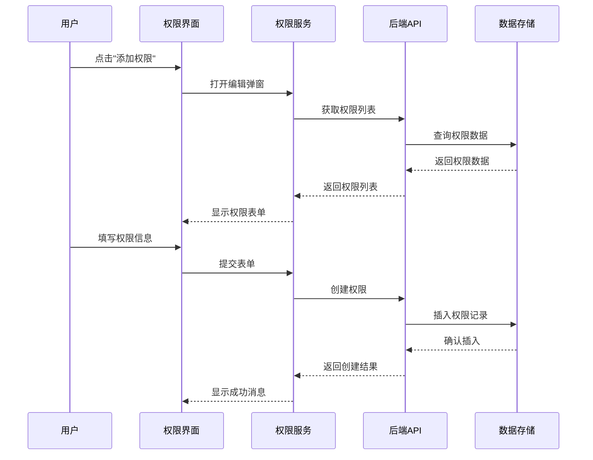

**图表来源**
- [PermissionManagement.tsx:42-83](file://frontend/src/pages/Admin/PermissionManagement.tsx#L42-L83)
- [rbac.ts:170-188](file://frontend/src/services/rbac.ts#L170-L188)

#### 批量分配功能

系统支持权限的批量分配和移除操作，通过权限选择器实现：

- **权限选择器**：支持多选权限，提供权限预览和搜索功能
- **批量分配**：支持一次性为多个角色分配多个权限
- **权限继承**：用户通过角色继承获得权限，权限集合为所有角色权限的并集

**章节来源**
- [PermissionManagement.tsx:164-258](file://frontend/src/pages/Admin/PermissionManagement.tsx#L164-L258)
- [rbac.ts:137-196](file://frontend/src/services/rbac.ts#L137-L196)

### 权限搜索和筛选机制

权限搜索和筛选功能提供了灵活的权限查找方式：

#### 搜索算法实现

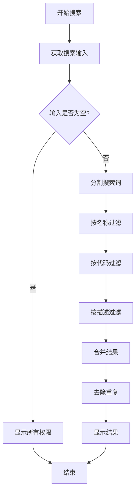

**图表来源**
- [PermissionManagement.tsx:97-99](file://frontend/src/pages/Admin/PermissionManagement.tsx#L97-L99)

#### 筛选功能

系统支持基于模块的权限筛选，用户可以通过下拉菜单选择特定模块来查看权限：

- **模块筛选**：支持用户管理、角色管理、权限管理、数据管理等模块筛选
- **权限状态**：支持按权限状态进行筛选
- **权限类型**：支持按权限类型进行筛选

**章节来源**
- [PermissionManagement.tsx:107-116](file://frontend/src/pages/Admin/PermissionManagement.tsx#L107-L116)

### 权限与角色关联关系管理

权限与角色的关联关系管理是RBAC系统的核心功能：

#### 角色权限分配流程

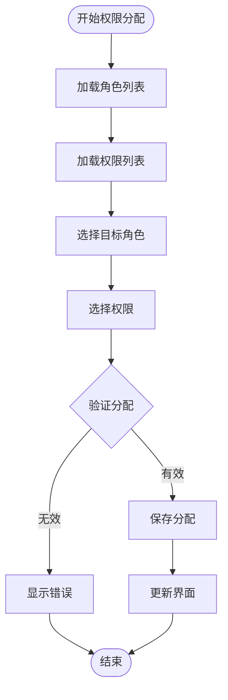

**图表来源**
- [handlers.go:752-809](file://internal/api/handlers.go#L752-L809)

#### 权限变更的实时生效

系统实现了权限变更的实时生效机制：

- **权限缓存**：用户登录时获取权限列表并缓存
- **权限更新**：权限变更后立即更新用户权限缓存
- **权限检查**：每次API请求时检查用户权限
- **权限同步**：权限变更通过WebSocket或其他机制通知客户端

**章节来源**
- [handlers.go:286-289](file://internal/api/handlers.go#L286-L289)
- [rbac.go:116-145](file://pkg/rbac/rbac.go#L116-L145)

### 权限冲突检测和继承关系可视化

系统提供了权限冲突检测和权限继承关系的可视化展示：

#### 权限冲突检测

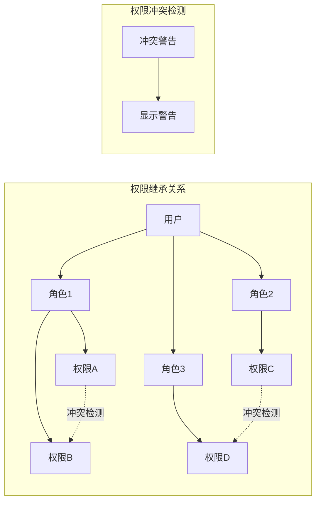

**图表来源**
- [rbac.md:295-317](file://docs/rbac.md#L295-L317)

#### 继承关系可视化

系统通过权限树形结构展示权限的继承关系：

- **用户权限树**：展示用户通过角色继承的所有权限
- **角色权限树**：展示角色拥有的权限集合
- **权限层级**：展示权限的层级关系和依赖关系

**章节来源**
- [rbac.md:293-317](file://docs/rbac.md#L293-L317)

## 依赖关系分析

权限管理系统的依赖关系呈现清晰的分层结构：

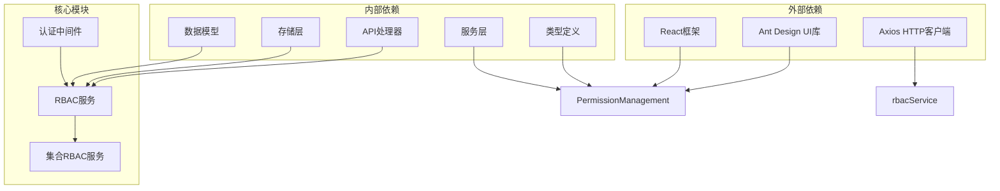

**图表来源**
- [PermissionManagement.tsx:1-6](file://frontend/src/pages/Admin/PermissionManagement.tsx#L1-L6)
- [handlers.go:23-43](file://internal/api/handlers.go#L23-L43)

### 前端依赖关系

前端组件之间的依赖关系相对简单，主要通过服务层进行数据交互：

- **PermissionManagement** 依赖 **permissionService** 进行数据操作
- **permissionService** 依赖 **apiClient** 进行HTTP请求
- **Types** 定义了权限和角色的数据结构

### 后端依赖关系

后端服务之间的依赖关系更加复杂，体现了清晰的分层架构：

- **Handler** 依赖 **RBACService** 和 **CollectionRBACService**
- **RBACService** 依赖 **RBACStorage** 接口
- **CollectionRBACService** 依赖 **CollectionRBACStorage** 接口
- **Storage** 实现类依赖 **MongoDB** 驱动

**章节来源**
- [handlers.go:23-43](file://internal/api/handlers.go#L23-L43)
- [rbac.go:55-61](file://pkg/rbac/rbac.go#L55-L61)
- [collection_rbac.go:27-37](file://pkg/rbac/collection_rbac.go#L27-L37)

## 性能考虑

权限管理系统的性能优化主要体现在以下几个方面：

### 前端性能优化

1. **虚拟滚动**：对于大量权限数据，使用虚拟滚动技术提升渲染性能
2. **懒加载**：权限列表采用分页加载，减少初始渲染负担
3. **缓存机制**：权限数据在内存中缓存，避免重复请求
4. **防抖搜索**：搜索功能使用防抖机制，减少不必要的API调用

### 后端性能优化

1. **索引优化**：在权限代码、角色ID等常用查询字段上建立索引
2. **批量操作**：支持批量权限分配和移除，减少数据库往返次数
3. **连接池**：使用MongoDB连接池提高数据库访问效率
4. **缓存策略**：用户权限信息缓存到Redis中，减少数据库查询

### 数据库优化

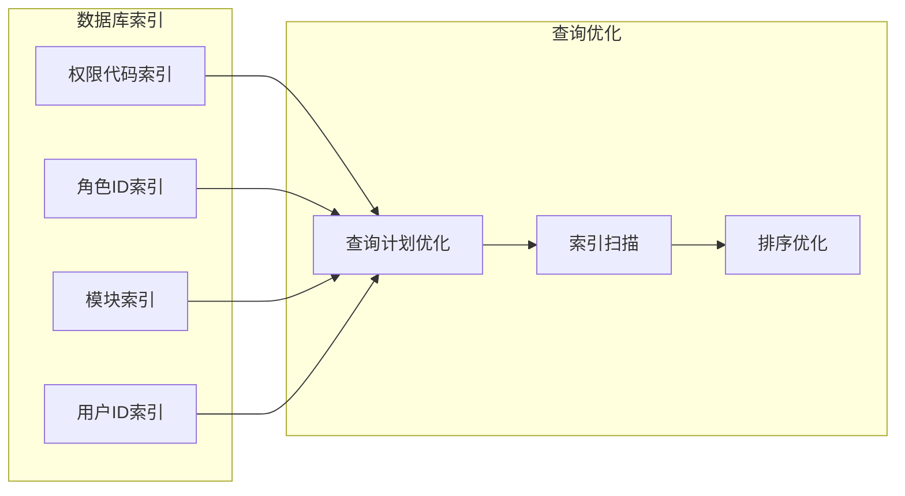

**图表来源**
- [rbac_storage.go:192-203](file://internal/storage/rbac_storage.go#L192-L203)

## 故障排除指南

### 常见问题及解决方案

#### 权限列表加载失败

**问题现象**：权限列表无法加载，显示空白或错误提示

**可能原因**：
1. API服务器连接异常
2. 用户认证失败
3. 数据库连接问题

**解决步骤**：
1. 检查网络连接和API服务器状态
2. 验证用户登录状态和权限
3. 查看服务器日志获取详细错误信息

#### 权限搜索无结果

**问题现象**：搜索权限时没有返回任何结果

**可能原因**：
1. 搜索关键词输入错误
2. 权限数据未正确索引
3. 搜索算法问题

**解决步骤**：
1. 检查搜索关键词的拼写
2. 验证权限数据的完整性
3. 清除浏览器缓存重新加载

#### 权限分配失败

**问题现象**：尝试分配权限时出现错误

**可能原因**：
1. 目标权限不存在
2. 用户权限不足
3. 数据库事务失败

**解决步骤**：
1. 验证目标权限的ID和状态
2. 检查当前用户的权限级别
3. 查看数据库事务日志

### 调试工具和方法

系统提供了多种调试工具帮助开发者定位问题：

1. **浏览器开发者工具**：监控网络请求和JavaScript错误
2. **服务器日志**：查看详细的错误堆栈和调试信息
3. **API测试工具**：使用Postman等工具测试API接口
4. **数据库监控**：监控数据库查询性能和连接状态

**章节来源**
- [handlers.go:260-314](file://internal/api/handlers.go#L260-L314)
- [rbac_storage.go:81-164](file://internal/storage/rbac_storage.go#L81-L164)

## 结论

权限管理页面是一个功能完整、架构清晰的RBAC权限管理系统。系统通过前后端分离的设计，实现了权限的可视化管理、灵活的权限分配和强大的权限检查机制。

### 主要优势

1. **完整的权限体系**：支持系统权限和集合权限的双重管理
2. **直观的用户界面**：提供权限列表展示、搜索筛选和批量操作功能
3. **实时权限生效**：权限变更能够实时反映到用户权限中
4. **完善的权限检查**：支持复杂的权限继承和冲突检测机制
5. **良好的扩展性**：模块化设计便于功能扩展和维护

### 技术特点

1. **分层架构**：清晰的前后端分层和模块划分
2. **数据一致性**：通过事务和索引保证数据完整性
3. **性能优化**：采用缓存、索引和批量操作等优化策略
4. **安全可靠**：JWT认证和权限中间件确保系统安全

### 发展方向

未来可以在以下方面进一步完善：

1. **权限审计**：增强权限变更的审计功能
2. **权限模板**：提供权限模板和批量导入功能
3. **权限可视化**：提供更丰富的权限关系可视化展示
4. **权限预测**：基于用户行为预测权限需求

该权限管理页面为整个数据管理中心提供了坚实的基础，确保了系统的安全性和可管理性。