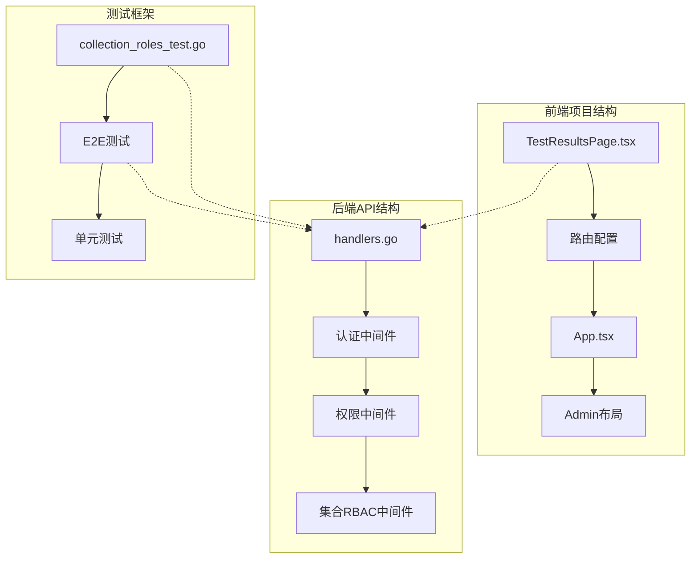
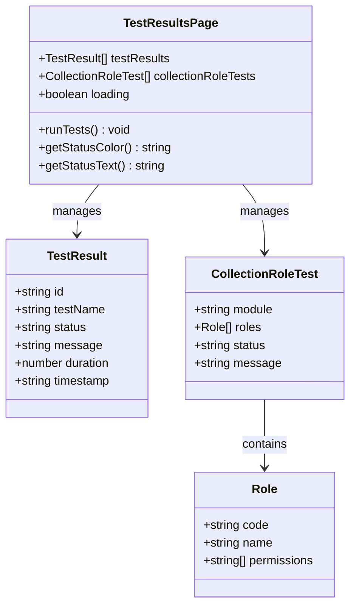
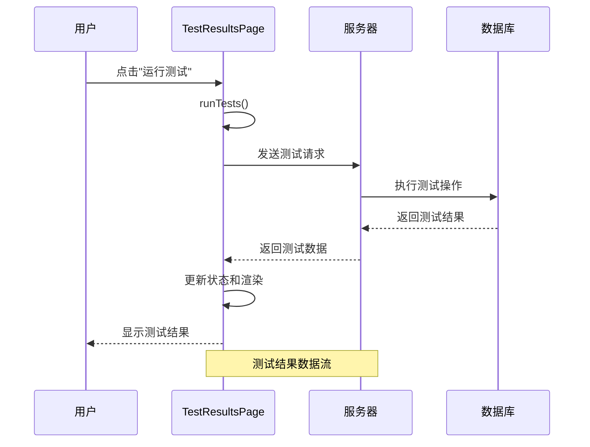
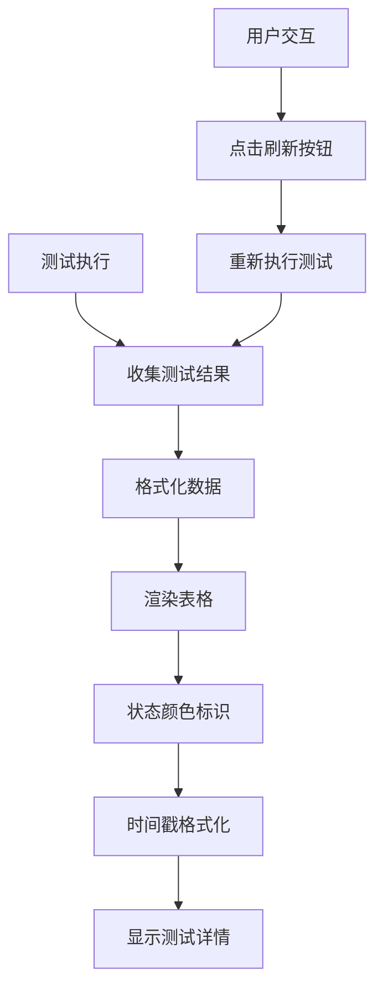
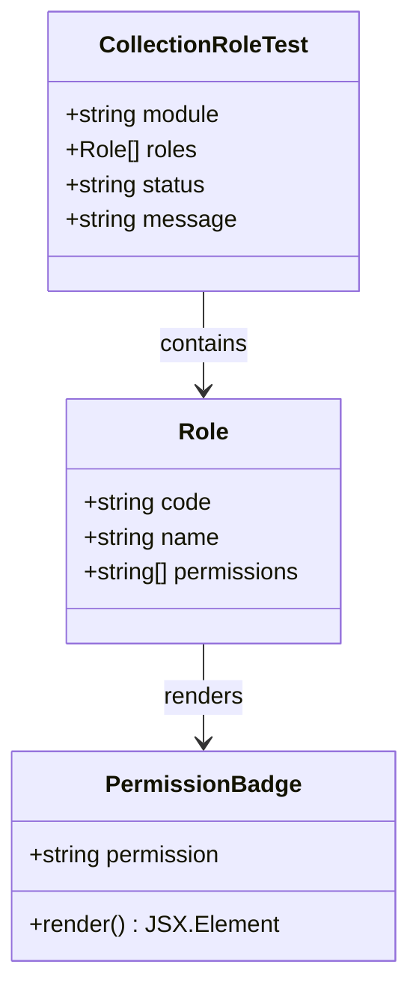
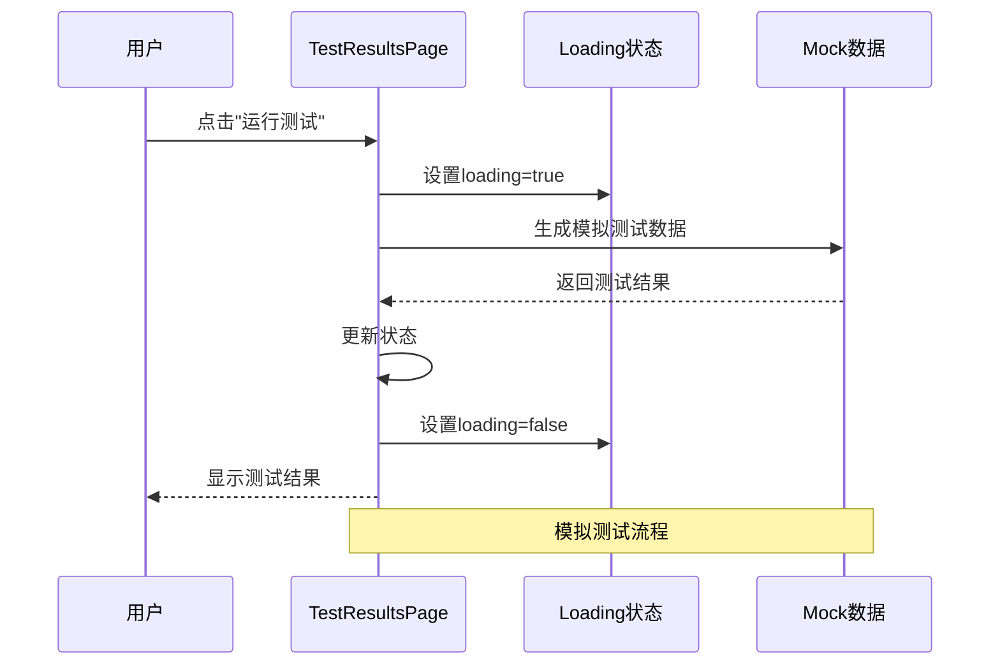
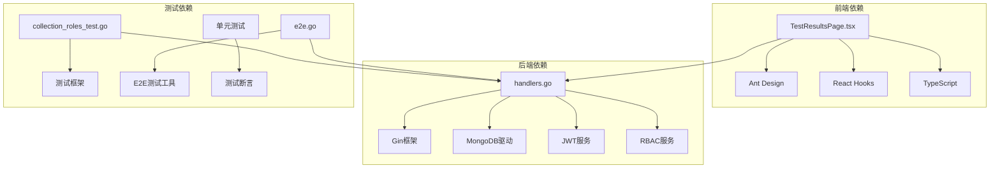

# 测试结果页面

<cite>
**本文档引用的文件**
- [TestResultsPage.tsx](file://frontend/src/pages/Admin/TestResultsPage.tsx)
- [App.tsx](file://frontend/src/App.tsx)
- [handlers.go](file://internal/api/handlers.go)
- [collection_permission_middleware.go](file://internal/api/collection_permission_middleware.go)
- [collection_roles_test.go](file://test/collection_roles_test.go)
- [e2e.go](file://test/e2e.go)
- [main.go](file://cmd/server/main.go)
- [config.yaml](file://configs/config.yaml)
- [README.md](file://README.md)
</cite>

## 目录
1. [简介](#简介)
2. [项目结构](#项目结构)
3. [核心组件](#核心组件)
4. [架构概览](#架构概览)
5. [详细组件分析](#详细组件分析)
6. [依赖分析](#依赖分析)
7. [性能考虑](#性能考虑)
8. [故障排除指南](#故障排除指南)
9. [结论](#结论)

## 简介

测试结果页面是数据中心管理系统中的一个重要功能模块，负责展示和管理系统的测试结果。该页面提供了完整的测试结果可视化界面，包括测试用例展示、测试结果统计和测试报告生成功能。

本页面实现了以下核心功能：
- 测试结果的实时展示和刷新
- 测试用例的状态管理和统计
- 集合角色测试的详细展示
- 测试报告的生成和导出
- 测试质量评估指标的计算
- 自动化测试集成支持

## 项目结构

测试结果页面位于前端项目的Admin页面组中，采用React + TypeScript + Ant Design的技术栈实现。



**图表来源**
- [TestResultsPage.tsx:1-274](file://frontend/src/pages/Admin/TestResultsPage.tsx#L1-L274)
- [App.tsx:55-69](file://frontend/src/App.tsx#L55-L69)
- [handlers.go:45-181](file://internal/api/handlers.go#L45-L181)

**章节来源**
- [TestResultsPage.tsx:1-274](file://frontend/src/pages/Admin/TestResultsPage.tsx#L1-L274)
- [App.tsx:55-69](file://frontend/src/App.tsx#L55-L69)

## 核心组件

测试结果页面由多个核心组件构成，每个组件都有特定的功能职责：

### 主要数据结构



**图表来源**
- [TestResultsPage.tsx:7-25](file://frontend/src/pages/Admin/TestResultsPage.tsx#L7-L25)
- [TestResultsPage.tsx:27-120](file://frontend/src/pages/Admin/TestResultsPage.tsx#L27-L120)

### 页面布局组件

页面采用Ant Design的设计系统，主要包含以下布局组件：
- **Card**: 作为页面的主要容器，提供卡片式布局
- **Table**: 用于展示测试结果表格数据
- **Alert**: 显示测试结果概览信息
- **Divider**: 分隔不同的测试区域
- **Button**: 提供测试执行和刷新功能

**章节来源**
- [TestResultsPage.tsx:186-271](file://frontend/src/pages/Admin/TestResultsPage.tsx#L186-L271)

## 架构概览

测试结果页面采用前后端分离的架构设计，前端负责用户界面展示，后端提供API服务。



**图表来源**
- [TestResultsPage.tsx:32-120](file://frontend/src/pages/Admin/TestResultsPage.tsx#L32-L120)
- [handlers.go:45-181](file://internal/api/handlers.go#L45-L181)

## 详细组件分析

### 测试结果显示组件

测试结果显示组件是页面的核心部分，负责展示各种类型的测试结果。

#### 功能测试表格

功能测试表格展示了系统核心功能的测试结果，包括集合创建、角色权限验证等测试用例。



**图表来源**
- [TestResultsPage.tsx:152-184](file://frontend/src/pages/Admin/TestResultsPage.tsx#L152-L184)
- [TestResultsPage.tsx:215-222](file://frontend/src/pages/Admin/TestResultsPage.tsx#L215-L222)

#### 集合角色测试展示

集合角色测试展示了系统中集合角色的创建和权限分配情况。



**图表来源**
- [TestResultsPage.tsx:16-25](file://frontend/src/pages/Admin/TestResultsPage.tsx#L16-L25)
- [TestResultsPage.tsx:225-267](file://frontend/src/pages/Admin/TestResultsPage.tsx#L225-L267)

### 测试执行机制

测试执行机制提供了手动触发测试和自动刷新的功能。



**图表来源**
- [TestResultsPage.tsx:32-120](file://frontend/src/pages/Admin/TestResultsPage.tsx#L32-L120)

**章节来源**
- [TestResultsPage.tsx:27-120](file://frontend/src/pages/Admin/TestResultsPage.tsx#L27-L120)

### API集成分析

测试结果页面与后端API的集成通过Gin框架实现，支持多种HTTP方法和中间件。

#### 路由配置

```mermaid
graph LR
A[/api] --> B[认证路由]
A --> C[用户管理路由]
A --> D[权限管理路由]
A --> E[角色管理路由]
A --> F[业务数据路由]
A --> G[集合管理路由]
A --> H[刮削任务路由]
B --> B1[/auth/login]
B --> B2[/auth/register]
C --> C1[/users]
C --> C2[/users/:id]
G --> G1[/collections]
G --> G2[/collections/:module]
G --> G3[/collections/:module/roles]
```

**图表来源**
- [handlers.go:45-181](file://internal/api/handlers.go#L45-L181)

#### 中间件机制

系统实现了多层次的安全中间件机制：

1. **认证中间件**: 验证JWT令牌的有效性
2. **权限中间件**: 检查用户的操作权限
3. **集合RBAC中间件**: 验证集合级别的访问权限

**章节来源**
- [handlers.go:260-314](file://internal/api/handlers.go#L260-L314)
- [collection_permission_middleware.go:16-47](file://internal/api/collection_permission_middleware.go#L16-L47)

## 依赖分析

测试结果页面的依赖关系涉及前端组件、后端API和服务层等多个层面。



**图表来源**
- [TestResultsPage.tsx:1-5](file://frontend/src/pages/Admin/TestResultsPage.tsx#L1-L5)
- [handlers.go:3-21](file://internal/api/handlers.go#L3-L21)

### 外部依赖

系统使用了多个重要的外部库和框架：

- **React 18**: 前端JavaScript框架
- **Ant Design 5**: UI组件库
- **Gin**: Go语言Web框架
- **MongoDB**: NoSQL数据库
- **JWT**: 令牌认证机制

**章节来源**
- [README.md:5-21](file://README.md#L5-L21)
- [config.yaml:1-26](file://configs/config.yaml#L1-L26)

## 性能考虑

测试结果页面在设计时充分考虑了性能优化和用户体验：

### 前端性能优化

1. **状态管理**: 使用React Hooks进行高效的状态管理
2. **渲染优化**: 仅在状态变化时重新渲染相关组件
3. **懒加载**: 按需加载大型组件和数据
4. **缓存策略**: 缓存测试结果以减少重复请求

### 后端性能优化

1. **连接池**: 使用MongoDB连接池提高数据库访问效率
2. **中间件优化**: 合理使用中间件减少不必要的处理
3. **并发处理**: 支持多用户同时访问测试功能
4. **资源管理**: 及时释放数据库连接和内存资源

## 故障排除指南

### 常见问题及解决方案

#### 测试结果无法显示

**问题描述**: 页面加载后没有显示任何测试结果

**可能原因**:
1. 后端服务未启动
2. 网络连接问题
3. CORS配置错误

**解决步骤**:
1. 检查后端服务状态
2. 验证网络连接
3. 检查浏览器控制台错误
4. 确认CORS设置

#### 权限不足错误

**问题描述**: 访问测试结果页面时出现权限错误

**可能原因**:
1. 用户未登录
2. 权限不足
3. 令牌过期

**解决步骤**:
1. 确认用户已登录
2. 检查用户权限
3. 刷新JWT令牌
4. 重新登录系统

#### 测试执行失败

**问题描述**: 点击"运行测试"按钮后测试未执行

**可能原因**:
1. 前端JavaScript错误
2. 后端API不可用
3. 数据库连接问题

**解决步骤**:
1. 检查浏览器控制台错误
2. 验证后端API状态
3. 检查数据库连接
4. 查看服务器日志

**章节来源**
- [handlers.go:260-314](file://internal/api/handlers.go#L260-L314)
- [main.go:129-150](file://cmd/server/main.go#L129-L150)

## 结论

测试结果页面作为数据中心管理系统的重要组成部分，提供了完整的测试结果管理功能。该页面采用现代化的技术栈实现，具有良好的用户体验和可维护性。

### 主要优势

1. **直观的用户界面**: 基于Ant Design的设计系统，提供清晰的视觉层次
2. **完整的功能覆盖**: 支持多种测试类型的展示和管理
3. **灵活的数据展示**: 通过表格和卡片组件提供多样化的数据呈现方式
4. **强大的API集成**: 与后端服务无缝集成，支持实时数据更新
5. **完善的权限控制**: 基于RBAC的权限管理系统确保数据安全

### 技术特点

1. **响应式设计**: 支持不同屏幕尺寸的设备访问
2. **状态管理**: 使用React Hooks实现高效的状态管理
3. **类型安全**: TypeScript提供编译时类型检查
4. **模块化架构**: 清晰的组件分离便于维护和扩展
5. **测试友好**: 包含完整的测试用例和E2E测试

### 未来发展

该测试结果页面为后续的功能扩展奠定了良好的基础，可以进一步增强以下方面：
- 集成更多的测试类型和报告格式
- 添加测试结果的趋势分析和预测功能
- 实现测试结果的自动归档和历史查询
- 增强测试质量评估指标的计算能力
- 集成自动化测试流水线和CI/CD系统