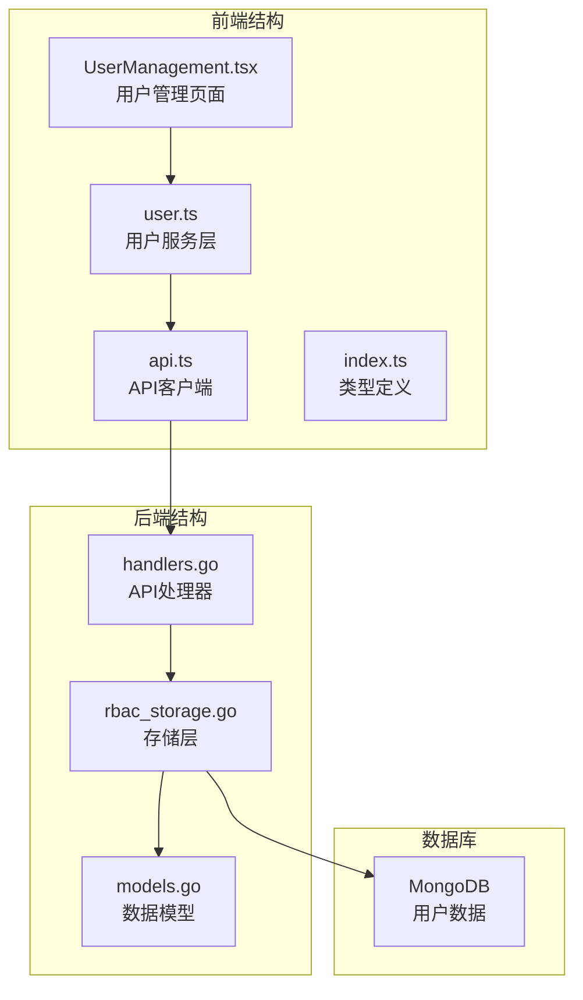
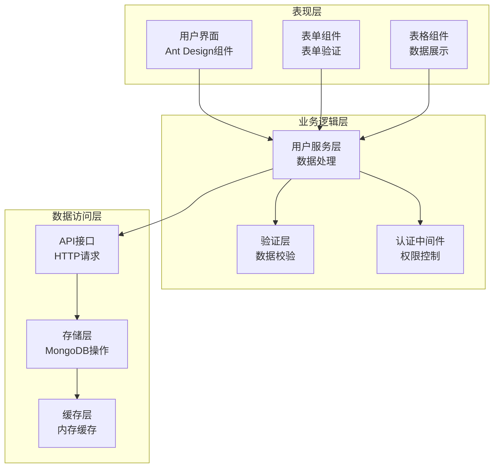
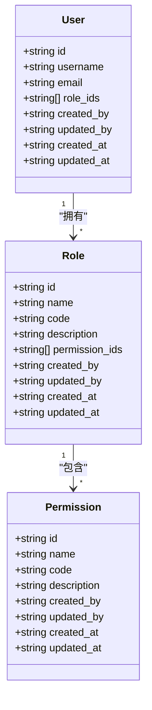
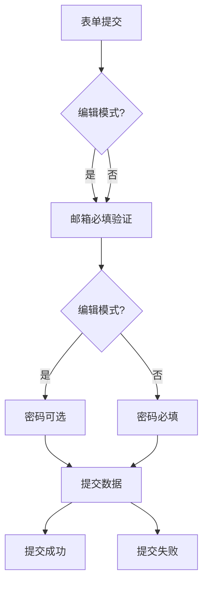
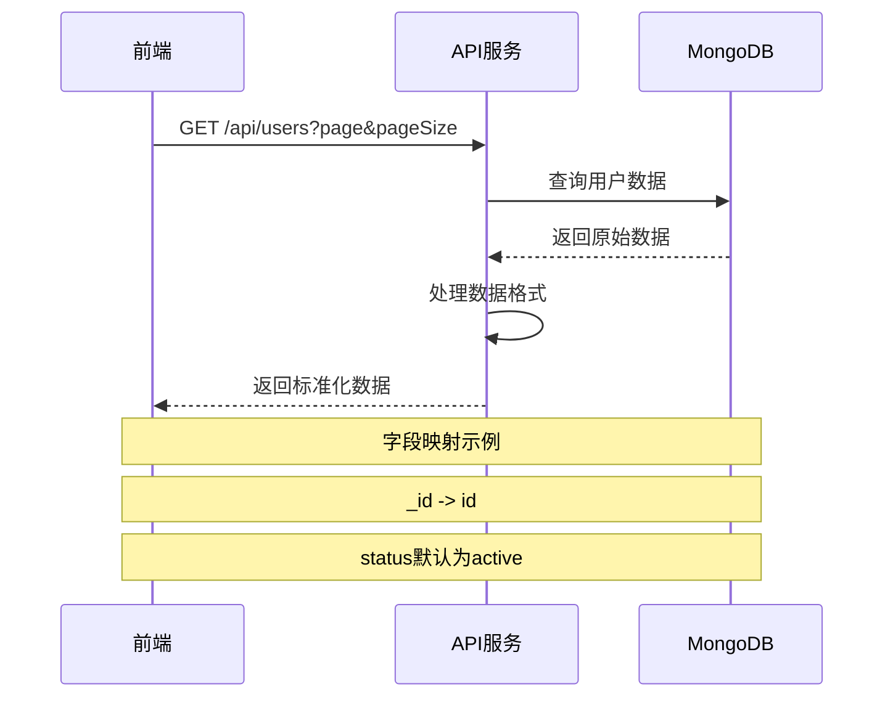
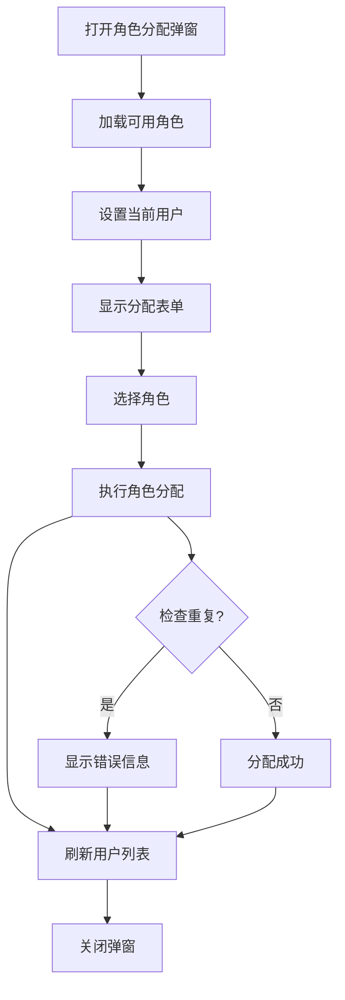
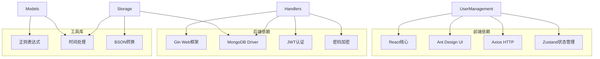
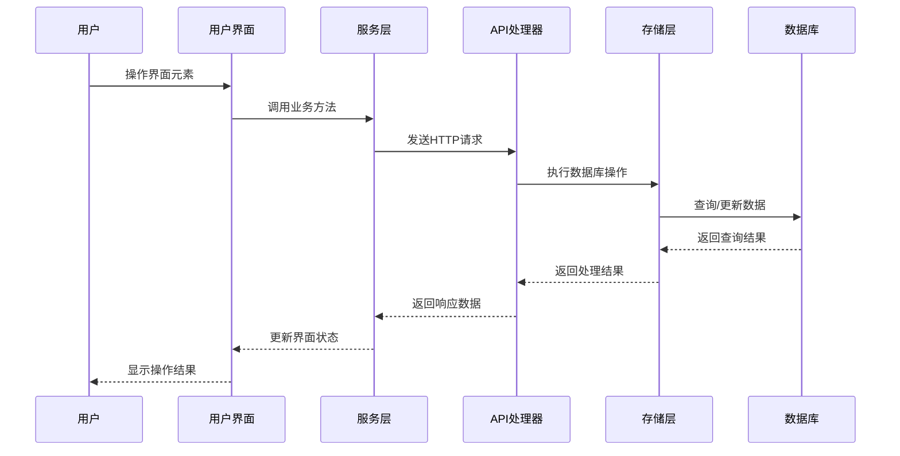

# 用户管理页面

<cite>
**本文档引用的文件**
- [UserManagement.tsx](file://frontend/src/pages/Admin/UserManagement.tsx)
- [user.ts](file://frontend/src/services/user.ts)
- [api.ts](file://frontend/src/services/api.ts)
- [types/index.ts](file://frontend/src/types/index.ts)
- [handlers.go](file://internal/api/handlers.go)
- [rbac_storage.go](file://internal/storage/rbac_storage.go)
- [models.go](file://internal/models/models.go)
</cite>

## 目录
1. [简介](#简介)
2. [项目结构](#项目结构)
3. [核心组件](#核心组件)
4. [架构概览](#架构概览)
5. [详细组件分析](#详细组件分析)
6. [依赖关系分析](#依赖关系分析)
7. [性能考虑](#性能考虑)
8. [故障排除指南](#故障排除指南)
9. [结论](#结论)

## 简介

用户管理页面是数据管理中心的核心功能模块，提供完整的用户生命周期管理能力。该页面实现了用户列表展示、用户信息编辑、用户状态管理、用户删除以及角色权限分配等核心功能。系统采用前后端分离架构，前端使用React + Ant Design构建用户界面，后端基于Go语言开发RESTful API服务，数据存储采用MongoDB数据库。

## 项目结构

用户管理功能位于前端Admin页面目录中，主要包含以下关键文件：

**图表来源**
- [UserManagement.tsx:1-385](file://frontend/src/pages/Admin/UserManagement.tsx#L1-L385)
- [user.ts:1-104](file://frontend/src/services/user.ts#L1-L104)
- [handlers.go:45-63](file://internal/api/handlers.go#L45-L63)

**章节来源**
- [UserManagement.tsx:1-385](file://frontend/src/pages/Admin/UserManagement.tsx#L1-L385)
- [user.ts:1-104](file://frontend/src/services/user.ts#L1-L104)
- [handlers.go:45-63](file://internal/api/handlers.go#L45-L63)

## 核心组件

用户管理页面由多个核心组件构成，每个组件负责特定的功能领域：

### 主要功能模块

1. **用户列表展示组件**
   - 支持分页显示用户信息
   - 实时搜索和过滤功能
   - 操作按钮（编辑、删除）

2. **用户表单组件**
   - 新增用户表单
   - 编辑用户表单
   - 表单验证规则

3. **角色分配组件**
   - 角色选择下拉框
   - 角色标签显示
   - 角色权限管理

4. **状态管理组件**
   - 用户状态切换
   - 权限控制
   - 错误处理

**章节来源**
- [UserManagement.tsx:22-67](file://frontend/src/pages/Admin/UserManagement.tsx#L22-L67)
- [UserManagement.tsx:96-120](file://frontend/src/pages/Admin/UserManagement.tsx#L96-L120)
- [UserManagement.tsx:122-167](file://frontend/src/pages/Admin/UserManagement.tsx#L122-L167)

## 架构概览

系统采用经典的三层架构设计，确保了良好的可维护性和扩展性：

**图表来源**
- [UserManagement.tsx:1-385](file://frontend/src/pages/Admin/UserManagement.tsx#L1-L385)
- [user.ts:24-102](file://frontend/src/services/user.ts#L24-L102)
- [handlers.go:295-314](file://internal/api/handlers.go#L295-L314)

## 详细组件分析

### 用户管理页面组件

用户管理页面是整个功能的核心，实现了完整的用户生命周期管理：

#### 数据模型定义

**图表来源**
- [models.go:247-271](file://internal/models/models.go#L247-L271)
- [types/index.ts:1-37](file://frontend/src/types/index.ts#L1-L37)

#### 表格组件配置

用户管理页面的表格组件具有丰富的配置选项：

| 配置项 | 功能描述 | 实现方式 |
|--------|----------|----------|
| 列定义 | 用户名、邮箱、角色、创建时间、操作 | 静态列配置 |
| 排序功能 | 支持按用户名、邮箱排序 | 前端排序实现 |
| 筛选功能 | 关键词搜索用户名和邮箱 | 过滤器实现 |
| 分页功能 | 支持10/20/50/100条每页 | 分页参数传递 |

#### 表单验证规则

表单组件实现了严格的验证机制：

**图表来源**
- [UserManagement.tsx:301-321](file://frontend/src/pages/Admin/UserManagement.tsx#L301-L321)

**章节来源**
- [UserManagement.tsx:191-250](file://frontend/src/pages/Admin/UserManagement.tsx#L191-L250)
- [UserManagement.tsx:301-321](file://frontend/src/pages/Admin/UserManagement.tsx#L301-L321)

### 用户服务层

用户服务层封装了所有用户相关的API调用：

#### API接口定义

| 接口名称 | HTTP方法 | 路径 | 功能描述 |
|----------|----------|------|----------|
| 获取用户列表 | GET | /api/users | 获取用户分页数据 |
| 获取用户详情 | GET | /api/users/:id | 获取单个用户信息 |
| 创建用户 | POST | /api/users | 创建新用户 |
| 更新用户 | PUT | /api/users/:id | 更新用户信息 |
| 删除用户 | DELETE | /api/users/:id | 删除用户 |
| 分配角色 | POST | /api/users/:id/roles | 为用户分配角色 |
| 移除角色 | DELETE | /api/users/:id/roles/:roleId | 移除用户角色 |
| 获取用户角色 | GET | /api/users/:id/roles | 获取用户所有角色 |

#### 数据转换机制

用户服务层实现了前后端数据格式转换：

**图表来源**
- [user.ts:25-46](file://frontend/src/services/user.ts#L25-L46)
- [handlers.go:316-358](file://internal/api/handlers.go#L316-L358)

**章节来源**
- [user.ts:24-102](file://frontend/src/services/user.ts#L24-L102)
- [handlers.go:316-358](file://internal/api/handlers.go#L316-L358)

### 角色权限管理

角色权限管理是RBAC系统的核心功能：

#### 角色分配流程

**图表来源**
- [UserManagement.tsx:122-156](file://frontend/src/pages/Admin/UserManagement.tsx#L122-L156)
- [handlers.go:459-490](file://internal/api/handlers.go#L459-L490)

#### 权限控制机制

系统实现了多层次的权限控制：

| 权限级别 | 权限代码 | 功能范围 |
|----------|----------|----------|
| 用户读取 | user:read | 查看用户列表和详情 |
| 用户写入 | user:write | 创建、更新、删除用户 |
| 用户管理 | user:manage | 完整用户管理权限 |
| 角色读取 | role:read | 查看角色列表 |
| 角色写入 | role:write | 创建、更新角色 |
| 角色管理 | role:manage | 完整角色管理权限 |

**章节来源**
- [UserManagement.tsx:122-167](file://frontend/src/pages/Admin/UserManagement.tsx#L122-L167)
- [handlers.go:459-516](file://internal/api/handlers.go#L459-L516)

## 依赖关系分析

系统各组件之间的依赖关系清晰明确：

**图表来源**
- [UserManagement.tsx:1-385](file://frontend/src/pages/Admin/UserManagement.tsx#L1-L385)
- [handlers.go:1-50](file://internal/api/handlers.go#L1-L50)
- [rbac_storage.go:1-20](file://internal/storage/rbac_storage.go#L1-L20)

### 数据流分析

用户管理的数据流遵循标准的MVC模式：

**图表来源**
- [UserManagement.tsx:35-67](file://frontend/src/pages/Admin/UserManagement.tsx#L35-L67)
- [user.ts:25-46](file://frontend/src/services/user.ts#L25-L46)

**章节来源**
- [UserManagement.tsx:35-67](file://frontend/src/pages/Admin/UserManagement.tsx#L35-L67)
- [user.ts:25-46](file://frontend/src/services/user.ts#L25-L46)

## 性能考虑

系统在设计时充分考虑了性能优化：

### 前端性能优化

1. **懒加载策略**
   - 用户列表按需加载
   - 角色数据延迟获取
   - 表单组件按需渲染

2. **缓存机制**
   - 角色数据本地缓存
   - 用户操作结果缓存
   - API响应缓存策略

3. **虚拟滚动**
   - 大数据量表格虚拟滚动
   - 减少DOM节点数量
   - 提升滚动性能

### 后端性能优化

1. **数据库索引**
   - 用户名唯一索引
   - 邮箱索引
   - 角色关联索引

2. **查询优化**
   - 分页查询优化
   - 复合索引使用
   - 查询条件优化

3. **连接池管理**
   - MongoDB连接池
   - HTTP客户端复用
   - 内存资源管理

## 故障排除指南

### 常见问题及解决方案

#### 用户列表加载失败

**问题症状**: 用户列表显示空白或加载超时

**可能原因**:
1. API服务器不可达
2. 网络连接异常
3. 认证令牌过期

**解决步骤**:
1. 检查API服务器状态
2. 验证网络连接
3. 重新登录获取新令牌
4. 查看浏览器开发者工具

#### 用户表单提交失败

**问题症状**: 表单提交后无响应或显示错误

**可能原因**:
1. 表单验证失败
2. 服务器端验证错误
3. 网络请求超时

**解决步骤**:
1. 检查表单必填字段
2. 验证邮箱格式
3. 确认密码强度
4. 查看服务器响应

#### 角色分配异常

**问题症状**: 角色分配后未生效

**可能原因**:
1. 角色ID不存在
2. 用户已拥有该角色
3. 权限不足

**解决步骤**:
1. 验证角色ID有效性
2. 检查用户现有角色
3. 确认操作权限
4. 重新尝试分配

**章节来源**
- [UserManagement.tsx:46-51](file://frontend/src/pages/Admin/UserManagement.tsx#L46-L51)
- [UserManagement.tsx:114-119](file://frontend/src/pages/Admin/UserManagement.tsx#L114-L119)

### 调试技巧

1. **前端调试**
   - 使用React DevTools检查组件状态
   - 查看Redux DevTools状态变化
   - 监控网络请求响应

2. **后端调试**
   - 查看Gin框架日志
   - 检查MongoDB查询性能
   - 监控内存使用情况

3. **数据库调试**
   - 使用MongoDB Compass查看数据
   - 执行explain分析查询计划
   - 检查索引使用情况

## 结论

用户管理页面是一个功能完整、架构清晰的管理系统模块。通过合理的组件划分、完善的权限控制和优化的性能设计，为用户提供了一个高效、安全的用户管理体验。

### 主要优势

1. **功能完整性**: 覆盖用户管理的所有核心需求
2. **用户体验**: 响应式设计，操作流畅
3. **安全性**: 多层次权限控制和数据验证
4. **可扩展性**: 模块化设计便于功能扩展
5. **性能优化**: 前后端协同优化提升响应速度

### 技术亮点

1. **前后端分离**: 清晰的职责划分
2. **RBAC架构**: 完善的权限管理体系
3. **数据一致性**: 前后端数据格式统一
4. **错误处理**: 完善的异常处理机制
5. **测试覆盖**: 代码质量保障

该用户管理页面为整个数据管理中心提供了坚实的基础，为后续功能扩展和系统升级奠定了良好的技术基础。