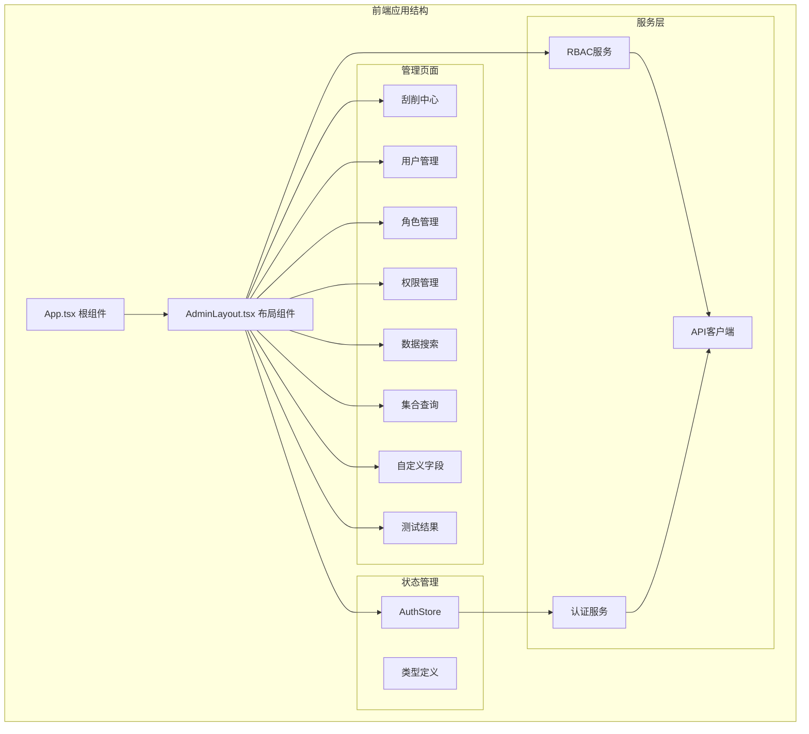
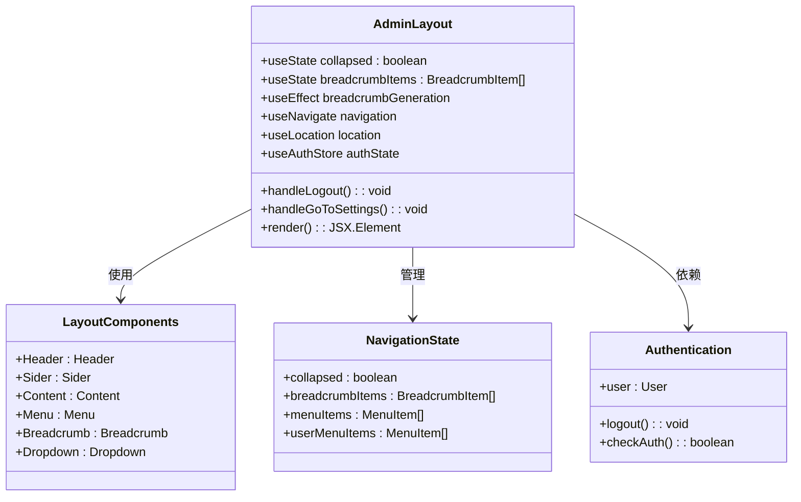
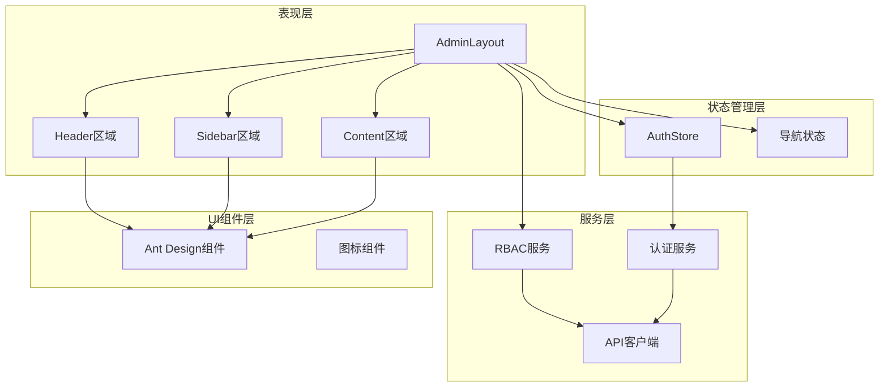
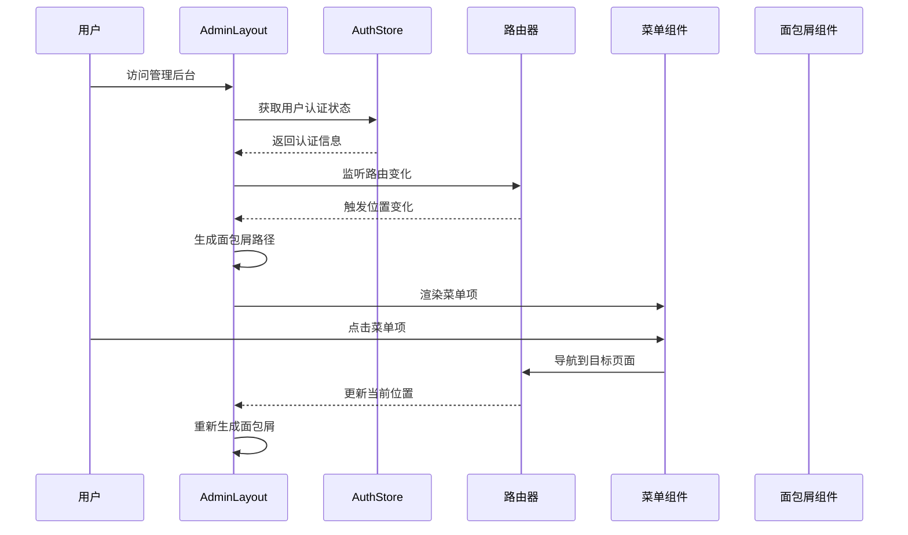
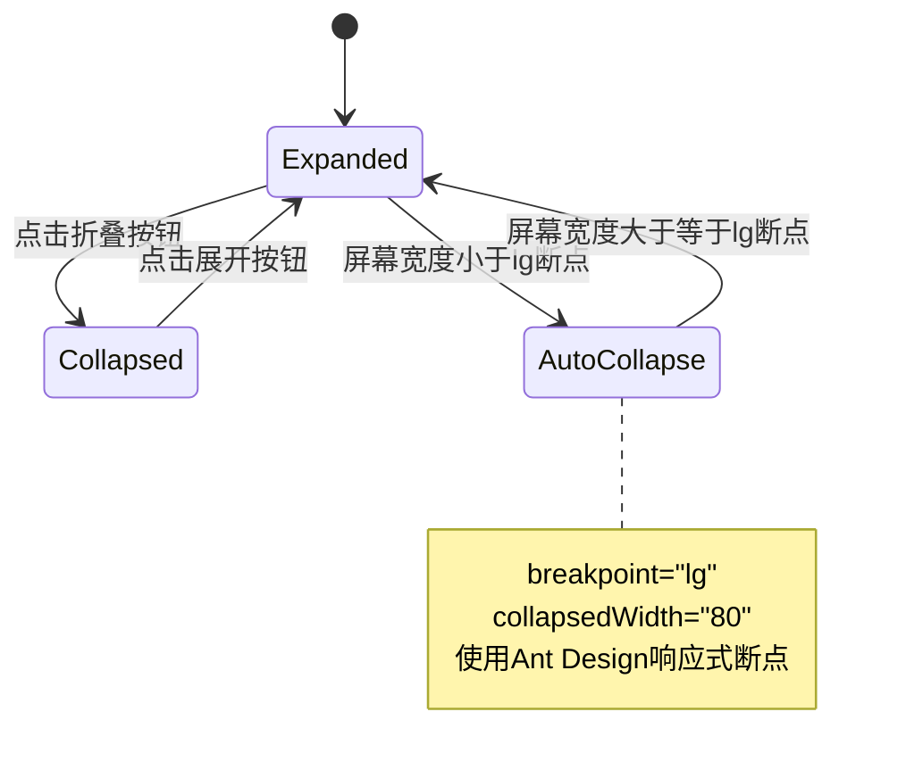
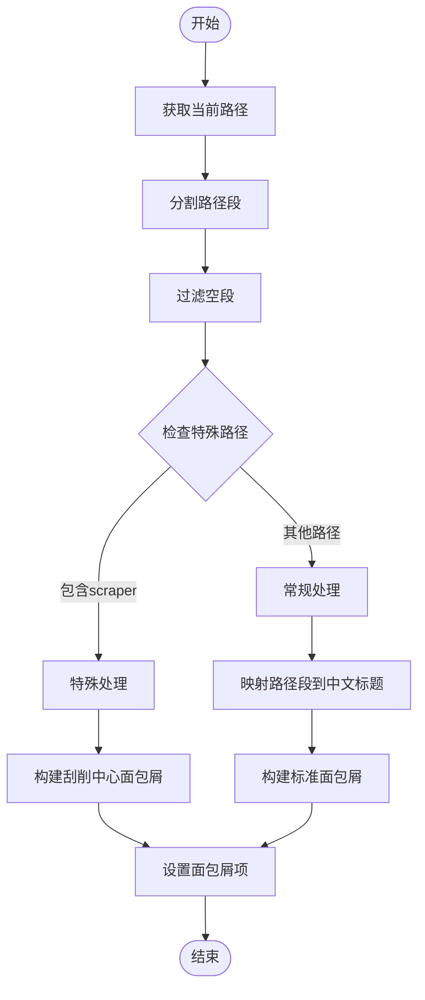
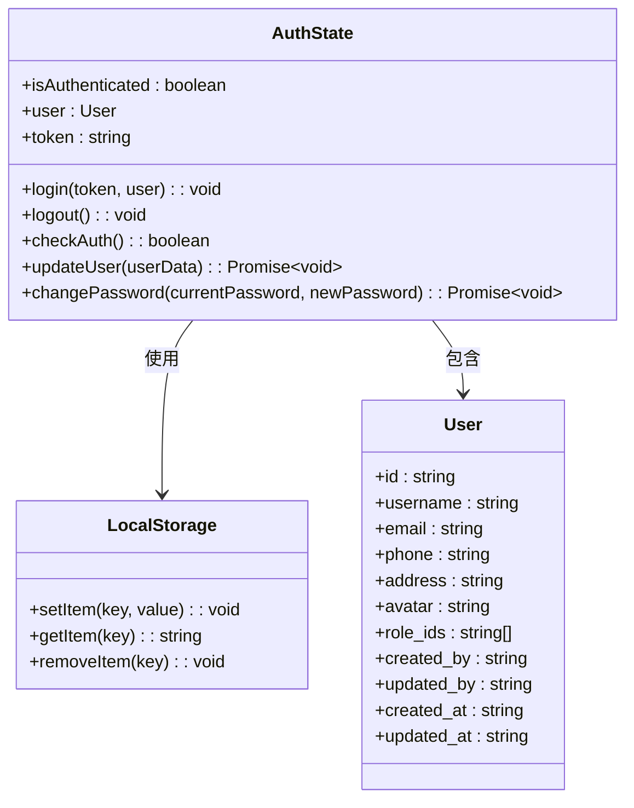
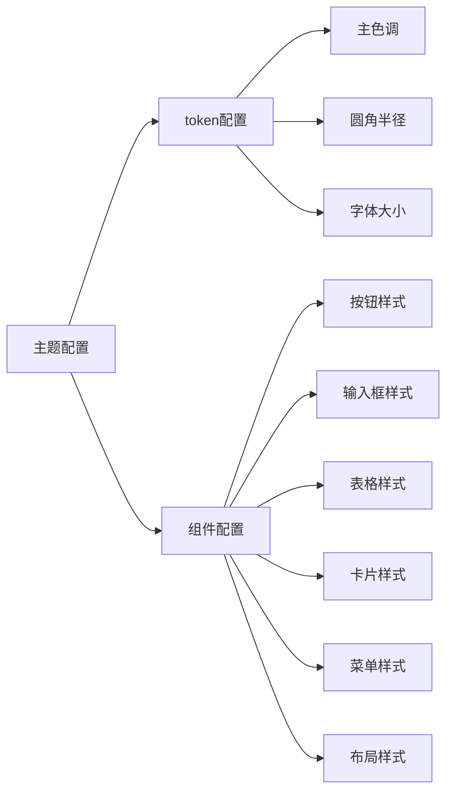
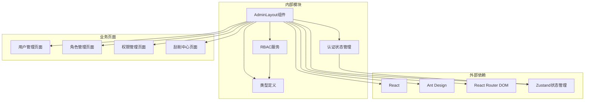
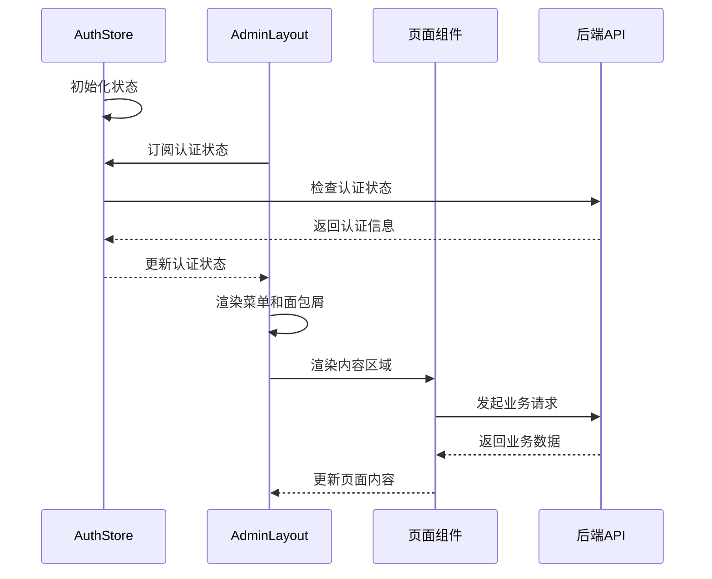

# 管理布局组件

<cite>
**本文档引用的文件**
- [AdminLayout.tsx](file://frontend/src/pages/Admin/AdminLayout.tsx)
- [authStore.ts](file://frontend/src/stores/authStore.ts)
- [App.tsx](file://frontend/src/App.tsx)
- [themeConfig.ts](file://frontend/src/theme/themeConfig.ts)
- [rbac.ts](file://frontend/src/services/rbac.ts)
- [index.ts](file://frontend/src/types/index.ts)
- [UserManagement.tsx](file://frontend/src/pages/Admin/UserManagement.tsx)
- [RoleManagement.tsx](file://frontend/src/pages/Admin/RoleManagement.tsx)
- [PermissionManagement.tsx](file://frontend/src/pages/Admin/PermissionManagement.tsx)
</cite>

## 目录
1. [简介](#简介)
2. [项目结构](#项目结构)
3. [核心组件](#核心组件)
4. [架构概览](#架构概览)
5. [详细组件分析](#详细组件分析)
6. [依赖关系分析](#依赖关系分析)
7. [性能考虑](#性能考虑)
8. [故障排除指南](#故障排除指南)
9. [结论](#结论)

## 简介

AdminLayout 是本项目的核心管理界面布局组件，基于 Ant Design 设计系统构建。该组件提供了完整的管理后台界面框架，包括响应式侧边栏导航、动态面包屑导航系统和用户菜单功能。组件采用现代化的 React Hooks 架构，集成了状态管理、路由处理和权限控制功能。

该布局组件支持多种屏幕尺寸的自适应设计，通过 Ant Design 的响应式断点系统实现移动端优化。组件内部实现了完整的用户认证状态管理和权限控制机制，确保只有具备相应权限的用户才能访问特定的功能模块。

## 项目结构

前端项目采用模块化组织方式，AdminLayout 组件位于管理页面目录下，与业务页面组件形成清晰的层次结构：

**图表来源**
- [App.tsx:41-67](file://frontend/src/App.tsx#L41-L67)
- [AdminLayout.tsx:9-203](file://frontend/src/pages/Admin/AdminLayout.tsx#L9-L203)

**章节来源**
- [App.tsx:1-69](file://frontend/src/App.tsx#L1-L69)
- [AdminLayout.tsx:1-203](file://frontend/src/pages/Admin/AdminLayout.tsx#L1-L203)

## 核心组件

### AdminLayout 组件架构

AdminLayout 作为整个管理后台的布局容器，采用了 Ant Design 的 Layout 组件体系，实现了经典的三栏布局结构：

**图表来源**
- [AdminLayout.tsx:9-203](file://frontend/src/pages/Admin/AdminLayout.tsx#L9-L203)

组件的核心特性包括：

1. **响应式侧边栏导航**：支持折叠展开，使用 Ant Design 的 Sider 组件实现
2. **动态面包屑系统**：根据当前路由路径自动生成导航层级
3. **用户菜单功能**：提供用户设置和退出登录功能
4. **状态管理集成**：与全局认证状态管理器连接
5. **权限控制**：基于用户角色和权限的菜单项显示控制

**章节来源**
- [AdminLayout.tsx:9-203](file://frontend/src/pages/Admin/AdminLayout.tsx#L9-L203)

## 架构概览

### 整体架构设计

AdminLayout 采用分层架构设计，各组件职责明确，耦合度低：

**图表来源**
- [AdminLayout.tsx:150-201](file://frontend/src/pages/Admin/AdminLayout.tsx#L150-L201)
- [authStore.ts:15-61](file://frontend/src/stores/authStore.ts#L15-L61)

### 组件交互流程

**图表来源**
- [AdminLayout.tsx:16-54](file://frontend/src/pages/Admin/AdminLayout.tsx#L16-L54)
- [App.tsx:19-31](file://frontend/src/App.tsx#L19-L31)

## 详细组件分析

### 响应式侧边栏导航系统

AdminLayout 的侧边栏导航系统是其核心功能之一，实现了完整的响应式设计：

#### 折叠状态管理

**图表来源**
- [AdminLayout.tsx:176-184](file://frontend/src/pages/Admin/AdminLayout.tsx#L176-L184)

#### 菜单项配置

侧边栏菜单采用嵌套结构，支持多级导航：

| 菜单类别 | 子菜单项 | 功能描述 |
|---------|---------|----------|
| 刮削中心 | 数据查询、删除数据查询 | 刮削数据管理功能 |
| 数据管理 | 数据搜索、集合查询、自定义字段 | 数据操作和管理 |
| 用户中心 | 用户管理、角色管理、权限管理、测试结果 | 用户和权限管理 |

每个菜单项都配置了相应的图标和点击事件处理器，实现页面间的无缝跳转。

**章节来源**
- [AdminLayout.tsx:81-148](file://frontend/src/pages/Admin/AdminLayout.tsx#L81-L148)

### 面包屑导航系统

面包屑导航系统实现了动态路径生成，为用户提供清晰的页面层级导航：

#### 路径解析算法

**图表来源**
- [AdminLayout.tsx:16-54](file://frontend/src/pages/Admin/AdminLayout.tsx#L16-L54)

#### 中文标题映射表

| 英文路径段 | 中文标题 |
|-----------|----------|
| admin | 管理后台 |
| search | 数据搜索 |
| collection-query | 集合查询 |
| custom-fields | 自定义字段 |
| user-center | 用户中心 |
| users | 用户管理 |
| roles | 角色管理 |
| permissions | 权限管理 |
| scraper | 刮削中心 |
| data-management | 数据管理 |
| test-results | 测试结果 |

**章节来源**
- [AdminLayout.tsx:29-53](file://frontend/src/pages/Admin/AdminLayout.tsx#L29-L53)

### 用户菜单功能

用户菜单提供了便捷的用户操作入口：

#### 菜单项配置

| 菜单项 | 功能 | 图标 | 行为 |
|-------|------|------|------|
| 个人设置 | 导航到设置页面 | SettingOutlined | 跳转到设置页 |
| 退出登录 | 注销当前会话 | LogoutOutlined | 调用登出函数 |
| 危险操作标记 | 标记为危险操作 | danger属性 | 红色警示样式 |

**章节来源**
- [AdminLayout.tsx:65-79](file://frontend/src/pages/Admin/AdminLayout.tsx#L65-L79)

### 状态管理系统

#### 认证状态管理

**图表来源**
- [authStore.ts:4-13](file://frontend/src/stores/authStore.ts#L4-L13)

#### 状态持久化机制

认证状态通过浏览器本地存储实现持久化，确保页面刷新后仍能保持登录状态：

1. **登录状态存储**：将 token 和用户信息存储在 localStorage
2. **自动检查机制**：应用启动时自动检查认证状态
3. **状态同步**：本地存储与内存状态保持同步

**章节来源**
- [authStore.ts:15-61](file://frontend/src/stores/authStore.ts#L15-L61)

### Ant Design 组件集成

#### 主要组件配置

AdminLayout 集成了多个 Ant Design 组件，每个组件都经过精心配置以满足管理后台的需求：

| 组件类型 | 组件名称 | 配置要点 | 样式定制 |
|---------|----------|----------|----------|
| 布局容器 | Layout | minHeight: '100vh' | 全屏高度 |
| 顶部区域 | Header | 背景颜色、内边距 | 深色主题 |
| 侧边栏 | Sider | 宽度、可折叠、断点 | 暗色主题 |
| 菜单导航 | Menu | 内联模式、默认选中项 | 暗色主题 |
| 面包屑 | Breadcrumb | 动态项数组 | 间距设置 |
| 用户下拉 | Dropdown | 菜单项、触发方式 | 无 |
| 头像组件 | Avatar | 尺寸、图标 | 无 |

#### 主题配置

**图表来源**
- [themeConfig.ts:3-60](file://frontend/src/theme/themeConfig.ts#L3-L60)

**章节来源**
- [AdminLayout.tsx:150-201](file://frontend/src/pages/Admin/AdminLayout.tsx#L150-L201)
- [themeConfig.ts:1-62](file://frontend/src/theme/themeConfig.ts#L1-L62)

## 依赖关系分析

### 组件依赖图

**图表来源**
- [AdminLayout.tsx:1-6](file://frontend/src/pages/Admin/AdminLayout.tsx#L1-L6)
- [authStore.ts:1-2](file://frontend/src/stores/authStore.ts#L1-L2)

### 数据流分析

**图表来源**
- [App.tsx:19-31](file://frontend/src/App.tsx#L19-L31)
- [authStore.ts:29-46](file://frontend/src/stores/authStore.ts#L29-L46)

**章节来源**
- [App.tsx:19-31](file://frontend/src/App.tsx#L19-L31)
- [authStore.ts:15-61](file://frontend/src/stores/authStore.ts#L15-L61)

## 性能考虑

### 渲染优化策略

1. **状态分离**：将菜单状态和面包屑状态分离，避免不必要的重渲染
2. **路由监听优化**：使用 useEffect 监听 location 变化，只在路径改变时更新面包屑
3. **组件懒加载**：页面组件使用 React.lazy 实现按需加载
4. **状态缓存**：认证状态通过 localStorage 缓存，减少重复请求

### 内存管理

1. **清理副作用**：组件卸载时自动清理路由监听器
2. **事件处理优化**：使用箭头函数避免重复绑定
3. **对象引用稳定**：菜单项和面包屑项使用稳定的引用

### 移动端性能

1. **响应式断点**：使用 Ant Design 的 lg 断点自动折叠侧边栏
2. **触摸优化**：菜单项和按钮采用合适的触摸目标尺寸
3. **网络优化**：页面组件懒加载减少初始包体积

## 故障排除指南

### 常见问题及解决方案

#### 登录状态异常

**问题描述**：用户已登录但页面显示未登录状态

**可能原因**：
1. localStorage 中的 token 已过期
2. 用户信息解析失败
3. 认证状态检查逻辑异常

**解决步骤**：
1. 检查 localStorage 中的 token 和用户信息
2. 验证用户信息的 JSON 格式
3. 查看控制台错误日志

**章节来源**
- [authStore.ts:29-46](file://frontend/src/stores/authStore.ts#L29-L46)

#### 面包屑显示异常

**问题描述**：面包屑导航显示不正确或缺失

**可能原因**：
1. 路径映射表缺少对应条目
2. 特殊路径处理逻辑错误
3. 路由配置不正确

**解决步骤**：
1. 检查路径映射表是否包含所有路由段
2. 验证特殊路径处理逻辑
3. 确认路由配置的正确性

**章节来源**
- [AdminLayout.tsx:32-53](file://frontend/src/pages/Admin/AdminLayout.tsx#L32-L53)

#### 菜单项显示问题

**问题描述**：某些菜单项无法正常显示或点击无效

**可能原因**：
1. 菜单项配置错误
2. 路由路径不匹配
3. 权限控制逻辑异常

**解决步骤**：
1. 检查菜单项的 key 和 path 配置
2. 验证路由配置的一致性
3. 确认权限控制逻辑的正确性

**章节来源**
- [AdminLayout.tsx:81-148](file://frontend/src/pages/Admin/AdminLayout.tsx#L81-L148)

### 调试工具和技巧

1. **React DevTools**：检查组件状态和 props
2. **浏览器开发者工具**：监控网络请求和状态变化
3. **控制台日志**：添加关键节点的日志输出
4. **Redux DevTools**：调试状态管理（如使用）

## 结论

AdminLayout 组件作为管理后台的核心布局组件，展现了现代前端开发的最佳实践。该组件成功地将 Ant Design 的设计系统与 React 的组件化思想相结合，实现了功能完整、性能优良的管理界面框架。

### 主要优势

1. **架构清晰**：采用分层设计，职责分离明确
2. **用户体验优秀**：响应式设计和流畅的交互体验
3. **扩展性强**：模块化设计便于功能扩展
4. **维护性好**：代码结构清晰，易于理解和维护

### 技术亮点

1. **状态管理集成**：与 Zustand 的深度集成提供了简洁的状态管理方案
2. **路由系统整合**：与 React Router 的无缝集成
3. **权限控制**：内置的权限控制机制为安全访问提供了保障
4. **主题定制**：完整的 Ant Design 主题配置支持

### 改进建议

1. **权限控制增强**：可以考虑将菜单项的显示逻辑与权限服务集成
2. **国际化支持**：添加多语言支持以适应国际化需求
3. **性能监控**：集成性能监控工具以持续优化用户体验
4. **测试覆盖**：增加单元测试和集成测试以提高代码质量

AdminLayout 组件为管理后台的开发奠定了坚实的基础，其设计理念和实现方式值得在类似的项目中借鉴和参考。