# 管理界面功能

<cite>
**本文引用的文件**
- [frontend/src/pages/Admin/AdminLayout.tsx](file://frontend/src/pages/Admin/AdminLayout.tsx)
- [frontend/src/App.tsx](file://frontend/src/App.tsx)
- [frontend/src/main.tsx](file://frontend/src/main.tsx)
- [frontend/src/theme/themeConfig.ts](file://frontend/src/theme/themeConfig.ts)
- [frontend/src/stores/authStore.ts](file://frontend/src/stores/authStore.ts)
- [frontend/src/services/api.ts](file://frontend/src/services/api.ts)
- [frontend/src/services/rbac.ts](file://frontend/src/services/rbac.ts)
- [frontend/src/types/index.ts](file://frontend/src/types/index.ts)
- [frontend/src/pages/Admin/UserManagement.tsx](file://frontend/src/pages/Admin/UserManagement.tsx)
- [frontend/src/pages/Admin/RoleManagement.tsx](file://frontend/src/pages/Admin/RoleManagement.tsx)
- [frontend/src/pages/Admin/PermissionManagement.tsx](file://frontend/src/pages/Admin/PermissionManagement.tsx)
- [frontend/src/pages/Admin/ScraperCenter.tsx](file://frontend/src/pages/Admin/ScraperCenter.tsx)
- [frontend/src/pages/Admin/SearchPage.tsx](file://frontend/src/pages/Admin/SearchPage.tsx)
- [frontend/src/pages/Admin/CustomFieldsPage.tsx](file://frontend/src/pages/Admin/CustomFieldsPage.tsx)
- [frontend/src/pages/Admin/CollectionQueryPage.tsx](file://frontend/src/pages/Admin/CollectionQueryPage.tsx)
</cite>

## 目录
1. [简介](#简介)
2. [项目结构](#项目结构)
3. [核心组件](#核心组件)
4. [架构总览](#架构总览)
5. [详细组件分析](#详细组件分析)
6. [依赖关系分析](#依赖关系分析)
7. [性能考量](#性能考量)
8. [故障排查指南](#故障排查指南)
9. [结论](#结论)
10. [附录](#附录)

## 简介
本文件系统性梳理基于 Ant Design 的管理界面功能，覆盖 AdminLayout 布局、导航菜单与页面组织结构；详解用户管理、角色管理、权限管理、自定义字段管理、刮削中心与数据查询页面的实现；说明页面间数据流与状态同步机制；提供组件级使用指南（表单验证、数据表格、模态框、按钮组）、响应式与移动端适配策略、前端权限控制方案以及界面定制化与主题配置扩展方法。

## 项目结构
前端采用 React + TypeScript + Ant Design 架构，路由通过 React Router v6 管理，状态通过 Zustand 管理，Axios 封装统一 API 客户端，RBAC 服务封装角色与权限相关接口。

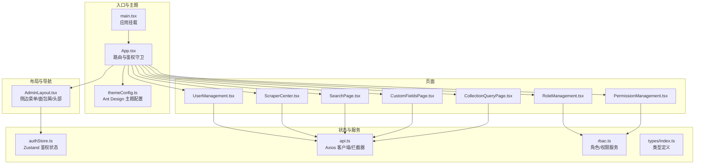

**图表来源**
- [frontend/src/main.tsx:1-10](file://frontend/src/main.tsx#L1-L10)
- [frontend/src/App.tsx:1-69](file://frontend/src/App.tsx#L1-L69)
- [frontend/src/theme/themeConfig.ts:1-62](file://frontend/src/theme/themeConfig.ts#L1-L62)
- [frontend/src/pages/Admin/AdminLayout.tsx:1-203](file://frontend/src/pages/Admin/AdminLayout.tsx#L1-L203)
- [frontend/src/stores/authStore.ts:1-61](file://frontend/src/stores/authStore.ts#L1-L61)
- [frontend/src/services/api.ts:1-37](file://frontend/src/services/api.ts#L1-L37)
- [frontend/src/services/rbac.ts:1-196](file://frontend/src/services/rbac.ts#L1-L196)
- [frontend/src/types/index.ts:1-97](file://frontend/src/types/index.ts#L1-L97)

**章节来源**
- [frontend/src/main.tsx:1-10](file://frontend/src/main.tsx#L1-L10)
- [frontend/src/App.tsx:1-69](file://frontend/src/App.tsx#L1-L69)
- [frontend/src/theme/themeConfig.ts:1-62](file://frontend/src/theme/themeConfig.ts#L1-L62)

## 核心组件
- AdminLayout：提供顶部导航、侧边菜单、面包屑与内容区域出口，支持折叠、用户下拉菜单与登出。
- ProtectedRoute：基于鉴权状态保护受控路由，未登录自动跳转登录页。
- authStore：Zustand 鉴权状态，持久化 token 与用户信息，提供登录、登出、检查鉴权等能力。
- api.ts：Axios 实例，统一注入 Authorization 头，处理 401 自动登出。
- rbac.ts：角色与权限服务封装，统一处理分页与字段映射。
- 类型系统：User、Role、Permission、分页与通用响应体等类型定义。

**章节来源**
- [frontend/src/pages/Admin/AdminLayout.tsx:9-203](file://frontend/src/pages/Admin/AdminLayout.tsx#L9-L203)
- [frontend/src/App.tsx:19-31](file://frontend/src/App.tsx#L19-L31)
- [frontend/src/stores/authStore.ts:15-61](file://frontend/src/stores/authStore.ts#L15-L61)
- [frontend/src/services/api.ts:5-37](file://frontend/src/services/api.ts#L5-L37)
- [frontend/src/services/rbac.ts:11-196](file://frontend/src/services/rbac.ts#L11-L196)
- [frontend/src/types/index.ts:1-97](file://frontend/src/types/index.ts#L1-L97)

## 架构总览
管理界面采用“布局-页面”分层，路由按模块划分，页面内部通过服务层与 API 交互，状态通过 Zustand 管理，主题通过 ConfigProvider 注入 Ant Design。

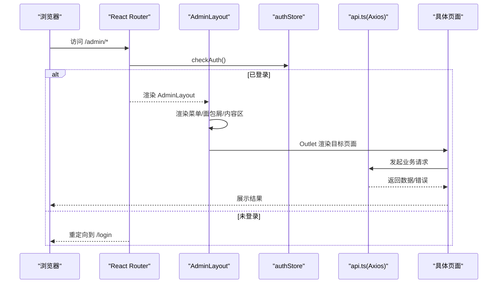

**图表来源**
- [frontend/src/App.tsx:19-62](file://frontend/src/App.tsx#L19-L62)
- [frontend/src/pages/Admin/AdminLayout.tsx:9-203](file://frontend/src/pages/Admin/AdminLayout.tsx#L9-L203)
- [frontend/src/stores/authStore.ts:29-46](file://frontend/src/stores/authStore.ts#L29-L46)
- [frontend/src/services/api.ts:10-35](file://frontend/src/services/api.ts#L10-L35)

## 详细组件分析

### AdminLayout 布局组件
- 功能要点
  - 顶部区域：折叠按钮、站点标题、用户头像下拉菜单（个人设置、退出登录）。
  - 侧边菜单：按“刮削中心/数据管理/用户中心”分组，支持子项点击跳转。
  - 面包屑：根据当前路径动态生成，特殊处理“刮削中心”场景。
  - 内容区：Outlet 占位渲染当前页面。
- 响应式与移动端
  - Sider 支持 breakpoint="lg" 与 collapsedWidth="80"，在小屏自动折叠。
- 主题与样式
  - 使用 themeConfig 中的 Token 与组件级覆盖，统一颜色、圆角、阴影与组件风格。

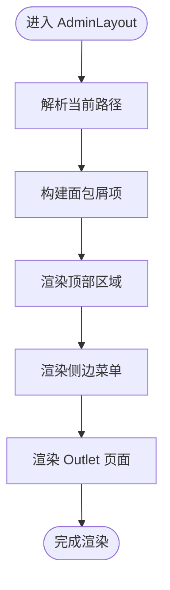

**图表来源**
- [frontend/src/pages/Admin/AdminLayout.tsx:16-54](file://frontend/src/pages/Admin/AdminLayout.tsx#L16-L54)
- [frontend/src/pages/Admin/AdminLayout.tsx:81-148](file://frontend/src/pages/Admin/AdminLayout.tsx#L81-L148)
- [frontend/src/pages/Admin/AdminLayout.tsx:176-199](file://frontend/src/pages/Admin/AdminLayout.tsx#L176-L199)

**章节来源**
- [frontend/src/pages/Admin/AdminLayout.tsx:9-203](file://frontend/src/pages/Admin/AdminLayout.tsx#L9-L203)
- [frontend/src/theme/themeConfig.ts:3-60](file://frontend/src/theme/themeConfig.ts#L3-L60)

### 用户管理(UserManagement)
- 功能概览
  - 用户列表：分页、搜索（用户名/邮箱）、加载状态、操作列（编辑、删除）。
  - 角色分配：弹窗多选分配/移除角色，支持刷新列表。
  - 表单校验：用户名唯一、邮箱格式、密码必填规则。
- 数据流
  - 获取用户列表与角色列表，提交新增/更新，删除用户，分配/移除角色。
  - 列表过滤基于本地 searchText，分页参数通过 skip/limit 控制。
- 组件使用要点
  - Table + Form + Modal + Popconfirm + Tag + Select + Button。
  - 表单验证规则与禁用字段（编辑时用户名不可改）。

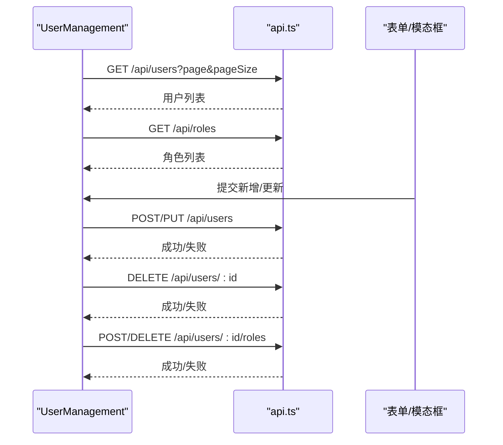

**图表来源**
- [frontend/src/pages/Admin/UserManagement.tsx:35-67](file://frontend/src/pages/Admin/UserManagement.tsx#L35-L67)
- [frontend/src/pages/Admin/UserManagement.tsx:96-120](file://frontend/src/pages/Admin/UserManagement.tsx#L96-L120)
- [frontend/src/pages/Admin/UserManagement.tsx:133-156](file://frontend/src/pages/Admin/UserManagement.tsx#L133-L156)

**章节来源**
- [frontend/src/pages/Admin/UserManagement.tsx:22-385](file://frontend/src/pages/Admin/UserManagement.tsx#L22-L385)

### 角色管理(RoleManagement)
- 功能概览
  - 角色列表：分页、搜索、排序、筛选、徽标显示权限数量。
  - 权限分组：按权限 code 前缀分组展示，Checkbox.Group 选择。
  - 新增/编辑：表单校验、权限 ID 数组处理、异步加载角色详情。
- 数据流
  - 通过 rbac.ts 的 roleService/permissionService 获取数据，处理后端字段映射。
- 组件使用要点
  - Table + Form + Modal + Checkbox.Group + Divider + Badge。

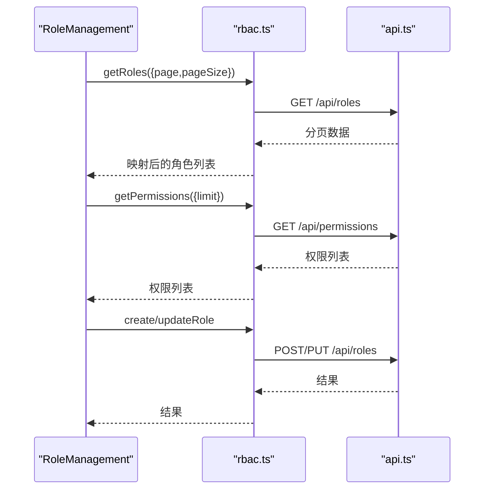

**图表来源**
- [frontend/src/pages/Admin/RoleManagement.tsx:18-46](file://frontend/src/pages/Admin/RoleManagement.tsx#L18-L46)
- [frontend/src/services/rbac.ts:18-135](file://frontend/src/services/rbac.ts#L18-L135)

**章节来源**
- [frontend/src/pages/Admin/RoleManagement.tsx:7-363](file://frontend/src/pages/Admin/RoleManagement.tsx#L7-L363)
- [frontend/src/services/rbac.ts:11-135](file://frontend/src/services/rbac.ts#L11-L135)

### 权限管理(PermissionManagement)
- 功能概览
  - 权限列表：分页、搜索、筛选、模块标签展示。
  - 新增/编辑：模块下拉选择、code 格式提示、描述文本域。
- 数据流
  - 通过 permissionService 获取/创建/更新/删除权限，处理后端字段映射。

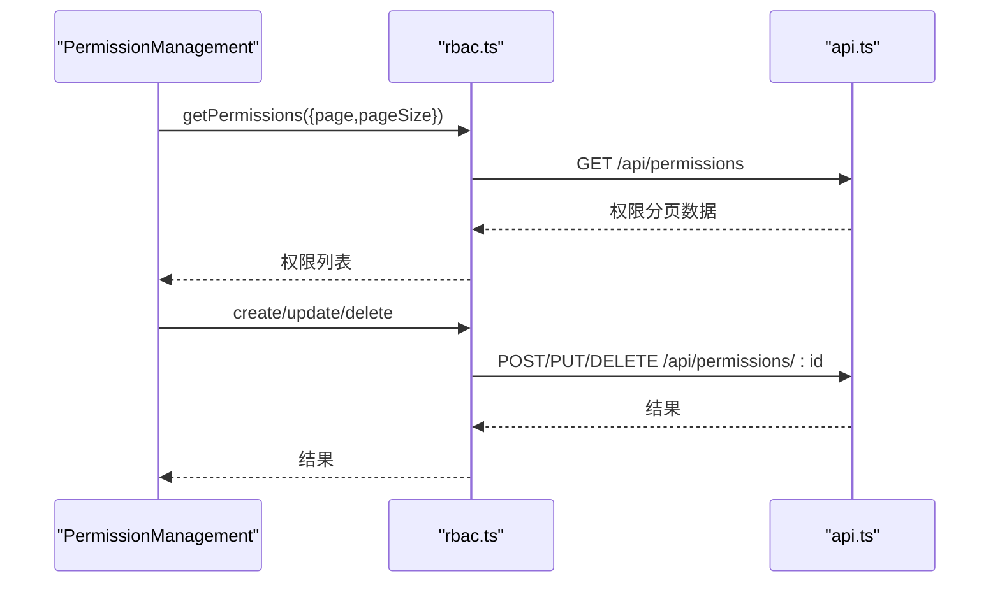

**图表来源**
- [frontend/src/pages/Admin/PermissionManagement.tsx:23-40](file://frontend/src/pages/Admin/PermissionManagement.tsx#L23-L40)
- [frontend/src/services/rbac.ts:137-194](file://frontend/src/services/rbac.ts#L137-L194)

**章节来源**
- [frontend/src/pages/Admin/PermissionManagement.tsx:14-261](file://frontend/src/pages/Admin/PermissionManagement.tsx#L14-L261)
- [frontend/src/services/rbac.ts:137-194](file://frontend/src/services/rbac.ts#L137-L194)

### 刮削中心(ScraperCenter)
- 功能概览
  - 任务列表：模块、路径、状态、时间、操作（重试）。
  - 已删除任务：模块、路径、状态、操作（恢复）。
  - 批量删除：多选行、确认删除。
  - 创建任务：模块、数据路径、刮削器路径、描述。
  - 重试任务：可指定刮削器路径。
- 数据流
  - 通过 scraperService 与 apiClient 交互，支持分页与搜索关键词。

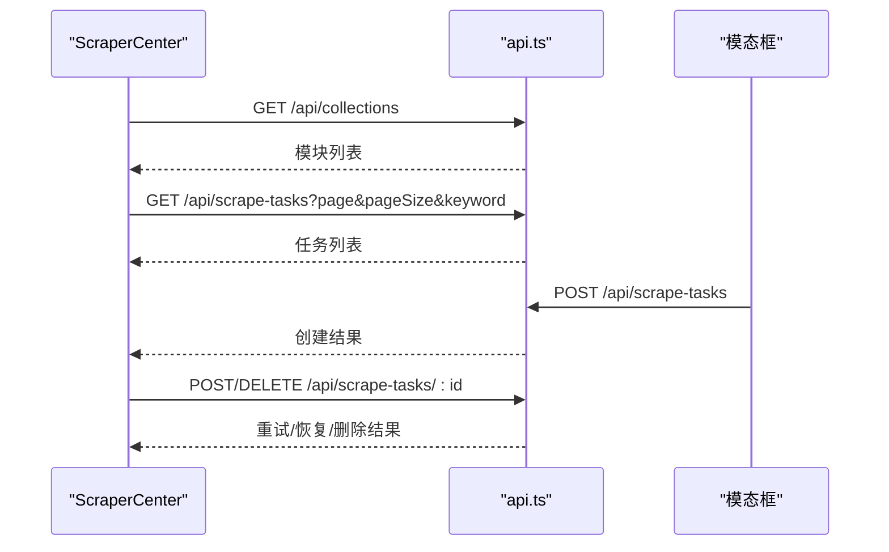

**图表来源**
- [frontend/src/pages/Admin/ScraperCenter.tsx:24-91](file://frontend/src/pages/Admin/ScraperCenter.tsx#L24-L91)
- [frontend/src/pages/Admin/ScraperCenter.tsx:116-133](file://frontend/src/pages/Admin/ScraperCenter.tsx#L116-L133)
- [frontend/src/pages/Admin/ScraperCenter.tsx:135-166](file://frontend/src/pages/Admin/ScraperCenter.tsx#L135-L166)

**章节来源**
- [frontend/src/pages/Admin/ScraperCenter.tsx:7-500](file://frontend/src/pages/Admin/ScraperCenter.tsx#L7-L500)

### 数据搜索(SearchPage)
- 功能概览
  - 模块切换：动态加载字段定义，支持 JQL 查询。
  - 动态表单：根据字段定义渲染不同类型的表单项（字符串/数字/布尔/日期/枚举）。
  - CRUD：创建/编辑/删除业务数据，支持描述字段。
  - 表格列：动态生成，支持横向滚动。
- 数据流
  - 通过 apiClient 获取集合、字段定义与业务数据，JQL 查询参数透传。

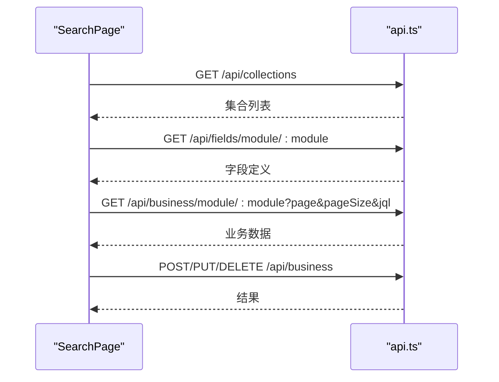

**图表来源**
- [frontend/src/pages/Admin/SearchPage.tsx:74-138](file://frontend/src/pages/Admin/SearchPage.tsx#L74-L138)
- [frontend/src/pages/Admin/SearchPage.tsx:103-128](file://frontend/src/pages/Admin/SearchPage.tsx#L103-L128)

**章节来源**
- [frontend/src/pages/Admin/SearchPage.tsx:59-583](file://frontend/src/pages/Admin/SearchPage.tsx#L59-L583)

### 自定义字段管理(CustomFieldsPage)
- 功能概览
  - 模块切换：按模块加载字段定义。
  - 字段 CRUD：字段名、类型、描述、必填、默认值、约束（数值范围/长度/正则/枚举）。
  - 展开行：展示约束详情 JSON。
- 数据流
  - 通过 apiClient 获取/创建/更新/删除字段定义。

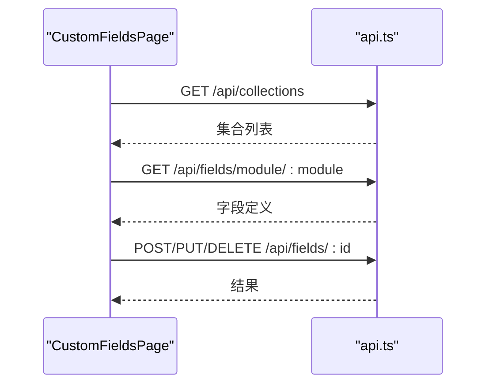

**图表来源**
- [frontend/src/pages/Admin/CustomFieldsPage.tsx:62-94](file://frontend/src/pages/Admin/CustomFieldsPage.tsx#L62-L94)
- [frontend/src/pages/Admin/CustomFieldsPage.tsx:116-237](file://frontend/src/pages/Admin/CustomFieldsPage.tsx#L116-L237)

**章节来源**
- [frontend/src/pages/Admin/CustomFieldsPage.tsx:51-525](file://frontend/src/pages/Admin/CustomFieldsPage.tsx#L51-L525)

### 集合查询(CollectionQueryPage)
- 功能概览
  - 集合列表：分页、搜索、排序、操作（编辑/删除）。
  - 创建/编辑：模块名、描述、集合管理员（用户下拉）。
  - 删除：级联删除（角色、权限、字段定义、业务数据）。
- 数据流
  - 通过 apiClient 获取/创建/更新/删除集合，用户列表用于管理员选择。

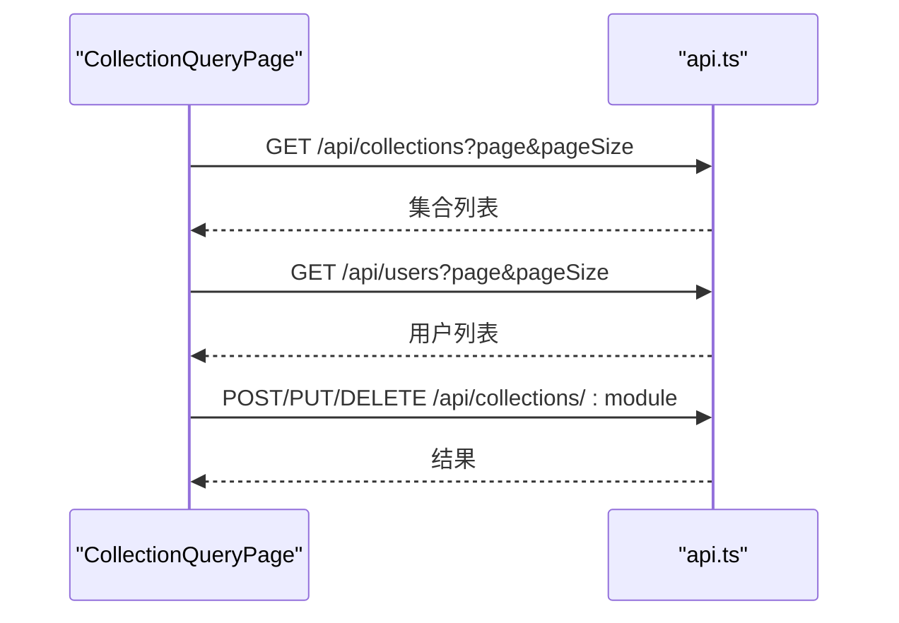

**图表来源**
- [frontend/src/pages/Admin/CollectionQueryPage.tsx:37-75](file://frontend/src/pages/Admin/CollectionQueryPage.tsx#L37-L75)
- [frontend/src/pages/Admin/CollectionQueryPage.tsx:86-143](file://frontend/src/pages/Admin/CollectionQueryPage.tsx#L86-L143)

**章节来源**
- [frontend/src/pages/Admin/CollectionQueryPage.tsx:24-348](file://frontend/src/pages/Admin/CollectionQueryPage.tsx#L24-L348)

## 依赖关系分析
- 路由与鉴权
  - App.tsx 中的 ProtectedRoute 依赖 authStore.checkAuth 与状态判断。
  - 登录成功后写入 localStorage，后续 checkAuth 读取并恢复状态。
- API 客户端
  - api.ts 注入 Authorization 头，拦截 401 自动登出并跳转登录。
- RBAC 服务
  - rbac.ts 对后端返回字段进行映射（_id -> id），统一分页参数 page/pageSize。
- 类型系统
  - types/index.ts 定义 User/Role/Permission/分页/响应体等，贯穿服务与页面。

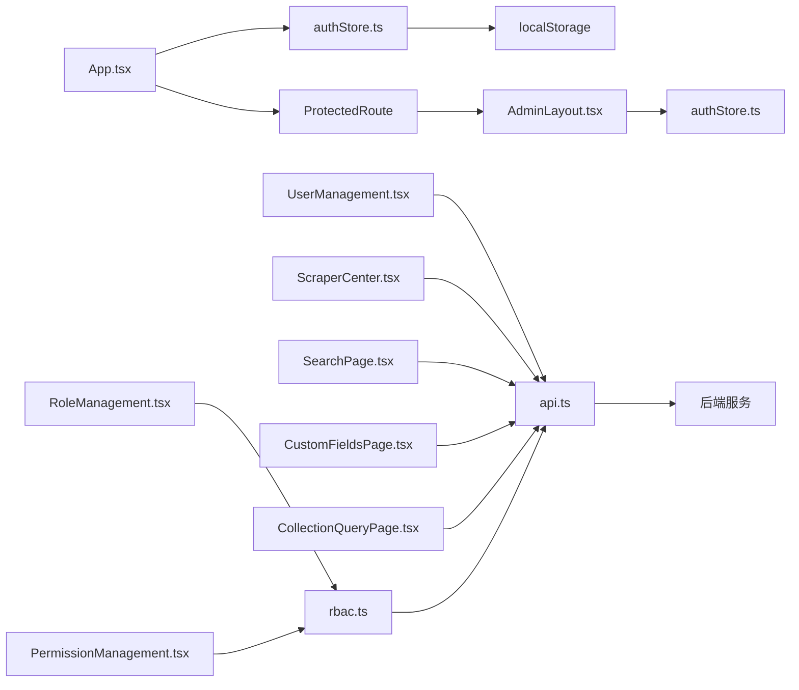

**图表来源**
- [frontend/src/App.tsx:19-31](file://frontend/src/App.tsx#L19-L31)
- [frontend/src/stores/authStore.ts:29-46](file://frontend/src/stores/authStore.ts#L29-L46)
- [frontend/src/services/api.ts:10-35](file://frontend/src/services/api.ts#L10-L35)
- [frontend/src/services/rbac.ts:18-135](file://frontend/src/services/rbac.ts#L18-L135)

**章节来源**
- [frontend/src/App.tsx:19-31](file://frontend/src/App.tsx#L19-L31)
- [frontend/src/stores/authStore.ts:15-61](file://frontend/src/stores/authStore.ts#L15-L61)
- [frontend/src/services/api.ts:1-37](file://frontend/src/services/api.ts#L1-L37)
- [frontend/src/services/rbac.ts:1-196](file://frontend/src/services/rbac.ts#L1-L196)
- [frontend/src/types/index.ts:1-97](file://frontend/src/types/index.ts#L1-L97)

## 性能考量
- 列表分页与懒加载
  - 各页面均采用分页参数 skip=(page-1)*pageSize 与 limit 控制，避免一次性加载大量数据。
- 表单与表格
  - 表单仅在打开时渲染，Modal 关闭后重置字段，减少内存占用。
  - 表格启用虚拟滚动与横向滚动，提升大数据量下的渲染性能。
- 请求拦截与缓存
  - api.ts 统一注入 token，避免重复鉴权请求；建议在业务层对热点数据做轻量缓存。
- 图标与资源
  - Ant Design 图标按需引入，避免打包冗余。

## 故障排查指南
- 登录态异常
  - 现象：访问受控路由被重定向至登录页。
  - 排查：检查 localStorage 是否存在 token 与 user；查看 authStore.checkAuth 是否返回 true。
- 401 未授权
  - 现象：请求返回 401，自动登出并跳转登录。
  - 排查：确认 Authorization 头是否正确注入；后端 JWT 是否有效。
- 表单校验失败
  - 现象：提交时报错或无法提交。
  - 排查：检查 Form.Item 的 rules 与字段禁用状态；确认必填字段已填写。
- 列表无数据或分页异常
  - 现象：表格为空或分页总数不正确。
  - 排查：确认后端分页参数 page/pageSize 与 skip/limit 映射；检查 total 字段。
- 角色/权限分配失败
  - 现象：分配/移除角色无效果。
  - 排查：确认 permission_ids/permission_codes 映射；检查后端接口返回。

**章节来源**
- [frontend/src/stores/authStore.ts:29-46](file://frontend/src/stores/authStore.ts#L29-L46)
- [frontend/src/services/api.ts:23-35](file://frontend/src/services/api.ts#L23-L35)
- [frontend/src/services/rbac.ts:28-44](file://frontend/src/services/rbac.ts#L28-L44)

## 结论
该管理界面以 AdminLayout 为核心，结合受控路由与鉴权状态，形成清晰的导航与页面组织；通过服务层抽象 API 交互与 RBAC 逻辑，页面职责明确、可维护性强。组件层面广泛使用 Ant Design 的表单、表格、模态框与按钮组，配合主题配置实现一致的视觉体验。建议在后续迭代中进一步完善前端权限细化（按钮级可见性）、国际化与更完善的错误边界处理。

## 附录

### 组件级使用指南（要点）
- 表单验证
  - 使用 Form.Item 的 rules 定义必填、格式与范围校验；编辑模式下可禁用部分字段。
- 数据表格
  - 使用 rowSelection 实现多选；pagination 与 onChange 控制分页；scroll 配置横向/纵向滚动。
- 模态框
  - Modal 打开/关闭与 Form.resetFields 配合；onFinish 提交；loading 控制提交状态。
- 按钮组
  - 使用 Space 组合按钮，结合 Popconfirm 实现二次确认；根据状态动态禁用。

### 响应式与移动端适配
- Sider 折叠：breakpoint="lg" 与 collapsedWidth="80" 在小屏自动折叠。
- 表格：横向滚动与紧凑分页，保证小屏可读性。
- 输入与选择：Select/Select.Option 支持搜索与过滤，提升移动端可用性。

### 权限控制（前端）
- 页面访问控制
  - ProtectedRoute 基于 authStore.isAuthenticated 与 checkAuth 决定是否渲染受控路由。
- 功能按钮显示隐藏
  - 当前代码未实现按钮级权限控制，可在页面内依据用户角色/权限集合动态渲染按钮或禁用操作。

### 主题配置与界面定制
- 主题配置
  - 通过 themeConfig.ts 的 token 与 components 覆盖统一颜色、圆角、阴影与组件风格。
- 入口注入
  - App.tsx 使用 ConfigProvider 包裹整树，确保全局生效。

**章节来源**
- [frontend/src/theme/themeConfig.ts:3-60](file://frontend/src/theme/themeConfig.ts#L3-L60)
- [frontend/src/App.tsx:42-66](file://frontend/src/App.tsx#L42-L66)