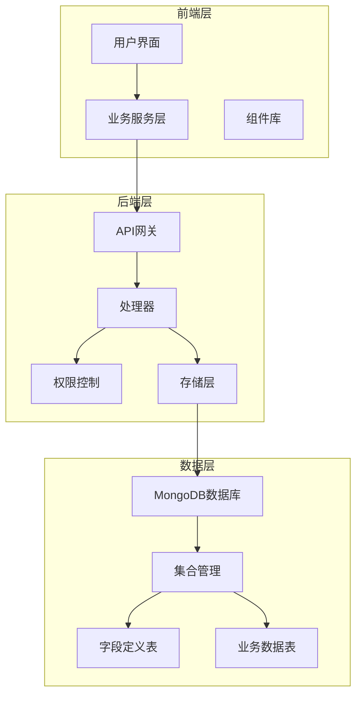
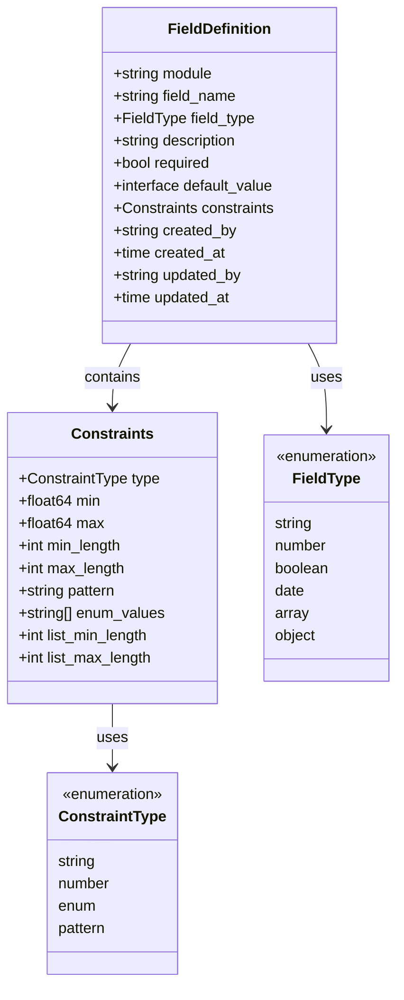
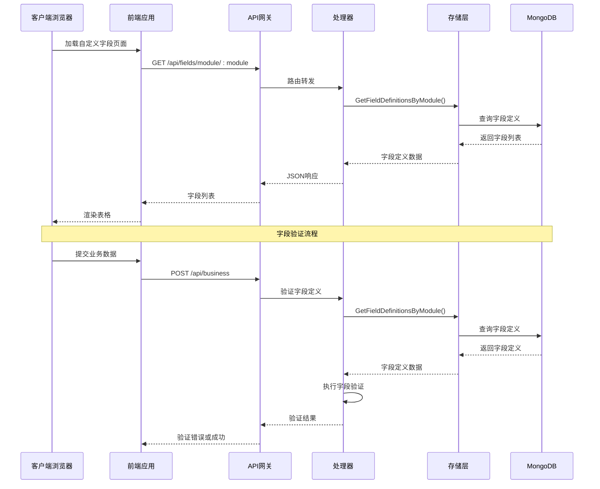
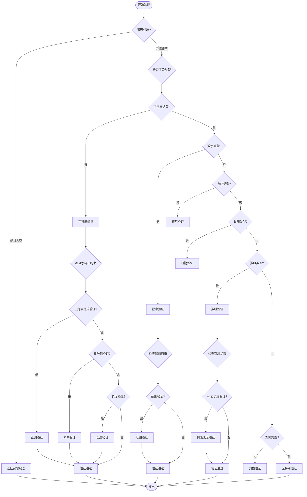
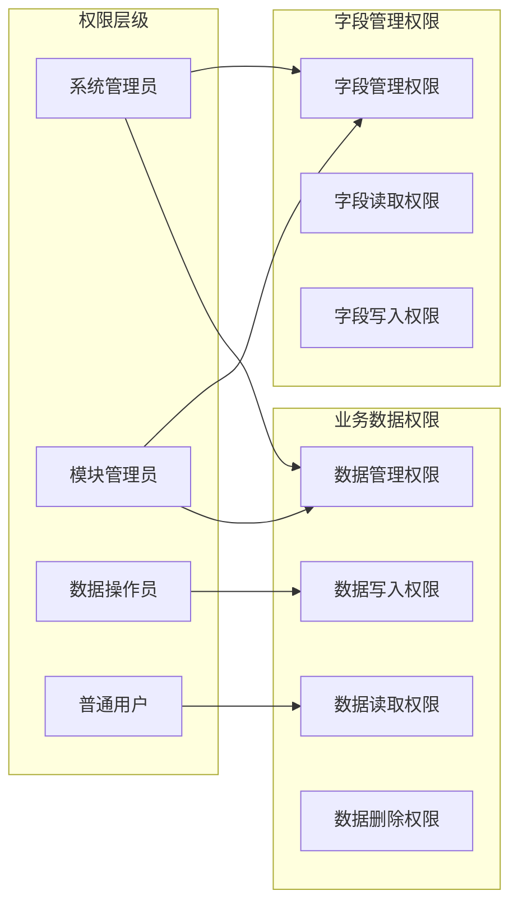
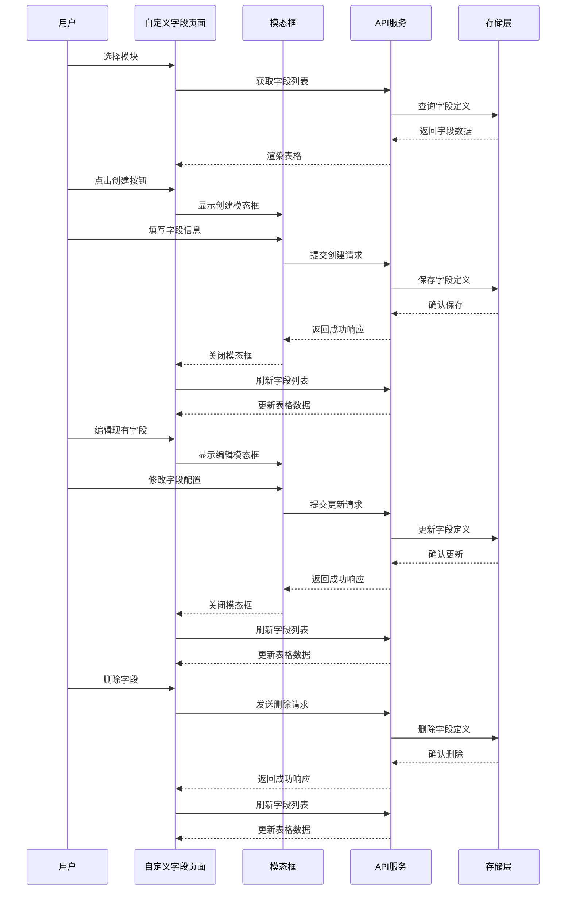
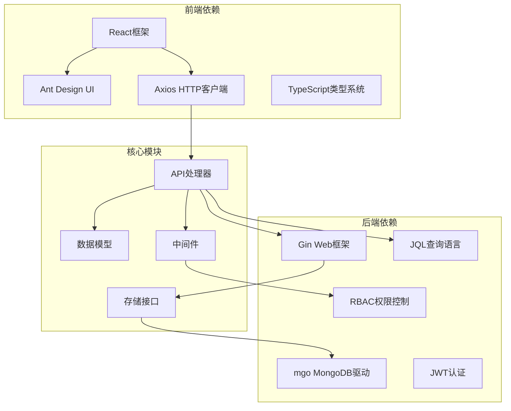

# 自定义字段管理页面

<cite>
**本文档引用的文件**
- [CustomFieldsPage.tsx](file://frontend/src/pages/Admin/CustomFieldsPage.tsx)
- [models.go](file://internal/models/models.go)
- [mongodb.go](file://internal/storage/mongodb.go)
- [mongodb_storage.go](file://internal/storage/mongodb_storage.go)
- [handlers.go](file://internal/api/handlers.go)
- [collection_permission_middleware.go](file://internal/api/collection_permission_middleware.go)
- [business.ts](file://frontend/src/services/business.ts)
- [parser.go](file://pkg/jql/parser.go)
- [collection_rbac.go](file://pkg/rbac/collection_rbac.go)
</cite>

## 目录
1. [简介](#简介)
2. [项目结构](#项目结构)
3. [核心组件](#核心组件)
4. [架构概览](#架构概览)
5. [详细组件分析](#详细组件分析)
6. [依赖关系分析](#依赖关系分析)
7. [性能考虑](#性能考虑)
8. [故障排除指南](#故障排除指南)
9. [结论](#结论)

## 简介

自定义字段管理页面是数据管理中心的核心功能模块，允许用户为不同的业务模块定义和管理自定义字段。该页面提供了完整的字段生命周期管理，包括字段定义、类型配置、验证规则设置、字段删除等功能。系统支持多种字段类型（字符串、数字、布尔值、日期、数组、对象），并提供了灵活的验证规则配置机制。

## 项目结构

该项目采用前后端分离的架构设计，前端使用React + Ant Design构建用户界面，后端使用Go语言开发RESTful API服务，数据存储基于MongoDB。

**图表来源**
- [CustomFieldsPage.tsx:1-525](file://frontend/src/pages/Admin/CustomFieldsPage.tsx#L1-L525)
- [handlers.go:45-181](file://internal/api/handlers.go#L45-L181)
- [mongodb_storage.go:16-51](file://internal/storage/mongodb_storage.go#L16-L51)

## 核心组件

### 前端组件架构

自定义字段管理页面由多个核心组件构成：

1. **主页面组件** - 负责整体布局和状态管理
2. **字段列表表格** - 展示现有字段定义
3. **创建/编辑模态框** - 处理字段定义的创建和更新
4. **约束配置面板** - 提供字段验证规则配置
5. **模块选择器** - 支持多模块字段管理

### 数据模型设计

系统定义了完整的数据模型来支持字段管理功能：

**图表来源**
- [models.go:51-61](file://internal/models/models.go#L51-L61)
- [models.go:39-49](file://internal/models/models.go#L39-L49)
- [models.go:19-28](file://internal/models/models.go#L19-L28)

**章节来源**
- [CustomFieldsPage.tsx:15-26](file://frontend/src/pages/Admin/CustomFieldsPage.tsx#L15-L26)
- [models.go:51-61](file://internal/models/models.go#L51-L61)

## 架构概览

系统采用分层架构设计，确保各层职责清晰分离：

**图表来源**
- [handlers.go:831-839](file://internal/api/handlers.go#L831-L839)
- [handlers.go:942-1011](file://internal/api/handlers.go#L942-L1011)

## 详细组件分析

### 字段类型管理系统

系统支持六种基础字段类型，每种类型都有特定的验证规则和配置选项：

| 字段类型 | 描述 | 验证规则 | 默认约束 |
|---------|------|----------|----------|
| string | 字符串类型 | 长度限制、正则表达式、枚举值 | 最小/最大长度 |
| number | 数字类型 | 数值范围、整数/浮点数 | 最小/最大值 |
| boolean | 布尔类型 | 类型验证 | 无 |
| date | 日期类型 | RFC3339格式验证 | 无 |
| array | 数组类型 | 长度限制 | 最小/最大长度 |
| object | 对象类型 | 结构验证 | 无 |

### 字段验证规则配置

字段验证系统提供了多层次的验证机制：

**图表来源**
- [models.go:73-221](file://internal/models/models.go#L73-L221)

### 权限控制机制

系统实现了基于模块的细粒度权限控制：

**图表来源**
- [collection_rbac.go:13-21](file://pkg/rbac/collection_rbac.go#L13-L21)
- [collection_rbac.go:92-194](file://pkg/rbac/collection_rbac.go#L92-L194)

### 前端交互流程

自定义字段管理页面的用户交互流程如下：

**图表来源**
- [CustomFieldsPage.tsx:116-237](file://frontend/src/pages/Admin/CustomFieldsPage.tsx#L116-L237)
- [handlers.go:851-940](file://internal/api/handlers.go#L851-L940)

**章节来源**
- [CustomFieldsPage.tsx:35-49](file://frontend/src/pages/Admin/CustomFieldsPage.tsx#L35-L49)
- [models.go:73-221](file://internal/models/models.go#L73-L221)
- [collection_rbac.go:13-21](file://pkg/rbac/collection_rbac.go#L13-L21)

## 依赖关系分析

系统各组件之间的依赖关系如下：

**图表来源**
- [CustomFieldsPage.tsx:1-5](file://frontend/src/pages/Admin/CustomFieldsPage.tsx#L1-L5)
- [handlers.go:3-21](file://internal/api/handlers.go#L3-L21)
- [mongodb.go:14-90](file://internal/storage/mongodb.go#L14-L90)

**章节来源**
- [mongodb.go:14-90](file://internal/storage/mongodb.go#L14-L90)
- [handlers.go:23-43](file://internal/api/handlers.go#L23-L43)

## 性能考虑

### 数据访问优化

1. **索引策略** - 字段定义按模块进行索引，支持快速查询
2. **批量操作** - 支持批量字段定义查询和更新
3. **缓存机制** - 常用字段定义可缓存到内存中

### 前端性能优化

1. **虚拟滚动** - 大数据量时使用虚拟滚动提升渲染性能
2. **懒加载** - 模态框内容按需加载
3. **防抖处理** - 输入验证采用防抖机制减少重复请求

### 后端性能优化

1. **连接池** - MongoDB连接池管理
2. **并发控制** - 限制同时处理的请求数量
3. **内存管理** - 及时释放不再使用的资源

## 故障排除指南

### 常见问题及解决方案

| 问题类型 | 症状 | 可能原因 | 解决方案 |
|---------|------|----------|----------|
| 字段验证失败 | 提交数据时报错 | 字段类型不匹配或违反约束 | 检查字段定义和输入数据格式 |
| 权限不足 | 无法访问字段管理功能 | 用户权限级别不够 | 申请相应模块的字段管理权限 |
| 数据库连接失败 | 页面加载超时 | MongoDB连接异常 | 检查数据库连接配置和服务状态 |
| 字段删除失败 | 删除操作无响应 | 字段被业务数据引用 | 先清理相关业务数据再删除字段 |

### 调试工具

1. **浏览器开发者工具** - 检查网络请求和JavaScript错误
2. **后端日志** - 查看API调用和数据库操作日志
3. **数据库监控** - 监控查询性能和连接状态

**章节来源**
- [handlers.go:851-940](file://internal/api/handlers.go#L851-L940)
- [mongodb_storage.go:284-336](file://internal/storage/mongodb_storage.go#L284-L336)

## 结论

自定义字段管理页面是一个功能完整、架构清晰的数据管理模块。它提供了灵活的字段定义能力、完善的验证机制和细粒度的权限控制。通过模块化的设计和标准化的数据模型，系统能够支持各种复杂的业务场景。

主要优势包括：
- **灵活性** - 支持多种字段类型和验证规则
- **安全性** - 基于模块的权限控制机制
- **可扩展性** - 模块化的架构设计便于功能扩展
- **易用性** - 直观的用户界面和流畅的操作体验

未来可以考虑的功能增强包括：字段版本管理、字段继承机制、更丰富的验证规则、以及与外部系统的集成能力。