# 角色管理页面

<cite>
**本文档引用的文件**
- [RoleManagement.tsx](file://frontend/src/pages/Admin/RoleManagement.tsx)
- [rbac.ts](file://frontend/src/services/rbac.ts)
- [rbac.go](file://pkg/rbac/rbac.go)
- [rbac_storage.go](file://internal/storage/rbac_storage.go)
- [handlers.go](file://internal/api/handlers.go)
- [rbac.md](file://docs/rbac.md)
- [collection_rbac.go](file://pkg/rbac/collection_rbac.go)
- [UserManagement.tsx](file://frontend/src/pages/Admin/UserManagement.tsx)
</cite>

## 目录
1. [简介](#简介)
2. [项目结构](#项目结构)
3. [核心组件](#核心组件)
4. [架构概览](#架构概览)
5. [详细组件分析](#详细组件分析)
6. [依赖关系分析](#依赖关系分析)
7. [性能考虑](#性能考虑)
8. [故障排除指南](#故障排除指南)
9. [结论](#结论)

## 简介

角色管理页面是数据中心权限管理系统的重要组成部分，负责管理系统的角色、权限和用户关系。该页面实现了完整的RBAC（基于角色的访问控制）功能，包括角色列表展示、角色信息编辑、角色权限分配和角色删除等功能。

系统采用前后端分离架构，前端使用React + Ant Design构建用户界面，后端使用Go语言开发RESTful API，数据存储采用MongoDB。权限管理遵循最小权限原则，支持角色继承和权限冲突检测。

## 项目结构

角色管理功能主要分布在以下层次：

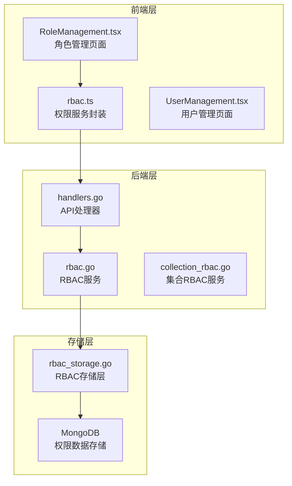

**图表来源**
- [RoleManagement.tsx:1-363](file://frontend/src/pages/Admin/RoleManagement.tsx#L1-L363)
- [rbac.ts:1-196](file://frontend/src/services/rbac.ts#L1-L196)
- [handlers.go:45-181](file://internal/api/handlers.go#L45-L181)

**章节来源**
- [RoleManagement.tsx:1-363](file://frontend/src/pages/Admin/RoleManagement.tsx#L1-L363)
- [rbac.ts:1-196](file://frontend/src/services/rbac.ts#L1-L196)
- [handlers.go:45-181](file://internal/api/handlers.go#L45-L181)

## 核心组件

### 前端组件架构

角色管理页面采用函数式组件设计，使用React Hooks管理状态和生命周期：

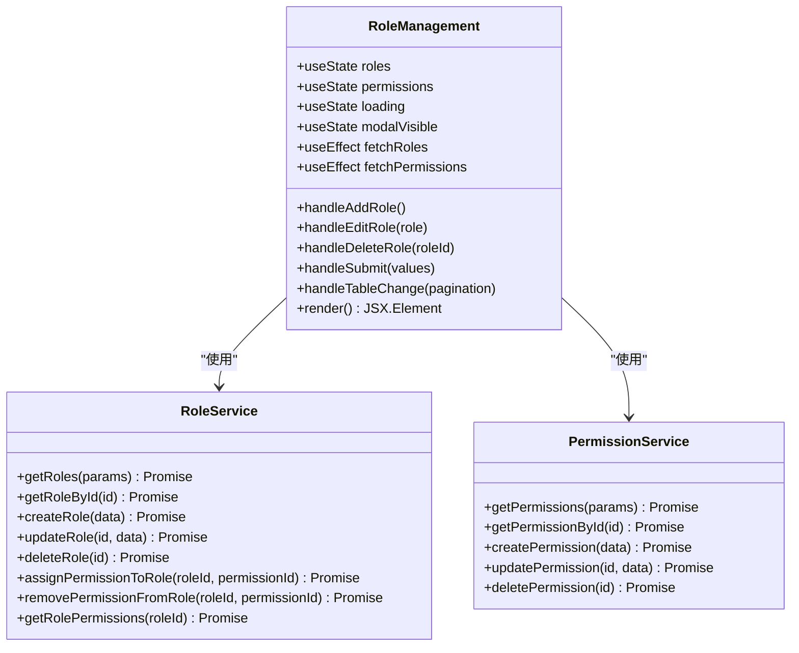

**图表来源**
- [RoleManagement.tsx:7-363](file://frontend/src/pages/Admin/RoleManagement.tsx#L7-L363)
- [rbac.ts:18-135](file://frontend/src/services/rbac.ts#L18-L135)

### 后端服务架构

后端采用分层架构，职责清晰分离：

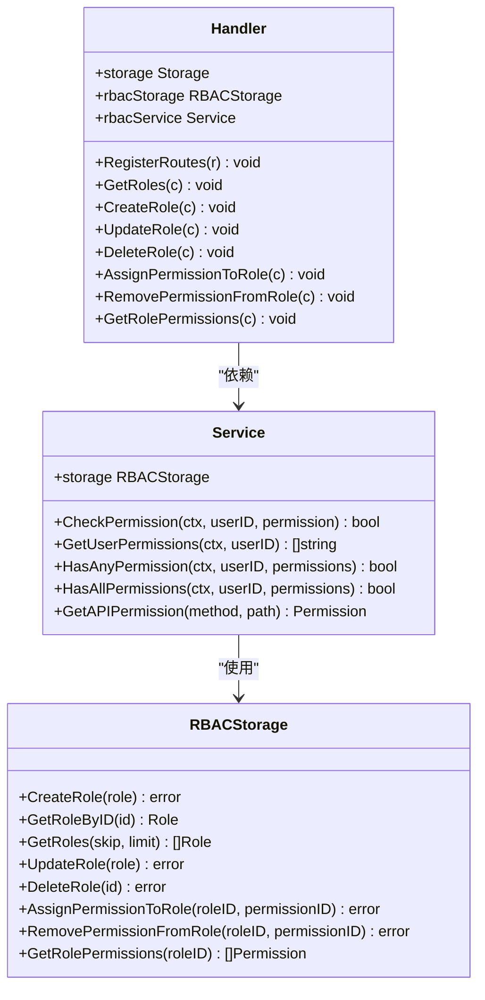

**图表来源**
- [handlers.go:23-43](file://internal/api/handlers.go#L23-L43)
- [rbac.go:55-61](file://pkg/rbac/rbac.go#L55-L61)
- [rbac_storage.go:16-50](file://internal/storage/rbac_storage.go#L16-L50)

**章节来源**
- [RoleManagement.tsx:7-363](file://frontend/src/pages/Admin/RoleManagement.tsx#L7-L363)
- [rbac.go:55-171](file://pkg/rbac/rbac.go#L55-L171)
- [handlers.go:23-829](file://internal/api/handlers.go#L23-L829)

## 架构概览

角色管理系统的整体架构采用经典的三层架构模式：

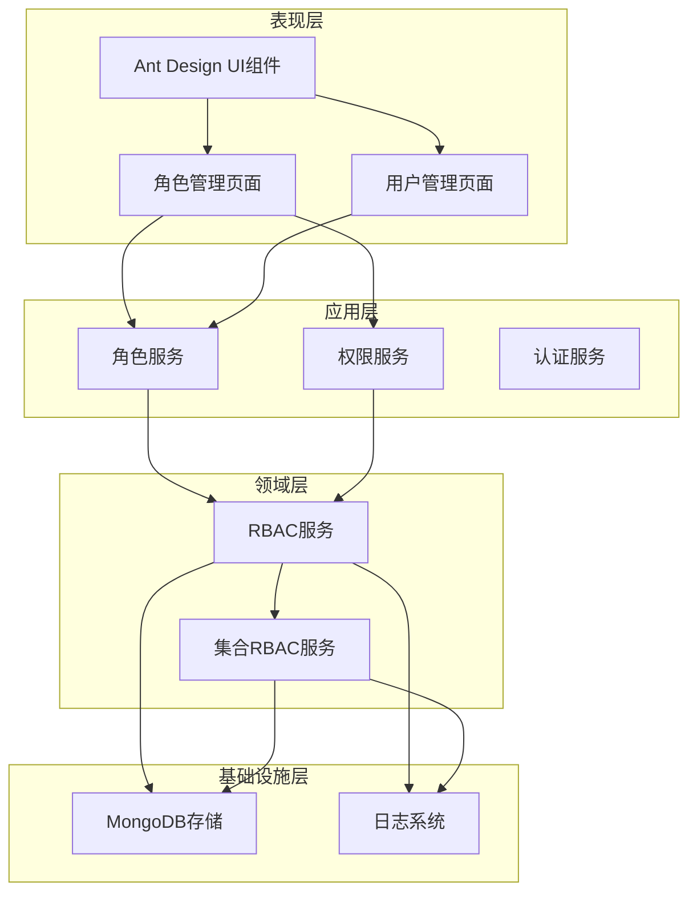

**图表来源**
- [RoleManagement.tsx:1-363](file://frontend/src/pages/Admin/RoleManagement.tsx#L1-L363)
- [handlers.go:45-181](file://internal/api/handlers.go#L45-L181)
- [rbac.go:55-61](file://pkg/rbac/rbac.go#L55-L61)

系统支持多种权限检查模式：

1. **系统权限检查**：基于用户角色继承的权限检查
2. **集合权限检查**：针对特定模块的权限检查
3. **API权限映射**：根据HTTP方法和路径自动映射到权限

**章节来源**
- [rbac.md:228-291](file://docs/rbac.md#L228-L291)
- [rbac.go:173-249](file://pkg/rbac/rbac.go#L173-L249)

## 详细组件分析

### 角色列表展示组件

角色列表组件实现了完整的表格展示功能，包括分页、搜索、排序和过滤：

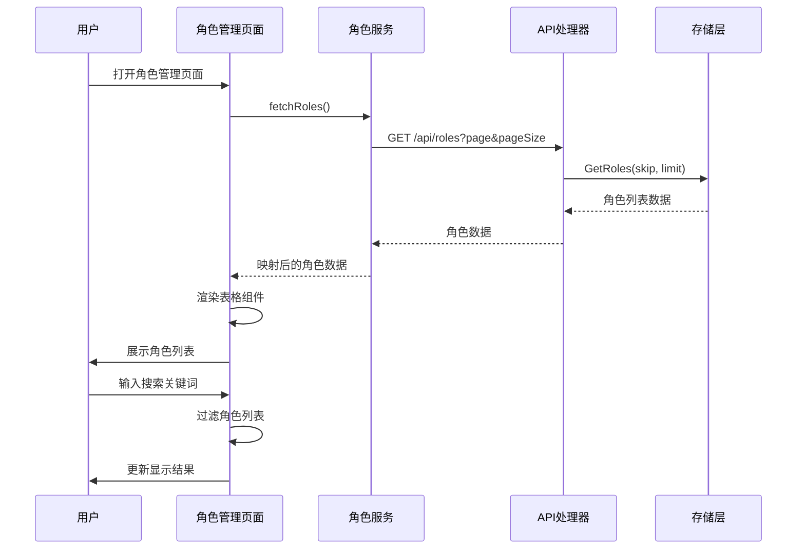

**图表来源**
- [RoleManagement.tsx:18-46](file://frontend/src/pages/Admin/RoleManagement.tsx#L18-L46)
- [rbac.ts:19-45](file://frontend/src/services/rbac.ts#L19-L45)
- [handlers.go:642-665](file://internal/api/handlers.go#L642-L665)

#### 表格列配置

角色列表包含以下关键列：

| 列名 | 数据类型 | 功能描述 | 排序支持 |
|------|----------|----------|----------|
| 角色名称 | string | 角色的显示名称 | 支持 |
| 角色代码 | string | 角色的唯一标识符 | 支持 |
| 描述 | string | 角色的功能描述 | 不支持 |
| 权限数量 | badge | 角色拥有的权限总数 | 不支持 |
| 操作 | button | 编辑、删除按钮 | 不支持 |

**章节来源**
- [RoleManagement.tsx:198-251](file://frontend/src/pages/Admin/RoleManagement.tsx#L198-L251)

### 角色权限分配组件

权限分配界面采用了分组显示的方式，将权限按照模块进行分类：

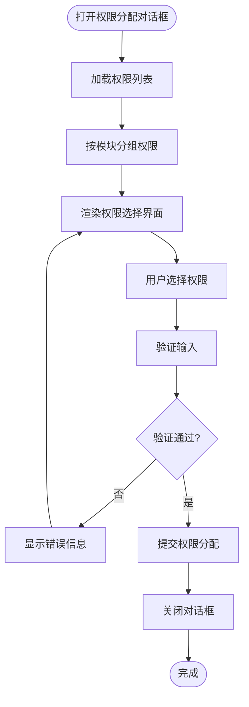

**图表来源**
- [RoleManagement.tsx:328-345](file://frontend/src/pages/Admin/RoleManagement.tsx#L328-L345)
- [rbac.ts:119-135](file://frontend/src/services/rbac.ts#L119-L135)

#### 权限分组机制

系统采用权限代码前缀进行自动分组：

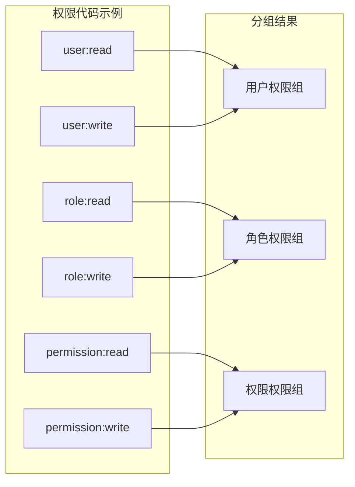

**图表来源**
- [RoleManagement.tsx:48-58](file://frontend/src/pages/Admin/RoleManagement.tsx#L48-L58)

**章节来源**
- [RoleManagement.tsx:328-345](file://frontend/src/pages/Admin/RoleManagement.tsx#L328-L345)

### 角色创建和编辑表单

角色表单采用了Ant Design的Form组件，实现了完整的表单验证和提交流程：

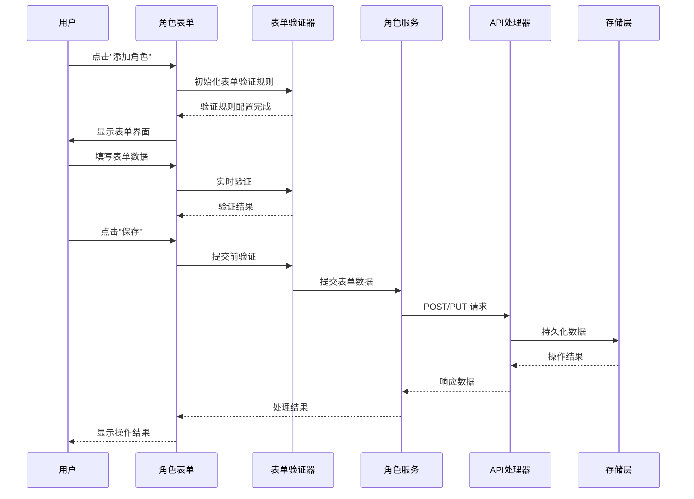

**图表来源**
- [RoleManagement.tsx:156-180](file://frontend/src/pages/Admin/RoleManagement.tsx#L156-L180)
- [rbac.ts:78-117](file://frontend/src/services/rbac.ts#L78-L117)

#### 表单验证规则

| 字段 | 验证规则 | 错误消息 |
|------|----------|----------|
| 角色名称 | 必填 | 请输入角色名称 |
| 角色代码 | 必填且唯一 | 请输入角色代码 |
| 描述 | 可选 | - |
| 权限 | 必填 | 请选择权限 |

**章节来源**
- [RoleManagement.tsx:303-322](file://frontend/src/pages/Admin/RoleManagement.tsx#L303-L322)

### 角色删除功能

角色删除采用了安全确认机制，防止误操作：

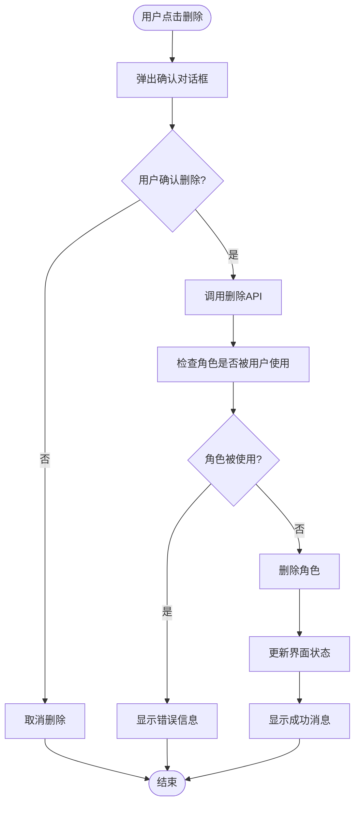

**图表来源**
- [RoleManagement.tsx:145-154](file://frontend/src/pages/Admin/RoleManagement.tsx#L145-L154)
- [handlers.go:743-750](file://internal/api/handlers.go#L743-L750)

**章节来源**
- [RoleManagement.tsx:145-154](file://frontend/src/pages/Admin/RoleManagement.tsx#L145-L154)

### 角色与用户关联管理

系统支持角色与用户的双向关联管理：

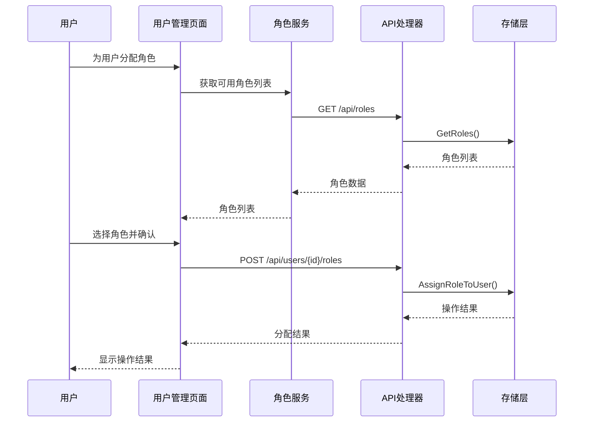

**图表来源**
- [UserManagement.tsx:122-156](file://frontend/src/pages/Admin/UserManagement.tsx#L122-L156)
- [handlers.go:459-490](file://internal/api/handlers.go#L459-L490)

**章节来源**
- [UserManagement.tsx:122-156](file://frontend/src/pages/Admin/UserManagement.tsx#L122-L156)

## 依赖关系分析

### 前端依赖关系

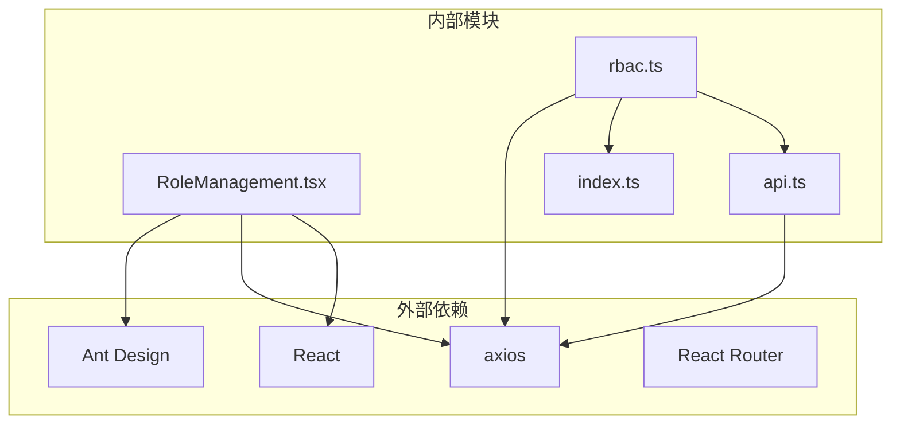

**图表来源**
- [RoleManagement.tsx:1-6](file://frontend/src/pages/Admin/RoleManagement.tsx#L1-L6)
- [rbac.ts:1](file://frontend/src/services/rbac.ts#L1)

### 后端依赖关系

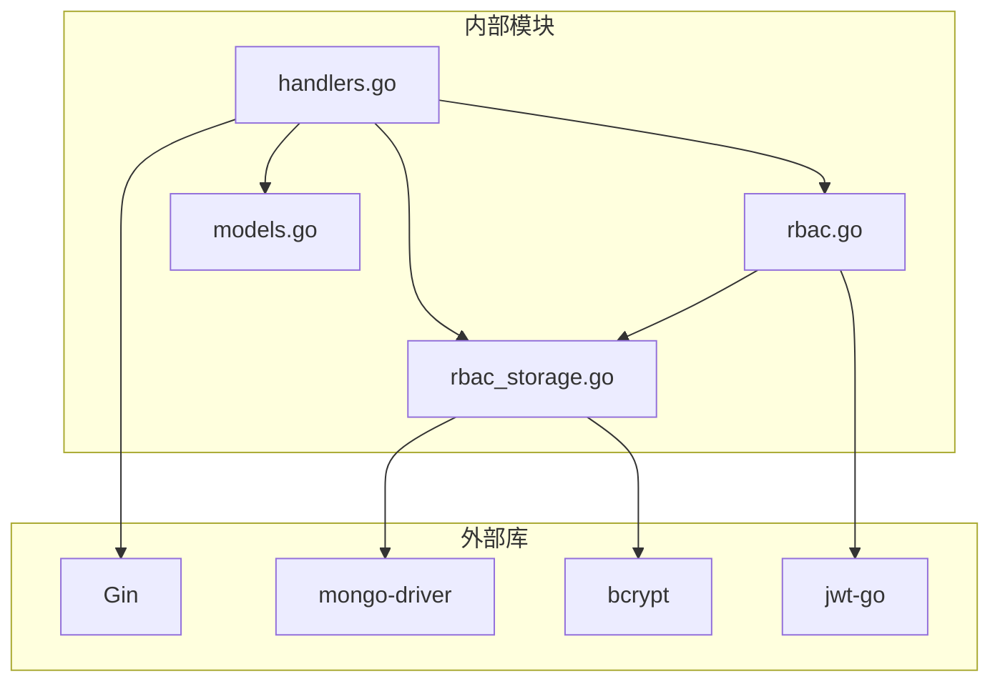

**图表来源**
- [handlers.go:3-21](file://internal/api/handlers.go#L3-L21)
- [rbac.go:3-8](file://pkg/rbac/rbac.go#L3-L8)

**章节来源**
- [RoleManagement.tsx:1-6](file://frontend/src/pages/Admin/RoleManagement.tsx#L1-L6)
- [handlers.go:3-21](file://internal/api/handlers.go#L3-L21)

## 性能考虑

### 前端性能优化

1. **虚拟滚动**：对于大量数据的表格，建议实现虚拟滚动以提升渲染性能
2. **懒加载**：权限列表采用懒加载策略，首次只加载必要的权限
3. **缓存机制**：角色和权限数据在组件内进行缓存，避免重复请求
4. **防抖处理**：搜索功能实现防抖，减少不必要的API调用

### 后端性能优化

1. **索引优化**：在MongoDB中为常用查询字段建立索引
2. **批量操作**：支持批量角色分配和权限分配操作
3. **连接池**：使用连接池管理数据库连接
4. **缓存策略**：实现权限检查结果的缓存

## 故障排除指南

### 常见问题及解决方案

#### 角色权限分配失败

**问题现象**：用户无法分配角色或权限

**可能原因**：
1. 权限不足：当前用户没有足够的权限进行角色分配
2. 角色已存在：用户已拥有该角色
3. 数据库连接异常

**解决步骤**：
1. 检查当前用户的权限级别
2. 确认目标角色是否存在
3. 查看后端日志获取详细错误信息

#### 角色删除失败

**问题现象**：删除角色时报错

**可能原因**：
1. 角色正在被用户使用
2. 数据库约束冲突
3. 权限不足

**解决步骤**：
1. 检查角色是否被用户使用
2. 先移除用户的角色再删除
3. 确认有足够的权限执行删除操作

#### 权限继承问题

**问题现象**：用户权限检查失败

**可能原因**：
1. 角色权限配置错误
2. 权限代码不匹配
3. 缓存数据过期

**解决步骤**：
1. 检查角色的权限列表
2. 验证权限代码格式
3. 清除权限缓存重新加载

**章节来源**
- [rbac.md:467-482](file://docs/rbac.md#L467-L482)

## 结论

角色管理页面实现了完整的RBAC权限管理体系，具有以下特点：

1. **功能完整性**：涵盖了角色管理的所有核心功能
2. **用户体验良好**：采用现代化的UI设计和交互体验
3. **安全性高**：实现了多层次的安全防护机制
4. **扩展性强**：支持权限继承和集合权限管理
5. **性能优秀**：采用多种优化策略确保系统性能

系统通过清晰的分层架构和严格的权限控制，为数据中心提供了可靠的身份认证和授权服务。未来可以在现有基础上进一步增强权限冲突检测、权限审计和批量操作等功能。