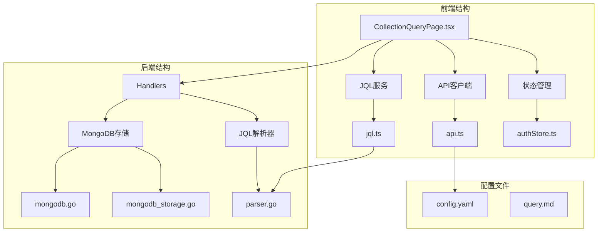
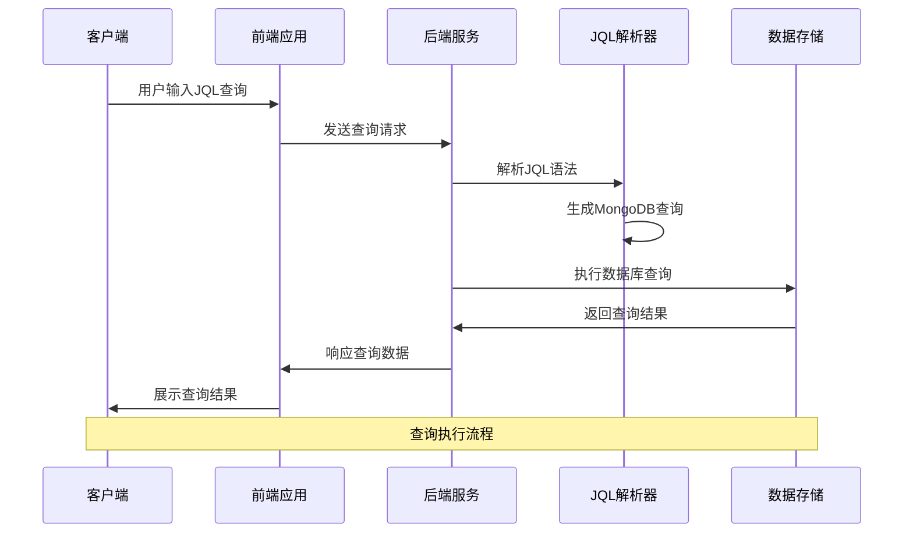
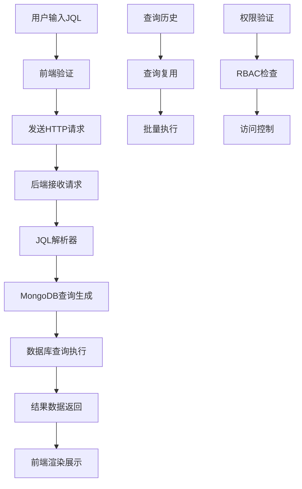
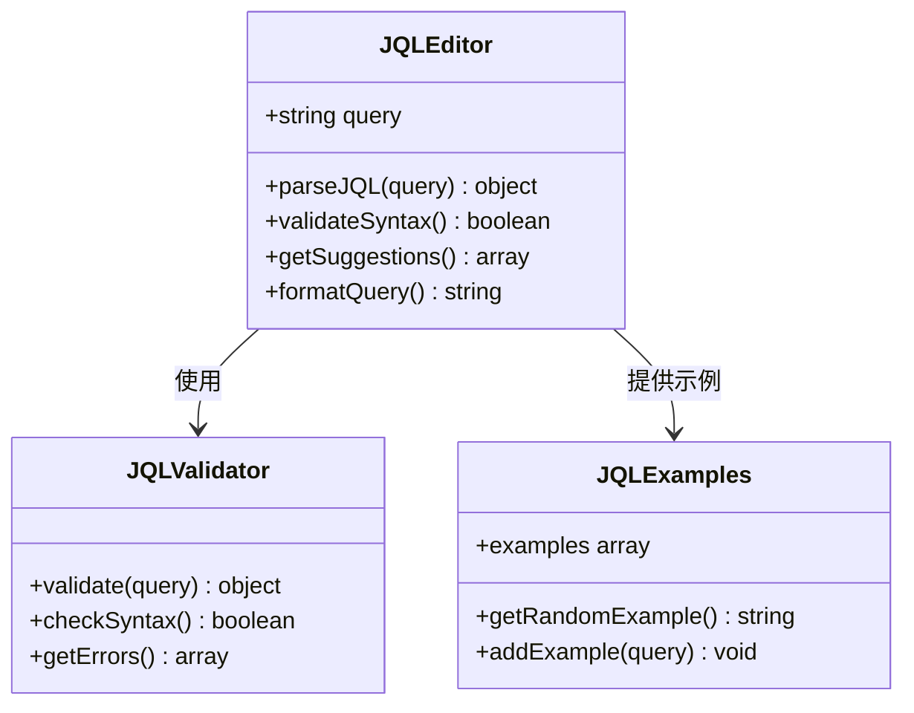
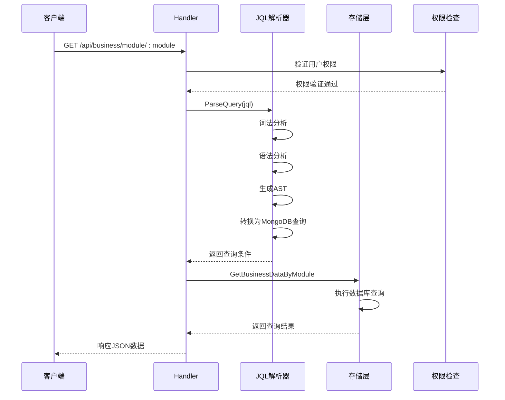
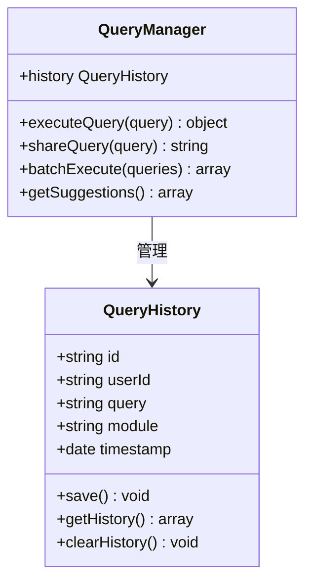
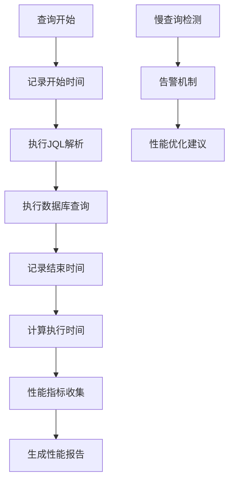
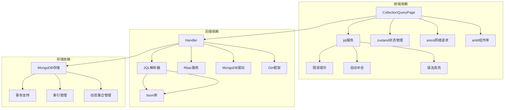

# 集合查询页面

<cite>
**本文档引用的文件**
- [CollectionQueryPage.tsx](file://frontend/src/pages/Admin/CollectionQueryPage.tsx)
- [jql.ts](file://frontend/src/services/jql.ts)
- [parser.go](file://pkg/jql/parser.go)
- [query.md](file://docs/query.md)
- [handlers.go](file://internal/api/handlers.go)
- [api.ts](file://frontend/src/services/api.ts)
- [mongodb.go](file://internal/storage/mongodb.go)
- [mongodb_storage.go](file://internal/storage/mongodb_storage.go)
- [models.go](file://internal/models/models.go)
- [authStore.ts](file://frontend/src/stores/authStore.ts)
- [config.yaml](file://configs/config.yaml)
</cite>

## 目录
1. [简介](#简介)
2. [项目结构](#项目结构)
3. [核心组件](#核心组件)
4. [架构概览](#架构概览)
5. [详细组件分析](#详细组件分析)
6. [依赖关系分析](#依赖关系分析)
7. [性能考虑](#性能考虑)
8. [故障排除指南](#故障排除指南)
9. [结论](#结论)

## 简介

集合查询页面是数据管理中心的核心功能模块，提供了一个完整的集合查询解决方案。该页面实现了基于JQL（Jira Query Language）语法的查询功能，支持多种查询视图展示，并具备完善的权限控制和数据管理能力。

本系统采用前后端分离架构，前端使用React + Ant Design构建用户界面，后端基于Go语言开发，使用MongoDB作为数据存储。系统支持实时查询、结果分页、权限验证、以及丰富的查询语法特性。

## 项目结构

集合查询页面位于前端项目的Admin目录下，主要包含以下关键文件：

**图表来源**
- [CollectionQueryPage.tsx:1-348](file://frontend/src/pages/Admin/CollectionQueryPage.tsx#L1-L348)
- [jql.ts:1-51](file://frontend/src/services/jql.ts#L1-L51)
- [parser.go:1-653](file://pkg/jql/parser.go#L1-L653)

**章节来源**
- [CollectionQueryPage.tsx:1-348](file://frontend/src/pages/Admin/CollectionQueryPage.tsx#L1-L348)
- [jql.ts:1-51](file://frontend/src/services/jql.ts#L1-L51)
- [parser.go:1-653](file://pkg/jql/parser.go#L1-L653)

## 核心组件

### 前端组件架构

集合查询页面采用React函数组件设计，主要包含以下核心组件：

1. **CollectionQueryPage组件** - 主页面容器，负责集合数据的CRUD操作
2. **JQL查询编辑器** - 基于Ant Design的查询输入组件
3. **数据表格展示** - 支持分页、排序和筛选的数据表格
4. **模态框表单** - 用于创建和编辑集合信息

### 后端服务架构

后端采用Gin框架实现RESTful API，主要服务包括：

1. **Handler服务** - 处理HTTP请求和业务逻辑
2. **MongoDB存储层** - 提供数据持久化服务
3. **JQL解析器** - 将JQL语法转换为MongoDB查询
4. **权限中间件** - 实现RBAC权限控制

**章节来源**
- [CollectionQueryPage.tsx:24-348](file://frontend/src/pages/Admin/CollectionQueryPage.tsx#L24-L348)
- [handlers.go:1-800](file://internal/api/handlers.go#L1-L800)

## 架构概览

系统采用分层架构设计，确保了良好的可维护性和扩展性：

**图表来源**
- [handlers.go:1013-1049](file://internal/api/handlers.go#L1013-L1049)
- [parser.go:46-65](file://pkg/jql/parser.go#L46-L65)

### 数据流架构

**图表来源**
- [api.ts:1-37](file://frontend/src/services/api.ts#L1-L37)
- [mongodb_storage.go:366-395](file://internal/storage/mongodb_storage.go#L366-L395)

## 详细组件分析

### JQL查询编辑器

JQL查询编辑器是系统的核心功能组件，提供了丰富的查询语法支持：

#### 语法特性

| 类型 | 支持的操作符 | 示例 |
|------|-------------|------|
| 比较运算符 | =, !=, >, <, >=, <= | `status = "active"` |
| 逻辑运算符 | AND, OR, NOT | `status = "active" AND price > 100` |
| 特殊运算符 | IN, NOT IN, IS NULL, IS NOT NULL, LIKE, contains | `category IN ("A","B")` |
| 函数支持 | CurrentUser(), Now(), StartOfDay(), EndOfWeek() | `created > StartOfWeek()` |

#### 前端实现

**图表来源**
- [jql.ts:1-51](file://frontend/src/services/jql.ts#L1-L51)

**章节来源**
- [jql.ts:18-33](file://frontend/src/services/jql.ts#L18-L33)
- [jql.ts:35-51](file://frontend/src/services/jql.ts#L35-L51)

### 查询执行流程

查询执行过程包含多个验证和转换步骤：

#### 后端处理流程

**图表来源**
- [handlers.go:1013-1049](file://internal/api/handlers.go#L1013-L1049)
- [parser.go:46-65](file://pkg/jql/parser.go#L46-L65)

#### 查询验证机制

系统实现了多层次的查询验证：

1. **语法验证** - 检查JQL语法的正确性
2. **语义验证** - 验证字段和值的有效性
3. **权限验证** - 确保用户有查询权限
4. **安全验证** - 防止注入攻击

**章节来源**
- [handlers.go:1019-1029](file://internal/api/handlers.go#L1019-L1029)
- [parser.go:649-652](file://pkg/jql/parser.go#L649-L652)

### 结果展示组件

系统提供了多种查询结果展示方式：

#### 表格视图

表格视图支持：
- 分页显示（10/20/50/100条每页）
- 排序功能（按创建时间排序）
- 筛选功能（按模块名称筛选）
- 操作按钮（编辑、删除）

#### 图表视图

虽然当前版本主要提供表格视图，但系统架构支持扩展图表展示功能，包括：
- 柱状图
- 折线图  
- 饼图
- 散点图

#### 原始数据视图

提供JSON格式的原始数据展示，便于开发者调试和分析。

**章节来源**
- [CollectionQueryPage.tsx:220-235](file://frontend/src/pages/Admin/CollectionQueryPage.tsx#L220-L235)
- [CollectionQueryPage.tsx:153-200](file://frontend/src/pages/Admin/CollectionQueryPage.tsx#L153-L200)

### 查询历史管理

系统具备查询历史管理功能：

#### 历史记录存储

**图表来源**
- [query.md:180-226](file://docs/query.md#L180-L226)

#### 查询复用功能

- **查询保存** - 将常用查询保存到个人收藏
- **查询分享** - 生成共享链接供其他用户使用
- **批量执行** - 支持同时执行多个查询

**章节来源**
- [query.md:227-276](file://docs/query.md#L227-L276)

### 性能监控

系统实现了查询性能监控机制：

#### 执行时间统计

**图表来源**
- [query.md:140-158](file://docs/query.md#L140-L158)

#### 性能优化策略

- **索引策略** - 为常用查询字段创建索引
- **查询优化** - 限制返回字段和使用分页
- **缓存策略** - 热门查询结果缓存

**章节来源**
- [query.md:140-158](file://docs/query.md#L140-L158)

## 依赖关系分析

系统各组件之间的依赖关系如下：

**图表来源**
- [CollectionQueryPage.tsx:1-5](file://frontend/src/pages/Admin/CollectionQueryPage.tsx#L1-L5)
- [handlers.go:1-43](file://internal/api/handlers.go#L1-L43)
- [mongodb.go:14-90](file://internal/storage/mongodb.go#L14-L90)

### 外部依赖

系统依赖的关键外部组件：

1. **Ant Design** - UI组件库，提供丰富的交互组件
2. **Axios** - HTTP客户端，处理前后端通信
3. **MongoDB** - NoSQL数据库，存储业务数据
4. **Gin** - Go Web框架，提供高性能HTTP服务
5. **JWT** - 身份认证令牌，确保API安全

**章节来源**
- [api.ts:1-37](file://frontend/src/services/api.ts#L1-L37)
- [mongodb.go:14-90](file://internal/storage/mongodb.go#L14-L90)

## 性能考虑

### 查询性能优化

系统在多个层面实现了性能优化：

#### 数据库层面

- **索引优化** - 为常用查询字段建立复合索引
- **查询优化** - 使用投影减少数据传输量
- **连接池管理** - 合理配置数据库连接数

#### 应用层面

- **分页查询** - 默认每页10条记录，支持快速浏览
- **缓存机制** - 热门查询结果缓存30分钟
- **并发控制** - 限制同时执行的查询数量

#### 前端层面

- **虚拟滚动** - 大数据集使用虚拟滚动提升渲染性能
- **懒加载** - 按需加载查询历史和示例
- **防抖处理** - 输入查询时使用防抖减少请求频率

### 安全考虑

系统实现了多层次的安全防护：

#### 输入验证

- **JQL语法验证** - 防止语法错误导致的查询异常
- **字段白名单** - 仅允许查询预定义的字段
- **值类型验证** - 确保查询值的类型正确

#### 权限控制

- **RBAC权限** - 基于角色的访问控制
- **数据权限** - 限制用户只能访问有权限的数据
- **操作审计** - 记录所有查询操作

**章节来源**
- [query.md:119-139](file://docs/query.md#L119-L139)
- [mongodb_storage.go:366-395](file://internal/storage/mongodb_storage.go#L366-L395)

## 故障排除指南

### 常见问题及解决方案

#### 查询执行失败

**问题现象**：查询执行时报错，返回错误信息

**可能原因**：
1. JQL语法错误
2. 权限不足
3. 数据库连接异常

**解决步骤**：
1. 检查JQL语法是否正确
2. 验证用户权限
3. 确认数据库连接状态

#### 查询结果为空

**问题现象**：查询执行成功但没有返回数据

**可能原因**：
1. 查询条件过于严格
2. 数据不存在
3. 权限限制

**解决步骤**：
1. 简化查询条件
2. 检查数据是否存在
3. 验证查询权限

#### 页面加载缓慢

**问题现象**：页面响应缓慢，用户体验差

**可能原因**：
1. 数据量过大
2. 网络延迟
3. 前端渲染性能问题

**解决步骤**：
1. 使用分页功能
2. 优化查询条件
3. 检查网络连接

### 调试工具

系统提供了多种调试工具：

#### 前端调试

- **浏览器开发者工具** - 检查网络请求和响应
- **React DevTools** - 分析组件状态和性能
- **Redux DevTools** - 调试状态管理

#### 后端调试

- **日志系统** - 记录详细的执行日志
- **性能监控** - 监控查询执行时间和资源使用
- **错误追踪** - 跟踪异常和错误信息

**章节来源**
- [authStore.ts:15-61](file://frontend/src/stores/authStore.ts#L15-L61)
- [config.yaml:12-18](file://configs/config.yaml#L12-L18)

## 结论

集合查询页面是一个功能完整、架构清晰的数据查询系统。它提供了丰富的查询语法支持、灵活的结果展示方式，以及完善的权限控制和安全机制。

### 主要优势

1. **语法丰富** - 支持JQL标准语法，满足复杂查询需求
2. **界面友好** - 基于Ant Design的现代化UI设计
3. **性能优秀** - 多层次性能优化，支持大数据量查询
4. **安全可靠** - 完善的权限控制和安全防护机制
5. **易于扩展** - 清晰的架构设计，便于功能扩展

### 发展方向

未来可以考虑的功能增强：

1. **图表展示** - 添加更多可视化图表选项
2. **查询模板** - 提供查询模板和预设条件
3. **批量操作** - 支持批量数据导入导出
4. **高级搜索** - 添加全文搜索和高级筛选功能
5. **移动端适配** - 优化移动端用户体验

该系统为数据管理中心提供了强大的查询能力，能够满足各种复杂的数据查询需求，是现代数据管理系统的优秀实践。