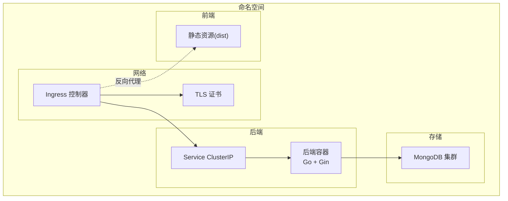
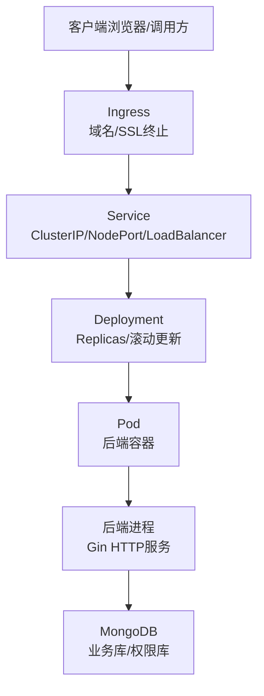
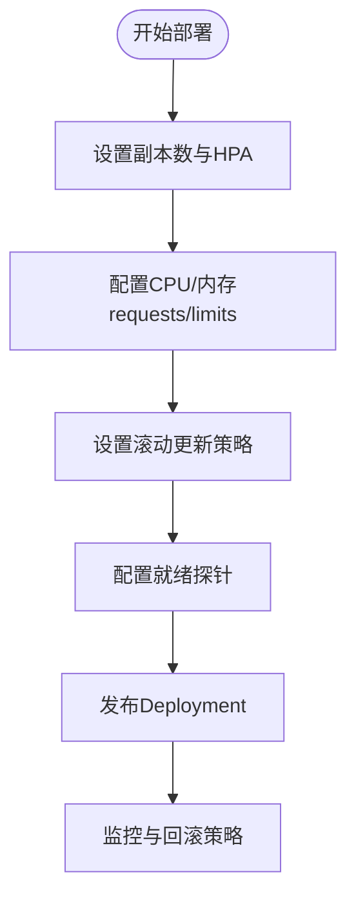
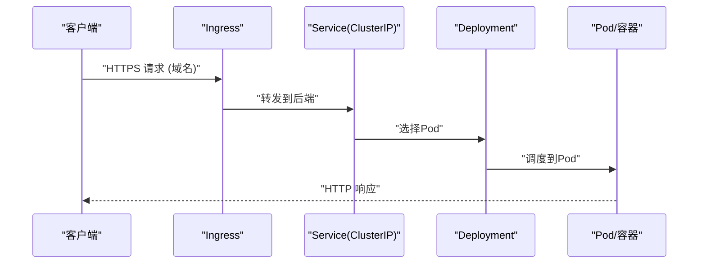
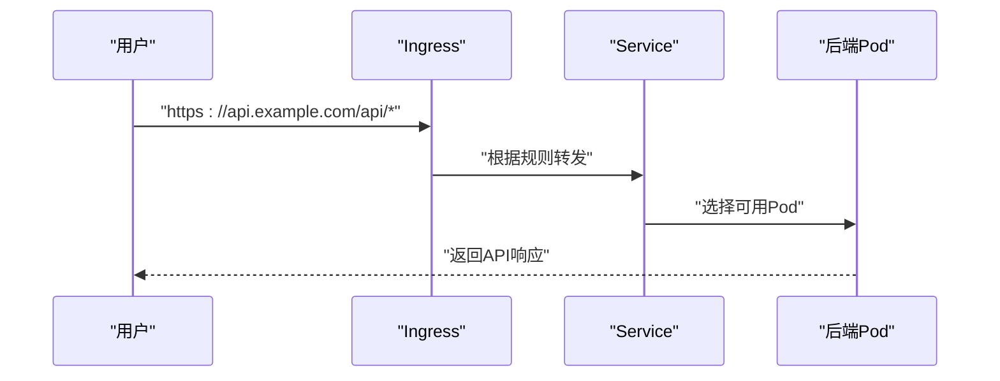
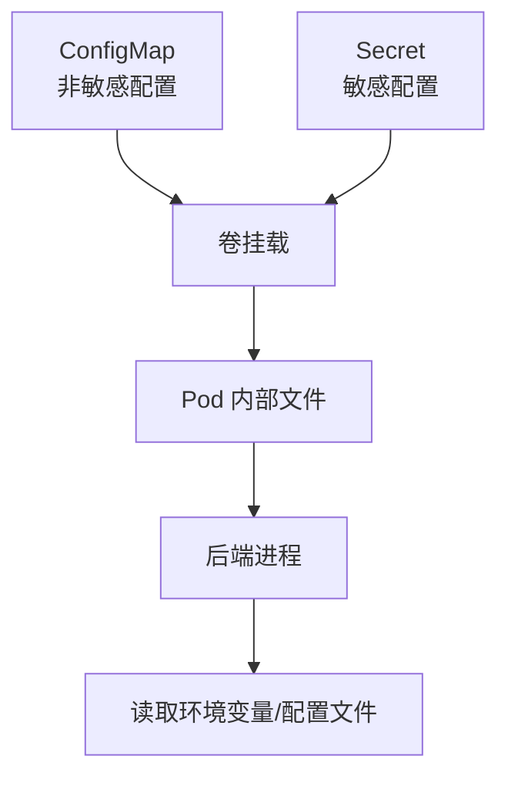
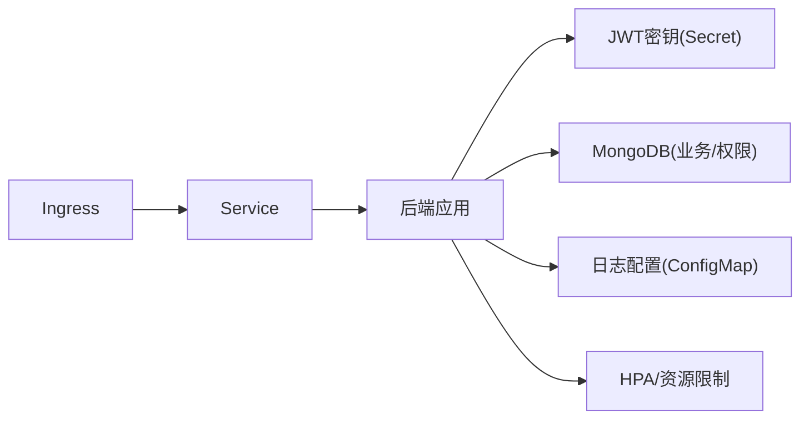

# Kubernetes部署

<cite>
**本文引用的文件**
- [cmd/server/main.go](file://cmd/server/main.go)
- [configs/config.yaml](file://configs/config.yaml)
- [go.mod](file://go.mod)
- [README.md](file://README.md)
- [docs/architecture.md](file://docs/architecture.md)
- [internal/api/handlers.go](file://internal/api/handlers.go)
- [internal/auth/jwt.go](file://internal/auth/jwt.go)
- [internal/logger/logger.go](file://internal/logger/logger.go)
- [internal/storage/mongodb.go](file://internal/storage/mongodb.go)
</cite>

## 目录
1. [简介](#简介)
2. [项目结构](#项目结构)
3. [核心组件](#核心组件)
4. [架构总览](#架构总览)
5. [详细组件分析](#详细组件分析)
6. [依赖分析](#依赖分析)
7. [性能考虑](#性能考虑)
8. [故障排查指南](#故障排查指南)
9. [结论](#结论)
10. [附录](#附录)

## 简介
本文件面向数据中心项目的Kubernetes部署，围绕Deployment资源配置、Service暴露方式、Ingress控制器配置、ConfigMap与Secret使用、Helm Chart模板以及Pod调度策略展开，帮助您在生产环境中稳定、安全地部署与运维该系统。

## 项目结构
数据中心系统采用前后端分离架构，后端基于Go与Gin，前端基于React。后端服务监听固定端口并通过环境变量进行配置，数据库为MongoDB（业务库与权限库分离）。部署时建议将后端容器化，并通过Service对外暴露，结合Ingress实现域名与TLS终止。

**图表来源**
- [docs/architecture.md:799-821](file://docs/architecture.md#L799-L821)
- [cmd/server/main.go:121-127](file://cmd/server/main.go#L121-L127)

**章节来源**
- [README.md:1-188](file://README.md#L1-L188)
- [docs/architecture.md:799-821](file://docs/architecture.md#L799-L821)

## 核心组件
- 后端应用：基于Gin的HTTP服务，默认监听端口由环境变量控制；支持JWT认证、RBAC权限控制、MongoDB存储、日志系统。
- 数据库：业务库与权限库分离，分别连接不同URI与数据库名。
- 日志：结构化日志与文件轮转，便于容器内持久化与集中采集。
- 刮削系统：以Worker协程池异步处理任务，适合在Kubernetes中通过Deployment进行弹性伸缩。

**章节来源**
- [cmd/server/main.go:42-94](file://cmd/server/main.go#L42-L94)
- [internal/logger/logger.go:14-56](file://internal/logger/logger.go#L14-L56)
- [internal/storage/mongodb.go:14-90](file://internal/storage/mongodb.go#L14-L90)

## 架构总览
下图展示Kubernetes部署下的典型拓扑：Ingress负责域名与TLS终止，Service提供稳定访问入口，Deployment管理Pod副本与滚动升级，MongoDB作为外部或集群内数据库。

**图表来源**
- [docs/architecture.md:799-821](file://docs/architecture.md#L799-L821)
- [cmd/server/main.go:121-127](file://cmd/server/main.go#L121-L127)

## 详细组件分析

### Deployment资源配置
- 副本数与扩缩容
  - 建议设置初始副本数为2-3，结合HPA实现CPU/内存或自定义指标自动扩缩容。
  - Pod健康检查：使用就绪探针探测应用就绪，避免流量接入未就绪实例。
- 资源限制
  - CPU/内存建议设置requests与limits，避免节点资源争用导致抖动。
  - 刮削Worker数量可通过环境变量配置，容器内并发由Worker数与资源配额共同决定。
- 滚动更新策略
  - 使用RollingUpdate策略，设置最大不可用与最大同时扩容，确保平滑升级。
- 就绪探针
  - 健康检查路径可使用HTTP GET /health（若后端提供），或TCP Socket探针检测端口连通。
  - 建议初始延迟、探针间隔与超时合理配置，避免冷启动期间误判。

**图表来源**
- [cmd/server/main.go:121-127](file://cmd/server/main.go#L121-L127)

**章节来源**
- [cmd/server/main.go:121-127](file://cmd/server/main.go#L121-L127)
- [configs/config.yaml:20-25](file://configs/config.yaml#L20-L25)

### Service配置示例
- ClusterIP
  - 适用于同命名空间内部访问，Ingress通过此Service转发至后端。
- NodePort
  - 用于快速外网访问，适合测试或临时场景；生产建议优先使用Ingress。
- LoadBalancer
  - 在云厂商平台自动分配负载均衡器，适合直接暴露服务；需配合Ingress统一管理域名与证书。

**图表来源**
- [docs/architecture.md:799-821](file://docs/architecture.md#L799-L821)

**章节来源**
- [docs/architecture.md:799-821](file://docs/architecture.md#L799-L821)

### Ingress控制器配置
- 路由规则
  - 将域名映射到后端Service，支持路径前缀匹配与精确路径。
  - 建议为API与静态资源分别配置路由，便于缓存与安全策略。
- SSL证书管理
  - 使用Ingress注解或证书管理器（如cert-manager）自动签发与续期。
  - 将证书Secret挂载到Ingress，实现TLS终止。
- 域名绑定
  - 将根域名与子域名指向Ingress入口IP或CNAME，确保DNS生效。

**图表来源**
- [docs/architecture.md:799-821](file://docs/architecture.md#L799-L821)

**章节来源**
- [docs/architecture.md:799-821](file://docs/architecture.md#L799-L821)

### ConfigMap与Secret使用
- ConfigMap
  - 用于存放非敏感配置，如日志级别、服务器端口、读写超时等。
  - 建议将配置拆分为多个ConfigMap，按模块化管理。
- Secret
  - 用于存放敏感信息，如JWT密钥、数据库连接串、证书私钥等。
  - Secret支持热更新：当Secret内容变更时，挂载到Pod的文件会被更新，部分组件需要重启或触发重新加载。
- 热更新注意事项
  - Secret与ConfigMap挂载为卷时，更新后Pod内文件会变化；对于后端应用，可在启动阶段读取环境变量或定期重载配置。

**图表来源**
- [cmd/server/main.go:32-38](file://cmd/server/main.go#L32-L38)
- [configs/config.yaml:1-25](file://configs/config.yaml#L1-L25)

**章节来源**
- [cmd/server/main.go:32-38](file://cmd/server/main.go#L32-L38)
- [configs/config.yaml:1-25](file://configs/config.yaml#L1-L25)

### Helm Chart模板要点
- Values参数化
  - 环境变量：SERVER_HOST/SERVER_PORT、JWT_SECRET、MONGODB_URI/MONGODB_DATABASE、LOG_LEVEL等。
  - 资源：replicaCount、resources.requests/limits、hpa.enabled等。
  - Ingress：hosts、tls、annotations等。
- 模板结构
  - deployment.yaml：定义容器镜像、环境变量、卷挂载、探针。
  - service.yaml：定义ClusterIP/NodePort/LoadBalancer。
  - ingress.yaml：定义路由规则与TLS。
  - configmap.yaml/secret.yaml：非敏感与敏感配置。
- 最佳实践
  - 使用标签选择器与命名规范，确保资源关联一致。
  - 为不同环境准备values-{dev,staging,prod}.yaml，避免硬编码。

**章节来源**
- [cmd/server/main.go:121-127](file://cmd/server/main.go#L121-L127)
- [configs/config.yaml:20-25](file://configs/config.yaml#L20-L25)

### Pod调度策略、亲和性与污点容忍
- 调度策略
  - 使用PodDisruptionBudget保障升级过程中的可用性。
  - 通过节点选择器限定后端Pod运行在特定节点（如预留资源的节点）。
- 亲和性
  - 同区域/同AZ反亲和，提升可用性。
  - 与数据库Pod保持同节点或跨节点策略，视网络与延迟需求而定。
- 污点容忍
  - 若数据库节点设置污点，后端Pod需相应容忍，确保调度成功。
- Worker与资源
  - 刮削Worker数量通过环境变量配置，结合HPA与资源限制控制整体并发与稳定性。

**章节来源**
- [cmd/server/main.go:65-69](file://cmd/server/main.go#L65-L69)
- [configs/config.yaml:20-25](file://configs/config.yaml#L20-L25)

## 依赖分析
后端服务依赖MongoDB（业务库与权限库）、JWT密钥、日志配置与刮削Worker数。部署时需确保：
- 数据库连接可达且凭据正确；
- Secret中包含JWT密钥与数据库URI；
- 日志目录具备写权限（若启用文件日志）；
- Ingress与Service配置一致，域名解析正常。

**图表来源**
- [cmd/server/main.go:42-94](file://cmd/server/main.go#L42-L94)
- [internal/auth/jwt.go:44-66](file://internal/auth/jwt.go#L44-L66)
- [internal/logger/logger.go:14-56](file://internal/logger/logger.go#L14-L56)

**章节来源**
- [cmd/server/main.go:42-94](file://cmd/server/main.go#L42-L94)
- [internal/auth/jwt.go:44-66](file://internal/auth/jwt.go#L44-L66)
- [internal/logger/logger.go:14-56](file://internal/logger/logger.go#L14-L56)

## 性能考虑
- 并发与资源
  - 合理设置Worker数量与容器资源，避免CPU争用与频繁GC。
  - 使用HPA根据请求速率或CPU使用率自动扩缩容。
- 连接池与超时
  - 数据库连接池大小与后端读写超时需匹配，避免请求堆积。
- 缓存与静态资源
  - 前端静态资源由Nginx或Ingress缓存，减少后端压力。
- 探针与健康检查
  - 就绪探针避免将流量引入未完全启动的实例，提高首包成功率。

[本节为通用指导，无需引用具体文件]

## 故障排查指南
- 无法访问后端
  - 检查Service端口与后端容器端口一致；确认Ingress路由规则与域名解析。
- 认证失败
  - 检查JWT密钥是否正确挂载为Secret；确认密钥与后端配置一致。
- 数据库连接异常
  - 校验MONGODB_URI与数据库名；确认网络连通与防火墙策略。
- 日志问题
  - 检查日志文件路径与权限；确认日志轮转配置合理。
- 升级中断
  - 检查滚动更新策略与Pod就绪探针；必要时调整最大不可用与就绪延迟。

**章节来源**
- [cmd/server/main.go:121-127](file://cmd/server/main.go#L121-L127)
- [internal/logger/logger.go:14-56](file://internal/logger/logger.go#L14-L56)

## 结论
通过合理的Deployment配置、Service与Ingress策略、ConfigMap与Secret管理以及HPA与调度策略，数据中心项目可在Kubernetes上实现高可用、可扩展与安全的生产部署。建议结合监控与日志体系，持续优化资源与性能。

[本节为总结，无需引用具体文件]

## 附录
- 环境变量与配置项
  - 服务器：SERVER_HOST、SERVER_PORT、READ_TIMEOUT、WRITE_TIMEOUT
  - 认证：JWT_SECRET、JWT_EXPIRATION、JWT_REFRESH_EXPIRATION
  - 数据库：MONGODB_URI、MONGODB_DATABASE、MONGODB_RBAC_URI、MONGODB_RBAC_DATABASE
  - 日志：LOG_LEVEL、LOG_HTTP_FILE、LOG_MAX_SIZE、LOG_MAX_BACKUPS、LOG_MAX_AGE
  - 刮削：SCRAPER_WORKERS

**章节来源**
- [README.md:50-63](file://README.md#L50-L63)
- [docs/architecture.md:724-743](file://docs/architecture.md#L724-L743)
- [configs/config.yaml:1-25](file://configs/config.yaml#L1-L25)