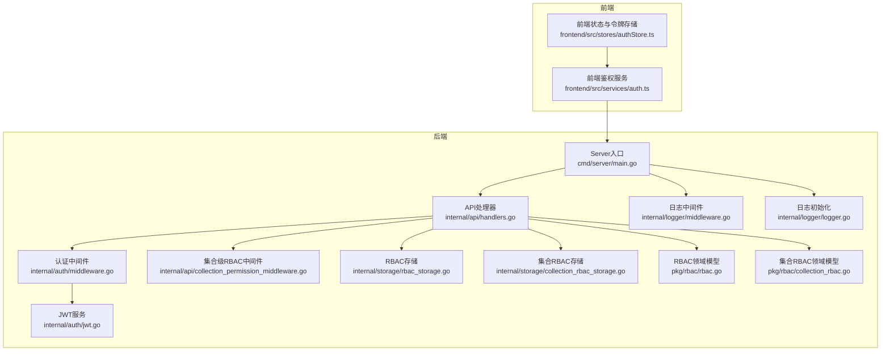
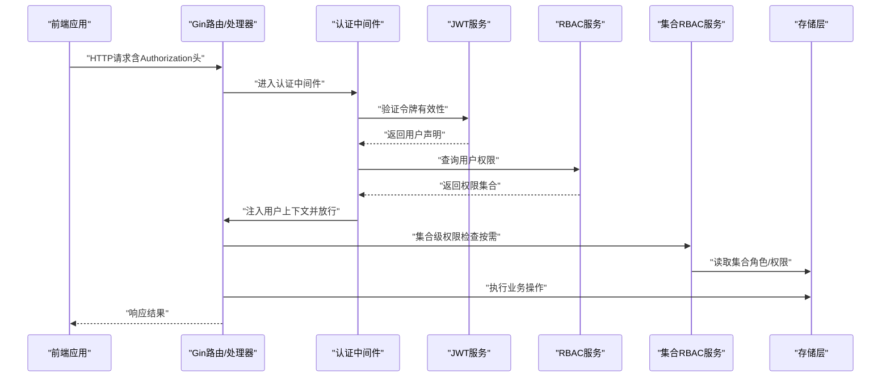
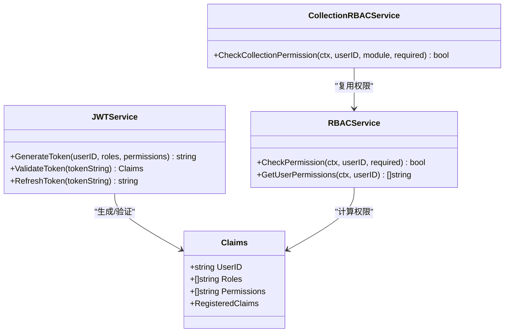
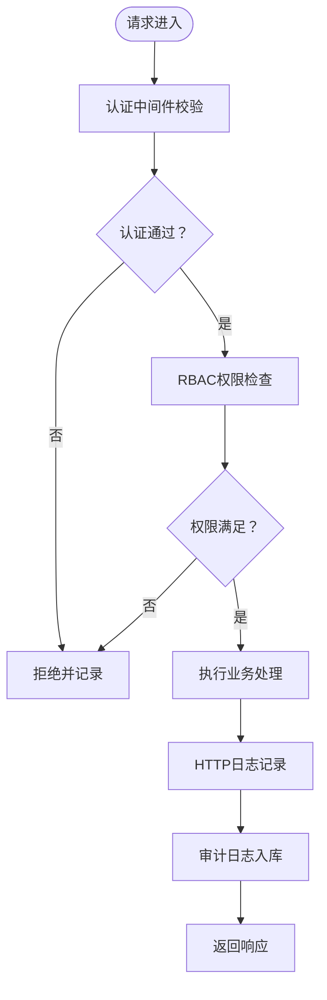
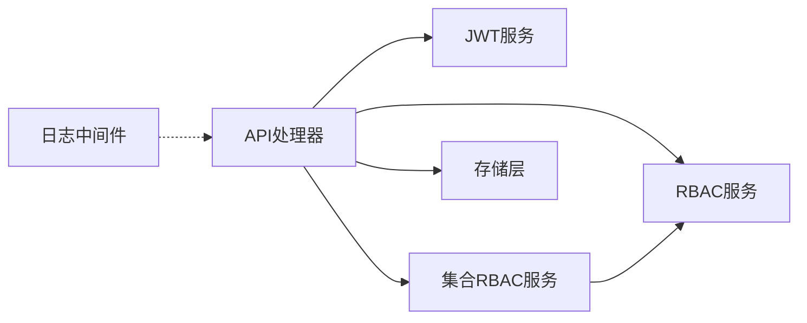

# 安全加固

<cite>
**本文引用的文件**
- [cmd\server\main.go](file://cmd/server/main.go)
- [configs\config.yaml](file://configs/config.yaml)
- [internal\auth\jwt.go](file://internal/auth/jwt.go)
- [internal\auth\middleware.go](file://internal/auth/middleware.go)
- [internal\api\handlers.go](file://internal/api/handlers.go)
- [internal\api\collection_permission_middleware.go](file://internal/api/collection_permission_middleware.go)
- [internal\logger\logger.go](file://internal/logger/logger.go)
- [internal\logger\middleware.go](file://internal/logger/middleware.go)
- [internal\storage\rbac_storage.go](file://internal/storage/rbac_storage.go)
- [internal\storage\collection_rbac_storage.go](file://internal/storage/collection_rbac_storage.go)
- [pkg\rbac\rbac.go](file://pkg/rbac/rbac.go)
- [pkg\rbac\collection_rbac.go](file://pkg/rbac/collection_rbac.go)
- [frontend\src\services\auth.ts](file://frontend/src/services/auth.ts)
- [frontend\src\stores\authStore.ts](file://frontend/src/stores/authStore.ts)
</cite>

## 目录
1. [引言](#引言)
2. [项目结构](#项目结构)
3. [核心组件](#核心组件)
4. [架构总览](#架构总览)
5. [详细组件分析](#详细组件分析)
6. [依赖分析](#依赖分析)
7. [性能考虑](#性能考虑)
8. [故障排查指南](#故障排查指南)
9. [结论](#结论)
10. [附录](#附录)

## 引言
本指南面向数据中心项目，提供一套可落地的安全加固方案，覆盖网络安全、应用安全、身份认证与授权、数据传输安全、访问控制强化、以及安全审计与日志记录。文档基于仓库现有实现进行分析，并在不泄露具体代码的前提下，给出配置建议、流程图与最佳实践，帮助团队在生产环境中提升整体安全性。

## 项目结构
后端采用 Go + Gin 框架，前端为 TypeScript/Vue 生态；安全相关逻辑主要分布在以下模块：
- 身份认证与授权：JWT 服务、认证中间件、RBAC 与集合级 RBAC
- 日志与审计：统一日志初始化、HTTP 请求日志中间件、审计日志存储
- 配置：环境变量与 YAML 配置文件
- 前端：登录与本地令牌存储

图表来源
- [cmd\server\main.go:100-118](file://cmd/server/main.go#L100-L118)
- [internal\auth\middleware.go:12-48](file://internal/auth/middleware.go#L12-L48)
- [internal\auth\jwt.go:44-83](file://internal/auth/jwt.go#L44-L83)
- [internal\api\handlers.go:45-181](file://internal/api/handlers.go#L45-L181)
- [internal\api\collection_permission_middleware.go:16-48](file://internal/api/collection_permission_middleware.go#L16-L48)
- [internal\logger\middleware.go:25-68](file://internal/logger/middleware.go#L25-L68)
- [internal\logger\logger.go:14-56](file://internal/logger/logger.go#L14-L56)
- [internal\storage\rbac_storage.go:52-79](file://internal/storage/rbac_storage.go#L52-L79)
- [internal\storage\collection_rbac_storage.go:43-62](file://internal/storage/collection_rbac_storage.go#L43-L62)
- [pkg\rbac\rbac.go:55-99](file://pkg/rbac/rbac.go#L55-L99)
- [pkg\rbac\collection_rbac.go:27-90](file://pkg/rbac/collection_rbac.go#L27-L90)
- [frontend\src\services\auth.ts:14-24](file://frontend/src/services/auth.ts#L14-L24)
- [frontend\src\stores\authStore.ts:15-46](file://frontend/src/stores/authStore.ts#L15-L46)

章节来源
- [cmd\server\main.go:100-118](file://cmd/server/main.go#L100-L118)
- [internal\logger\logger.go:14-56](file://internal/logger/logger.go#L14-L56)
- [internal\logger\middleware.go:25-68](file://internal/logger/middleware.go#L25-L68)

## 核心组件
- JWT 服务：负责签发、校验与刷新令牌，支持过期时间与刷新窗口控制
- 认证中间件：从请求头提取 Bearer 令牌并注入用户上下文
- RBAC 与集合级 RBAC：基于角色与权限的细粒度访问控制，支持系统级与集合级权限
- 日志与审计：统一日志初始化、HTTP 请求日志中间件、审计日志持久化
- 配置：通过环境变量与 YAML 控制运行参数（端口、超时、日志级别等）

章节来源
- [internal\auth\jwt.go:27-41](file://internal/auth/jwt.go#L27-L41)
- [internal\auth\middleware.go:12-48](file://internal/auth/middleware.go#L12-L48)
- [pkg\rbac\rbac.go:55-99](file://pkg/rbac/rbac.go#L55-L99)
- [pkg\rbac\collection_rbac.go:27-90](file://pkg/rbac/collection_rbac.go#L27-L90)
- [internal\logger\logger.go:14-56](file://internal/logger/logger.go#L14-L56)
- [internal\storage\rbac_storage.go:81-164](file://internal/storage/rbac_storage.go#L81-L164)
- [internal\storage\collection_rbac_storage.go:209-244](file://internal/storage/collection_rbac_storage.go#L209-L244)

## 架构总览
下图展示从客户端到后端的典型请求链路，以及安全组件在其中的位置与交互。

图表来源
- [internal\auth\middleware.go:12-48](file://internal/auth/middleware.go#L12-L48)
- [internal\auth\jwt.go:68-83](file://internal/auth/jwt.go#L68-L83)
- [internal\api\handlers.go:260-293](file://internal/api/handlers.go#L260-L293)
- [internal\api\collection_permission_middleware.go:16-48](file://internal/api/collection_permission_middleware.go#L16-L48)
- [pkg\rbac\rbac.go:63-99](file://pkg/rbac/rbac.go#L63-L99)
- [pkg\rbac\collection_rbac.go:39-90](file://pkg/rbac/collection_rbac.go#L39-L90)
- [internal\storage\rbac_storage.go:166-200](file://internal/storage/rbac_storage.go#L166-L200)
- [internal\storage\collection_rbac_storage.go:131-156](file://internal/storage/collection_rbac_storage.go#L131-L156)

## 详细组件分析

### 网络安全配置
- 防火墙与端口访问
  - 当前监听地址与端口由环境变量控制，建议在生产环境限定主机绑定与最小暴露面
  - 建议仅开放必要端口（如 8080），其余端口关闭或限制来源
- CORS 策略
  - 当前为通配符策略，建议改为白名单域名与精确方法/头
- VPN 接入策略
  - 仓库未见专用 VPN 组件，建议结合网络层 ACL 或反向代理实现受控接入

章节来源
- [cmd\server\main.go:100-113](file://cmd/server/main.go#L100-L113)
- [configs\config.yaml:20-26](file://configs/config.yaml#L20-L26)

### 应用安全配置
- CSRF 防护
  - 当前未启用 CSRF 中间件，建议引入 Gin 的 CSRF 中间件或同源策略配合
- XSS 防护
  - 建议在前端模板渲染与响应输出处统一转义，后端避免直接拼接不可信输入
- 输入验证与净化
  - 已有基础绑定校验，建议补充更严格的白名单与长度/范围限制

章节来源
- [internal\api\handlers.go:183-221](file://internal/api/handlers.go#L183-L221)

### 身份认证与授权
- JWT 令牌安全
  - 密钥与过期时间来自环境变量，建议使用强随机密钥并定期轮换
  - 令牌签发包含标准声明，建议增加 jti、kid 等字段以增强追踪与防重放
- 令牌过期与刷新
  - 支持过期令牌在刷新窗口内刷新，建议缩短刷新窗口并启用刷新令牌黑名单
- 基于角色的访问控制（RBAC）
  - 用户权限来源于角色集合，支持“系统管理员”超级权限
  - 集合级 RBAC 提供模块维度的细粒度控制
- 前端令牌存储
  - 建议使用 HttpOnly Cookie 存储令牌，避免 localStorage 易受 XSS 影响

图表来源
- [internal\auth\jwt.go:20-41](file://internal/auth/jwt.go#L20-L41)
- [internal\auth\jwt.go:12-18](file://internal/auth/jwt.go#L12-L18)
- [pkg\rbac\rbac.go:55-99](file://pkg/rbac/rbac.go#L55-L99)
- [pkg\rbac\collection_rbac.go:27-90](file://pkg/rbac/collection_rbac.go#L27-L90)

章节来源
- [internal\auth\jwt.go:44-111](file://internal/auth/jwt.go#L44-L111)
- [internal\auth\middleware.go:12-48](file://internal/auth/middleware.go#L12-L48)
- [internal\api\handlers.go:260-293](file://internal/api/handlers.go#L260-L293)
- [pkg\rbac\rbac.go:63-99](file://pkg/rbac/rbac.go#L63-L99)
- [pkg\rbac\collection_rbac.go:39-90](file://pkg/rbac/collection_rbac.go#L39-L90)
- [frontend\src\stores\authStore.ts:19-28](file://frontend/src/stores/authStore.ts#L19-L28)

### 数据传输安全
- HTTPS 与 TLS
  - 仓库未见内置 TLS 配置，建议在反向代理层启用 HTTPS 并强制 TLS1.2+
- 密码套件
  - 建议禁用弱密码套件，优先使用 ECDHE+AES-GCM 或 ChaCha20-Poly1305
- 证书管理
  - 使用受信 CA 证书，定期轮换并监控过期时间

章节来源
- [cmd\server\main.go:121-126](file://cmd/server/main.go#L121-L126)

### 访问控制强化
- IP 白名单
  - 建议在网络层或反向代理层实施 IP 白名单
- 速率限制
  - 建议在网关或中间件层加入每 IP/每令牌的速率限制
- 异常行为检测
  - 结合审计日志与告警系统，对异常登录、批量操作等触发告警

章节来源
- [internal\logger\middleware.go:25-68](file://internal/logger/middleware.go#L25-L68)
- [internal\storage\collection_rbac_storage.go:209-244](file://internal/storage/collection_rbac_storage.go#L209-L244)

### 安全审计与日志记录
- 日志初始化
  - 支持多写入器与滚动策略，建议生产环境开启 JSON 输出与结构化字段
- HTTP 请求日志
  - 记录用户标识、路径、状态码、耗时、客户端 IP、UA 等，便于审计与追踪
- 审计日志
  - 支持按用户、资源、资源 ID 查询审计日志，建议保留长期归档与只读备份

图表来源
- [internal\logger\middleware.go:25-68](file://internal/logger/middleware.go#L25-L68)
- [internal\storage\collection_rbac_storage.go:209-244](file://internal/storage/collection_rbac_storage.go#L209-L244)

章节来源
- [internal\logger\logger.go:14-56](file://internal/logger/logger.go#L14-L56)
- [internal\logger\middleware.go:25-68](file://internal/logger/middleware.go#L25-L68)
- [internal\storage\collection_rbac_storage.go:209-244](file://internal/storage/collection_rbac_storage.go#L209-L244)

## 依赖分析
- 组件耦合
  - API 处理器依赖 JWT 服务、RBAC 服务与存储层，集合级中间件依赖集合 RBAC 服务
  - 日志中间件独立于业务逻辑，便于扩展
- 外部依赖
  - Gin、MongoDB、bcrypt、jwt 库等
- 循环依赖
  - 未发现循环导入；各层职责清晰

图表来源
- [internal\api\handlers.go:23-43](file://internal/api/handlers.go#L23-L43)
- [internal\auth\jwt.go:27-41](file://internal/auth/jwt.go#L27-L41)
- [pkg\rbac\rbac.go:55-99](file://pkg/rbac/rbac.go#L55-L99)
- [pkg\rbac\collection_rbac.go:27-90](file://pkg/rbac/collection_rbac.go#L27-L90)
- [internal\logger\middleware.go:25-68](file://internal/logger/middleware.go#L25-L68)

章节来源
- [internal\api\handlers.go:23-43](file://internal/api/handlers.go#L23-L43)
- [pkg\rbac\rbac.go:55-99](file://pkg/rbac/rbac.go#L55-L99)
- [pkg\rbac\collection_rbac.go:27-90](file://pkg/rbac/collection_rbac.go#L27-L90)

## 性能考虑
- JWT 解析与权限计算
  - 建议缓存用户权限与集合权限，降低频繁查询成本
- 日志写入
  - 使用异步写入与滚动策略，避免阻塞请求
- 存储层
  - 为常用查询建立索引，优化权限与审计日志查询

## 故障排查指南
- 认证失败
  - 检查 Authorization 头格式与令牌签名；确认密钥一致与未过期
- 权限不足
  - 核对用户角色与权限映射；检查集合级角色分配
- 日志缺失
  - 检查日志级别与文件路径；确认滚动策略未清理当日日志
- 审计日志查询
  - 使用用户 ID/资源/资源 ID 等条件过滤；注意排序与分页参数

章节来源
- [internal\auth\middleware.go:12-48](file://internal/auth/middleware.go#L12-L48)
- [internal\api\handlers.go:295-314](file://internal/api/handlers.go#L295-L314)
- [internal\logger\logger.go:14-56](file://internal/logger/logger.go#L14-L56)
- [internal\storage\collection_rbac_storage.go:218-244](file://internal/storage/collection_rbac_storage.go#L218-L244)

## 结论
本指南基于现有代码实现了从网络、应用、认证授权到日志审计的全链路安全加固建议。建议优先落实 CORS 白名单、CSRF 防护、HTTPS/TLS、速率限制与异常检测，并完善前端令牌存储策略与密钥轮换机制，持续提升系统的整体安全性与合规性。

## 附录
- 配置项参考
  - 服务器端口与主机、读写超时
  - JWT 密钥、过期时间与刷新窗口
  - 日志级别、文件路径与滚动参数
- 前端登录流程
  - 前端调用登录接口获取令牌，存储于本地状态；后续请求携带 Authorization 头

章节来源
- [configs\config.yaml:1-26](file://configs/config.yaml#L1-L26)
- [frontend\src\services\auth.ts:14-24](file://frontend/src/services/auth.ts#L14-L24)
- [frontend\src\stores\authStore.ts:19-28](file://frontend/src/stores/authStore.ts#L19-L28)