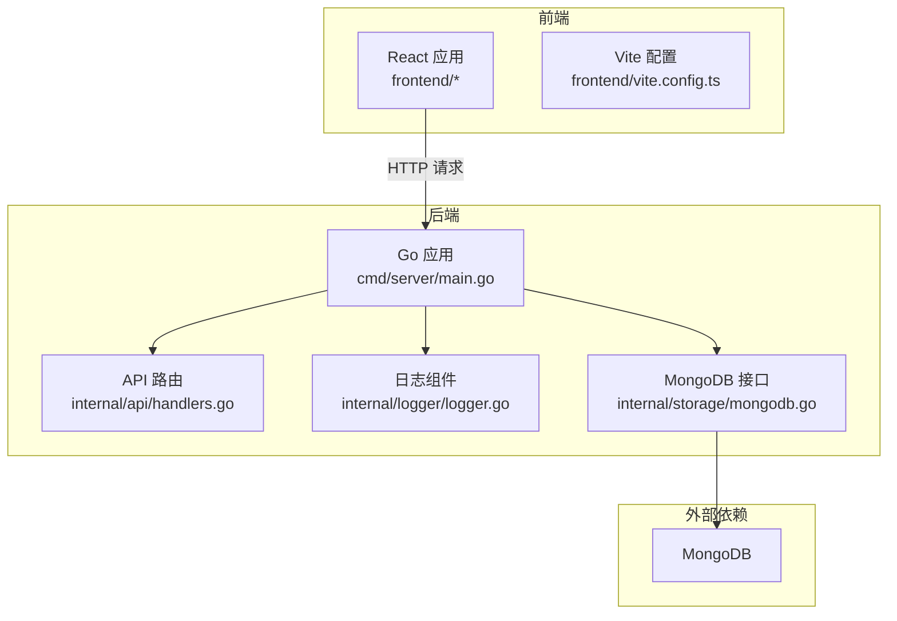
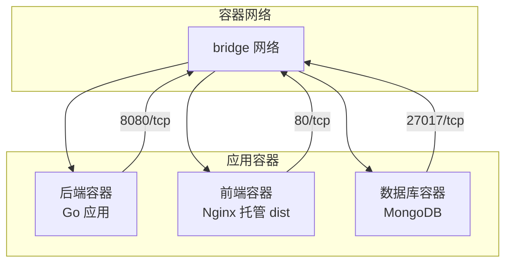
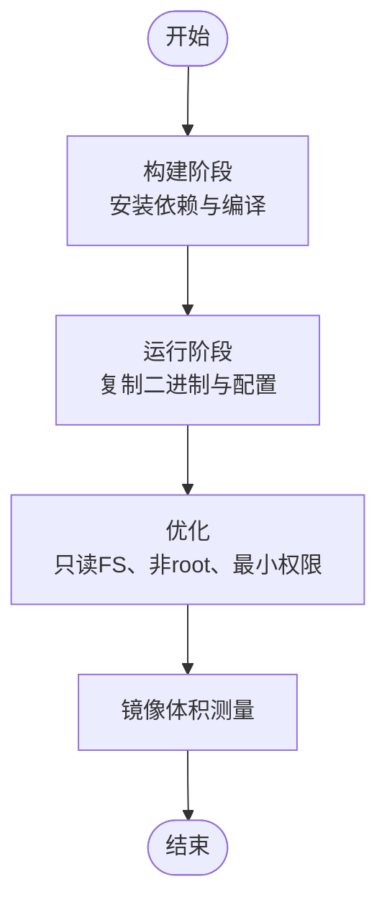
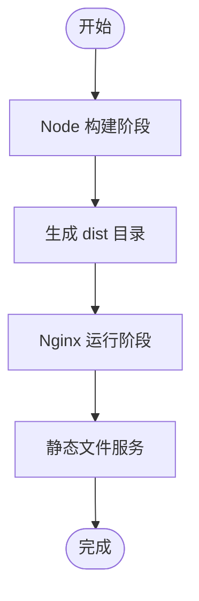
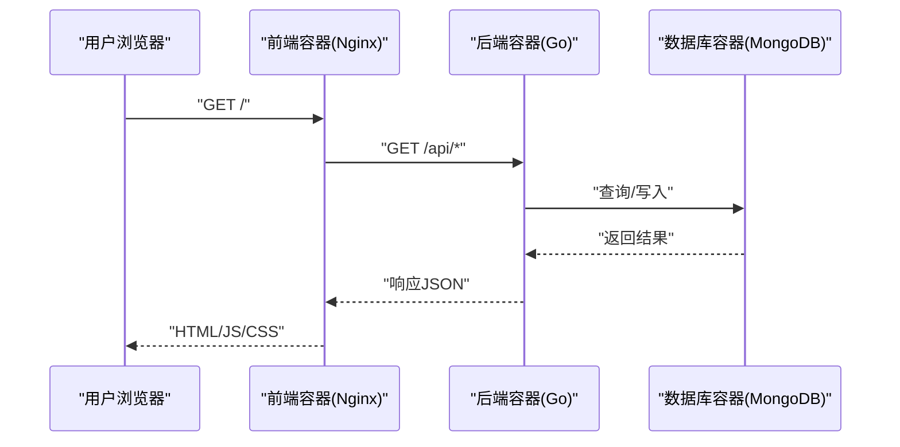
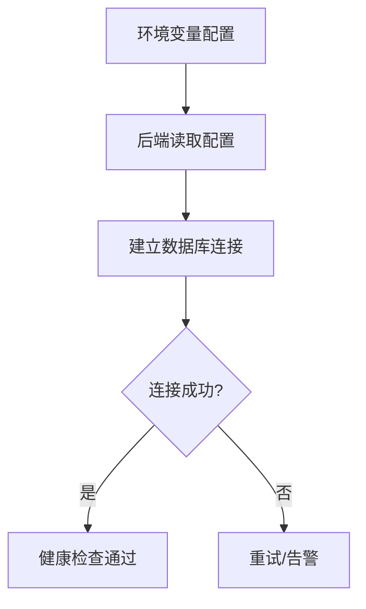
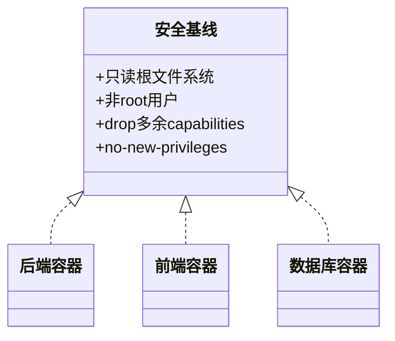
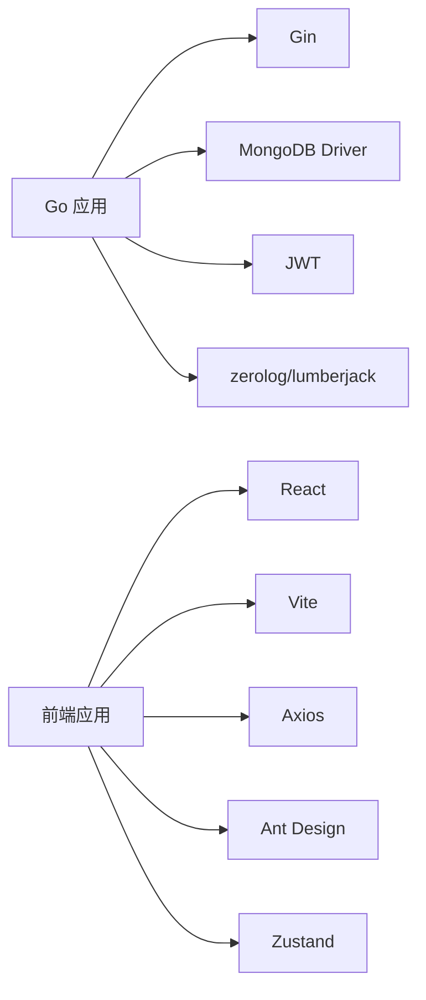

# 容器化部署

<cite>
**本文引用的文件**
- [cmd/server/main.go](file://cmd/server/main.go)
- [configs/config.yaml](file://configs/config.yaml)
- [go.mod](file://go.mod)
- [frontend/package.json](file://frontend/package.json)
- [frontend/vite.config.ts](file://frontend/vite.config.ts)
- [frontend/src/services/api.ts](file://frontend/src/services/api.ts)
- [frontend/src/stores/authStore.ts](file://frontend/src/stores/authStore.ts)
- [internal/api/handlers.go](file://internal/api/handlers.go)
- [internal/logger/logger.go](file://internal/logger/logger.go)
- [internal/storage/mongodb.go](file://internal/storage/mongodb.go)
- [README.md](file://README.md)
- [docs/architecture.md](file://docs/architecture.md)
</cite>

## 目录
1. [简介](#简介)
2. [项目结构](#项目结构)
3. [核心组件](#核心组件)
4. [架构总览](#架构总览)
5. [详细组件分析](#详细组件分析)
6. [依赖分析](#依赖分析)
7. [性能考虑](#性能考虑)
8. [故障排查指南](#故障排查指南)
9. [结论](#结论)
10. [附录](#附录)

## 简介
本方案面向数据中心项目，提供完整的容器化部署蓝图，涵盖：
- 多阶段构建优化与镜像体积控制
- 前后端分离的镜像策略（Go后端与React前端）
- Docker Compose服务编排、网络、卷与环境变量
- 容器间通信、服务发现与健康检查
- 安全加固（非root运行、只读文件系统、最小权限）

## 项目结构
项目采用前后端分离架构：
- 后端：Go + Gin Web 服务，提供REST API
- 前端：React + Vite 开发与构建
- 数据库：MongoDB
- 日志：zerolog + lumberjack

图表来源
- [cmd/server/main.go:24-150](file://cmd/server/main.go#L24-L150)
- [internal/api/handlers.go:45-181](file://internal/api/handlers.go#L45-L181)
- [internal/logger/logger.go:14-56](file://internal/logger/logger.go#L14-L56)
- [internal/storage/mongodb.go:14-91](file://internal/storage/mongodb.go#L14-L91)

章节来源
- [README.md:22-41](file://README.md#L22-L41)
- [frontend/package.json:1-29](file://frontend/package.json#L1-L29)
- [go.mod:1-50](file://go.mod#L1-L50)

## 核心组件
- 后端服务入口与配置
  - 环境变量加载与默认值
  - 日志初始化
  - MongoDB连接与RBAC初始化
  - HTTP服务器启动与优雅关闭
- API路由与权限控制
  - Gin路由注册与中间件链
  - JWT鉴权与RBAC权限校验
- 日志与存储
  - zerolog + lumberjack滚动日志
  - MongoDB接口抽象与动态集合

章节来源
- [cmd/server/main.go:24-150](file://cmd/server/main.go#L24-L150)
- [internal/api/handlers.go:23-43](file://internal/api/handlers.go#L23-L43)
- [internal/logger/logger.go:14-56](file://internal/logger/logger.go#L14-L56)
- [internal/storage/mongodb.go:14-91](file://internal/storage/mongodb.go#L14-L91)

## 架构总览
容器化架构建议：
- 后端镜像：多阶段构建，最终镜像仅包含运行时二进制
- 前端镜像：Nginx静态托管，构建产物dist直接部署
- 数据库：独立MongoDB容器
- 网络：自定义bridge网络，服务间通过服务名访问
- 卷：日志与持久化数据使用命名卷
- 健康检查：HTTP健康端点或TCP探测
- 安全：非root运行、只读根fs、drop多余capabilities

图表来源
- [cmd/server/main.go:121-127](file://cmd/server/main.go#L121-L127)
- [configs/config.yaml:20-26](file://configs/config.yaml#L20-L26)

## 详细组件分析

### 后端镜像构建（多阶段构建与优化）
目标：最小化镜像体积，提升安全性与可重复性。

- 构建阶段
  - 基础镜像：官方Go镜像（含build工具链）
  - 依赖安装：使用go mod下载依赖
  - 编译：CGO_ENABLED=0 + -trimpath + -ldflags '-extldflags "-static"'（静态链接）
  - 输出：生成精简的二进制文件
- 运行阶段
  - 基础镜像：官方Alpine或Debian slim
  - 创建非root用户与专用组
  - 设置只读根文件系统、drop多余capabilities
  - 仅拷贝运行时二进制与必要资源
  - 设置WORKDIR与ENTRYPOINT
- 最佳实践
  - 使用.dockerignore排除无关文件
  - 分层缓存：vendor -> 依赖 -> 源码
  - 使用buildx多平台构建
  - 镜像签名与漏洞扫描

图表来源
- [go.mod:1-50](file://go.mod#L1-L50)
- [cmd/server/main.go:24-150](file://cmd/server/main.go#L24-L150)

章节来源
- [go.mod:1-50](file://go.mod#L1-L50)
- [cmd/server/main.go:24-150](file://cmd/server/main.go#L24-L150)

### 前端镜像构建（Nginx静态托管）
目标：快速、稳定、安全地发布React构建产物。

- 构建阶段
  - 基础镜像：官方Node镜像
  - 安装依赖与构建：npm run build
  - 输出：dist目录
- 运行阶段
  - 基础镜像：官方Nginx alpine
  - 将dist复制到nginx html目录
  - 配置基础Nginx站点与静态文件服务
  - 非root运行、只读fs、drop多余capabilities
- 最佳实践
  - 启用gzip/br压缩
  - 配置缓存策略
  - TLS终止于反向代理或Ingress

图表来源
- [frontend/package.json:6-10](file://frontend/package.json#L6-L10)
- [frontend/vite.config.ts:1-6](file://frontend/vite.config.ts#L1-L6)

章节来源
- [frontend/package.json:1-29](file://frontend/package.json#L1-L29)
- [frontend/vite.config.ts:1-6](file://frontend/vite.config.ts#L1-L6)

### Docker Compose 编排与配置要点
- 服务编排
  - 后端服务：映射端口、挂载日志卷、设置环境变量
  - 前端服务：暴露80端口、反向代理至后端
  - 数据库服务：持久化卷、初始化脚本、网络隔离
- 网络设置
  - 自定义bridge网络，服务间通过服务名互通
- 卷挂载
  - 日志卷：后端应用日志持久化
  - 数据卷：MongoDB数据持久化
- 环境变量传递
  - 使用.env文件集中管理
  - 关键变量：数据库连接、JWT密钥、日志路径、端口等
- 健康检查
  - HTTP健康端点：/health
  - TCP端口探测：27017
- 重启策略
  - 失败自动重启（unless-stopped）

图表来源
- [frontend/src/services/api.ts:5-8](file://frontend/src/services/api.ts#L5-L8)
- [cmd/server/main.go:121-127](file://cmd/server/main.go#L121-L127)
- [configs/config.yaml:20-26](file://configs/config.yaml#L20-L26)

章节来源
- [frontend/src/services/api.ts:1-37](file://frontend/src/services/api.ts#L1-L37)
- [cmd/server/main.go:24-150](file://cmd/server/main.go#L24-L150)
- [configs/config.yaml:1-26](file://configs/config.yaml#L1-L26)

### 容器间通信与服务发现
- 服务发现
  - 在同一docker-compose网络内，使用服务名作为主机名
  - 后端通过环境变量配置数据库URI与端口
- 健康检查
  - 后端：提供/health端点，返回200表示健康
  - 数据库：TCP端口探测
- CORS与跨域
  - 后端已内置CORS中间件，生产环境建议限制允许源

图表来源
- [cmd/server/main.go:42-58](file://cmd/server/main.go#L42-L58)
- [configs/config.yaml:1-26](file://configs/config.yaml#L1-L26)

章节来源
- [cmd/server/main.go:100-113](file://cmd/server/main.go#L100-L113)
- [docs/architecture.md:724-742](file://docs/architecture.md#L724-L742)

### 安全配置（非root、只读FS、最小权限）
- 运行用户
  - 创建专用非root用户与组，切换到该用户运行进程
- 文件系统
  - 设置只读根文件系统，仅挂载必要目录为读写
- 能力与模式
  - drop多余Linux capabilities
  - 使用no-new-privileges
- 密钥与敏感信息
  - 使用环境变量注入JWT密钥、数据库凭据
  - 生产环境结合Secret管理（Compose secrets或Kubernetes Secret）

图表来源
- [cmd/server/main.go:24-150](file://cmd/server/main.go#L24-L150)
- [frontend/package.json:1-29](file://frontend/package.json#L1-L29)

章节来源
- [cmd/server/main.go:24-150](file://cmd/server/main.go#L24-L150)

## 依赖分析
- 后端依赖
  - Web框架：Gin
  - 数据库驱动：MongoDB Driver
  - JWT：golang-jwt
  - 日志：zerolog + lumberjack
- 前端依赖
  - React + Vite + TypeScript
  - UI库：Ant Design
  - HTTP：Axios
  - 路由与状态管理：React Router + Zustand

图表来源
- [go.mod:5-14](file://go.mod#L5-L14)
- [frontend/package.json:12-27](file://frontend/package.json#L12-L27)

章节来源
- [go.mod:1-50](file://go.mod#L1-L50)
- [frontend/package.json:1-29](file://frontend/package.json#L1-L29)

## 性能考虑
- 后端
  - 使用Release模式与静态链接减少体积
  - 合理设置HTTP超时与连接池
  - 日志滚动避免磁盘膨胀
- 前端
  - 启用gzip/br压缩
  - 静态资源缓存策略
  - CDN与边缘缓存
- 数据库
  - 连接池与索引优化
  - 定期备份与清理

## 故障排查指南
- 后端无法启动
  - 检查环境变量是否正确（数据库URI、JWT密钥、端口）
  - 查看日志卷中的HTTP与应用日志
- 前端无法访问后端
  - 确认前端API基础URL指向正确的后端服务名与端口
  - 检查CORS配置与防火墙
- 数据库连接失败
  - 确认MongoDB容器健康与端口开放
  - 检查网络连通性与认证配置
- 日志问题
  - 检查日志卷挂载与权限
  - 确认日志轮转配置合理

章节来源
- [internal/logger/logger.go:14-56](file://internal/logger/logger.go#L14-L56)
- [frontend/src/services/api.ts:5-8](file://frontend/src/services/api.ts#L5-L8)
- [cmd/server/main.go:42-58](file://cmd/server/main.go#L42-L58)

## 结论
通过多阶段构建与最小化运行时镜像，结合前后端分离与Compose编排，可实现高性能、可维护、安全可控的数据中心容器化部署。配合健康检查与日志滚动，确保生产环境的稳定性与可观测性。

## 附录
- 关键环境变量清单（示例）
  - SERVER_HOST/SERVER_PORT：后端监听地址与端口
  - MONGODB_URI/MONGODB_DATABASE：业务数据库连接
  - MONGODB_RBAC_URI/MONGODB_RBAC_DATABASE：RBAC数据库连接
  - JWT_SECRET/JWT_EXPIRATION：JWT配置
  - LOG_LEVEL/LOG_HTTP_FILE/LOG_MAX_SIZE等：日志配置
  - SCRAPER_WORKERS：刮削工作协程数

章节来源
- [docs/architecture.md:724-742](file://docs/architecture.md#L724-L742)
- [configs/config.yaml:1-26](file://configs/config.yaml#L1-L26)