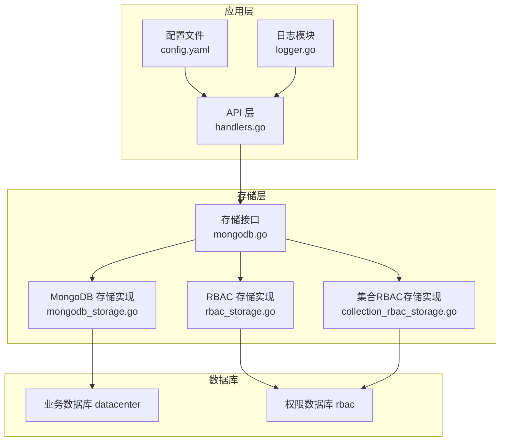
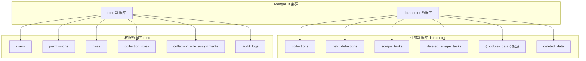
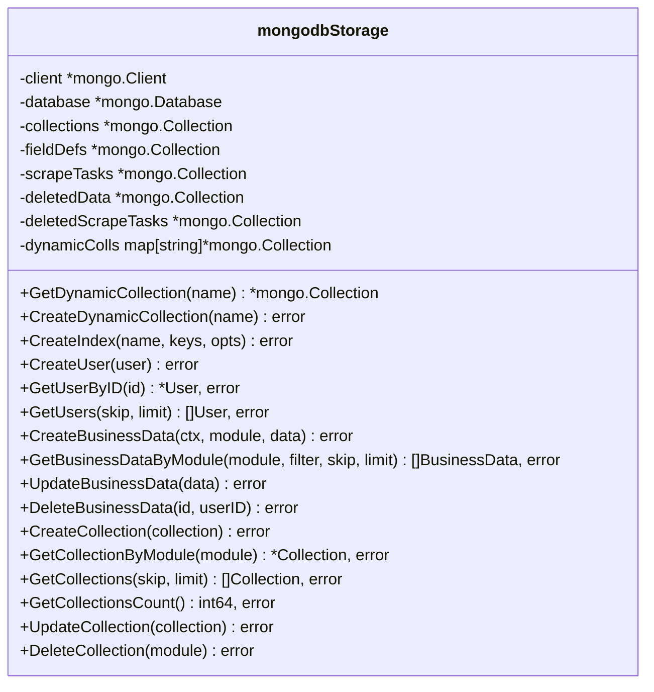
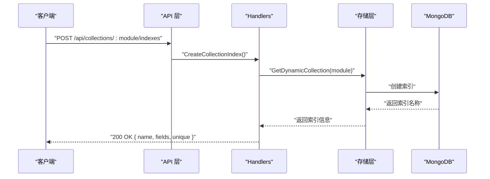
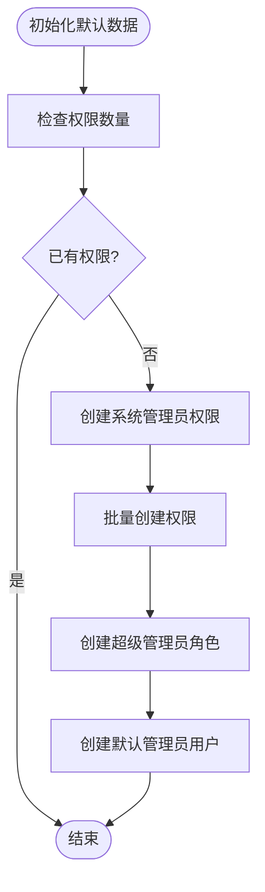
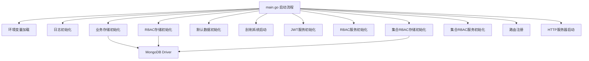

# 数据库部署

<cite>
**本文档引用的文件**
- [mongodb.go](file://internal/storage/mongodb.go)
- [mongodb_storage.go](file://internal/storage/mongodb_storage.go)
- [rbac_storage.go](file://internal/storage/rbac_storage.go)
- [collection_rbac_storage.go](file://internal/storage/collection_rbac_storage.go)
- [handlers.go](file://internal/api/handlers.go)
- [main.go](file://cmd/server/main.go)
- [config.yaml](file://configs/config.yaml)
- [logger.go](file://internal/logger/logger.go)
- [models.go](file://internal/models/models.go)
- [architecture.md](file://docs/architecture.md)
- [rbac.md](file://docs/rbac.md)
- [api-spec.md](file://docs/api-spec.md)
- [README.md](file://README.md)
</cite>

## 目录
1. [简介](#简介)
2. [项目结构](#项目结构)
3. [核心组件](#核心组件)
4. [架构总览](#架构总览)
5. [详细组件分析](#详细组件分析)
6. [依赖关系分析](#依赖关系分析)
7. [性能考虑](#性能考虑)
8. [故障排查指南](#故障排查指南)
9. [结论](#结论)
10. [附录](#附录)

## 简介
本指南面向数据中心项目的MongoDB数据库部署与运维，涵盖副本集部署配置、安全配置、备份策略、性能优化、监控告警以及故障转移与灾难恢复方案。项目当前采用双数据库设计：业务数据存储于名为 datacenter 的数据库，权限控制数据存储于 rbac 数据库，二者通过独立的 MongoDB 实例或副本集进行物理隔离。

## 项目结构
项目采用分层架构，数据库层通过统一的存储接口抽象，分别对接业务数据库与权限数据库。核心文件包括：
- 存储层接口与实现：负责与 MongoDB 的交互
- API 层：提供索引管理等数据库操作接口
- 配置文件：定义数据库连接参数
- 日志模块：提供结构化日志能力

图表来源
- [mongodb.go:14-90](file://internal/storage/mongodb.go#L14-L90)
- [mongodb_storage.go:16-51](file://internal/storage/mongodb_storage.go#L16-L51)
- [rbac_storage.go:16-79](file://internal/storage/rbac_storage.go#L16-L79)
- [collection_rbac_storage.go:15-62](file://internal/storage/collection_rbac_storage.go#L15-L62)
- [handlers.go:1613-1657](file://internal/api/handlers.go#L1613-L1657)
- [config.yaml:1-26](file://configs/config.yaml#L1-L26)

章节来源
- [architecture.md:167-186](file://docs/architecture.md#L167-L186)
- [README.md:22-41](file://README.md#L22-L41)

## 核心组件
- 存储接口：定义了用户、权限、角色、业务数据、刮削任务、集合管理等 CRUD 操作，以及动态集合与索引管理能力。
- MongoDB 存储实现：封装了连接建立、Ping 检测、数据库选择、集合缓存、动态集合创建与索引创建。
- RBAC 存储实现：提供用户、权限、角色的完整生命周期管理，并包含默认数据初始化。
- 集合RBAC存储实现：提供集合级别的角色与权限分配、审计日志记录。
- API 层：提供索引创建、查询、删除的 HTTP 接口，便于运行期管理索引。

章节来源
- [mongodb.go:14-90](file://internal/storage/mongodb.go#L14-L90)
- [mongodb_storage.go:16-78](file://internal/storage/mongodb_storage.go#L16-L78)
- [rbac_storage.go:16-79](file://internal/storage/rbac_storage.go#L16-L79)
- [collection_rbac_storage.go:15-62](file://internal/storage/collection_rbac_storage.go#L15-L62)
- [handlers.go:1613-1657](file://internal/api/handlers.go#L1613-L1657)

## 架构总览
系统采用双数据库设计，业务数据与权限数据物理隔离，分别对应不同的数据库实例或副本集。业务数据库包含集合元数据、字段定义、刮削任务、动态业务数据集合、软删除集合；权限数据库包含用户、权限、角色、集合角色与分配、审计日志。

图表来源
- [architecture.md:167-186](file://docs/architecture.md#L167-L186)

章节来源
- [architecture.md:167-186](file://docs/architecture.md#L167-L186)

## 详细组件分析

### 组件A：MongoDB 存储实现
- 连接与初始化：通过 ApplyURI 建立连接并执行 Ping 检测，随后选择指定数据库。
- 集合管理：维护静态集合引用与动态集合缓存，避免重复创建集合。
- 索引管理：提供动态集合索引创建接口，支持唯一索引、复合索引等。
- 业务数据：支持按模块动态创建集合，集合命名规则为 module + "_data"。

图表来源
- [mongodb_storage.go:16-51](file://internal/storage/mongodb_storage.go#L16-L51)
- [mongodb_storage.go:53-78](file://internal/storage/mongodb_storage.go#L53-L78)

章节来源
- [mongodb_storage.go:27-51](file://internal/storage/mongodb_storage.go#L27-L51)
- [mongodb_storage.go:53-78](file://internal/storage/mongodb_storage.go#L53-L78)

### 组件B：API 层索引管理
- 提供创建索引、查询索引、删除索引的 HTTP 接口，便于运行期管理业务集合索引。
- 支持按模块动态获取索引列表与删除指定索引。

图表来源
- [handlers.go:1613-1618](file://internal/api/handlers.go#L1613-L1618)
- [api-spec.md:1003-1031](file://docs/api-spec.md#L1003-L1031)

章节来源
- [handlers.go:1613-1657](file://internal/api/handlers.go#L1613-L1657)
- [api-spec.md:1003-1093](file://docs/api-spec.md#L1003-L1093)

### 组件C：RBAC 存储实现
- 用户、权限、角色的完整 CRUD 与关联管理。
- 默认数据初始化：创建系统管理员权限、超级管理员角色与默认管理员用户。
- 角色与权限的分配与回收，支持多角色用户。

图表来源
- [rbac_storage.go:81-164](file://internal/storage/rbac_storage.go#L81-L164)

章节来源
- [rbac_storage.go:81-164](file://internal/storage/rbac_storage.go#L81-L164)

### 组件D：集合RBAC 存储实现
- 集合角色与分配管理：支持按模块与用户维度的角色分配。
- 审计日志：记录用户操作的审计信息，支持按用户、资源过滤查询。

章节来源
- [collection_rbac_storage.go:15-62](file://internal/storage/collection_rbac_storage.go#L15-L62)
- [collection_rbac_storage.go:131-156](file://internal/storage/collection_rbac_storage.go#L131-L156)
- [collection_rbac_storage.go:209-243](file://internal/storage/collection_rbac_storage.go#L209-L243)

## 依赖关系分析
- 应用启动顺序：环境变量加载 → 日志初始化 → 业务存储初始化 → RBAC 存储初始化 → 默认数据初始化 → 刮削系统启动 → JWT 服务 → RBAC 服务 → 集合RBAC服务 → 路由注册 → HTTP 服务器启动。
- 存储层依赖：各存储实现均依赖 MongoDB Driver，通过 options.Client().ApplyURI(uri) 建立连接。
- 配置来源：配置文件与环境变量共同决定数据库连接参数。

图表来源
- [main.go:24-150](file://cmd/server/main.go#L24-L150)
- [config.yaml:1-26](file://configs/config.yaml#L1-L26)

章节来源
- [main.go:24-150](file://cmd/server/main.go#L24-L150)
- [config.yaml:1-26](file://configs/config.yaml#L1-L26)

## 性能考虑
- 索引策略
  - 业务数据集合：建议为常用查询字段建立复合索引，如模块+时间戳、模块+描述等，结合业务查询模式进行优化。
  - 用户与权限集合：为 username、code 等高频查询字段建立唯一索引。
  - 刮削任务集合：为 module、status 等过滤字段建立索引。
- 查询优化
  - 使用投影与分页减少传输数据量，避免全表扫描。
  - 对嵌套字段查询使用前缀规范化，确保查询条件命中索引。
- 内存配置
  - MongoDB WiredTiger 缓存大小应根据可用内存合理配置，避免频繁换页。
  - 合理设置连接池大小，避免过多连接导致内存压力。
- 运行期索引管理
  - 通过 API 层提供的接口动态创建与删除索引，避免生产环境停机维护。

章节来源
- [mongodb_storage.go:71-78](file://internal/storage/mongodb_storage.go#L71-L78)
- [handlers.go:1613-1657](file://internal/api/handlers.go#L1613-L1657)
- [api-spec.md:1003-1093](file://docs/api-spec.md#L1003-L1093)

## 故障排查指南
- 连接问题
  - 检查 MONGODB_URI 是否正确，确认网络连通性与认证配置。
  - 使用 Ping 检测连接有效性，若失败查看日志定位具体错误。
- 索引异常
  - 通过 API 层查询索引列表，确认索引是否创建成功。
  - 若索引创建失败，检查字段类型与唯一性约束。
- 权限问题
  - 确认用户角色与权限映射关系，检查默认数据初始化是否完成。
  - 审计日志可用于追踪权限变更与异常操作。
- 日志分析
  - 使用结构化日志记录关键事件，结合时间戳与调用方信息定位问题。

章节来源
- [mongodb_storage.go:27-51](file://internal/storage/mongodb_storage.go#L27-L51)
- [rbac_storage.go:81-164](file://internal/storage/rbac_storage.go#L81-L164)
- [logger.go:14-56](file://internal/logger/logger.go#L14-L56)

## 结论
本项目提供了清晰的双数据库架构与完善的存储层抽象，能够满足业务数据与权限控制的分离需求。通过运行期索引管理接口与结构化日志能力，可有效支撑生产环境的运维与优化。建议在生产环境中进一步完善副本集部署、安全配置与监控告警体系，以提升系统的高可用性与可观测性。

## 附录

### MongoDB 副本集部署配置
- 角色分配
  - 主节点：承担读写操作，作为主要数据写入点。
  - 从节点：提供只读查询与数据冗余，参与选举。
  - 仲裁节点：不存储数据，仅参与投票，降低仲裁成本。
- 配置要点
  - 设置合适的优先级，确保主节点稳定。
  - 启用 oplog 大小与同步延迟阈值，平衡一致性与性能。
  - 配置副本集名称与成员列表，确保网络可达性。

### MongoDB 集群安全配置
- 认证机制
  - 启用 SCRAM-SHA-256 或更高强度认证。
  - 为不同应用与用户设置专用凭据，避免共享密钥。
- 网络加密
  - 启用 TLS/SSL，配置证书与私钥，限制协议版本。
  - 仅开放必要的端口，使用防火墙策略限制来源 IP。
- 访问控制列表
  - 基于角色的最小权限原则，避免授予全局管理员权限。
  - 为敏感集合设置细粒度权限，结合网络 ACL 控制访问范围。

### 数据库备份策略
- 定期备份
  - 使用 mongodump 导出业务数据库与权限数据库，保留多份历史快照。
  - 配置自动化脚本定时执行备份任务，监控备份成功率。
- 增量备份
  - 使用 oplog 增量备份，缩短 RPO（恢复点目标）。
  - 定期校验增量备份的完整性与可恢复性。
- 恢复测试
  - 定期在隔离环境进行恢复演练，验证备份数据可用性。
  - 测试不同场景下的恢复流程，包括部分集合恢复与时间点恢复。

### 监控与告警
- 连接数监控
  - 监控活跃连接数与连接池使用率，防止连接泄漏。
  - 设置阈值告警，及时发现异常增长。
- 磁盘空间监控
  - 关注集合与索引大小变化，预留充足容量。
  - 配置磁盘使用率阈值告警，提前扩容或清理。
- 慢查询日志分析
  - 开启慢查询日志，设定阈值与采样频率。
  - 分析慢查询原因，优化索引与查询语句。

### 故障转移与灾难恢复
- 故障转移
  - 自动故障检测与快速切换，确保服务连续性。
  - 预先演练切换流程，验证数据一致性与业务可用性。
- 灾难恢复
  - 建立异地多活或多副本策略，降低单点风险。
  - 制定详细的恢复步骤与回滚预案，定期更新与培训。