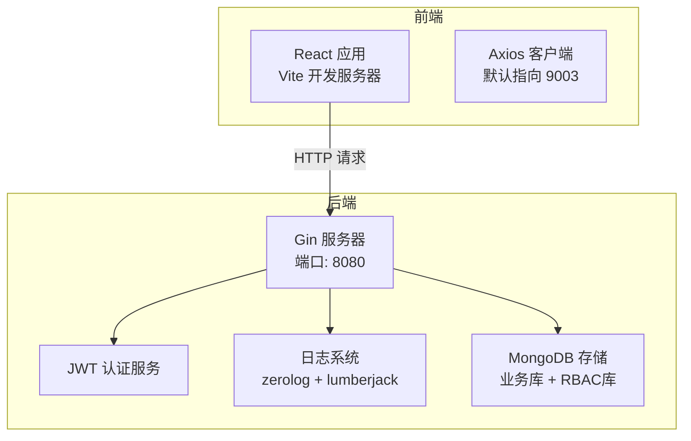
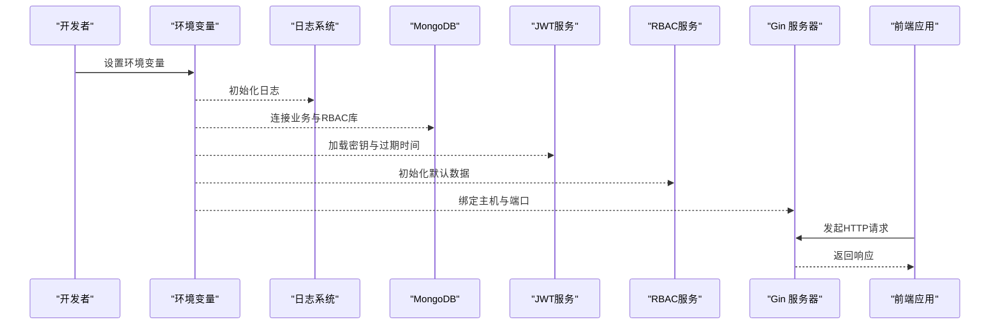
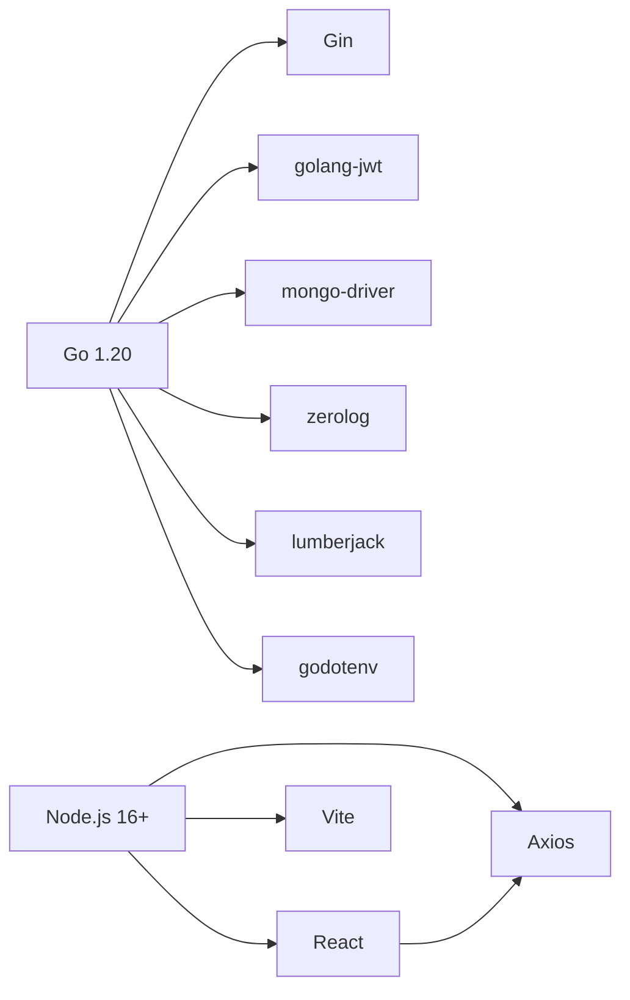

# 环境准备

<cite>
**本文引用的文件**
- [go.mod](file://go.mod)
- [README.md](file://README.md)
- [configs/config.yaml](file://configs/config.yaml)
- [cmd/server/main.go](file://cmd/server/main.go)
- [internal/auth/jwt.go](file://internal/auth/jwt.go)
- [internal/logger/logger.go](file://internal/logger/logger.go)
- [internal/storage/mongodb.go](file://internal/storage/mongodb.go)
- [frontend/package.json](file://frontend/package.json)
- [frontend/vite.config.ts](file://frontend/vite.config.ts)
- [frontend/src/services/api.ts](file://frontend/src/services/api.ts)
</cite>

## 目录
1. [简介](#简介)
2. [项目结构](#项目结构)
3. [核心组件](#核心组件)
4. [架构总览](#架构总览)
5. [详细组件分析](#详细组件分析)
6. [依赖分析](#依赖分析)
7. [性能考虑](#性能考虑)
8. [故障排查指南](#故障排查指南)
9. [结论](#结论)
10. [附录](#附录)

## 简介
本指南面向数据中心项目的部署与运维团队，提供从零开始的环境准备与配置说明，覆盖生产与开发环境的差异、系统权限与网络端口要求、环境变量配置要点，以及跨平台（Windows、Linux、macOS）的安装与切换策略。读者无需深入源码即可按步骤完成环境搭建。

## 项目结构
数据中心项目采用前后端分离架构：
- 后端：Go 1.20 应用，使用 Gin 框架提供 REST API，MongoDB 作为主业务与 RBAC 数据库存储，支持 JWT 认证与日志记录。
- 前端：React 18 + TypeScript + Vite，Axios 发起请求，默认指向本地后端服务端口。

图表来源
- [cmd/server/main.go:121-126](file://cmd/server/main.go#L121-L126)
- [internal/auth/jwt.go:35-41](file://internal/auth/jwt.go#L35-L41)
- [internal/logger/logger.go:14-56](file://internal/logger/logger.go#L14-L56)
- [internal/storage/mongodb.go:14-90](file://internal/storage/mongodb.go#L14-L90)
- [frontend/src/services/api.ts:5-8](file://frontend/src/services/api.ts#L5-L8)

章节来源
- [README.md:22-41](file://README.md#L22-L41)

## 核心组件
- 后端运行时与版本要求
  - Go 1.20 及以上（模块声明明确）
  - Gin Web 框架
  - MongoDB 客户端驱动
  - JWT 令牌与密码哈希库
  - 日志组件 zerolog 与 lumberjack
- 前端运行时与版本要求
  - Node.js 16+（package.json 中的引擎约束）
  - Vite 构建工具
  - React 18 + TypeScript
- 关键外部依赖
  - MongoDB 4.4+（用于业务与 RBAC 数据库）
  - 环境变量驱动配置（JWT、日志、服务器、刮削器等）

章节来源
- [go.mod:3](file://go.mod#L3)
- [go.mod:5-13](file://go.mod#L5-L13)
- [frontend/package.json:1-29](file://frontend/package.json#L1-L29)
- [README.md:45-47](file://README.md#L45-L47)

## 架构总览
后端通过环境变量注入配置，初始化日志、MongoDB 存储、JWT 服务、RBAC 服务与刮削系统，最后启动 HTTP 服务器。前端通过 Axios 发送请求至后端 API。

图表来源
- [cmd/server/main.go:32-126](file://cmd/server/main.go#L32-L126)
- [internal/logger/logger.go:14-56](file://internal/logger/logger.go#L14-L56)
- [internal/storage/mongodb.go:42-89](file://internal/storage/mongodb.go#L42-L89)
- [internal/auth/jwt.go:35-41](file://internal/auth/jwt.go#L35-L41)
- [frontend/src/services/api.ts:5-8](file://frontend/src/services/api.ts#L5-L8)

## 详细组件分析

### 环境变量与配置文件
- 环境变量优先级
  - 后端通过环境变量覆盖默认值，未设置时使用内置默认值
  - 示例变量包括：MONGODB_URI、MONGODB_DATABASE、JWT_SECRET、JWT_EXPIRATION、REFRESH_EXPIRATION、LOG_LEVEL、LOG_HTTP_FILE、SERVER_HOST、SERVER_PORT、SCRAPER_WORKERS
- 配置文件
  - YAML 配置文件提供默认值（如 MongoDB URI、数据库名、JWT 过期时间、日志路径、服务器端口等），但后端实际以环境变量为准
- 前端 API 地址
  - Axios 默认指向本地 9003 端口，需确保后端监听该端口或调整前端配置

章节来源
- [cmd/server/main.go:25-28](file://cmd/server/main.go#L25-L28)
- [cmd/server/main.go:32-126](file://cmd/server/main.go#L32-L126)
- [configs/config.yaml:1-26](file://configs/config.yaml#L1-L26)
- [frontend/src/services/api.ts:5-8](file://frontend/src/services/api.ts#L5-L8)

### JWT 与认证
- JWT 服务负责签发、校验与刷新令牌，密钥与过期时间来自环境变量
- 刷新流程允许在令牌过期但仍在刷新窗口内生成新令牌

章节来源
- [internal/auth/jwt.go:35-41](file://internal/auth/jwt.go#L35-L41)
- [internal/auth/jwt.go:68-111](file://internal/auth/jwt.go#L68-L111)

### 日志系统
- 使用 zerolog 输出到控制台与滚动日志文件
- 支持日志级别、文件大小、备份数量与保留天数配置

章节来源
- [internal/logger/logger.go:14-56](file://internal/logger/logger.go#L14-L56)

### MongoDB 存储
- 提供用户、字段定义、业务数据、权限、角色、刮削任务、集合管理等接口
- 支持动态集合与索引创建

章节来源
- [internal/storage/mongodb.go:14-90](file://internal/storage/mongodb.go#L14-L90)

### 前端构建与运行
- Node.js 16+，Vite 开发服务器，Axios 发起请求
- 生产构建输出至 dist 目录

章节来源
- [frontend/package.json:1-29](file://frontend/package.json#L1-L29)
- [frontend/vite.config.ts:1-6](file://frontend/vite.config.ts#L1-L6)
- [README.md:108-133](file://README.md#L108-L133)

## 依赖分析
- 后端依赖
  - Gin：Web 框架
  - golang-jwt：JWT 处理
  - mongo-driver：MongoDB 客户端
  - zerolog + lumberjack：日志
  - godotenv：.env 文件加载
- 前端依赖
  - React、TypeScript、Vite、Ant Design、Axios、React Router、Zustand

图表来源
- [go.mod:5-13](file://go.mod#L5-L13)
- [frontend/package.json:12-27](file://frontend/package.json#L12-L27)

章节来源
- [go.mod:5-13](file://go.mod#L5-L13)
- [frontend/package.json:12-27](file://frontend/package.json#L12-L27)

## 性能考虑
- 刮削器工作线程数可通过环境变量配置，合理设置可提升并发处理能力
- 日志滚动参数（最大文件大小、备份数、保留天数）影响磁盘占用与 IO
- MongoDB 连接池与索引策略对查询性能至关重要，建议在生产环境优化索引与副本集配置

## 故障排查指南
- 后端无法启动
  - 检查环境变量是否正确设置（如 MONGODB_URI、JWT_SECRET、SERVER_PORT）
  - 查看日志输出与滚动日志文件
- MongoDB 连接失败
  - 确认 MongoDB 服务已启动且可达
  - 校验 URI 与数据库名称
- 前端无法访问后端
  - 确认后端监听地址与端口（SERVER_HOST/SERVER_PORT）
  - 检查 CORS 配置与防火墙
- JWT 令牌无效
  - 校验 JWT_SECRET 是否一致
  - 检查令牌过期与刷新窗口

章节来源
- [cmd/server/main.go:32-126](file://cmd/server/main.go#L32-L126)
- [internal/logger/logger.go:14-56](file://internal/logger/logger.go#L14-L56)
- [internal/auth/jwt.go:68-111](file://internal/auth/jwt.go#L68-L111)

## 结论
通过统一的环境变量体系与配置文件，数据中心项目可在不同环境中保持一致的行为。生产环境应强化安全（强密钥、最小暴露面）、监控（日志滚动与告警）与性能（连接池、索引、并发）配置，并严格区分开发与生产环境的变量与端口。

## 附录

### 硬件与软件要求
- 后端
  - Go 1.20+
  - MongoDB 4.4+
- 前端
  - Node.js 16+

章节来源
- [go.mod:3](file://go.mod#L3)
- [README.md:45-47](file://README.md#L45-L47)
- [frontend/package.json:1-29](file://frontend/package.json#L1-L29)

### 环境变量清单与示例
- 必填项
  - MONGODB_URI：业务数据库连接串
  - MONGODB_DATABASE：业务数据库名
  - JWT_SECRET：JWT 签名密钥
  - SERVER_HOST：后端监听地址
  - SERVER_PORT：后端监听端口
- 可选项
  - MONGODB_RBAC_URI：RBAC 数据库连接串
  - MONGODB_RBAC_DATABASE：RBAC 数据库名
  - JWT_EXPIRATION：访问令牌过期间隔（小时）
  - REFRESH_EXPIRATION：刷新令牌过期间隔（小时）
  - LOG_LEVEL：日志级别
  - LOG_HTTP_FILE：HTTP 日志文件路径
  - LOG_MAX_SIZE：单文件最大大小（MB）
  - LOG_MAX_BACKUPS：日志备份数
  - LOG_MAX_AGE：日志保留天数
  - SCRAPER_WORKERS：刮削器工作线程数

章节来源
- [cmd/server/main.go:42-76](file://cmd/server/main.go#L42-L76)
- [configs/config.yaml:1-26](file://configs/config.yaml#L1-L26)
- [README.md:50-63](file://README.md#L50-L63)

### 不同操作系统下的安装步骤

- Windows
  - 安装 Go 1.20+、MongoDB 4.4+、Node.js 16+
  - 在项目根目录创建 .env 文件，设置上述环境变量
  - 打开命令提示符，进入 cmd/server 目录执行后端编译与运行
  - 进入 frontend 目录安装依赖并启动开发服务器
- Linux/macOS
  - 使用包管理器安装 Go、MongoDB、Node.js
  - 在项目根目录创建 .env 文件，设置环境变量
  - 在终端中分别进入后端与前端目录执行构建与运行

章节来源
- [README.md:65-78](file://README.md#L65-L78)
- [README.md:112-125](file://README.md#L112-L125)

### 开发环境与生产环境切换
- 开发环境
  - 使用 .env 文件集中管理变量
  - 后端默认监听 0.0.0.0:8080，前端默认开发服务器 5173
- 生产环境
  - 使用系统环境变量或容器注入
  - 后端监听地址与端口通过 SERVER_HOST/SERVER_PORT 控制
  - 建议启用 HTTPS、限制 CORS 并开启更严格的日志级别

章节来源
- [cmd/server/main.go:121-126](file://cmd/server/main.go#L121-L126)
- [README.md:50-63](file://README.md#L50-L63)

### 系统权限与网络端口
- 端口
  - 后端默认端口 8080；前端开发服务器默认 5173
  - 前端 Axios 默认指向 9003（需确保后端监听该端口或修改前端配置）
- 权限
  - 确保运行用户对日志目录有写权限
  - 确保数据库用户具备读写权限
  - 如使用容器部署，注意挂载卷与网络隔离

章节来源
- [configs/config.yaml:20-26](file://configs/config.yaml#L20-L26)
- [frontend/src/services/api.ts:5-8](file://frontend/src/services/api.ts#L5-L8)
- [internal/logger/logger.go:14-56](file://internal/logger/logger.go#L14-L56)