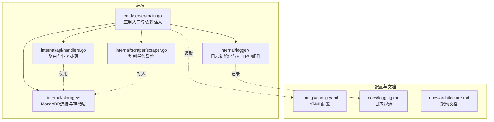
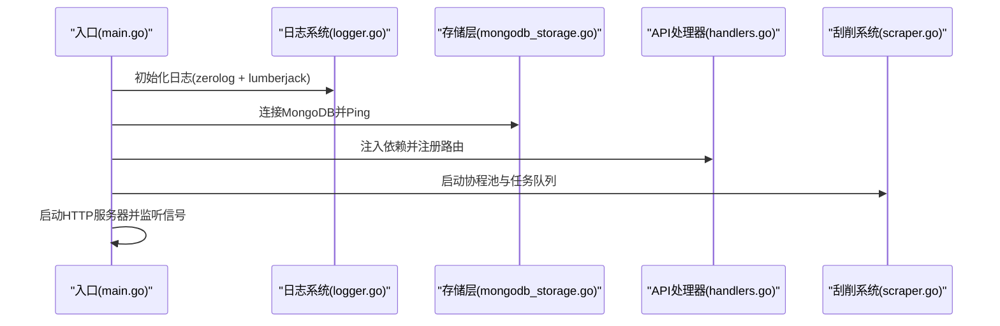
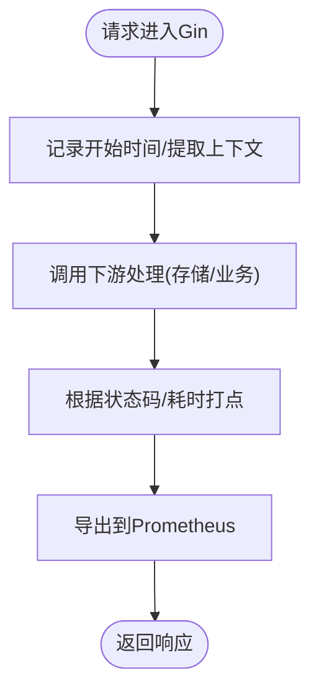
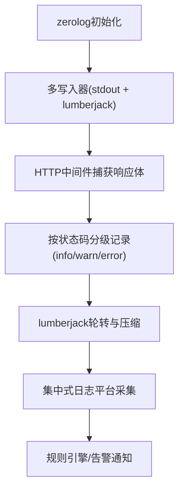
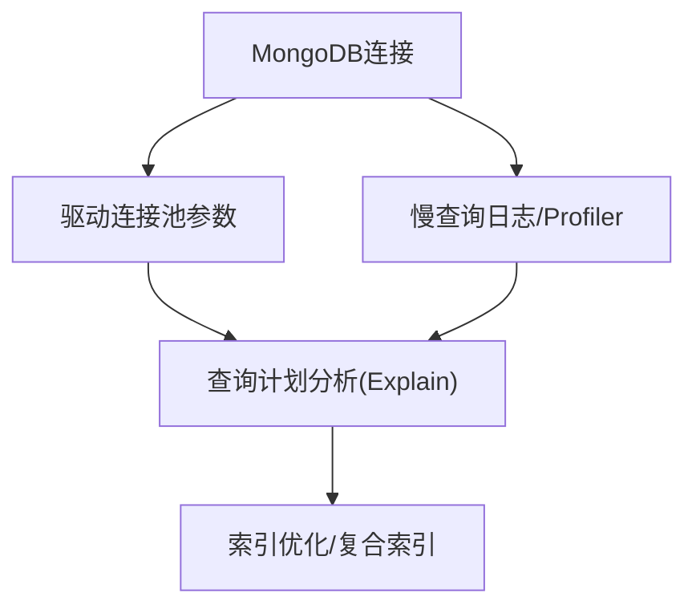
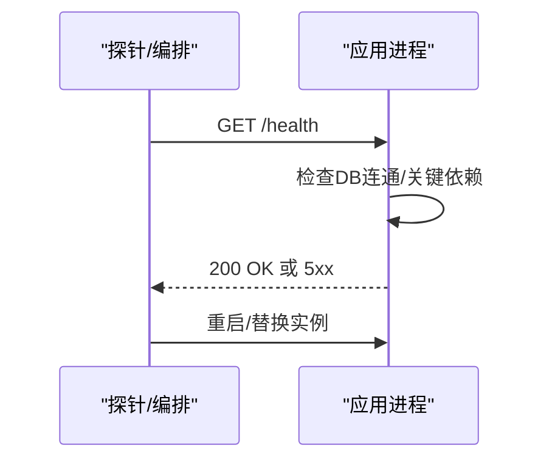
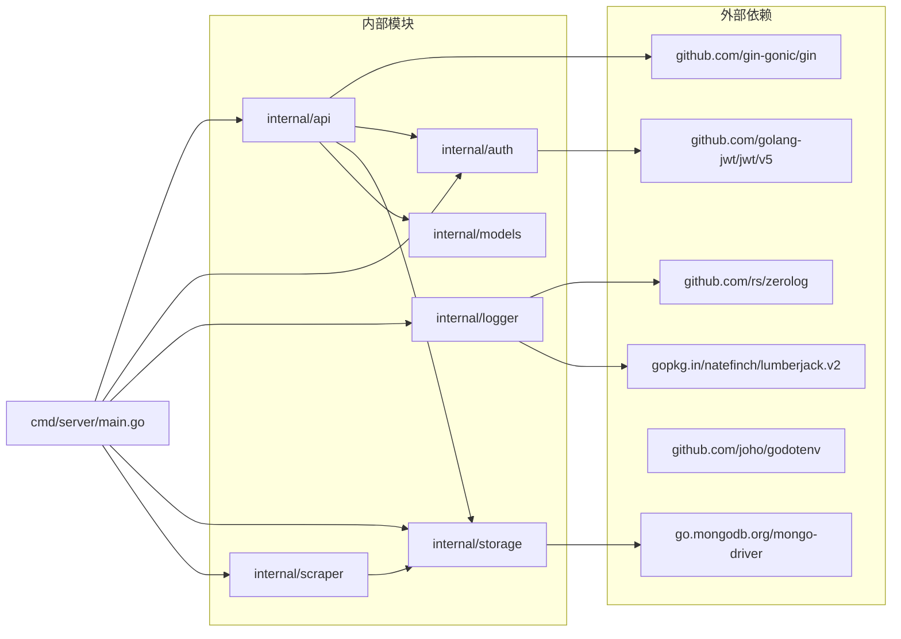

# 监控运维

<cite>
**本文引用的文件**
- [cmd/server/main.go](file://cmd/server/main.go)
- [configs/config.yaml](file://configs/config.yaml)
- [internal/logger/logger.go](file://internal/logger/logger.go)
- [internal/logger/middleware.go](file://internal/logger/middleware.go)
- [internal/storage/mongodb.go](file://internal/storage/mongodb.go)
- [internal/storage/mongodb_storage.go](file://internal/storage/mongodb_storage.go)
- [internal/api/handlers.go](file://internal/api/handlers.go)
- [internal/scraper/scraper.go](file://internal/scraper/scraper.go)
- [cmdenscrape/main.go](file://cmdenscrape/main.go)
- [internal/models/models.go](file://internal/models/models.go)
- [go.mod](file://go.mod)
- [README.md](file://README.md)
- [docs/logging.md](file://docs/logging.md)
- [docs/architecture.md](file://docs/architecture.md)
</cite>

## 目录
1. [简介](#简介)
2. [项目结构](#项目结构)
3. [核心组件](#核心组件)
4. [架构总览](#架构总览)
5. [详细组件分析](#详细组件分析)
6. [依赖分析](#依赖分析)
7. [性能考虑](#性能考虑)
8. [故障排查指南](#故障排查指南)
9. [结论](#结论)
10. [附录](#附录)

## 简介
本指南面向数据中心项目的监控与运维实践，围绕应用性能监控（Gin 框架指标采集、自定义指标与 Prometheus 集成）、日志监控（结构化日志、聚合与告警规则）、系统资源监控（CPU、内存、磁盘、网络）、数据库监控（查询性能、连接数、存储空间）、健康检查与故障检测（可用性检查与自动重启策略）、以及运维自动化脚本（部署、备份、监控脚本）等方面，结合代码库现状给出可落地的配置建议与最佳实践。

## 项目结构
项目采用前后端分离与分层架构，后端以 Gin 为核心，MongoDB 作为数据存储，提供认证授权、RBAC 权限、业务数据管理、数据刮削与审计日志能力。日志系统基于 zerolog 与 lumberjack，提供结构化日志与自动轮转。

**图表来源**
- [cmd/server/main.go:24-150](file://cmd/server/main.go#L24-L150)
- [internal/logger/logger.go:14-56](file://internal/logger/logger.go#L14-L56)
- [internal/storage/mongodb_storage.go:27-51](file://internal/storage/mongodb_storage.go#L27-L51)
- [internal/api/handlers.go:45-181](file://internal/api/handlers.go#L45-L181)
- [internal/scraper/scraper.go:34-58](file://internal/scraper/scraper.go#L34-L58)
- [configs/config.yaml:1-26](file://configs/config.yaml#L1-L26)
- [docs/logging.md:16-112](file://docs/logging.md#L16-L112)
- [docs/architecture.md:146-163](file://docs/architecture.md#L146-L163)

**章节来源**
- [cmd/server/main.go:24-150](file://cmd/server/main.go#L24-L150)
- [docs/architecture.md:146-163](file://docs/architecture.md#L146-L163)

## 核心组件
- 应用入口与启动编排：负责环境变量加载、日志初始化、存储连接、RBAC 初始化、刮削系统启动、JWT 服务、路由注册与优雅关闭。
- 日志系统：zerolog + lumberjack，提供应用日志与 HTTP 请求日志，支持多级写入与轮转。
- 存储层：MongoDB 连接与业务数据访问，支持动态集合与索引管理。
- API 层：Gin 路由注册与中间件链，包含认证、权限与集合级权限中间件。
- 刮削系统：协程池 + Channel 队列，异步执行刮削器脚本，跟踪任务状态与结果。

**章节来源**
- [cmd/server/main.go:24-150](file://cmd/server/main.go#L24-L150)
- [internal/logger/logger.go:14-56](file://internal/logger/logger.go#L14-L56)
- [internal/storage/mongodb_storage.go:27-51](file://internal/storage/mongodb_storage.go#L27-L51)
- [internal/api/handlers.go:45-181](file://internal/api/handlers.go#L45-L181)
- [internal/scraper/scraper.go:34-58](file://internal/scraper/scraper.go#L34-L58)

## 架构总览
下图展示应用启动与关键组件交互，体现日志、存储、API 与刮削系统的协作关系。

**图表来源**
- [cmd/server/main.go:32-135](file://cmd/server/main.go#L32-L135)
- [internal/logger/logger.go:14-56](file://internal/logger/logger.go#L14-L56)
- [internal/storage/mongodb_storage.go:27-51](file://internal/storage/mongodb_storage.go#L27-L51)
- [internal/api/handlers.go:45-181](file://internal/api/handlers.go#L45-L181)
- [internal/scraper/scraper.go:48-58](file://internal/scraper/scraper.go#L48-L58)

## 详细组件分析

### 应用性能监控与Gin指标采集
- 当前现状
  - Gin 路由已启用 Recovery 中间件，提供基础异常保护。
  - HTTP 请求日志中间件记录 method、path、status、latency、client_ip 等关键指标。
  - 未内置 Prometheus 指标导出器或 Gin 中间件统计。
- 建议与实施
  - 引入 Prometheus 客户端库，暴露 HTTP 请求总量、成功率、延迟分位数、错误码分布等指标。
  - 在 Gin 中间件链中增加指标采集，对每个请求维度打点（如路径、方法、状态码）。
  - 对关键业务路径（如刮削任务提交、查询、写入）增加自定义指标，便于定位瓶颈。
  - 将指标导出端点与应用端口分离，避免影响业务流量。

[本图为概念流程，不直接映射具体源码文件]

**章节来源**
- [internal/logger/middleware.go:25-68](file://internal/logger/middleware.go#L25-L68)
- [internal/api/handlers.go:45-181](file://internal/api/handlers.go#L45-L181)

### 自定义指标定义与Prometheus集成
- 指标建议
  - HTTP 请求：count、sum、上行/下行字节数、状态码分布。
  - 刮削任务：任务提交数、成功/失败计数、平均耗时、队列长度。
  - 存储访问：集合读写次数、慢查询阈值超时计数。
- 集成步骤
  - 在应用启动时注册 Prometheus 导出器与指标。
  - 在关键处理点（如 SubmitTask、业务数据 CRUD）埋点。
  - 配置 Prometheus 抓取端点与告警规则。

[本节为通用实践说明，不直接分析具体文件]

### 日志监控方案
- 结构化日志
  - 应用日志与 HTTP 日志分别输出至 stdout 与文件，统一使用 RFC3339 时间格式与 caller 信息。
  - HTTP 日志中间件记录 method、path、status、latency、client_ip、user_agent 等。
- 日志聚合与告警
  - 建议使用集中式日志平台（如 ELK/EFK 或云日志服务）采集 logs/app.log 与 logs/http.log。
  - 基于日志内容建立告警规则：高频 5xx、异常 latency、特定错误模式、认证失败等。
- 配置要点
  - 通过环境变量控制日志级别、HTTP 日志文件路径、轮转参数（最大文件大小、保留数量、保留天数）。

**图表来源**
- [internal/logger/logger.go:14-56](file://internal/logger/logger.go#L14-L56)
- [internal/logger/middleware.go:25-68](file://internal/logger/middleware.go#L25-L68)
- [docs/logging.md:42-112](file://docs/logging.md#L42-L112)

**章节来源**
- [internal/logger/logger.go:14-56](file://internal/logger/logger.go#L14-L56)
- [internal/logger/middleware.go:25-68](file://internal/logger/middleware.go#L25-L68)
- [docs/logging.md:16-112](file://docs/logging.md#L16-L112)

### 系统资源监控
- CPU、内存、磁盘、网络
  - 建议使用系统监控工具（如 Node Exporter/Prometheus）采集主机指标。
  - 关注应用进程的 CPU 使用率、RSS 内存、打开文件句柄数、网络连接数。
  - 结合容器化部署时，关注容器资源限额与突发使用情况。
- 与应用指标联动
  - 将主机指标与应用指标（HTTP QPS、P95 延迟、刮削任务耗时）关联，定位资源瓶颈。

[本节为通用实践说明，不直接分析具体文件]

### 数据库监控
- MongoDB 连接与性能
  - 当前存储层通过 mongo.Connect 与 Ping 建立连接；未内置连接池与慢查询统计。
  - 建议启用驱动侧连接池参数（最大连接数、空闲连接、连接生命周期），并开启慢查询日志与 Profiler。
- 查询性能与索引
  - 使用 Explain 分析慢查询，定期审查索引使用情况；对高频过滤字段建立复合索引。
- 存储空间与副本集
  - 监控集合大小、索引占用、WAL 与日志增长；确保副本集健康与同步延迟。
- 代码侧优化建议
  - 对高频查询使用投影与分页；避免 N+1 查询；合理使用 Count/Aggregate。

**图表来源**
- [internal/storage/mongodb_storage.go:27-51](file://internal/storage/mongodb_storage.go#L27-L51)
- [internal/storage/mongodb.go:14-90](file://internal/storage/mongodb.go#L14-L90)

**章节来源**
- [internal/storage/mongodb_storage.go:27-51](file://internal/storage/mongodb_storage.go#L27-L51)
- [internal/storage/mongodb.go:14-90](file://internal/storage/mongodb.go#L14-L90)

### 健康检查与故障检测
- 健康检查
  - 提供 /health 探针，检查数据库连通性、关键服务状态。
  - 在 Docker/Kubernetes 中使用 liveness/readiness 探针。
- 故障检测与自动重启
  - 使用进程管理器（如 systemd、Supervisor）或容器编排（K8s）实现自动重启。
  - 配置优雅关闭：接收 SIGTERM/SIGINT 后，等待请求处理完成再退出。

**图表来源**
- [cmd/server/main.go:138-149](file://cmd/server/main.go#L138-L149)

**章节来源**
- [cmd/server/main.go:138-149](file://cmd/server/main.go#L138-L149)

### 运维自动化脚本
- 部署脚本
  - 使用 Makefile/Shell 脚本完成依赖安装、构建、迁移与启动。
  - 集成环境变量注入与配置文件校验。
- 备份脚本
  - MongoDB 备份：mongodump 按数据库/集合粒度执行；校验完整性与压缩。
  - 日志备份：集中式日志平台保留策略与归档。
- 监控脚本
  - 指标抓取：Prometheus 抓取端点与自定义 Exporter。
  - 告警脚本：基于阈值触发通知（邮件/IM/Webhook）。

[本节为通用实践说明，不直接分析具体文件]

## 依赖分析
- 外部依赖
  - Gin：Web 框架
  - mongo-driver：MongoDB 官方驱动
  - zerolog + lumberjack：结构化日志与轮转
  - godotenv：.env 环境变量加载
  - golang-jwt：JWT 认证
- 内部模块
  - api：路由与处理器
  - auth：JWT 与中间件
  - logger：日志初始化与中间件
  - storage：MongoDB 存储层
  - scraper：刮削任务系统
  - models：数据模型与验证

**图表来源**
- [go.mod:5-14](file://go.mod#L5-L14)
- [cmd/server/main.go:3-22](file://cmd/server/main.go#L3-L22)

**章节来源**
- [go.mod:5-14](file://go.mod#L5-L14)
- [cmd/server/main.go:3-22](file://cmd/server/main.go#L3-L22)

## 性能考虑
- HTTP 层
  - 合理设置 ReadTimeout/WriteTimeout，避免长连接占用。
  - 控制中间件链长度，减少不必要的序列化/反序列化。
- 存储层
  - 使用投影与分页，避免一次性返回大结果集。
  - 对热点字段建立索引，定期分析慢查询。
- 刮削系统
  - 合理设置 worker 数量与队列容量，避免内存膨胀。
  - 对外部脚本执行结果进行超时与错误处理，防止阻塞。
- 日志
  - 控制日志级别与字段数量，避免 IO 瓶颈。

[本节为通用指导，不直接分析具体文件]

## 故障排查指南
- 启动阶段
  - 环境变量缺失：确认 .env 或系统环境变量是否正确加载。
  - 数据库连接失败：检查 URI、网络连通性与认证。
- 运行阶段
  - HTTP 5xx：查看 HTTP 日志中间件输出，定位异常请求与响应。
  - 刮削任务失败：检查任务状态更新与错误信息，确认外部脚本可执行。
- 日志
  - 使用 docs/logging.md 中的格式与字段进行检索与告警规则配置。

**章节来源**
- [cmd/server/main.go:24-150](file://cmd/server/main.go#L24-L150)
- [internal/logger/middleware.go:25-68](file://internal/logger/middleware.go#L25-L68)
- [docs/logging.md:16-112](file://docs/logging.md#L16-L112)

## 结论
本指南基于现有代码库现状，提出了应用性能监控、日志监控、系统资源与数据库监控、健康检查与自动重启策略以及运维自动化脚本的实施建议。建议优先完成 Prometheus 指标导出、HTTP 请求指标埋点、日志集中化与告警规则配置，并结合数据库慢查询分析与索引优化，持续提升系统稳定性与可观测性。

## 附录
- 环境变量与配置参考
  - 服务器端口、读写超时、JWT 秘钥与过期时间、日志级别与轮转参数、刮削工作线程数等。
- 测试数据生成
  - 提供 cmdenscrape 用于生成测试刮削任务数据，便于压测与验证。

**章节来源**
- [configs/config.yaml:1-26](file://configs/config.yaml#L1-L26)
- [README.md:50-76](file://README.md#L50-L76)
- [cmdenscrape/main.go:14-44](file://cmdenscrape/main.go#L14-L44)