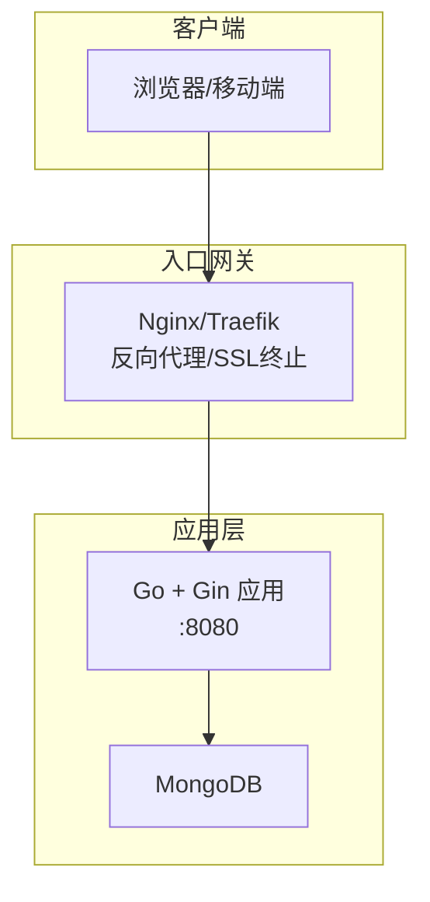
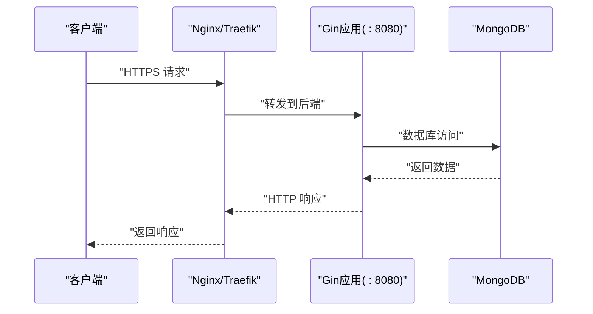
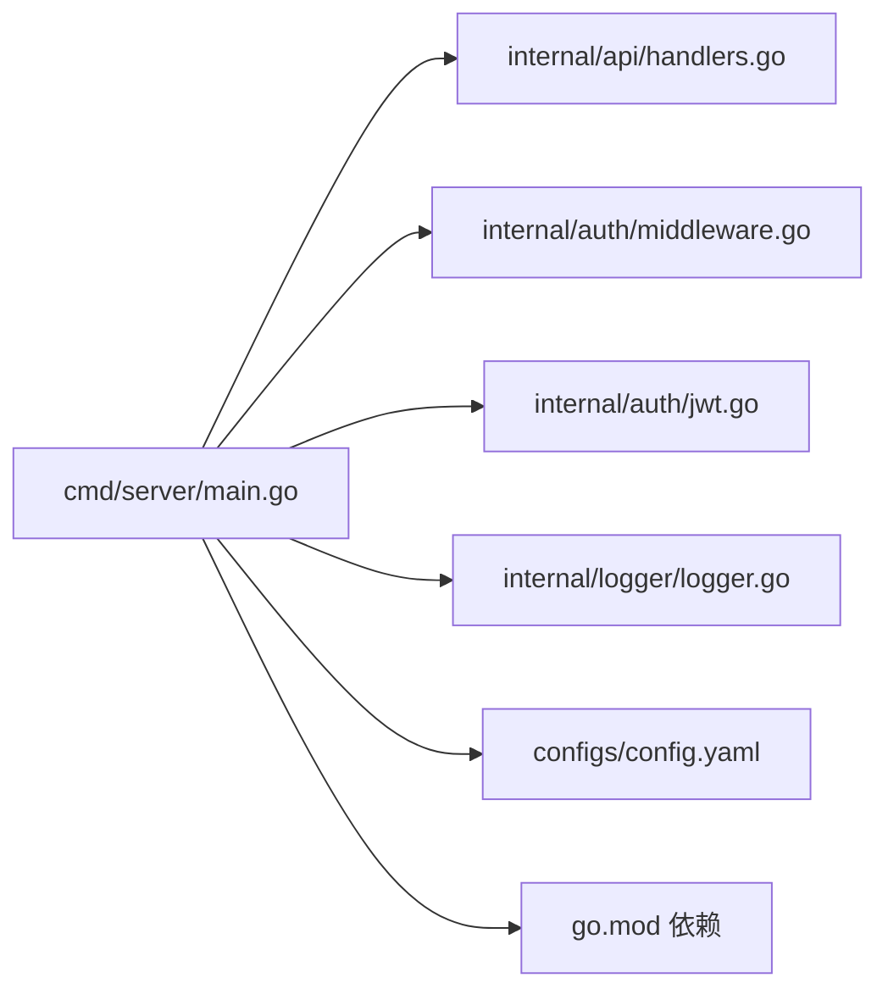

# 负载均衡配置

<cite>
**本文引用的文件**   
- [cmd/server/main.go](file://cmd/server/main.go)
- [configs/config.yaml](file://configs/config.yaml)
- [internal/api/handlers.go](file://internal/api/handlers.go)
- [internal/auth/middleware.go](file://internal/auth/middleware.go)
- [internal/auth/jwt.go](file://internal/auth/jwt.go)
- [internal/logger/logger.go](file://internal/logger/logger.go)
- [go.mod](file://go.mod)
- [docs/architecture.md](file://docs/architecture.md)
- [docs/modules/auth/requirements.md](file://docs/modules/auth/requirements.md)
- [README.md](file://README.md)
</cite>

## 目录
1. [简介](#简介)
2. [项目结构](#项目结构)
3. [核心组件](#核心组件)
4. [架构总览](#架构总览)
5. [详细组件分析](#详细组件分析)
6. [依赖分析](#依赖分析)
7. [性能考虑](#性能考虑)
8. [故障排查指南](#故障排查指南)
9. [结论](#结论)
10. [附录](#附录)

## 简介
本指南面向数据中心项目的运维与平台工程团队，围绕“负载均衡与反向代理”主题，结合现有后端实现与部署架构，提供可落地的配置建议与最佳实践。内容涵盖：
- Nginx反向代理配置要点（上游服务器组、负载均衡算法、健康检查）
- Traefik反向代理配置示例（自动服务发现与动态路由）
- SSL/TLS证书管理（Let’s Encrypt自动签发与续期策略）
- 会话保持与粘性会话（基于JWT的无状态特性说明）
- 缓存策略（静态资源与API响应缓存）
- 性能调优（连接池、超时、并发限制）

说明：当前仓库后端以无状态服务为主，采用JWT认证，天然适合水平扩展与反向代理部署；Nginx与Traefik均可作为入口网关使用。

## 项目结构
后端服务基于Go + Gin，监听HTTP端口并通过环境变量与配置文件控制运行参数。部署架构图展示了可选的Nginx前置与静态资源分离。

图表来源
- [docs/architecture.md:799-821](file://docs/architecture.md#L799-L821)
- [cmd/server/main.go:121-126](file://cmd/server/main.go#L121-L126)

章节来源
- [docs/architecture.md:799-821](file://docs/architecture.md#L799-L821)
- [cmd/server/main.go:121-126](file://cmd/server/main.go#L121-L126)
- [configs/config.yaml:20-25](file://configs/config.yaml#L20-L25)

## 核心组件
- HTTP服务器与路由
  - Gin路由注册与中间件链（CORS、日志、恢复）
  - 服务器超时配置（读取/写入）
- 认证与授权
  - JWT服务与中间件，支持登录、注册、权限校验
- 日志系统
  - zerolog + lumberjack，支持HTTP与应用日志分离与轮转
- 配置与环境变量
  - YAML配置与环境变量双通道，覆盖服务器、JWT、日志等

章节来源
- [cmd/server/main.go:97-126](file://cmd/server/main.go#L97-L126)
- [internal/api/handlers.go:45-181](file://internal/api/handlers.go#L45-L181)
- [internal/auth/middleware.go:11-48](file://internal/auth/middleware.go#L11-L48)
- [internal/auth/jwt.go:20-83](file://internal/auth/jwt.go#L20-L83)
- [internal/logger/logger.go:14-56](file://internal/logger/logger.go#L14-L56)
- [configs/config.yaml:1-26](file://configs/config.yaml#L1-L26)
- [go.mod:5-14](file://go.mod#L5-L14)

## 架构总览
下图展示从客户端到后端服务的典型路径，以及可选的Nginx前置与静态资源托管。

图表来源
- [docs/architecture.md:799-821](file://docs/architecture.md#L799-L821)
- [cmd/server/main.go:121-126](file://cmd/server/main.go#L121-L126)

## 详细组件分析

### Nginx反向代理配置指南
- 上游服务器组
  - 将后端服务以集群形式暴露，便于横向扩展与高可用
  - 建议使用域名解析或Consul等服务发现，动态维护上游列表
- 负载均衡算法
  - 优先推荐“最少连接”或“IP哈希”，以提升会话连续性与资源利用
  - 若需严格按权重调度，可启用权重节点
- 健康检查
  - 健康检查路径建议指向轻量接口（如/health），避免触发复杂逻辑
  - 响应码与超时阈值需与后端超时配置匹配
- SSL/TLS
  - 建议在Nginx终止TLS，开启现代协议与加密套件
  - 证书与私钥路径集中管理，定期轮换
- 静态资源
  - 前端dist目录交由Nginx直接提供，启用压缩与缓存头
- 超时与缓冲
  - 与后端超时保持一致或略宽松，避免Nginx提前断开导致客户端错误
  - 合理设置client_max_body_size，避免上传被拒

提示：本节为通用Nginx配置建议，具体指令与块位置请参考官方文档与生产基线。

### Traefik反向代理配置示例
- 自动服务发现
  - 通过Docker标签、Consul Catalog或Kubernetes注解，自动拉取后端实例
  - 为后端容器添加“traefik.enable=true”“traefik.http.routers.backend.rule”等标签
- 动态路由
  - 基于路径或主机名的路由规则，支持中间件（如压缩、限流、CORS）
  - 为静态资源设置独立路由，禁用中间件或启用专用缓存头
- SSL/TLS
  - 启用Let’s Encrypt ACME，自动签发与续期
  - 指定证书存储与挑战类型（HTTP-01或DNS-01）
- 健康检查
  - 在Traefik中配置探针，结合后端/health端点
- 会话保持
  - Traefik本身无Cookie粘性，但可通过中间件或外部会话存储实现

提示：本节为通用Traefik配置建议，具体标签与中间件请参考官方文档与生产基线。

### SSL/TLS证书管理（Let’s Encrypt）
- 自动签发与续期
  - 在Nginx/Traefik中启用ACME，自动申请与续期
  - 证书存储与权限最小化，仅授予必要进程
- 证书轮换
  - 生产环境建议提前30天续期，配合自动化脚本与监控告警
- 私钥保护
  - 私钥与证书分离存放，限制访问权限，定期审计

提示：本节为通用证书管理建议，具体命令与配置请参考官方文档与生产基线。

### 会话保持与粘性会话
- 无状态特性
  - 后端采用JWT认证，无需服务端会话存储，天然利于水平扩展
- 粘性会话的替代方案
  - 若业务需要跨节点共享临时状态，建议使用Redis等外部缓存
  - 通过中间件或网关实现基于用户ID的路由一致性（非粘性）
- 会话清理
  - JWT过期即失效，无需服务端主动清理；可在网关侧统一拦截无效令牌

章节来源
- [internal/auth/jwt.go:20-83](file://internal/auth/jwt.go#L20-L83)
- [internal/auth/middleware.go:11-48](file://internal/auth/middleware.go#L11-L48)
- [docs/modules/auth/requirements.md:112-134](file://docs/modules/auth/requirements.md#L112-L134)

### 缓存策略配置
- 静态资源缓存
  - 对dist目录中的JS/CSS/图片设置长缓存，文件名带哈希
  - 启用gzip/br压缩，设置合理的Cache-Control与ETag
- API响应缓存
  - 对只读、低频变更的接口可启用CDN缓存，注意区分用户上下文
  - 对含敏感信息的接口避免缓存，或使用短期缓存并配合Vary头
- 前端缓存
  - HTML设置no-store或短缓存，避免旧页面影响交互
  - API请求建议由前端控制缓存策略，后端不强制缓存

提示：本节为通用缓存策略建议，具体头与规则请结合业务与CDN厂商规范。

### 性能调优建议
- 连接池与并发
  - 后端超时已设置读/写超时，建议在网关层设置与之匹配的超时
  - 数据库连接池大小与后端并发数平衡，避免阻塞
- 超时设置
  - Nginx/Traefik超时应与后端超时一致或略宽松，避免中间层提前断开
- 并发限制
  - 在网关层启用限流（QPS/IP/用户维度），防止突发流量压垮后端
  - 对慢查询接口单独限流或熔断
- 压缩与缓存
  - 开启gzip/br压缩，减少带宽占用
  - 合理设置静态资源缓存，降低后端压力

章节来源
- [cmd/server/main.go:121-126](file://cmd/server/main.go#L121-L126)
- [internal/logger/logger.go:14-56](file://internal/logger/logger.go#L14-L56)

## 依赖分析
后端服务依赖关系如下：

图表来源
- [cmd/server/main.go:1-22](file://cmd/server/main.go#L1-L22)
- [go.mod:5-14](file://go.mod#L5-L14)

章节来源
- [cmd/server/main.go:1-22](file://cmd/server/main.go#L1-L22)
- [go.mod:5-14](file://go.mod#L5-L14)

## 性能考虑
- 无状态扩展
  - JWT认证与无状态特性使后端易于横向扩展，建议配合反向代理实现高可用
- 超时与并发
  - 后端已设置读/写超时，建议在网关层同步配置，避免中间层断连
- 日志与监控
  - 使用zerolog与lumberjack，结合外部日志收集与指标监控，定位性能瓶颈
- 数据库与缓存
  - 合理索引与查询优化，必要时引入Redis等缓存层

章节来源
- [internal/logger/logger.go:14-56](file://internal/logger/logger.go#L14-L56)
- [cmd/server/main.go:121-126](file://cmd/server/main.go#L121-L126)

## 故障排查指南
- 认证失败
  - 检查Authorization头格式与Bearer前缀
  - 核对JWT密钥与签名算法，确认未被篡改
- 权限拒绝
  - 确认用户角色与权限映射正确，RBAC服务是否正常
- 超时与断连
  - 对比网关与后端超时配置，调整至一致或合理范围
- 日志定位
  - 查看HTTP与应用日志，关注错误堆栈与耗时热点

章节来源
- [internal/auth/middleware.go:11-48](file://internal/auth/middleware.go#L11-L48)
- [internal/auth/jwt.go:68-83](file://internal/auth/jwt.go#L68-L83)
- [internal/logger/logger.go:14-56](file://internal/logger/logger.go#L14-L56)
- [cmd/server/main.go:121-126](file://cmd/server/main.go#L121-L126)

## 结论
- 本项目后端为无状态服务，天然适合通过Nginx/Traefik进行反向代理与高可用部署
- 建议在网关层统一处理SSL终止、健康检查、缓存与限流
- JWT认证与无状态特性降低了粘性会话的需求，有利于弹性扩缩容
- 结合日志与监控体系，持续优化超时、并发与缓存策略

## 附录
- 关键配置项与默认值
  - 服务器监听地址与端口、读/写超时
  - JWT密钥、过期时间与刷新窗口
  - 日志级别与轮转参数
- 环境变量清单
  - 服务器、数据库、日志、刮削工作协程等

章节来源
- [configs/config.yaml:20-25](file://configs/config.yaml#L20-L25)
- [docs/architecture.md:724-742](file://docs/architecture.md#L724-L742)
- [README.md:50-63](file://README.md#L50-L63)