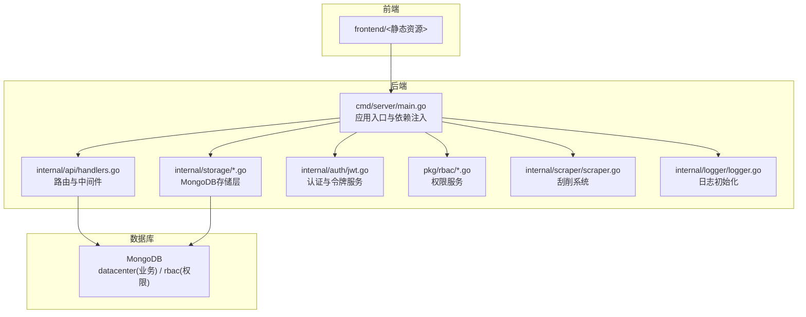
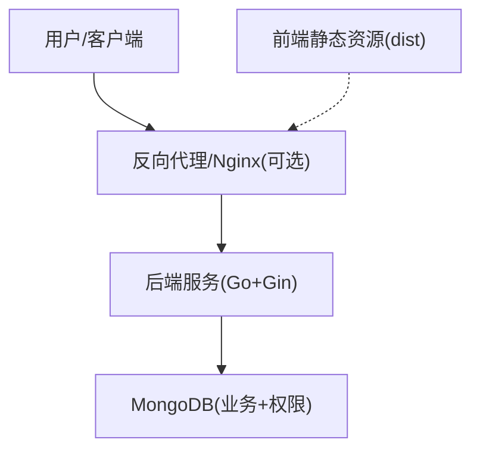
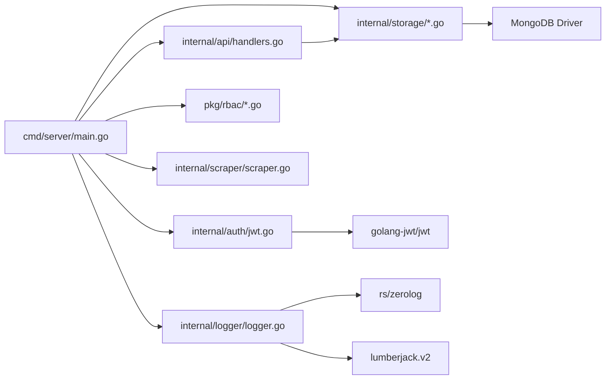

# 部署指南

<cite>
**本文引用的文件**
- [cmd/server/main.go](file://cmd/server/main.go)
- [configs/config.yaml](file://configs/config.yaml)
- [go.mod](file://go.mod)
- [internal/storage/mongodb.go](file://internal/storage/mongodb.go)
- [internal/storage/mongodb_storage.go](file://internal/storage/mongodb_storage.go)
- [internal/api/handlers.go](file://internal/api/handlers.go)
- [internal/auth/jwt.go](file://internal/auth/jwt.go)
- [pkg/rbac/rbac.go](file://pkg/rbac/rbac.go)
- [internal/models/models.go](file://internal/models/models.go)
- [internal/scraper/scraper.go](file://internal/scraper/scraper.go)
- [internal/logger/logger.go](file://internal/logger/logger.go)
- [README.md](file://README.md)
- [docs/architecture.md](file://docs/architecture.md)
- [docs/logging.md](file://docs/logging.md)
</cite>

## 目录
1. [简介](#简介)
2. [项目结构](#项目结构)
3. [核心组件](#核心组件)
4. [架构总览](#架构总览)
5. [详细组件分析](#详细组件分析)
6. [依赖分析](#依赖分析)
7. [性能考虑](#性能考虑)
8. [故障排查指南](#故障排查指南)
9. [结论](#结论)
10. [附录](#附录)

## 简介
本指南面向数据中心项目的生产环境部署，涵盖容器化与编排、负载均衡与高可用、数据库部署策略、反向代理配置、性能调优、滚动更新与回滚、以及安全加固等关键主题。文档基于仓库现有代码与文档，提供可落地的实施建议与最佳实践。

## 项目结构
项目采用后端（Go + Gin）、前端（React）与数据库（MongoDB）三层架构。后端通过环境变量驱动配置，支持日志轮转与结构化日志；数据库采用两套集合空间（业务与权限）分离的设计；RBAC权限体系贯穿API路由与集合级权限控制；刮削系统以工作池并发处理异步任务。

**图表来源**
- [cmd/server/main.go:24-150](file://cmd/server/main.go#L24-L150)
- [internal/api/handlers.go:45-181](file://internal/api/handlers.go#L45-L181)
- [internal/storage/mongodb_storage.go:27-51](file://internal/storage/mongodb_storage.go#L27-L51)
- [internal/auth/jwt.go:35-41](file://internal/auth/jwt.go#L35-L41)
- [pkg/rbac/rbac.go:59-61](file://pkg/rbac/rbac.go#L59-L61)
- [internal/scraper/scraper.go:34-45](file://internal/scraper/scraper.go#L34-L45)
- [internal/logger/logger.go:14-56](file://internal/logger/logger.go#L14-L56)

**章节来源**
- [README.md:22-41](file://README.md#L22-L41)
- [docs/architecture.md:799-821](file://docs/architecture.md#L799-L821)

## 核心组件
- 应用入口与依赖注入：加载环境变量、初始化日志、建立业务与权限数据库连接、启动刮削系统、初始化JWT与RBAC服务、注册路由并启动HTTP服务器。
- API处理器：基于Gin注册受控路由，结合全局与集合级权限中间件，实现细粒度访问控制。
- 存储层：统一抽象接口，MongoDB实现负责用户、权限、角色、集合、业务数据、刮削任务等CRUD与索引管理。
- 认证与授权：JWT令牌签发与校验，配合RBAC服务判断用户权限。
- 刮削系统：工作池并发处理异步任务，支持提交、执行、状态更新与结果落库。
- 日志系统：zerolog结构化日志，lumberjack轮转，区分应用日志与HTTP日志。

**章节来源**
- [cmd/server/main.go:32-150](file://cmd/server/main.go#L32-L150)
- [internal/api/handlers.go:33-181](file://internal/api/handlers.go#L33-L181)
- [internal/storage/mongodb.go:14-90](file://internal/storage/mongodb.go#L14-L90)
- [internal/storage/mongodb_storage.go:27-800](file://internal/storage/mongodb_storage.go#L27-L800)
- [internal/auth/jwt.go:28-126](file://internal/auth/jwt.go#L28-L126)
- [pkg/rbac/rbac.go:55-250](file://pkg/rbac/rbac.go#L55-L250)
- [internal/scraper/scraper.go:18-289](file://internal/scraper/scraper.go#L18-L289)
- [internal/logger/logger.go:14-62](file://internal/logger/logger.go#L14-L62)

## 架构总览
生产部署推荐采用“反向代理/Nginx + 后端服务 + MongoDB”的三层架构。前端静态资源可由Nginx提供，后端服务通过健康检查与优雅停机保障高可用。

**图表来源**
- [docs/architecture.md:799-821](file://docs/architecture.md#L799-L821)

## 详细组件分析

### 容器化与编排（Docker/Kubernetes）
- 镜像构建
  - 基础镜像选择：建议使用官方gcr.io/distroless/static或alpine精简基础镜像，减少攻击面。
  - 构建步骤：在CI中执行go build生成二进制，复制至只读根文件系统，设置非root用户与最小权限。
  - 健康检查：在容器内暴露HTTP健康端点（如/health），Kubernetes readinessProbe/livenessProbe基于该端点。
- 环境变量配置
  - 必需变量：MONGODB_URI、MONGODB_DATABASE、JWT_SECRET、JWT_EXPIRATION、LOG_LEVEL、LOG_HTTP_FILE、SERVER_HOST、SERVER_PORT、SCRAPER_WORKERS。
  - 参考路径：[cmd/server/main.go:42-126](file://cmd/server/main.go#L42-L126)，[configs/config.yaml:1-26](file://configs/config.yaml#L1-L26)，[README.md:50-63](file://README.md#L50-L63)。
- Kubernetes部署要点
  - Deployment：副本数≥2，设置滚动更新策略（maxUnavailable=0，maxSurge=1），资源requests/limits合理分配。
  - Service：ClusterIP，暴露8080端口。
  - Ingress：TLS终止于Ingress控制器，配置证书与域名映射。
  - ConfigMap/Secret：分离配置与敏感信息，避免硬编码。
  - Pod安全：nonRoot=true、readOnlyRootFilesystem=true、allowPrivilegeEscalation=false。
- 参考文件
  - [go.mod:5-14](file://go.mod#L5-L14)（依赖与版本约束）

**章节来源**
- [cmd/server/main.go:42-126](file://cmd/server/main.go#L42-L126)
- [configs/config.yaml:1-26](file://configs/config.yaml#L1-L26)
- [README.md:50-63](file://README.md#L50-L63)
- [go.mod:5-14](file://go.mod#L5-L14)

### 数据库部署策略（MongoDB）
- 集群与副本集
  - 生产建议使用副本集（至少3节点）或MongoDB Atlas，启用自动故障转移与备份。
  - 分离业务与权限数据库：业务库datacenter与权限库rbac分别部署，降低耦合。
- 索引与性能
  - 业务数据集合按模块动态创建，建议在常用查询字段上建立复合索引。
  - 参考存储层索引创建接口：[internal/storage/mongodb_storage.go:71-78](file://internal/storage/mongodb_storage.go#L71-L78)。
- 备份与恢复
  - 使用mongodump/mongorestore或Atlas备份策略，定期全量+增量备份。
  - 恢复演练：在隔离环境验证备份完整性与恢复时间目标（RTO/RPO）。
- 监控
  - 使用MongoDB自带监控或第三方工具（如Prometheus+Grafana），关注慢查询、连接数、磁盘与内存指标。
- 参考文件
  - [internal/storage/mongodb_storage.go:27-51](file://internal/storage/mongodb_storage.go#L27-L51)

**章节来源**
- [internal/storage/mongodb_storage.go:27-51](file://internal/storage/mongodb_storage.go#L27-L51)

### 反向代理配置（Nginx/Traefik）
- Nginx
  - 静态资源托管：将frontend/dist作为静态站点，开启gzip与缓存。
  - SSL终止：配置证书与TLS 1.3，启用HSTS。
  - 负载均衡：后端多副本，健康检查基于/health。
- Traefik
  - 自动发现：通过注解或文件提供者对接Kubernetes，自动配置路由与证书。
  - 中间件：限流、重写、压缩等。
- 参考架构图
  - [docs/architecture.md:799-821](file://docs/architecture.md#L799-L821)

**章节来源**
- [docs/architecture.md:799-821](file://docs/architecture.md#L799-L821)

### 性能调优
- 内存与CPU
  - 设置合理的requests/limits，避免内存压力导致GC频繁；根据并发场景调整SCRAPER_WORKERS。
  - 参考：[cmd/server/main.go:65-69](file://cmd/server/main.go#L65-L69)。
- 网络优化
  - 后端与MongoDB同可用区部署，缩短RTT；使用连接池与超时配置（ReadTimeout/WriteTimeout）。
  - 参考：[cmd/server/main.go:121-126](file://cmd/server/main.go#L121-L126)。
- 日志与I/O
  - 使用lumberjack轮转，控制单文件大小与保留天数，避免磁盘打满。
  - 参考：[internal/logger/logger.go:14-56](file://internal/logger/logger.go#L14-L56)，[docs/logging.md:44-53](file://docs/logging.md#L44-L53)。

**章节来源**
- [cmd/server/main.go:65-69](file://cmd/server/main.go#L65-L69)
- [cmd/server/main.go:121-126](file://cmd/server/main.go#L121-L126)
- [internal/logger/logger.go:14-56](file://internal/logger/logger.go#L14-L56)
- [docs/logging.md:44-53](file://docs/logging.md#L44-L53)

### 滚动更新与回滚
- 滚动更新
  - K8s Deployment：maxUnavailable=0，maxSurge=1，结合Readiness探针确保流量只切换到就绪实例。
  - 后端优雅停机：接收SIGTERM后，等待未完成请求处理完毕再退出。
  - 参考：[cmd/server/main.go:138-149](file://cmd/server/main.go#L138-L149)。
- 回滚
  - 通过kubectl rollout undo快速回滚至上一版本；结合金丝雀发布逐步扩大流量。
- 参考文件
  - [cmd/server/main.go:138-149](file://cmd/server/main.go#L138-L149)

**章节来源**
- [cmd/server/main.go:138-149](file://cmd/server/main.go#L138-L149)

### 安全加固
- 网络安全
  - 仅开放必要端口（8080），使用NetworkPolicy限制入站/出站；Ingress启用WAF与速率限制。
- 访问控制
  - RBAC：严格遵循最小权限原则；系统管理员角色用于运维场景。
  - 参考：[pkg/rbac/rbac.go:12-53](file://pkg/rbac/rbac.go#L12-L53)。
- 数据加密
  - TLS终止于Ingress或Nginx；JWT密钥使用强随机值并妥善保管；MongoDB启用传输加密与身份认证。
- 参考文件
  - [pkg/rbac/rbac.go:12-53](file://pkg/rbac/rbac.go#L12-L53)

**章节来源**
- [pkg/rbac/rbac.go:12-53](file://pkg/rbac/rbac.go#L12-L53)

## 依赖分析
后端依赖清晰，核心外部库包括Gin Web框架、MongoDB驱动、JWT库与日志库。模块间通过接口解耦，便于替换与扩展。

**图表来源**
- [go.mod:5-14](file://go.mod#L5-L14)
- [cmd/server/main.go:13-21](file://cmd/server/main.go#L13-L21)

**章节来源**
- [go.mod:5-14](file://go.mod#L5-L14)

## 性能考虑
- 并发与资源
  - 刮削系统工作池规模与CPU核数匹配，避免过度竞争；为后端Pod设置CPU/内存requests/limits。
- I/O与存储
  - MongoDB使用SSD与合适的索引策略；日志文件轮转避免I/O抖动。
- 网络
  - 后端与数据库同VPC/Zone，减少跨区域延迟；合理设置超时与重试退避。

## 故障排查指南
- 启动失败
  - 检查环境变量与配置文件；查看日志目录与权限；确认MongoDB连接可达。
  - 参考：[cmd/server/main.go:25-28](file://cmd/server/main.go#L25-L28)，[internal/logger/logger.go:14-56](file://internal/logger/logger.go#L14-L56)。
- 权限问题
  - 核对RBAC权限码与用户角色；确认中间件链路是否生效。
  - 参考：[pkg/rbac/rbac.go:63-99](file://pkg/rbac/rbac.go#L63-L99)，[internal/api/handlers.go:260-293](file://internal/api/handlers.go#L260-L293)。
- 刮削异常
  - 检查任务状态更新与Python执行器路径；查看日志定位错误。
  - 参考：[internal/scraper/scraper.go:123-193](file://internal/scraper/scraper.go#L123-L193)。

**章节来源**
- [cmd/server/main.go:25-28](file://cmd/server/main.go#L25-L28)
- [internal/logger/logger.go:14-56](file://internal/logger/logger.go#L14-L56)
- [pkg/rbac/rbac.go:63-99](file://pkg/rbac/rbac.go#L63-L99)
- [internal/api/handlers.go:260-293](file://internal/api/handlers.go#L260-L293)
- [internal/scraper/scraper.go:123-193](file://internal/scraper/scraper.go#L123-L193)

## 结论
本指南基于仓库现有代码与文档，给出了生产环境部署的完整路线图：容器化与编排、高可用与负载均衡、数据库集群与备份、反向代理与安全加固、性能调优与滚动回滚策略。建议在预生产环境先行演练，再逐步推广至生产。

## 附录
- 环境变量清单与默认值参考：[README.md:50-63](file://README.md#L50-L63)，[configs/config.yaml:1-26](file://configs/config.yaml#L1-L26)，[cmd/server/main.go:42-126](file://cmd/server/main.go#L42-L126)
- API路由与权限中间件参考：[internal/api/handlers.go:45-181](file://internal/api/handlers.go#L45-L181)
- 数据模型与字段校验参考：[internal/models/models.go:51-221](file://internal/models/models.go#L51-L221)