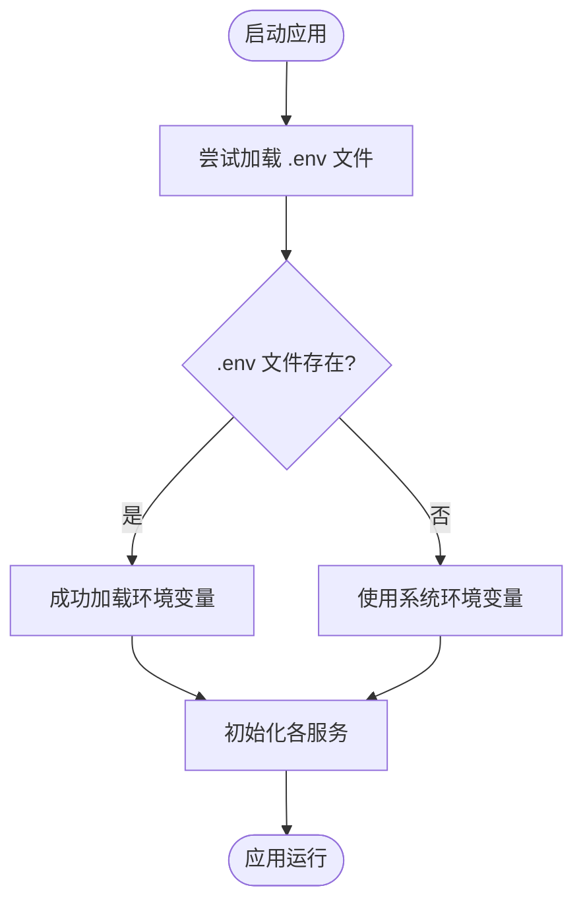
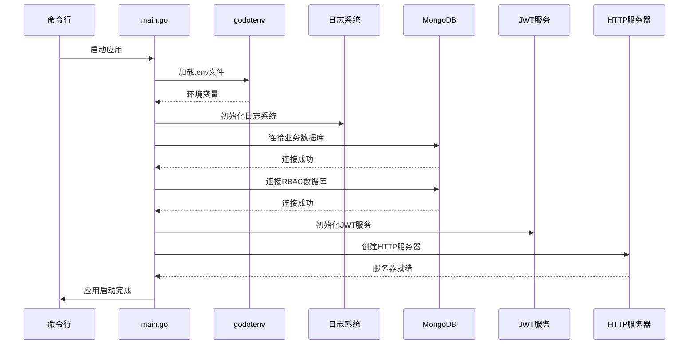

# 快速开始

<cite>
**本文引用的文件**
- [README.md](file://README.md)
- [cmd/server/main.go](file://cmd/server/main.go)
- [configs/config.yaml](file://configs/config.yaml)
- [frontend/package.json](file://frontend/package.json)
- [frontend/src/services/api.ts](file://frontend/src/services/api.ts)
- [frontend/vite.config.ts](file://frontend/vite.config.ts)
- [internal/auth/jwt.go](file://internal/auth/jwt.go)
- [internal/logger/logger.go](file://internal/logger/logger.go)
- [internal/storage/mongodb.go](file://internal/storage/mongodb.go)
- [docs/architecture.md](file://docs/architecture.md)
- [docs/code_structure.md](file://docs/code_structure.md)
- [go.mod](file://go.mod)
</cite>

## 目录
1. [简介](#简介)
2. [环境要求](#环境要求)
3. [环境搭建步骤](#环境搭建步骤)
4. [环境变量配置](#环境变量配置)
5. [后端启动流程](#后端启动流程)
6. [前端启动流程](#前端启动流程)
7. [默认访问地址](#默认访问地址)
8. [初始配置说明](#初始配置说明)
9. [常见问题排查](#常见问题排查)
10. [性能优化建议](#性能优化建议)

## 简介

数据中心系统是一个基于Go和React的企业级数据管理平台，提供用户认证、RBAC权限管理、业务数据管理和数据刮削等功能。系统采用现代化的技术栈，包括Go 1.20+、MongoDB 4.4+、React 18+等核心技术。

## 环境要求

### 后端环境要求
- **Go语言**: 1.20+ (项目使用Go 1.20)
- **数据库**: MongoDB 4.4+ (支持副本集和分片)
- **操作系统**: Linux/Windows/macOS

### 前端环境要求
- **Node.js**: 16+ (推荐使用LTS版本)
- **包管理器**: npm或yarn
- **操作系统**: Linux/Windows/macOS

### 开发工具
- Git版本控制
- IDE或文本编辑器
- MongoDB客户端工具

**章节来源**
- [go.mod:3](file://go.mod#L3)
- [README.md:45-47](file://README.md#L45-L47)
- [README.md:108-110](file://README.md#L108-L110)

## 环境搭建步骤

### MongoDB数据库搭建

1. **安装MongoDB 4.4+**
   ```bash
   # Ubuntu/Debian
   sudo apt-get install mongodb
   
   # CentOS/RHEL/Fedora
   sudo yum install mongodb-server
   
   # macOS
   brew install mongodb-community
   
   # Windows
   choco install mongodb
   ```

2. **启动MongoDB服务**
   ```bash
   # Linux
   sudo systemctl start mongod
   
   # macOS
   brew services start mongodb-community
   
   # Windows
   net start MongoDB
   ```

3. **验证MongoDB连接**
   ```bash
   mongo --host localhost --port 27017
   ```

### Go后端环境配置

1. **安装Go 1.20+**
   ```bash
   # 下载Go 1.20+安装包
   wget https://go.dev/dl/go1.20.10.linux-amd64.tar.gz
   
   # 解压到/usr/local
   sudo tar -C /usr/local -xzf go1.20.10.linux-amd64.tar.gz
   
   # 设置环境变量
   export PATH=$PATH:/usr/local/go/bin
   ```

2. **验证Go安装**
   ```bash
   go version
   ```

### Node.js前端环境配置

1. **安装Node.js 16+**
   ```bash
   # 使用nvm推荐
   curl -o- https://raw.githubusercontent.com/nvm-sh/nvm/v0.39.0/install.sh | bash
   nvm install 16
   nvm use 16
   
   # 或直接下载安装包
   wget https://nodejs.org/dist/v16.20.2/node-v16.20.2-linux-x64.tar.xz
   ```

2. **验证Node.js安装**
   ```bash
   node --version
   npm --version
   ```

**章节来源**
- [README.md:45-47](file://README.md#L45-L47)
- [README.md:108-110](file://README.md#L108-L110)

## 环境变量配置

### 创建.env文件

在项目根目录创建`.env`文件，配置以下关键参数：

```env
# 数据库配置
MONGODB_URI=mongodb://localhost:27017
MONGODB_DATABASE=datacenter
MONGODB_RBAC_URI=mongodb://localhost:27017  
MONGODB_RBAC_DATABASE=rbac

# JWT认证配置
JWT_SECRET=your-super-secret-key-here
JWT_EXPIRATION=24
JWT_REFRESH_EXPIRATION=720

# 日志配置
LOG_LEVEL=info
LOG_HTTP_FILE=logs/http.log
LOG_MAX_SIZE=100
LOG_MAX_BACKUPS=5
LOG_MAX_AGE=30

# 服务器配置
SERVER_HOST=0.0.0.0
SERVER_PORT=8080

# 刮削系统配置
SCRAPER_WORKERS=4
```

### 环境变量详细说明

| 变量名 | 默认值 | 说明 | 数据类型 |
|--------|--------|------|----------|
| `MONGODB_URI` | mongodb://localhost:27017 | 业务数据库连接URI | 字符串 |
| `MONGODB_DATABASE` | datacenter | 业务数据库名称 | 字符串 |
| `MONGODB_RBAC_URI` | mongodb://localhost:27017 | RBAC数据库连接URI | 字符串 |
| `MONGODB_RBAC_DATABASE` | rbac | RBAC数据库名称 | 字符串 |
| `JWT_SECRET` | your-secret-key | JWT签名密钥 | 字符串 |
| `JWT_EXPIRATION` | 24 | Token有效期（小时） | 整数 |
| `JWT_REFRESH_EXPIRATION` | 720 | 刷新Token有效期（小时） | 整数 |
| `LOG_LEVEL` | info | 日志级别 | 字符串 |
| `LOG_HTTP_FILE` | logs/http.log | HTTP日志文件路径 | 字符串 |
| `LOG_MAX_SIZE` | 100 | 单个日志文件最大MB | 整数 |
| `LOG_MAX_BACKUPS` | 5 | 保留日志文件数 | 整数 |
| `LOG_MAX_AGE` | 30 | 日志保留天数 | 整数 |
| `SERVER_HOST` | 0.0.0.0 | 服务监听地址 | 字符串 |
| `SERVER_PORT` | 8080 | 服务监听端口 | 整数 |
| `SCRAPER_WORKERS` | 4 | 刮削工作协程数 | 整数 |

### 环境变量加载机制

系统通过godotenv库从.env文件加载配置，如果文件不存在则使用系统环境变量：



**图表来源**
- [cmd/server/main.go:25-28](file://cmd/server/main.go#L25-L28)

**章节来源**
- [README.md:50-63](file://README.md#L50-L63)
- [docs/architecture.md:724-742](file://docs/architecture.md#L724-L742)
- [docs/code_structure.md:221-237](file://docs/code_structure.md#L221-L237)

## 后端启动流程

### 依赖安装

1. **进入后端目录**
   ```bash
   cd cmd/server
   ```

2. **安装Go依赖**
   ```bash
   go mod tidy
   ```

### 编译构建

1. **编译所有包**
   ```bash
   go build ./...
   ```

2. **编译单个包**
   ```bash
   go build cmd/server
   ```

### 服务启动

1. **直接运行**
   ```bash
   go run cmd/server/main.go
   ```

2. **使用构建后的二进制文件**
   ```bash
   ./cmd/server
   ```

### 后端启动序列图



**图表来源**
- [cmd/server/main.go:24-150](file://cmd/server/main.go#L24-L150)

**章节来源**
- [README.md:65-76](file://README.md#L65-L76)
- [cmd/server/main.go:24-150](file://cmd/server/main.go#L24-L150)

## 前端启动流程

### 依赖安装

1. **进入前端目录**
   ```bash
   cd frontend
   ```

2. **安装依赖包**
   ```bash
   npm install
   # 或使用yarn
   yarn install
   ```

### 开发环境启动

1. **启动开发服务器**
   ```bash
   npm run dev
   # 或使用yarn
   yarn dev
   ```

2. **访问开发环境**
   ```
   http://localhost:5173
   ```

### 生产环境构建

1. **构建生产版本**
   ```bash
   npm run build
   # 或使用yarn
   yarn build
   ```

2. **预览生产版本**
   ```bash
   npm run preview
   # 或使用yarn
   yarn preview
   ```

### 前端技术栈

| 技术 | 版本 | 用途 |
|------|------|------|
| React | 18+ | UI框架 |
| TypeScript | 5+ | 类型安全 |
| Vite | 5+ | 构建工具 |
| Ant Design | 5+ | UI组件库 |
| React Router | 6+ | 客户端路由 |
| Zustand | 4+ | 状态管理 |
| Axios | 1.6+ | HTTP客户端 |

**章节来源**
- [README.md:106-133](file://README.md#L106-L133)
- [frontend/package.json:1-29](file://frontend/package.json#L1-L29)
- [frontend/vite.config.ts:1-6](file://frontend/vite.config.ts#L1-L6)

## 默认访问地址

### 后端API地址

- **主服务地址**: `http://localhost:8080`
- **API基础路径**: `/api`
- **完整API路径**: `http://localhost:8080/api`

### 前端应用地址

- **开发环境**: `http://localhost:5173`
- **生产环境**: `http://localhost:5173` (部署后)

### API端点概览

| 功能模块 | 端点 | 方法 | 描述 |
|----------|------|------|------|
| 认证 | `/api/auth/login` | POST | 用户登录 |
| 用户管理 | `/api/users` | GET/POST/PUT/DELETE | 用户CRUD操作 |
| 权限管理 | `/api/permissions` | GET/POST/PUT/DELETE | 权限CRUD操作 |
| 角色管理 | `/api/roles` | GET/POST/PUT/DELETE | 角色CRUD操作 |
| 业务数据 | `/api/business` | GET/POST/PUT/DELETE | 业务数据CRUD操作 |
| 数据查询 | `/api/query` | POST | JQL查询接口 |
| 集合管理 | `/api/collections` | GET/POST/PUT/DELETE | 动态集合管理 |
| 刮削任务 | `/api/scraper/tasks` | GET/POST/DELETE | 刮削任务管理 |

**章节来源**
- [README.md:78-105](file://README.md#L78-L105)

## 初始配置说明

### 默认数据库配置

系统默认使用以下数据库配置：
- **业务数据库**: `datacenter`
- **RBAC数据库**: `rbac`
- **默认集合**: 用户、角色、权限、业务数据等

### JWT默认配置

- **默认密钥**: `your-secret-key`
- **访问令牌过期**: 24小时
- **刷新令牌过期**: 720小时
- **签名算法**: HS256

### 日志系统配置

- **日志级别**: `info`
- **日志文件**: `logs/app.log`
- **HTTP日志**: `logs/http.log`
- **轮转策略**: 最大100MB，保留5个备份，保存30天

### 刮削系统配置

- **默认工作协程**: 4个
- **队列缓冲区**: 1000个任务
- **并发处理**: 异步任务队列

**章节来源**
- [configs/config.yaml:1-26](file://configs/config.yaml#L1-L26)
- [internal/auth/jwt.go:35-41](file://internal/auth/jwt.go#L35-L41)
- [internal/logger/logger.go:14-56](file://internal/logger/logger.go#L14-L56)
- [docs/architecture.md:575](file://docs/architecture.md#L575)

## 常见问题排查

### MongoDB连接问题

**问题**: 连接MongoDB失败
**解决方法**:
1. 检查MongoDB服务状态
   ```bash
   sudo systemctl status mongod
   ```

2. 验证连接URI格式
   ```bash
   mongo mongodb://localhost:27017/datacenter
   ```

3. 检查防火墙设置
   ```bash
   sudo ufw allow 27017
   ```

### JWT认证问题

**问题**: JWT令牌验证失败
**解决方法**:
1. 确认JWT密钥一致
   ```bash
   echo $JWT_SECRET
   ```

2. 检查令牌过期时间
   ```bash
   # 验证令牌
   jwt.io
   ```

3. 重新生成令牌
   ```bash
   # 清除旧令牌，重新登录
   ```

### 端口冲突问题

**问题**: 端口被占用
**解决方法**:
1. 查找占用进程
   ```bash
   lsof -i :8080
   netstat -ano | findstr :8080
   ```

2. 修改端口配置
   ```env
   SERVER_PORT=8081
   ```

3. 释放端口
   ```bash
   kill -9 PID
   ```

### 日志文件问题

**问题**: 日志文件无法写入
**解决方法**:
1. 检查日志目录权限
   ```bash
   ls -la logs/
   chmod 755 logs/
   ```

2. 验证磁盘空间
   ```bash
   df -h
   ```

3. 检查文件系统权限
   ```bash
   sudo chown -R $(whoami) logs/
   ```

### 前端代理问题

**问题**: 前端无法访问后端API
**解决方法**:
1. 检查API地址配置
   ```javascript
   // frontend/src/services/api.ts
   baseURL: 'http://localhost:9003'
   ```

2. 配置CORS支持
   ```go
   // 后端CORS中间件
   c.Writer.Header().Set("Access-Control-Allow-Origin", "*")
   ```

3. 检查网络连通性
   ```bash
   curl http://localhost:8080/api/auth/login
   ```

### 性能问题

**问题**: 系统响应缓慢
**解决方法**:
1. 增加刮削工作协程数
   ```env
   SCRAPER_WORKERS=8
   ```

2. 优化数据库索引
   ```javascript
   // 在MongoDB中创建索引
   db.collection.createIndex({field: 1})
   ```

3. 调整日志级别
   ```env
   LOG_LEVEL=warn
   ```

**章节来源**
- [README.md:164-177](file://README.md#L164-L177)
- [internal/logger/logger.go:14-56](file://internal/logger/logger.go#L14-L56)

## 性能优化建议

### 数据库优化

1. **索引优化**
   - 为常用查询字段创建索引
   - 使用复合索引优化复杂查询
   - 定期分析查询执行计划

2. **连接池配置**
   - 调整MongoDB连接池大小
   - 启用连接复用
   - 设置合理的超时时间

### 应用性能优化

1. **并发处理**
   - 根据CPU核心数调整SCRAPER_WORKERS
   - 使用goroutine池限制并发
   - 实施背压机制

2. **缓存策略**
   - 实现Redis缓存层
   - 缓存热点数据
   - 设置合理的过期时间

### 监控和调试

1. **性能监控**
   - 启用详细的日志记录
   - 监控关键指标
   - 设置告警阈值

2. **内存管理**
   - 定期检查内存泄漏
   - 优化数据结构
   - 实施垃圾回收策略

### 安全加固

1. **访问控制**
   - 实施IP白名单
   - 启用HTTPS
   - 配置防火墙规则

2. **数据保护**
   - 启用数据库加密
   - 实施备份策略
   - 配置审计日志

**章节来源**
- [docs/architecture.md:575](file://docs/architecture.md#L575)
- [internal/storage/mongodb.go:14-90](file://internal/storage/mongodb.go#L14-L90)