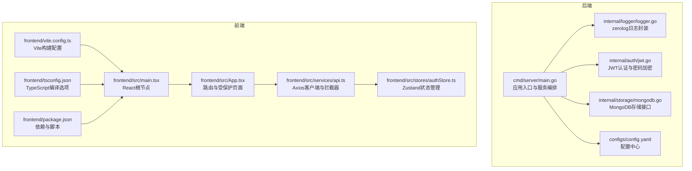
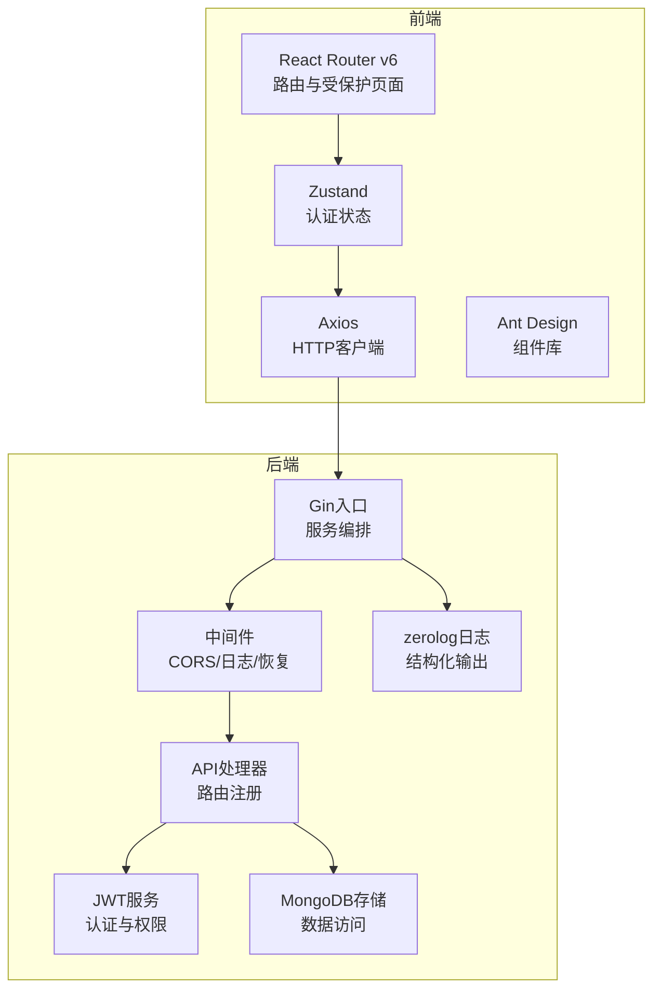
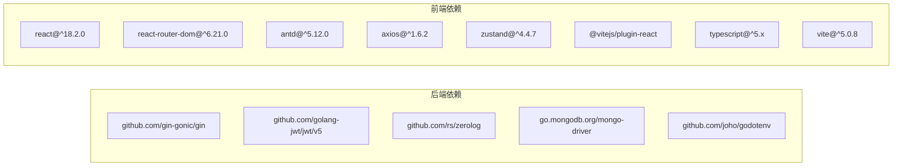

# 技术栈

<cite>
**本文引用的文件列表**
- [go.mod](file://go.mod)
- [cmd/server/main.go](file://cmd/server/main.go)
- [internal/logger/logger.go](file://internal/logger/logger.go)
- [internal/auth/jwt.go](file://internal/auth/jwt.go)
- [internal/storage/mongodb.go](file://internal/storage/mongodb.go)
- [configs/config.yaml](file://configs/config.yaml)
- [frontend/package.json](file://frontend/package.json)
- [frontend/vite.config.ts](file://frontend/vite.config.ts)
- [frontend/tsconfig.json](file://frontend/tsconfig.json)
- [frontend/src/main.tsx](file://frontend/src/main.tsx)
- [frontend/src/App.tsx](file://frontend/src/App.tsx)
- [frontend/src/services/api.ts](file://frontend/src/services/api.ts)
- [frontend/src/stores/authStore.ts](file://frontend/src/stores/authStore.ts)
- [README.md](file://README.md)
</cite>

## 目录
1. [引言](#引言)
2. [项目结构](#项目结构)
3. [核心组件](#核心组件)
4. [架构总览](#架构总览)
5. [详细组件分析](#详细组件分析)
6. [依赖分析](#依赖分析)
7. [性能考量](#性能考量)
8. [故障排查指南](#故障排查指南)
9. [结论](#结论)
10. [附录](#附录)

## 引言
本技术栈文档面向数据中心项目，系统化阐述后端与前端的技术选型与实现要点，重点包括：
- 后端：Go 1.20+ 的高性能与并发优势、Gin 轻量级 Web 框架、MongoDB 的灵活可扩展性、JWT 认证的安全性、zerolog 日志系统的高效性。
- 前端：React 18 + TypeScript 的现代开发体验、Vite 的快速构建与热更新、Ant Design 的丰富 UI 组件库、Axios 的 HTTP 客户端能力、React Router v6 的路由管理、Zustand 的简洁状态管理。

通过本文件，读者可以理解每项技术的选择原因、带来的收益，以及整体技术组合如何协同提升开发效率、系统稳定性与可维护性。

## 项目结构
项目采用前后端分离架构，后端以 Go 为核心，提供 REST API；前端以 React 18 为基础，使用 TypeScript、Vite、Ant Design、Axios、React Router v6、Zustand 构建现代化交互体验。配置文件集中于 configs 目录，便于统一管理环境变量与运行参数。

图表来源
- [cmd/server/main.go:1-167](file://cmd/server/main.go#L1-L167)
- [internal/logger/logger.go:1-89](file://internal/logger/logger.go#L1-L89)
- [internal/auth/jwt.go:1-126](file://internal/auth/jwt.go#L1-L126)
- [internal/storage/mongodb.go:1-91](file://internal/storage/mongodb.go#L1-L91)
- [configs/config.yaml:1-26](file://configs/config.yaml#L1-L26)
- [frontend/src/main.tsx:1-10](file://frontend/src/main.tsx#L1-L10)
- [frontend/src/App.tsx:1-69](file://frontend/src/App.tsx#L1-L69)
- [frontend/src/services/api.ts:1-37](file://frontend/src/services/api.ts#L1-L37)
- [frontend/src/stores/authStore.ts:1-61](file://frontend/src/stores/authStore.ts#L1-L61)
- [frontend/vite.config.ts:1-6](file://frontend/vite.config.ts#L1-L6)
- [frontend/tsconfig.json:1-21](file://frontend/tsconfig.json#L1-L21)
- [frontend/package.json:1-29](file://frontend/package.json#L1-L29)

章节来源
- [README.md:22-41](file://README.md#L22-L41)

## 核心组件
- 后端核心
  - 应用入口与服务编排：负责环境变量加载、日志初始化、存储连接、RBAC 初始化、刮削系统启动、JWT 服务、路由注册与 HTTP 服务器启动。
  - 日志系统：基于 zerolog 与 lumberjack 实现结构化日志与滚动日志文件，支持多级别日志输出与调用者信息。
  - 认证与授权：JWT 服务提供令牌签发、校验、刷新；bcrypt 实现密码加密；RBAC 服务与存储配合实现权限控制。
  - 存储层：抽象出通用 Storage 接口，覆盖用户、字段定义、业务数据、已删除数据、权限、角色、刮削任务、集合等多类资源。
- 前端核心
  - React 18 + TypeScript：严格的类型约束与现代 React 特性，提升开发体验与代码质量。
  - Vite：快速开发与构建，热更新与按需编译。
  - Ant Design：丰富的 UI 组件与主题体系，加速界面开发。
  - Axios：统一的 HTTP 客户端，支持请求/响应拦截器，自动注入鉴权头与统一 401 处理。
  - React Router v6：嵌套路由与受保护路由，结合懒加载与 Suspense 提升首屏性能。
  - Zustand：轻量状态管理，简化全局状态逻辑，避免样板代码。

章节来源
- [cmd/server/main.go:24-150](file://cmd/server/main.go#L24-L150)
- [internal/logger/logger.go:14-56](file://internal/logger/logger.go#L14-L56)
- [internal/auth/jwt.go:20-41](file://internal/auth/jwt.go#L20-L41)
- [internal/storage/mongodb.go:14-90](file://internal/storage/mongodb.go#L14-L90)
- [frontend/src/App.tsx:19-31](file://frontend/src/App.tsx#L19-L31)
- [frontend/src/services/api.ts:5-37](file://frontend/src/services/api.ts#L5-L37)
- [frontend/src/stores/authStore.ts:15-61](file://frontend/src/stores/authStore.ts#L15-L61)

## 架构总览
后端采用模块化分层：入口层负责初始化与编排，API 层处理路由与控制器，认证层提供 JWT 与中间件，存储层对接 MongoDB，日志层贯穿全链路。前端通过 Axios 与后端 API 通信，Zustand 管理认证状态，React Router v6 控制页面导航，Ant Design 提供一致的 UI 体验。

图表来源
- [cmd/server/main.go:94-119](file://cmd/server/main.go#L94-L119)
- [internal/logger/logger.go:14-56](file://internal/logger/logger.go#L14-L56)
- [internal/auth/jwt.go:20-41](file://internal/auth/jwt.go#L20-L41)
- [internal/storage/mongodb.go:14-90](file://internal/storage/mongodb.go#L14-L90)
- [frontend/src/services/api.ts:5-37](file://frontend/src/services/api.ts#L5-L37)
- [frontend/src/App.tsx:19-31](file://frontend/src/App.tsx#L19-L31)
- [frontend/src/stores/authStore.ts:15-61](file://frontend/src/stores/authStore.ts#L15-L61)

## 详细组件分析

### 后端技术栈详解

#### Go 1.20+ 性能与并发优势
- 选择理由
  - 高性能与低开销：GC 更高效、并发调度优化，适合高吞吐 API 场景。
  - 并发原语完善：goroutine + channel 便于构建异步与工作池模式。
  - 生态成熟：社区与工具链完善，部署简单。
- 在项目中的体现
  - 刮削系统以工作池并发执行任务，提升吞吐。
  - Gin 的高性能路由与上下文处理，满足高 QPS 场景。
  - 结构化日志与优雅关闭，保障生产稳定性。

章节来源
- [cmd/server/main.go:65-69](file://cmd/server/main.go#L65-L69)
- [go.mod:3](file://go.mod#L3)

#### Gin 轻量级 Web 框架
- 选择理由
  - 轻量、专注：不强制模板引擎或 ORM，便于按需集成。
  - 高性能：路由树与上下文优化，适合微服务与 API 网关。
  - 中间件生态：CORS、日志、恢复等中间件可插拔。
- 在项目中的体现
  - 入口处设置 ReleaseMode，启用自定义 CORS、日志与恢复中间件。
  - 注册路由并统一处理超时与优雅关闭。

章节来源
- [cmd/server/main.go:97-119](file://cmd/server/main.go#L97-L119)

#### MongoDB 数据库的灵活性与可扩展性
- 选择理由
  - 文档模型灵活：适配业务数据的动态字段与多变结构。
  - 水平扩展：副本集与分片支持高可用与横向扩展。
  - 丰富的查询与索引：支持复杂查询与聚合。
- 在项目中的体现
  - 抽象 Storage 接口，覆盖用户、权限、角色、业务数据、刮削任务等多实体。
  - 支持动态集合与索引创建，满足不同模块的数据组织需求。

章节来源
- [internal/storage/mongodb.go:14-90](file://internal/storage/mongodb.go#L14-L90)

#### JWT 认证的安全性
- 选择理由
  - 无状态：服务端无需保存会话，利于水平扩展。
  - 可控生命周期：支持短期访问令牌与较长刷新令牌。
  - 标准化：广泛支持与工具链。
- 在项目中的体现
  - Claims 包含用户 ID、角色、权限与标准声明。
  - 支持令牌签发、校验与刷新，包含过期与刷新窗口控制。
  - 密码使用 bcrypt 加密存储，防止明文泄露。

章节来源
- [internal/auth/jwt.go:12-41](file://internal/auth/jwt.go#L12-L41)
- [internal/auth/jwt.go:68-111](file://internal/auth/jwt.go#L68-L111)
- [internal/auth/jwt.go:113-125](file://internal/auth/jwt.go#L113-L125)

#### zerolog 日志系统的高效性
- 选择理由
  - 零分配日志：结构化日志写入性能优异。
  - 多级输出：支持控制台与文件输出，结合 lumberjack 实现滚动日志。
  - 调用者信息：便于定位问题。
- 在项目中的体现
  - 初始化 HTTP 与应用日志，支持多级别切换与时间格式标准化。
  - 中间件与业务代码统一使用 Logger 输出。

章节来源
- [internal/logger/logger.go:14-56](file://internal/logger/logger.go#L14-L56)
- [cmd/server/main.go:32-38](file://cmd/server/main.go#L32-L38)

### 前端技术栈详解

#### React 18 + TypeScript 的现代开发体验
- 选择理由
  - React 18 新特性：并发渲染、自动批处理、useId 等，提升用户体验与性能。
  - TypeScript 强类型：减少运行时错误，增强可维护性与协作效率。
- 在项目中的体现
  - 严格 tsconfig 选项，开启 noUnusedLocals/noUnusedParameters 等，保证代码质量。
  - 组件化开发，结合 Ant Design 快速搭建页面。

章节来源
- [frontend/src/main.tsx:1-10](file://frontend/src/main.tsx#L1-L10)
- [frontend/tsconfig.json:2-18](file://frontend/tsconfig.json#L2-L18)

#### Vite 构建工具的快速开发
- 选择理由
  - 极快的冷启动与热更新：显著缩短开发等待时间。
  - 原生 ESM 与按需编译：更高效的构建流程。
- 在项目中的体现
  - 默认配置仅启用 React 插件，保持最小必要配置。
  - 开发脚本与预览脚本清晰，便于本地调试。

章节来源
- [frontend/vite.config.ts:1-6](file://frontend/vite.config.ts#L1-L6)
- [frontend/package.json:6-11](file://frontend/package.json#L6-L11)

#### Ant Design 组件库的丰富 UI
- 选择理由
  - 企业级设计体系：组件完整、主题可定制、国际化支持好。
  - 与 React 生态契合：类型完善，易于集成。
- 在项目中的体现
  - 全局 ConfigProvider 应用主题配置，统一风格。
  - 页面组件复用度高，开发效率高。

章节来源
- [frontend/src/App.tsx:42-66](file://frontend/src/App.tsx#L42-L66)

#### Axios 的 HTTP 客户端能力
- 选择理由
  - 请求/响应拦截器：统一注入鉴权头与处理 401。
  - 超时与错误处理：提升网络异常场景的健壮性。
- 在项目中的体现
  - 自动从 localStorage 读取 token 注入 Authorization。
  - 401 时触发登出并跳转登录页。

章节来源
- [frontend/src/services/api.ts:5-37](file://frontend/src/services/api.ts#L5-L37)

#### React Router v6 的路由管理
- 选择理由
  - 嵌套路由与 Outlet：清晰表达页面层级关系。
  - 受保护路由：结合状态管理实现登录态校验。
  - 懒加载与 Suspense：优化首屏加载。
- 在项目中的体现
  - 使用 ProtectedRoute 校验登录态，未登录跳转登录页。
  - AdminLayout 下多子路由，支持权限控制与导航。

章节来源
- [frontend/src/App.tsx:19-31](file://frontend/src/App.tsx#L19-L31)
- [frontend/src/App.tsx:47-62](file://frontend/src/App.tsx#L47-L62)

#### Zustand 状态管理的简洁性
- 选择理由
  - 无样板代码：函数式 Store，API 简洁直观。
  - 无需 Provider 包裹：直接 import 使用，降低心智负担。
  - 与 React Hooks 协同：天然契合函数组件。
- 在项目中的体现
  - 认证状态 login/logout/checkAuth，持久化到 localStorage。
  - 作为全局状态容器，避免跨组件传递繁琐。

章节来源
- [frontend/src/stores/authStore.ts:15-61](file://frontend/src/stores/authStore.ts#L15-L61)

## 依赖分析
后端依赖通过 go.mod 明确声明，前端依赖通过 package.json 管理。两者均采用稳定版本策略，确保兼容性与安全性。

图表来源
- [go.mod:5-14](file://go.mod#L5-L14)
- [frontend/package.json:12-27](file://frontend/package.json#L12-L27)

章节来源
- [go.mod:1-50](file://go.mod#L1-L50)
- [frontend/package.json:1-29](file://frontend/package.json#L1-L29)

## 性能考量
- 后端
  - Gin 的 ReleaseMode 与中间件组合，减少不必要的开销。
  - zerolog 的零分配日志与 lumberjack 滚动日志，避免磁盘 IO 压力。
  - MongoDB 的动态集合与索引策略，结合查询优化，提升读写性能。
  - 刮削系统的工作池并发，合理设置 workers 数量，平衡 CPU 与内存占用。
- 前端
  - Vite 的按需编译与热更新，显著缩短开发等待时间。
  - React.lazy 与 Suspense 懒加载，减少首屏体积。
  - Axios 拦截器统一处理鉴权与错误，减少重复逻辑。
  - Zustand 的轻量状态管理，避免过度渲染与状态爆炸。

## 故障排查指南
- 后端
  - 环境变量缺失：入口处尝试加载 .env，若失败则回退系统变量，检查 .env 是否存在与键名正确。
  - 日志级别：根据配置文件调整 LOG_LEVEL，结合 HTTP 日志定位问题。
  - MongoDB 连接：确认 MONGODB_URI 与数据库名称，检查网络连通性。
  - JWT 过期：核对 JWT_EXPIRATION 与 REFRESH_EXPIRATION，确保刷新窗口有效。
- 前端
  - 登录态失效：401 时自动登出并跳转登录页，检查 token 是否过期或被清除。
  - 路由跳转：受保护路由未登录将跳转 /login，确认 checkAuth 是否正确执行。
  - Axios 请求：确认 baseURL 与超时设置，检查拦截器是否正确注入 Authorization。

章节来源
- [cmd/server/main.go:25-28](file://cmd/server/main.go#L25-L28)
- [configs/config.yaml:12-18](file://configs/config.yaml#L12-L18)
- [frontend/src/services/api.ts:23-35](file://frontend/src/services/api.ts#L23-L35)
- [frontend/src/App.tsx:24-29](file://frontend/src/App.tsx#L24-L29)

## 结论
本项目的技术栈组合体现了“高性能后端 + 现代前端”的最佳实践：后端以 Go 与 Gin 为核心，结合 MongoDB 与 JWT，辅以 zerolog 日志，形成稳定可靠的 API 层；前端以 React 18 + TypeScript 为基础，借助 Vite、Ant Design、Axios、React Router v6、Zustand，构建现代化、可维护的用户界面。整体方案在开发效率、系统性能与可扩展性之间取得良好平衡。

## 附录
- 环境变量与配置
  - 后端：MONGODB_URI、MONGODB_DATABASE、JWT_SECRET、JWT_EXPIRATION、LOG_LEVEL、LOG_PATH、PORT、SCRAPER_WORKERS 等。
  - 前端：开发端口、构建产物路径、TypeScript 严格模式等。
- API 端点概览
  - 认证、用户管理、权限管理、角色管理、业务数据、查询、集合管理、刮削任务等。

章节来源
- [README.md:50-63](file://README.md#L50-L63)
- [README.md:80-105](file://README.md#L80-L105)