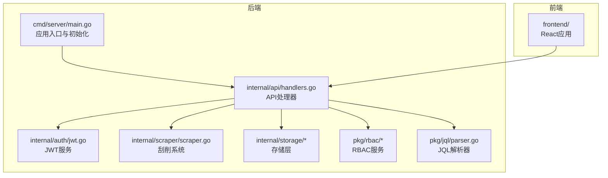
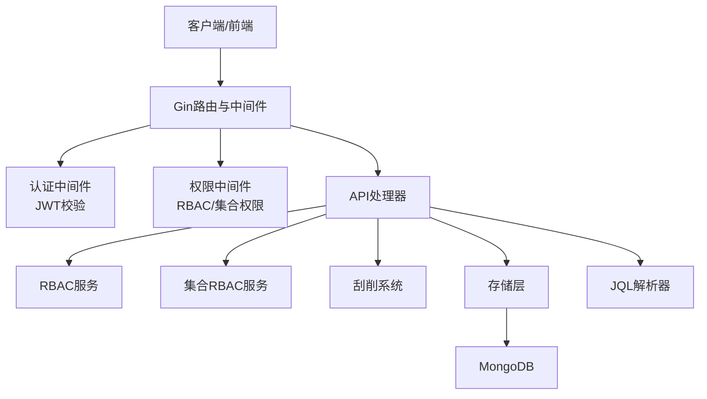
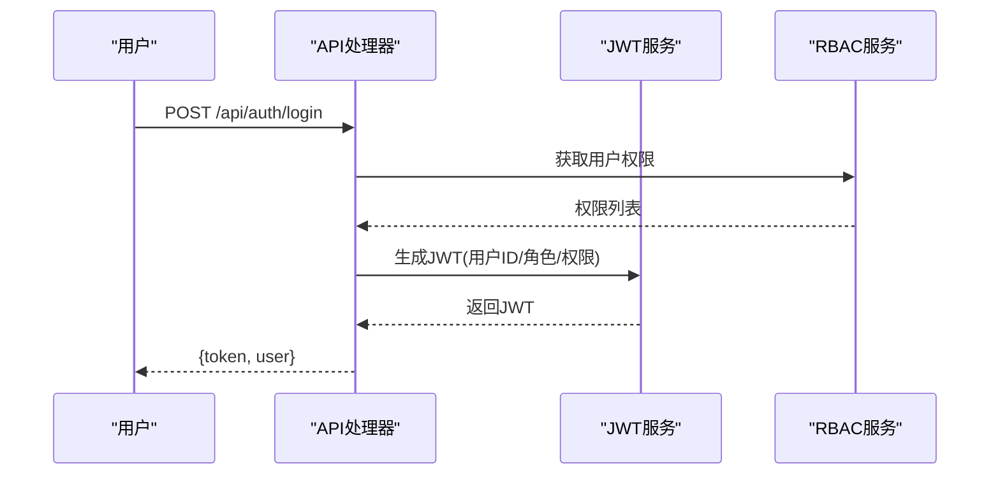
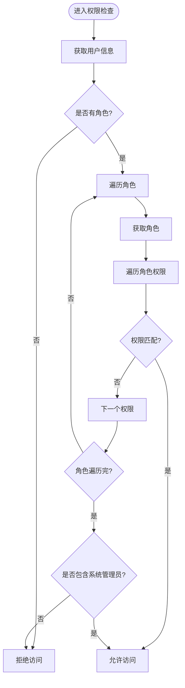
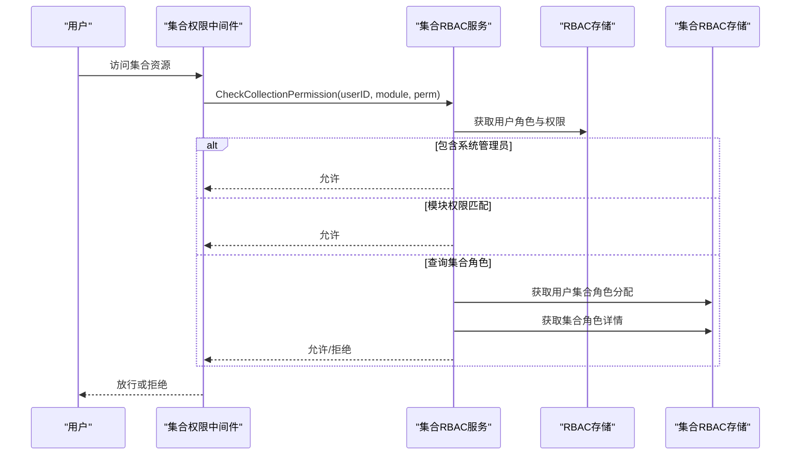
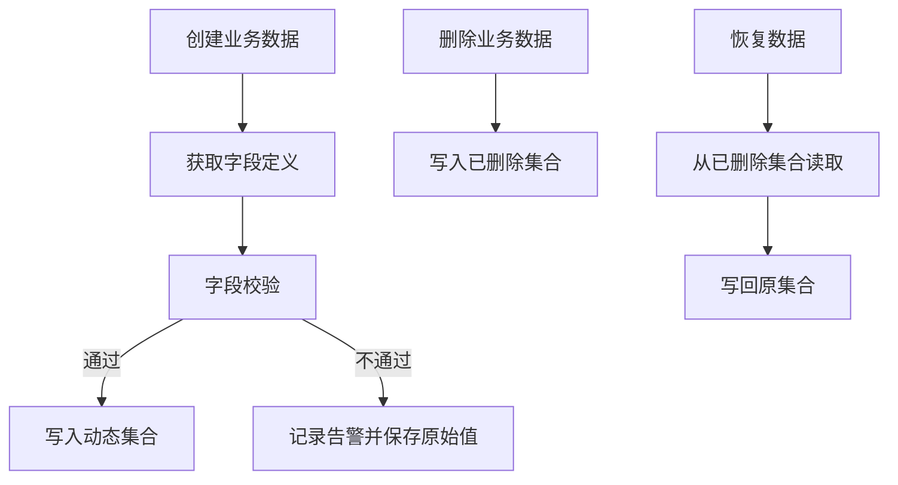
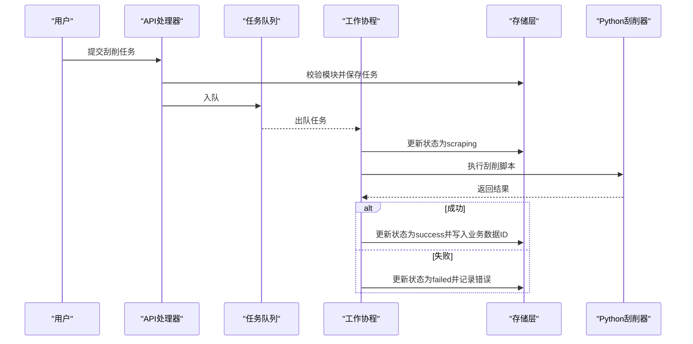
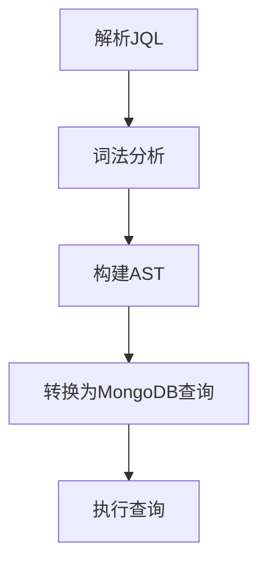
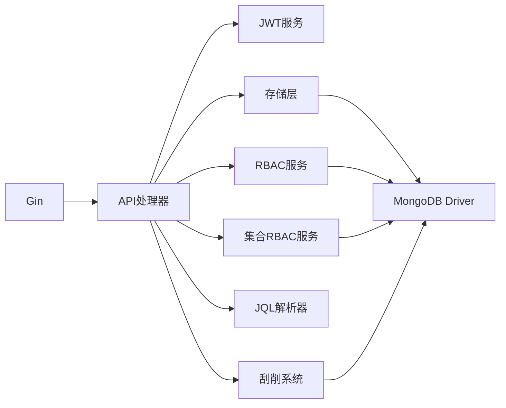

# 核心功能

<cite>
**本文引用的文件**
- [README.md](file://README.md)
- [go.mod](file://go.mod)
- [cmd/server/main.go](file://cmd/server/main.go)
- [configs/config.yaml](file://configs/config.yaml)
- [internal/api/handlers.go](file://internal/api/handlers.go)
- [internal/api/collection_permission_middleware.go](file://internal/api/collection_permission_middleware.go)
- [internal/auth/jwt.go](file://internal/auth/jwt.go)
- [internal/models/models.go](file://internal/models/models.go)
- [internal/storage/mongodb.go](file://internal/storage/mongodb.go)
- [internal/storage/mongodb_storage.go](file://internal/storage/mongodb_storage.go)
- [internal/storage/rbac_storage.go](file://internal/storage/rbac_storage.go)
- [internal/storage/collection_rbac_storage.go](file://internal/storage/collection_rbac_storage.go)
- [internal/scraper/scraper.go](file://internal/scraper/scraper.go)
- [pkg/rbac/rbac.go](file://pkg/rbac/rbac.go)
- [pkg/rbac/collection_rbac.go](file://pkg/rbac/collection_rbac.go)
- [pkg/jql/parser.go](file://pkg/jql/parser.go)
</cite>

## 目录
1. [简介](#简介)
2. [项目结构](#项目结构)
3. [核心组件](#核心组件)
4. [架构总览](#架构总览)
5. [详细组件分析](#详细组件分析)
6. [依赖分析](#依赖分析)
7. [性能考虑](#性能考虑)
8. [故障排查指南](#故障排查指南)
9. [结论](#结论)
10. [附录](#附录)

## 简介
本项目是一个基于 Go 与 React 的数据中心管理系统，提供完整的用户认证与权限控制、业务数据管理、数据刮削与查询能力。系统采用 Gin 作为 Web 框架，MongoDB 作为存储，JWT 实现无状态认证，支持 RBAC 权限模型与集合级权限扩展，并内置 JQL 查询语言以满足复杂业务查询需求。

## 项目结构
项目采用分层与按功能域组织的结构：
- cmd/server：后端入口，负责初始化日志、存储、RBAC、刮削系统与 API 路由注册
- internal：内部包，包含 API 处理器、认证、日志中间件、模型、存储层、刮削引擎等
- pkg：公共包，如 RBAC 服务与 JQL 解析器
- configs：配置文件（YAML）
- frontend：React 前端应用
- docs：项目文档

**图表来源**
- [cmd/server/main.go:24-150](file://cmd/server/main.go#L24-L150)
- [internal/api/handlers.go:33-181](file://internal/api/handlers.go#L33-L181)

**章节来源**
- [README.md:22-41](file://README.md#L22-L41)
- [go.mod:1-50](file://go.mod#L1-L50)

## 核心组件
- 用户认证系统（JWT）：登录鉴权、令牌刷新、密码加密存储
- RBAC 权限管理：用户-角色、角色-权限多对多关系；支持“通配”权限匹配与系统管理员特例
- 集合级 RBAC：按模块划分集合角色与权限，支持字段级管理权限
- 业务数据管理：CRUD、动态集合、字段定义校验、软删除与恢复
- 数据刮削系统：异步任务、工作池并发、状态流转、结果落库与字段校验
- JQL 查询系统：条件查询、逻辑运算符、括号分组、函数与时间范围

**章节来源**
- [README.md:135-163](file://README.md#L135-L163)
- [internal/auth/jwt.go:20-126](file://internal/auth/jwt.go#L20-L126)
- [pkg/rbac/rbac.go:55-250](file://pkg/rbac/rbac.go#L55-L250)
- [pkg/rbac/collection_rbac.go:27-294](file://pkg/rbac/collection_rbac.go#L27-L294)
- [internal/models/models.go:12-365](file://internal/models/models.go#L12-L365)
- [internal/scraper/scraper.go:18-289](file://internal/scraper/scraper.go#L18-L289)
- [pkg/jql/parser.go:37-653](file://pkg/jql/parser.go#L37-L653)

## 架构总览
系统通过 Gin 注册路由，使用中间件链完成认证与权限校验，调用存储层与业务服务完成数据持久化与业务处理。RBAC 服务与集合级 RBAC 服务分别处理全局权限与集合级权限，JQL 解析器将自然语言查询转换为 MongoDB 查询条件。

**图表来源**
- [internal/api/handlers.go:260-314](file://internal/api/handlers.go#L260-L314)
- [internal/api/collection_permission_middleware.go:16-48](file://internal/api/collection_permission_middleware.go#L16-L48)
- [pkg/rbac/rbac.go:63-99](file://pkg/rbac/rbac.go#L63-L99)
- [pkg/rbac/collection_rbac.go:39-90](file://pkg/rbac/collection_rbac.go#L39-L90)
- [internal/scraper/scraper.go:47-99](file://internal/scraper/scraper.go#L47-L99)
- [internal/storage/mongodb_storage.go:27-51](file://internal/storage/mongodb_storage.go#L27-L51)
- [pkg/jql/parser.go:46-65](file://pkg/jql/parser.go#L46-L65)

## 详细组件分析

### 用户认证系统（JWT）
- 设计要点
  - 登录时根据用户角色与权限生成 JWT，包含用户ID、角色列表与权限列表
  - 支持令牌刷新，允许在刷新窗口内使用过期令牌换取新令牌
  - 密码使用 bcrypt 加盐哈希存储
- 关键流程
  - 登录：校验凭据 -> 获取用户权限 -> 生成 JWT
  - 刷新：校验令牌有效性 -> 检查刷新窗口 -> 重新签发
  - 中间件：从请求头提取 Bearer 令牌 -> 校验 -> 注入上下文

**图表来源**
- [internal/api/handlers.go:183-221](file://internal/api/handlers.go#L183-L221)
- [internal/auth/jwt.go:44-66](file://internal/auth/jwt.go#L44-L66)
- [pkg/rbac/rbac.go:116-145](file://pkg/rbac/rbac.go#L116-L145)

**章节来源**
- [internal/auth/jwt.go:20-126](file://internal/auth/jwt.go#L20-L126)
- [internal/api/handlers.go:183-221](file://internal/api/handlers.go#L183-L221)

### RBAC 权限管理
- 设计要点
  - 用户-角色多对多、角色-权限多对多
  - 权限匹配支持“前缀:*”通配，系统管理员可绕过限制
  - API 权限映射：根据路径与方法推导所需权限
- 关键流程
  - 检查权限：获取用户角色 -> 展开角色权限 -> 匹配目标权限或通配
  - 获取用户权限：聚合角色权限去重返回

**图表来源**
- [pkg/rbac/rbac.go:63-99](file://pkg/rbac/rbac.go#L63-L99)
- [pkg/rbac/rbac.go:101-114](file://pkg/rbac/rbac.go#L101-L114)
- [pkg/rbac/rbac.go:173-249](file://pkg/rbac/rbac.go#L173-L249)

**章节来源**
- [pkg/rbac/rbac.go:55-250](file://pkg/rbac/rbac.go#L55-L250)

### 集合级 RBAC（按模块划分）
- 设计要点
  - 为每个模块生成系统角色与集合角色，权限以“模块:动作”形式命名
  - 支持集合管理员、数据操作员、只读用户三种角色
  - 集合角色分配同步到系统角色，保证权限一致性
- 关键流程
  - 创建集合角色：生成模块权限 -> 创建系统角色 -> 创建集合角色
  - 检查集合权限：优先匹配系统管理员与模块权限，否则查询集合角色分配

**图表来源**
- [internal/api/collection_permission_middleware.go:16-48](file://internal/api/collection_permission_middleware.go#L16-L48)
- [pkg/rbac/collection_rbac.go:39-90](file://pkg/rbac/collection_rbac.go#L39-L90)
- [pkg/rbac/collection_rbac.go:92-194](file://pkg/rbac/collection_rbac.go#L92-L194)

**章节来源**
- [pkg/rbac/collection_rbac.go:27-294](file://pkg/rbac/collection_rbac.go#L27-L294)
- [internal/api/collection_permission_middleware.go:16-137](file://internal/api/collection_permission_middleware.go#L16-L137)

### 业务数据管理（CRUD、动态集合、字段校验、软删除）
- 设计要点
  - 动态集合：按模块创建集合，支持索引管理
  - 字段定义：模块化字段定义，支持类型、约束、默认值
  - 字段校验：针对数值、字符串、布尔、日期、数组等类型与约束进行校验
  - 软删除：删除数据写入“已删除”集合，支持恢复
- 关键流程
  - 创建业务数据：校验字段定义 -> 写入动态集合
  - 删除业务数据：写入已删除集合 -> 标记删除
  - 恢复数据：从已删除集合恢复 -> 写回原集合

**图表来源**
- [internal/scraper/scraper.go:233-289](file://internal/scraper/scraper.go#L233-L289)
- [internal/models/models.go:73-221](file://internal/models/models.go#L73-L221)
- [internal/storage/mongodb_storage.go:27-51](file://internal/storage/mongodb_storage.go#L27-L51)

**章节来源**
- [internal/models/models.go:51-221](file://internal/models/models.go#L51-L221)
- [internal/storage/mongodb.go:14-91](file://internal/storage/mongodb.go#L14-L91)
- [internal/storage/mongodb_storage.go:27-51](file://internal/storage/mongodb_storage.go#L27-L51)

### 数据刮削系统（异步任务、并发、状态管理）
- 设计要点
  - 任务提交：校验模块存在性 -> 保存任务 -> 入队
  - 并发执行：固定工作池大小 -> 任务出队 -> 并发处理
  - 状态管理：pending -> scraping -> 成功/失败 -> 关联业务数据ID
  - 结果落库：解析刮削输出 -> 字段校验 -> 写入模块数据集合
- 关键流程

**图表来源**
- [internal/scraper/scraper.go:74-193](file://internal/scraper/scraper.go#L74-L193)
- [internal/scraper/scraper.go:195-231](file://internal/scraper/scraper.go#L195-L231)
- [internal/scraper/scraper.go:233-289](file://internal/scraper/scraper.go#L233-L289)

**章节来源**
- [internal/scraper/scraper.go:18-289](file://internal/scraper/scraper.go#L18-L289)

### JQL 查询系统（条件、逻辑、括号分组）
- 设计要点
  - 词法分析：识别字段、操作符、值、函数、括号、逻辑关键字
  - 语法解析：基于递归下降解析 AND/OR/NOT 与括号优先级
  - 条件转换：将 JQL 转换为 MongoDB 查询对象
  - 支持函数：CurrentUser、Now、StartOfWeek、EndOfMonth 等
- 关键流程

**图表来源**
- [pkg/jql/parser.go:46-65](file://pkg/jql/parser.go#L46-L65)
- [pkg/jql/parser.go:268-321](file://pkg/jql/parser.go#L268-L321)
- [pkg/jql/parser.go:538-574](file://pkg/jql/parser.go#L538-L574)

**章节来源**
- [pkg/jql/parser.go:37-653](file://pkg/jql/parser.go#L37-L653)

## 依赖分析
- 外部依赖
  - Gin：Web 框架
  - JWT：令牌签发与校验
  - MongoDB Driver：数据库访问
  - bcrypt：密码哈希
  - zerolog：日志
- 内部依赖
  - API 处理器依赖认证、RBAC、存储、刮削与 JQL
  - RBAC 服务依赖存储接口
  - 刮削系统依赖存储与外部 Python 脚本
  - JQL 解析器独立于存储，输出 MongoDB 查询对象

**图表来源**
- [go.mod:5-14](file://go.mod#L5-L14)
- [internal/api/handlers.go:33-43](file://internal/api/handlers.go#L33-L43)

**章节来源**
- [go.mod:1-50](file://go.mod#L1-L50)

## 性能考虑
- 并发与队列
  - 刮削系统使用固定工作池与有界队列，避免内存膨胀
  - 建议根据 CPU 与 I/O 调整工作协程数量
- 查询优化
  - 为高频查询字段建立索引，结合 JQL 生成的查询条件
  - 控制分页大小，避免大偏移量导致的性能问题
- 缓存与日志
  - 权限与用户角色可在应用层缓存短期命中
  - 日志滚动配置需结合磁盘容量与保留策略

## 故障排查指南
- 认证失败
  - 检查 Authorization 头是否为 Bearer 令牌
  - 校验 JWT 秘钥、过期时间与刷新窗口
- 权限不足
  - 确认用户角色与权限是否正确分配
  - 检查集合级角色是否分配到模块
- 刮削任务异常
  - 检查模块是否存在与集合是否创建
  - 查看任务状态与错误信息，确认 Python 脚本可执行
- 查询报错
  - 使用 JQL 验证器检查语法
  - 检查字段类型与约束是否匹配

**章节来源**
- [internal/api/handlers.go:260-314](file://internal/api/handlers.go#L260-L314)
- [internal/scraper/scraper.go:74-99](file://internal/scraper/scraper.go#L74-L99)
- [pkg/jql/parser.go:649-653](file://pkg/jql/parser.go#L649-L653)

## 结论
该数据中心系统以清晰的分层与模块化设计实现了认证、权限、数据管理、刮削与查询的核心能力。通过 RBAC 与集合级权限的组合，系统在灵活性与安全性之间取得平衡；JQL 与动态集合进一步提升了业务适配能力；异步刮削与并发工作池保障了后台任务的吞吐与稳定性。

## 附录
- 环境变量与配置
  - 通过 .env 或系统环境变量配置数据库、JWT、日志与服务器参数
  - YAML 配置文件提供默认值与结构化参数
- API 端点概览
  - 认证：登录、注册
  - 用户、角色、权限、集合、字段、业务数据、刮削任务、已删除数据
  - 查询：JQL 查询端点

**章节来源**
- [cmd/server/main.go:52-89](file://cmd/server/main.go#L52-L89)
- [configs/config.yaml:1-26](file://configs/config.yaml#L1-L26)
- [README.md:80-105](file://README.md#L80-L105)